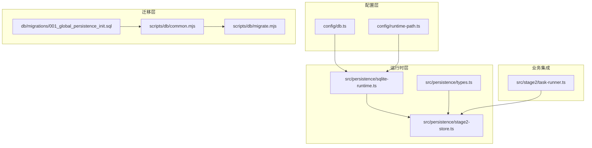
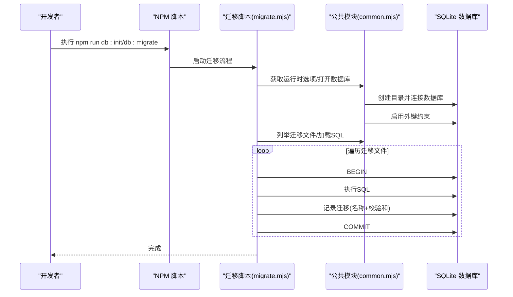
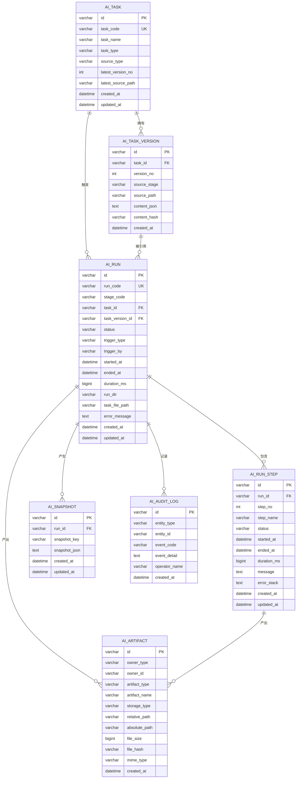
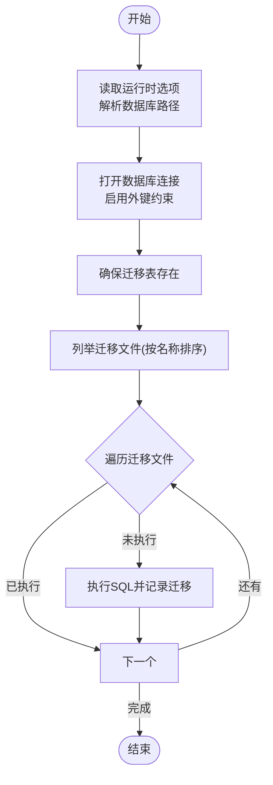
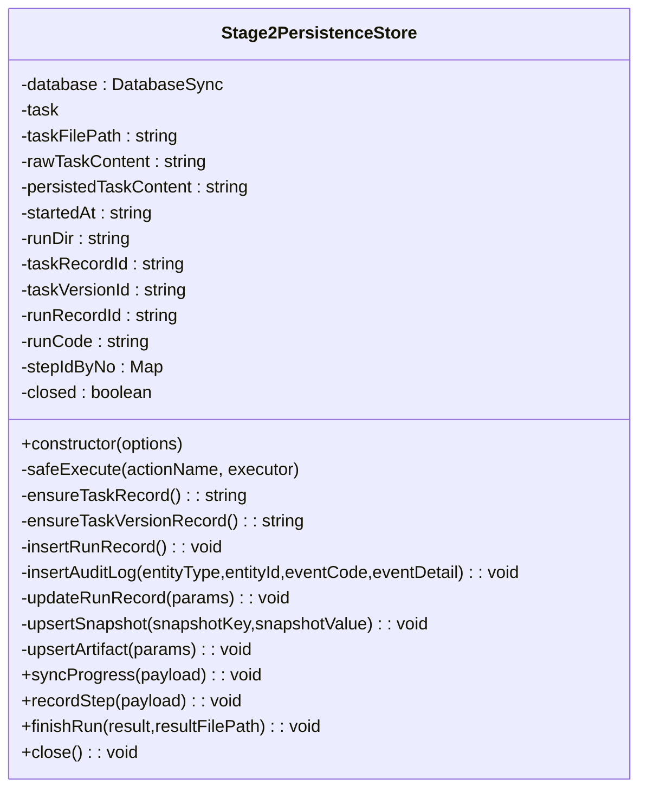
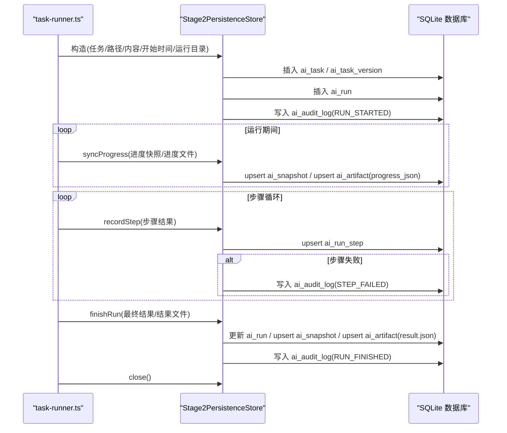
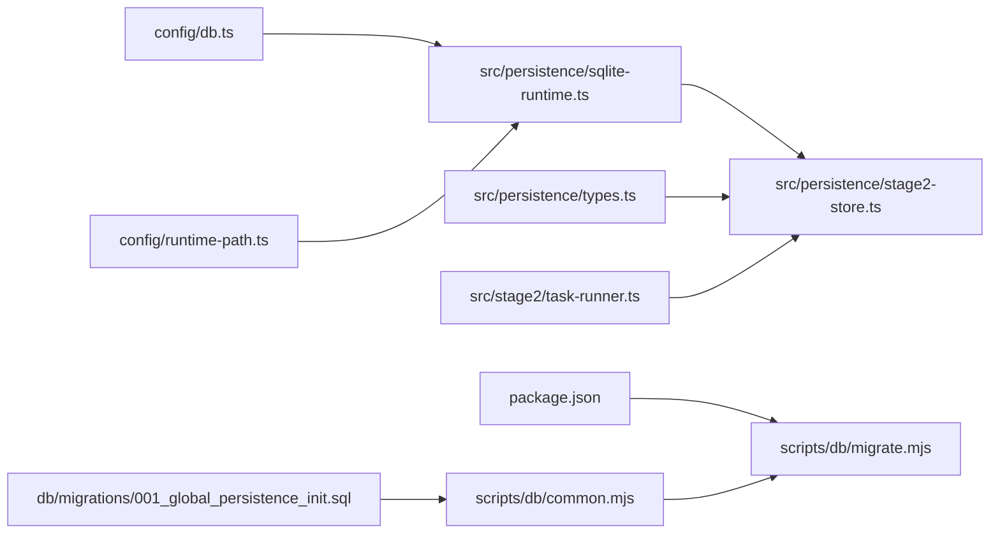

# 数据持久化架构

<cite>
**本文引用的文件**
- [config/db.ts](file://config/db.ts)
- [config/runtime-path.ts](file://config/runtime-path.ts)
- [db/migrations/001_global_persistence_init.sql](file://db/migrations/001_global_persistence_init.sql)
- [scripts/db/common.mjs](file://scripts/db/common.mjs)
- [scripts/db/migrate.mjs](file://scripts/db/migrate.mjs)
- [src/persistence/sqlite-runtime.ts](file://src/persistence/sqlite-runtime.ts)
- [src/persistence/types.ts](file://src/persistence/types.ts)
- [src/persistence/stage2-store.ts](file://src/persistence/stage2-store.ts)
- [src/stage2/task-runner.ts](file://src/stage2/task-runner.ts)
- [package.json](file://package.json)
- [README.md](file://README.md)
</cite>

## 目录
1. [简介](#简介)
2. [项目结构](#项目结构)
3. [核心组件](#核心组件)
4. [架构总览](#架构总览)
5. [详细组件分析](#详细组件分析)
6. [依赖关系分析](#依赖关系分析)
7. [性能考量](#性能考量)
8. [故障排查指南](#故障排查指南)
9. [结论](#结论)
10. [附录](#附录)

## 简介
本项目构建了基于 SQLite 的全局数据持久化底座，用于承载 AI 自动化测试的运行数据。数据库采用本地单文件 SQLite，表结构按 MySQL 兼容子集设计，便于未来平滑迁移到 MySQL。核心覆盖任务、版本、运行、步骤、快照、附件与审计日志等维度，配合文件系统实现“结构化元数据+相对路径”的大文件协作模式。

## 项目结构
围绕数据持久化的关键目录与文件：
- 配置层：数据库驱动与路径解析、运行时目录配置
- 迁移层：SQL 迁移脚本与迁移执行脚本
- 运行时层：SQLite 连接、迁移应用、数据模型与写库服务
- 业务集成：第二阶段执行器对接持久化服务

图表来源
- [config/db.ts:1-28](file://config/db.ts#L1-L28)
- [config/runtime-path.ts:1-41](file://config/runtime-path.ts#L1-L41)
- [db/migrations/001_global_persistence_init.sql:1-128](file://db/migrations/001_global_persistence_init.sql#L1-L128)
- [scripts/db/common.mjs:1-108](file://scripts/db/common.mjs#L1-L108)
- [scripts/db/migrate.mjs:1-52](file://scripts/db/migrate.mjs#L1-L52)
- [src/persistence/sqlite-runtime.ts:1-116](file://src/persistence/sqlite-runtime.ts#L1-L116)
- [src/persistence/types.ts:1-125](file://src/persistence/types.ts#L1-L125)
- [src/persistence/stage2-store.ts:1-655](file://src/persistence/stage2-store.ts#L1-L655)
- [src/stage2/task-runner.ts:2332-2656](file://src/stage2/task-runner.ts#L2332-L2656)

章节来源
- [README.md:97-131](file://README.md#L97-L131)
- [package.json:6-11](file://package.json#L6-L11)

## 核心组件
- 数据库配置与路径解析：负责读取环境变量、解析数据库文件路径与运行时目录前缀。
- 迁移管理：提供迁移脚本发现、执行、校验与记录，确保幂等与可追溯。
- SQLite 运行时：封装数据库连接、外键约束启用、迁移表保证与迁移应用。
- 数据模型：定义任务、版本、运行、步骤、快照、附件、审计日志的领域模型。
- Stage2 写库服务：面向第二阶段执行器的数据写入与更新，含进度快照、步骤明细、结果与附件路径。
- 业务集成：在第二阶段执行器中注入持久化服务，贯穿运行生命周期的关键节点。

章节来源
- [config/db.ts:15-26](file://config/db.ts#L15-L26)
- [scripts/db/common.mjs:31-41](file://scripts/db/common.mjs#L31-L41)
- [src/persistence/sqlite-runtime.ts:73-84](file://src/persistence/sqlite-runtime.ts#L73-L84)
- [src/persistence/types.ts:34-123](file://src/persistence/types.ts#L34-L123)
- [src/persistence/stage2-store.ts:74-123](file://src/persistence/stage2-store.ts#L74-L123)
- [src/stage2/task-runner.ts:2342-2348](file://src/stage2/task-runner.ts#L2342-L2348)

## 架构总览
整体架构遵循“配置-迁移-运行时-业务”的分层设计，通过环境变量与运行时目录统一管理数据库文件与产物目录，迁移脚本与运行时自动应用确保数据库结构一致，业务侧通过 Stage2 写库服务在运行生命周期内进行结构化数据落库。

图表来源
- [scripts/db/migrate.mjs:12-51](file://scripts/db/migrate.mjs#L12-L51)
- [scripts/db/common.mjs:47-58](file://scripts/db/common.mjs#L47-L58)
- [scripts/db/common.mjs:71-86](file://scripts/db/common.mjs#L71-L86)
- [scripts/db/common.mjs:97-106](file://scripts/db/common.mjs#L97-L106)

## 详细组件分析

### 数据库表结构与字段定义
- ai_task：任务主表，包含任务编码、名称、类型、来源类型、最新版本号与最新源路径，以及时间戳。
- ai_task_version：任务版本表，关联任务主表，记录版本号、来源阶段、源路径、内容 JSON 与内容哈希，防止重复版本入库。
- ai_run：运行主表，记录运行编码、阶段代码、任务与版本引用、运行状态、触发信息、起止时间、耗时、运行目录与任务文件路径、错误信息，以及时间戳。
- ai_run_step：运行步骤明细，记录步骤序号、名称、状态、起止时间、耗时、消息与错误堆栈，以及时间戳。
- ai_snapshot：结构化快照，按运行与键名存储 JSON 文本，用于保存中间态与最终结果摘要。
- ai_artifact：附件元数据，记录拥有者类型/ID、附件类型、名称、存储类型（当前为本地文件）、相对/绝对路径、大小、哈希与 MIME 类型。
- ai_audit_log：审计日志，记录实体类型/ID、事件码、事件详情与操作者，以及时间戳。

图表来源
- [db/migrations/001_global_persistence_init.sql:1-128](file://db/migrations/001_global_persistence_init.sql#L1-L128)

章节来源
- [db/migrations/001_global_persistence_init.sql:1-128](file://db/migrations/001_global_persistence_init.sql#L1-L128)

### 索引策略与查询优化
- ai_task：按任务名称建立索引，便于按名称检索。
- ai_run：复合索引覆盖任务+阶段+时间，支持按阶段筛选与时间排序；另按阶段+状态+时间索引，便于状态统计与时间序列查询。
- ai_run_step：按运行+状态索引，便于快速定位某次运行的失败步骤或状态分布。
- ai_artifact：按拥有者类型/ID与附件类型+时间索引，便于按对象聚合与按类型检索。
- ai_audit_log：按实体+时间索引，便于审计追踪与时间窗口查询。

这些索引设计与字段选择有助于在中小规模数据下提升查询效率，并为后续扩展提供基础。

章节来源
- [db/migrations/001_global_persistence_init.sql:120-126](file://db/migrations/001_global_persistence_init.sql#L120-L126)

### 数据模型设计原则
- 主键与唯一性：采用统一的持久化 ID 前缀与随机字节组合，保证全局唯一性；多处使用唯一约束避免重复数据。
- 引用完整性：通过外键约束维护任务-版本-运行-步骤的层级关系，删除策略按业务需求设定（如运行删除时版本引用置空）。
- 元数据与文件分离：数据库仅存储结构化元数据与文件相对路径，不直接存储大文件二进制，降低数据库体积与 IO 压力。
- 敏感信息保护：任务 JSON 内容入库前对敏感字段做掩码处理，保留原始文件路径以便溯源。

章节来源
- [src/persistence/stage2-store.ts:37-48](file://src/persistence/stage2-store.ts#L37-L48)
- [src/persistence/stage2-store.ts:115-121](file://src/persistence/stage2-store.ts#L115-L121)

### 迁移管理与版本控制
- 迁移脚本：位于 db/migrations，初始版本为 001_global_persistence_init.sql，包含表结构与索引。
- 迁移执行：通过 scripts/db/migrate.mjs 与 scripts/db/common.mjs 实现，具备幂等性与校验和记录。
- 迁移表：schema_migrations 记录已执行的迁移名称、校验和与执行时间，避免重复执行。
- 自动应用：运行时通过 applyPendingMigrations 自动发现并应用未执行的迁移，无需手动初始化。

图表来源
- [scripts/db/migrate.mjs:15-46](file://scripts/db/migrate.mjs#L15-L46)
- [scripts/db/common.mjs:60-69](file://scripts/db/common.mjs#L60-L69)
- [scripts/db/common.mjs:71-86](file://scripts/db/common.mjs#L71-L86)
- [scripts/db/common.mjs:97-106](file://scripts/db/common.mjs#L97-L106)

章节来源
- [scripts/db/migrate.mjs:1-52](file://scripts/db/migrate.mjs#L1-L52)
- [scripts/db/common.mjs:1-108](file://scripts/db/common.mjs#L1-L108)
- [src/persistence/sqlite-runtime.ts:86-114](file://src/persistence/sqlite-runtime.ts#L86-L114)

### 与文件系统的协作模式与大文件处理
- 相对路径策略：通过 toRelativeProjectPath 将绝对路径转换为相对于项目根的相对路径，便于跨机器迁移与可移植性。
- 附件元数据：ai_artifact 存储文件大小、哈希与 MIME 类型，结合相对/绝对路径实现对产物的元数据化管理。
- 大文件不入库：数据库仅存元数据与路径，不直接存储大文件二进制，降低数据库体积与备份成本。
- 产物目录：运行产物（截图、报告、结果文件）统一收敛到 t_runtime 目录，便于运维与清理。

章节来源
- [src/persistence/sqlite-runtime.ts:32-41](file://src/persistence/sqlite-runtime.ts#L32-L41)
- [src/persistence/stage2-store.ts:397-468](file://src/persistence/stage2-store.ts#L397-L468)
- [README.md:76-96](file://README.md#L76-L96)

### Stage2 写库服务（类图）
Stage2PersistenceStore 负责在运行生命周期内写入任务、版本、运行、步骤、快照与附件，并记录审计日志。

图表来源
- [src/persistence/stage2-store.ts:74-641](file://src/persistence/stage2-store.ts#L74-L641)

章节来源
- [src/persistence/stage2-store.ts:74-641](file://src/persistence/stage2-store.ts#L74-L641)

### 生命周期写库流程（时序图）
在第二阶段执行器中，持久化服务在运行启动、每步结束与最终结果落盘三个关键节点写库。

图表来源
- [src/stage2/task-runner.ts:2342-2348](file://src/stage2/task-runner.ts#L2342-L2348)
- [src/stage2/task-runner.ts:2350-2378](file://src/stage2/task-runner.ts#L2350-L2378)
- [src/stage2/task-runner.ts:2636-2656](file://src/stage2/task-runner.ts#L2636-L2656)
- [src/persistence/stage2-store.ts:470-493](file://src/persistence/stage2-store.ts#L470-L493)
- [src/persistence/stage2-store.ts:495-590](file://src/persistence/stage2-store.ts#L495-L590)
- [src/persistence/stage2-store.ts:592-630](file://src/persistence/stage2-store.ts#L592-L630)

## 依赖关系分析
- 配置依赖：config/db.ts 与 config/runtime-path.ts 提供数据库与运行时目录的环境变量解析。
- 迁移依赖：scripts/db/common.mjs 与 scripts/db/migrate.mjs 依赖配置与文件系统，负责迁移发现、执行与记录。
- 运行时依赖：src/persistence/sqlite-runtime.ts 依赖 node:sqlite，负责数据库连接与迁移应用。
- 业务依赖：src/persistence/stage2-store.ts 依赖运行时与类型定义，面向第二阶段执行器提供写库服务。
- 包脚本：package.json 中的 db:init/db:migrate 脚本调用迁移脚本。

图表来源
- [package.json:6-11](file://package.json#L6-L11)
- [config/db.ts:1-28](file://config/db.ts#L1-L28)
- [config/runtime-path.ts:1-41](file://config/runtime-path.ts#L1-L41)
- [db/migrations/001_global_persistence_init.sql:1-128](file://db/migrations/001_global_persistence_init.sql#L1-L128)
- [scripts/db/common.mjs:1-108](file://scripts/db/common.mjs#L1-L108)
- [scripts/db/migrate.mjs:1-52](file://scripts/db/migrate.mjs#L1-L52)
- [src/persistence/sqlite-runtime.ts:1-116](file://src/persistence/sqlite-runtime.ts#L1-L116)
- [src/persistence/types.ts:1-125](file://src/persistence/types.ts#L1-L125)
- [src/persistence/stage2-store.ts:1-655](file://src/persistence/stage2-store.ts#L1-L655)
- [src/stage2/task-runner.ts:2332-2656](file://src/stage2/task-runner.ts#L2332-L2656)

章节来源
- [package.json:6-11](file://package.json#L6-L11)
- [src/persistence/stage2-store.ts:101-123](file://src/persistence/stage2-store.ts#L101-L123)

## 性能考量
- 查询优化：针对高频查询建立复合索引，如 ai_run 的任务+阶段+时间、状态+时间等，减少全表扫描。
- 写入批量化：在业务侧尽量合并写入，避免频繁小事务；当前实现按步骤与进度节点写入，符合实时性要求。
- 大文件分离：数据库仅存元数据与路径，避免大文件带来的 IO 与锁竞争。
- 外键约束：启用外键约束保障一致性，但可能带来写入时的额外校验成本，建议在批量导入时临时关闭（当前脚本未做此处理，维持一致性优先）。
- 迁移幂等：通过迁移表与校验和确保重复执行不会破坏结构，减少运维风险。

## 故障排查指南
- 迁移失败：检查迁移 SQL 是否正确、数据库文件权限是否允许写入、是否启用了 SQLite 实验特性（脚本中需要 --experimental-sqlite）。
- 迁移重复执行：确认 schema_migrations 表是否存在重复记录，必要时清理或修复。
- 数据库连接问题：确认 DB_FILE_PATH 解析路径有效、目录存在且可写。
- 写库异常：Stage2 写库服务对每个写入节点包裹 try/catch 并记录错误日志，不影响主流程执行；可在日志中定位具体失败节点。
- 大文件路径问题：确认 toRelativeProjectPath 返回值非空，避免相对路径不可达。

章节来源
- [scripts/db/migrate.mjs:15-46](file://scripts/db/migrate.mjs#L15-L46)
- [src/persistence/stage2-store.ts:125-133](file://src/persistence/stage2-store.ts#L125-L133)
- [src/persistence/sqlite-runtime.ts:73-84](file://src/persistence/sqlite-runtime.ts#L73-L84)

## 结论
本数据持久化架构以 SQLite 为基础，通过标准化的迁移管理与运行时自动应用机制，实现了任务、版本、运行、步骤、快照、附件与审计日志的完整数据闭环。配合文件系统的大文件协作模式，既保证了结构化数据的可查询性与可追溯性，又避免了数据库膨胀与运维复杂度。后续可在此基础上平滑迁移到 MySQL，并进一步扩展查询与统计能力。

## 附录
- 数据库初始化与迁移命令
  - 初始化数据库：npm run db:init
  - 执行迁移：npm run db:migrate
- 关键环境变量
  - DB_DRIVER：数据库驱动（当前仅支持 sqlite）
  - DB_FILE_PATH：数据库文件路径（默认 t_runtime/db/hi_test.sqlite）
  - RUNTIME_DIR_PREFIX：运行时目录前缀（默认 t_runtime/）
  - PLAYWRIGHT_OUTPUT_DIR、PLAYWRIGHT_HTML_REPORT_DIR、MIDSCENE_RUN_DIR、ACCEPTANCE_RESULT_DIR：各类产物目录
- 运行产物目录
  - t_runtime/test-results、t_runtime/playwright-report、t_runtime/midscene_run、t_runtime/acceptance-results、t_runtime/db/hi_test.sqlite

章节来源
- [README.md:39-54](file://README.md#L39-L54)
- [README.md:76-96](file://README.md#L76-L96)
- [README.md:120-130](file://README.md#L120-L130)
- [package.json:6-11](file://package.json#L6-L11)