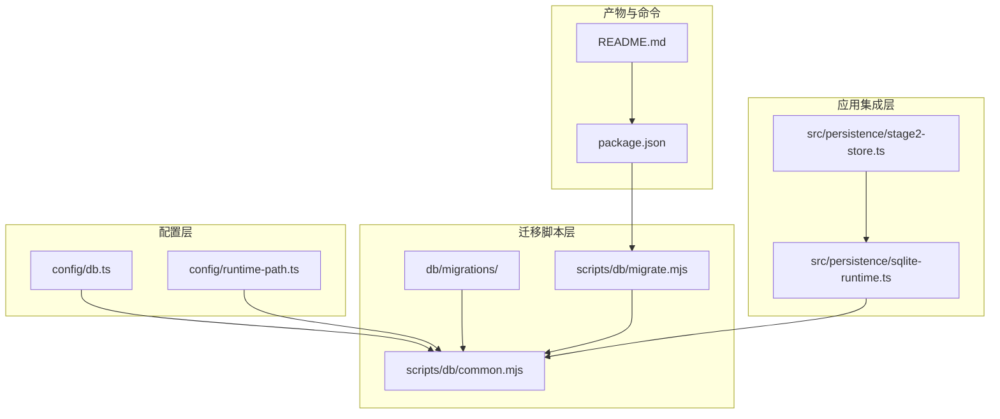
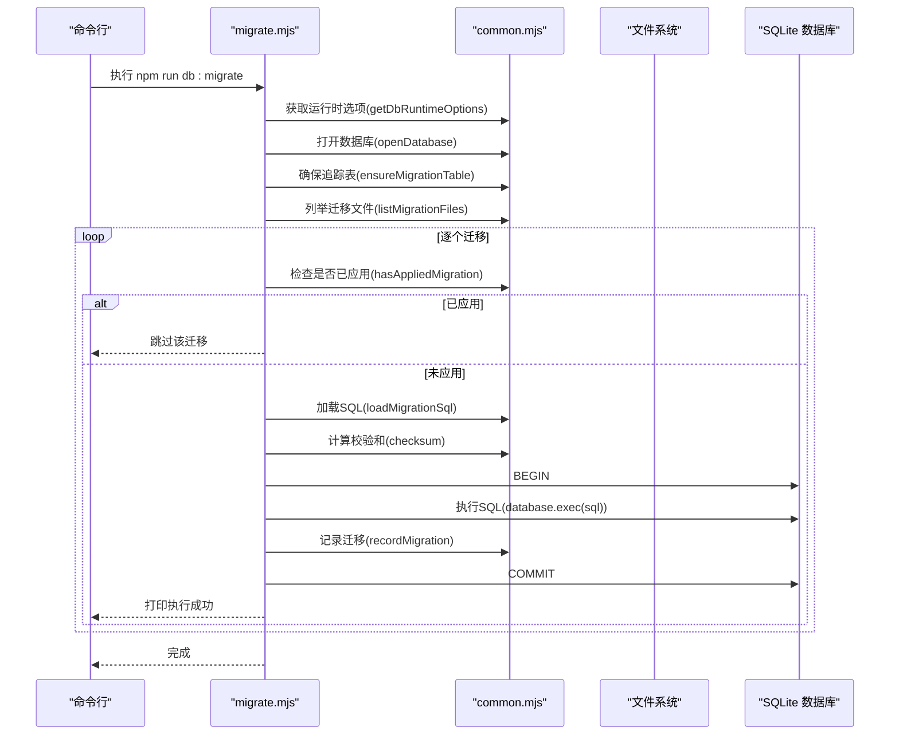
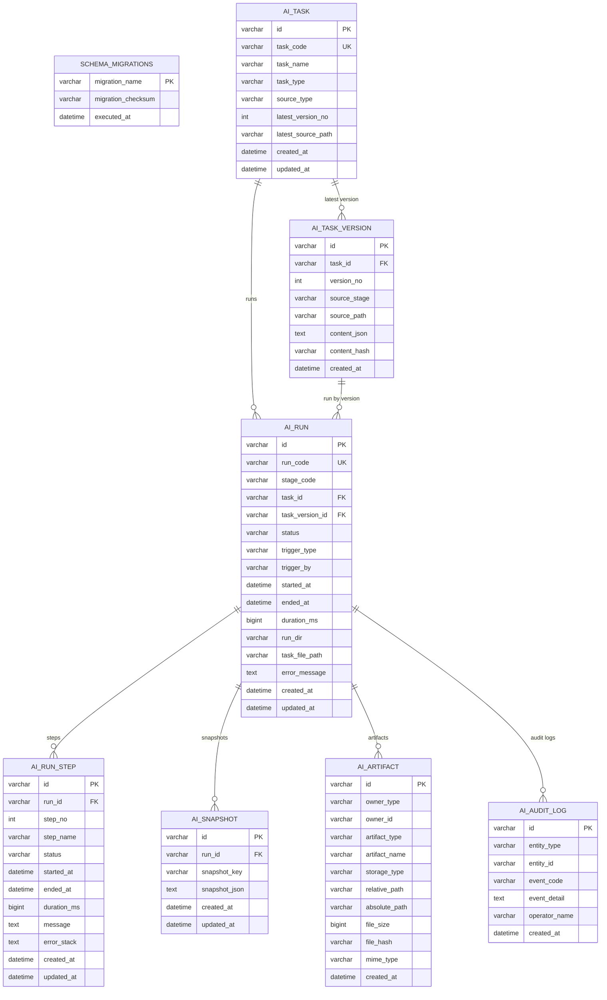
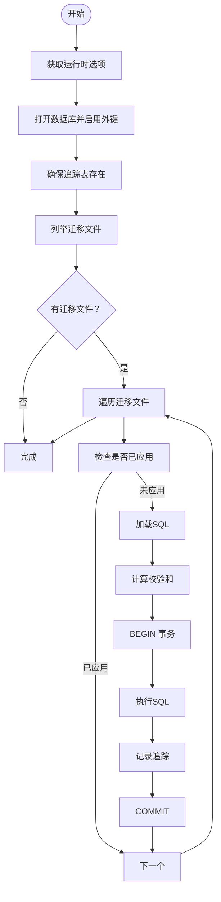
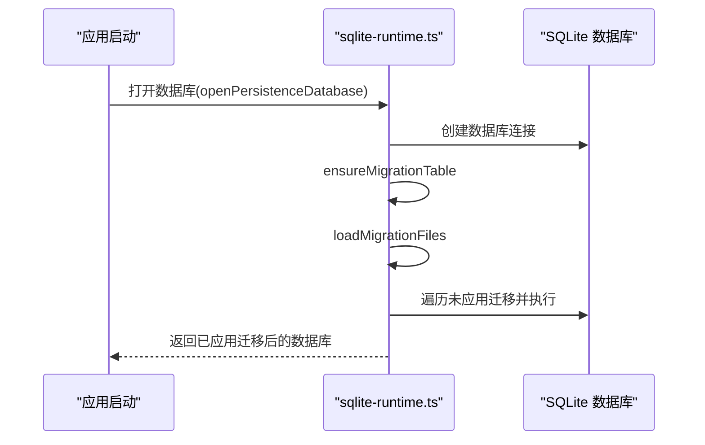
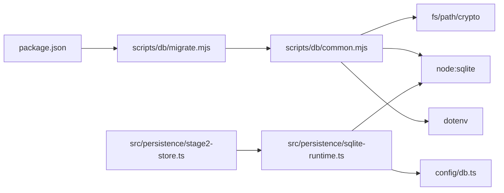

# 迁移管理

<cite>
**本文引用的文件**
- [001_global_persistence_init.sql](file://db/migrations/001_global_persistence_init.sql)
- [migrate.mjs](file://scripts/db/migrate.mjs)
- [common.mjs](file://scripts/db/common.mjs)
- [db.ts](file://config/db.ts)
- [runtime-path.ts](file://config/runtime-path.ts)
- [sqlite-runtime.ts](file://src/persistence/sqlite-runtime.ts)
- [stage2-store.ts](file://src/persistence/stage2-store.ts)
- [package.json](file://package.json)
- [README.md](file://README.md)
</cite>

## 目录
1. [简介](#简介)
2. [项目结构](#项目结构)
3. [核心组件](#核心组件)
4. [架构总览](#架构总览)
5. [详细组件分析](#详细组件分析)
6. [依赖关系分析](#依赖关系分析)
7. [性能考量](#性能考量)
8. [故障排查指南](#故障排查指南)
9. [结论](#结论)
10. [附录](#附录)

## 简介
本文件面向数据库迁移管理，系统性说明本项目的版本控制与迁移机制，覆盖迁移脚本的组织结构与命名规范、初始数据库结构创建流程、迁移执行流程、迁移状态跟踪与版本管理策略、迁移脚本编写规范与测试方法、回滚机制、迁移命令使用指南以及从旧版本升级到新版本的数据迁移策略与兼容性处理。文档同时提供可视化图示与实操指引，帮助开发者快速上手并稳定维护数据库结构演进。

## 项目结构
本项目采用“脚本驱动 + 配置驱动”的迁移体系，核心文件分布如下：
- 迁移脚本目录：db/migrations（存放 SQL 迁移文件）
- 迁移执行脚本：scripts/db/migrate.mjs（命令行入口）
- 迁移公共逻辑：scripts/db/common.mjs（通用函数封装）
- 数据库配置：config/db.ts（驱动与路径解析）
- 运行时路径配置：config/runtime-path.ts（运行产物目录前缀）
- 应用内迁移集成：src/persistence/sqlite-runtime.ts（应用启动时自动应用未执行的迁移）
- 运行期持久化写库：src/persistence/stage2-store.ts（在执行阶段写入结构化数据）
- 包脚本：package.json（db:init、db:migrate 命令）
- 文档与使用说明：README.md（命令与产物目录）

图表来源
- [migrate.mjs:1-52](file://scripts/db/migrate.mjs#L1-L52)
- [common.mjs:1-108](file://scripts/db/common.mjs#L1-L108)
- [db.ts:1-28](file://config/db.ts#L1-L28)
- [runtime-path.ts:1-41](file://config/runtime-path.ts#L1-L41)
- [sqlite-runtime.ts:1-116](file://src/persistence/sqlite-runtime.ts#L1-L116)
- [stage2-store.ts:1-655](file://src/persistence/stage2-store.ts#L1-L655)
- [package.json:1-26](file://package.json#L1-L26)
- [README.md:1-223](file://README.md#L1-L223)

章节来源
- [migrate.mjs:1-52](file://scripts/db/migrate.mjs#L1-L52)
- [common.mjs:1-108](file://scripts/db/common.mjs#L1-L108)
- [db.ts:1-28](file://config/db.ts#L1-L28)
- [runtime-path.ts:1-41](file://config/runtime-path.ts#L1-L41)
- [sqlite-runtime.ts:1-116](file://src/persistence/sqlite-runtime.ts#L1-L116)
- [stage2-store.ts:1-655](file://src/persistence/stage2-store.ts#L1-L655)
- [package.json:1-26](file://package.json#L1-L26)
- [README.md:1-223](file://README.md#L1-L223)

## 核心组件
- 迁移脚本组织与命名
  - 存放位置：db/migrations
  - 命名规范：采用“序号_功能描述.sql”，如 001_global_persistence_init.sql，确保自然排序即执行顺序
  - 内容要求：每个 SQL 文件应包含完整的 DDL/DML，并具备幂等性（重复执行不破坏一致性）
- 迁移执行引擎
  - 命令行入口：scripts/db/migrate.mjs
  - 核心逻辑：扫描 db/migrations，逐个加载 SQL，计算内容校验和，按顺序执行并记录到 schema_migrations
- 状态跟踪与版本管理
  - 追踪表：schema_migrations（记录 migration_name、migration_checksum、executed_at）
  - 版本策略：通过 migration_name 唯一标识迁移；通过 migration_checksum 验证脚本内容一致性
- 数据库配置与路径
  - 驱动与文件路径：config/db.ts 读取环境变量 DB_DRIVER、DB_FILE_PATH
  - 运行时目录前缀：config/runtime-path.ts 读取 RUNTIME_DIR_PREFIX
- 应用内迁移集成
  - 启动时自动应用：src/persistence/sqlite-runtime.ts 在打开数据库后自动应用未执行的迁移
  - 执行时机：Stage2 执行器初始化持久化存储时触发

章节来源
- [001_global_persistence_init.sql:1-128](file://db/migrations/001_global_persistence_init.sql#L1-L128)
- [migrate.mjs:1-52](file://scripts/db/migrate.mjs#L1-L52)
- [common.mjs:60-106](file://scripts/db/common.mjs#L60-L106)
- [db.ts:1-28](file://config/db.ts#L1-L28)
- [runtime-path.ts:1-41](file://config/runtime-path.ts#L1-L41)
- [sqlite-runtime.ts:86-114](file://src/persistence/sqlite-runtime.ts#L86-L114)

## 架构总览
迁移系统由“配置解析—脚本扫描—SQL执行—状态记录”构成闭环，既支持命令行手动执行，也支持应用启动时自动应用。

图表来源
- [migrate.mjs:12-51](file://scripts/db/migrate.mjs#L12-L51)
- [common.mjs:31-106](file://scripts/db/common.mjs#L31-L106)

章节来源
- [migrate.mjs:1-52](file://scripts/db/migrate.mjs#L1-L52)
- [common.mjs:1-108](file://scripts/db/common.mjs#L1-L108)

## 详细组件分析

### 组件A：迁移脚本与追踪表
- 迁移脚本组织
  - db/migrations/001_global_persistence_init.sql 创建了 ai_task、ai_task_version、ai_run、ai_run_step、ai_snapshot、ai_artifact、ai_audit_log 等核心表，以及若干索引
  - 命名与编号：采用 001_ 前缀，便于排序与版本演进
- 追踪表 schema_migrations
  - 字段：migration_name（唯一）、migration_checksum（脚本内容校验和）、executed_at（执行时间）
  - 作用：保证幂等执行与一致性校验

图表来源
- [001_global_persistence_init.sql:1-128](file://db/migrations/001_global_persistence_init.sql#L1-L128)

章节来源
- [001_global_persistence_init.sql:1-128](file://db/migrations/001_global_persistence_init.sql#L1-L128)
- [common.mjs:60-106](file://scripts/db/common.mjs#L60-L106)

### 组件B：迁移执行流程（命令行）
- 关键步骤
  - 解析运行时选项（驱动、数据库文件路径、迁移目录）
  - 打开数据库并启用外键约束
  - 确保 schema_migrations 表存在
  - 列举并按序执行未应用的迁移
  - 对每个迁移：加载 SQL、计算校验和、事务执行、记录追踪
- 错误处理
  - 单个迁移失败时回滚事务并抛出异常
  - 最终关闭数据库连接

图表来源
- [migrate.mjs:15-51](file://scripts/db/migrate.mjs#L15-L51)
- [common.mjs:71-106](file://scripts/db/common.mjs#L71-L106)

章节来源
- [migrate.mjs:1-52](file://scripts/db/migrate.mjs#L1-L52)
- [common.mjs:1-108](file://scripts/db/common.mjs#L1-L108)

### 组件C：应用内迁移集成
- 打开数据库时自动应用未执行的迁移
  - 在应用启动阶段调用 applyPendingMigrations，确保数据库结构与迁移脚本一致
- 与运行期持久化写库协同
  - Stage2 执行器在初始化持久化存储时触发迁移应用，随后写入运行、步骤、快照、附件等结构化数据

图表来源
- [sqlite-runtime.ts:73-114](file://src/persistence/sqlite-runtime.ts#L73-L114)

章节来源
- [sqlite-runtime.ts:1-116](file://src/persistence/sqlite-runtime.ts#L1-L116)
- [stage2-store.ts:101-123](file://src/persistence/stage2-store.ts#L101-L123)

### 组件D：迁移脚本编写规范与测试方法
- 编写规范
  - 命名：使用“序号_功能描述.sql”，序号递增，确保自然排序即执行顺序
  - 幂等性：DDL/DML 必须可重复执行而不破坏一致性
  - 事务性：单个迁移内的多条 SQL 放入事务，失败回滚
  - 校验和：通过 checksum 校验脚本内容，避免内容被意外修改
  - 外键：必要时显式开启外键约束（已在数据库打开时设置）
- 测试方法
  - 命令行测试：npm run db:migrate 执行迁移，观察输出与数据库状态
  - 应用内测试：启动应用或执行 Stage2 执行器，确认迁移已应用且表结构正确
  - 回滚验证：通过重新执行迁移或手动回滚脚本验证一致性（见回滚机制）

章节来源
- [migrate.mjs:25-45](file://scripts/db/migrate.mjs#L25-L45)
- [common.mjs:27-29](file://scripts/db/common.mjs#L27-L29)
- [sqlite-runtime.ts:86-114](file://src/persistence/sqlite-runtime.ts#L86-L114)

### 组件E：回滚机制
- 现状说明
  - 当前实现为“向前迁移”，未提供内置回滚脚本
  - 若需回滚，建议：
    - 新增逆向迁移脚本（例如将变更还原为上一个版本）
    - 或在生产环境使用备份恢复策略
- 建议
  - 为每个迁移提供对应的逆向脚本，纳入版本控制
  - 在执行回滚前备份数据库

章节来源
- [migrate.mjs:41-44](file://scripts/db/migrate.mjs#L41-L44)
- [common.mjs:97-106](file://scripts/db/common.mjs#L97-L106)

## 依赖关系分析
- 配置依赖
  - config/db.ts 与 config/runtime-path.ts 提供 DB_DRIVER、DB_FILE_PATH、RUNTIME_DIR_PREFIX 等环境变量解析
- 脚本依赖
  - scripts/db/common.mjs 依赖 dotenv、fs、path、crypto、node:sqlite
  - scripts/db/migrate.mjs 依赖 common.mjs 中的函数
- 应用依赖
  - src/persistence/sqlite-runtime.ts 依赖 config/db.ts 与 node:sqlite
  - src/persistence/stage2-store.ts 依赖 sqlite-runtime.ts

图表来源
- [package.json:6-11](file://package.json#L6-L11)
- [migrate.mjs:1-10](file://scripts/db/migrate.mjs#L1-L10)
- [common.mjs:1-7](file://scripts/db/common.mjs#L1-L7)
- [db.ts:1-5](file://config/db.ts#L1-L5)
- [sqlite-runtime.ts:1-5](file://src/persistence/sqlite-runtime.ts#L1-L5)
- [stage2-store.ts:1-13](file://src/persistence/stage2-store.ts#L1-L13)

章节来源
- [package.json:1-26](file://package.json#L1-L26)
- [migrate.mjs:1-10](file://scripts/db/migrate.mjs#L1-L10)
- [common.mjs:1-7](file://scripts/db/common.mjs#L1-L7)
- [db.ts:1-5](file://config/db.ts#L1-L5)
- [sqlite-runtime.ts:1-5](file://src/persistence/sqlite-runtime.ts#L1-L5)
- [stage2-store.ts:1-13](file://src/persistence/stage2-store.ts#L1-L13)

## 性能考量
- 迁移执行
  - 单个迁移使用事务包裹，失败回滚，避免部分执行导致的中间态
  - 迁移文件按名称排序，避免并发冲突
- 数据库连接
  - 打开数据库时启用外键约束，确保参照完整性
- I/O 与索引
  - 初始迁移脚本包含若干索引，有助于查询性能
- 建议
  - 大型迁移拆分为多个小迁移，降低单次执行时间
  - 在生产环境执行迁移前进行备份

[本节为通用指导，无需特定文件引用]

## 故障排查指南
- 常见问题与定位
  - 未找到迁移文件：检查 db/migrations 目录是否存在且包含 .sql 文件
  - 驱动不支持：当前脚本仅支持 sqlite，若 DB_DRIVER 非 sqlite 将报错
  - 数据库文件路径错误：检查 DB_FILE_PATH 与 RUNTIME_DIR_PREFIX 是否正确
  - 外键约束失败：确认迁移脚本中外键定义与依赖顺序正确
  - 迁移重复执行：通过 schema_migrations 校验 migration_name 是否已存在
- 排查步骤
  - 查看命令行输出，确认执行顺序与跳过的迁移
  - 检查数据库中 schema_migrations 表记录
  - 验证目标表结构与索引是否创建成功
  - 如需回滚，建议新增逆向迁移脚本或使用备份恢复

章节来源
- [migrate.mjs:19-30](file://scripts/db/migrate.mjs#L19-L30)
- [common.mjs:47-58](file://scripts/db/common.mjs#L47-L58)
- [common.mjs:88-95](file://scripts/db/common.mjs#L88-L95)

## 结论
本项目采用简洁可靠的迁移机制：命令行脚本与应用内集成双通道，结合 schema_migrations 追踪表实现幂等执行与一致性校验。通过严格的命名规范、事务执行与校验和机制，确保迁移过程可控、可追溯。建议在后续版本中补充逆向迁移脚本与更完善的回滚策略，以增强生产环境的可维护性与安全性。

[本节为总结，无需特定文件引用]

## 附录

### 迁移命令使用指南
- 初始化数据库
  - npm run db:init
- 执行迁移
  - npm run db:migrate
- 环境变量
  - DB_DRIVER：数据库驱动（当前仅支持 sqlite）
  - DB_FILE_PATH：数据库文件路径（默认 t_runtime/db/hi_test.sqlite）
  - RUNTIME_DIR_PREFIX：运行时目录前缀（默认 t_runtime/）

章节来源
- [package.json:6-11](file://package.json#L6-L11)
- [README.md:120-130](file://README.md#L120-L130)
- [db.ts:20-26](file://config/db.ts#L20-L26)
- [runtime-path.ts:13-16](file://config/runtime-path.ts#L13-L16)

### 从旧版本升级到新版本的数据迁移策略与兼容性处理
- 策略建议
  - 新增迁移脚本：将结构变更与数据转换放入新的迁移文件，保持幂等性
  - 兼容性处理：尽量避免破坏性变更；如需破坏性变更，提供数据迁移与回退方案
  - 版本演进：通过序号递增的命名规范，确保迁移顺序与版本对应
- 实施要点
  - 在应用启动时自动应用未执行的迁移，确保部署后数据库结构一致
  - 对敏感数据（如密码）在入库时进行脱敏处理，保护隐私

章节来源
- [001_global_persistence_init.sql:188-260](file://db/migrations/001_global_persistence_init.sql#L188-L260)
- [stage2-store.ts:37-48](file://src/persistence/stage2-store.ts#L37-L48)
- [sqlite-runtime.ts:86-114](file://src/persistence/sqlite-runtime.ts#L86-L114)