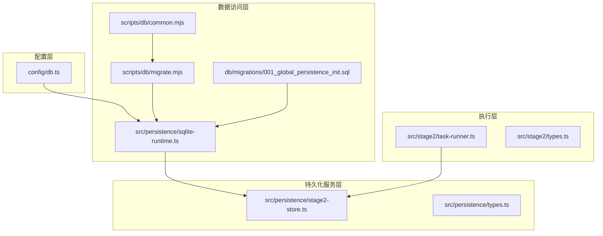
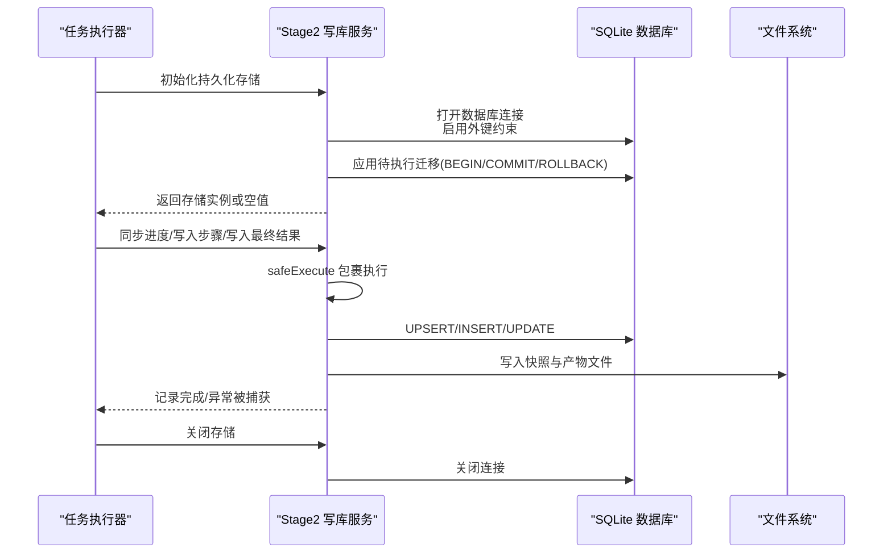
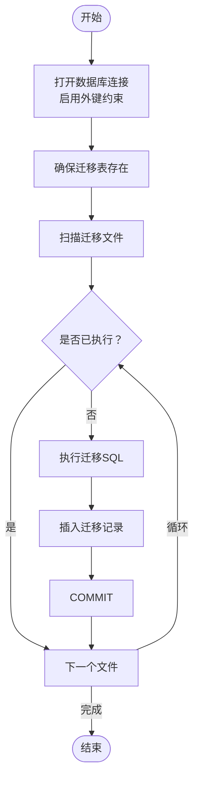
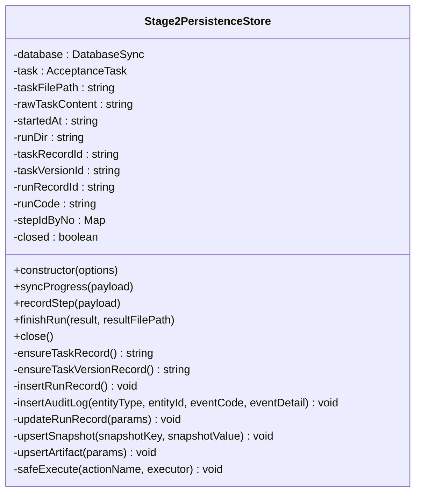
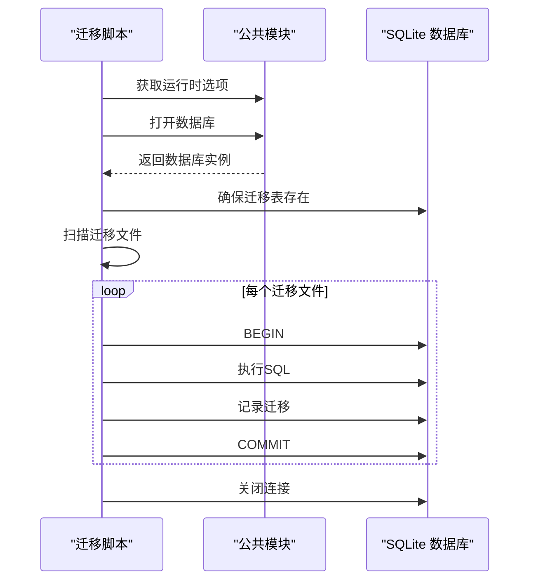
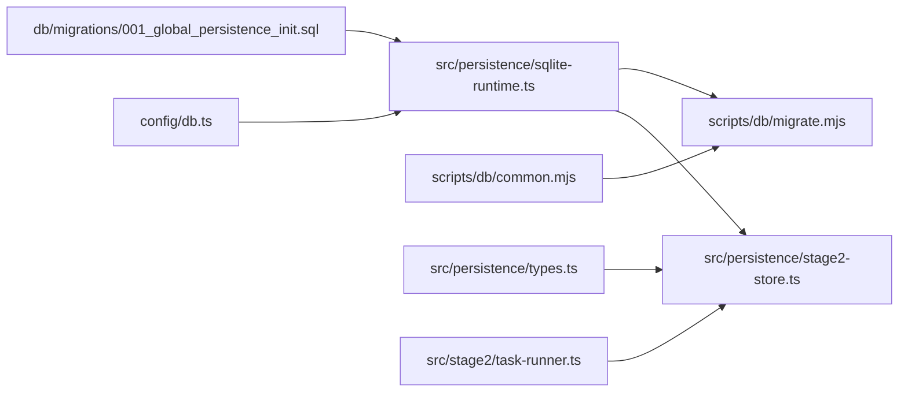

# 事务和错误处理

<cite>
**本文引用的文件**
- [sqlite-runtime.ts](file://src/persistence/sqlite-runtime.ts)
- [stage2-store.ts](file://src/persistence/stage2-store.ts)
- [types.ts](file://src/persistence/types.ts)
- [db.ts](file://config/db.ts)
- [migrate.mjs](file://scripts/db/migrate.mjs)
- [common.mjs](file://scripts/db/common.mjs)
- [001_global_persistence_init.sql](file://db/migrations/001_global_persistence_init.sql)
- [task-runner.ts](file://src/stage2/task-runner.ts)
- [types.ts](file://src/stage2/types.ts)
</cite>

## 目录
1. [简介](#简介)
2. [项目结构](#项目结构)
3. [核心组件](#核心组件)
4. [架构概览](#架构概览)
5. [详细组件分析](#详细组件分析)
6. [依赖关系分析](#依赖关系分析)
7. [性能考虑](#性能考虑)
8. [故障排查指南](#故障排查指南)
9. [结论](#结论)

## 简介
本文件聚焦于系统中的事务与错误处理机制，围绕以下主题展开：
- safeExecute 安全执行模式：try-catch 包装与错误捕获策略
- 数据库事务的原子性保证：单条语句执行与批量迁移的事务边界
- 错误分类与处理策略：数据库错误、文件系统错误、网络错误的差异化处理
- 回滚机制与数据一致性：部分失败时的数据恢复策略
- 日志记录与错误报告：错误堆栈跟踪与调试信息收集
- 异常情况下的数据保护：脏数据检测与清理机制

## 项目结构
系统采用分层架构：
- 配置层：数据库驱动与路径解析
- 数据访问层：SQLite 运行时与迁移管理
- 持久化服务层：Stage2 写库服务与实体模型
- 执行层：任务执行器与 UI 自动化
- 脚本层：数据库迁移脚本

图表来源
- [db.ts:1-28](file://config/db.ts#L1-L28)
- [sqlite-runtime.ts:73-84](file://src/persistence/sqlite-runtime.ts#L73-L84)
- [migrate.mjs:12-13](file://scripts/db/migrate.mjs#L12-L13)
- [common.mjs:31-41](file://scripts/db/common.mjs#L31-L41)
- [001_global_persistence_init.sql:1-128](file://db/migrations/001_global_persistence_init.sql#L1-L128)
- [stage2-store.ts:101-123](file://src/persistence/stage2-store.ts#L101-L123)
- [task-runner.ts:5-7](file://src/stage2/task-runner.ts#L5-L7)

章节来源
- [db.ts:1-28](file://config/db.ts#L1-L28)
- [sqlite-runtime.ts:73-84](file://src/persistence/sqlite-runtime.ts#L73-L84)
- [migrate.mjs:12-13](file://scripts/db/migrate.mjs#L12-L13)
- [common.mjs:31-41](file://scripts/db/common.mjs#L31-L41)
- [001_global_persistence_init.sql:1-128](file://db/migrations/001_global_persistence_init.sql#L1-L128)
- [stage2-store.ts:101-123](file://src/persistence/stage2-store.ts#L101-L123)
- [task-runner.ts:5-7](file://src/stage2/task-runner.ts#L5-L7)

## 核心组件
- SQLite 运行时与迁移管理：负责数据库连接、外键约束启用、迁移表维护与逐条迁移执行及回滚
- Stage2 写库服务：封装数据库写入操作，提供安全执行包装与审计日志
- 数据库迁移脚本：独立 CLI 脚本，支持迁移文件扫描、逐条执行与回滚
- 类型定义：统一持久化模型与运行状态枚举

章节来源
- [sqlite-runtime.ts:86-114](file://src/persistence/sqlite-runtime.ts#L86-L114)
- [stage2-store.ts:125-133](file://src/persistence/stage2-store.ts#L125-L133)
- [migrate.mjs:15-46](file://scripts/db/migrate.mjs#L15-L46)
- [types.ts:34-123](file://src/persistence/types.ts#L34-L123)

## 架构概览
系统通过 SQLite 的事务控制实现原子性，结合 try-catch 包装与日志输出，确保在部分失败场景下能进行回滚并保留可追踪的审计信息。

图表来源
- [stage2-store.ts:101-123](file://src/persistence/stage2-store.ts#L101-L123)
- [stage2-store.ts:125-133](file://src/persistence/stage2-store.ts#L125-L133)
- [sqlite-runtime.ts:86-114](file://src/persistence/sqlite-runtime.ts#L86-L114)
- [migrate.mjs:35-44](file://scripts/db/migrate.mjs#L35-L44)

## 详细组件分析

### 组件A：SQLite 运行时与迁移管理
- 数据库连接与外键约束
  - 打开数据库时启用外键约束，并设置 PRAGMA foreign_keys = ON
  - 通过配置模块读取驱动与路径，若非 sqlite 则抛出错误
- 迁移表与迁移文件扫描
  - 确保 schema_migrations 表存在，记录迁移名称、校验和与执行时间
  - 扫描 db/migrations 下的 SQL 文件，按文件名排序执行
- 单条迁移的事务边界
  - 对每个迁移文件执行 BEGIN/COMMIT/ROLLBACK
  - 执行失败时回滚并抛出异常，确保迁移原子性
- 迁移去重与幂等
  - 通过 schema_migrations 表判断是否已执行，避免重复应用

图表来源
- [sqlite-runtime.ts:86-114](file://src/persistence/sqlite-runtime.ts#L86-L114)
- [sqlite-runtime.ts:43-52](file://src/persistence/sqlite-runtime.ts#L43-L52)
- [sqlite-runtime.ts:54-62](file://src/persistence/sqlite-runtime.ts#L54-L62)

章节来源
- [sqlite-runtime.ts:73-84](file://src/persistence/sqlite-runtime.ts#L73-L84)
- [sqlite-runtime.ts:86-114](file://src/persistence/sqlite-runtime.ts#L86-L114)
- [db.ts:20-26](file://config/db.ts#L20-L26)
- [001_global_persistence_init.sql:44-50](file://db/migrations/001_global_persistence_init.sql#L44-L50)

### 组件B：Stage2 写库服务（事务与错误处理）
- 安全执行模式 safeExecute
  - 以 try-catch 包裹任意写入操作，捕获异常并输出错误日志
  - 保证即使某一步骤失败，也不会中断整个流程，便于后续审计与恢复
- 事务边界与原子性
  - 在迁移层面使用 BEGIN/COMMIT/ROLLBACK 实现原子性
  - 在写入步骤中，每个写入操作（UPSER/INSERT/UPDATE）均在单个事务内执行
- 数据一致性与审计
  - 记录 ai_audit_log，包含事件码与事件详情
  - 在步骤失败时写入 error_stack，便于问题定位
- 进度与结果写入
  - 同步进度快照、写入步骤记录、最终结果与产物文件
  - 关闭存储时同样使用 safeExecute 包裹数据库连接关闭

图表来源
- [stage2-store.ts:74-123](file://src/persistence/stage2-store.ts#L74-L123)
- [stage2-store.ts:125-133](file://src/persistence/stage2-store.ts#L125-L133)
- [stage2-store.ts:135-185](file://src/persistence/stage2-store.ts#L135-L185)
- [stage2-store.ts:187-261](file://src/persistence/stage2-store.ts#L187-L261)
- [stage2-store.ts:263-303](file://src/persistence/stage2-store.ts#L263-L303)
- [stage2-store.ts:305-331](file://src/persistence/stage2-store.ts#L305-L331)
- [stage2-store.ts:333-356](file://src/persistence/stage2-store.ts#L333-L356)
- [stage2-store.ts:358-395](file://src/persistence/stage2-store.ts#L358-L395)
- [stage2-store.ts:397-468](file://src/persistence/stage2-store.ts#L397-L468)
- [stage2-store.ts:470-640](file://src/persistence/stage2-store.ts#L470-L640)

章节来源
- [stage2-store.ts:125-133](file://src/persistence/stage2-store.ts#L125-L133)
- [stage2-store.ts:470-640](file://src/persistence/stage2-store.ts#L470-L640)

### 组件C：数据库迁移脚本（独立 CLI）
- 运行时选项与数据库打开
  - 从环境变量读取驱动与数据库文件路径，确保目录存在
  - 打开数据库并启用外键约束
- 迁移执行与回滚
  - 逐条执行迁移文件，失败时执行 ROLLBACK 并抛出异常
  - 执行完成后打印完成信息并在 finally 中关闭数据库

图表来源
- [migrate.mjs:12-13](file://scripts/db/migrate.mjs#L12-L13)
- [migrate.mjs:15-46](file://scripts/db/migrate.mjs#L15-L46)
- [common.mjs:31-58](file://scripts/db/common.mjs#L31-L58)

章节来源
- [migrate.mjs:15-46](file://scripts/db/migrate.mjs#L15-L46)
- [common.mjs:31-58](file://scripts/db/common.mjs#L31-L58)

### 组件D：数据模型与状态枚举
- 持久化模型
  - ai_task、ai_task_version、ai_run、ai_run_step、ai_snapshot、ai_artifact、ai_audit_log
- 运行状态与所有者类型
  - 统一的状态枚举（draft/running/passed/failed/skipped/cancelled）
  - 所有者类型（task/task_version/run/run_step）

章节来源
- [types.ts:34-123](file://src/persistence/types.ts#L34-L123)
- [001_global_persistence_init.sql:1-128](file://db/migrations/001_global_persistence_init.sql#L1-L128)

## 依赖关系分析
- 配置依赖：数据库驱动与路径由配置模块提供
- 运行时依赖：SQLite 运行时负责连接与迁移
- 服务依赖：写库服务依赖运行时与类型定义
- 脚本依赖：迁移脚本依赖公共模块与运行时

图表来源
- [db.ts:20-26](file://config/db.ts#L20-L26)
- [sqlite-runtime.ts:73-84](file://src/persistence/sqlite-runtime.ts#L73-L84)
- [stage2-store.ts:6-13](file://src/persistence/stage2-store.ts#L6-L13)
- [migrate.mjs:1-10](file://scripts/db/migrate.mjs#L1-L10)
- [common.mjs:31-41](file://scripts/db/common.mjs#L31-L41)
- [001_global_persistence_init.sql:1-128](file://db/migrations/001_global_persistence_init.sql#L1-L128)
- [types.ts:1-125](file://src/persistence/types.ts#L1-L125)
- [task-runner.ts:5-7](file://src/stage2/task-runner.ts#L5-L7)

章节来源
- [db.ts:20-26](file://config/db.ts#L20-L26)
- [sqlite-runtime.ts:73-84](file://src/persistence/sqlite-runtime.ts#L73-L84)
- [stage2-store.ts:6-13](file://src/persistence/stage2-store.ts#L6-L13)
- [migrate.mjs:1-10](file://scripts/db/migrate.mjs#L1-L10)
- [common.mjs:31-41](file://scripts/db/common.mjs#L31-L41)
- [001_global_persistence_init.sql:1-128](file://db/migrations/001_global_persistence_init.sql#L1-L128)
- [types.ts:1-125](file://src/persistence/types.ts#L1-L125)
- [task-runner.ts:5-7](file://src/stage2/task-runner.ts#L5-L7)

## 性能考虑
- 迁移执行顺序：按文件名排序，确保依赖关系正确
- 外键约束：启用外键约束提升数据完整性，但可能影响写入性能
- 事务粒度：单条迁移使用 BEGIN/COMMIT/ROLLBACK，避免长事务占用资源
- 文件系统写入：快照与产物文件写入磁盘，注意 I/O 压力

## 故障排查指南
- 数据库错误
  - 症状：迁移执行失败、写入操作抛出异常
  - 排查：查看迁移脚本与运行时日志，确认 ROLLBACK 是否触发
  - 处理：修复迁移 SQL 或数据库权限，重新执行
- 文件系统错误
  - 症状：无法创建目录、写入文件失败
  - 排查：检查运行时目录权限与磁盘空间
  - 处理：修正权限或清理空间后重试
- 网络错误
  - 症状：任务执行器在等待页面元素时超时
  - 排查：检查页面加载状态与网络连通性
  - 处理：增加超时时间或优化页面等待逻辑
- 回滚与一致性
  - 症状：部分迁移未生效
  - 排查：确认 schema_migrations 表记录与文件执行状态
  - 处理：重新执行迁移脚本，确保幂等性
- 日志与审计
  - 症状：难以定位问题
  - 排查：查看 ai_audit_log 与步骤 error_stack
  - 处理：根据事件码与错误详情进行针对性修复

章节来源
- [sqlite-runtime.ts:104-112](file://src/persistence/sqlite-runtime.ts#L104-L112)
- [migrate.mjs:41-44](file://scripts/db/migrate.mjs#L41-L44)
- [stage2-store.ts:125-133](file://src/persistence/stage2-store.ts#L125-L133)
- [stage2-store.ts:581-588](file://src/persistence/stage2-store.ts#L581-L588)
- [001_global_persistence_init.sql:109-118](file://db/migrations/001_global_persistence_init.sql#L109-L118)

## 结论
本系统通过 SQLite 的事务机制与 safeExecute 包装，实现了数据库写入的原子性与稳健性。迁移脚本提供了幂等的执行与回滚能力，配合审计日志与错误堆栈，能够在异常情况下快速定位问题并恢复一致性。建议在生产环境中：
- 严格遵循迁移脚本的回滚策略
- 使用安全执行模式包裹所有写入操作
- 定期审查审计日志与错误堆栈
- 为文件系统写入预留足够的磁盘空间与权限