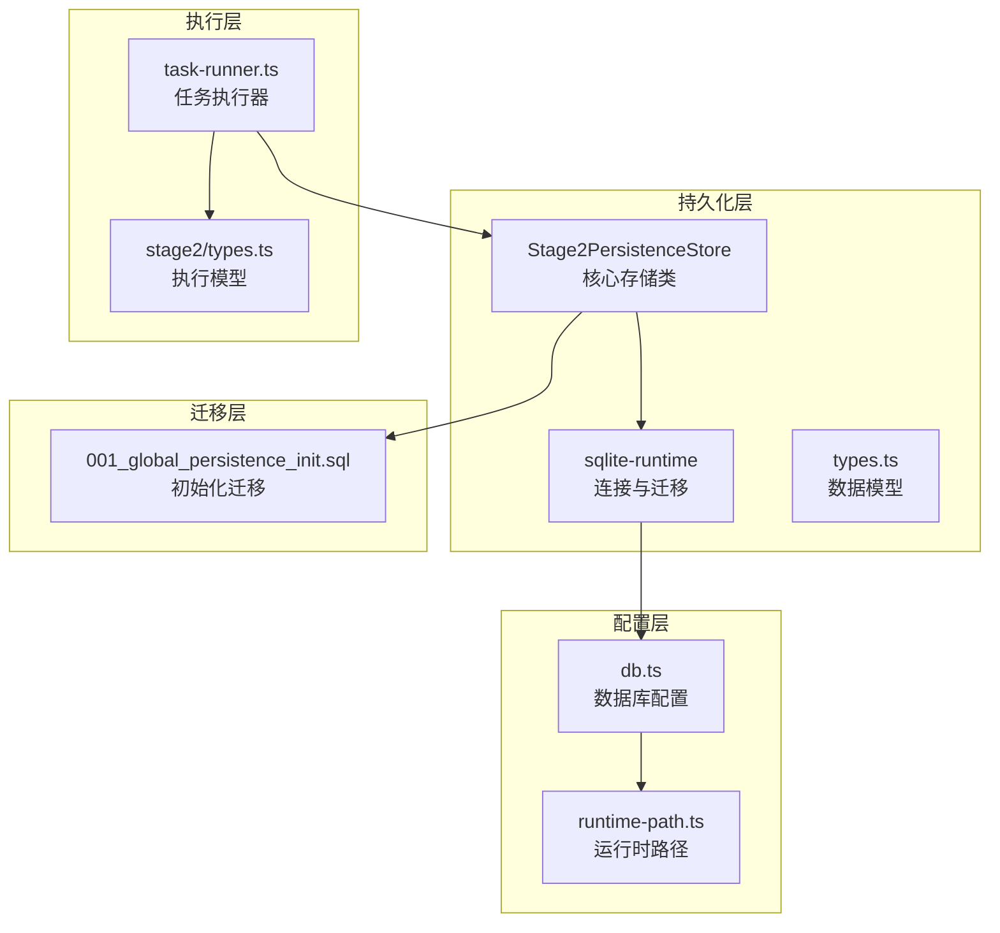
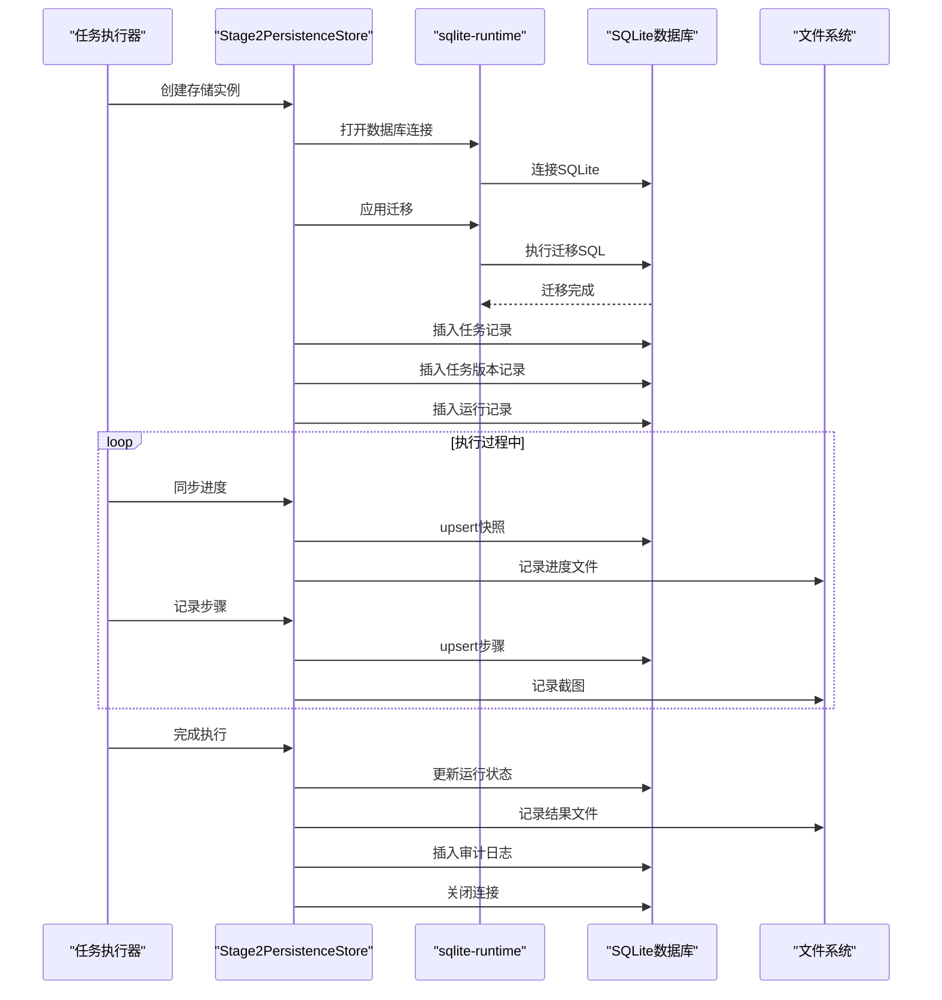
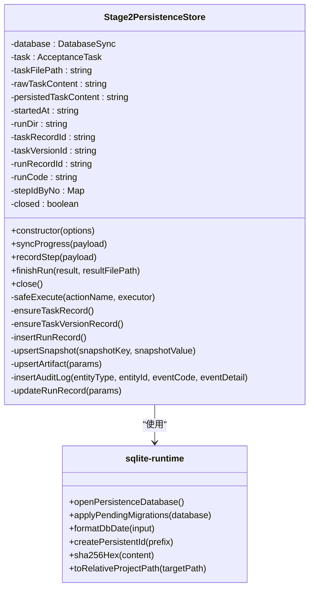
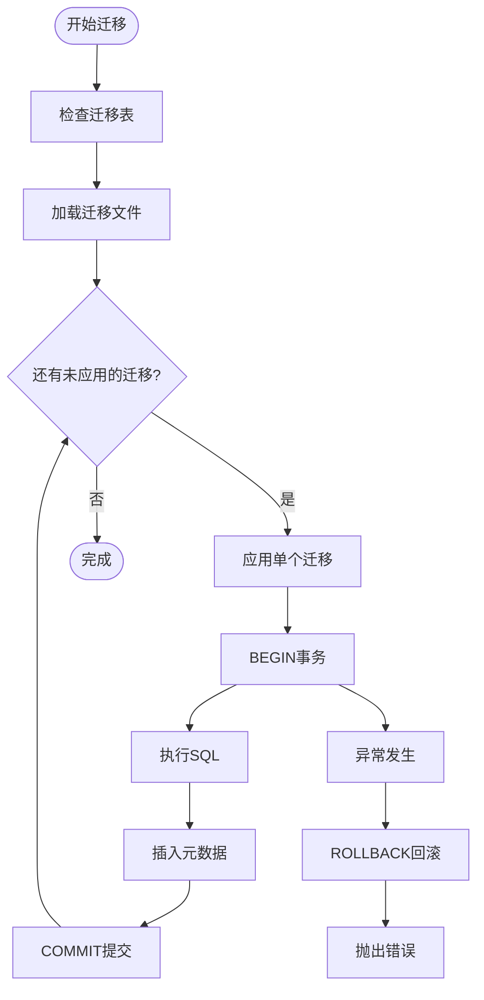
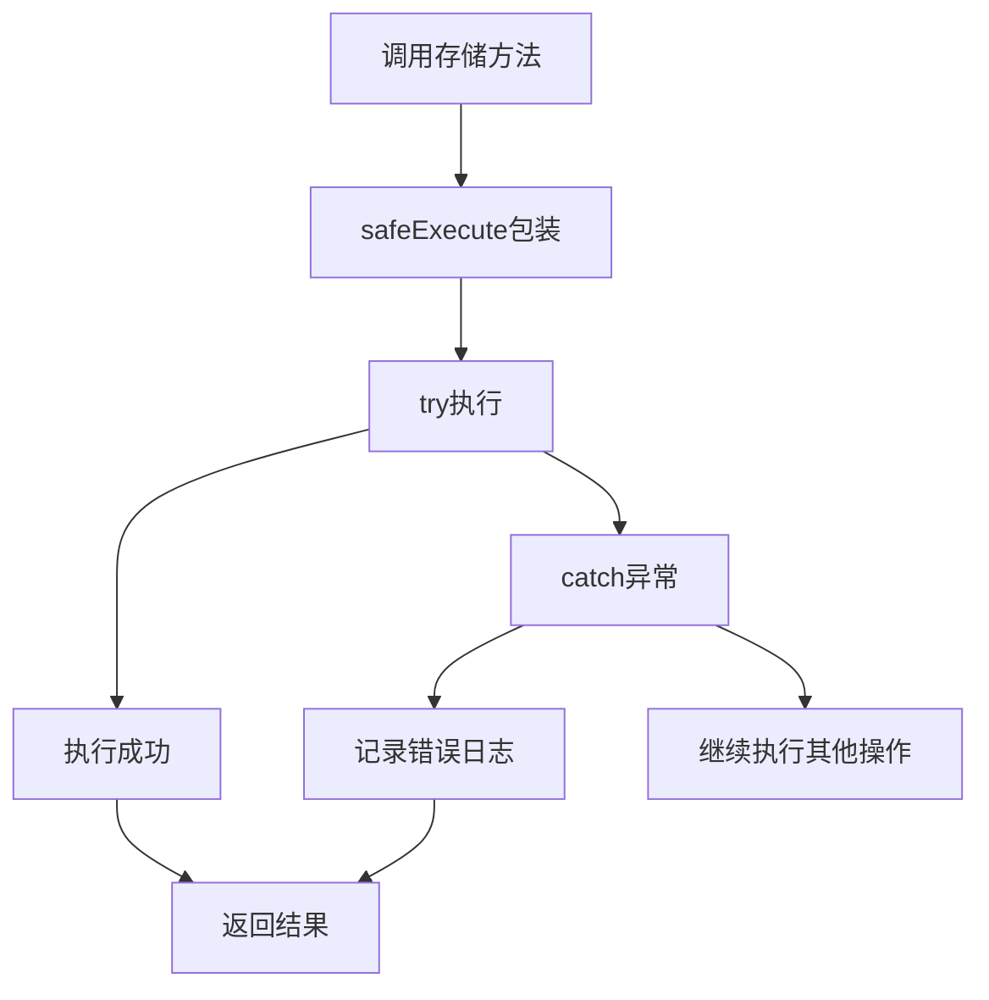
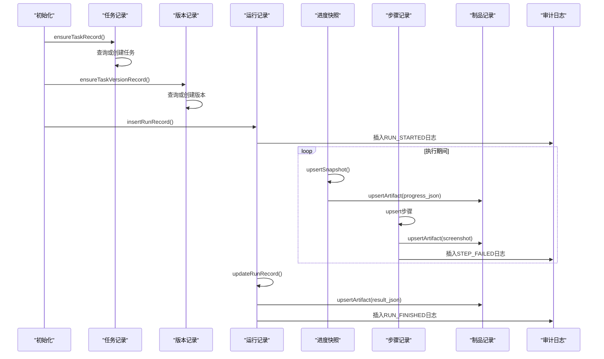
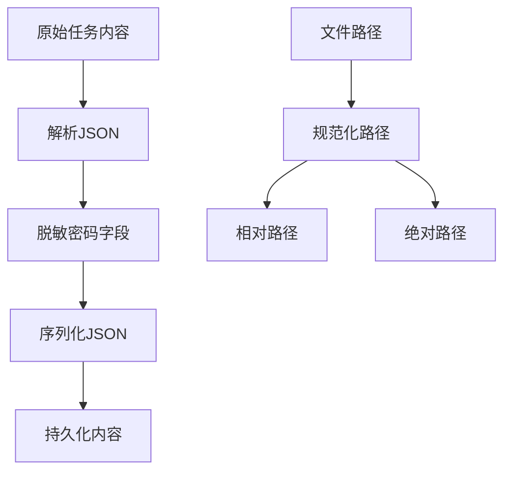
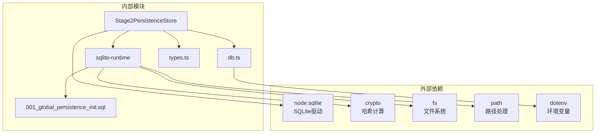

# 存储实现机制

<cite>
**本文引用的文件**
- [stage2-store.ts](file://src/persistence/stage2-store.ts)
- [sqlite-runtime.ts](file://src/persistence/sqlite-runtime.ts)
- [types.ts](file://src/persistence/types.ts)
- [db.ts](file://config/db.ts)
- [runtime-path.ts](file://config/runtime-path.ts)
- [001_global_persistence_init.sql](file://db/migrations/001_global_persistence_init.sql)
- [task-runner.ts](file://src/stage2/task-runner.ts)
- [types.ts](file://src/stage2/types.ts)
- [stage2-acceptance-runner.spec.ts](file://tests/generated/stage2-acceptance-runner.spec.ts)
- [package.json](file://package.json)
</cite>

## 目录
1. [简介](#简介)
2. [项目结构](#项目结构)
3. [核心组件](#核心组件)
4. [架构概览](#架构概览)
5. [详细组件分析](#详细组件分析)
6. [依赖分析](#依赖分析)
7. [性能考虑](#性能考虑)
8. [故障排除指南](#故障排除指南)
9. [结论](#结论)
10. [附录](#附录)

## 简介
本文件全面阐述了 Stage2PersistenceStore 类的存储实现机制，涵盖数据库连接管理、事务处理、错误处理、数据持久化流程、SQL 构建与执行策略、数据标准化处理、缓存机制与性能优化，以及配置选项和最佳实践。该实现采用 SQLite 作为本地持久化存储，通过迁移机制维护表结构，并提供完整的任务执行生命周期记录能力。

## 项目结构
该项目采用分层架构，核心存储逻辑位于 `src/persistence` 目录，包含：
- Stage2PersistenceStore：主要的持久化存储类
- sqlite-runtime：SQLite 连接、迁移和工具函数
- 类型定义：统一的数据模型接口
- 配置模块：数据库驱动和路径解析
- 迁移脚本：初始化数据库表结构
- 执行器：调用存储服务的任务执行器

**图表来源**
- [stage2-store.ts:1-655](file://src/persistence/stage2-store.ts#L1-L655)
- [sqlite-runtime.ts:1-116](file://src/persistence/sqlite-runtime.ts#L1-L116)
- [db.ts:1-28](file://config/db.ts#L1-L28)
- [runtime-path.ts:1-41](file://config/runtime-path.ts#L1-L41)
- [001_global_persistence_init.sql:1-128](file://db/migrations/001_global_persistence_init.sql#L1-L128)

**章节来源**
- [stage2-store.ts:1-655](file://src/persistence/stage2-store.ts#L1-L655)
- [sqlite-runtime.ts:1-116](file://src/persistence/sqlite-runtime.ts#L1-L116)
- [db.ts:1-28](file://config/db.ts#L1-L28)
- [runtime-path.ts:1-41](file://config/runtime-path.ts#L1-L41)
- [001_global_persistence_init.sql:1-128](file://db/migrations/001_global_persistence_init.sql#L1-L128)

## 核心组件
Stage2PersistenceStore 是整个存储系统的核心，负责：
- 数据库连接管理：通过 sqlite-runtime 创建和管理 SQLite 连接
- 任务生命周期记录：从任务创建到执行完成的全生命周期追踪
- 数据标准化：JSON 序列化、路径转换、敏感信息脱敏
- 事务处理：迁移应用时的原子性保证
- 错误处理：统一的异常捕获和降级处理

**章节来源**
- [stage2-store.ts:74-123](file://src/persistence/stage2-store.ts#L74-L123)
- [sqlite-runtime.ts:73-84](file://src/persistence/sqlite-runtime.ts#L73-L84)

## 架构概览
存储系统采用三层架构设计：

**图表来源**
- [stage2-store.ts:101-123](file://src/persistence/stage2-store.ts#L101-L123)
- [stage2-store.ts:470-630](file://src/persistence/stage2-store.ts#L470-L630)
- [sqlite-runtime.ts:86-114](file://src/persistence/sqlite-runtime.ts#L86-L114)

## 详细组件分析

### Stage2PersistenceStore 类分析
Stage2PersistenceStore 是一个线程安全的存储服务，提供以下核心功能：

#### 数据库连接管理
- 单例连接：每个存储实例维护独立的 SQLite 连接
- 外键约束：启用外键约束确保数据完整性
- 连接池：基于 Node.js SQLite 的同步连接（适合单线程场景）

**图表来源**
- [stage2-store.ts:74-641](file://src/persistence/stage2-store.ts#L74-L641)
- [sqlite-runtime.ts:73-116](file://src/persistence/sqlite-runtime.ts#L73-L116)

#### 事务处理机制
存储系统实现了完整的事务处理策略：

**图表来源**
- [sqlite-runtime.ts:86-114](file://src/persistence/sqlite-runtime.ts#L86-L114)

#### 错误处理机制
系统采用多层次的错误处理策略：

**图表来源**
- [stage2-store.ts:125-133](file://src/persistence/stage2-store.ts#L125-L133)

#### 数据持久化流程
存储系统覆盖完整的任务执行生命周期：

**图表来源**
- [stage2-store.ts:135-261](file://src/persistence/stage2-store.ts#L135-L261)
- [stage2-store.ts:263-331](file://src/persistence/stage2-store.ts#L263-L331)
- [stage2-store.ts:470-630](file://src/persistence/stage2-store.ts#L470-L630)

### SQL 语句构建与执行策略
存储系统采用预编译语句和参数绑定策略：

#### 预编译语句模式
- 使用 `prepare()` 方法创建预编译语句
- 通过 `run()` 方法执行并绑定参数
- 支持批量操作的参数数组传递

#### 参数绑定策略
- 时间戳格式化：统一使用 `YYYY-MM-DD HH:mm:ss` 格式
- 主键生成：使用 `createPersistentId()` 生成唯一标识符
- 路径标准化：相对路径转换和绝对路径记录

#### 批量操作优化
- upsert 模式：通过 SELECT + INSERT/UPDATE 实现
- 条件更新：根据现有记录决定插入或更新
- 原子性保证：在迁移应用时使用事务

**章节来源**
- [stage2-store.ts:135-261](file://src/persistence/stage2-store.ts#L135-L261)
- [stage2-store.ts:358-395](file://src/persistence/stage2-store.ts#L358-L395)
- [sqlite-runtime.ts:13-26](file://src/persistence/sqlite-runtime.ts#L13-L26)

### 数据标准化处理
系统实现了多层面的数据标准化：

#### JSON 序列化
- 统一使用 `JSON.stringify()` 进行序列化
- 保留空值和 undefined 的处理
- 格式化输出便于调试和存储

#### 路径转换
- 绝对路径到相对路径的转换
- 跨平台路径分隔符规范化
- 工作目录上下文下的路径解析

#### 敏感信息脱敏
- 自动识别并脱敏密码字段
- JSON 结构的安全处理
- 原始内容与持久化内容分离

**图表来源**
- [stage2-store.ts:37-48](file://src/persistence/stage2-store.ts#L37-L48)
- [stage2-store.ts:50-67](file://src/persistence/stage2-store.ts#L50-L67)
- [sqlite-runtime.ts:32-41](file://src/persistence/sqlite-runtime.ts#L32-L41)

**章节来源**
- [stage2-store.ts:37-67](file://src/persistence/stage2-store.ts#L37-L67)
- [sqlite-runtime.ts:32-41](file://src/persistence/sqlite-runtime.ts#L32-L41)

### 缓存机制与性能优化
存储系统采用多种缓存和优化策略：

#### 连接管理
- 单连接复用：避免频繁连接/断开
- 外键约束启用：确保数据一致性
- PRAGMA 设置：优化 SQLite 性能

#### 查询缓存
- 步骤 ID 映射缓存：避免重复查询
- 文件统计缓存：减少文件系统访问
- 迁移状态缓存：避免重复检查

#### 性能优化策略
- 预编译语句：减少 SQL 解析开销
- 批量 upsert：减少往返次数
- 原子事务：保证数据一致性

**章节来源**
- [stage2-store.ts:97-98](file://src/persistence/stage2-store.ts#L97-L98)
- [sqlite-runtime.ts:79-83](file://src/persistence/sqlite-runtime.ts#L79-L83)

## 依赖分析

**图表来源**
- [stage2-store.ts:1-13](file://src/persistence/stage2-store.ts#L1-L13)
- [sqlite-runtime.ts:1-5](file://src/persistence/sqlite-runtime.ts#L1-L5)
- [db.ts:1-5](file://config/db.ts#L1-L5)

**章节来源**
- [stage2-store.ts:1-13](file://src/persistence/stage2-store.ts#L1-L13)
- [sqlite-runtime.ts:1-5](file://src/persistence/sqlite-runtime.ts#L1-L5)
- [db.ts:1-5](file://config/db.ts#L1-L5)

## 性能考虑
基于代码分析，存储系统的性能特征如下：

### 内存使用优化
- 单连接模式：避免多连接内存开销
- 步骤 ID 缓存：Map 结构 O(1) 查找
- 文件统计缓存：避免重复文件系统访问

### 磁盘 I/O 优化
- SQLite WAL 模式：支持并发读取
- 批量 upsert：减少磁盘写入次数
- 迁移事务：原子性保证下的批量操作

### 并发处理
- 同步 API：适合单线程执行器
- 无连接池：简化并发控制
- 错误隔离：单个操作失败不影响整体

## 故障排除指南

### 常见问题诊断
1. **数据库连接失败**
   - 检查数据库文件路径权限
   - 验证 SQLite 驱动安装
   - 确认外键约束设置

2. **迁移应用失败**
   - 检查迁移文件完整性
   - 验证 SQL 语法正确性
   - 确认事务回滚机制

3. **数据持久化异常**
   - 检查 JSON 序列化结果
   - 验证路径转换逻辑
   - 确认文件系统访问权限

### 调试建议
- 启用详细日志记录
- 检查存储实例状态
- 验证数据模型一致性

**章节来源**
- [stage2-store.ts:125-133](file://src/persistence/stage2-store.ts#L125-L133)
- [sqlite-runtime.ts:104-113](file://src/persistence/sqlite-runtime.ts#L104-L113)

## 结论
Stage2PersistenceStore 提供了一个完整、可靠且高效的本地存储解决方案。其设计特点包括：

1. **完整性保障**：通过外键约束和事务处理确保数据一致性
2. **性能优化**：预编译语句、批量操作和缓存机制提升执行效率
3. **安全性考虑**：敏感信息脱敏和路径规范化增强系统安全
4. **可维护性**：清晰的代码结构和完善的错误处理机制

该实现为 Stage2 执行器提供了坚实的数据持久化基础，支持完整的任务生命周期追踪和结果存储。

## 附录

### 存储配置选项
- DB_DRIVER：数据库驱动类型（默认 sqlite）
- DB_FILE_PATH：数据库文件路径（默认 t_runtime/db/hi_test.sqlite）
- RUNTIME_DIR_PREFIX：运行时目录前缀
- STAGE2_CAPTCHA_MODE：验证码处理模式
- STAGE2_CAPTCHA_WAIT_TIMEOUT_MS：验证码等待超时时间

### 最佳实践指南
1. **数据库管理**
   - 定期备份数据库文件
   - 监控数据库文件大小
   - 使用合适的索引策略

2. **性能优化**
   - 合理使用 upsert 操作
   - 避免频繁的文件系统访问
   - 优化查询条件和索引使用

3. **安全考虑**
   - 定期清理敏感数据
   - 验证输入数据的完整性
   - 监控存储空间使用情况

**章节来源**
- [db.ts:20-26](file://config/db.ts#L20-L26)
- [runtime-path.ts:13-36](file://config/runtime-path.ts#L13-L36)
- [package.json:6-11](file://package.json#L6-L11)