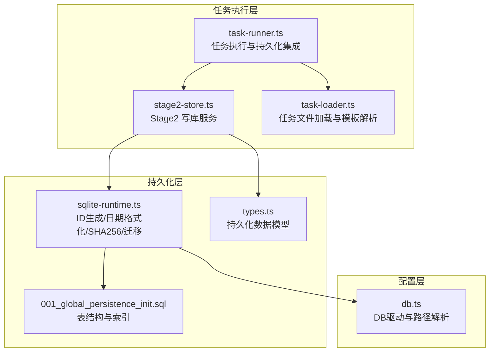
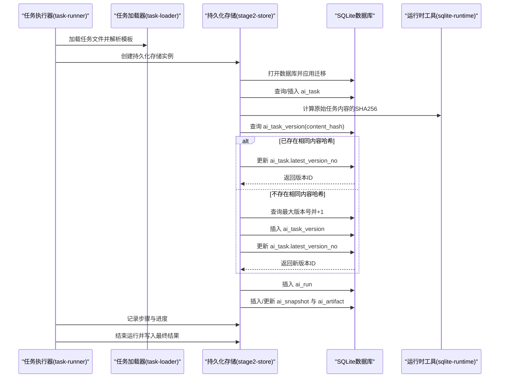
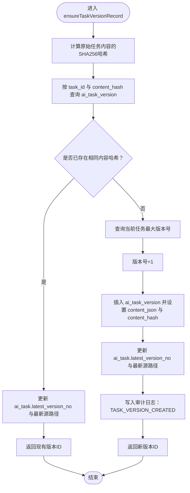
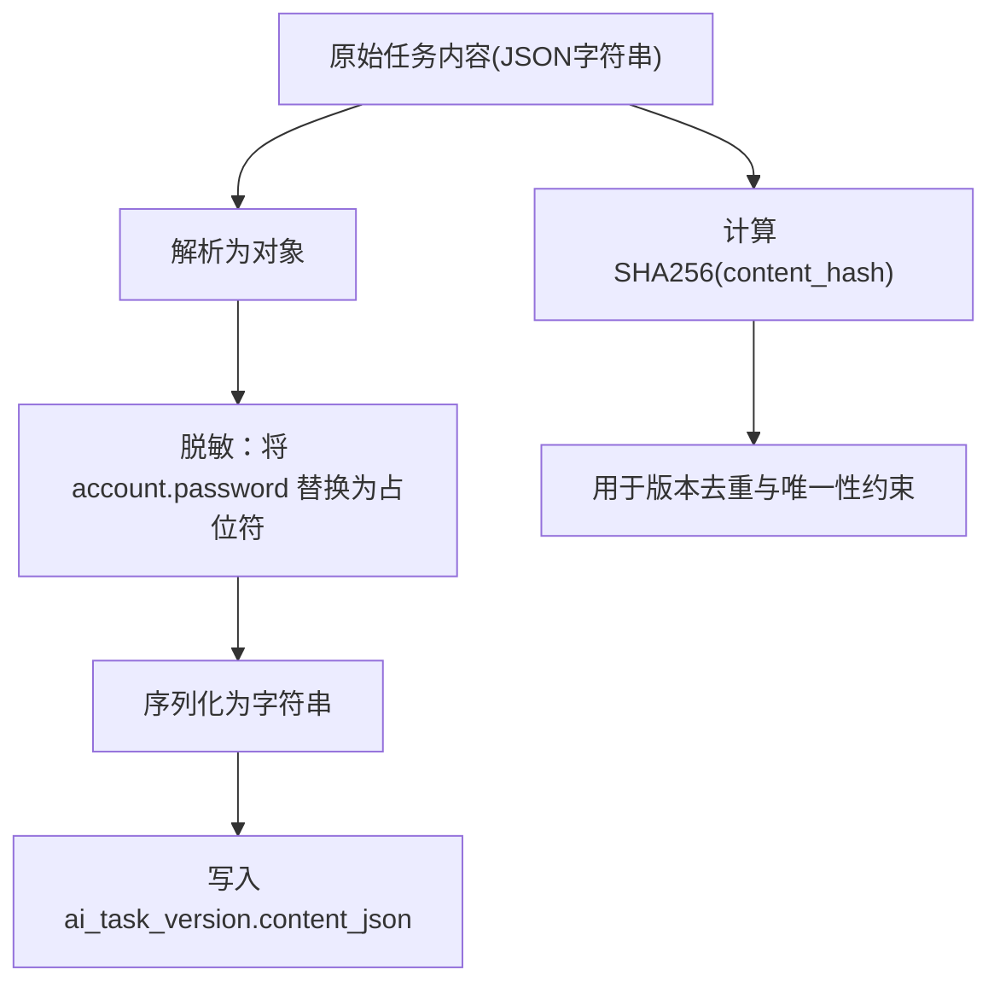
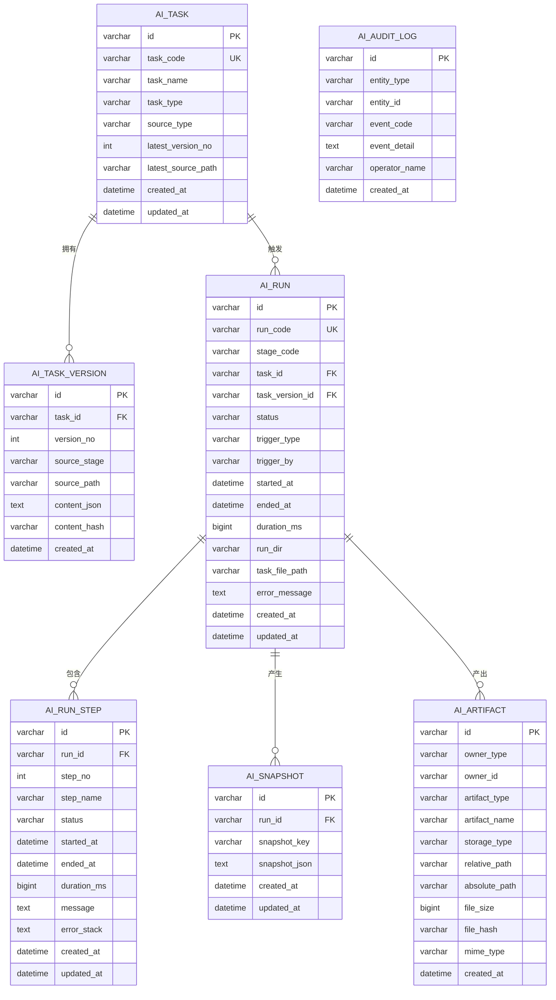
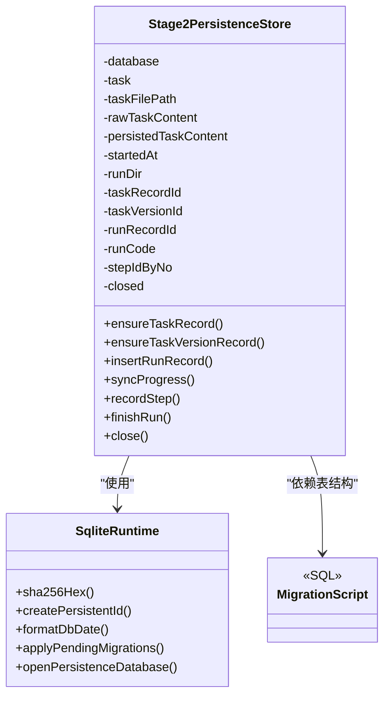

# 任务版本管理

<cite>
**本文引用的文件列表**
- [stage2-store.ts](file://src/persistence/stage2-store.ts)
- [sqlite-runtime.ts](file://src/persistence/sqlite-runtime.ts)
- [types.ts](file://src/persistence/types.ts)
- [001_global_persistence_init.sql](file://db/migrations/001_global_persistence_init.sql)
- [db.ts](file://config/db.ts)
- [task-runner.ts](file://src/stage2/task-runner.ts)
- [task-loader.ts](file://src/stage2/task-loader.ts)
- [stage2-acceptance-runner.spec.ts](file://tests/generated/stage2-acceptance-runner.spec.ts)
</cite>

## 目录
1. [简介](#简介)
2. [项目结构](#项目结构)
3. [核心组件](#核心组件)
4. [架构总览](#架构总览)
5. [详细组件分析](#详细组件分析)
6. [依赖关系分析](#依赖关系分析)
7. [性能考量](#性能考量)
8. [故障排查指南](#故障排查指南)
9. [结论](#结论)
10. [附录](#附录)

## 简介
本文件围绕任务版本管理进行系统化说明，重点解释 ensureTaskVersionRecord 方法的版本控制逻辑，包括内容哈希验证、版本号递增机制、版本内容存储策略（含敏感信息脱敏）、版本历史追踪与版本号管理算法、版本内容查询与比较机制、版本与任务的关联关系与外键约束、以及版本数据的备份与恢复策略与版本切换/回滚机制。文档同时给出与任务执行流程的衔接，帮助读者从端到端理解版本管理在系统中的作用。

## 项目结构
本项目采用分层与模块化组织：
- 数据持久化层：SQLite 本地数据库，迁移脚本初始化表结构，提供统一的 ID 生成、日期格式化、SHA256 计算等工具方法。
- 任务执行层：Stage2 任务加载与执行，负责读取任务文件、执行自动化流程，并通过持久化层记录任务、版本、运行、步骤、快照、产物等全生命周期数据。
- 配置层：数据库驱动与路径解析，保证 SQLite 驱动启用并正确创建数据库文件。

图表来源
- [stage2-store.ts:101-123](file://src/persistence/stage2-store.ts#L101-L123)
- [sqlite-runtime.ts:73-114](file://src/persistence/sqlite-runtime.ts#L73-L114)
- [001_global_persistence_init.sql:1-128](file://db/migrations/001_global_persistence_init.sql#L1-L128)
- [types.ts:34-125](file://src/persistence/types.ts#L34-L125)
- [task-runner.ts:1-39](file://src/stage2/task-runner.ts#L1-L39)
- [task-loader.ts:79-89](file://src/stage2/task-loader.ts#L79-L89)
- [db.ts:20-26](file://config/db.ts#L20-L26)

章节来源
- [stage2-store.ts:101-123](file://src/persistence/stage2-store.ts#L101-L123)
- [sqlite-runtime.ts:73-114](file://src/persistence/sqlite-runtime.ts#L73-L114)
- [001_global_persistence_init.sql:1-128](file://db/migrations/001_global_persistence_init.sql#L1-L128)
- [types.ts:34-125](file://src/persistence/types.ts#L34-L125)
- [task-runner.ts:1-39](file://src/stage2/task-runner.ts#L1-L39)
- [task-loader.ts:79-89](file://src/stage2/task-loader.ts#L79-L89)
- [db.ts:20-26](file://config/db.ts#L20-L26)

## 核心组件
- Stage2 写库服务：封装任务版本记录、运行记录、步骤记录、快照与产物的写入与更新逻辑，负责版本号生成与去重。
- SQLite 运行时工具：提供 SHA256 哈希、相对路径转换、数据库连接与迁移应用等能力。
- 数据模型：定义任务、任务版本、运行、步骤、快照、产物、审计日志等实体及其字段与约束。
- 任务加载器：负责任务文件的读取、模板变量替换与基本结构校验。
- 任务执行器：驱动任务执行，调用持久化服务记录进度、步骤、结果与审计事件。

章节来源
- [stage2-store.ts:74-123](file://src/persistence/stage2-store.ts#L74-L123)
- [sqlite-runtime.ts:9-30](file://src/persistence/sqlite-runtime.ts#L9-L30)
- [types.ts:34-125](file://src/persistence/types.ts#L34-L125)
- [task-loader.ts:79-89](file://src/stage2/task-loader.ts#L79-L89)
- [task-runner.ts:19-37](file://src/stage2/task-runner.ts#L19-L37)

## 架构总览
任务版本管理贯穿任务生命周期：任务加载后，执行器创建持久化存储实例，先确保任务记录存在，再基于原始任务内容计算哈希，决定是复用已有版本还是创建新版本。版本创建后，运行记录与步骤记录随之建立，产物与快照异步写入，最终完成运行记录的收尾。

图表来源
- [task-runner.ts:19-37](file://src/stage2/task-runner.ts#L19-L37)
- [task-loader.ts:79-89](file://src/stage2/task-loader.ts#L79-L89)
- [stage2-store.ts:101-123](file://src/persistence/stage2-store.ts#L101-L123)
- [stage2-store.ts:135-185](file://src/persistence/stage2-store.ts#L135-L185)
- [stage2-store.ts:187-261](file://src/persistence/stage2-store.ts#L187-L261)
- [sqlite-runtime.ts:28-30](file://src/persistence/sqlite-runtime.ts#L28-L30)

## 详细组件分析

### ensureTaskVersionRecord 版本控制逻辑
- 输入：原始任务内容字符串（未脱敏），任务文件路径，任务记录ID。
- 哈希计算：对原始任务内容进行 SHA256 计算，得到 contentHash。
- 去重查询：按 task_id 与 content_hash 查询 ai_task_version，若命中则直接复用该版本。
- 复用路径：更新 ai_task 的 latest_version_no 与最新源路径，返回现有版本ID。
- 新建路径：查询当前任务的最大版本号并+1，生成新版本ID，插入 ai_task_version，同时更新 ai_task 的最新版本号与源路径。
- 审计日志：新建版本时写入审计日志，便于追踪版本创建事件。

图表来源
- [stage2-store.ts:187-261](file://src/persistence/stage2-store.ts#L187-L261)
- [sqlite-runtime.ts:28-30](file://src/persistence/sqlite-runtime.ts#L28-L30)

章节来源
- [stage2-store.ts:187-261](file://src/persistence/stage2-store.ts#L187-L261)

### 版本内容存储策略与脱敏
- 存储内容：ai_task_version.content_json 存储的是“已脱敏”的任务内容（例如将账户密码字段替换为占位符），以保护敏感信息。
- 原始内容：原始任务内容用于计算 content_hash，但不存入数据库。
- 脱敏规则：解析 JSON 后，若存在 account.password 字段，则将其替换为固定占位符，然后序列化为字符串存入 content_json。
- 优点：既能通过 content_hash 实现版本去重，又能避免敏感信息入库。

图表来源
- [stage2-store.ts:37-48](file://src/persistence/stage2-store.ts#L37-L48)
- [stage2-store.ts:228-240](file://src/persistence/stage2-store.ts#L228-L240)

章节来源
- [stage2-store.ts:37-48](file://src/persistence/stage2-store.ts#L37-L48)
- [stage2-store.ts:228-240](file://src/persistence/stage2-store.ts#L228-L240)

### 版本号管理算法与历史追踪
- 版本号生成：从 ai_task_version 中查询同一任务的最大版本号，加1作为新版本号。
- 历史追踪：每次创建新版本都会更新 ai_task 的 latest_version_no，形成“最新版本号”与“版本历史”的双轨记录。
- 唯一性约束：ai_task_version 对 (task_id, version_no) 与 (task_id, content_hash) 均有唯一约束，确保版本号与内容哈希的唯一性。
- 外键约束：ai_task_version.task_id 关联 ai_task.id，且设置级联删除，保证任务删除时版本级联清理。

图表来源
- [001_global_persistence_init.sql:1-128](file://db/migrations/001_global_persistence_init.sql#L1-L128)
- [types.ts:34-125](file://src/persistence/types.ts#L34-L125)

章节来源
- [001_global_persistence_init.sql:15-30](file://db/migrations/001_global_persistence_init.sql#L15-L30)
- [stage2-store.ts:213-253](file://src/persistence/stage2-store.ts#L213-L253)

### 版本内容查询与比较机制
- 按内容哈希查找：通过 content_hash 在 ai_task_version 中快速定位相同内容的任务版本，避免重复存储。
- 版本对比：可通过比较不同版本的 content_hash 或 content_json 来判断内容差异；也可通过版本号顺序进行历史对比。
- 唯一性保障：由于 (task_id, content_hash) 唯一，相同内容不会产生多个版本记录，天然实现“内容去重”。

章节来源
- [stage2-store.ts:189-196](file://src/persistence/stage2-store.ts#L189-L196)
- [001_global_persistence_init.sql:25-29](file://db/migrations/001_global_persistence_init.sql#L25-L29)

### 版本与任务的关联关系与外键约束
- 关系：ai_task_version.task_id 外键指向 ai_task.id，表示版本属于某个任务。
- 约束：ai_task_version 对 (task_id, version_no) 唯一，确保同一任务的版本号不重复。
- 级联行为：删除 ai_task 时，其下的 ai_task_version 会级联删除，保证数据一致性。

章节来源
- [001_global_persistence_init.sql:27-29](file://db/migrations/001_global_persistence_init.sql#L27-L29)
- [stage2-store.ts:243-253](file://src/persistence/stage2-store.ts#L243-L253)

### 版本数据的备份与恢复策略（含版本切换/回滚）
- 数据库备份：SQLite 为单文件数据库，可直接复制 .sqlite 文件进行备份；建议在执行重要任务前进行备份。
- 恢复策略：停止服务后，将备份文件覆盖当前数据库文件，即可完成恢复。
- 版本切换/回滚：当前实现通过 content_hash 去重与 latest_version_no 维护最新版本，未提供显式的“版本切换/回滚”接口。若需回滚至历史版本，可在上层业务逻辑中：
  - 通过查询历史版本的 content_hash 或 version_no 获取目标版本；
  - 将 ai_task 的 latest_version_no 指向目标版本；
  - 若需要，可将 ai_task 的最新源路径也回退到目标版本对应的 source_path。
- 注意：上述回滚为业务层面的建议操作，需谨慎评估对运行记录与产物的影响。

章节来源
- [stage2-store.ts:187-261](file://src/persistence/stage2-store.ts#L187-L261)
- [001_global_persistence_init.sql:15-30](file://db/migrations/001_global_persistence_init.sql#L15-L30)

### 版本记录与任务记录的更新同步机制
- 同步点：ensureTaskVersionRecord 在创建或复用版本后，均会更新 ai_task 的 latest_version_no 与最新源路径，确保任务记录与版本记录保持一致。
- 事务特性：迁移应用与版本创建均在事务中执行，保证原子性与一致性。
- 审计日志：版本创建时写入审计日志，便于后续追踪与审计。

章节来源
- [stage2-store.ts:199-253](file://src/persistence/stage2-store.ts#L199-L253)
- [sqlite-runtime.ts:86-114](file://src/persistence/sqlite-runtime.ts#L86-L114)

## 依赖关系分析
- 持久化存储依赖 SQLite 运行时工具提供的哈希、ID 生成、日期格式化与迁移能力。
- 表结构由迁移脚本定义，包含主键、唯一约束与外键，确保数据完整性。
- 任务执行器通过构造函数注入任务、任务文件路径、原始内容与运行目录，驱动持久化存储创建任务与版本记录。

图表来源
- [stage2-store.ts:74-123](file://src/persistence/stage2-store.ts#L74-L123)
- [sqlite-runtime.ts:73-114](file://src/persistence/sqlite-runtime.ts#L73-L114)
- [001_global_persistence_init.sql:1-128](file://db/migrations/001_global_persistence_init.sql#L1-L128)

章节来源
- [stage2-store.ts:74-123](file://src/persistence/stage2-store.ts#L74-L123)
- [sqlite-runtime.ts:73-114](file://src/persistence/sqlite-runtime.ts#L73-L114)
- [001_global_persistence_init.sql:1-128](file://db/migrations/001_global_persistence_init.sql#L1-L128)

## 性能考量
- 哈希计算：对原始任务内容进行 SHA256 计算，成本较低，适合频繁调用。
- 查询去重：按 (task_id, content_hash) 查询，结合唯一索引，命中率高、性能稳定。
- 版本号生成：查询最大版本号后+1，复杂度 O(1)，无额外索引需求。
- I/O 模式：写入集中在事务中执行，减少磁盘碎片与锁竞争。
- 建议：对于大规模并发任务，可考虑在上层增加幂等写入与批量提交策略，进一步降低写放大。

## 故障排查指南
- 数据库连接失败：检查 DB_DRIVER 与 DB_FILE_PATH 配置，确认 SQLite 驱动启用且数据库文件可写。
- 迁移失败：查看 schema_migrations 记录与执行时间，确认 SQL 文件未被篡改。
- 版本未更新：确认 ensureTaskVersionRecord 是否被调用，以及 ai_task 的 latest_version_no 是否更新。
- 审计日志缺失：检查审计日志写入逻辑与数据库权限。

章节来源
- [db.ts:20-26](file://config/db.ts#L20-L26)
- [sqlite-runtime.ts:86-114](file://src/persistence/sqlite-runtime.ts#L86-L114)
- [stage2-store.ts:254-259](file://src/persistence/stage2-store.ts#L254-L259)

## 结论
本版本管理方案以内容哈希为核心，结合版本号递增与唯一性约束，实现了高效、可追溯的任务版本控制。通过脱敏存储与审计日志，兼顾了安全性与可审计性。配合 SQLite 单文件数据库与迁移机制，整体具备良好的可维护性与可移植性。若需更精细的版本切换/回滚能力，可在上层业务逻辑中扩展相应接口。

## 附录
- 测试入口：通过测试用例驱动任务执行，验证版本记录与运行记录的写入。
- 任务加载：支持模板变量替换与基本结构校验，确保任务文件质量。

章节来源
- [stage2-acceptance-runner.spec.ts:19-37](file://tests/generated/stage2-acceptance-runner.spec.ts#L19-L37)
- [task-loader.ts:79-89](file://src/stage2/task-loader.ts#L79-L89)