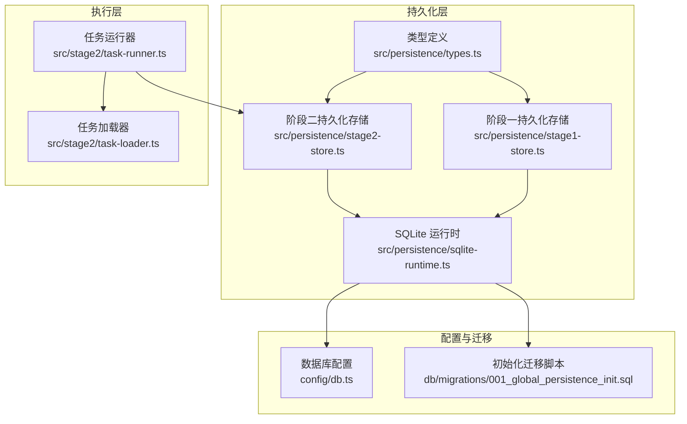
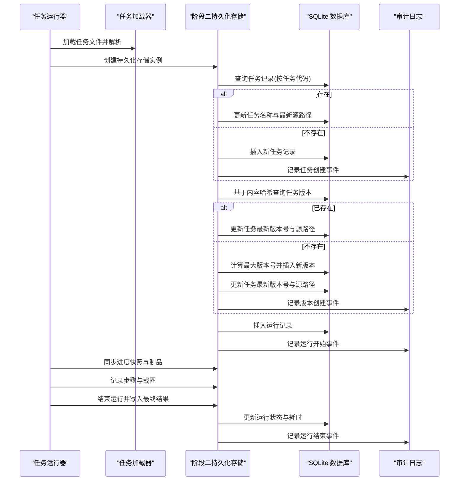
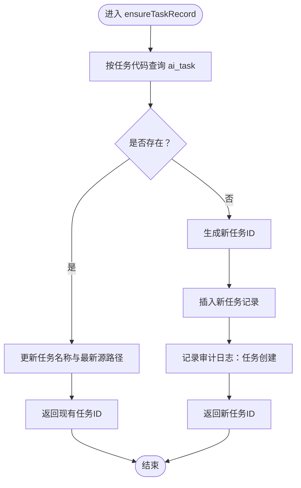
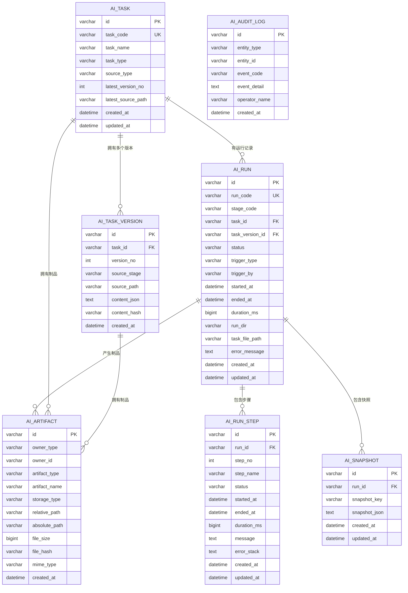
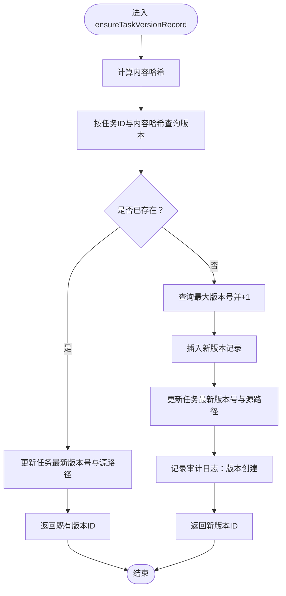
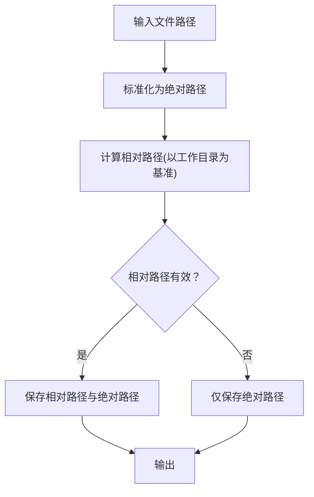
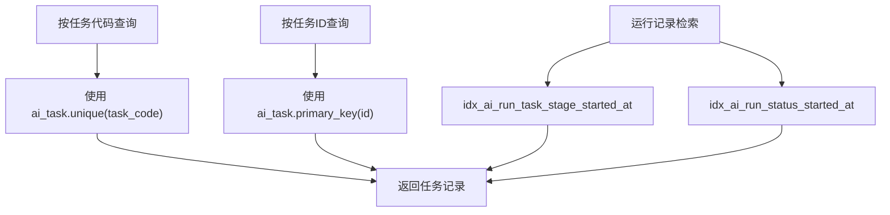
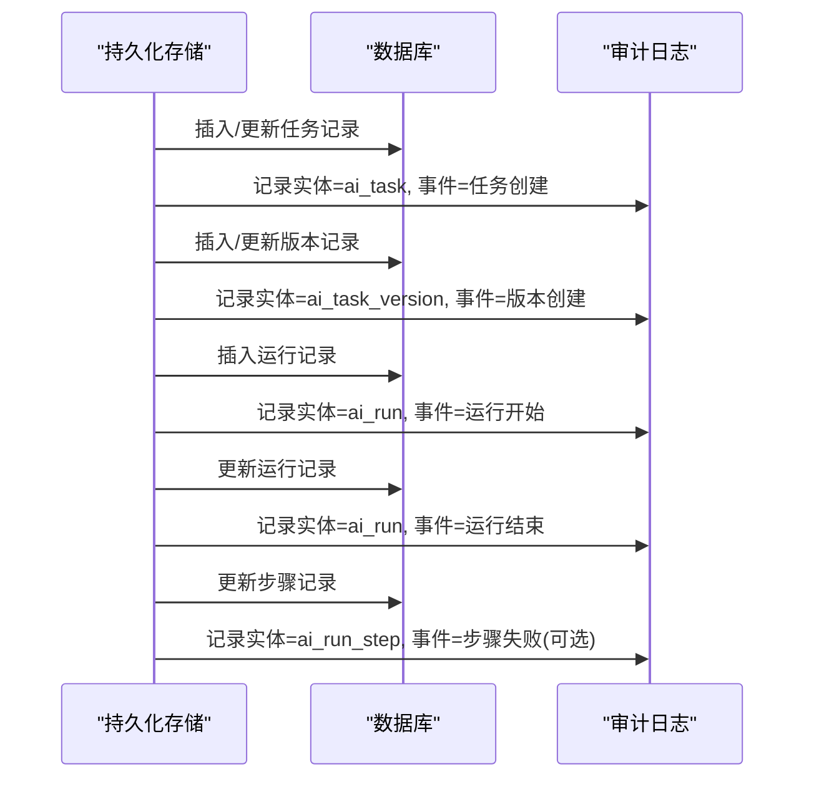
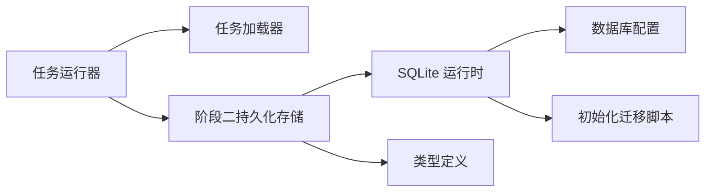

# 任务记录管理

<cite>
**本文引用的文件**
- [src/persistence/types.ts](file://src/persistence/types.ts)
- [src/persistence/stage2-store.ts](file://src/persistence/stage2-store.ts)
- [src/persistence/stage1-store.ts](file://src/persistence/stage1-store.ts)
- [src/persistence/sqlite-runtime.ts](file://src/persistence/sqlite-runtime.ts)
- [src/stage2/task-loader.ts](file://src/stage2/task-loader.ts)
- [src/stage2/task-runner.ts](file://src/stage2/task-runner.ts)
- [db/migrations/001_global_persistence_init.sql](file://db/migrations/001_global_persistence_init.sql)
- [config/db.ts](file://config/db.ts)
- [specs/tasks/acceptance-task.template.json](file://specs/tasks/acceptance-task.template.json)
</cite>

## 目录
1. [简介](#简介)
2. [项目结构](#项目结构)
3. [核心组件](#核心组件)
4. [架构总览](#架构总览)
5. [详细组件分析](#详细组件分析)
6. [依赖关系分析](#依赖关系分析)
7. [性能考量](#性能考量)
8. [故障排查指南](#故障排查指南)
9. [结论](#结论)
10. [附录](#附录)

## 简介
本文件围绕“任务记录管理”的核心能力进行系统化说明，重点覆盖以下方面：
- ensureTaskRecord 方法的实现逻辑：任务存在性检查、创建新任务、更新现有任务的完整流程
- 任务元数据的存储结构：任务代码、名称、类型、来源路径等字段的处理
- 任务版本号管理与最新版本追踪机制
- 任务文件路径的相对化处理与存储策略
- 任务记录的查询与检索方法（按任务代码查找、按ID查找）
- 任务记录的更新策略与冲突解决机制
- 任务记录与审计日志的关联关系

## 项目结构
本项目采用分层与模块化的组织方式：
- 数据持久化层：SQLite 运行时工具、阶段一/阶段二持久化存储类、类型定义
- 执行阶段层：任务加载器、任务运行器
- 配置层：数据库驱动与路径配置
- 迁移层：初始化 SQL 迁移脚本

**图表来源**
- [src/persistence/types.ts:34-123](file://src/persistence/types.ts#L34-L123)
- [src/persistence/stage1-store.ts:86-135](file://src/persistence/stage1-store.ts#L86-L135)
- [src/persistence/stage2-store.ts:74-123](file://src/persistence/stage2-store.ts#L74-L123)
- [src/persistence/sqlite-runtime.ts:73-114](file://src/persistence/sqlite-runtime.ts#L73-L114)
- [src/stage2/task-loader.ts:79-89](file://src/stage2/task-loader.ts#L79-L89)
- [src/stage2/task-runner.ts:2318-2348](file://src/stage2/task-runner.ts#L2318-L2348)
- [config/db.ts:15-26](file://config/db.ts#L15-L26)
- [db/migrations/001_global_persistence_init.sql:1-128](file://db/migrations/001_global_persistence_init.sql#L1-L128)

**章节来源**
- [src/persistence/types.ts:1-125](file://src/persistence/types.ts#L1-L125)
- [src/persistence/stage1-store.ts:1-729](file://src/persistence/stage1-store.ts#L1-L729)
- [src/persistence/stage2-store.ts:1-655](file://src/persistence/stage2-store.ts#L1-L655)
- [src/persistence/sqlite-runtime.ts:1-116](file://src/persistence/sqlite-runtime.ts#L1-L116)
- [src/stage2/task-loader.ts:1-91](file://src/stage2/task-loader.ts#L1-L91)
- [src/stage2/task-runner.ts:2318-2348](file://src/stage2/task-runner.ts#L2318-L2348)
- [config/db.ts:1-28](file://config/db.ts#L1-L28)
- [db/migrations/001_global_persistence_init.sql:1-128](file://db/migrations/001_global_persistence_init.sql#L1-L128)

## 核心组件
- 类型定义：统一的任务、版本、运行、步骤、快照、制品、审计日志等模型，确保数据结构一致性与可扩展性
- SQLite 运行时：负责数据库连接、迁移应用、ID 生成、日期格式化、路径相对化等基础设施
- 阶段一/阶段二持久化存储：封装任务记录、任务版本、运行记录、步骤记录、快照、制品、审计日志的写入与更新逻辑
- 任务加载器与运行器：负责任务文件解析、模板变量替换、运行目录创建与持久化存储实例的初始化

**章节来源**
- [src/persistence/types.ts:34-123](file://src/persistence/types.ts#L34-L123)
- [src/persistence/sqlite-runtime.ts:13-41](file://src/persistence/sqlite-runtime.ts#L13-L41)
- [src/persistence/stage1-store.ts:86-135](file://src/persistence/stage1-store.ts#L86-L135)
- [src/persistence/stage2-store.ts:74-123](file://src/persistence/stage2-store.ts#L74-L123)
- [src/stage2/task-loader.ts:79-89](file://src/stage2/task-loader.ts#L79-L89)
- [src/stage2/task-runner.ts:2318-2348](file://src/stage2/task-runner.ts#L2318-L2348)

## 架构总览
任务记录管理贯穿“任务加载 -> 任务记录确保 -> 任务版本记录确保 -> 运行记录插入 -> 运行过程快照与制品 -> 完成收尾”的完整生命周期。

**图表来源**
- [src/stage2/task-runner.ts:2318-2348](file://src/stage2/task-runner.ts#L2318-L2348)
- [src/stage2/task-loader.ts:79-89](file://src/stage2/task-loader.ts#L79-L89)
- [src/persistence/stage2-store.ts:101-123](file://src/persistence/stage2-store.ts#L101-L123)
- [src/persistence/stage2-store.ts:135-185](file://src/persistence/stage2-store.ts#L135-L185)
- [src/persistence/stage2-store.ts:187-261](file://src/persistence/stage2-store.ts#L187-L261)
- [src/persistence/stage2-store.ts:263-303](file://src/persistence/stage2-store.ts#L263-L303)
- [src/persistence/stage2-store.ts:470-493](file://src/persistence/stage2-store.ts#L470-L493)
- [src/persistence/stage2-store.ts:495-590](file://src/persistence/stage2-store.ts#L495-L590)
- [src/persistence/stage2-store.ts:592-630](file://src/persistence/stage2-store.ts#L592-L630)

## 详细组件分析

### ensureTaskRecord 实现逻辑
ensureTaskRecord 的职责是保证任务记录的存在性与一致性：
- 查询：按任务代码查询 ai_task
- 存在：若存在则更新任务名称与最新源路径，并返回已有 ID
- 不存在：生成新任务 ID，插入新记录，记录审计日志

**图表来源**
- [src/persistence/stage2-store.ts:135-185](file://src/persistence/stage2-store.ts#L135-L185)
- [src/persistence/stage1-store.ts:147-197](file://src/persistence/stage1-store.ts#L147-L197)

**章节来源**
- [src/persistence/stage2-store.ts:135-185](file://src/persistence/stage2-store.ts#L135-L185)
- [src/persistence/stage1-store.ts:147-197](file://src/persistence/stage1-store.ts#L147-L197)

### 任务元数据存储结构
- ai_task：任务主表，包含任务代码、名称、类型、来源类型、最新版本号、最新源路径、创建/更新时间
- ai_task_version：任务版本表，包含版本号、来源阶段、源路径、内容 JSON、内容哈希、创建时间
- ai_run：运行记录表，包含运行代码、阶段代码、任务/版本外键、状态、触发信息、时间戳、运行目录、任务文件路径、错误信息
- ai_run_step：运行步骤表，包含步骤序号、名称、状态、时间戳、消息、错误栈
- ai_snapshot：运行快照表，按运行与键唯一
- ai_artifact：制品表，按拥有者类型+ID+制品类型+名称唯一
- ai_audit_log：审计日志表，记录实体类型、实体ID、事件码、详情、操作人、时间

**图表来源**
- [db/migrations/001_global_persistence_init.sql:1-128](file://db/migrations/001_global_persistence_init.sql#L1-L128)
- [src/persistence/types.ts:34-123](file://src/persistence/types.ts#L34-L123)

**章节来源**
- [db/migrations/001_global_persistence_init.sql:1-128](file://db/migrations/001_global_persistence_init.sql#L1-L128)
- [src/persistence/types.ts:34-123](file://src/persistence/types.ts#L34-L123)

### 任务版本号管理与最新版本追踪
- 版本号生成：基于内容哈希去重，若相同内容哈希已存在则复用版本；否则查询当前最大版本号并递增
- 最新版本追踪：每次确保版本时，都会更新 ai_task 的 latest_version_no 与 latest_source_path，确保任务表始终指向最新有效版本

**图表来源**
- [src/persistence/stage2-store.ts:187-261](file://src/persistence/stage2-store.ts#L187-L261)
- [src/persistence/stage1-store.ts:199-273](file://src/persistence/stage1-store.ts#L199-L273)

**章节来源**
- [src/persistence/stage2-store.ts:187-261](file://src/persistence/stage2-store.ts#L187-L261)
- [src/persistence/stage1-store.ts:199-273](file://src/persistence/stage1-store.ts#L199-L273)

### 任务文件路径的相对化处理与存储策略
- 绝对路径标准化：对外部传入的文件路径进行绝对化处理
- 相对化策略：以运行时工作目录为基准，计算相对路径；若超出项目范围则回退到绝对路径
- 存储策略：制品表同时保存相对路径与绝对路径，便于跨环境迁移与调试

**图表来源**
- [src/persistence/stage2-store.ts:397-468](file://src/persistence/stage2-store.ts#L397-L468)
- [src/persistence/stage1-store.ts:409-480](file://src/persistence/stage1-store.ts#L409-L480)
- [src/persistence/sqlite-runtime.ts:32-41](file://src/persistence/sqlite-runtime.ts#L32-L41)

**章节来源**
- [src/persistence/stage2-store.ts:397-468](file://src/persistence/stage2-store.ts#L397-L468)
- [src/persistence/stage1-store.ts:409-480](file://src/persistence/stage1-store.ts#L409-L480)
- [src/persistence/sqlite-runtime.ts:32-41](file://src/persistence/sqlite-runtime.ts#L32-L41)

### 任务记录的查询与检索方法
- 按任务代码查找：通过 ai_task 的唯一索引 task_code 快速定位任务
- 按任务ID查找：通过 ai_task 主键 id 直接定位
- 运行记录检索：可按任务ID+阶段+开始时间、状态+阶段+开始时间等复合索引进行高效查询

**图表来源**
- [db/migrations/001_global_persistence_init.sql:1-128](file://db/migrations/001_global_persistence_init.sql#L1-L128)

**章节来源**
- [db/migrations/001_global_persistence_init.sql:1-128](file://db/migrations/001_global_persistence_init.sql#L1-L128)

### 任务记录的更新策略与冲突解决机制
- 任务记录更新：当任务代码已存在时，仅更新任务名称与最新源路径，避免重复创建
- 版本记录冲突：以内容哈希作为去重依据；若哈希相同则复用版本，避免重复版本
- 运行记录更新：运行过程中动态更新状态、结束时间、耗时与错误信息；最终写入结果与制品
- 步骤记录更新：按步骤序号更新步骤状态与截图等信息；失败时记录审计事件

**章节来源**
- [src/persistence/stage2-store.ts:135-185](file://src/persistence/stage2-store.ts#L135-L185)
- [src/persistence/stage2-store.ts:187-261](file://src/persistence/stage2-store.ts#L187-L261)
- [src/persistence/stage2-store.ts:263-303](file://src/persistence/stage2-store.ts#L263-L303)
- [src/persistence/stage2-store.ts:495-590](file://src/persistence/stage2-store.ts#L495-L590)

### 任务记录与审计日志的关联关系
- 审计日志表记录实体类型、实体ID、事件码、事件详情、操作人与时间
- 关键事件：任务创建、版本创建、运行开始、运行结束、步骤失败等均会写入审计日志
- 审计索引：按实体类型+实体ID+时间建立索引，便于审计与溯源

**图表来源**
- [src/persistence/stage2-store.ts:183-184](file://src/persistence/stage2-store.ts#L183-L184)
- [src/persistence/stage2-store.ts:254-259](file://src/persistence/stage2-store.ts#L254-L259)
- [src/persistence/stage2-store.ts](file://src/persistence/stage2-store.ts#L122)
- [src/persistence/stage2-store.ts:623-628](file://src/persistence/stage2-store.ts#L623-L628)
- [src/persistence/stage2-store.ts:582-588](file://src/persistence/stage2-store.ts#L582-L588)
- [db/migrations/001_global_persistence_init.sql:109-126](file://db/migrations/001_global_persistence_init.sql#L109-L126)

**章节来源**
- [src/persistence/stage2-store.ts:183-184](file://src/persistence/stage2-store.ts#L183-L184)
- [src/persistence/stage2-store.ts:254-259](file://src/persistence/stage2-store.ts#L254-L259)
- [src/persistence/stage2-store.ts](file://src/persistence/stage2-store.ts#L122)
- [src/persistence/stage2-store.ts:623-628](file://src/persistence/stage2-store.ts#L623-L628)
- [src/persistence/stage2-store.ts:582-588](file://src/persistence/stage2-store.ts#L582-L588)
- [db/migrations/001_global_persistence_init.sql:109-126](file://db/migrations/001_global_persistence_init.sql#L109-L126)

## 依赖关系分析
- 模块耦合
  - 持久化存储依赖 SQLite 运行时提供的连接、迁移、ID 生成、日期格式化、路径相对化
  - 运行器依赖任务加载器与持久化存储
  - 类型定义被持久化存储与运行器共同依赖
- 外部依赖
  - SQLite 驱动、文件系统、路径解析、环境变量读取
- 索引与约束
  - ai_task.task_code 唯一键
  - ai_task_version.(task_id, version_no)、(task_id, content_hash) 唯一键
  - ai_run.run_code 唯一键
  - ai_run_step.(run_id, step_no) 唯一键
  - ai_snapshot.(run_id, snapshot_key) 唯一键
  - ai_artifact.owner_type+owner_id+artifact_type+artifact_name 唯一键
  - ai_audit_log.entity_type+entity_id+created_at 复合索引

**图表来源**
- [src/stage2/task-runner.ts:2318-2348](file://src/stage2/task-runner.ts#L2318-L2348)
- [src/stage2/task-loader.ts:79-89](file://src/stage2/task-loader.ts#L79-L89)
- [src/persistence/stage2-store.ts:74-123](file://src/persistence/stage2-store.ts#L74-L123)
- [src/persistence/sqlite-runtime.ts:73-114](file://src/persistence/sqlite-runtime.ts#L73-L114)
- [src/persistence/types.ts:34-123](file://src/persistence/types.ts#L34-L123)
- [config/db.ts:15-26](file://config/db.ts#L15-L26)
- [db/migrations/001_global_persistence_init.sql:1-128](file://db/migrations/001_global_persistence_init.sql#L1-L128)

**章节来源**
- [src/stage2/task-runner.ts:2318-2348](file://src/stage2/task-runner.ts#L2318-L2348)
- [src/stage2/task-loader.ts:79-89](file://src/stage2/task-loader.ts#L79-L89)
- [src/persistence/stage2-store.ts:74-123](file://src/persistence/stage2-store.ts#L74-L123)
- [src/persistence/sqlite-runtime.ts:73-114](file://src/persistence/sqlite-runtime.ts#L73-L114)
- [src/persistence/types.ts:34-123](file://src/persistence/types.ts#L34-L123)
- [config/db.ts:15-26](file://config/db.ts#L15-L26)
- [db/migrations/001_global_persistence_init.sql:1-128](file://db/migrations/001_global_persistence_init.sql#L1-L128)

## 性能考量
- 唯一键与索引：通过唯一键与复合索引减少重复写入与提升查询效率
- 哈希去重：版本记录基于内容哈希去重，避免重复版本导致的数据膨胀
- 相对路径存储：同时保存相对与绝对路径，兼顾可移植性与可读性
- 事务与回滚：迁移应用采用显式事务，失败自动回滚，保障数据一致性

[本节为通用指导，无需具体文件分析]

## 故障排查指南
- 数据库连接失败
  - 检查数据库驱动与路径配置
  - 确认迁移脚本已正确执行
- 任务记录重复或缺失
  - 核对任务代码唯一性与 ensureTaskRecord 流程
  - 检查版本哈希去重逻辑
- 路径异常
  - 确认相对化策略与工作目录设置
  - 校验制品路径是否正确保存
- 审计日志缺失
  - 检查事件码与实体类型是否正确
  - 确认审计索引是否生效

**章节来源**
- [config/db.ts:15-26](file://config/db.ts#L15-L26)
- [src/persistence/sqlite-runtime.ts:86-114](file://src/persistence/sqlite-runtime.ts#L86-L114)
- [src/persistence/stage2-store.ts:183-184](file://src/persistence/stage2-store.ts#L183-L184)
- [src/persistence/stage2-store.ts:254-259](file://src/persistence/stage2-store.ts#L254-L259)
- [src/persistence/stage2-store.ts](file://src/persistence/stage2-store.ts#L122)
- [src/persistence/stage2-store.ts:623-628](file://src/persistence/stage2-store.ts#L623-L628)

## 结论
本任务记录管理体系通过统一的类型定义、严格的唯一性与索引约束、基于内容哈希的版本去重、以及完善的审计日志，实现了任务全生命周期的可追溯与高可靠。ensureTaskRecord 与 ensureTaskVersionRecord 的双保险机制，确保了任务与版本的一致性与可维护性；相对化路径策略提升了跨环境迁移的灵活性。配合阶段一/阶段二持久化存储的统一接口，为后续扩展与演进提供了清晰的架构基线。

[本节为总结性内容，无需具体文件分析]

## 附录
- 任务模板示例：用于参考任务字段结构与必填项
- 数据库初始化脚本：用于创建与初始化表结构与索引

**章节来源**
- [specs/tasks/acceptance-task.template.json:1-141](file://specs/tasks/acceptance-task.template.json#L1-L141)
- [db/migrations/001_global_persistence_init.sql:1-128](file://db/migrations/001_global_persistence_init.sql#L1-L128)