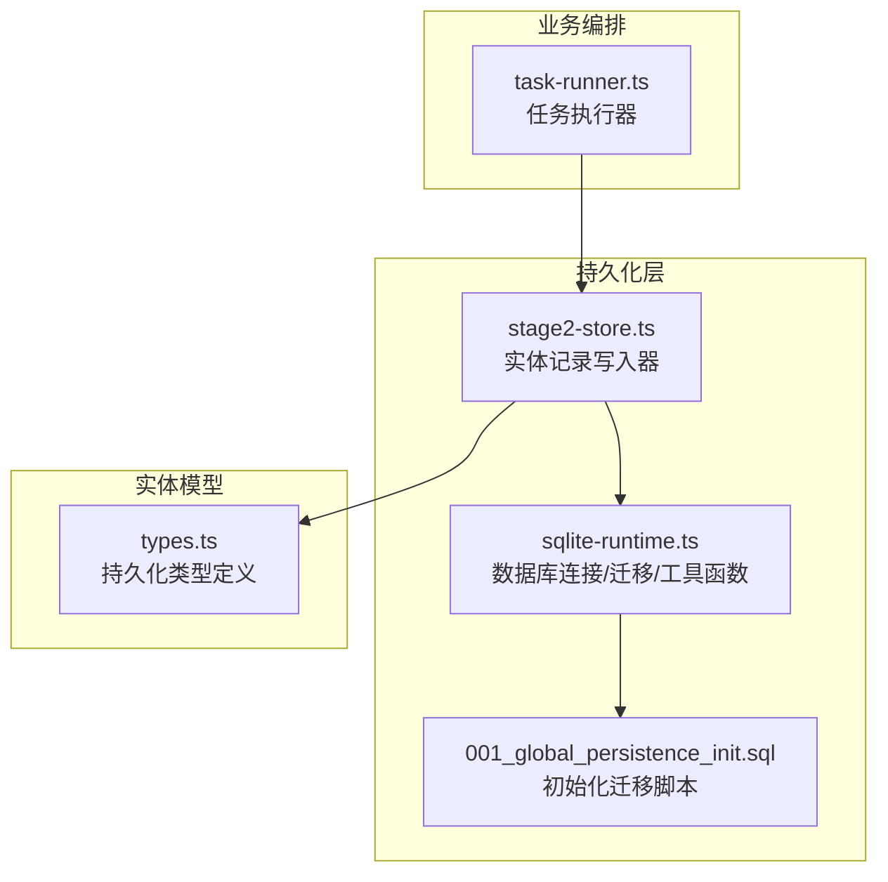
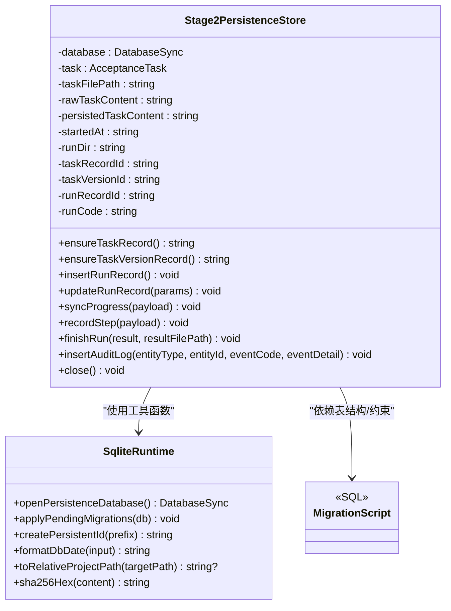
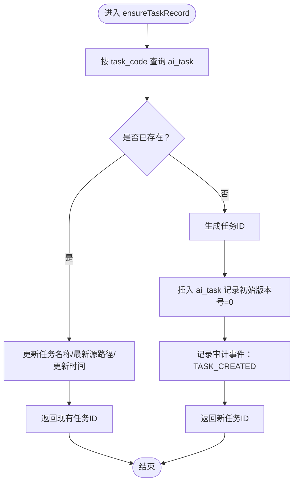
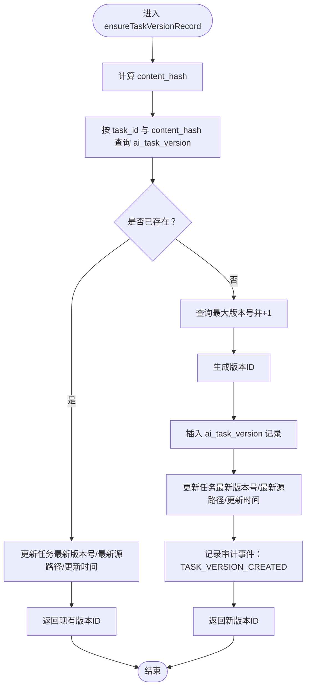
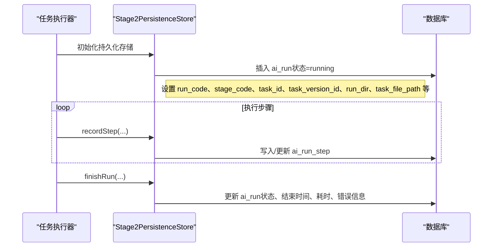
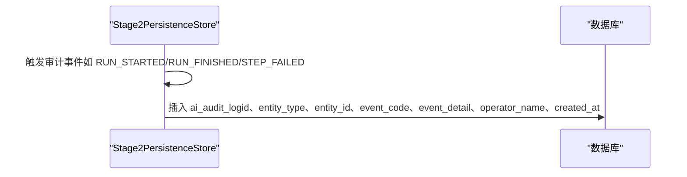
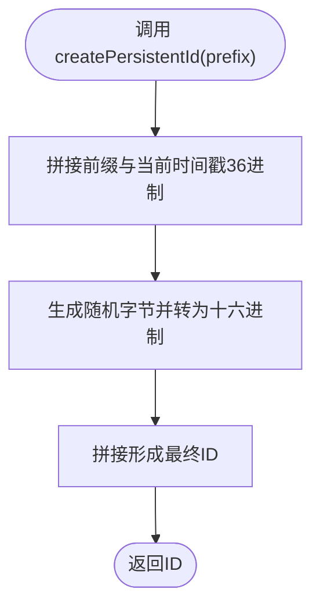
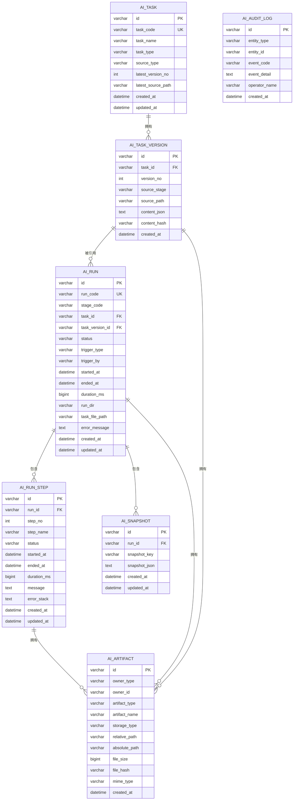
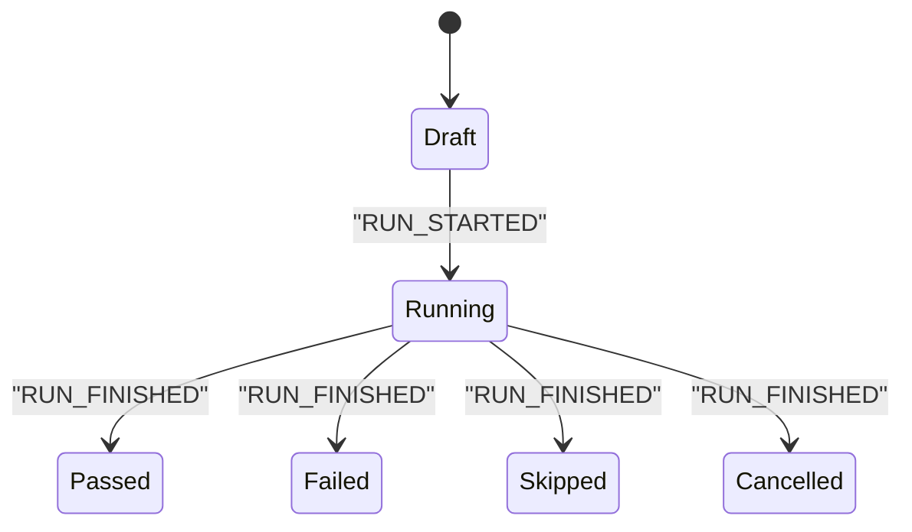
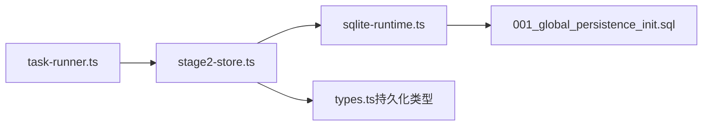

# 实体记录管理

<cite>
**本文引用的文件**
- [stage2-store.ts](file://src/persistence/stage2-store.ts)
- [sqlite-runtime.ts](file://src/persistence/sqlite-runtime.ts)
- [types.ts](file://src/persistence/types.ts)
- [001_global_persistence_init.sql](file://db/migrations/001_global_persistence_init.sql)
- [task-runner.ts](file://src/phase2/task-runner.ts)
- [types.ts](file://src/phase2/types.ts)
</cite>

## 目录
1. [简介](#简介)
2. [项目结构](#项目结构)
3. [核心组件](#核心组件)
4. [架构概览](#架构概览)
5. [详细组件分析](#详细组件分析)
6. [依赖分析](#依赖分析)
7. [性能考虑](#性能考虑)
8. [故障排查指南](#故障排查指南)
9. [结论](#结论)
10. [附录](#附录)

## 简介
本文件系统化阐述实体记录管理机制，覆盖任务记录、任务版本记录、运行记录、审计日志、实体ID生成策略、实体关系映射与约束检查，以及实体生命周期与状态转换的完整流程。文档面向不同技术背景读者，既提供高层架构视图，也包含代码级细节与可视化图表。

## 项目结构
围绕实体记录管理的关键模块分布如下：
- 持久化层：SQLite 本地数据库 + 迁移脚本 + 工具函数
- 实体模型：统一的持久化类型定义
- 业务编排：任务执行器负责触发与协调持久化写入

**图表来源**
- [stage2-store.ts:101-123](file://src/persistence/stage2-store.ts#L101-L123)
- [sqlite-runtime.ts:73-84](file://src/persistence/sqlite-runtime.ts#L73-L84)
- [001_global_persistence_init.sql:1-128](file://db/migrations/001_global_persistence_init.sql#L1-L128)
- [task-runner.ts:2342-2348](file://src/phase2/task-runner.ts#L2342-L2348)

**章节来源**
- [stage2-store.ts:101-123](file://src/persistence/stage2-store.ts#L101-L123)
- [sqlite-runtime.ts:73-84](file://src/persistence/sqlite-runtime.ts#L73-L84)
- [001_global_persistence_init.sql:1-128](file://db/migrations/001_global_persistence_init.sql#L1-L128)
- [task-runner.ts:2342-2348](file://src/phase2/task-runner.ts#L2342-L2348)

## 核心组件
- Stage2PersistenceStore：实体记录写入器，负责任务、版本、运行、步骤、快照、制品、审计日志的创建与更新。
- sqlite-runtime：数据库连接、迁移应用、ID生成、日期格式化、相对路径转换、SHA256 计算等工具。
- 类型系统：统一的持久化模型接口，确保实体结构一致性。
- 迁移脚本：定义表结构、唯一索引、外键约束与索引。

**章节来源**
- [stage2-store.ts:74-123](file://src/persistence/stage2-store.ts#L74-L123)
- [sqlite-runtime.ts:24-30](file://src/persistence/sqlite-runtime.ts#L24-L30)
- [types.ts:34-123](file://src/persistence/types.ts#L34-L123)
- [001_global_persistence_init.sql:1-128](file://db/migrations/001_global_persistence_init.sql#L1-L128)

## 架构概览
实体记录管理采用“写入器 + 迁移 + 工具函数”的分层设计：
- 写入器集中处理实体创建/更新逻辑与审计事件。
- 迁移脚本保证表结构与约束一致。
- 工具函数提供ID生成、日期格式化、路径转换、哈希计算等能力。

**图表来源**
- [stage2-store.ts:74-123](file://src/persistence/stage2-store.ts#L74-L123)
- [sqlite-runtime.ts:24-30](file://src/persistence/sqlite-runtime.ts#L24-L30)
- [001_global_persistence_init.sql:1-128](file://db/migrations/001_global_persistence_init.sql#L1-L128)

## 详细组件分析

### 任务记录管理（ensureTaskRecord）
职责与流程：
- 查找现有任务：按 task_code 查询 ai_task。
- 若存在：更新任务名称、最新源路径与更新时间。
- 若不存在：生成任务ID，插入新记录，设置初始版本号为0。
- 同步审计：创建任务时记录审计事件。

**图表来源**
- [stage2-store.ts:135-185](file://src/persistence/stage2-store.ts#L135-L185)

**章节来源**
- [stage2-store.ts:135-185](file://src/persistence/stage2-store.ts#L135-L185)

### 任务版本记录管理（ensureTaskVersionRecord）
职责与流程：
- 计算原始任务内容的 SHA256 哈希。
- 按 task_id 与 content_hash 查询 ai_task_version。
- 若命中：更新任务最新版本号与源路径。
- 若未命中：查询最大版本号并递增，生成版本ID，插入新版本记录，并更新任务最新版本号与源路径。
- 同步审计：创建版本时记录审计事件。

**图表来源**
- [stage2-store.ts:187-261](file://src/persistence/stage2-store.ts#L187-L261)

**章节来源**
- [stage2-store.ts:187-261](file://src/persistence/stage2-store.ts#L187-L261)

### 运行记录管理（insertRunRecord 与 updateRunRecord）
职责与流程：
- 插入运行记录：初始化状态为 running，填充触发方式、运行目录、任务文件路径等。
- 更新运行记录：在任务结束时更新状态、结束时间、耗时、错误信息与更新时间。

**图表来源**
- [stage2-store.ts:263-303](file://src/persistence/stage2-store.ts#L263-L303)
- [stage2-store.ts:333-356](file://src/persistence/stage2-store.ts#L333-L356)
- [stage2-store.ts:495-590](file://src/persistence/stage2-store.ts#L495-L590)
- [stage2-store.ts:592-630](file://src/persistence/stage2-store.ts#L592-L630)

**章节来源**
- [stage2-store.ts:263-303](file://src/persistence/stage2-store.ts#L263-L303)
- [stage2-store.ts:333-356](file://src/persistence/stage2-store.ts#L333-L356)
- [stage2-store.ts:495-590](file://src/persistence/stage2-store.ts#L495-L590)
- [stage2-store.ts:592-630](file://src/persistence/stage2-store.ts#L592-L630)

### 审计日志记录（insertAuditLog）
职责与流程：
- 在关键事件发生时插入审计记录，包含实体类型、实体ID、事件编码、事件详情与操作者。
- 事件示例：任务创建、版本创建、步骤失败、运行开始、运行结束。

**图表来源**
- [stage2-store.ts:305-331](file://src/persistence/stage2-store.ts#L305-L331)
- [stage2-store.ts:122](file://src/persistence/stage2-store.ts#L122)
- [stage2-store.ts:582-588](file://src/persistence/stage2-store.ts#L582-L588)
- [stage2-store.ts:623-628](file://src/persistence/stage2-store.ts#L623-L628)

**章节来源**
- [stage2-store.ts:305-331](file://src/persistence/stage2-store.ts#L305-L331)
- [stage2-store.ts:122](file://src/persistence/stage2-store.ts#L122)
- [stage2-store.ts:582-588](file://src/persistence/stage2-store.ts#L582-L588)
- [stage2-store.ts:623-628](file://src/persistence/stage2-store.ts#L623-L628)

### 实体ID生成策略（createPersistentId）
- ID 格式：前缀_时间戳（36进制）_随机字节（十六进制）。
- 作用：确保全局唯一性，便于人类可读与调试。

**图表来源**
- [sqlite-runtime.ts:24-26](file://src/persistence/sqlite-runtime.ts#L24-L26)

**章节来源**
- [sqlite-runtime.ts:24-26](file://src/persistence/sqlite-runtime.ts#L24-L26)

### 实体关系映射与约束检查
- ai_task：主键 id，唯一索引 task_code。
- ai_task_version：主键 id，唯一索引 (task_id, version_no)，唯一索引 (task_id, content_hash)，外键 task_id → ai_task(id)（级联删除）。
- ai_run：主键 id，唯一索引 run_code，外键 task_id → ai_task(id)（SET NULL），外键 task_version_id → ai_task_version(id)（SET NULL）。
- ai_run_step：主键 id，唯一索引 (run_id, step_no)，外键 run_id → ai_run(id)（级联删除）。
- ai_snapshot：主键 id，唯一索引 (run_id, snapshot_key)，外键 run_id → ai_run(id)（级联删除）。
- ai_artifact：主键 id，无显式唯一索引（owner_type, owner_id, artifact_type, artifact_name）由上层逻辑保证唯一性。
- ai_audit_log：主键 id。
- 索引：为常用查询建立索引（如 ai_run 的复合索引、ai_artifact 的 owner 与类型索引等）。

**图表来源**
- [001_global_persistence_init.sql:1-128](file://db/migrations/001_global_persistence_init.sql#L1-L128)

**章节来源**
- [001_global_persistence_init.sql:1-128](file://db/migrations/001_global_persistence_init.sql#L1-L128)

### 实体生命周期与状态转换
- 任务生命周期：创建（TASK_CREATED）→ 版本创建（TASK_VERSION_CREATED）→ 运行开始（RUN_STARTED）→ 步骤执行（STEP_FAILED 可能发生）→ 运行结束（RUN_FINISHED）。
- 运行状态：draft → running → passed/failed/skipped/cancelled。
- 版本生命周期：基于内容哈希去重，相同内容不会重复创建版本；每次变更递增版本号。

**图表来源**
- [stage2-store.ts:122](file://src/persistence/stage2-store.ts#L122)
- [stage2-store.ts:623-628](file://src/persistence/stage2-store.ts#L623-L628)
- [types.ts:11-17](file://src/persistence/types.ts#L11-L17)

**章节来源**
- [stage2-store.ts:122](file://src/persistence/stage2-store.ts#L122)
- [stage2-store.ts:623-628](file://src/persistence/stage2-store.ts#L623-L628)
- [types.ts:11-17](file://src/persistence/types.ts#L11-L17)

## 依赖分析
- 写入器依赖工具函数：ID生成、日期格式化、路径转换、哈希计算。
- 写入器依赖迁移脚本：确保表结构与约束一致。
- 任务执行器依赖写入器：在任务执行过程中触发持久化写入。

**图表来源**
- [task-runner.ts:2342-2348](file://src/phase2/task-runner.ts#L2342-L2348)
- [stage2-store.ts:101-123](file://src/persistence/stage2-store.ts#L101-L123)
- [sqlite-runtime.ts:73-84](file://src/persistence/sqlite-runtime.ts#L73-L84)
- [001_global_persistence_init.sql:1-128](file://db/migrations/001_global_persistence_init.sql#L1-L128)
- [types.ts:34-123](file://src/persistence/types.ts#L34-L123)

**章节来源**
- [task-runner.ts:2342-2348](file://src/phase2/task-runner.ts#L2342-L2348)
- [stage2-store.ts:101-123](file://src/persistence/stage2-store.ts#L101-L123)
- [sqlite-runtime.ts:73-84](file://src/persistence/sqlite-runtime.ts#L73-L84)
- [001_global_persistence_init.sql:1-128](file://db/migrations/001_global_persistence_init.sql#L1-L128)
- [types.ts:34-123](file://src/persistence/types.ts#L34-L123)

## 性能考虑
- 批量写入：将频繁更新的运行状态与步骤写入合并为事务边界内的批量操作，减少磁盘写入次数。
- 哈希去重：通过 content_hash 避免重复版本记录，降低存储与查询开销。
- 索引优化：利用迁移脚本中定义的索引（如 ai_run 的复合索引、ai_artifact 的 owner 与类型索引）提升查询效率。
- 文件制品：制品路径采用相对路径，避免绝对路径带来的存储膨胀与跨环境迁移问题。

[本节为通用指导，无需特定文件引用]

## 故障排查指南
- 初始化失败：检查数据库驱动与路径配置，确认迁移脚本已正确应用。
- ID 冲突：确认 createPersistentId 的唯一性策略与前缀命名规范。
- 外键约束：若出现外键错误，检查关联实体是否已正确创建或是否被级联删除。
- 审计缺失：确认在关键事件处调用了 insertAuditLog 并传入正确的实体类型与事件编码。

**章节来源**
- [sqlite-runtime.ts:73-84](file://src/persistence/sqlite-runtime.ts#L73-L84)
- [stage2-store.ts:305-331](file://src/persistence/stage2-store.ts#L305-L331)
- [001_global_persistence_init.sql:27-29](file://db/migrations/001_global_persistence_init.sql#L27-L29)

## 结论
实体记录管理通过“写入器 + 迁移 + 工具函数”的清晰分层，实现了任务、版本、运行、步骤、快照、制品与审计的全生命周期管理。借助哈希去重、外键约束与索引优化，系统在保证数据完整性的同时兼顾了性能与可维护性。建议在生产环境中结合监控与日志，持续关注关键事件与错误指标，以保障系统的稳定性与可观测性。

[本节为总结性内容，无需特定文件引用]

## 附录
- 关键方法与文件映射
  - ensureTaskRecord：[stage2-store.ts:135-185](file://src/persistence/stage2-store.ts#L135-L185)
  - ensureTaskVersionRecord：[stage2-store.ts:187-261](file://src/persistence/stage2-store.ts#L187-L261)
  - insertRunRecord：[stage2-store.ts:263-303](file://src/persistence/stage2-store.ts#L263-L303)
  - updateRunRecord：[stage2-store.ts:333-356](file://src/persistence/stage2-store.ts#L333-L356)
  - insertAuditLog：[stage2-store.ts:305-331](file://src/persistence/stage2-store.ts#L305-L331)
  - createPersistentId：[sqlite-runtime.ts:24-26](file://src/persistence/sqlite-runtime.ts#L24-L26)
  - 迁移脚本：[001_global_persistence_init.sql:1-128](file://db/migrations/001_global_persistence_init.sql#L1-L128)
  - 类型定义：[types.ts:34-123](file://src/persistence/types.ts#L34-L123)

[本节为附录性内容，无需特定文件引用]