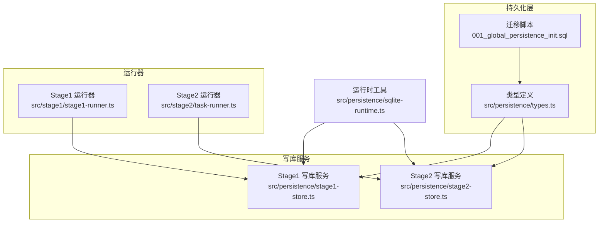
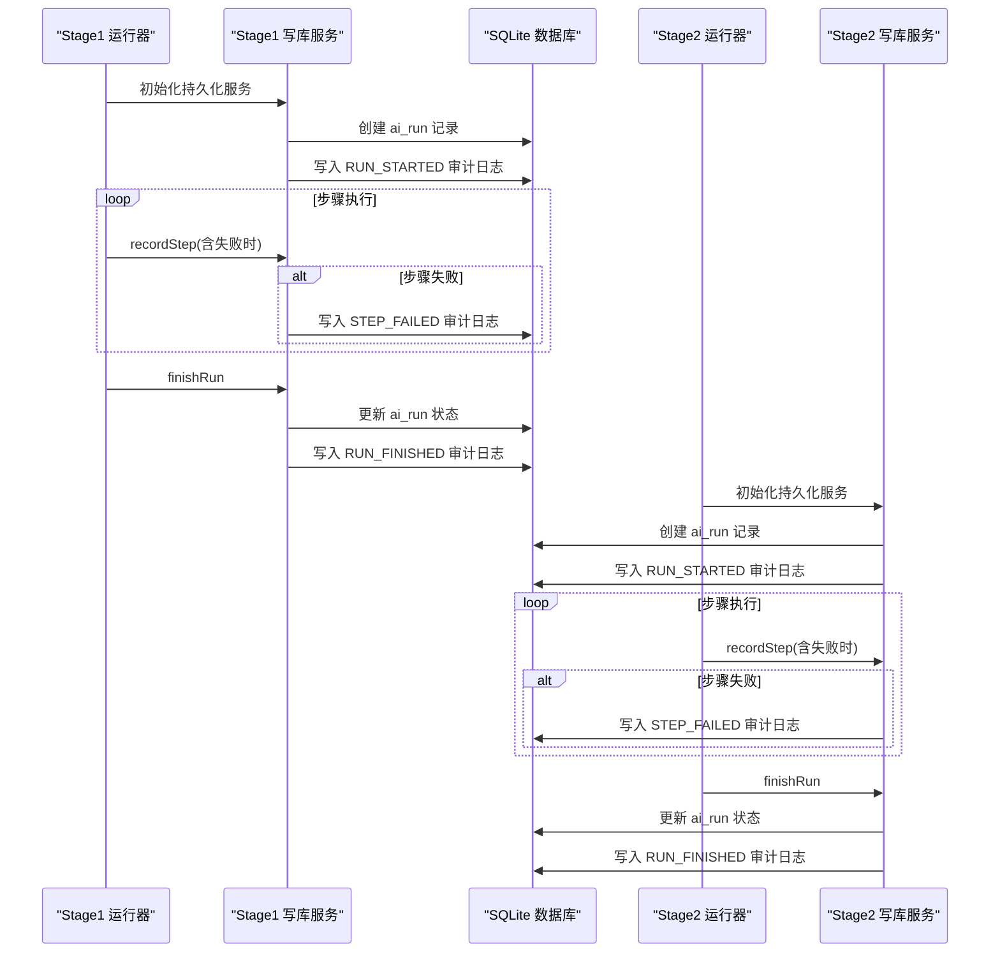
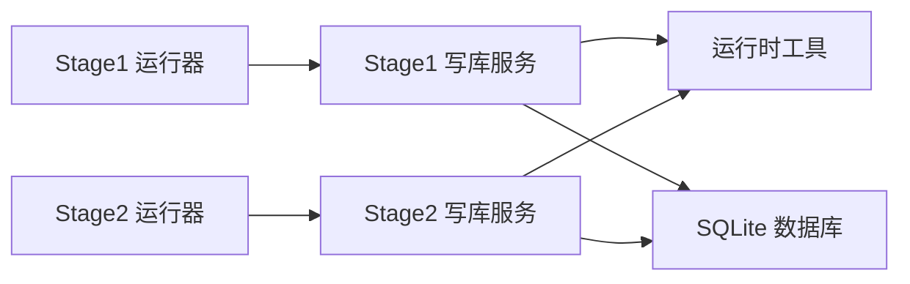

# 审计日志管理

<cite>
**本文引用的文件**
- [README.md](file://README.md)
- [001_global_persistence_init.sql](file://db/migrations/001_global_persistence_init.sql)
- [types.ts](file://src/persistence/types.ts)
- [stage1-store.ts](file://src/persistence/stage1-store.ts)
- [stage2-store.ts](file://src/persistence/stage2-store.ts)
- [sqlite-runtime.ts](file://src/persistence/sqlite-runtime.ts)
- [stage1-runner.ts](file://src/stage1/stage1-runner.ts)
- [task-runner.ts](file://src/stage2/task-runner.ts)
- [第二段数据持久化改造方案_2026-03-12.md](file://.plans/第二段数据持久化改造方案_2026-03-12.md)
</cite>

## 目录
1. [简介](#简介)
2. [项目结构](#项目结构)
3. [核心组件](#核心组件)
4. [架构总览](#架构总览)
5. [详细组件分析](#详细组件分析)
6. [依赖关系分析](#依赖关系分析)
7. [性能考量](#性能考量)
8. [故障排查指南](#故障排查指南)
9. [结论](#结论)
10. [附录](#附录)

## 简介
本文件系统性阐述项目中的审计日志管理机制，覆盖审计日志的插入策略、事件分类与编码标准、时间戳与排序、查询与分析、数据保留与清理、导出与报告以及与各实体记录的关联关系与触发时机。审计日志表为全局持久化底座的一部分，当前默认使用 SQLite 单文件数据库，后续可迁移至 MySQL。

## 项目结构
与审计日志相关的关键模块分布如下：
- 数据库层：迁移脚本定义审计日志表结构与索引
- 类型定义：统一的持久化模型，包含审计日志记录接口
- 写库服务：Stage1 与 Stage2 的持久化服务均内置审计日志插入逻辑
- 运行器：在关键节点（运行开始/结束、步骤失败）触发审计日志写入
- 运行时工具：提供日期格式化、ID 生成、迁移应用等基础设施

图表来源
- [001_global_persistence_init.sql:109-118](file://db/migrations/001_global_persistence_init.sql#L109-L118)
- [types.ts:115-123](file://src/persistence/types.ts#L115-L123)
- [stage1-store.ts:134-135](file://src/persistence/stage1-store.ts#L134-L135)
- [stage2-store.ts:122-123](file://src/persistence/stage2-store.ts#L122-L123)
- [sqlite-runtime.ts:73-84](file://src/persistence/sqlite-runtime.ts#L73-L84)
- [stage1-runner.ts:180-186](file://src/stage1/stage1-runner.ts#L180-L186)
- [task-runner.ts:2417-2434](file://src/stage2/task-runner.ts#L2417-L2434)

章节来源
- [README.md:101-135](file://README.md#L101-L135)
- [001_global_persistence_init.sql:109-118](file://db/migrations/001_global_persistence_init.sql#L109-L118)
- [types.ts:115-123](file://src/persistence/types.ts#L115-L123)

## 核心组件
- 审计日志表结构与索引
  - 表名：ai_audit_log
  - 关键字段：id、entity_type、entity_id、event_code、event_detail、operator_name、created_at
  - 索引：按 entity_type、entity_id、created_at 组合建立索引，便于按实体维度检索与时间排序
- 审计日志记录接口
  - 定义在类型文件中，包含实体类型、实体 ID、事件代码、事件详情、操作员名称、创建时间等字段
- 写库服务中的审计日志插入
  - Stage1 与 Stage2 的持久化服务均提供 insertAuditLog 方法，统一写入审计日志
  - 插入时设置 operator_name 为 runner 名称（stage1-runner 或 stage2-runner），created_at 使用统一格式化函数
- 运行器中的触发点
  - 运行开始：记录 RUN_STARTED
  - 步骤失败：记录 STEP_FAILED
  - 运行结束：记录 RUN_FINISHED

章节来源
- [001_global_persistence_init.sql:109-118](file://db/migrations/001_global_persistence_init.sql#L109-L118)
- [types.ts:115-123](file://src/persistence/types.ts#L115-L123)
- [stage1-store.ts:317-343](file://src/persistence/stage1-store.ts#L317-L343)
- [stage2-store.ts:305-331](file://src/persistence/stage2-store.ts#L305-L331)
- [stage1-runner.ts:180-186](file://src/stage1/stage1-runner.ts#L180-L186)
- [task-runner.ts:2417-2434](file://src/stage2/task-runner.ts#L2417-L2434)

## 架构总览
审计日志贯穿 Stage1 与 Stage2 的生命周期，在关键节点进行记录，确保事件可追溯、可分析。

图表来源
- [stage1-store.ts:134-135](file://src/persistence/stage1-store.ts#L134-L135)
- [stage1-store.ts:592-601](file://src/persistence/stage1-store.ts#L592-L601)
- [stage2-store.ts:122-123](file://src/persistence/stage2-store.ts#L122-L123)
- [stage2-store.ts:592-599](file://src/persistence/stage2-store.ts#L592-L599)

## 详细组件分析

### 审计日志表结构与索引
- 表结构要点
  - 主键：id
  - 实体标识：entity_type、entity_id
  - 事件标识：event_code
  - 事件详情：event_detail（可选）
  - 操作员：operator_name（可选）
  - 时间戳：created_at
- 索引设计
  - ai_audit_log_entity_created_at：按实体类型+实体ID+创建时间排序，有利于按实体维度检索与时间序列分析

章节来源
- [001_global_persistence_init.sql:109-118](file://db/migrations/001_global_persistence_init.sql#L109-L118)

### 审计日志记录接口
- 接口字段
  - id：唯一标识
  - entityType：实体类型（字符串）
  - entityId：实体 ID（字符串）
  - eventCode：事件代码（字符串）
  - eventDetail：事件详情（可选）
  - operatorName：操作员名称（可选）
  - createdAt：创建时间（字符串）

章节来源
- [types.ts:115-123](file://src/persistence/types.ts#L115-L123)

### 写库服务中的审计日志插入
- Stage1 写库服务
  - 初始化时写入 RUN_STARTED
  - 步骤失败时写入 STEP_FAILED
  - 运行结束时写入 RUN_FINISHED
  - operator_name 固定为 stage1-runner
- Stage2 写库服务
  - 初始化时写入 RUN_STARTED
  - 步骤失败时写入 STEP_FAILED
  - 运行结束时写入 RUN_FINISHED
  - operator_name 固定为 stage2-runner
- 插入时机
  - 与运行记录、步骤记录、快照与附件写入同属持久化服务的职责链，保证一致性

章节来源
- [stage1-store.ts:134-135](file://src/persistence/stage1-store.ts#L134-L135)
- [stage1-store.ts:592-601](file://src/persistence/stage1-store.ts#L592-L601)
- [stage1-store.ts:317-343](file://src/persistence/stage1-store.ts#L317-L343)
- [stage2-store.ts:122-123](file://src/persistence/stage2-store.ts#L122-L123)
- [stage2-store.ts:592-599](file://src/persistence/stage2-store.ts#L592-L599)
- [stage2-store.ts:305-331](file://src/persistence/stage2-store.ts#L305-L331)

### 运行器中的触发点
- Stage1 运行器
  - 在同步进度与记录步骤时，通过持久化服务回调写入审计日志
- Stage2 运行器
  - 在记录步骤时，通过持久化服务回调写入审计日志

章节来源
- [stage1-runner.ts:180-186](file://src/stage1/stage1-runner.ts#L180-L186)
- [task-runner.ts:2417-2434](file://src/stage2/task-runner.ts#L2417-L2434)

### 时间戳管理与排序机制
- 时间戳生成
  - 使用统一的日期格式化函数，确保 created_at 字段格式一致
- 排序策略
  - 索引按 entity_type、entity_id、created_at 排序，适合按实体维度进行时间序列查询
  - 由于 created_at 为字符串格式，排序遵循字典序；若需严格数值比较，可在查询时转换

章节来源
- [sqlite-runtime.ts:13-22](file://src/persistence/sqlite-runtime.ts#L13-L22)
- [001_global_persistence_init.sql:126-126](file://db/migrations/001_global_persistence_init.sql#L126-L126)

### 事件分类与编码标准
- 事件类别
  - 运行生命周期：RUN_STARTED、RUN_FINISHED
  - 步骤失败：STEP_FAILED
- 事件编码与详情
  - RUN_STARTED：记录运行开始，event_detail 包含运行标识与简要说明
  - RUN_FINISHED：记录运行结束，event_detail 包含运行结果状态
  - STEP_FAILED：记录步骤失败，event_detail 包含步骤名称与失败信息
- 实体类型与实体 ID
  - 实体类型：ai_run、ai_run_step、ai_task、ai_task_version 等
  - 实体 ID：对应具体记录的 id

章节来源
- [stage1-store.ts:195-196](file://src/persistence/stage1-store.ts#L195-L196)
- [stage1-store.ts:266-271](file://src/persistence/stage1-store.ts#L266-L271)
- [stage1-store.ts:592-599](file://src/persistence/stage1-store.ts#L592-L599)
- [stage1-store.ts:697-702](file://src/persistence/stage1-store.ts#L697-L702)
- [stage2-store.ts:183-184](file://src/persistence/stage2-store.ts#L183-L184)
- [stage2-store.ts:254-259](file://src/persistence/stage2-store.ts#L254-L259)
- [stage2-store.ts:581-588](file://src/persistence/stage2-store.ts#L581-L588)
- [stage2-store.ts:623-628](file://src/persistence/stage2-store.ts#L623-L628)

### 查询与分析功能
- 基于索引的查询
  - 可按实体类型与实体 ID 快速定位相关事件
  - 可按 created_at 进行时间序列分析
- 建议的查询维度
  - 按实体类型与实体 ID 聚合统计事件数量
  - 按事件代码分组统计失败率
  - 按时间段聚合运行成功率与平均耗时
- 事件追踪与操作历史
  - 通过 RUN_STARTED/RUN_FINISHED 串联一次运行的完整生命周期
  - 通过 STEP_FAILED 识别失败步骤与失败原因

章节来源
- [001_global_persistence_init.sql:126-126](file://db/migrations/001_global_persistence_init.sql#L126-L126)

### 数据保留策略与清理机制
- 现状
  - 代码库未提供专门的审计日志保留策略与自动清理机制
- 建议
  - 在生产环境中，建议结合运行产物的生命周期策略制定审计日志保留周期
  - 可通过定期维护脚本按实体维度或时间维度进行归档或清理
  - 清理前需评估合规性要求与审计需求

章节来源
- [README.md:101-135](file://README.md#L101-L135)

### 导出与报告功能
- 现状
  - 代码库未提供审计日志的导出与报告生成功能
- 建议
  - 提供基于 SQL 的导出接口，支持 CSV/JSON 格式
  - 生成合规性报告模板，包含运行轨迹、失败事件、关键指标等
  - 支持按时间范围、实体类型、事件代码等多维筛选

章节来源
- [README.md:101-135](file://README.md#L101-L135)

### 与各实体记录的关联关系与触发时机
- 关联关系
  - ai_run：记录运行开始与结束
  - ai_run_step：记录步骤失败
  - ai_task/ai_task_version：记录任务创建与版本创建
- 触发时机
  - 运行开始：持久化服务初始化时
  - 步骤失败：记录步骤时检测到失败
  - 运行结束：运行完成时更新状态并记录结束事件
  - 任务创建/版本创建：在任务写库时同步记录

章节来源
- [stage1-store.ts:134-135](file://src/persistence/stage1-store.ts#L134-L135)
- [stage1-store.ts:195-196](file://src/persistence/stage1-store.ts#L195-L196)
- [stage1-store.ts:266-271](file://src/persistence/stage1-store.ts#L266-L271)
- [stage1-store.ts:592-601](file://src/persistence/stage1-store.ts#L592-L601)
- [stage2-store.ts:122-123](file://src/persistence/stage2-store.ts#L122-L123)
- [stage2-store.ts:183-184](file://src/persistence/stage2-store.ts#L183-L184)
- [stage2-store.ts:254-259](file://src/persistence/stage2-store.ts#L254-L259)
- [stage2-store.ts:592-599](file://src/persistence/stage2-store.ts#L592-L599)

## 依赖关系分析
- 组件耦合
  - 写库服务与运行器通过回调方式解耦，降低耦合度
  - 审计日志插入依赖统一的日期格式化与 ID 生成工具
- 外部依赖
  - SQLite 驱动与迁移框架
  - 运行器负责业务流程，写库服务负责数据持久化

图表来源
- [stage1-store.ts:134-135](file://src/persistence/stage1-store.ts#L134-L135)
- [stage2-store.ts:122-123](file://src/persistence/stage2-store.ts#L122-L123)
- [sqlite-runtime.ts:73-84](file://src/persistence/sqlite-runtime.ts#L73-L84)

章节来源
- [stage1-store.ts:134-135](file://src/persistence/stage1-store.ts#L134-L135)
- [stage2-store.ts:122-123](file://src/persistence/stage2-store.ts#L122-L123)
- [sqlite-runtime.ts:73-84](file://src/persistence/sqlite-runtime.ts#L73-L84)

## 性能考量
- 索引利用
  - ai_audit_log_entity_created_at 索引可显著提升按实体维度与时间排序的查询性能
- 写入频率
  - 审计日志写入频率与运行步骤数相关，建议在批量写入时注意事务边界
- 时间戳格式
  - 字符串格式的时间戳排序简单高效，但需确保统一格式化策略

章节来源
- [001_global_persistence_init.sql:126-126](file://db/migrations/001_global_persistence_init.sql#L126-L126)
- [sqlite-runtime.ts:13-22](file://src/persistence/sqlite-runtime.ts#L13-L22)

## 故障排查指南
- 初始化失败
  - 若持久化初始化失败，写库服务会记录错误日志但不会阻断运行器执行
- 审计日志缺失
  - 检查运行器是否正确调用持久化服务的 recordStep/finishRun
  - 检查 operator_name 与 created_at 是否被正确设置
- 数据库不可用
  - 确认 SQLite 文件路径与权限，确保迁移脚本成功执行

章节来源
- [stage1-store.ts:706-714](file://src/persistence/stage1-store.ts#L706-L714)
- [stage2-store.ts:632-640](file://src/persistence/stage2-store.ts#L632-L640)
- [sqlite-runtime.ts:73-84](file://src/persistence/sqlite-runtime.ts#L73-L84)

## 结论
本项目已建立完善的审计日志体系，覆盖运行生命周期与关键失败事件，并通过统一的写库服务与运行器集成，确保事件可追溯、可分析。当前未提供保留策略、清理机制与导出报告功能，建议在生产环境中补充这些能力，并结合合规要求制定长期策略。

## 附录
- 事件编码与详情示例
  - RUN_STARTED：记录运行开始，event_detail 包含运行标识与简要说明
  - RUN_FINISHED：记录运行结束，event_detail 包含运行结果状态
  - STEP_FAILED：记录步骤失败，event_detail 包含步骤名称与失败信息
- 实体类型与实体 ID
  - 实体类型：ai_run、ai_run_step、ai_task、ai_task_version 等
  - 实体 ID：对应具体记录的 id

章节来源
- [stage1-store.ts:195-196](file://src/persistence/stage1-store.ts#L195-L196)
- [stage1-store.ts:266-271](file://src/persistence/stage1-store.ts#L266-L271)
- [stage1-store.ts:592-601](file://src/persistence/stage1-store.ts#L592-L601)
- [stage1-store.ts:697-702](file://src/persistence/stage1-store.ts#L697-L702)
- [stage2-store.ts:183-184](file://src/persistence/stage2-store.ts#L183-L184)
- [stage2-store.ts:254-259](file://src/persistence/stage2-store.ts#L254-L259)
- [stage2-store.ts:592-599](file://src/persistence/stage2-store.ts#L592-L599)
- [stage2-store.ts:623-628](file://src/persistence/stage2-store.ts#L623-L628)