# 运行记录管理

<cite>
**本文档引用的文件**
- [sqlite-runtime.ts](file://src/persistence/sqlite-runtime.ts)
- [types.ts](file://src/persistence/types.ts)
- [stage2-store.ts](file://src/persistence/stage2-store.ts)
- [task-runner.ts](file://src/stage2/task-runner.ts)
- [task-loader.ts](file://src/stage2/task-loader.ts)
- [001_global_persistence_init.sql](file://db/migrations/001_global_persistence_init.sql)
- [db.ts](file://config/db.ts)
- [stage2-acceptance-runner.spec.ts](file://tests/generated/stage2-acceptance-runner.spec.ts)
- [acceptance-task.template.json](file://specs/tasks/acceptance-task.template.json)
</cite>

## 目录
1. [简介](#简介)
2. [项目结构](#项目结构)
3. [核心组件](#核心组件)
4. [架构概览](#架构概览)
5. [详细组件分析](#详细组件分析)
6. [依赖分析](#依赖分析)
7. [性能考虑](#性能考虑)
8. [故障排除指南](#故障排除指南)
9. [结论](#结论)

## 简介

运行记录管理系统是本项目的核心数据持久化组件，负责跟踪和管理任务执行的完整生命周期。该系统实现了从任务创建、执行监控到结果存储的全流程数据管理，包括运行状态跟踪、时间戳管理、错误信息记录等功能。

系统采用SQLite作为本地数据库，通过迁移机制确保数据库结构的一致性，并提供了完整的运行记录生命周期管理功能。运行记录不仅记录了任务的基本信息，还包括详细的执行步骤、截图、审计日志等丰富的元数据信息。

## 项目结构

运行记录管理相关的代码主要分布在以下模块中：

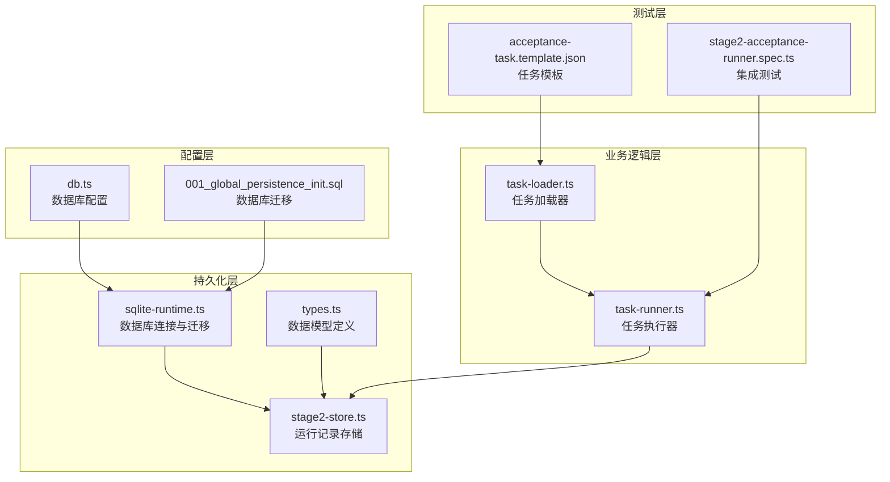

**图表来源**
- [sqlite-runtime.ts:1-116](file://src/persistence/sqlite-runtime.ts#L1-L116)
- [stage2-store.ts:1-655](file://src/persistence/stage2-store.ts#L1-L655)
- [types.ts:1-125](file://src/persistence/types.ts#L1-L125)

**章节来源**
- [sqlite-runtime.ts:1-116](file://src/persistence/sqlite-runtime.ts#L1-L116)
- [stage2-store.ts:1-655](file://src/persistence/stage2-store.ts#L1-L655)
- [types.ts:1-125](file://src/persistence/types.ts#L1-L125)

## 核心组件

### 数据模型定义

运行记录系统基于统一的数据模型定义，确保不同阶段的数据一致性：

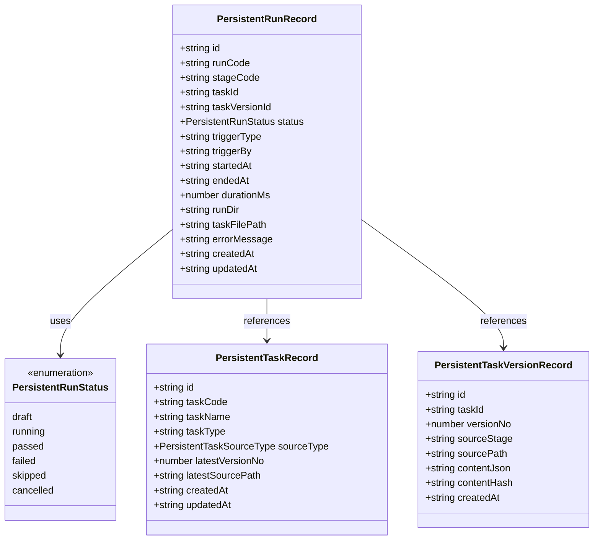

**图表来源**
- [types.ts:57-74](file://src/persistence/types.ts#L57-L74)
- [types.ts:11-17](file://src/persistence/types.ts#L11-L17)
- [types.ts:34-44](file://src/persistence/types.ts#L34-L44)
- [types.ts:46-55](file://src/persistence/types.ts#L46-L55)

### 数据库架构

系统采用SQLite作为本地存储，通过迁移机制维护数据库结构：

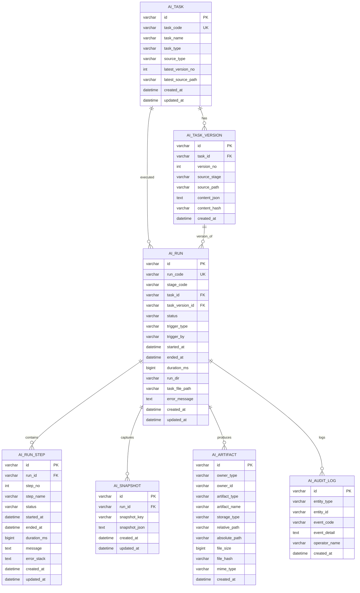

**图表来源**
- [001_global_persistence_init.sql:1-128](file://db/migrations/001_global_persistence_init.sql#L1-L128)

**章节来源**
- [types.ts:1-125](file://src/persistence/types.ts#L1-L125)
- [001_global_persistence_init.sql:1-128](file://db/migrations/001_global_persistence_init.sql#L1-L128)

## 架构概览

运行记录管理采用分层架构设计，确保各层职责清晰分离：

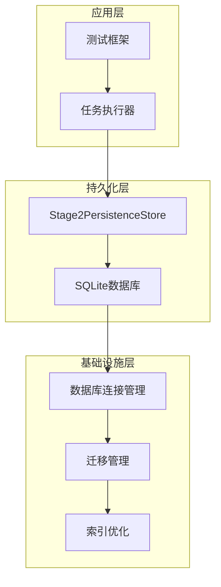

**图表来源**
- [stage2-store.ts:74-123](file://src/persistence/stage2-store.ts#L74-L123)
- [sqlite-runtime.ts:73-84](file://src/persistence/sqlite-runtime.ts#L73-L84)

系统的核心工作流程如下：

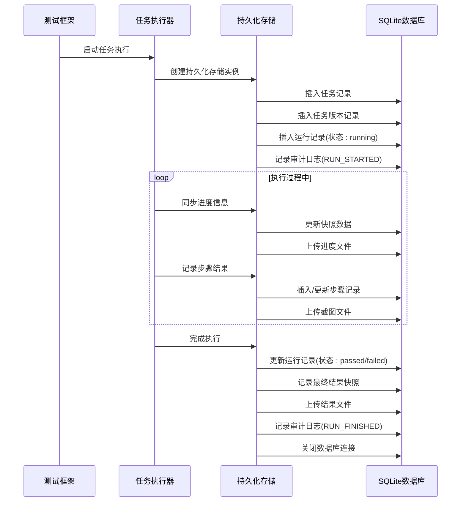

**图表来源**
- [stage2-store.ts:101-123](file://src/persistence/stage2-store.ts#L101-L123)
- [stage2-store.ts:470-493](file://src/persistence/stage2-store.ts#L470-L493)
- [stage2-store.ts:495-590](file://src/persistence/stage2-store.ts#L495-L590)
- [stage2-store.ts:592-630](file://src/persistence/stage2-store.ts#L592-L630)

**章节来源**
- [stage2-store.ts:1-655](file://src/persistence/stage2-store.ts#L1-L655)
- [task-runner.ts:1-800](file://src/stage2/task-runner.ts#L1-L800)

## 详细组件分析

### 运行记录创建机制

运行记录的创建遵循严格的生命周期管理：

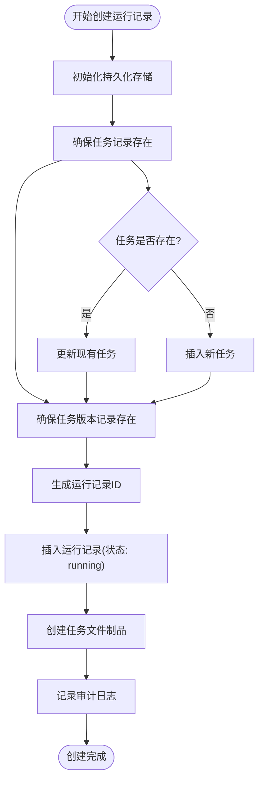

**图表来源**
- [stage2-store.ts:101-123](file://src/persistence/stage2-store.ts#L101-L123)
- [stage2-store.ts:135-185](file://src/persistence/stage2-store.ts#L135-L185)
- [stage2-store.ts:187-261](file://src/persistence/stage2-store.ts#L187-L261)
- [stage2-store.ts:263-303](file://src/persistence/stage2-store.ts#L263-L303)

运行记录创建的关键特性：
- **唯一标识符生成**：使用`createPersistentId`函数生成全局唯一的ID
- **时间戳管理**：使用`formatDbDate`统一格式化时间戳
- **状态初始化**：运行记录初始状态设置为"running"
- **关联关系建立**：自动建立与任务和任务版本的外键关联

**章节来源**
- [stage2-store.ts:101-123](file://src/persistence/stage2-store.ts#L101-L123)
- [sqlite-runtime.ts:24-30](file://src/persistence/sqlite-runtime.ts#L24-L30)
- [sqlite-runtime.ts:13-22](file://src/persistence/sqlite-runtime.ts#L13-L22)

### 运行状态跟踪机制

系统实现了完整的运行状态跟踪，支持多种状态转换：

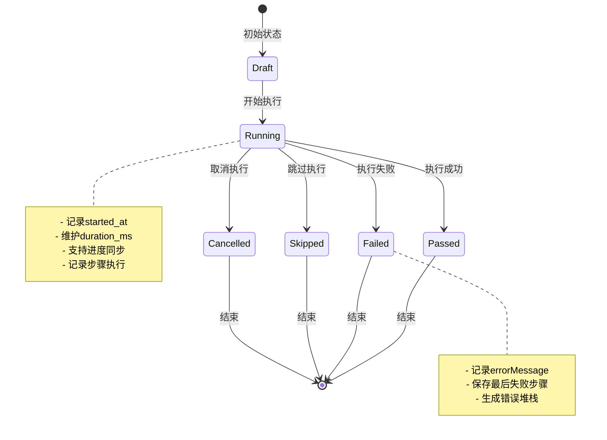

**图表来源**
- [types.ts:11-17](file://src/persistence/types.ts#L11-L17)
- [stage2-store.ts:333-356](file://src/persistence/stage2-store.ts#L333-L356)

状态转换的具体实现：
- **状态枚举**：定义了完整的运行状态集合
- **状态更新**：通过`updateRunRecord`方法统一管理状态变更
- **错误处理**：失败状态时自动记录错误信息和堆栈
- **时间计算**：实时计算执行持续时间

**章节来源**
- [types.ts:11-17](file://src/persistence/types.ts#L11-L17)
- [stage2-store.ts:333-356](file://src/persistence/stage2-store.ts#L333-L356)

### 时间戳管理机制

系统采用统一的时间戳管理策略：

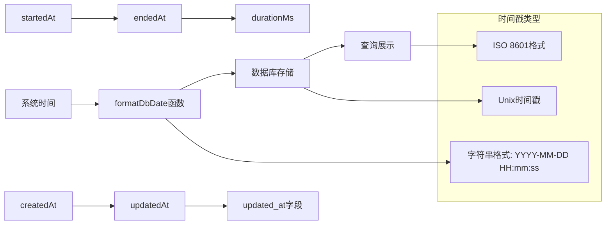

**图表来源**
- [sqlite-runtime.ts:13-22](file://src/persistence/sqlite-runtime.ts#L13-L22)
- [stage2-store.ts:263-303](file://src/persistence/stage2-store.ts#L263-L303)

时间戳管理的关键特性：
- **格式统一**：所有时间戳统一格式化为标准字符串
- **精度控制**：精确到秒级的时间戳
- **自动更新**：每次更新操作自动刷新`updated_at`字段
- **计算逻辑**：`durationMs = endedAt - startedAt`

**章节来源**
- [sqlite-runtime.ts:13-22](file://src/persistence/sqlite-runtime.ts#L13-L22)
- [stage2-store.ts:263-303](file://src/persistence/stage2-store.ts#L263-L303)

### 错误信息记录机制

系统提供了完善的错误信息记录和处理机制：

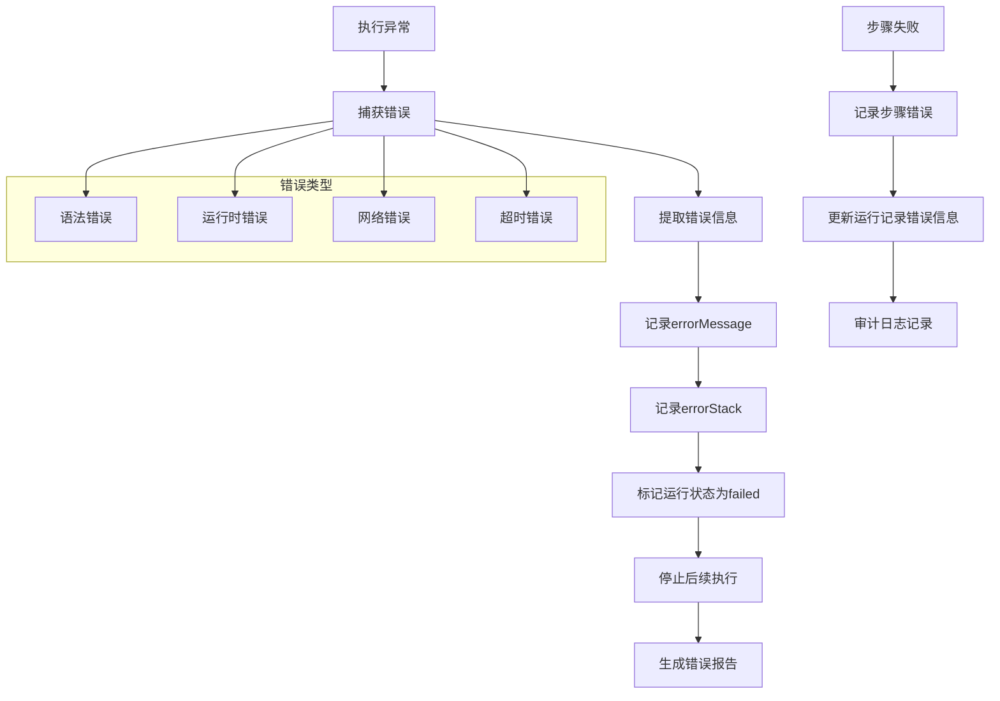

**图表来源**
- [stage2-store.ts:592-630](file://src/persistence/stage2-store.ts#L592-L630)
- [stage2-store.ts:581-588](file://src/persistence/stage2-store.ts#L581-L588)

错误处理的具体实现：
- **错误捕获**：所有持久化操作都包含错误处理逻辑
- **信息提取**：自动提取错误消息和堆栈信息
- **状态标记**：失败时自动更新运行状态
- **审计记录**：记录详细的错误审计日志

**章节来源**
- [stage2-store.ts:592-630](file://src/persistence/stage2-store.ts#L592-L630)
- [stage2-store.ts:581-588](file://src/persistence/stage2-store.ts#L581-L588)

### 运行记录与任务版本关联

系统实现了运行记录与任务版本的强关联关系：

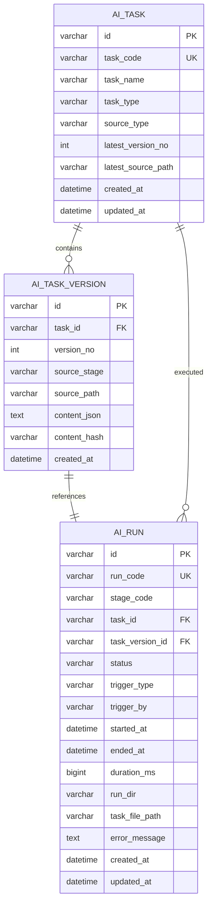

**图表来源**
- [001_global_persistence_init.sql:15-30](file://db/migrations/001_global_persistence_init.sql#L15-L30)
- [001_global_persistence_init.sql:32-57](file://db/migrations/001_global_persistence_init.sql#L32-L57)

关联关系的实现细节：
- **外键约束**：确保数据完整性
- **级联删除**：任务删除时自动清理相关版本
- **版本追踪**：记录任务的版本历史
- **最新版本**：维护任务的最新版本号

**章节来源**
- [001_global_persistence_init.sql:15-30](file://db/migrations/001_global_persistence_init.sql#L15-L30)
- [001_global_persistence_init.sql:32-57](file://db/migrations/001_global_persistence_init.sql#L32-L57)

### 运行记录生命周期管理

运行记录的完整生命周期包括多个阶段：

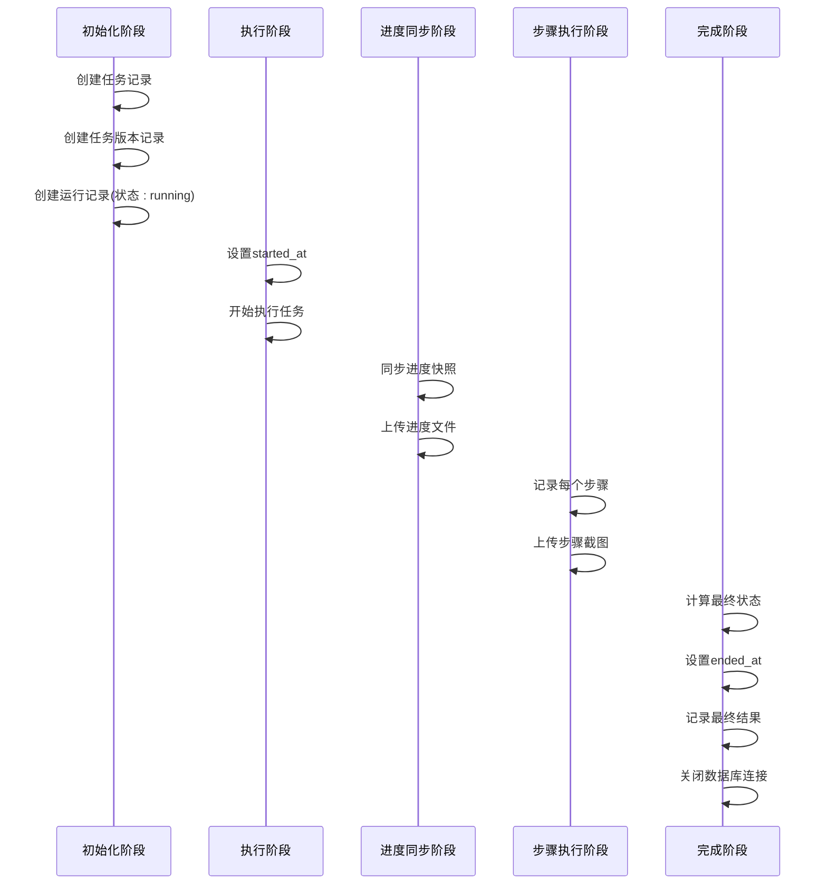

**图表来源**
- [stage2-store.ts:101-123](file://src/persistence/stage2-store.ts#L101-L123)
- [stage2-store.ts:470-493](file://src/persistence/stage2-store.ts#L470-L493)
- [stage2-store.ts:495-590](file://src/persistence/stage2-store.ts#L495-L590)
- [stage2-store.ts:592-630](file://src/persistence/stage2-store.ts#L592-L630)

生命周期管理的关键特性：
- **原子性保证**：使用事务确保数据一致性
- **回滚机制**：异常情况下自动回滚
- **资源清理**：确保数据库连接正确关闭
- **审计追踪**：完整记录每个阶段的操作

**章节来源**
- [stage2-store.ts:101-123](file://src/persistence/stage2-store.ts#L101-L123)
- [stage2-store.ts:470-493](file://src/persistence/stage2-store.ts#L470-L493)
- [stage2-store.ts:495-590](file://src/persistence/stage2-store.ts#L495-L590)
- [stage2-store.ts:592-630](file://src/persistence/stage2-store.ts#L592-L630)

### 统计信息聚合与查询优化

系统提供了多种统计信息聚合和查询优化机制：

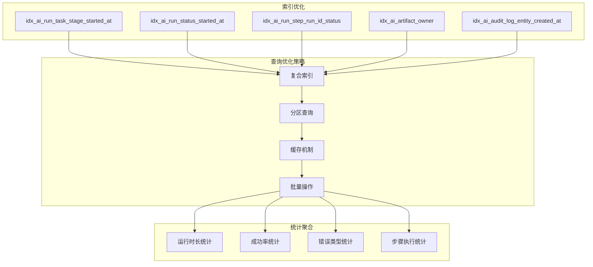

**图表来源**
- [001_global_persistence_init.sql:120-126](file://db/migrations/001_global_persistence_init.sql#L120-L126)

查询优化的具体实现：
- **复合索引**：针对常用查询条件建立复合索引
- **分区策略**：按时间范围分区提高查询效率
- **缓存机制**：热点数据缓存减少数据库访问
- **批量操作**：批量插入和更新提升性能

**章节来源**
- [001_global_persistence_init.sql:120-126](file://db/migrations/001_global_persistence_init.sql#L120-L126)

### 过滤和排序机制

系统支持多种过滤和排序方式：

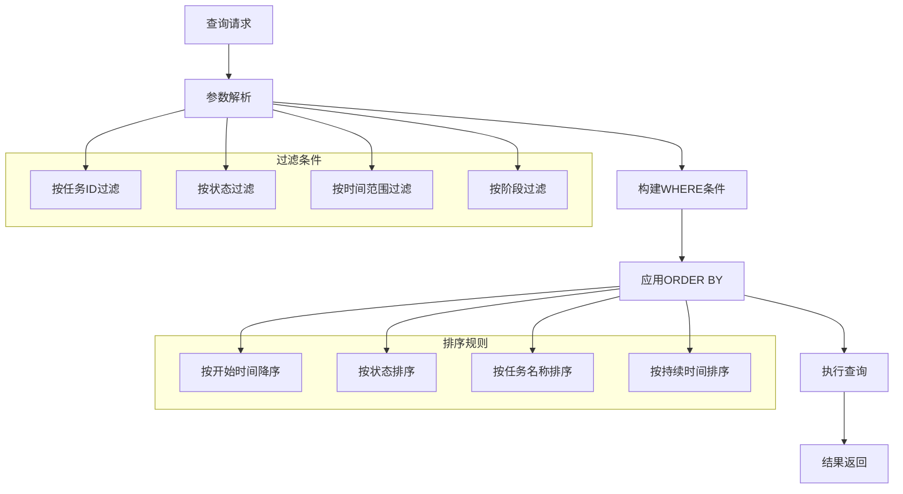

**图表来源**
- [001_global_persistence_init.sql:120-126](file://db/migrations/001_global_persistence_init.sql#L120-L126)

过滤和排序的具体实现：
- **多维过滤**：支持按任务、状态、时间等多种维度过滤
- **灵活排序**：支持多种排序规则和组合排序
- **性能优化**：通过索引优化查询性能
- **分页支持**：支持大数据量的分页查询

**章节来源**
- [001_global_persistence_init.sql:120-126](file://db/migrations/001_global_persistence_init.sql#L120-L126)

## 依赖分析

运行记录管理系统的依赖关系如下：

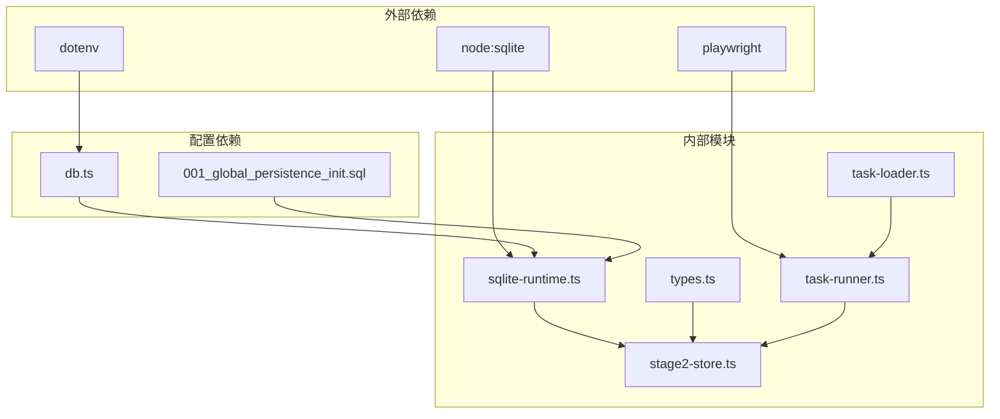

**图表来源**
- [sqlite-runtime.ts:1-6](file://src/persistence/sqlite-runtime.ts#L1-L6)
- [stage2-store.ts:1-14](file://src/persistence/stage2-store.ts#L1-L14)
- [db.ts:1-28](file://config/db.ts#L1-L28)

依赖关系的特点：
- **低耦合**：各模块职责清晰，耦合度较低
- **可扩展**：支持添加新的持久化后端
- **配置驱动**：通过环境变量控制运行行为
- **向前兼容**：数据库结构设计考虑MySQL兼容性

**章节来源**
- [sqlite-runtime.ts:1-6](file://src/persistence/sqlite-runtime.ts#L1-L6)
- [stage2-store.ts:1-14](file://src/persistence/stage2-store.ts#L1-L14)
- [db.ts:1-28](file://config/db.ts#L1-L28)

## 性能考虑

运行记录管理系统在性能方面采用了多项优化措施：

### 数据库性能优化
- **索引策略**：为常用查询字段建立复合索引
- **事务管理**：合理使用事务提升批量操作性能
- **连接池**：复用数据库连接减少开销
- **批量操作**：支持批量插入和更新操作

### 内存管理
- **流式处理**：大文件采用流式处理避免内存溢出
- **垃圾回收**：及时释放不再使用的对象引用
- **缓存策略**：合理使用缓存提升查询性能

### 网络优化
- **异步操作**：非阻塞I/O操作提升响应速度
- **并发控制**：合理的并发度控制避免资源竞争

## 故障排除指南

### 常见问题及解决方案

**数据库连接问题**
- **症状**：无法连接到SQLite数据库
- **原因**：数据库文件路径错误或权限不足
- **解决**：检查`DB_FILE_PATH`环境变量和文件权限

**迁移失败问题**
- **症状**：数据库迁移执行失败
- **原因**：SQL语句语法错误或数据冲突
- **解决**：检查迁移文件内容和数据库状态

**运行记录丢失问题**
- **症状**：运行记录无法查询到
- **原因**：查询条件错误或索引失效
- **解决**：检查WHERE条件和索引使用情况

**性能问题**
- **症状**：查询响应缓慢
- **原因**：缺少必要索引或查询条件不当
- **解决**：添加合适的索引和优化查询语句

### 调试技巧

**启用详细日志**
- 在持久化存储中添加调试输出
- 监控数据库操作的执行时间
- 记录关键操作的状态变化

**性能监控**
- 监控数据库连接数
- 分析查询执行计划
- 检查索引使用情况

**数据完整性检查**
- 定期检查外键约束
- 验证数据格式一致性
- 监控数据量增长趋势

**章节来源**
- [stage2-store.ts:125-133](file://src/persistence/stage2-store.ts#L125-L133)
- [sqlite-runtime.ts:109-113](file://src/persistence/sqlite-runtime.ts#L109-L113)

## 结论

运行记录管理系统是一个设计精良、功能完整的数据持久化解决方案。系统通过以下关键特性实现了高效的运行记录管理：

**架构优势**
- **分层清晰**：各层职责明确，便于维护和扩展
- **数据一致**：通过事务和外键约束确保数据完整性
- **性能优化**：合理的索引设计和查询优化策略

**功能特性**
- **完整生命周期**：从创建到结束的全生命周期管理
- **状态跟踪**：完整的运行状态跟踪和转换机制
- **错误处理**：完善的错误信息记录和处理机制
- **审计日志**：详细的审计日志支持追溯分析

**技术特点**
- **SQLite集成**：轻量级本地数据库，部署简单
- **配置驱动**：通过环境变量灵活配置系统行为
- **向前兼容**：数据库结构设计考虑MySQL兼容性
- **性能优化**：多项性能优化措施确保系统高效运行

该系统为任务执行提供了可靠的数据支撑，支持复杂的查询需求和统计分析，是整个自动化测试框架的重要组成部分。