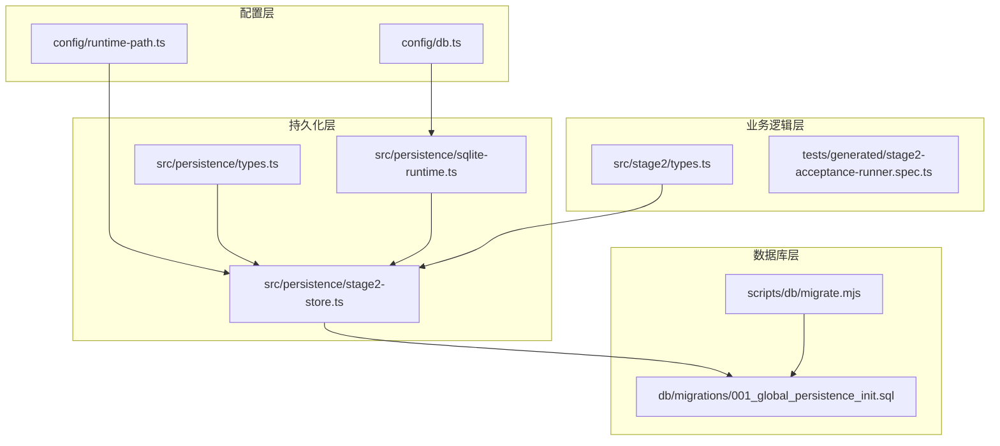
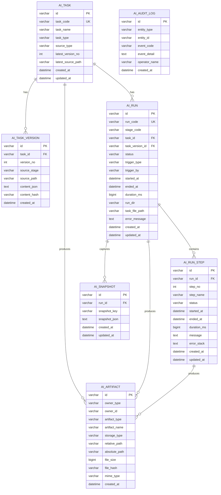
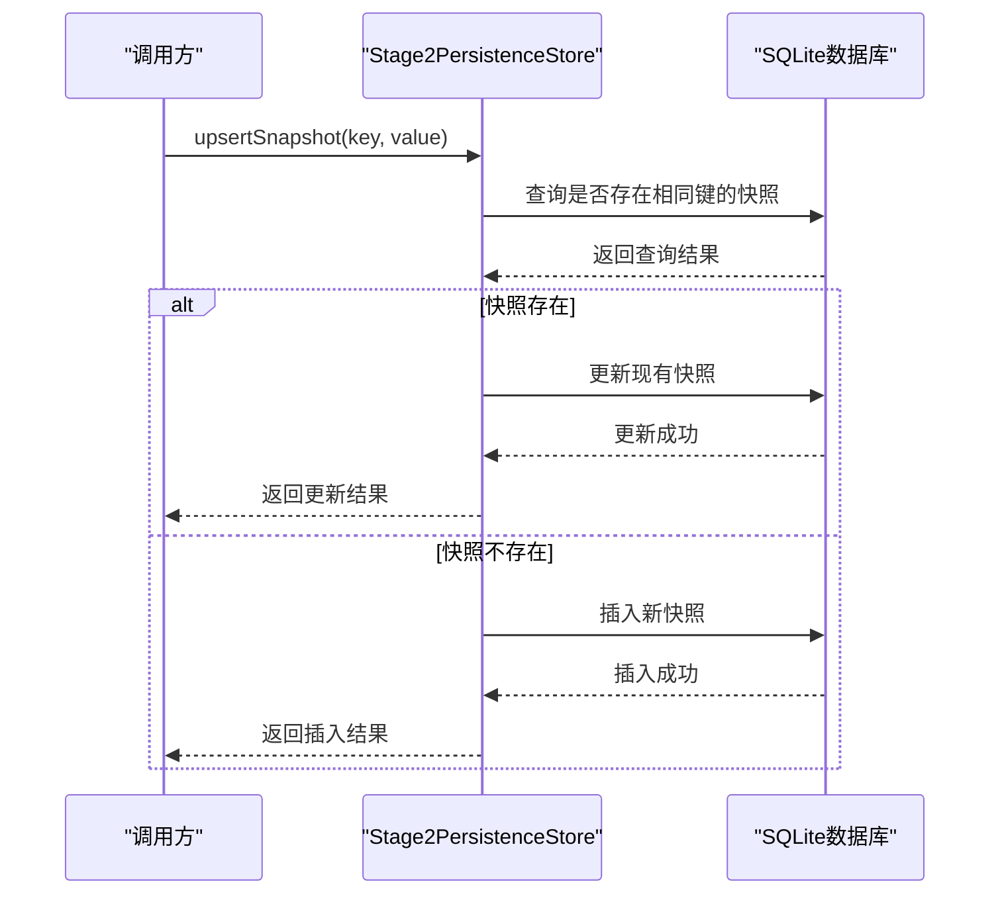
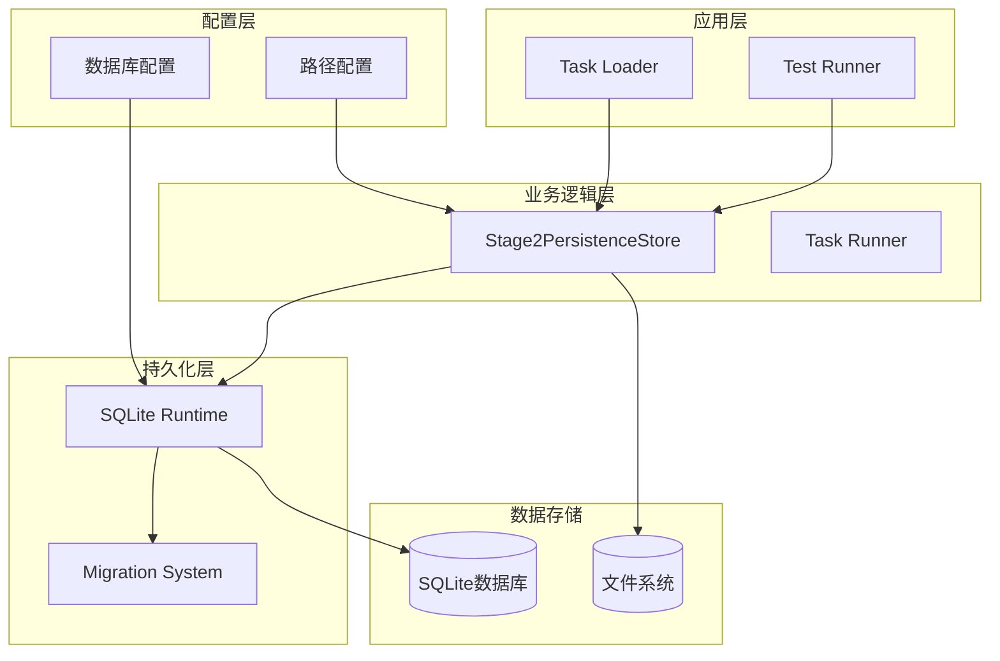
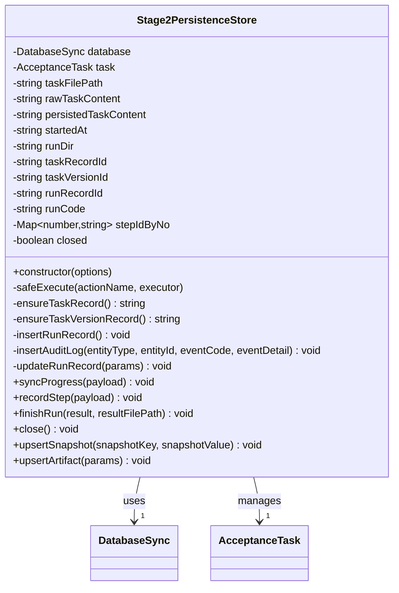
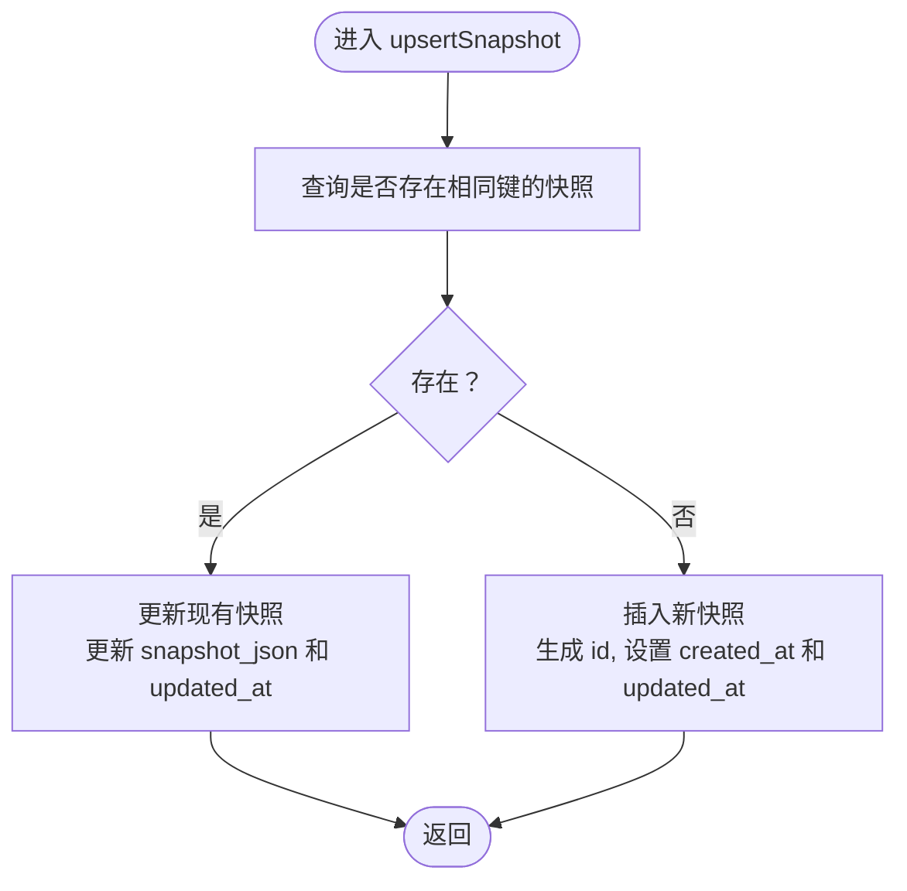
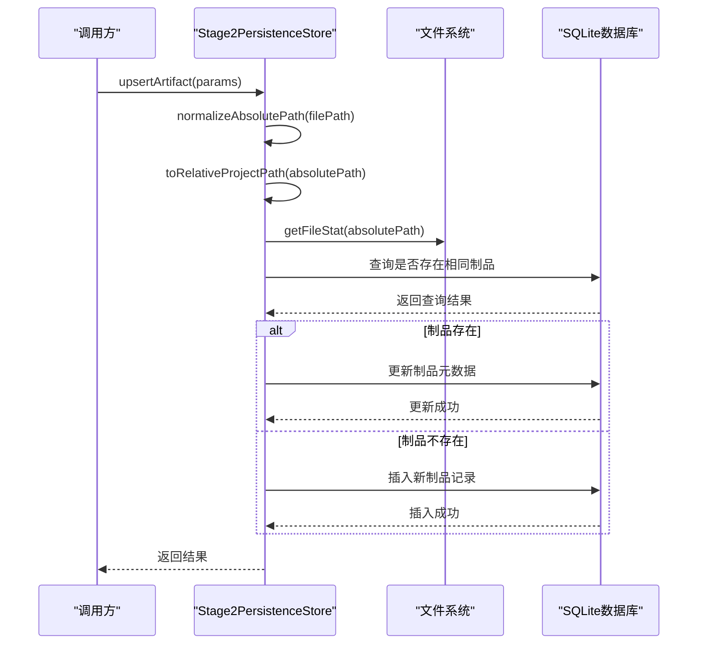
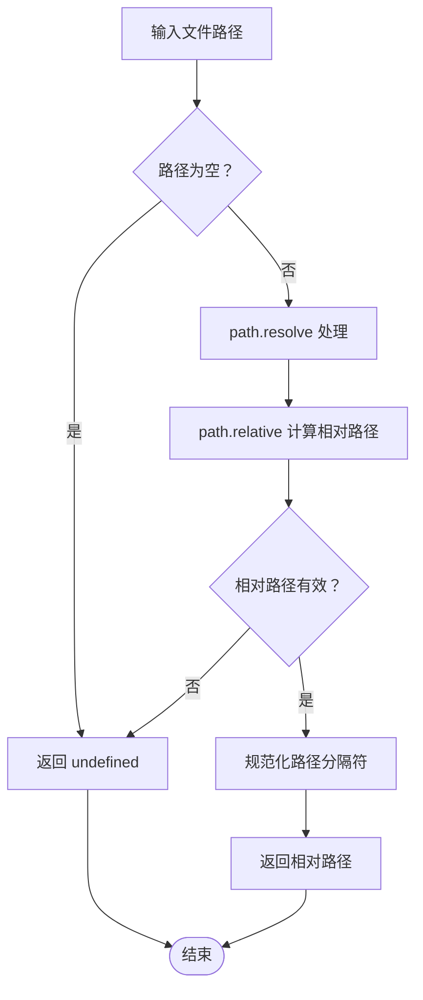
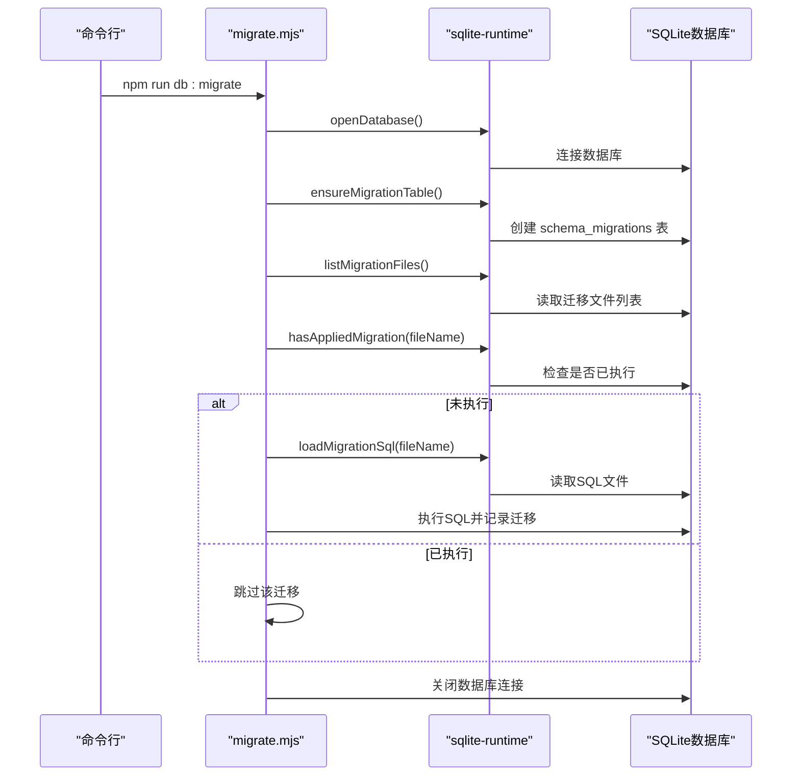
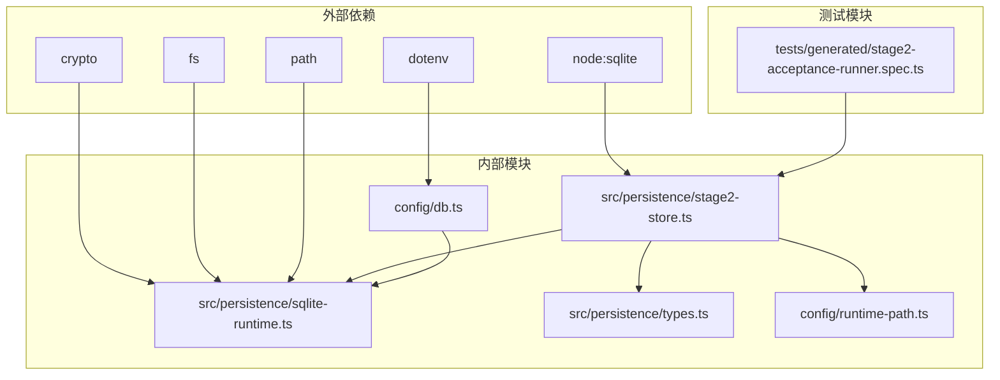

# 快照和制品管理

<cite>
**本文档引用的文件**
- [src/persistence/types.ts](file://src/persistence/types.ts)
- [src/persistence/stage2-store.ts](file://src/persistence/stage2-store.ts)
- [src/persistence/sqlite-runtime.ts](file://src/persistence/sqlite-runtime.ts)
- [config/db.ts](file://config/db.ts)
- [config/runtime-path.ts](file://config/runtime-path.ts)
- [db/migrations/001_global_persistence_init.sql](file://db/migrations/001_global_persistence_init.sql)
- [src/stage2/types.ts](file://src/stage2/types.ts)
- [README.md](file://README.md)
- [tests/generated/stage2-acceptance-runner.spec.ts](file://tests/generated/stage2-acceptance-runner.spec.ts)
- [scripts/db/migrate.mjs](file://scripts/db/migrate.mjs)
</cite>

## 目录
1. [简介](#简介)
2. [项目结构](#项目结构)
3. [核心组件](#核心组件)
4. [架构概览](#架构概览)
5. [详细组件分析](#详细组件分析)
6. [依赖关系分析](#依赖关系分析)
7. [性能考虑](#性能考虑)
8. [故障排除指南](#故障排除指南)
9. [结论](#结论)

## 简介

本项目是一个基于 Playwright 和 Midscene.js 的 AI 自动化测试系统，专注于快照管理和制品管理。系统通过 SQLite 数据库存储结构化数据和文件路径，实现了完整的测试执行生命周期管理。

系统的核心特性包括：
- **快照管理**：实时捕获和更新执行过程中的关键状态
- **制品管理**：统一管理各种测试产物（截图、报告、结果文件等）
- **数据持久化**：基于 SQLite 的本地数据库存储
- **文件路径管理**：支持绝对路径和相对路径的转换
- **安全考虑**：敏感信息（如密码）的自动掩码处理

## 项目结构

项目采用模块化的组织方式，主要分为以下几个核心模块：

**图表来源**
- [config/db.ts:1-28](file://config/db.ts#L1-L28)
- [config/runtime-path.ts:1-46](file://config/runtime-path.ts#L1-L46)
- [src/persistence/stage2-store.ts:1-655](file://src/persistence/stage2-store.ts#L1-L655)

**章节来源**
- [README.md:101-135](file://README.md#L101-L135)
- [config/db.ts:1-28](file://config/db.ts#L1-L28)
- [config/runtime-path.ts:1-46](file://config/runtime-path.ts#L1-L46)

## 核心组件

### 数据模型定义

系统定义了完整的数据持久化模型，包括任务、版本、运行、步骤、快照和制品等核心实体。

**图表来源**
- [db/migrations/001_global_persistence_init.sql:1-128](file://db/migrations/001_global_persistence_init.sql#L1-L128)

### 快照管理机制

系统实现了高效的快照管理机制，通过 `upsertSnapshot` 方法实现插入和更新的统一处理。

**图表来源**
- [src/persistence/stage2-store.ts:358-395](file://src/persistence/stage2-store.ts#L358-L395)

**章节来源**
- [src/persistence/stage2-store.ts:358-395](file://src/persistence/stage2-store.ts#L358-L395)
- [src/persistence/types.ts:91-98](file://src/persistence/types.ts#L91-L98)

## 架构概览

系统采用分层架构设计，确保了良好的可维护性和扩展性：

**图表来源**
- [src/persistence/stage2-store.ts:74-123](file://src/persistence/stage2-store.ts#L74-L123)
- [src/persistence/sqlite-runtime.ts:73-84](file://src/persistence/sqlite-runtime.ts#L73-L84)

**章节来源**
- [src/persistence/stage2-store.ts:74-123](file://src/persistence/stage2-store.ts#L74-L123)
- [src/persistence/sqlite-runtime.ts:73-114](file://src/persistence/sqlite-runtime.ts#L73-L114)

## 详细组件分析

### Stage2PersistenceStore 类

`Stage2PersistenceStore` 是系统的核心类，负责管理整个测试执行过程中的数据持久化。

**图表来源**
- [src/persistence/stage2-store.ts:74-641](file://src/persistence/stage2-store.ts#L74-L641)

#### upsertSnapshot 方法详解

`upsertSnapshot` 方法实现了快照的插入和更新逻辑，具有以下特点：

1. **唯一性约束**：通过 `(run_id, snapshot_key)` 确保每个运行实例的快照键唯一
2. **JSON 序列化**：使用 `normalizeTextContent` 方法将任意数据结构转换为 JSON 字符串
3. **原子性操作**：查询、插入、更新操作都在同一个事务中完成
4. **时间戳管理**：自动维护 `created_at` 和 `updated_at` 字段

**图表来源**
- [src/persistence/stage2-store.ts:358-395](file://src/persistence/stage2-store.ts#L358-L395)

#### upsertArtifact 方法详解

`upsertArtifact` 方法负责制品的文件关联和元数据存储，支持多种制品类型：

**制品类型分类**：
- **任务相关**：`task_json` - 任务定义文件
- **执行结果**：`result_json` - 最终执行结果
- **进度信息**：`progress_json` - 执行进度快照
- **视觉产物**：`screenshot` - 步骤截图
- **报告文件**：`playwright_report`, `midscene_report` - 各种报告
- **其他文件**：`other` - 其他类型的制品

**图表来源**
- [src/persistence/stage2-store.ts:397-468](file://src/persistence/stage2-store.ts#L397-L468)

**章节来源**
- [src/persistence/stage2-store.ts:397-468](file://src/persistence/stage2-store.ts#L397-L468)
- [src/persistence/types.ts:25-32](file://src/persistence/types.ts#L25-L32)

### 文件路径处理机制

系统实现了智能的文件路径处理机制，支持绝对路径和相对路径的双向转换：

**图表来源**
- [src/persistence/sqlite-runtime.ts:32-41](file://src/persistence/sqlite-runtime.ts#L32-L41)

**章节来源**
- [src/persistence/sqlite-runtime.ts:32-41](file://src/persistence/sqlite-runtime.ts#L32-L41)
- [config/runtime-path.ts:43-45](file://config/runtime-path.ts#L43-L45)

### 数据库迁移系统

系统提供了完整的数据库迁移机制，确保数据库结构的一致性和可维护性：

**图表来源**
- [scripts/db/migrate.mjs:15-51](file://scripts/db/migrate.mjs#L15-L51)
- [src/persistence/sqlite-runtime.ts:86-114](file://src/persistence/sqlite-runtime.ts#L86-L114)

**章节来源**
- [scripts/db/migrate.mjs:15-51](file://scripts/db/migrate.mjs#L15-L51)
- [src/persistence/sqlite-runtime.ts:86-114](file://src/persistence/sqlite-runtime.ts#L86-L114)

## 依赖关系分析

系统采用了清晰的依赖层次结构，确保了模块间的松耦合：

**图表来源**
- [src/persistence/stage2-store.ts:1-13](file://src/persistence/stage2-store.ts#L1-L13)
- [src/persistence/sqlite-runtime.ts:1-5](file://src/persistence/sqlite-runtime.ts#L1-L5)

**章节来源**
- [src/persistence/stage2-store.ts:1-13](file://src/persistence/stage2-store.ts#L1-L13)
- [src/persistence/sqlite-runtime.ts:1-5](file://src/persistence/sqlite-runtime.ts#L1-L5)

## 性能考虑

系统在设计时充分考虑了性能优化：

### 数据库性能优化
- **索引设计**：为常用查询字段建立了适当的索引
- **批量操作**：使用事务批量执行数据库操作
- **连接池**：单例模式管理数据库连接

### 内存管理
- **对象池**：使用 Map 缓存步骤 ID 映射
- **延迟加载**：文件统计信息按需计算
- **资源释放**：及时关闭数据库连接

### I/O 优化
- **路径缓存**：避免重复的路径解析操作
- **文件统计**：只在需要时进行文件大小统计
- **JSON 序列化**：使用高效的序列化方法

## 故障排除指南

### 常见问题及解决方案

**数据库连接失败**
- 检查数据库文件路径配置
- 确认数据库文件权限
- 验证 SQLite 驱动安装

**迁移执行失败**
- 检查 SQL 文件语法
- 确认数据库版本兼容性
- 查看迁移日志错误信息

**文件路径问题**
- 验证文件是否存在
- 检查相对路径计算逻辑
- 确认路径分隔符规范化

**内存泄漏**
- 确认数据库连接正确关闭
- 检查对象引用循环
- 验证事件监听器清理

**章节来源**
- [src/persistence/stage2-store.ts:125-133](file://src/persistence/stage2-store.ts#L125-L133)
- [src/persistence/sqlite-runtime.ts:73-84](file://src/persistence/sqlite-runtime.ts#L73-L84)

## 结论

本项目成功实现了完整的快照和制品管理系统，具有以下优势：

1. **架构清晰**：分层设计确保了良好的可维护性
2. **功能完整**：覆盖了测试执行的全生命周期
3. **性能优秀**：通过合理的优化策略提升了执行效率
4. **安全可靠**：内置了敏感信息保护和错误处理机制

系统目前支持 SQLite 本地存储，未来可以扩展到 MySQL 等其他数据库系统。通过标准化的数据模型和统一的接口设计，为后续的功能扩展奠定了坚实的基础。