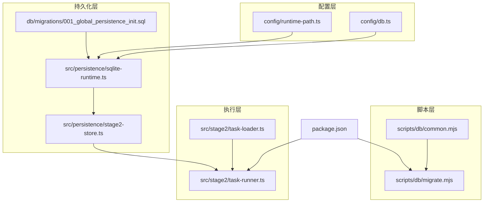
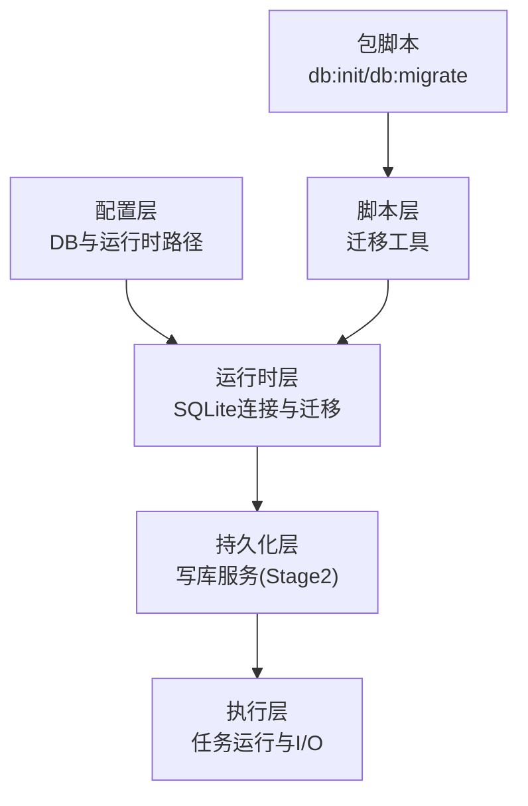
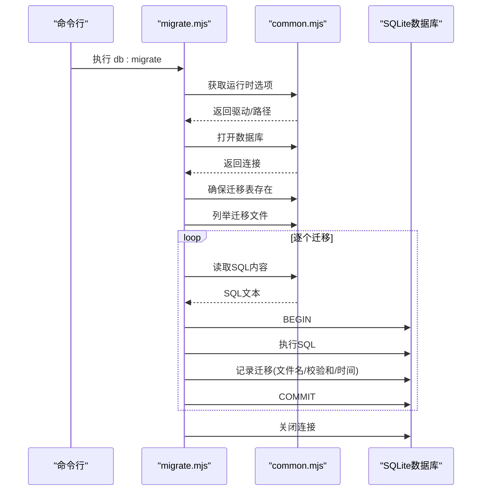
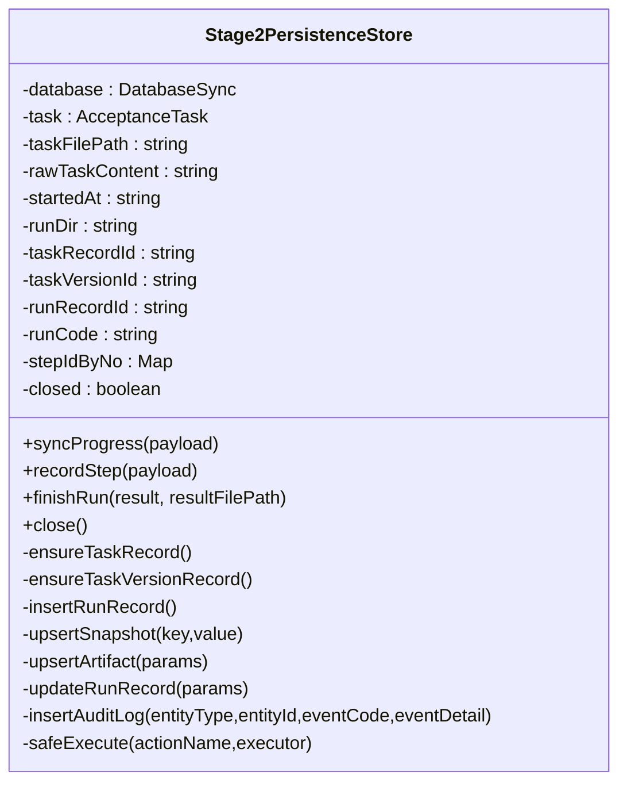
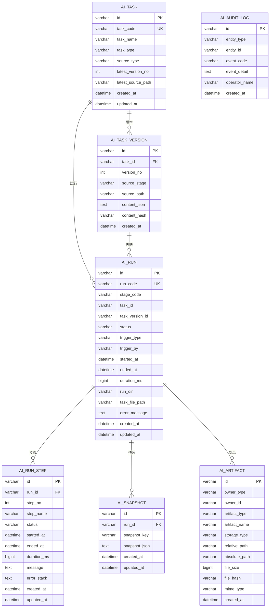
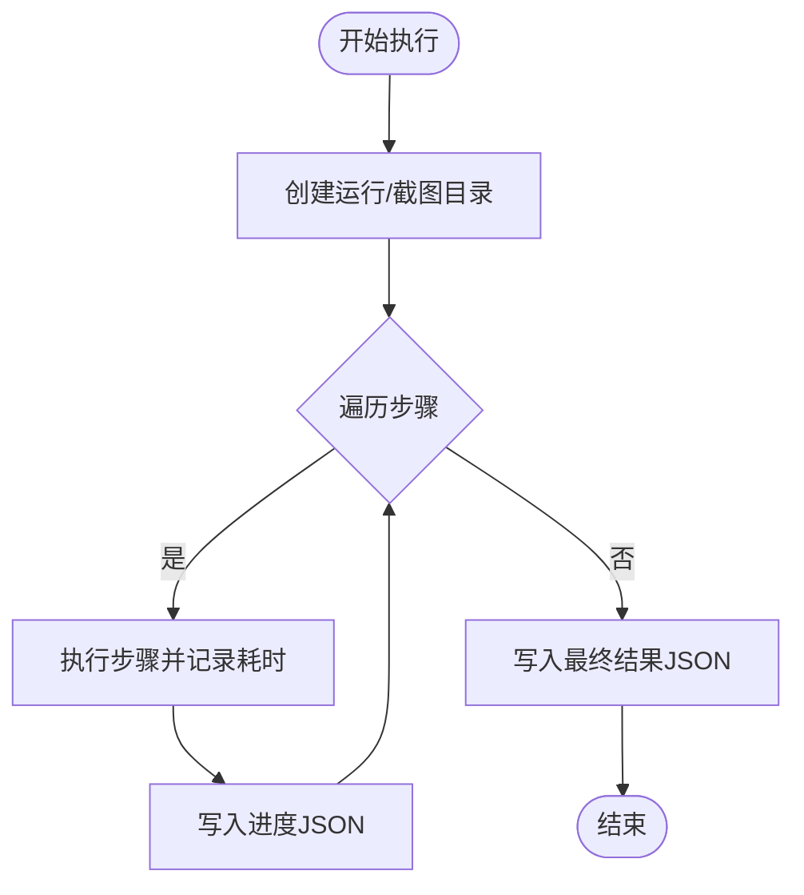
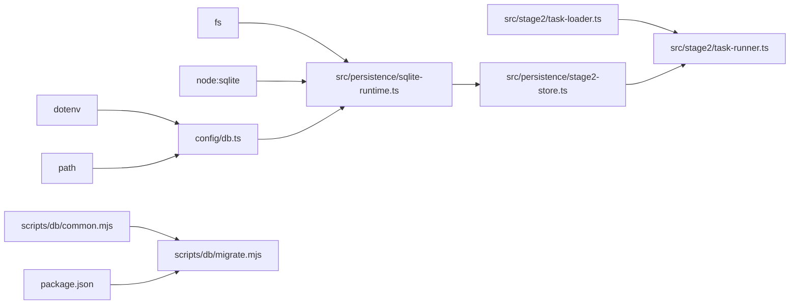

# 性能优化策略

<cite>
**本文引用的文件**
- [config/db.ts](file://config/db.ts)
- [config/runtime-path.ts](file://config/runtime-path.ts)
- [src/persistence/sqlite-runtime.ts](file://src/persistence/sqlite-runtime.ts)
- [src/persistence/stage2-store.ts](file://src/persistence/stage2-store.ts)
- [db/migrations/001_global_persistence_init.sql](file://db/migrations/001_global_persistence_init.sql)
- [scripts/db/common.mjs](file://scripts/db/common.mjs)
- [scripts/db/migrate.mjs](file://scripts/db/migrate.mjs)
- [src/stage2/task-runner.ts](file://src/stage2/task-runner.ts)
- [src/stage2/task-loader.ts](file://src/stage2/task-loader.ts)
- [package.json](file://package.json)
</cite>

## 目录
1. [简介](#简介)
2. [项目结构](#项目结构)
3. [核心组件](#核心组件)
4. [架构总览](#架构总览)
5. [详细组件分析](#详细组件分析)
6. [依赖关系分析](#依赖关系分析)
7. [性能考量](#性能考量)
8. [故障排查指南](#故障排查指南)
9. [结论](#结论)
10. [附录](#附录)

## 简介
本文件面向性能优化主题，结合仓库现有实现，系统阐述SQL语句优化、索引与查询优化、缓存与内存管理、I/O与文件系统、并发控制与锁机制、性能监控与调优工具，以及基准测试与效果评估方法。文档以代码为依据，辅以可视化图示，帮助读者快速定位优化切入点并制定可执行的改进方案。

## 项目结构
项目采用分层与功能模块化组织：配置层负责数据库与运行时路径解析；持久化层封装SQLite访问、迁移与写库逻辑；阶段执行层负责任务加载与运行流程；脚本层提供数据库迁移工具；包脚本定义了数据库初始化与迁移命令。

**图表来源**
- [config/db.ts:1-28](file://config/db.ts#L1-L28)
- [config/runtime-path.ts:1-46](file://config/runtime-path.ts#L1-L46)
- [src/persistence/sqlite-runtime.ts:73-84](file://src/persistence/sqlite-runtime.ts#L73-L84)
- [src/persistence/stage2-store.ts:101-123](file://src/persistence/stage2-store.ts#L101-L123)
- [db/migrations/001_global_persistence_init.sql:1-128](file://db/migrations/001_global_persistence_init.sql#L1-L128)
- [scripts/db/common.mjs:31-58](file://scripts/db/common.mjs#L31-L58)
- [scripts/db/migrate.mjs:12-13](file://scripts/db/migrate.mjs#L12-L13)
- [package.json:6-12](file://package.json#L6-L12)

**章节来源**
- [config/db.ts:1-28](file://config/db.ts#L1-L28)
- [config/runtime-path.ts:1-46](file://config/runtime-path.ts#L1-L46)
- [src/persistence/sqlite-runtime.ts:73-84](file://src/persistence/sqlite-runtime.ts#L73-L84)
- [src/persistence/stage2-store.ts:101-123](file://src/persistence/stage2-store.ts#L101-L123)
- [db/migrations/001_global_persistence_init.sql:1-128](file://db/migrations/001_global_persistence_init.sql#L1-L128)
- [scripts/db/common.mjs:31-58](file://scripts/db/common.mjs#L31-L58)
- [scripts/db/migrate.mjs:12-13](file://scripts/db/migrate.mjs#L12-L13)
- [package.json:6-12](file://package.json#L6-L12)

## 核心组件
- 数据库配置与路径解析：集中于环境变量读取与路径规范化，确保数据库文件与运行时目录可配置且稳定。
- SQLite运行时与迁移：提供数据库连接、外键约束启用、迁移表维护、迁移文件扫描与执行。
- 写库服务（Stage2）：封装任务、版本、运行、步骤、快照、制品等实体的插入与更新，统一时间格式化与错误兜底。
- 迁移脚本：通过命令行工具执行迁移，支持事务包裹与回滚。
- 执行与任务加载：阶段执行器负责运行目录创建、截图目录准备、超时控制与进度文件写入，任务加载器负责模板解析与校验。

**章节来源**
- [config/db.ts:10-26](file://config/db.ts#L10-L26)
- [src/persistence/sqlite-runtime.ts:73-84](file://src/persistence/sqlite-runtime.ts#L73-L84)
- [src/persistence/stage2-store.ts:101-123](file://src/persistence/stage2-store.ts#L101-L123)
- [scripts/db/migrate.mjs:15-51](file://scripts/db/migrate.mjs#L15-L51)
- [src/stage2/task-runner.ts:111-120](file://src/stage2/task-runner.ts#L111-L120)
- [src/stage2/task-loader.ts:79-89](file://src/stage2/task-loader.ts#L79-L89)

## 架构总览
整体架构围绕“配置 → 运行时 → 持久化 → 执行”的链路展开。SQLite作为本地存储，迁移脚本保障结构演进，写库服务承担高频写入，执行层负责I/O密集型任务（截图、报告、进度文件）。

**图表来源**
- [config/db.ts:20-26](file://config/db.ts#L20-L26)
- [src/persistence/sqlite-runtime.ts:73-84](file://src/persistence/sqlite-runtime.ts#L73-L84)
- [src/persistence/stage2-store.ts:101-123](file://src/persistence/stage2-store.ts#L101-L123)
- [scripts/db/migrate.mjs:12-13](file://scripts/db/migrate.mjs#L12-L13)
- [package.json:7-8](file://package.json#L7-L8)

## 详细组件分析

### 组件A：SQLite运行时与迁移
- 连接与约束：打开数据库时启用外键约束，并显式开启外键检查，保证参照完整性。
- 迁移表：维护schema_migrations表，记录迁移文件名与校验和，避免重复执行。
- 迁移执行：逐个读取SQL文件，事务包裹执行与记录，异常回滚，确保原子性。
- 时间格式化：统一日期时间格式，便于排序与展示。

**图表来源**
- [scripts/db/migrate.mjs:15-51](file://scripts/db/migrate.mjs#L15-L51)
- [scripts/db/common.mjs:31-58](file://scripts/db/common.mjs#L31-L58)
- [scripts/db/common.mjs:82-106](file://scripts/db/common.mjs#L82-L106)

**章节来源**
- [src/persistence/sqlite-runtime.ts:73-84](file://src/persistence/sqlite-runtime.ts#L73-L84)
- [src/persistence/sqlite-runtime.ts:86-114](file://src/persistence/sqlite-runtime.ts#L86-L114)
- [scripts/db/common.mjs:60-69](file://scripts/db/common.mjs#L60-L69)
- [scripts/db/common.mjs:82-106](file://scripts/db/common.mjs#L82-L106)
- [scripts/db/migrate.mjs:15-51](file://scripts/db/migrate.mjs#L15-L51)

### 组件B：Stage2写库服务（高性能写入）
- 预编译与参数绑定：所有写入均使用prepare与run，避免字符串拼接，降低注入风险并提升解析效率。
- UPSERT策略：通过SELECT命中后UPDATE，否则INSERT，减少分支判断次数。
- 事务边界：迁移与写库均采用BEGIN/COMMIT包裹，减少日志刷盘次数，显著提升吞吐。
- 错误兜底：safeExecute统一捕获异常，避免单点失败影响整体流程。
- 时间与路径：统一formatDbDate与相对路径转换，减少重复计算与字符串处理。

**图表来源**
- [src/persistence/stage2-store.ts:74-123](file://src/persistence/stage2-store.ts#L74-L123)
- [src/persistence/stage2-store.ts:135-185](file://src/persistence/stage2-store.ts#L135-L185)
- [src/persistence/stage2-store.ts:187-261](file://src/persistence/stage2-store.ts#L187-L261)
- [src/persistence/stage2-store.ts:263-303](file://src/persistence/stage2-store.ts#L263-L303)
- [src/persistence/stage2-store.ts:305-331](file://src/persistence/stage2-store.ts#L305-L331)
- [src/persistence/stage2-store.ts:333-356](file://src/persistence/stage2-store.ts#L333-L356)
- [src/persistence/stage2-store.ts:358-395](file://src/persistence/stage2-store.ts#L358-L395)
- [src/persistence/stage2-store.ts:397-468](file://src/persistence/stage2-store.ts#L397-L468)
- [src/persistence/stage2-store.ts:495-590](file://src/persistence/stage2-store.ts#L495-L590)
- [src/persistence/stage2-store.ts:592-630](file://src/persistence/stage2-store.ts#L592-L630)
- [src/persistence/stage2-store.ts:632-640](file://src/persistence/stage2-store.ts#L632-L640)

**章节来源**
- [src/persistence/stage2-store.ts:125-133](file://src/persistence/stage2-store.ts#L125-L133)
- [src/persistence/stage2-store.ts:495-590](file://src/persistence/stage2-store.ts#L495-L590)
- [src/persistence/stage2-store.ts:632-640](file://src/persistence/stage2-store.ts#L632-L640)

### 组件C：索引策略与查询优化
- 表结构与索引：迁移脚本定义了多处复合索引，覆盖常见查询条件，如任务名、运行状态与时间、步骤状态等，有助于加速筛选与排序。
- 查询计划分析：建议使用EXPLAIN QUERY PLAN或SQLite的ANALYZE配合EXPLAIN QUERY PLAN，针对高频查询（如按任务与阶段查询运行记录）进行计划分析，确认索引命中情况。
- 字段选择：尽量使用覆盖索引的SELECT投影，减少不必要的列扫描；对时间字段统一格式化，便于索引利用。

**图表来源**
- [db/migrations/001_global_persistence_init.sql:1-128](file://db/migrations/001_global_persistence_init.sql#L1-L128)

**章节来源**
- [db/migrations/001_global_persistence_init.sql:120-126](file://db/migrations/001_global_persistence_init.sql#L120-L126)

### 组件D：I/O与文件系统优化
- 进度与结果文件：执行器在运行目录下创建截图与证据目录，定期写入JSON进度文件，便于断点续跑与问题定位。
- 文件统计：写库服务在插入制品时读取文件大小，减少冗余I/O。
- 路径处理：统一相对路径转换，避免跨平台路径差异带来的额外处理成本。

**图表来源**
- [src/stage2/task-runner.ts:111-120](file://src/stage2/task-runner.ts#L111-L120)
- [src/stage2/task-runner.ts:137-171](file://src/stage2/task-runner.ts#L137-L171)
- [src/persistence/stage2-store.ts:470-493](file://src/persistence/stage2-store.ts#L470-L493)
- [src/persistence/stage2-store.ts:592-630](file://src/persistence/stage2-store.ts#L592-L630)

**章节来源**
- [src/stage2/task-runner.ts:111-120](file://src/stage2/task-runner.ts#L111-L120)
- [src/stage2/task-runner.ts:137-171](file://src/stage2/task-runner.ts#L137-L171)
- [src/persistence/stage2-store.ts:405-407](file://src/persistence/stage2-store.ts#L405-L407)

### 组件E：并发控制与锁机制
- 数据库并发：当前使用单文件SQLite，无内置连接池；通过事务包裹减少锁竞争与频繁刷盘。
- 外键约束：启用外键检查，避免并发写入导致的不一致。
- 建议：若未来扩展为多进程或多线程写入，应引入连接池与严格的事务边界，避免死锁与长时间阻塞。

**章节来源**
- [src/persistence/sqlite-runtime.ts:79-82](file://src/persistence/sqlite-runtime.ts#L79-L82)
- [src/persistence/stage2-store.ts:108-114](file://src/persistence/stage2-store.ts#L108-L114)

## 依赖关系分析
- 配置层依赖dotenv与路径模块，提供驱动与文件路径解析。
- 运行时层依赖node:sqlite与fs，负责数据库连接与迁移文件读取。
- 写库服务依赖运行时层提供的连接与工具函数。
- 迁移脚本依赖运行时层公共函数，形成可复用的迁移基础设施。
- 执行层依赖写库服务与任务加载器，形成端到端的执行闭环。

**图表来源**
- [config/db.ts:1-5](file://config/db.ts#L1-L5)
- [src/persistence/sqlite-runtime.ts:1-5](file://src/persistence/sqlite-runtime.ts#L1-L5)
- [scripts/db/common.mjs:1-5](file://scripts/db/common.mjs#L1-L5)
- [scripts/db/migrate.mjs:10](file://scripts/db/migrate.mjs#L10)
- [package.json:6-12](file://package.json#L6-L12)

**章节来源**
- [config/db.ts:1-5](file://config/db.ts#L1-L5)
- [src/persistence/sqlite-runtime.ts:1-5](file://src/persistence/sqlite-runtime.ts#L1-L5)
- [scripts/db/common.mjs:1-5](file://scripts/db/common.mjs#L1-L5)
- [scripts/db/migrate.mjs:10](file://scripts/db/migrate.mjs#L10)
- [package.json:6-12](file://package.json#L6-L12)

## 性能考量

### SQL语句优化
- 预编译与参数绑定：所有写入使用prepare与run，避免字符串拼接与重复解析。
- UPSERT策略：先查后改，减少分支判断与SQL复杂度。
- 事务边界：迁移与写库均使用BEGIN/COMMIT，降低日志刷盘频率，提升吞吐。
- 时间格式化：统一格式，减少排序与比较的开销。

**章节来源**
- [src/persistence/stage2-store.ts:135-185](file://src/persistence/stage2-store.ts#L135-L185)
- [src/persistence/stage2-store.ts:187-261](file://src/persistence/stage2-store.ts#L187-L261)
- [src/persistence/stage2-store.ts:495-590](file://src/persistence/stage2-store.ts#L495-L590)
- [src/persistence/sqlite-runtime.ts:86-114](file://src/persistence/sqlite-runtime.ts#L86-L114)

### 索引策略与查询优化
- 复合索引：针对常见查询条件建立索引，如任务名、运行状态与时间、步骤状态等。
- 查询计划：使用EXPLAIN QUERY PLAN分析索引命中情况，必要时调整索引顺序或拆分查询。
- 字段裁剪：只选择需要的列，减少IO与内存占用。

**章节来源**
- [db/migrations/001_global_persistence_init.sql:120-126](file://db/migrations/001_global_persistence_init.sql#L120-L126)

### 缓存与内存管理
- 对象复用：写库服务内部使用Map缓存步骤ID映射，减少重复查询。
- 连接管理：数据库连接在对象生命周期内复用，避免频繁打开/关闭。
- 错误兜底：safeExecute统一捕获异常，防止异常传播导致资源泄漏。

**章节来源**
- [src/persistence/stage2-store.ts:97](file://src/persistence/stage2-store.ts#L97)
- [src/persistence/stage2-store.ts:125-133](file://src/persistence/stage2-store.ts#L125-L133)

### I/O优化与文件系统
- 批量文件写入：执行器定期写入进度JSON，减少频繁小文件写入。
- 截图与报告：统一目录结构，便于后续压缩与归档。
- 文件统计：制品插入时读取文件大小，避免重复I/O。

**章节来源**
- [src/stage2/task-runner.ts:111-120](file://src/stage2/task-runner.ts#L111-L120)
- [src/stage2/task-runner.ts:137-171](file://src/stage2/task-runner.ts#L137-L171)
- [src/persistence/stage2-store.ts:405-407](file://src/persistence/stage2-store.ts#L405-L407)

### 并发控制与锁机制
- 单文件SQLite：无内置连接池，建议通过事务与串行化写入降低锁竞争。
- 外键约束：启用外键检查，避免并发写入导致的数据不一致。
- 死锁避免：严格事务边界与最小化锁持有时间，避免长事务。

**章节来源**
- [src/persistence/sqlite-runtime.ts:79-82](file://src/persistence/sqlite-runtime.ts#L79-L82)
- [src/persistence/stage2-store.ts:108-114](file://src/persistence/stage2-store.ts#L108-L114)

### 性能监控与调优工具
- 执行时间统计：执行器记录步骤开始/结束时间与耗时，便于定位瓶颈。
- 资源使用监控：建议集成系统级监控（CPU/内存/磁盘IO），结合日志分析热点。
- 迁移与写库：迁移脚本输出执行日志，便于追踪性能变化。

**章节来源**
- [src/stage2/task-runner.ts:137-171](file://src/stage2/task-runner.ts#L137-L171)
- [scripts/db/migrate.mjs:15-51](file://scripts/db/migrate.mjs#L15-L51)

### 基准测试与优化效果评估
- 基准场景：构造不同规模的任务与步骤数量，测量迁移时间、写库吞吐、I/O延迟。
- 指标体系：迁移耗时、每步写入耗时、文件写入速率、数据库锁等待时间。
- 回归对比：每次优化后重新执行基准，记录指标变化，评估收益。

[本节为通用指导，无需特定文件引用]

## 故障排查指南
- 迁移失败：检查迁移脚本日志与回滚信息，确认SQL语法与索引冲突。
- 写库异常：查看safeExecute捕获的日志，定位具体操作与参数。
- 文件写入失败：检查运行时目录权限与磁盘空间，确认路径转换正确性。
- 性能退化：使用EXPLAIN QUERY PLAN分析查询计划，评估索引命中与排序成本。

**章节来源**
- [scripts/db/migrate.mjs:41-44](file://scripts/db/migrate.mjs#L41-L44)
- [src/persistence/stage2-store.ts:125-133](file://src/persistence/stage2-store.ts#L125-L133)
- [src/stage2/task-runner.ts:111-120](file://src/stage2/task-runner.ts#L111-L120)

## 结论
本项目在SQLite本地存储基础上，通过预编译、事务包裹、UPSER策略与索引设计，实现了较为稳健的写入性能。建议在保持现有架构的前提下，进一步引入连接池、查询计划分析与系统级监控，以支撑更大规模的并发与更精细的性能调优。

## 附录
- 包脚本：db:init与db:migrate用于数据库初始化与迁移执行。
- 配置项：DB_DRIVER、DB_FILE_PATH、RUNTIME_DIR_PREFIX等环境变量控制数据库与运行时路径。

**章节来源**
- [package.json:7-8](file://package.json#L7-L8)
- [config/db.ts:20-26](file://config/db.ts#L20-L26)
- [config/runtime-path.ts:13-45](file://config/runtime-path.ts#L13-L45)