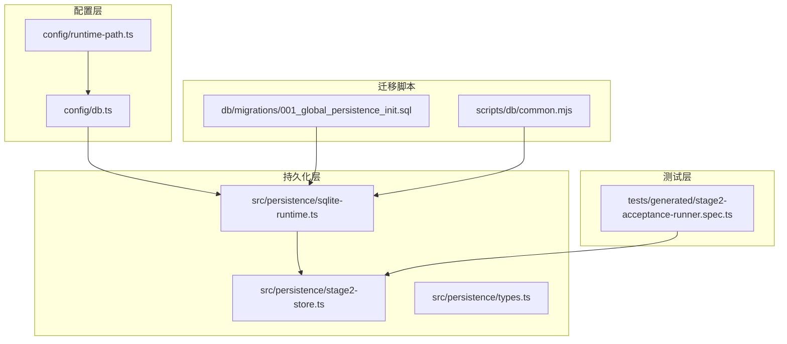
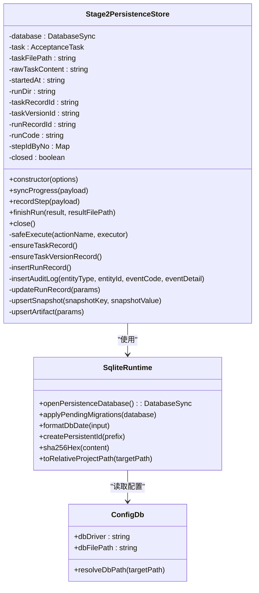
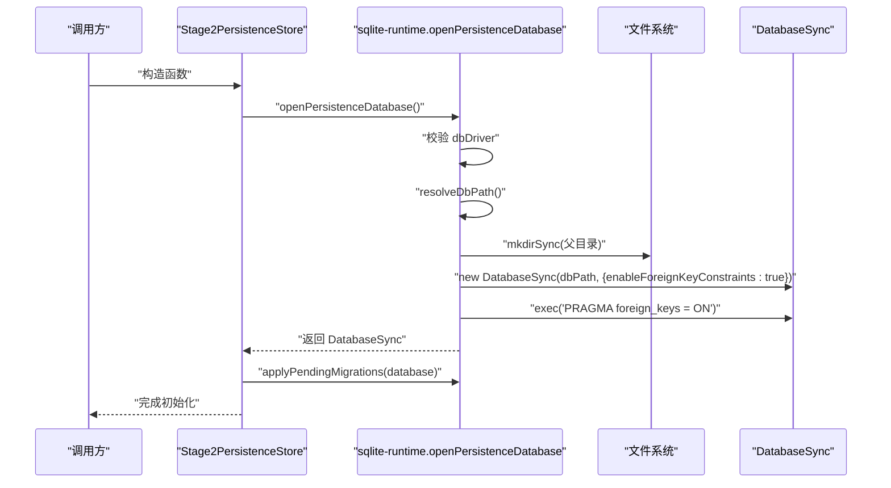
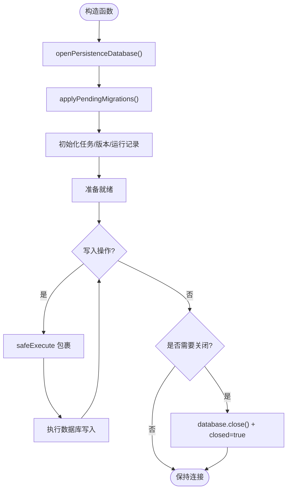
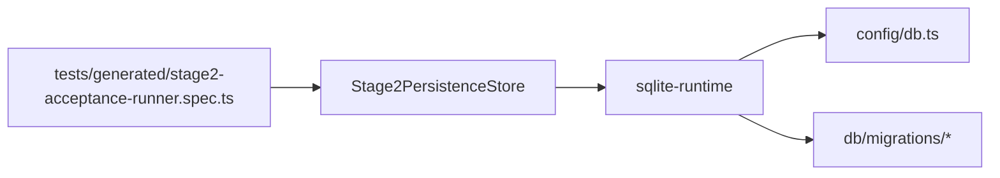

# 数据库连接管理

<cite>
**本文引用的文件**
- [stage2-store.ts](file://src/persistence/stage2-store.ts)
- [sqlite-runtime.ts](file://src/persistence/sqlite-runtime.ts)
- [db.ts](file://config/db.ts)
- [runtime-path.ts](file://config/runtime-path.ts)
- [001_global_persistence_init.sql](file://db/migrations/001_global_persistence_init.sql)
- [common.mjs](file://scripts/db/common.mjs)
- [stage2-acceptance-runner.spec.ts](file://tests/generated/stage2-acceptance-runner.spec.ts)
</cite>

## 目录
1. [简介](#简介)
2. [项目结构](#项目结构)
3. [核心组件](#核心组件)
4. [架构概览](#架构概览)
5. [详细组件分析](#详细组件分析)
6. [依赖关系分析](#依赖关系分析)
7. [性能考量](#性能考量)
8. [故障排查指南](#故障排查指南)
9. [结论](#结论)

## 简介
本文件围绕 Stage2PersistenceStore 类的数据库连接管理进行深入解析，重点涵盖：
- openPersistenceDatabase 函数的连接建立流程与参数配置
- 连接生命周期管理（初始化、状态检查、资源释放）
- 连接池策略与并发访问控制（当前实现为单连接模型）
- 故障处理与重连策略（当前未实现自动重连）
- 数据库配置选项与性能调优参数
- 实际使用示例与最佳实践

## 项目结构
该项目采用分层组织方式，数据库相关逻辑集中在 persistence 层，配置位于 config 目录，迁移脚本位于 db/migrations，测试位于 tests 目录。

**图表来源**
- [stage2-store.ts:101-123](file://src/persistence/stage2-store.ts#L101-L123)
- [sqlite-runtime.ts:73-84](file://src/persistence/sqlite-runtime.ts#L73-L84)
- [db.ts:20-26](file://config/db.ts#L20-L26)
- [runtime-path.ts:13-16](file://config/runtime-path.ts#L13-L16)

**章节来源**
- [stage2-store.ts:101-123](file://src/persistence/stage2-store.ts#L101-L123)
- [sqlite-runtime.ts:73-84](file://src/persistence/sqlite-runtime.ts#L73-L84)
- [db.ts:20-26](file://config/db.ts#L20-L26)
- [runtime-path.ts:13-16](file://config/runtime-path.ts#L13-L16)

## 核心组件
- Stage2PersistenceStore：负责任务执行期间的数据库持久化，封装了连接、迁移、审计日志、工件存储等操作。
- sqlite-runtime：提供数据库连接打开、迁移应用、时间格式化、ID生成等工具函数。
- 配置模块：db.ts 提供驱动类型与数据库文件路径解析；runtime-path.ts 提供运行时目录前缀解析。

关键职责与交互：
- 构造阶段：通过 openPersistenceDatabase 建立连接，应用迁移，初始化任务与运行记录。
- 运行阶段：提供进度快照、步骤记录、最终结果写入等方法。
- 关闭阶段：显式关闭数据库连接，防止资源泄漏。

**章节来源**
- [stage2-store.ts:74-123](file://src/persistence/stage2-store.ts#L74-L123)
- [sqlite-runtime.ts:73-114](file://src/persistence/sqlite-runtime.ts#L73-L114)
- [db.ts:20-26](file://config/db.ts#L20-L26)

## 架构概览
下图展示了 Stage2PersistenceStore 的内部结构与外部依赖关系。

**图表来源**
- [stage2-store.ts:74-123](file://src/persistence/stage2-store.ts#L74-L123)
- [sqlite-runtime.ts:73-114](file://src/persistence/sqlite-runtime.ts#L73-L114)
- [db.ts:20-26](file://config/db.ts#L20-L26)

## 详细组件分析

### openPersistenceDatabase 连接建立流程
- 驱动校验：确保 dbDriver 为 sqlite，否则抛出错误。
- 路径解析：通过 resolveDbPath 获取数据库文件绝对路径。
- 目录创建：确保数据库所在目录存在。
- 连接创建：使用 node:sqlite 的 DatabaseSync 创建同步连接，并启用外键约束。
- PRAGMA 设置：开启外键约束检查。

**图表来源**
- [stage2-store.ts:101-123](file://src/persistence/stage2-store.ts#L101-L123)
- [sqlite-runtime.ts:73-84](file://src/persistence/sqlite-runtime.ts#L73-L84)
- [db.ts:24-26](file://config/db.ts#L24-L26)

**章节来源**
- [sqlite-runtime.ts:73-84](file://src/persistence/sqlite-runtime.ts#L73-L84)
- [db.ts:20-26](file://config/db.ts#L20-L26)

### 连接生命周期管理
- 初始化：在构造函数中完成连接创建与迁移应用。
- 状态检查：通过内部 closed 标志避免重复关闭或重复写入。
- 资源释放：close 方法显式调用 database.close() 并标记 closed。
- 异常保护：所有写入操作均包裹在 safeExecute 中，捕获异常并记录错误日志。

**图表来源**
- [stage2-store.ts:101-123](file://src/persistence/stage2-store.ts#L101-L123)
- [stage2-store.ts:632-640](file://src/persistence/stage2-store.ts#L632-L640)
- [stage2-store.ts:125-133](file://src/persistence/stage2-store.ts#L125-L133)

**章节来源**
- [stage2-store.ts:101-123](file://src/persistence/stage2-store.ts#L101-L123)
- [stage2-store.ts:632-640](file://src/persistence/stage2-store.ts#L632-L640)
- [stage2-store.ts:125-133](file://src/persistence/stage2-store.ts#L125-L133)

### 连接池策略与并发访问控制
- 当前实现：使用 node:sqlite 的 DatabaseSync，每个 Store 实例持有一个连接，无连接池。
- 并发模型：由于使用同步接口且无池化，多线程并发写入需由上层协调，避免共享同一连接实例。
- 线程安全：safeExecute 提供基本异常隔离，但不保证跨线程的并发安全。

建议：
- 若需要高并发或多线程写入，应引入连接池（如 sqlite3 的连接池或第三方库），并对每个线程/协程分配独立连接。
- 对于当前单线程执行场景（Playwright 测试），可直接复用同一连接实例。

**章节来源**
- [stage2-store.ts:74-123](file://src/persistence/stage2-store.ts#L74-L123)
- [stage2-store.ts:125-133](file://src/persistence/stage2-store.ts#L125-L133)

### 故障处理与重连策略
- 错误捕获：所有写入操作通过 safeExecute 包裹，捕获异常并输出错误日志。
- 连接关闭：close 显式关闭连接，防止资源泄漏。
- 自动重连：当前未实现自动重连逻辑。若连接失效，需重新创建 Store 实例以重建连接。

建议：
- 在关键写入点增加重试机制（例如幂等写入或事务回滚后重试）。
- 结合超时与指数退避策略，避免雪崩效应。
- 对外键约束冲突、唯一键冲突等常见错误进行分类处理与降级记录。

**章节来源**
- [stage2-store.ts:125-133](file://src/persistence/stage2-store.ts#L125-L133)
- [stage2-store.ts:632-640](file://src/persistence/stage2-store.ts#L632-L640)

### 数据库配置选项与性能调优
- 驱动类型：dbDriver 必须为 sqlite，否则抛出错误。
- 数据库文件路径：dbFilePath 可通过环境变量覆盖，默认位于运行时目录下的 db/hi_test.sqlite。
- 运行时目录前缀：runtimeDirPrefix 默认 t_runtime/，可通过环境变量 RUNTIME_DIR_PREFIX 覆盖。
- 外键约束：连接创建时启用外键约束，确保参照完整性。
- 迁移应用：启动时自动应用未执行的迁移脚本，保证表结构一致性。

性能调优建议：
- 合理设置运行时目录，避免磁盘 IO 抖动。
- 控制迁移数量与大小，减少启动时长。
- 对频繁查询的字段建立索引（已通过迁移脚本创建）。
- 避免在热路径上执行大事务，必要时拆分为多个小事务。

**章节来源**
- [db.ts:20-26](file://config/db.ts#L20-L26)
- [runtime-path.ts:13-16](file://config/runtime-path.ts#L13-L16)
- [sqlite-runtime.ts:79-82](file://src/persistence/sqlite-runtime.ts#L79-L82)
- [001_global_persistence_init.sql:120-127](file://db/migrations/001_global_persistence_init.sql#L120-L127)

### 实际使用示例与最佳实践
- 初始化 Store：在任务执行前创建 Stage2PersistenceStore 实例，确保数据库文件存在且迁移完成。
- 写入进度：周期性调用 syncProgress 写入快照与进度文件工件。
- 记录步骤：每步执行后调用 recordStep，包含截图等工件。
- 完成收尾：执行 finishRun 写入最终结果与摘要。
- 资源释放：任务结束后调用 close，确保连接被释放。

最佳实践：
- 将敏感信息（如密码）在持久化前进行脱敏处理。
- 对写入操作进行幂等设计，便于重试与恢复。
- 在 CI/CD 环境中固定 RUNTIME_DIR_PREFIX，确保路径一致。
- 对迁移脚本进行版本化管理，避免破坏性变更。

**章节来源**
- [stage2-store.ts:470-493](file://src/persistence/stage2-store.ts#L470-L493)
- [stage2-store.ts:495-590](file://src/persistence/stage2-store.ts#L495-L590)
- [stage2-store.ts:592-630](file://src/persistence/stage2-store.ts#L592-L630)
- [stage2-store.ts:632-640](file://src/persistence/stage2-store.ts#L632-L640)

## 依赖关系分析
- Stage2PersistenceStore 依赖 sqlite-runtime 提供的连接与迁移能力。
- sqlite-runtime 依赖 config/db.ts 解析数据库路径与驱动类型。
- 迁移脚本位于 db/migrations，通过 sqlite-runtime 应用。
- 测试文件 tests/generated/stage2-acceptance-runner.spec.ts 触发任务执行，间接验证持久化功能。

**图表来源**
- [stage2-store.ts:101-123](file://src/persistence/stage2-store.ts#L101-L123)
- [sqlite-runtime.ts:73-114](file://src/persistence/sqlite-runtime.ts#L73-L114)
- [db.ts:20-26](file://config/db.ts#L20-L26)
- [stage2-acceptance-runner.spec.ts:19-25](file://tests/generated/stage2-acceptance-runner.spec.ts#L19-L25)

**章节来源**
- [stage2-store.ts:101-123](file://src/persistence/stage2-store.ts#L101-L123)
- [sqlite-runtime.ts:73-114](file://src/persistence/sqlite-runtime.ts#L73-L114)
- [stage2-acceptance-runner.spec.ts:19-25](file://tests/generated/stage2-acceptance-runner.spec.ts#L19-L25)

## 性能考量
- 单连接模型：适合单线程执行场景，避免锁竞争，但无法利用并发优势。
- 索引优化：迁移脚本已为常用查询字段建立索引，有助于提升查询性能。
- 文件系统：数据库文件位于运行时目录，建议使用高性能存储介质。
- 事务边界：将多个写入操作合并到一个事务中，减少磁盘写入次数。

[本节为通用性能指导，无需具体文件分析]

## 故障排查指南
- 连接失败：检查 DB_DRIVER 是否为 sqlite，确认 DB_FILE_PATH 指向有效路径。
- 权限问题：确保运行用户对数据库文件所在目录具有读写权限。
- 外键约束错误：检查关联实体是否存在，遵循迁移脚本定义的约束。
- 进程退出导致连接未关闭：确保在 finally 块中调用 close，或使用 try-finally 模式。

**章节来源**
- [sqlite-runtime.ts:73-84](file://src/persistence/sqlite-runtime.ts#L73-L84)
- [stage2-store.ts:632-640](file://src/persistence/stage2-store.ts#L632-L640)

## 结论
本项目采用轻量级的 SQLite 同步连接模型，通过集中化的 sqlite-runtime 管理连接与迁移，Stage2PersistenceStore 负责业务层面的数据持久化。当前实现简单可靠，适合单线程执行场景；若未来需要高并发或多线程写入，建议引入连接池与更完善的重试/降级机制。