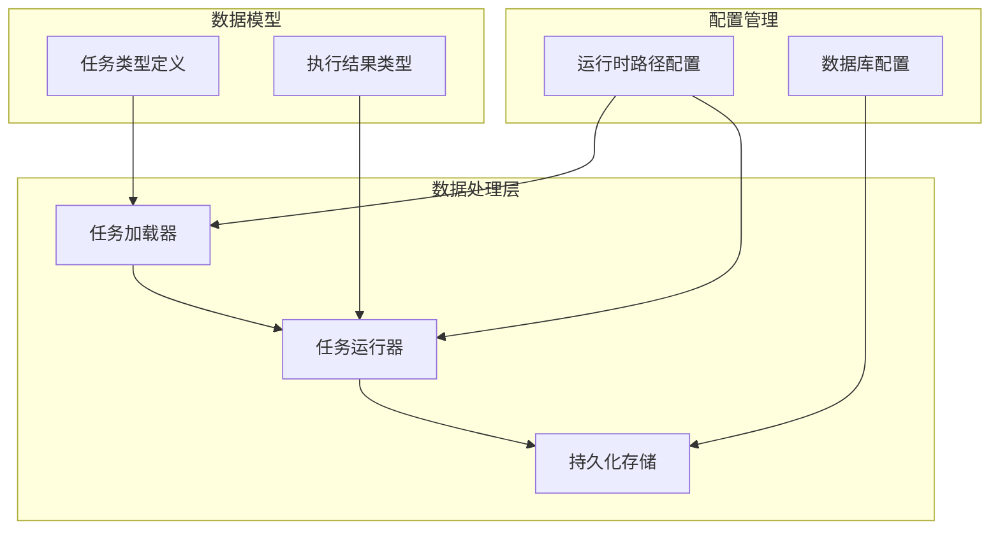
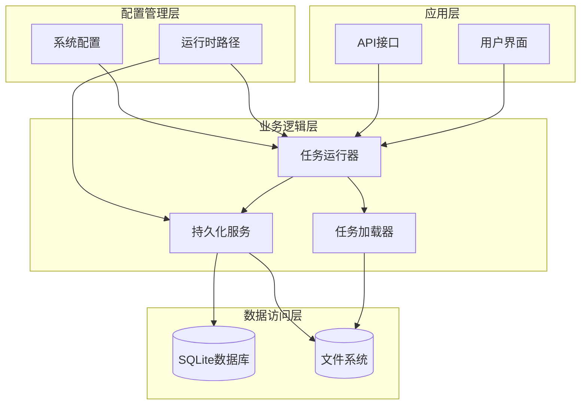
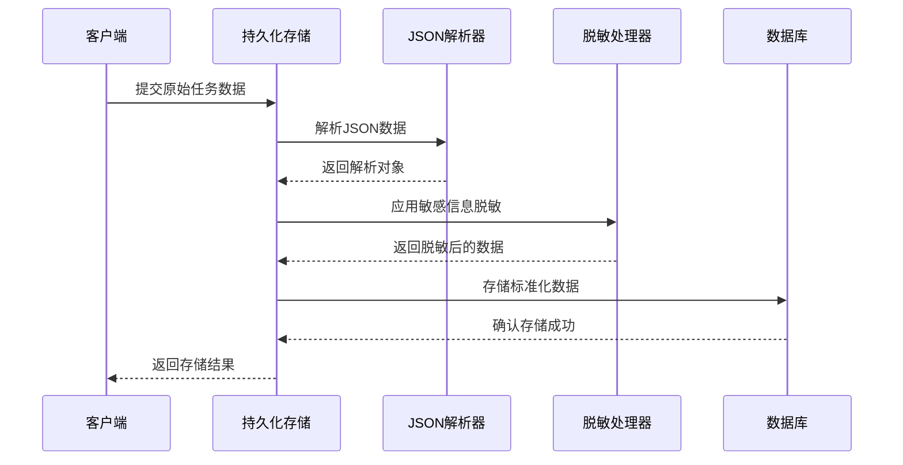
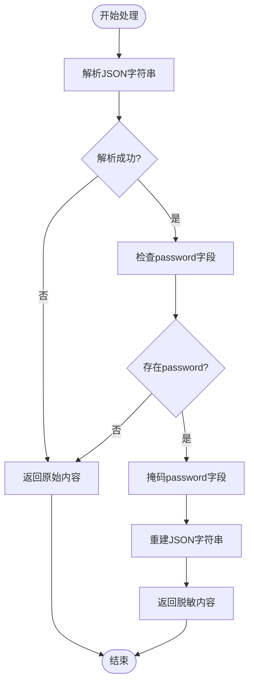
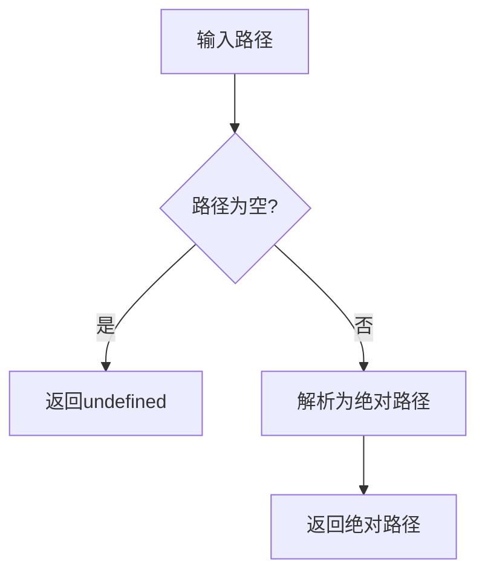
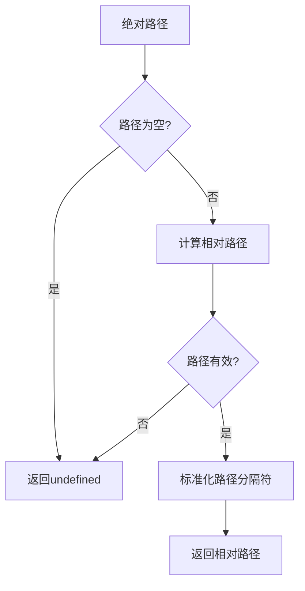
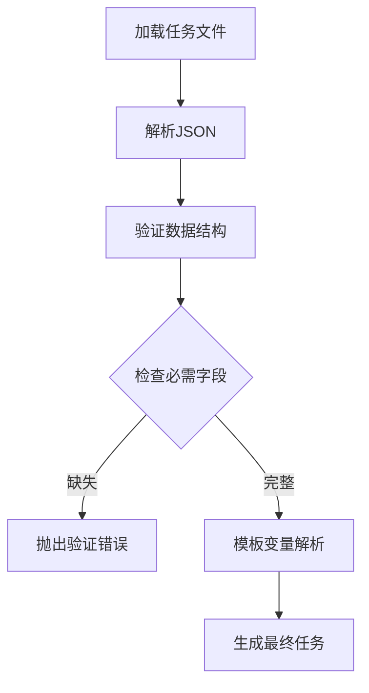
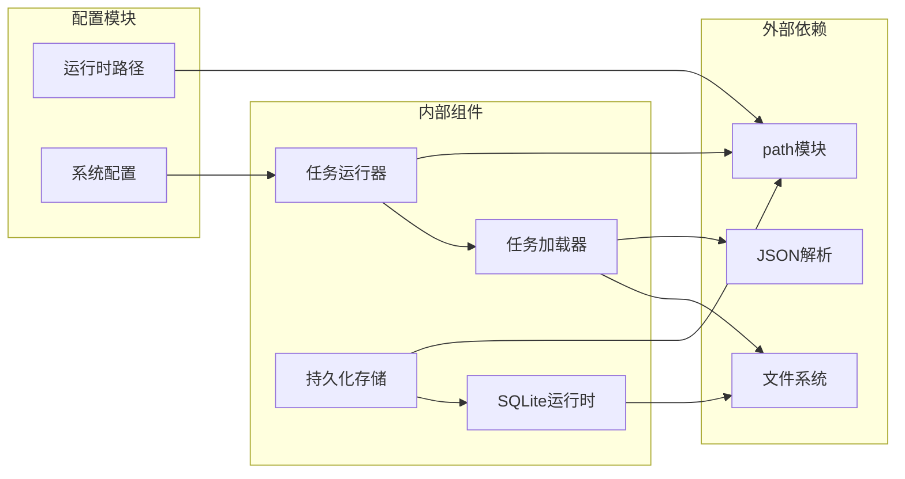

# 数据标准化处理

<cite>
**本文档引用的文件**
- [stage2-store.ts](file://src/persistence/stage2-store.ts)
- [sqlite-runtime.ts](file://src/persistence/sqlite-runtime.ts)
- [task-runner.ts](file://src/stage2/task-runner.ts)
- [task-loader.ts](file://src/stage2/task-loader.ts)
- [types.ts](file://src/stage2/types.ts)
- [runtime-path.ts](file://config/runtime-path.ts)
- [acceptance-task.template.json](file://specs/tasks/acceptance-task.template.json)
- [acceptance-task.community-create.example.json](file://specs/tasks/acceptance-task.community-create.example.json)
</cite>

## 目录
1. [简介](#简介)
2. [项目结构](#项目结构)
3. [核心组件](#核心组件)
4. [架构概览](#架构概览)
5. [详细组件分析](#详细组件分析)
6. [依赖关系分析](#依赖关系分析)
7. [性能考虑](#性能考虑)
8. [故障排除指南](#故障排除指南)
9. [结论](#结论)

## 简介

本项目是一个基于 Playwright 的自动化验收测试框架，专注于数据标准化处理和持久化存储。本文档详细阐述了数据序列化和反序列化机制、敏感信息脱敏处理、路径转换机制、文件统计信息获取、文本内容标准化处理以及数据验证和清洗的最佳实践。

该系统采用 SQLite 作为持久化存储，通过严格的 JSON 序列化策略确保数据的一致性和安全性，同时提供了完善的路径管理和文件统计功能。

## 项目结构

项目采用模块化的架构设计，主要分为以下几个核心模块：

**图表来源**
- [stage2-store.ts:1-655](file://src/persistence/stage2-store.ts#L1-L655)
- [task-runner.ts:1-800](file://src/stage2/task-runner.ts#L1-L800)
- [task-loader.ts:1-91](file://src/stage2/task-loader.ts#L1-L91)

**章节来源**
- [stage2-store.ts:1-655](file://src/persistence/stage2-store.ts#L1-L655)
- [task-runner.ts:1-800](file://src/stage2/task-runner.ts#L1-L800)
- [task-loader.ts:1-91](file://src/stage2/task-loader.ts#L1-L91)

## 核心组件

### 数据序列化和反序列化机制

系统实现了完整的 JSON 数据处理管道，确保数据在传输和存储过程中的完整性和一致性。

**章节来源**
- [task-loader.ts:79-89](file://src/stage2/task-loader.ts#L79-L89)
- [stage2-store.ts:37-48](file://src/persistence/stage2-store.ts#L37-L48)

### 敏感信息脱敏处理

系统采用智能脱敏策略，专门针对密码等敏感字段进行保护。

**章节来源**
- [stage2-store.ts:37-48](file://src/persistence/stage2-store.ts#L37-L48)

### 路径转换机制

提供绝对路径和相对路径之间的双向转换功能，确保路径处理的一致性。

**章节来源**
- [sqlite-runtime.ts:32-41](file://src/persistence/sqlite-runtime.ts#L32-L41)
- [stage2-store.ts:54-59](file://src/persistence/stage2-store.ts#L54-L59)

### 文件统计信息获取

实现文件大小统计和存在性检查功能，为数据持久化提供基础支持。

**章节来源**
- [stage2-store.ts:61-67](file://src/persistence/stage2-store.ts#L61-L67)

## 架构概览

系统采用分层架构设计，各层职责清晰分离：

**图表来源**
- [stage2-store.ts:74-123](file://src/persistence/stage2-store.ts#L74-L123)
- [task-runner.ts:1-800](file://src/stage2/task-runner.ts#L1-L800)
- [task-loader.ts:1-91](file://src/stage2/task-loader.ts#L1-L91)

## 详细组件分析

### Stage2 持久化存储服务

Stage2PersistenceStore 是系统的核心持久化组件，负责将测试执行过程中的各种数据进行标准化存储。

#### 主要功能特性

1. **任务数据持久化**：存储任务定义、版本控制和执行历史
2. **进度跟踪**：实时记录执行进度和中间结果
3. **快照管理**：保存关键执行时刻的状态快照
4. **审计日志**：完整的操作记录和变更追踪

#### 数据标准化策略

**图表来源**
- [stage2-store.ts:101-123](file://src/persistence/stage2-store.ts#L101-L123)
- [stage2-store.ts:37-48](file://src/persistence/stage2-store.ts#L37-L48)

**章节来源**
- [stage2-store.ts:74-641](file://src/persistence/stage2-store.ts#L74-L641)

### 敏感信息脱敏处理机制

maskSensitiveTaskContent 函数实现了智能的敏感信息脱敏功能：

#### 脱敏策略

1. **JSON 解析**：安全地解析输入的 JSON 字符串
2. **字段识别**：自动识别 account.password 字段
3. **值替换**：将敏感值替换为标准化的掩码字符
4. **格式保持**：保持原有的 JSON 结构和缩进格式

#### 处理流程

**图表来源**
- [stage2-store.ts:37-48](file://src/persistence/stage2-store.ts#L37-L48)

**章节来源**
- [stage2-store.ts:37-48](file://src/persistence/stage2-store.ts#L37-L48)

### 路径转换机制

系统提供了完整的路径处理功能，确保在不同环境下的路径一致性。

#### 绝对路径标准化

normalizeAbsolutePath 函数负责将输入路径转换为绝对路径：

**图表来源**
- [stage2-store.ts:54-59](file://src/persistence/stage2-store.ts#L54-L59)

#### 相对路径转换

toRelativeProjectPath 函数实现路径的相对化转换：

**图表来源**
- [sqlite-runtime.ts:32-41](file://src/persistence/sqlite-runtime.ts#L32-L41)

**章节来源**
- [stage2-store.ts:54-59](file://src/persistence/stage2-store.ts#L54-L59)
- [sqlite-runtime.ts:32-41](file://src/persistence/sqlite-runtime.ts#L32-L41)

### 文件统计信息获取

getFileStat 函数提供了文件信息的获取和验证功能：

#### 功能特性

1. **存在性检查**：验证文件是否存在于文件系统中
2. **大小统计**：获取文件的字节大小
3. **安全处理**：处理文件不存在等异常情况

**章节来源**
- [stage2-store.ts:61-67](file://src/persistence/stage2-store.ts#L61-L67)

### 文本内容标准化处理

normalizeTextContent 函数实现了统一的文本序列化策略：

#### 处理策略

1. **类型安全**：确保输入参数的安全处理
2. **格式化输出**：使用标准的 JSON 缩进格式
3. **默认值处理**：为空值提供合理的默认行为

**章节来源**
- [stage2-store.ts:50-52](file://src/persistence/stage2-store.ts#L50-L52)

### 数据验证和清洗最佳实践

系统在多个层面实现了数据验证和清洗机制：

#### 任务数据验证

**图表来源**
- [task-loader.ts:50-69](file://src/stage2/task-loader.ts#L50-L69)

#### 字段值清洗

系统提供了多种字段值处理方法：

1. **空值处理**：统一处理空值和无效输入
2. **类型转换**：安全地进行类型转换
3. **格式标准化**：确保数据格式的一致性

**章节来源**
- [task-loader.ts:50-69](file://src/stage2/task-loader.ts#L50-L69)
- [task-runner.ts:158-163](file://src/stage2/task-runner.ts#L158-L163)

## 依赖关系分析

系统采用松耦合的设计模式，各组件之间的依赖关系清晰明确：

**图表来源**
- [stage2-store.ts:1-13](file://src/persistence/stage2-store.ts#L1-L13)
- [task-runner.ts:1-7](file://src/stage2/task-runner.ts#L1-L7)
- [task-loader.ts:1-3](file://src/stage2/task-loader.ts#L1-L3)

**章节来源**
- [stage2-store.ts:1-13](file://src/persistence/stage2-store.ts#L1-L13)
- [task-runner.ts:1-7](file://src/stage2/task-runner.ts#L1-L7)
- [task-loader.ts:1-3](file://src/stage2/task-loader.ts#L1-L3)

## 性能考虑

### JSON 处理优化

1. **批量处理**：对大量数据进行批处理以提高效率
2. **缓存策略**：对频繁访问的数据建立缓存机制
3. **内存管理**：合理控制内存使用，避免内存泄漏

### 路径处理优化

1. **路径缓存**：缓存常用的路径转换结果
2. **异步处理**：对耗时的路径操作采用异步方式
3. **预编译正则**：对复杂的路径匹配使用预编译的正则表达式

### 数据持久化优化

1. **事务管理**：使用数据库事务确保数据一致性
2. **批量插入**：对大量数据采用批量插入方式
3. **索引优化**：为常用查询字段建立适当的索引

## 故障排除指南

### 常见问题及解决方案

#### JSON 解析错误

**问题症状**：任务文件加载失败，抛出 JSON 解析异常

**解决方法**：
1. 检查任务文件的 JSON 格式是否正确
2. 验证必需字段是否完整
3. 确认模板变量是否正确解析

#### 路径处理异常

**问题症状**：路径转换失败，返回 undefined

**解决方法**：
1. 检查输入路径的有效性
2. 确认工作目录的正确性
3. 验证路径权限设置

#### 敏感信息脱敏失败

**问题症状**：密码字段未被正确脱敏

**解决方法**：
1. 确认 JSON 结构中存在 password 字段
2. 检查字段命名是否符合预期
3. 验证脱敏逻辑的正确性

**章节来源**
- [stage2-store.ts:37-48](file://src/persistence/stage2-store.ts#L37-L48)
- [task-loader.ts:79-89](file://src/stage2/task-loader.ts#L79-L89)

## 结论

本项目通过精心设计的数据标准化处理机制，实现了以下关键目标：

1. **数据完整性**：通过严格的 JSON 序列化和反序列化机制，确保数据在传输和存储过程中的完整性
2. **安全性保障**：智能的敏感信息脱敏处理，有效保护了密码等敏感数据
3. **路径一致性**：提供可靠的绝对路径和相对路径转换功能
4. **性能优化**：采用多种优化策略，确保系统的高效运行
5. **可维护性**：清晰的架构设计和模块化组织，便于后续维护和扩展

这些特性共同构成了一个健壮、安全、高效的自动化测试数据处理系统，为后续的功能扩展和性能优化奠定了坚实的基础。