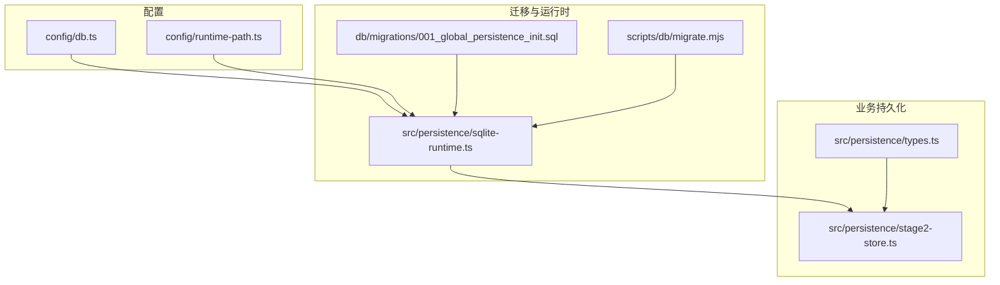
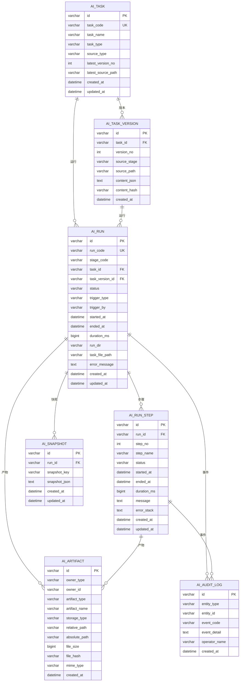
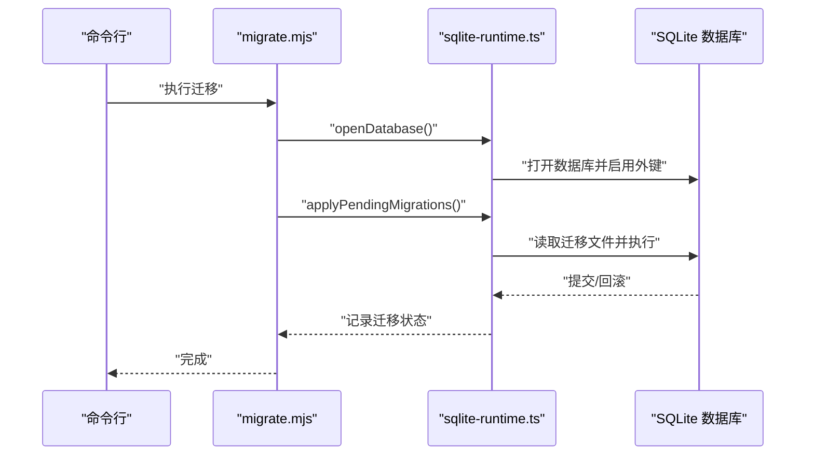
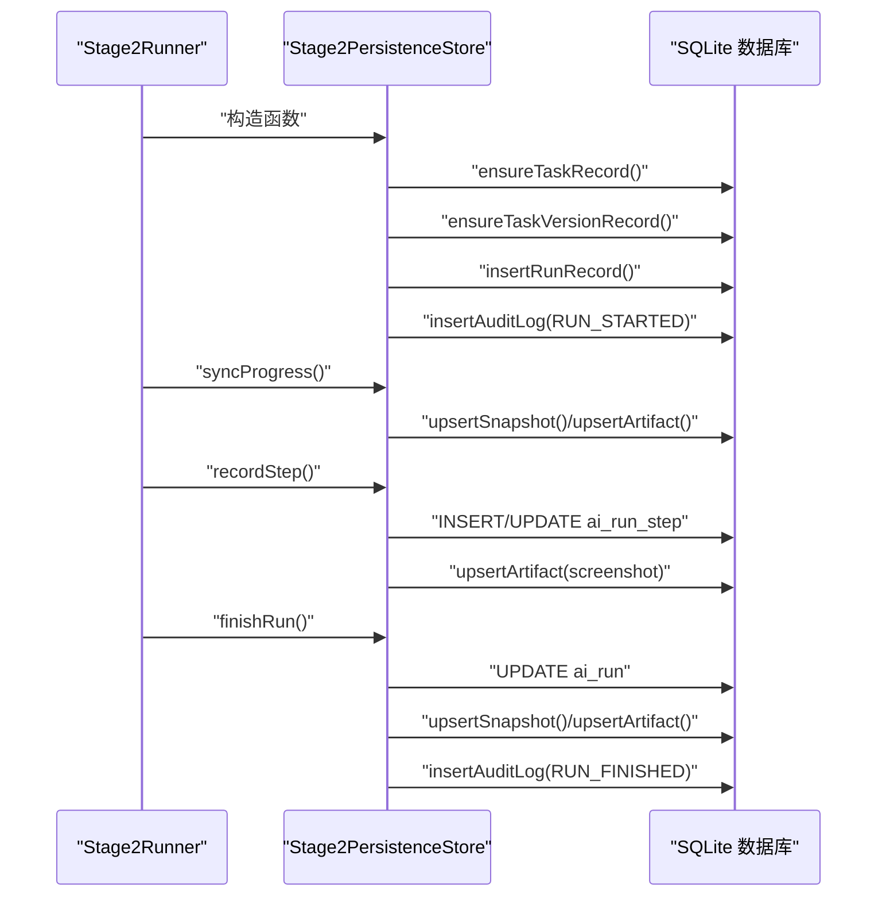
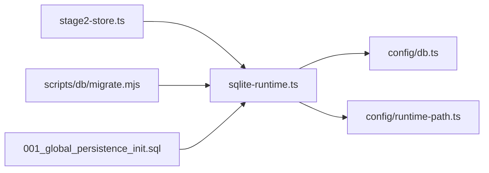

# 数据库架构设计

<cite>
**本文引用的文件**
- [001_global_persistence_init.sql](file://db/migrations/001_global_persistence_init.sql)
- [types.ts](file://src/persistence/types.ts)
- [sqlite-runtime.ts](file://src/persistence/sqlite-runtime.ts)
- [stage2-store.ts](file://src/persistence/stage2-store.ts)
- [db.ts](file://config/db.ts)
- [runtime-path.ts](file://config/runtime-path.ts)
- [migrate.mjs](file://scripts/db/migrate.mjs)
</cite>

## 目录
1. [简介](#简介)
2. [项目结构](#项目结构)
3. [核心组件](#核心组件)
4. [架构总览](#架构总览)
5. [详细组件分析](#详细组件分析)
6. [依赖关系分析](#依赖关系分析)
7. [性能考虑](#性能考虑)
8. [故障排除指南](#故障排除指南)
9. [结论](#结论)

## 简介
本文件面向数据库架构设计，围绕 SQLite 数据库存储层进行系统性梳理，重点覆盖以下核心表：
- ai_task：任务元数据与版本管理
- ai_task_version：任务内容版本与哈希校验
- ai_run：运行实例与状态追踪
- ai_run_step：运行步骤与执行明细
- ai_snapshot：运行过程快照与中间态
- ai_artifact：产物与文件关联
- ai_audit_log：审计事件记录

文档从表结构、字段定义、约束与索引策略入手，解释外键关系与参照完整性，给出 ER 关系图与表结构关系图，并结合代码实现说明主键生成策略、UUID 使用现状、数据类型映射与命名规范，最后提供性能优化建议与故障排除要点。

## 项目结构
数据库相关代码主要分布在以下模块：
- 迁移脚本与初始化：db/migrations/001_global_persistence_init.sql
- 类型定义：src/persistence/types.ts
- SQLite 运行时与迁移：src/persistence/sqlite-runtime.ts
- Stage2 写库服务：src/persistence/stage2-store.ts
- 配置与路径：config/db.ts、config/runtime-path.ts
- 命令行迁移工具：scripts/db/migrate.mjs

图表来源
- [db.ts:1-28](file://config/db.ts#L1-L28)
- [runtime-path.ts:1-41](file://config/runtime-path.ts#L1-L41)
- [001_global_persistence_init.sql:1-128](file://db/migrations/001_global_persistence_init.sql#L1-L128)
- [sqlite-runtime.ts:1-116](file://src/persistence/sqlite-runtime.ts#L1-L116)
- [migrate.mjs:1-52](file://scripts/db/migrate.mjs#L1-L52)
- [types.ts:1-125](file://src/persistence/types.ts#L1-L125)
- [stage2-store.ts:1-655](file://src/persistence/stage2-store.ts#L1-L655)

章节来源
- [db.ts:1-28](file://config/db.ts#L1-L28)
- [runtime-path.ts:1-41](file://config/runtime-path.ts#L1-L41)
- [001_global_persistence_init.sql:1-128](file://db/migrations/001_global_persistence_init.sql#L1-L128)
- [sqlite-runtime.ts:1-116](file://src/persistence/sqlite-runtime.ts#L1-L116)
- [migrate.mjs:1-52](file://scripts/db/migrate.mjs#L1-L52)
- [types.ts:1-125](file://src/persistence/types.ts#L1-L125)
- [stage2-store.ts:1-655](file://src/persistence/stage2-store.ts#L1-L655)

## 核心组件
- ai_task：任务元数据表，包含任务标识、名称、类型、来源类型、最新版本号与时间戳等。
- ai_task_version：任务内容版本表，记录版本号、来源阶段、源路径、内容 JSON 与内容哈希，保证内容可追溯与去重。
- ai_run：运行实例表，记录运行编码、阶段、任务与版本引用、状态、触发方式与时间线等。
- ai_run_step：运行步骤表，记录步骤编号、名称、状态与时间线，以及错误信息。
- ai_snapshot：运行快照表，以键值形式保存运行过程中的 JSON 快照。
- ai_artifact：产物表，记录拥有者类型/ID、产物类型、文件路径、大小、哈希与 MIME 类型等。
- ai_audit_log：审计日志表，记录实体类型/ID、事件码、详情与操作人。

章节来源
- [001_global_persistence_init.sql:1-128](file://db/migrations/001_global_persistence_init.sql#L1-L128)
- [types.ts:34-123](file://src/persistence/types.ts#L34-L123)
- [stage2-store.ts:135-641](file://src/persistence/stage2-store.ts#L135-L641)

## 架构总览
下图展示数据库表之间的关系与外键约束，体现“任务-版本-运行-步骤”的层级关系，以及“运行-快照”、“运行/步骤-产物”、“审计日志”的关联。

图表来源
- [001_global_persistence_init.sql:1-128](file://db/migrations/001_global_persistence_init.sql#L1-L128)

## 详细组件分析

### 表：ai_task（任务元数据）
- 字段与类型
  - id：VARCHAR(64)，主键
  - task_code：VARCHAR(128)，唯一索引
  - task_name：VARCHAR(255)
  - task_type：VARCHAR(64)
  - source_type：VARCHAR(64)
  - latest_version_no：INT，默认 0
  - latest_source_path：VARCHAR(512)
  - created_at / updated_at：DATETIME
- 约束与索引
  - 主键：id
  - 唯一：task_code
  - 索引：idx_ai_task_name(task_name)
- 设计理念
  - 以 task_code 作为外部可见标识，便于跨系统引用与去重。
  - 记录最新版本号与路径，便于快速定位当前生效版本。
- 外键关系
  - 无外键，被 ai_run、ai_task_version 引用。

章节来源
- [001_global_persistence_init.sql:1-13](file://db/migrations/001_global_persistence_init.sql#L1-L13)
- [types.ts:34-44](file://src/persistence/types.ts#L34-L44)

### 表：ai_task_version（任务版本）
- 字段与类型
  - id：VARCHAR(64)，主键
  - task_id：VARCHAR(64)，外键指向 ai_task(id)，级联删除
  - version_no：INT
  - source_stage：VARCHAR(32)
  - source_path：VARCHAR(512)
  - content_json：TEXT
  - content_hash：VARCHAR(64)
  - created_at：DATETIME
- 约束与索引
  - 主键：id
  - 唯一：(task_id, version_no)、(task_id, content_hash)
  - 外键：fk_ai_task_version_task_id -> ai_task(id) ON DELETE CASCADE
- 设计理念
  - 通过 content_hash 去重相同内容的不同版本，节省存储并加速比对。
  - 版本号自增，便于顺序检索与回溯。
- 外键关系
  - 引用 ai_task(id)，删除时级联删除所有版本。

章节来源
- [001_global_persistence_init.sql:15-30](file://db/migrations/001_global_persistence_init.sql#L15-L30)
- [types.ts:46-55](file://src/persistence/types.ts#L46-L55)

### 表：ai_run（运行实例）
- 字段与类型
  - id：VARCHAR(64)，主键
  - run_code：VARCHAR(128)，唯一索引
  - stage_code：VARCHAR(32)
  - task_id / task_version_id：VARCHAR(64)，可空
  - status：VARCHAR(32)
  - trigger_type / trigger_by：VARCHAR(32)/VARCHAR(128)
  - started_at / ended_at：DATETIME
  - duration_ms：BIGINT，默认 0
  - run_dir / task_file_path：VARCHAR(512)
  - error_message：TEXT
  - created_at / updated_at：DATETIME
- 约束与索引
  - 主键：id
  - 唯一：run_code
  - 外键：fk_ai_run_task_id -> ai_task(id) ON DELETE SET NULL
  - 外键：fk_ai_run_task_version_id -> ai_task_version(id) ON DELETE SET NULL
  - 索引：idx_ai_run_task_stage_started_at(task_id, stage_code, started_at)
  - 索引：idx_ai_run_status_started_at(stage_code, status, started_at)
- 设计理念
  - 支持软删除语义（SET NULL），保留运行记录但解除与已删除对象的强绑定。
  - 通过复合索引支撑按任务/阶段/状态/时间的高效查询。
- 外键关系
  - 可能为空，删除父对象时不会阻断运行记录。

章节来源
- [001_global_persistence_init.sql:32-57](file://db/migrations/001_global_persistence_init.sql#L32-L57)
- [types.ts:57-74](file://src/persistence/types.ts#L57-L74)

### 表：ai_run_step（运行步骤）
- 字段与类型
  - id：VARCHAR(64)，主键
  - run_id：VARCHAR(64)，外键指向 ai_run(id)，级联删除
  - step_no：INT
  - step_name：VARCHAR(255)
  - status：VARCHAR(32)
  - started_at / ended_at：DATETIME
  - duration_ms：BIGINT，默认 0
  - message / error_stack：TEXT
  - created_at / updated_at：DATETIME
- 约束与索引
  - 主键：id
  - 唯一：(run_id, step_no)
  - 外键：fk_ai_run_step_run_id -> ai_run(id) ON DELETE CASCADE
  - 索引：idx_ai_run_step_run_id_status(run_id, status)
- 设计理念
  - 步骤编号在运行内唯一，便于顺序遍历与定位。
  - 级联删除确保步骤随运行生命周期一致。
- 外键关系
  - 引用 ai_run(id)，删除运行时自动删除步骤。

章节来源
- [001_global_persistence_init.sql:59-77](file://db/migrations/001_global_persistence_init.sql#L59-L77)
- [types.ts:76-89](file://src/persistence/types.ts#L76-L89)

### 表：ai_snapshot（运行快照）
- 字段与类型
  - id：VARCHAR(64)，主键
  - run_id：VARCHAR(64)，外键指向 ai_run(id)，级联删除
  - snapshot_key：VARCHAR(128)
  - snapshot_json：TEXT
  - created_at / updated_at：DATETIME
- 约束与索引
  - 主键：id
  - 唯一：(run_id, snapshot_key)
  - 外键：fk_ai_snapshot_run_id -> ai_run(id) ON DELETE CASCADE
  - 索引：无
- 设计理念
  - 键值对快照便于存储任意 JSON 结构，支持多类中间态。
  - 以 run_id+key 唯一，避免重复覆盖。

章节来源
- [001_global_persistence_init.sql:79-91](file://db/migrations/001_global_persistence_init.sql#L79-L91)
- [types.ts:91-98](file://src/persistence/types.ts#L91-L98)

### 表：ai_artifact（产物）
- 字段与类型
  - id：VARCHAR(64)，主键
  - owner_type：VARCHAR(32)
  - owner_id：VARCHAR(64)
  - artifact_type：VARCHAR(64)
  - artifact_name：VARCHAR(255)
  - storage_type：VARCHAR(32)
  - relative_path / absolute_path：VARCHAR(512)/VARCHAR(1024)
  - file_size：BIGINT
  - file_hash：VARCHAR(64)
  - mime_type：VARCHAR(128)
  - created_at：DATETIME
- 约束与索引
  - 主键：id
  - 索引：idx_ai_artifact_owner(owner_type, owner_id)
  - 索引：idx_ai_artifact_type_created_at(artifact_type, created_at)
- 设计理念
  - 统一的产物模型，支持多种拥有者（task、task_version、run、run_step）。
  - 存储相对/绝对路径，便于跨环境迁移与复现。

章节来源
- [001_global_persistence_init.sql:93-107](file://db/migrations/001_global_persistence_init.sql#L93-L107)
- [types.ts:100-113](file://src/persistence/types.ts#L100-L113)

### 表：ai_audit_log（审计日志）
- 字段与类型
  - id：VARCHAR(64)，主键
  - entity_type：VARCHAR(64)
  - entity_id：VARCHAR(64)
  - event_code：VARCHAR(64)
  - event_detail：TEXT
  - operator_name：VARCHAR(128)
  - created_at：DATETIME
- 约束与索引
  - 主键：id
  - 索引：idx_ai_audit_log_entity_created_at(entity_type, entity_id, created_at)
- 设计理念
  - 通用审计模型，支持按实体维度检索与聚合。

章节来源
- [001_global_persistence_init.sql:109-118](file://db/migrations/001_global_persistence_init.sql#L109-L118)
- [types.ts:115-123](file://src/persistence/types.ts#L115-L123)

### 主键生成策略与数据类型映射
- 主键生成
  - 使用 createPersistentId(prefix) 生成形如 "<prefix>_<timestamp_base36>_<随机十六进制>" 的字符串主键，避免冲突并具备时间序特征。
- 数据类型映射
  - VARCHAR(n)：用于标识符、名称、路径、类型等字符串字段。
  - TEXT：用于大文本内容（如 JSON、错误栈）。
  - BIGINT：用于毫秒级时长与文件大小。
  - DATETIME：统一使用格式化字符串表示时间。
- 命名规范
  - 表名与字段名采用全小写加下划线风格，遵循 SQL 标准与可读性。
  - 外键约束名采用 fk_<表>_<列> 的命名约定，便于识别。

章节来源
- [sqlite-runtime.ts:24-26](file://src/persistence/sqlite-runtime.ts#L24-L26)
- [sqlite-runtime.ts:13-22](file://src/persistence/sqlite-runtime.ts#L13-L22)
- [001_global_persistence_init.sql:1-128](file://db/migrations/001_global_persistence_init.sql#L1-L128)

### 数据库初始化与迁移流程
- 初始化
  - 通过 openPersistenceDatabase() 打开 SQLite 数据库，启用外键约束并开启 PRAGMA foreign_keys。
- 迁移
  - applyPendingMigrations() 读取 db/migrations 目录下的 SQL 文件，按文件名排序执行，记录到 schema_migrations 表中，防止重复执行。
- 命令行工具
  - scripts/db/migrate.mjs 提供命令行迁移入口，打印执行状态并处理事务回滚。

图表来源
- [migrate.mjs:1-52](file://scripts/db/migrate.mjs#L1-L52)
- [sqlite-runtime.ts:73-114](file://src/persistence/sqlite-runtime.ts#L73-L114)

章节来源
- [sqlite-runtime.ts:73-114](file://src/persistence/sqlite-runtime.ts#L73-L114)
- [migrate.mjs:1-52](file://scripts/db/migrate.mjs#L1-L52)

### 运行时写库服务（Stage2）
- 生命周期
  - 构造函数：确保任务与版本记录，创建运行记录，插入审计日志。
  - 同步进度：upsertSnapshot 与 upsertArtifact 更新快照与产物。
  - 记录步骤：recordStep 插入或更新步骤记录，必要时上传截图。
  - 完成运行：finishRun 更新运行状态与耗时，写入最终快照与结果产物。
- 外键与参照完整性
  - 运行与版本、运行与步骤、运行与快照、运行/步骤与产物均通过外键约束维护一致性。
- 审计事件
  - 在关键节点插入 ai_audit_log，记录实体类型、事件码与详情。

图表来源
- [stage2-store.ts:101-123](file://src/persistence/stage2-store.ts#L101-L123)
- [stage2-store.ts:470-493](file://src/persistence/stage2-store.ts#L470-L493)
- [stage2-store.ts:495-590](file://src/persistence/stage2-store.ts#L495-L590)
- [stage2-store.ts:592-630](file://src/persistence/stage2-store.ts#L592-L630)

章节来源
- [stage2-store.ts:101-123](file://src/persistence/stage2-store.ts#L101-L123)
- [stage2-store.ts:135-261](file://src/persistence/stage2-store.ts#L135-L261)
- [stage2-store.ts:263-356](file://src/persistence/stage2-store.ts#L263-L356)
- [stage2-store.ts:358-395](file://src/persistence/stage2-store.ts#L358-L395)
- [stage2-store.ts:397-468](file://src/persistence/stage2-store.ts#L397-L468)
- [stage2-store.ts:495-590](file://src/persistence/stage2-store.ts#L495-L590)
- [stage2-store.ts:592-630](file://src/persistence/stage2-store.ts#L592-L630)

## 依赖关系分析
- 组件耦合
  - Stage2PersistenceStore 依赖 sqlite-runtime.ts 提供的数据库连接、迁移与 ID 生成能力。
  - 迁移脚本依赖 config/db.ts 与 config/runtime-path.ts 解析数据库路径与运行时目录。
- 外部依赖
  - node:sqlite 提供同步接口与外键约束控制。
  - node:crypto 用于 SHA-256 内容哈希与随机字节生成。
- 潜在循环依赖
  - 当前结构清晰，无明显循环依赖风险。

图表来源
- [stage2-store.ts:1-14](file://src/persistence/stage2-store.ts#L1-L14)
- [sqlite-runtime.ts:1-8](file://src/persistence/sqlite-runtime.ts#L1-L8)
- [db.ts:1-28](file://config/db.ts#L1-L28)
- [runtime-path.ts:1-41](file://config/runtime-path.ts#L1-L41)
- [migrate.mjs:1-10](file://scripts/db/migrate.mjs#L1-L10)
- [001_global_persistence_init.sql:1-128](file://db/migrations/001_global_persistence_init.sql#L1-L128)

章节来源
- [stage2-store.ts:1-14](file://src/persistence/stage2-store.ts#L1-L14)
- [sqlite-runtime.ts:1-8](file://src/persistence/sqlite-runtime.ts#L1-L8)
- [db.ts:1-28](file://config/db.ts#L1-L28)
- [runtime-path.ts:1-41](file://config/runtime-path.ts#L1-L41)
- [migrate.mjs:1-10](file://scripts/db/migrate.mjs#L1-L10)
- [001_global_persistence_init.sql:1-128](file://db/migrations/001_global_persistence_init.sql#L1-L128)

## 性能考虑
- 查询优化
  - 利用复合索引：ai_run 的 idx_ai_run_task_stage_started_at 与 idx_ai_run_status_started_at，支持按任务/阶段/状态/时间的高效过滤。
  - 利用唯一索引：ai_task 的 task_code、ai_run 的 run_code、ai_run_step 的 (run_id, step_no)、ai_snapshot 的 (run_id, snapshot_key)、ai_task_version 的 (task_id, version_no)/(task_id, content_hash)。
- 索引设计
  - ai_artifact 的 idx_ai_artifact_owner 与 idx_ai_artifact_type_created_at 支撑按拥有者与类型的时间序列检索。
  - ai_audit_log 的 idx_ai_audit_log_entity_created_at 支撑按实体与时间的审计查询。
- 存储空间管理
  - ai_artifact 中的 file_size 与 file_hash 可用于去重与清理策略。
  - ai_snapshot 使用 TEXT 存储 JSON，建议对大对象进行压缩或分片（当前未实现）。
- 外键与事务
  - 开启 PRAGMA foreign_keys 并在迁移中使用事务，确保一致性与原子性。
- 建议
  - 对高频查询字段增加覆盖索引，减少回表。
  - 对大文本字段（content_json、snapshot_json、error_stack）考虑分表或压缩存储。
  - 定期清理过期运行记录与快照，避免无限增长。

[本节为通用性能建议，不直接分析具体文件]

## 故障排除指南
- 外键约束错误
  - 症状：插入/更新时提示违反外键约束。
  - 排查：确认父对象是否存在，或是否误删导致 SET NULL 策略生效。
- 迁移失败
  - 症状：执行迁移报错并回滚。
  - 排查：检查 schema_migrations 是否已记录该迁移文件，避免重复执行；查看具体 SQL 报错位置。
- 主键冲突
  - 症状：主键重复导致插入失败。
  - 排查：确认 createPersistentId 生成策略是否被绕过，或并发场景下是否重复使用同一前缀与时间戳。
- 时间格式问题
  - 症状：时间字段显示异常。
  - 排查：统一使用 formatDbDate 生成标准日期字符串，避免不同环境时区差异。
- 路径解析问题
  - 症状：相对路径为空或跨目录。
  - 排查：使用 toRelativeProjectPath 规范化路径，确保路径位于工作目录内。

章节来源
- [sqlite-runtime.ts:73-114](file://src/persistence/sqlite-runtime.ts#L73-L114)
- [sqlite-runtime.ts:13-22](file://src/persistence/sqlite-runtime.ts#L13-L22)
- [sqlite-runtime.ts:32-41](file://src/persistence/sqlite-runtime.ts#L32-L41)
- [stage2-store.ts:125-133](file://src/persistence/stage2-store.ts#L125-L133)

## 结论
本数据库架构以 SQLite 为基础，采用清晰的层级关系与外键约束，结合合理的索引策略与统一的数据类型映射，实现了任务、版本、运行、步骤、快照、产物与审计的完整闭环。主键生成策略兼顾可读性与唯一性，迁移机制保障了结构演进的可控性。建议在后续迭代中进一步完善大文本存储策略与定期清理机制，以提升长期运行的稳定性与性能。