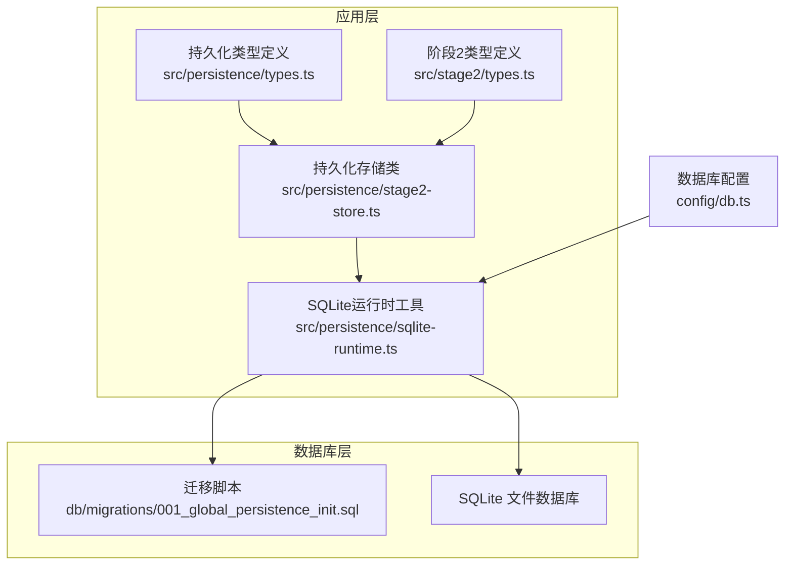
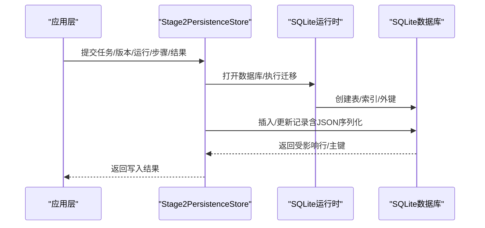
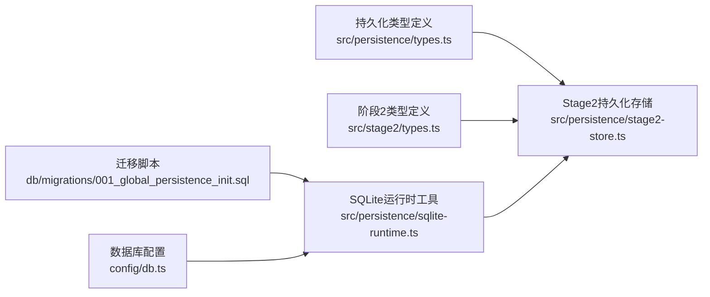

# 数据类型映射

<cite>
**本文引用的文件**
- [001_global_persistence_init.sql](file://db/migrations/001_global_persistence_init.sql)
- [types.ts](file://src/persistence/types.ts)
- [sqlite-runtime.ts](file://src/persistence/sqlite-runtime.ts)
- [stage2-store.ts](file://src/persistence/stage2-store.ts)
- [types.ts](file://src/stage2/types.ts)
- [db.ts](file://config/db.ts)
- [acceptance-task.template.json](file://specs/tasks/acceptance-task.template.json)
- [acceptance-task.community-create.example.json](file://specs/tasks/acceptance-task.community-create.example.json)
</cite>

## 目录
1. [简介](#简介)
2. [项目结构](#项目结构)
3. [核心组件](#核心组件)
4. [架构总览](#架构总览)
5. [详细组件分析](#详细组件分析)
6. [依赖分析](#依赖分析)
7. [性能考量](#性能考量)
8. [故障排查指南](#故障排查指南)
9. [结论](#结论)
10. [附录](#附录)

## 简介
本文件聚焦于数据库与应用层之间的数据类型映射策略，系统性梳理以下主题：
- 数据库字段类型与长度选择：VARCHAR 宽度、TEXT、BIGINT、DATETIME 的取舍与依据
- 字段长度设计的技术决策：如 64 字符 ID、128 字符任务代码、255 字符名称等
- 应用层 TypeScript 类型与数据库字段的映射关系
- 枚举值的数据库存储策略与 JSON 序列化处理
- 精度与一致性：DATETIME 的格式化策略与索引影响

## 项目结构
本项目采用 SQLite 作为本地持久化存储，迁移脚本定义了完整的表结构，并通过运行时工具进行迁移与数据写入。应用层通过 TypeScript 类型约束与运行时序列化/反序列化保证数据一致性。

图表来源
- [sqlite-runtime.ts:73-84](file://src/persistence/sqlite-runtime.ts#L73-L84)
- [stage2-store.ts:101-123](file://src/persistence/stage2-store.ts#L101-L123)
- [001_global_persistence_init.sql:1-128](file://db/migrations/001_global_persistence_init.sql#L1-L128)
- [db.ts:20-26](file://config/db.ts#L20-L26)

章节来源
- [sqlite-runtime.ts:73-84](file://src/persistence/sqlite-runtime.ts#L73-L84)
- [stage2-store.ts:101-123](file://src/persistence/stage2-store.ts#L101-L123)
- [001_global_persistence_init.sql:1-128](file://db/migrations/001_global_persistence_init.sql#L1-L128)
- [db.ts:20-26](file://config/db.ts#L20-L26)

## 核心组件
- 数据库迁移脚本：定义所有表结构、字段类型、长度、索引与外键约束
- 持久化类型定义：定义应用层与数据库交互的 TypeScript 接口与枚举
- SQLite 运行时工具：负责数据库打开、迁移执行、日期格式化、ID 生成、校验和计算
- 阶段2存储服务：封装写库逻辑，负责任务、版本、运行、步骤、快照、制品、审计日志的写入与更新

章节来源
- [001_global_persistence_init.sql:1-128](file://db/migrations/001_global_persistence_init.sql#L1-L128)
- [types.ts:1-125](file://src/persistence/types.ts#L1-L125)
- [sqlite-runtime.ts:13-30](file://src/persistence/sqlite-runtime.ts#L13-L30)
- [stage2-store.ts:74-123](file://src/persistence/stage2-store.ts#L74-L123)

## 架构总览
下图展示从应用层到数据库层的数据流与类型映射关系。

图表来源
- [stage2-store.ts:101-123](file://src/persistence/stage2-store.ts#L101-L123)
- [sqlite-runtime.ts:73-84](file://src/persistence/sqlite-runtime.ts#L73-L84)
- [001_global_persistence_init.sql:1-128](file://db/migrations/001_global_persistence_init.sql#L1-L128)

## 详细组件分析

### 数据库表结构与字段类型映射
- ai_task
  - id: VARCHAR(64) 主键
  - task_code: VARCHAR(128) 唯一键
  - task_name: VARCHAR(255) 名称
  - task_type: VARCHAR(64) 类型
  - source_type: VARCHAR(64) 来源
  - latest_version_no: INT 默认 0
  - latest_source_path: VARCHAR(512) 最新版本源路径
  - created_at/updated_at: DATETIME
- ai_task_version
  - id: VARCHAR(64) 主键
  - task_id: VARCHAR(64) 外键
  - version_no: INT
  - source_stage: VARCHAR(32)
  - source_path: VARCHAR(512)
  - content_json: TEXT 任务内容
  - content_hash: VARCHAR(64) SHA-256
  - created_at: DATETIME
- ai_run
  - id: VARCHAR(64) 主键
  - run_code: VARCHAR(128) 唯一键
  - stage_code: VARCHAR(32)
  - task_id/task_version_id: VARCHAR(64) 外键
  - status: VARCHAR(32)
  - trigger_type: VARCHAR(32)
  - trigger_by: VARCHAR(128)
  - started_at/ended_at: DATETIME
  - duration_ms: BIGINT 默认 0
  - run_dir/task_file_path: VARCHAR(512)
  - error_message: TEXT 错误信息
  - created_at/updated_at: DATETIME
- ai_run_step
  - id: VARCHAR(64) 主键
  - run_id: VARCHAR(64) 外键
  - step_no: INT
  - step_name: VARCHAR(255)
  - status: VARCHAR(32)
  - started_at/ended_at: DATETIME
  - duration_ms: BIGINT 默认 0
  - message/error_stack: TEXT
  - created_at/updated_at: DATETIME
- ai_snapshot
  - id: VARCHAR(64) 主键
  - run_id: VARCHAR(64) 外键
  - snapshot_key: VARCHAR(128)
  - snapshot_json: TEXT 快照JSON
  - created_at/updated_at: DATETIME
- ai_artifact
  - id: VARCHAR(64) 主键
  - owner_type: VARCHAR(32)
  - owner_id: VARCHAR(64)
  - artifact_type: VARCHAR(64)
  - artifact_name: VARCHAR(255)
  - storage_type: VARCHAR(32) 固定值
  - relative_path/absolute_path: VARCHAR(512)/VARCHAR(1024)
  - file_size: BIGINT
  - file_hash: VARCHAR(64)
  - mime_type: VARCHAR(128)
  - created_at: DATETIME
- ai_audit_log
  - id: VARCHAR(64) 主键
  - entity_type: VARCHAR(64)
  - entity_id: VARCHAR(64)
  - event_code: VARCHAR(64)
  - event_detail: TEXT
  - operator_name: VARCHAR(128)
  - created_at: DATETIME

章节来源
- [001_global_persistence_init.sql:1-128](file://db/migrations/001_global_persistence_init.sql#L1-L128)

### 应用层 TypeScript 类型与数据库字段映射
- 持久化基础类型
  - PersistentTaskRecord/PersistentTaskVersionRecord/PersistentRunRecord/PersistentRunStepRecord/PersistentSnapshotRecord/PersistentArtifactRecord/PersistentAuditLogRecord
  - 字段命名采用驼峰，数据库字段采用下划线命名，写入时进行映射
- 阶段2类型
  - AcceptanceTask/StepResult/Stage2ExecutionResult 等，用于任务定义与执行结果的结构化表示
- 枚举值的数据库存储策略
  - 通过字符串枚举（如 status、stage_code、artifact_type 等）直接存入 VARCHAR 字段
  - 未使用整型或专用枚举类型，便于跨数据库迁移与查询

章节来源
- [types.ts:34-123](file://src/persistence/types.ts#L34-L123)
- [types.ts:141-180](file://src/stage2/types.ts#L141-L180)

### JSON 数据的序列化与存储
- 敏感信息脱敏
  - 在写入前对任务内容进行解析，将密码字段替换为掩码，再序列化为字符串存入 content_json
- 任意结构化数据
  - 通过 JSON.stringify 将对象序列化为字符串，统一存入 TEXT 字段（如 snapshot_json、event_detail）
- 文件路径与大小
  - 绝对路径与相对路径分别存入绝对路径与相对路径字段，文件大小以字节存入 file_size（BIGINT）

章节来源
- [stage2-store.ts:37-48](file://src/persistence/stage2-store.ts#L37-L48)
- [stage2-store.ts:50-51](file://src/persistence/stage2-store.ts#L50-L51)
- [stage2-store.ts:397-468](file://src/persistence/stage2-store.ts#L397-L468)

### DATETIME 精度与格式化策略
- 格式化函数
  - formatDbDate 将输入转换为“YYYY-MM-DD HH:MM:SS”字符串，确保数据库端 DATETIME 字段的一致性
- 写入策略
  - 所有 created_at/updated_at/started_at/ended_at 字段均通过该函数格式化后写入
- 索引影响
  - DATETIME 字段广泛用于排序与范围查询，配合索引提升查询效率（如按 stage_code/status/started_at 排序）

章节来源
- [sqlite-runtime.ts:13-22](file://src/persistence/sqlite-runtime.ts#L13-L22)
- [stage2-store.ts:263-303](file://src/persistence/stage2-store.ts#L263-L303)
- [stage2-store.ts:495-570](file://src/persistence/stage2-store.ts#L495-L570)
- [stage2-store.ts:592-629](file://src/persistence/stage2-store.ts#L592-L629)

### 字段长度设计的技术决策
- 64 字符 ID
  - 用途：主键（如 ai_task.id、ai_task_version.id、ai_run.id 等）
  - 依据：UUID 或随机字符串长度控制在 64 字符以内，确保唯一性与索引效率
- 128 字符任务代码
  - 用途：唯一标识任务（ai_task.task_code、ai_run.run_code、ai_snapshot.snapshot_key）
  - 依据：结合业务维度（如 stage2_前缀 + 任务ID + 时间戳）形成全局唯一编码
- 255 字符名称
  - 用途：名称类字段（如 ai_task.task_name、ai_artifact.artifact_name）
  - 依据：满足常见 UI 展示与搜索需求，兼顾索引长度限制
- 32/64/128/512/1024 字符路径
  - 用途：路径与描述字段（如 source_stage、source_path、latest_source_path、relative_path、absolute_path、mime_type）
  - 依据：覆盖本地文件系统路径长度，同时避免过长导致索引膨胀
- 64 字符哈希
  - 用途：content_hash、file_hash
  - 依据：SHA-256 输出长度固定为 64 字符十六进制串

章节来源
- [001_global_persistence_init.sql:1-128](file://db/migrations/001_global_persistence_init.sql#L1-L128)
- [stage2-store.ts:187-261](file://src/persistence/stage2-store.ts#L187-L261)

### BIGINT 的使用时机
- duration_ms：持续时间（毫秒），默认 0，便于统计与排序
- file_size：文件大小（字节），用于资源管理与审计
- 使用场景：数值计算、统计分析、排序比较

章节来源
- [001_global_persistence_init.sql:43-43](file://db/migrations/001_global_persistence_init.sql#L43-L43)
- [001_global_persistence_init.sql:102-102](file://db/migrations/001_global_persistence_init.sql#L102-L102)
- [stage2-store.ts:518-520](file://src/persistence/stage2-store.ts#L518-L520)
- [stage2-store.ts:431-431](file://src/persistence/stage2-store.ts#L431-L431)

### TEXT 类型的适用场景
- content_json：存储完整任务内容（含脱敏后的敏感信息）
- error_message/error_stack/event_detail/snapshot_json/message：存储结构化或半结构化文本
- 适用原则：当字段内容可能超过 VARCHAR 限制或需要灵活的查询/全文检索时使用

章节来源
- [001_global_persistence_init.sql:21-21](file://db/migrations/001_global_persistence_init.sql#L21-L21)
- [001_global_persistence_init.sql:46-46](file://db/migrations/001_global_persistence_init.sql#L46-L46)
- [001_global_persistence_init.sql:68-68](file://db/migrations/001_global_persistence_init.sql#L68-L68)
- [001_global_persistence_init.sql:83-83](file://db/migrations/001_global_persistence_init.sql#L83-L83)
- [001_global_persistence_init.sql:114-114](file://db/migrations/001_global_persistence_init.sql#L114-L114)

### 索引与查询优化
- ai_task_name：task_name 上建立索引，支持名称检索
- ai_run：按 task_id + stage_code + started_at、stage_code + status + started_at 组合索引，优化运行记录查询
- ai_run_step：按 run_id + status 组合索引，加速步骤查询
- ai_artifact：按 owner_type + owner_id、artifact_type + created_at 组合索引，支持按归属与类型检索
- ai_audit_log：按 entity_type + entity_id + created_at 组合索引，支持审计追踪

章节来源
- [001_global_persistence_init.sql:120-126](file://db/migrations/001_global_persistence_init.sql#L120-L126)

## 依赖分析
- 组件耦合
  - Stage2PersistenceStore 依赖 SQLite 运行时工具提供的数据库连接、迁移执行、日期格式化、ID 生成与校验和计算
  - 迁移脚本定义了稳定的表结构，是应用层写库行为的契约
- 外部依赖
  - SQLite 驱动（node:sqlite）与 node:crypto（SHA-256）、fs/path（文件路径处理）
- 循环依赖
  - 无循环依赖，职责清晰：类型定义 -> 存储服务 -> 运行时工具 -> 数据库

图表来源
- [stage2-store.ts:6-13](file://src/persistence/stage2-store.ts#L6-L13)
- [sqlite-runtime.ts:4-5](file://src/persistence/sqlite-runtime.ts#L4-L5)
- [001_global_persistence_init.sql:1-128](file://db/migrations/001_global_persistence_init.sql#L1-L128)
- [db.ts:20-26](file://config/db.ts#L20-L26)

章节来源
- [stage2-store.ts:6-13](file://src/persistence/stage2-store.ts#L6-L13)
- [sqlite-runtime.ts:4-5](file://src/persistence/sqlite-runtime.ts#L4-L5)
- [001_global_persistence_init.sql:1-128](file://db/migrations/001_global_persistence_init.sql#L1-L128)
- [db.ts:20-26](file://config/db.ts#L20-L26)

## 性能考量
- 索引策略
  - 合理的组合索引能显著提升查询性能，但会增加写入成本
  - 建议仅在高频查询字段上建立索引
- DATETIME 精度
  - 统一使用秒级精度，避免高精度带来的索引与存储开销
- JSON 文本
  - TEXT 字段适合存储结构化文本，但不适合复杂查询；如需频繁检索 JSON 内容，建议拆分字段或引入 JSON 函数
- BIGINT 数值
  - 持续时间与文件大小使用 BIGINT，避免溢出风险

## 故障排查指南
- 数据库驱动不匹配
  - 当前仅支持 sqlite 驱动，若配置为其他驱动将抛出错误
- 迁移失败
  - 迁移过程包含事务回滚，检查 SQL 语法与权限
- 日期格式异常
  - 确保传入的日期参数被 formatDbDate 正确格式化
- JSON 序列化异常
  - 检查对象是否可被 JSON.stringify 序列化，必要时进行预处理
- 大字段写入失败
  - TEXT 字段过大可能导致性能问题，建议拆分或压缩

章节来源
- [sqlite-runtime.ts:74-76](file://src/persistence/sqlite-runtime.ts#L74-L76)
- [sqlite-runtime.ts:86-114](file://src/persistence/sqlite-runtime.ts#L86-L114)
- [sqlite-runtime.ts:13-22](file://src/persistence/sqlite-runtime.ts#L13-L22)
- [stage2-store.ts:37-48](file://src/persistence/stage2-store.ts#L37-L48)

## 结论
本项目通过明确的数据库表结构与字段长度设计，结合应用层的类型约束与运行时序列化策略，实现了稳定可靠的数据持久化。VARCHAR、TEXT、BIGINT、DATETIME 的选择遵循“够用即止”的原则，既满足业务需求又兼顾性能与可维护性。建议在后续扩展中继续坚持“显式契约（迁移脚本）+ 类型约束（TS）+ 运行时保障（格式化/校验）”的设计思路。

## 附录
- 示例任务模板与社区示例展示了字段长度与内容约束的实际应用，如表单字段的最大长度、断言描述等，有助于理解 VARCHAR 长度设计的业务背景。

章节来源
- [acceptance-task.template.json:1-141](file://specs/tasks/acceptance-task.template.json#L1-L141)
- [acceptance-task.community-create.example.json:1-229](file://specs/tasks/acceptance-task.community-create.example.json#L1-L229)