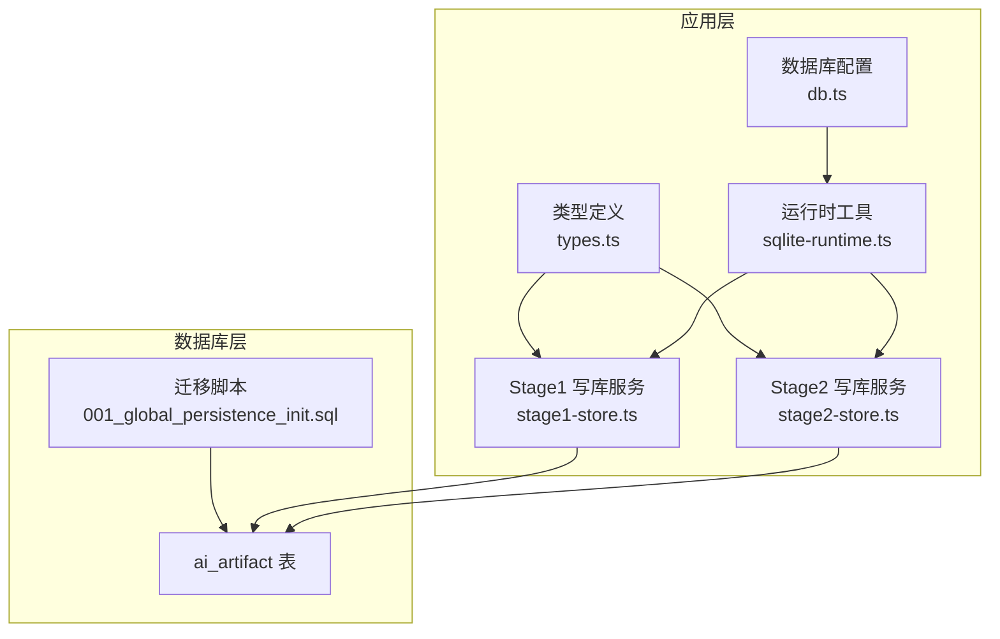
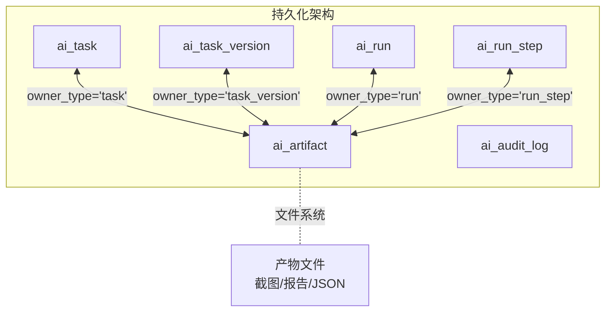
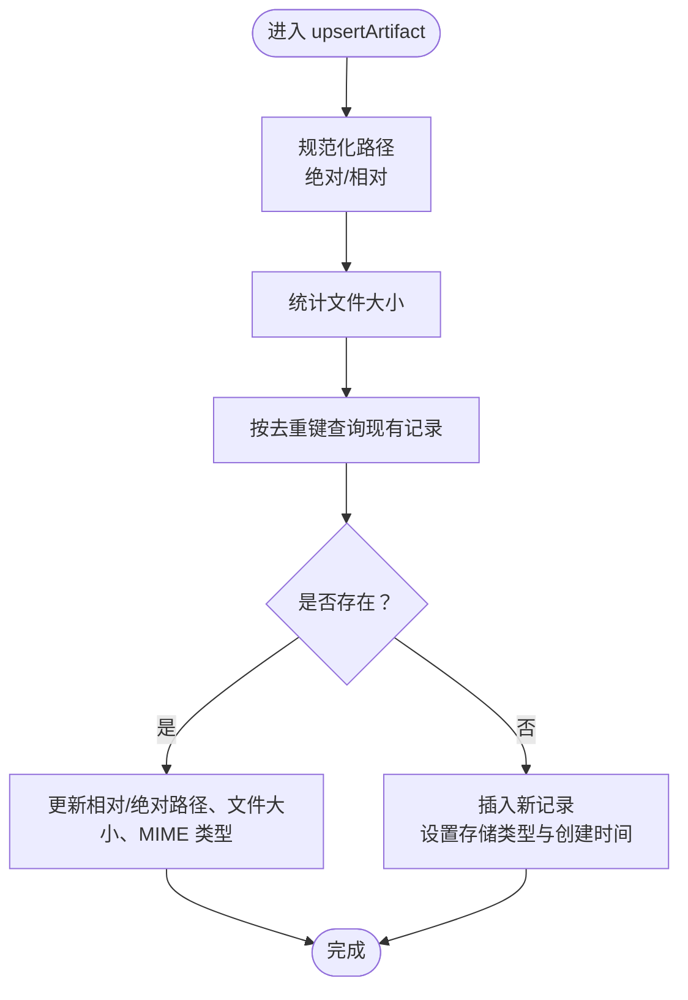
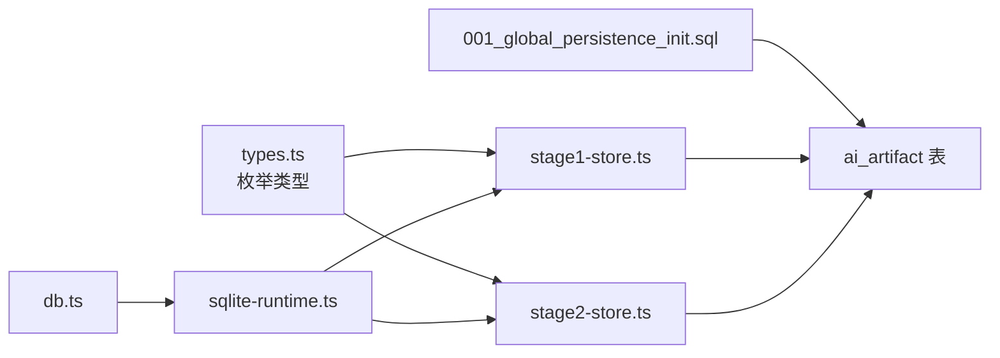

# ai_artifact 表结构设计

<cite>
**本文引用的文件**
- [001_global_persistence_init.sql](file://db/migrations/001_global_persistence_init.sql)
- [types.ts](file://src/persistence/types.ts)
- [stage2-store.ts](file://src/persistence/stage2-store.ts)
- [stage1-store.ts](file://src/persistence/stage1-store.ts)
- [sqlite-runtime.ts](file://src/persistence/sqlite-runtime.ts)
- [db.ts](file://config/db.ts)
- [README.md](file://README.md)
</cite>

## 目录
1. [简介](#简介)
2. [项目结构](#项目结构)
3. [核心组件](#核心组件)
4. [架构总览](#架构总览)
5. [详细组件分析](#详细组件分析)
6. [依赖关系分析](#依赖关系分析)
7. [性能考量](#性能考量)
8. [故障排查指南](#故障排查指南)
9. [结论](#结论)
10. [附录](#附录)

## 简介
本文件聚焦于 ai_artifact 表的结构设计与实现细节，系统性阐述测试产物管理表如何通过 owner_type 与 owner_id 实现多态关联，覆盖截图、视频、报告、日志等产物类型的存储策略；解释文件存储方式（相对路径 vs 绝对路径）、文件大小与哈希验证机制、MIME 类型管理与文件元数据存储；并说明该表在测试报告生成与证据保全中的关键作用。

## 项目结构
围绕 ai_artifact 的相关模块分布如下：
- 数据库迁移：定义 ai_artifact 表结构与索引
- 类型定义：统一的 owner_type 与 artifact_type 枚举
- 存储实现：Stage1/Stage2 写库服务对 ai_artifact 的写入与更新逻辑
- 运行时工具：路径规范化、统计文件大小、生成持久化 ID、打开 SQLite 数据库
- 配置：数据库驱动与文件路径解析
- 文档：README 对产物目录与持久化策略的说明

图表来源
- [001_global_persistence_init.sql:93-107](file://db/migrations/001_global_persistence_init.sql#L93-L107)
- [types.ts:19-32](file://src/persistence/types.ts#L19-L32)
- [stage1-store.ts:409-480](file://src/persistence/stage1-store.ts#L409-L480)
- [stage2-store.ts:397-468](file://src/persistence/stage2-store.ts#L397-L468)
- [sqlite-runtime.ts:32-41](file://src/persistence/sqlite-runtime.ts#L32-L41)
- [db.ts:20-26](file://config/db.ts#L20-L26)

章节来源
- [001_global_persistence_init.sql:93-126](file://db/migrations/001_global_persistence_init.sql#L93-L126)
- [types.ts:19-32](file://src/persistence/types.ts#L19-L32)
- [stage1-store.ts:409-480](file://src/persistence/stage1-store.ts#L409-L480)
- [stage2-store.ts:397-468](file://src/persistence/stage2-store.ts#L397-L468)
- [sqlite-runtime.ts:32-41](file://src/persistence/sqlite-runtime.ts#L32-L41)
- [db.ts:20-26](file://config/db.ts#L20-L26)
- [README.md:101-123](file://README.md#L101-L123)

## 核心组件
- ai_artifact 表：存储测试产物的元数据，包括 owner_type/owner_id 多态关联、产物类型、存储类型、路径、大小、哈希、MIME 类型与创建时间。
- 类型枚举：PersistentOwnerType 与 PersistentArtifactType 在类型层面约束 owner_type 与 artifact_type 的取值范围。
- 写库服务：Stage1/Stage2 的 upsertArtifact 方法负责根据 owner_type/owner_id/artifact_type/artifact_name 去重并写入或更新产物元数据。
- 运行时工具：路径规范化、相对路径转换、文件大小统计、持久化 ID 生成、SQLite 打开与迁移应用。
- 配置：数据库驱动与文件路径解析，确保数据库文件落盘路径正确。

章节来源
- [001_global_persistence_init.sql:93-107](file://db/migrations/001_global_persistence_init.sql#L93-L107)
- [types.ts:19-32](file://src/persistence/types.ts#L19-L32)
- [stage1-store.ts:409-480](file://src/persistence/stage1-store.ts#L409-L480)
- [stage2-store.ts:397-468](file://src/persistence/stage2-store.ts#L397-L468)
- [sqlite-runtime.ts:32-41](file://src/persistence/sqlite-runtime.ts#L32-L41)
- [db.ts:20-26](file://config/db.ts#L20-L26)

## 架构总览
ai_artifact 在整体持久化架构中的定位是“附件元数据中心”，它通过 owner_type/owner_id 与 ai_task、ai_task_version、ai_run、ai_run_step 形成多态关联，从而将不同生命周期阶段的产物进行统一管理。写库服务在运行过程中将截图、报告、进度 JSON、结果 JSON 等产物以元数据形式写入，文件本身仍保留在文件系统中，数据库仅存路径与元信息，避免大文件二进制直接入库带来的性能与存储压力。

图表来源
- [001_global_persistence_init.sql:93-107](file://db/migrations/001_global_persistence_init.sql#L93-L107)
- [stage1-store.ts:409-480](file://src/persistence/stage1-store.ts#L409-L480)
- [stage2-store.ts:397-468](file://src/persistence/stage2-store.ts#L397-L468)

章节来源
- [001_global_persistence_init.sql:93-107](file://db/migrations/001_global_persistence_init.sql#L93-L107)
- [stage1-store.ts:409-480](file://src/persistence/stage1-store.ts#L409-L480)
- [stage2-store.ts:397-468](file://src/persistence/stage2-store.ts#L397-L468)

## 详细组件分析

### 表结构与字段语义
- 主键与标识：id（持久化 ID），用于唯一标识每条产物元数据。
- 多态关联：owner_type（如 task、task_version、run、run_step），owner_id（对应实体的 id）。
- 产物类型：artifact_type（如 screenshot、playwright_report、midscene_report、result_json、progress_json、task_json、other）。
- 存储类型：storage_type（当前固定为 local_file）。
- 路径信息：relative_path（相对项目根目录的路径，便于跨环境迁移）、absolute_path（绝对路径，便于直接访问）。
- 文件度量：file_size（字节）、file_hash（预留，当前未填充）。
- 元数据：mime_type（如 image/png、application/json）。
- 时间戳：created_at（入库时间）。

章节来源
- [001_global_persistence_init.sql:93-107](file://db/migrations/001_global_persistence_init.sql#L93-L107)
- [types.ts:100-113](file://src/persistence/types.ts#L100-L113)

### 多态关联机制（owner_type 与 owner_id）
- 关联对象：ai_artifact 可被 ai_task、ai_task_version、ai_run、ai_run_step 任一实体拥有，通过 owner_type/owner_id 实现多态。
- 去重策略：upsertArtifact 以 owner_type + owner_id + artifact_type + artifact_name 为联合去重键，避免重复写入同名产物。
- 索引优化：idx_ai_artifact_owner（owner_type, owner_id）与 idx_ai_artifact_type_created_at（artifact_type, created_at）提升查询效率。

图表来源
- [stage1-store.ts:409-480](file://src/persistence/stage1-store.ts#L409-L480)
- [stage2-store.ts:397-468](file://src/persistence/stage2-store.ts#L397-L468)
- [sqlite-runtime.ts:32-41](file://src/persistence/sqlite-runtime.ts#L32-L41)
- [sqlite-runtime.ts:61-67](file://src/persistence/sqlite-runtime.ts#L61-L67)

章节来源
- [stage1-store.ts:409-480](file://src/persistence/stage1-store.ts#L409-L480)
- [stage2-store.ts:397-468](file://src/persistence/stage2-store.ts#L397-L468)
- [sqlite-runtime.ts:32-41](file://src/persistence/sqlite-runtime.ts#L32-L41)
- [sqlite-runtime.ts:61-67](file://src/persistence/sqlite-runtime.ts#L61-L67)

### 产物类型与存储策略
- 截图（screenshot）：来自步骤执行后的截图文件，通常为 image/png，归属 run_step。
- Playwright 报告（playwright_report）：HTML 报告目录，归属 run。
- Midscene 报告（midscene_report）：结构化报告与缓存，归属 run。
- 进度 JSON（progress_json）：阶段性快照，归属 run。
- 结果 JSON（result_json）：最终执行结果，归属 run。
- 任务 JSON（task_json）：任务源文件备份，归属 task_version。
- 其他（other）：通用附件类型。

章节来源
- [types.ts:25-32](file://src/persistence/types.ts#L25-L32)
- [stage1-store.ts:495-504](file://src/persistence/stage1-store.ts#L495-L504)
- [stage2-store.ts:484-493](file://src/persistence/stage2-store.ts#L484-L493)
- [stage2-store.ts:527-535](file://src/persistence/stage2-store.ts#L527-L535)
- [stage2-store.ts:571-580](file://src/persistence/stage2-store.ts#L571-L580)
- [stage2-store.ts:615-622](file://src/persistence/stage2-store.ts#L615-L622)

### 文件存储方式（相对路径 vs 绝对路径）
- 绝对路径：normalizeAbsolutePath 将传入路径标准化为绝对路径，便于跨平台一致访问。
- 相对路径：toRelativeProjectPath 将绝对路径转换为相对项目根目录的路径，利于跨环境迁移与归档。
- 存储策略：数据库仅保存路径与元信息，文件仍落盘在文件系统中，避免大文件二进制直接入库。

章节来源
- [stage1-store.ts:66-71](file://src/persistence/stage1-store.ts#L66-L71)
- [stage1-store.ts:127-133](file://src/persistence/stage1-store.ts#L127-L133)
- [stage2-store.ts:54-59](file://src/persistence/stage2-store.ts#L54-L59)
- [stage2-store.ts:405-407](file://src/persistence/stage2-store.ts#L405-L407)
- [sqlite-runtime.ts:32-41](file://src/persistence/sqlite-runtime.ts#L32-L41)
- [README.md:117-118](file://README.md#L117-L118)

### 文件大小与哈希验证机制
- 文件大小：getFileStat 通过 fs.stat 获取文件大小，写入 file_size 字段。
- 哈希预留：file_hash 字段存在但当前未填充，可用于未来实现完整性校验或去重。
- 建议：若启用哈希，可在写入前计算 SHA-256 并写入 file_hash，结合 file_size 提升数据一致性保障。

章节来源
- [stage1-store.ts:73-79](file://src/persistence/stage1-store.ts#L73-L79)
- [stage1-store.ts:419-420](file://src/persistence/stage1-store.ts#L419-L420)
- [stage2-store.ts:61-67](file://src/persistence/stage2-store.ts#L61-L67)
- [stage2-store.ts:407](file://src/persistence/stage2-store.ts#L407)

### MIME 类型管理与文件元数据
- MIME 类型：根据文件内容设置 MIME 类型（如 image/png、application/json），便于前端展示与下载。
- 元数据：除 MIME 类型外，还包含文件名、存储类型、路径、大小、创建时间等，形成完整的产物元数据视图。

章节来源
- [stage1-store.ts:495-504](file://src/persistence/stage1-store.ts#L495-L504)
- [stage2-store.ts:527-535](file://src/persistence/stage2-store.ts#L527-L535)
- [stage2-store.ts:571-580](file://src/persistence/stage2-store.ts#L571-L580)
- [stage2-store.ts:615-622](file://src/persistence/stage2-store.ts#L615-L622)

### 在测试报告生成与证据保全中的关键作用
- 报告生成：通过 playwright_report、midscene_report、result_json、progress_json 等类型，将报告与结果文件纳入统一管理，便于生成可视化报告与导出。
- 证据保全：截图（screenshot）与任务 JSON（task_json）等作为证据链的关键节点，通过 owner_type/owner_id 与运行记录绑定，确保可追溯性。
- 审计与追踪：配合 ai_audit_log 记录关键事件，结合 ai_artifact 的元数据，形成完整的执行证据链。

章节来源
- [stage1-store.ts:495-504](file://src/persistence/stage1-store.ts#L495-L504)
- [stage2-store.ts:527-535](file://src/persistence/stage2-store.ts#L527-L535)
- [stage2-store.ts:571-580](file://src/persistence/stage2-store.ts#L571-L580)
- [stage2-store.ts:615-622](file://src/persistence/stage2-store.ts#L615-L622)
- [README.md:101-123](file://README.md#L101-L123)

## 依赖关系分析
- 表结构依赖：ai_artifact 依赖于 ai_run、ai_run_step、ai_task、ai_task_version 的 id 字段（通过 owner_id 关联），但迁移脚本中未显式声明外键约束，仅通过业务层保证一致性。
- 类型约束：PersistentOwnerType 与 PersistentArtifactType 在 TypeScript 层限定取值，降低运行时错误概率。
- 运行时依赖：写库服务依赖 sqlite-runtime 提供的路径转换、文件统计、ID 生成与数据库打开/迁移能力。
- 配置依赖：db.ts 提供数据库驱动与文件路径解析，确保数据库文件落盘路径正确。

图表来源
- [types.ts:19-32](file://src/persistence/types.ts#L19-L32)
- [stage1-store.ts:409-480](file://src/persistence/stage1-store.ts#L409-L480)
- [stage2-store.ts:397-468](file://src/persistence/stage2-store.ts#L397-L468)
- [sqlite-runtime.ts:32-41](file://src/persistence/sqlite-runtime.ts#L32-L41)
- [db.ts:20-26](file://config/db.ts#L20-L26)
- [001_global_persistence_init.sql:93-107](file://db/migrations/001_global_persistence_init.sql#L93-L107)

章节来源
- [types.ts:19-32](file://src/persistence/types.ts#L19-L32)
- [stage1-store.ts:409-480](file://src/persistence/stage1-store.ts#L409-L480)
- [stage2-store.ts:397-468](file://src/persistence/stage2-store.ts#L397-L468)
- [sqlite-runtime.ts:32-41](file://src/persistence/sqlite-runtime.ts#L32-L41)
- [db.ts:20-26](file://config/db.ts#L20-L26)
- [001_global_persistence_init.sql:93-107](file://db/migrations/001_global_persistence_init.sql#L93-L107)

## 性能考量
- 查询优化：idx_ai_artifact_owner 与 idx_ai_artifact_type_created_at 索引有助于按实体与类型快速检索产物。
- 写入幂等：upsertArtifact 基于去重键的更新逻辑避免重复写入，减少写放大。
- 文件系统分离：产物文件与元数据分离，数据库仅存路径与元信息，降低数据库体积与 IO 压力。
- 建议：若未来启用 file_hash，可考虑在写入前计算哈希并建立索引，进一步提升一致性校验与去重效率。

章节来源
- [001_global_persistence_init.sql:124-125](file://db/migrations/001_global_persistence_init.sql#L124-L125)
- [stage1-store.ts:409-480](file://src/persistence/stage1-store.ts#L409-L480)
- [stage2-store.ts:397-468](file://src/persistence/stage2-store.ts#L397-L468)
- [README.md:117-118](file://README.md#L117-L118)

## 故障排查指南
- 无法找到产物文件：检查 relative_path/absolute_path 是否正确转换，确认 toRelativeProjectPath 与 normalizeAbsolutePath 的调用链。
- 重复写入问题：确认去重键（owner_type + owner_id + artifact_type + artifact_name）是否唯一，避免同名产物多次写入。
- 数据库路径异常：检查 db.ts 中的 DB_FILE_PATH 与 resolveDbPath 解析结果，确保数据库文件存在且可写。
- 迁移未执行：确认 applyPendingMigrations 是否成功执行，schema_migrations 表中应包含迁移文件名与校验和。
- MIME 类型错误：核对写入时设置的 MIME 类型是否与文件实际类型一致，避免前端展示异常。

章节来源
- [stage1-store.ts:409-480](file://src/persistence/stage1-store.ts#L409-L480)
- [stage2-store.ts:397-468](file://src/persistence/stage2-store.ts#L397-L468)
- [sqlite-runtime.ts:32-41](file://src/persistence/sqlite-runtime.ts#L32-L41)
- [sqlite-runtime.ts:86-114](file://src/persistence/sqlite-runtime.ts#L86-L114)
- [db.ts:20-26](file://config/db.ts#L20-L26)

## 结论
ai_artifact 表通过 owner_type/owner_id 的多态关联机制，将不同阶段与实体的测试产物统一纳入元数据管理体系。其设计遵循“元数据入库、文件落盘”的原则，既保证了查询与维护的便利性，又避免了大文件直接入库带来的性能与存储压力。结合 MIME 类型、文件大小与相对/绝对路径管理，ai_artifact 在测试报告生成与证据保全中发挥着关键作用，为后续扩展（如哈希校验、报告导出、审计追踪）提供了良好的基础。

## 附录
- 产物类型清单与典型用途
  - screenshot：步骤截图，归属 run_step
  - playwright_report：Playwright HTML 报告，归属 run
  - midscene_report：Midscene 结构化报告，归属 run
  - progress_json：阶段性快照，归属 run
  - result_json：最终执行结果，归属 run
  - task_json：任务源文件备份，归属 task_version
  - other：通用附件类型

章节来源
- [types.ts:25-32](file://src/persistence/types.ts#L25-L32)
- [stage1-store.ts:495-504](file://src/persistence/stage1-store.ts#L495-L504)
- [stage2-store.ts:484-493](file://src/persistence/stage2-store.ts#L484-L493)
- [stage2-store.ts:527-535](file://src/persistence/stage2-store.ts#L527-L535)
- [stage2-store.ts:571-580](file://src/persistence/stage2-store.ts#L571-L580)
- [stage2-store.ts:615-622](file://src/persistence/stage2-store.ts#L615-L622)