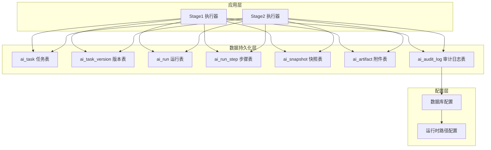
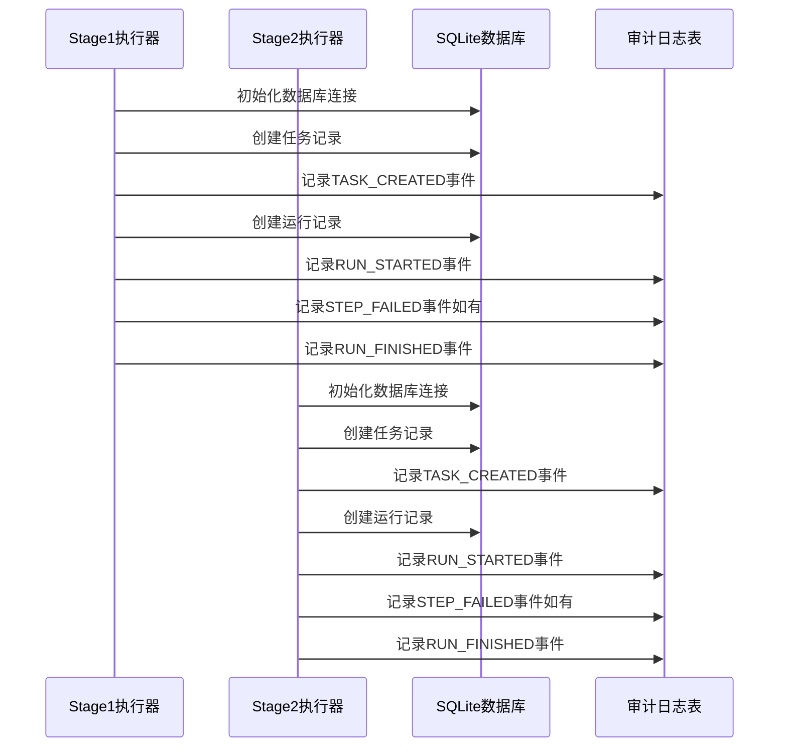
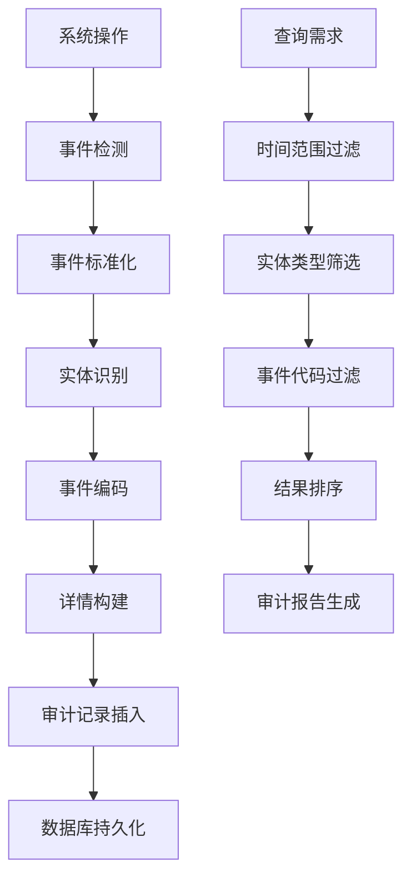
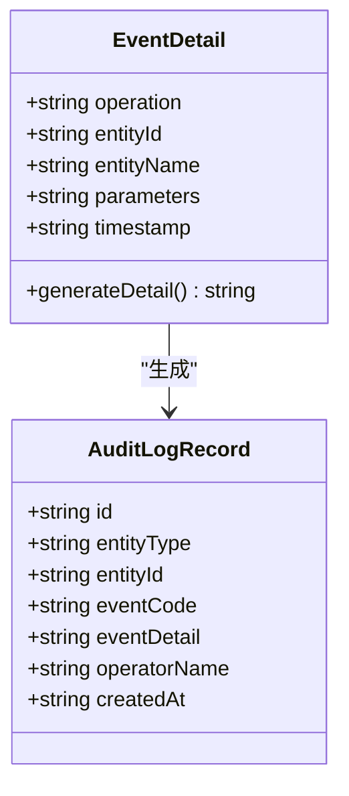
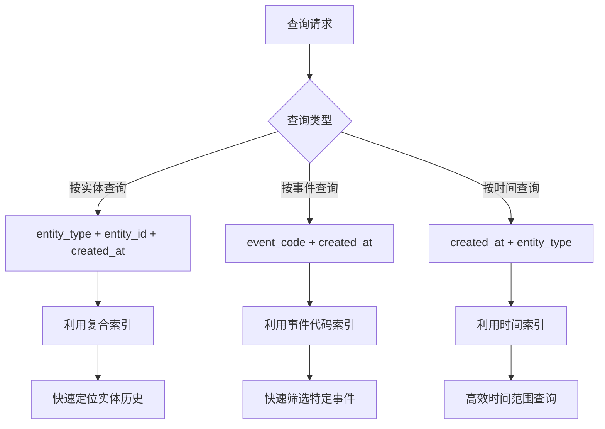
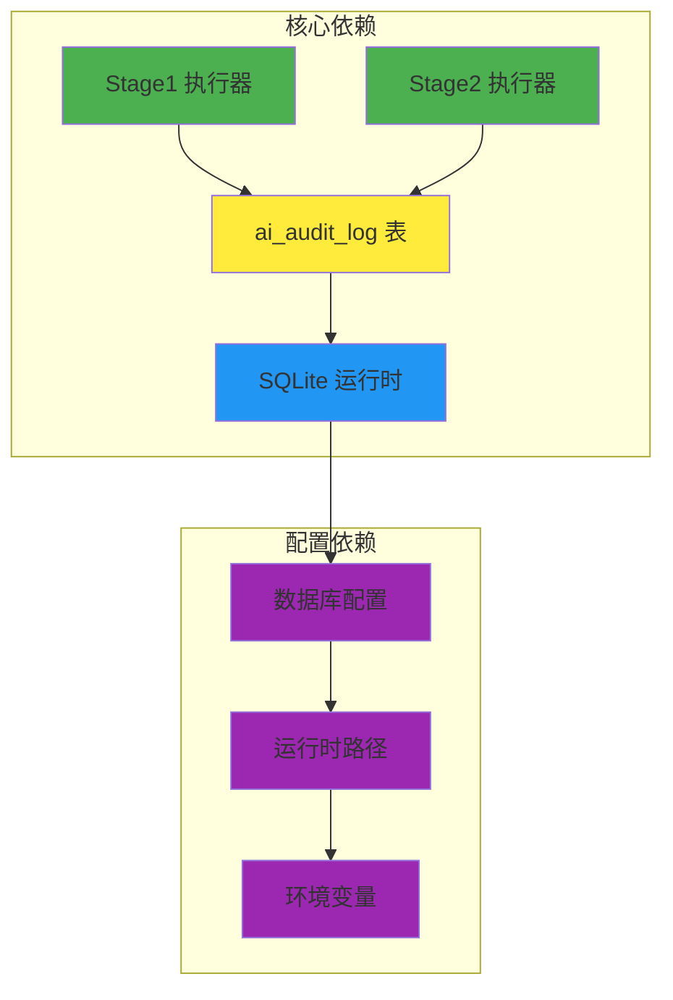

# ai_audit_log 表结构设计

<cite>
**本文档引用的文件**
- [001_global_persistence_init.sql](file://db/migrations/001_global_persistence_init.sql)
- [stage1-store.ts](file://src/persistence/stage1-store.ts)
- [stage2-store.ts](file://src/persistence/stage2-store.ts)
- [types.ts](file://src/persistence/types.ts)
- [sqlite-runtime.ts](file://src/persistence/sqlite-runtime.ts)
- [db.ts](file://config/db.ts)
- [runtime-path.ts](file://config/runtime-path.ts)
- [README.md](file://README.md)
</cite>

## 目录
1. [简介](#简介)
2. [项目结构](#项目结构)
3. [核心组件](#核心组件)
4. [架构概览](#架构概览)
5. [详细组件分析](#详细组件分析)
6. [依赖关系分析](#依赖关系分析)
7. [性能考虑](#性能考虑)
8. [故障排查指南](#故障排查指南)
9. [结论](#结论)

## 简介

ai_audit_log 表是本项目全局数据持久化底座中的关键审计日志表，负责记录系统中所有重要操作和变更事件。该表采用 SQLite 单文件数据库设计，表结构按照 MySQL 兼容子集进行设计，为后续迁移到 MySQL 提供了便利。

该表的核心作用包括：
- **系统安全**：提供完整的操作追踪和责任追溯机制
- **合规要求**：满足审计和监管要求，确保所有关键操作都有据可查
- **变更记录**：详细记录系统状态的每一次变更
- **故障诊断**：为系统问题排查提供完整的时间线和上下文信息

## 项目结构

项目采用分层架构设计，ai_audit_log 表位于数据持久化层，与其它核心表形成完整的数据模型：



**图表来源**
- [001_global_persistence_init.sql:109-118](file://db/migrations/001_global_persistence_init.sql#L109-L118)
- [stage1-store.ts:86](file://src/persistence/stage1-store.ts#L86)
- [stage2-store.ts:74](file://src/persistence/stage2-store.ts#L74)

**章节来源**
- [README.md:101-123](file://README.md#L101-L123)
- [001_global_persistence_init.sql:1-128](file://db/migrations/001_global_persistence_init.sql#L1-128)

## 核心组件

### ai_audit_log 表结构

ai_audit_log 表采用简洁而高效的结构设计，包含以下核心字段：

| 字段名 | 类型 | 非空 | 主键 | 描述 |
|--------|------|------|------|------|
| id | VARCHAR(64) | 是 | 是 | 审计日志唯一标识符，采用前缀+时间戳+随机数的格式 |
| entity_type | VARCHAR(64) | 是 | 否 | 实体类型，标识产生审计事件的对象所属的表或领域 |
| entity_id | VARCHAR(64) | 是 | 否 | 实体标识符，关联到具体实体的主键值 |
| event_code | VARCHAR(64) | 是 | 否 | 事件代码，标准化的事件标识符 |
| event_detail | TEXT | 否 | 否 | 事件详情，包含事件的具体描述和参数信息 |
| operator_name | VARCHAR(128) | 否 | 否 | 操作者名称，记录执行操作的主体信息 |
| created_at | DATETIME | 是 | 否 | 创建时间，记录事件发生的时间戳 |

### 索引设计

为了优化查询性能，ai_audit_log 表建立了专门的索引：

```mermaid
erDiagram
AI_AUDIT_LOG {
VARCHAR id PK
VARCHAR entity_type
VARCHAR entity_id
VARCHAR event_code
TEXT event_detail
VARCHAR operator_name
DATETIME created_at
}
INDEX idx_ai_audit_log_entity_created_at ON AI_AUDIT_LOG(entity_type, entity_id, created_at)
```

**图表来源**
- [001_global_persistence_init.sql:126](file://db/migrations/001_global_persistence_init.sql#L126)

**章节来源**
- [001_global_persistence_init.sql:109-118](file://db/migrations/001_global_persistence_init.sql#L109-L118)
- [001_global_persistence_init.sql:126](file://db/migrations/001_global_persistence_init.sql#L126)

## 架构概览

### 审计日志生成架构

系统通过两个执行阶段（Stage1 和 Stage2）自动记录关键操作事件：



**图表来源**
- [stage1-store.ts:134](file://src/persistence/stage1-store.ts#L134)
- [stage2-store.ts:122](file://src/persistence/stage2-store.ts#L122)

### 数据流架构



**图表来源**
- [stage1-store.ts:317-343](file://src/persistence/stage1-store.ts#L317-L343)
- [stage2-store.ts:305-331](file://src/persistence/stage2-store.ts#L305-L331)

## 详细组件分析

### 事件代码标准化体系

系统实现了标准化的事件代码体系，确保事件的一致性和可查询性：

#### 核心事件类型

| 事件类别 | 事件代码 | 描述 | 典型场景 |
|----------|----------|------|----------|
| 任务管理 | TASK_CREATED | 任务创建 | 新建任务时触发 |
| 任务管理 | TASK_VERSION_CREATED | 任务版本创建 | 更新任务内容时触发 |
| 运行管理 | RUN_STARTED | 运行开始 | 执行任务前触发 |
| 运行管理 | RUN_FINISHED | 运行结束 | 任务完成后触发 |
| 步骤管理 | STEP_FAILED | 步骤失败 | 执行步骤异常时触发 |

#### 事件代码生成规则

事件代码采用"领域_动作"的命名约定：
- **TASK_CREATED**: 任务创建事件
- **RUN_STARTED**: 运行开始事件  
- **STEP_FAILED**: 步骤失败事件

**章节来源**
- [stage1-store.ts:195](file://src/persistence/stage1-store.ts#L195)
- [stage1-store.ts:266](file://src/persistence/stage1-store.ts#L266)
- [stage1-store.ts:593](file://src/persistence/stage1-store.ts#L593)
- [stage1-store.ts:697](file://src/persistence/stage1-store.ts#L697)
- [stage2-store.ts:183](file://src/persistence/stage2-store.ts#L183)
- [stage2-store.ts:254](file://src/persistence/stage2-store.ts#L254)
- [stage2-store.ts:582](file://src/persistence/stage2-store.ts#L582)
- [stage2-store.ts:623](file://src/persistence/stage2-store.ts#L623)

### 实体类型和标识符设计

#### 实体类型映射

系统支持多种实体类型的审计跟踪：

| 实体类型 | 对应表 | 描述 |
|----------|--------|------|
| ai_task | ai_task | 任务实体 |
| ai_task_version | ai_task_version | 任务版本实体 |
| ai_run | ai_run | 运行实体 |
| ai_run_step | ai_run_step | 运行步骤实体 |

#### 实体标识符生成

每个实体都采用统一的标识符生成策略：
- **格式**：`前缀_时间戳_随机数`
- **示例**：`audit_1700000000abc123`
- **特点**：全局唯一、时间有序、便于查询

**章节来源**
- [sqlite-runtime.ts:24-26](file://src/persistence/sqlite-runtime.ts#L24-L26)
- [stage1-store.ts:124](file://src/persistence/stage1-store.ts#L124)
- [stage2-store.ts:112](file://src/persistence/stage2-store.ts#L112)

### 事件详情数据格式

#### 结构化事件详情

事件详情采用结构化的文本格式，包含以下信息：



**图表来源**
- [types.ts:115-123](file://src/persistence/types.ts#L115-L123)

#### 敏感信息保护

系统实现了敏感信息的自动掩码处理：
- **密码字段**：自动替换为 `******`
- **账户信息**：敏感字段进行脱敏处理
- **原始数据**：保留未脱敏的原始文件路径

**章节来源**
- [stage1-store.ts:49-60](file://src/persistence/stage1-store.ts#L49-L60)
- [stage2-store.ts:37-48](file://src/persistence/stage2-store.ts#L37-L48)

### 时间序列查询机制

#### 查询优化策略

系统针对审计日志的查询特点进行了专门优化：



**图表来源**
- [001_global_persistence_init.sql:126](file://db/migrations/001_global_persistence_init.sql#L126)

#### 查询性能特征

- **索引覆盖**：复合索引支持多维度查询
- **时间有序**：created_at 字段保证时间序列查询效率
- **实体关联**：entity_type + entity_id 组合支持实体历史追踪

**章节来源**
- [001_global_persistence_init.sql:126](file://db/migrations/001_global_persistence_init.sql#L126)

## 依赖关系分析

### 组件耦合度分析



**图表来源**
- [stage1-store.ts:17](file://src/persistence/stage1-store.ts#L17)
- [stage2-store.ts:13](file://src/persistence/stage2-store.ts#L13)
- [sqlite-runtime.ts:5](file://src/persistence/sqlite-runtime.ts#L5)

### 外部依赖关系

系统对外部依赖主要体现在：

- **SQLite 驱动**：使用 Node.js 的 node:sqlite 实现
- **文件系统**：依赖文件路径解析和相对路径转换
- **加密库**：使用 crypto 模块进行内容哈希计算

**章节来源**
- [sqlite-runtime.ts:1-116](file://src/persistence/sqlite-runtime.ts#L1-L116)
- [db.ts:1-28](file://config/db.ts#L1-L28)
- [runtime-path.ts:1-46](file://config/runtime-path.ts#L1-L46)

## 性能考虑

### 存储性能优化

#### 索引策略
- **复合索引**：`(entity_type, entity_id, created_at)` 支持实体历史查询
- **时间索引**：`created_at` 单列索引优化时间范围查询
- **事件索引**：`event_code` 索引支持事件类型过滤

#### 数据压缩
- **文本存储**：事件详情采用 TEXT 类型，支持大文本存储
- **哈希计算**：使用 SHA256 对内容进行哈希，便于去重和版本控制

### 查询性能优化

#### 索引使用策略
```sql
-- 实体历史查询
SELECT * FROM ai_audit_log 
WHERE entity_type = ? AND entity_id = ? 
ORDER BY created_at DESC 
LIMIT 100;

-- 事件类型查询  
SELECT * FROM ai_audit_log 
WHERE event_code = ? AND created_at BETWEEN ? AND ?
ORDER BY created_at DESC;
```

#### 批量操作优化
- **事务处理**：批量插入使用事务提高性能
- **预编译语句**：使用预编译语句减少 SQL 解析开销
- **连接池**：复用数据库连接减少建立连接的开销

## 故障排查指南

### 常见问题诊断

#### 审计日志缺失问题

**症状**：某些操作没有产生相应的审计日志

**排查步骤**：
1. 检查数据库连接是否正常
2. 验证迁移脚本是否成功执行
3. 确认事件记录函数是否被调用
4. 检查异常处理逻辑是否吞掉错误

#### 查询性能问题

**症状**：审计日志查询响应缓慢

**排查步骤**：
1. 使用 EXPLAIN 分析查询计划
2. 检查索引使用情况
3. 验证 WHERE 条件是否能利用索引
4. 考虑添加合适的索引

#### 数据一致性问题

**症状**：审计日志与业务数据不一致

**排查步骤**：
1. 检查外键约束是否启用
2. 验证事务提交和回滚逻辑
3. 确认数据同步的原子性
4. 检查并发访问的正确性

### 监控指标

#### 关键性能指标
- **日志写入延迟**：从事件发生到日志落库的时间
- **查询响应时间**：不同类型查询的平均响应时间
- **存储空间使用**：审计日志占用的磁盘空间
- **索引命中率**：查询中索引的使用效率

#### 告警阈值
- **写入延迟**：超过 1 秒触发告警
- **查询响应**：超过 5 秒触发告警  
- **存储空间**：超过 80% 使用率触发告警
- **错误率**：超过 1% 的错误率触发告警

**章节来源**
- [sqlite-runtime.ts:73-84](file://src/persistence/sqlite-runtime.ts#L73-L84)
- [stage1-store.ts:137-145](file://src/persistence/stage1-store.ts#L137-L145)
- [stage2-store.ts:125-133](file://src/persistence/stage2-store.ts#L125-L133)

## 结论

ai_audit_log 表作为本项目全局数据持久化底座的核心组件，实现了系统安全和合规要求的关键功能。通过标准化的事件代码体系、完善的实体追踪机制和优化的查询性能设计，该表为系统的安全审计、变更管理和故障排查提供了坚实的基础。

### 设计优势

1. **标准化程度高**：统一的事件代码和实体标识符设计
2. **查询性能优秀**：专门的索引设计支持多维度查询
3. **扩展性强**：支持新的实体类型和事件类型的扩展
4. **安全性保障**：敏感信息自动脱敏处理
5. **可维护性好**：清晰的代码结构和完善的错误处理

### 未来改进方向

1. **MySQL 迁移支持**：基于现有设计，平滑迁移到 MySQL
2. **实时查询优化**：引入更高级的查询优化技术
3. **日志轮转机制**：实现自动的日志清理和归档
4. **分布式支持**：支持多实例环境下的审计日志聚合
5. **可视化界面**：提供审计日志的可视化查询和分析界面

该设计为项目的长期发展奠定了良好的数据基础，能够有效支撑系统的安全运营和合规管理需求。