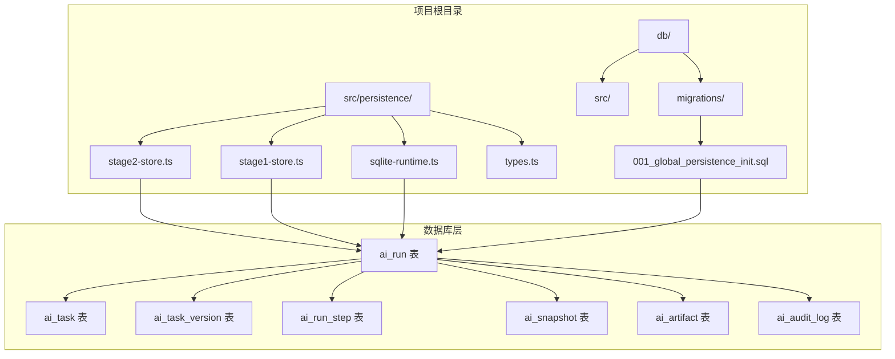
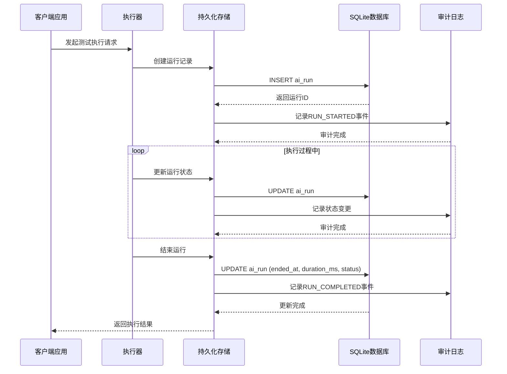
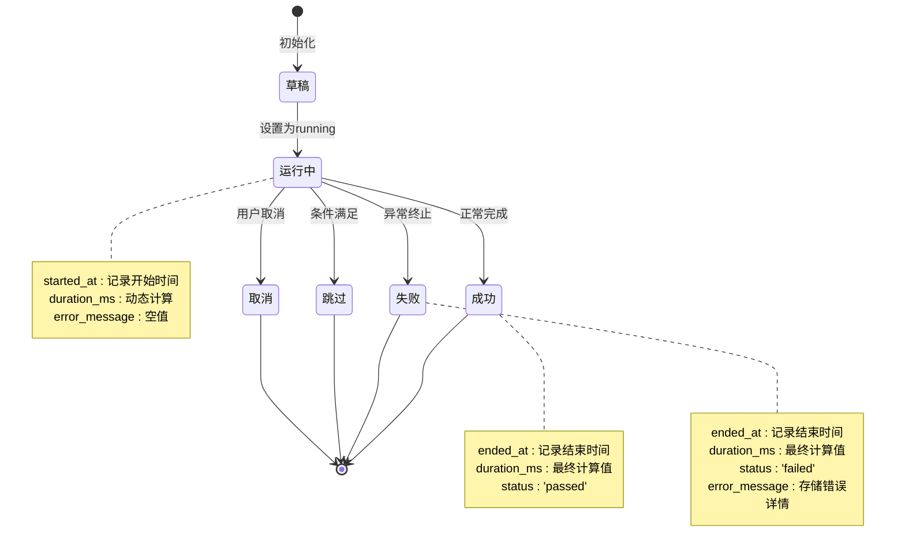
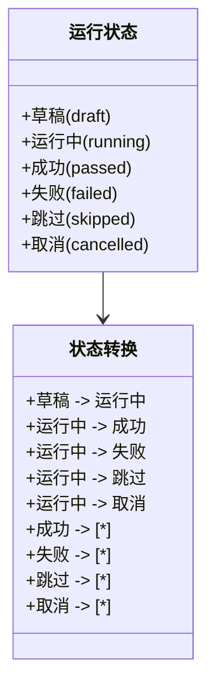
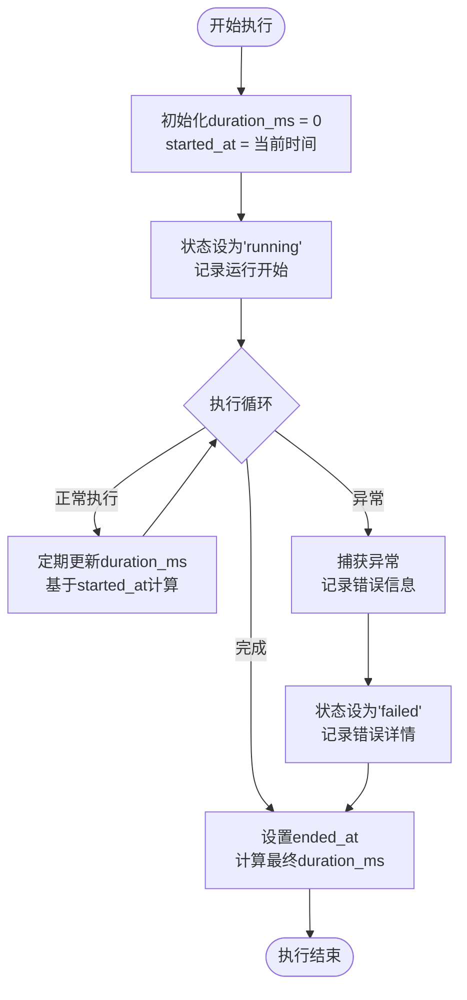
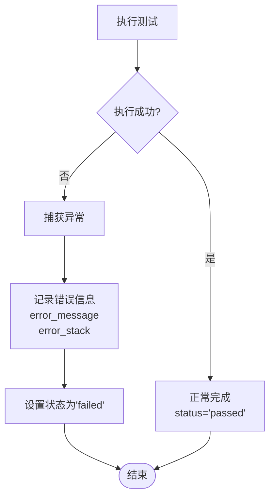
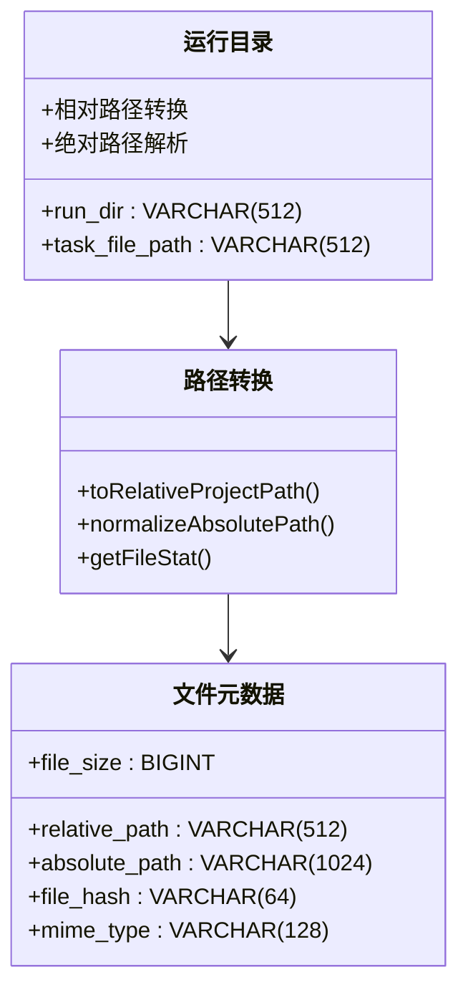
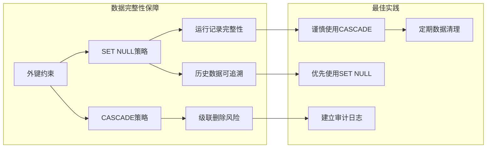

# ai_run 表结构设计

<cite>
**本文档引用的文件**
- [001_global_persistence_init.sql](file://db/migrations/001_global_persistence_init.sql)
- [types.ts](file://src/persistence/types.ts)
- [sqlite-runtime.ts](file://src/persistence/sqlite-runtime.ts)
- [stage2-store.ts](file://src/persistence/stage2-store.ts)
- [stage1-store.ts](file://src/persistence/stage1-store.ts)
</cite>

## 目录
1. [引言](#引言)
2. [项目结构](#项目结构)
3. [核心组件](#核心组件)
4. [架构概览](#架构概览)
5. [详细组件分析](#详细组件分析)
6. [依赖关系分析](#依赖关系分析)
7. [性能考虑](#性能考虑)
8. [故障排除指南](#故障排除指南)
9. [结论](#结论)

## 引言

ai_run 表是 HI-TEST 测试执行系统的核心数据结构，负责记录和追踪所有测试执行运行的完整生命周期。该表设计体现了现代测试框架对执行追踪、审计日志和数据完整性的重要需求，通过精心设计的字段结构和外键约束，为测试执行提供了可靠的数据支撑。

本设计文档深入分析了 ai_run 表的结构设计，包括关键字段的含义、运行状态管理机制、触发类型分类、运行时长计算方式、错误信息存储策略以及运行目录管理等核心功能。同时详细说明了外键约束的删除策略对数据完整性的影响，并阐述了该表在测试执行追踪和审计中的重要作用。

## 项目结构

HI-TEST 项目采用模块化架构设计，ai_run 表作为持久化层的核心组件，位于以下目录结构中：



**图表来源**
- [001_global_persistence_init.sql:32-57](file://db/migrations/001_global_persistence_init.sql#L32-L57)
- [stage2-store.ts:95-123](file://src/persistence/stage2-store.ts#L95-L123)
- [stage1-store.ts:280-315](file://src/persistence/stage1-store.ts#L280-L315)

**章节来源**
- [001_global_persistence_init.sql:1-128](file://db/migrations/001_global_persistence_init.sql#L1-L128)
- [stage2-store.ts:95-123](file://src/persistence/stage2-store.ts#L95-L123)
- [stage1-store.ts:280-315](file://src/persistence/stage1-store.ts#L280-L315)

## 核心组件

### ai_run 表结构概述

ai_run 表是测试执行追踪系统的核心，设计包含以下关键特性：

#### 主要字段设计

| 字段名称 | 数据类型 | 约束条件 | 描述 |
|---------|---------|---------|------|
| id | VARCHAR(64) | PRIMARY KEY | 运行记录唯一标识符 |
| run_code | VARCHAR(128) | UNIQUE | 运行代码，便于外部引用 |
| stage_code | VARCHAR(32) | NOT NULL | 阶段标识（stage1/stage2） |
| task_id | VARCHAR(64) | NULL, 外键 | 关联的任务标识符 |
| task_version_id | VARCHAR(64) | NULL, 外键 | 关联的任务版本标识符 |
| status | VARCHAR(32) | NOT NULL | 运行状态（pending/running/success/failed） |
| trigger_type | VARCHAR(32) | NOT NULL | 触发类型（manual/scheduled/webhook） |
| trigger_by | VARCHAR(128) | NULL | 触发者信息 |
| started_at | DATETIME | NOT NULL | 开始执行时间 |
| ended_at | DATETIME | NULL | 结束执行时间 |
| duration_ms | BIGINT | NOT NULL, DEFAULT 0 | 执行时长（毫秒） |
| run_dir | VARCHAR(512) | NULL | 运行目录路径 |
| task_file_path | VARCHAR(512) | NULL | 任务文件路径 |
| error_message | TEXT | NULL | 错误信息 |
| created_at | DATETIME | NOT NULL | 记录创建时间 |
| updated_at | DATETIME | NOT NULL | 记录更新时间 |

#### 外键约束策略

ai_run 表采用了两种不同的外键删除策略来确保数据完整性：

1. **task_id 外键**：ON DELETE SET NULL
   - 当关联的 ai_task 记录被删除时，ai_run 表中的 task_id 字段会被设置为 NULL
   - 保持运行记录的完整性，但解除与已删除任务的关联

2. **task_version_id 外键**：ON DELETE SET NULL  
   - 当关联的 ai_task_version 记录被删除时，ai_run 表中的 task_version_id 字段会被设置为 NULL
   - 维护运行历史的可追溯性

**章节来源**
- [001_global_persistence_init.sql:32-57](file://db/migrations/001_global_persistence_init.sql#L32-L57)

## 架构概览

### 数据流架构



**图表来源**
- [stage2-store.ts:263-303](file://src/persistence/stage2-store.ts#L263-L303)
- [stage1-store.ts:300-315](file://src/persistence/stage1-store.ts#L300-L315)
- [sqlite-runtime.ts:73-84](file://src/persistence/sqlite-runtime.ts#L73-L84)

### 状态管理流程



**图表来源**
- [types.ts:11-17](file://src/persistence/types.ts#L11-L17)
- [stage2-store.ts:333-356](file://src/persistence/stage2-store.ts#L333-L356)
- [stage1-store.ts:345-368](file://src/persistence/stage1-store.ts#L345-L368)

## 详细组件分析

### 运行状态管理系统

#### 状态枚举定义

运行状态采用严格的枚举控制，确保状态的一致性和可预测性：



**图表来源**
- [types.ts:11-17](file://src/persistence/types.ts#L11-L17)

#### 状态更新机制

状态更新通过统一的更新方法实现，确保数据一致性：

**章节来源**
- [types.ts:11-17](file://src/persistence/types.ts#L11-L17)
- [stage2-store.ts:333-356](file://src/persistence/stage2-store.ts#L333-L356)
- [stage1-store.ts:345-368](file://src/persistence/stage1-store.ts#L345-L368)

### 触发类型分类系统

#### 触发类型定义

触发类型决定了测试执行的启动方式和上下文信息：

| 触发类型 | 描述 | 典型场景 | 触发者示例 |
|---------|------|----------|-----------|
| manual | 手动触发 | 人工执行测试 | 用户界面操作 |
| scheduled | 定时触发 | 定时任务调度 | Cron作业 |
| webhook | Webhook触发 | 外部系统集成 | CI/CD流水线 |

#### 触发信息管理

触发类型与触发者信息共同构成了完整的执行上下文，为审计和追踪提供重要依据。

**章节来源**
- [stage2-store.ts:289-293](file://src/persistence/stage2-store.ts#L289-L293)
- [stage1-store.ts:303-305](file://src/persistence/stage1-store.ts#L303-L305)

### 运行时长计算机制

#### 实时计算策略

运行时长采用实时计算方式，确保数据的准确性和时效性：



**图表来源**
- [stage2-store.ts:333-356](file://src/persistence/stage2-store.ts#L333-L356)
- [stage1-store.ts:345-368](file://src/persistence/stage1-store.ts#L345-L368)

#### 时间精度处理

系统采用高精度的时间戳存储，支持毫秒级的时间计算，确保运行时长统计的准确性。

**章节来源**
- [stage2-store.ts:333-356](file://src/persistence/stage2-store.ts#L333-L356)
- [stage1-store.ts:345-368](file://src/persistence/stage1-store.ts#L345-L368)

### 错误信息存储策略

#### 错误信息结构

错误信息采用结构化的存储方式，支持详细的错误追踪：

| 错误信息字段 | 类型 | 描述 |
|-------------|------|------|
| error_message | TEXT | 错误描述文本 |
| error_stack | TEXT | 错误堆栈跟踪 |
| status | VARCHAR(32) | 错误发生时的运行状态 |

#### 错误处理流程



**图表来源**
- [stage2-store.ts:333-356](file://src/persistence/stage2-store.ts#L333-L356)
- [stage1-store.ts:345-368](file://src/persistence/stage1-store.ts#L345-L368)

**章节来源**
- [stage2-store.ts:333-356](file://src/persistence/stage2-store.ts#L333-L356)
- [stage1-store.ts:345-368](file://src/persistence/stage1-store.ts#L345-L368)

### 运行目录管理系统

#### 目录路径管理

运行目录采用相对路径存储策略，提高系统的可移植性：



**图表来源**
- [sqlite-runtime.ts:32-41](file://src/persistence/sqlite-runtime.ts#L32-L41)
- [stage2-store.ts:397-468](file://src/persistence/stage2-store.ts#L397-L468)
- [stage1-store.ts:409-480](file://src/persistence/stage1-store.ts#L409-L480)

#### 目录管理优势

- **可移植性**：相对路径确保数据库文件在不同环境间的可迁移性
- **安全性**：限制路径访问范围，防止路径遍历攻击
- **一致性**：统一的路径格式便于系统维护和调试

**章节来源**
- [sqlite-runtime.ts:32-41](file://src/persistence/sqlite-runtime.ts#L32-L41)
- [stage2-store.ts:397-468](file://src/persistence/stage2-store.ts#L397-L468)
- [stage1-store.ts:409-480](file://src/persistence/stage1-store.ts#L409-L480)

## 依赖关系分析

### 外键约束影响分析

#### 删除策略对比

| 外键约束 | 删除策略 | 对数据完整性的影响 | 使用场景 |
|---------|---------|-------------------|----------|
| task_id | SET NULL | 保持运行记录完整，解除关联 | 任务删除后的数据保留 |
| task_version_id | SET NULL | 保持运行历史可追溯 | 版本删除后的历史保留 |

#### 数据完整性保障



**图表来源**
- [001_global_persistence_init.sql:51-56](file://db/migrations/001_global_persistence_init.sql#L51-L56)

#### 外键约束实施

外键约束通过数据库层面强制执行，确保引用完整性：

**章节来源**
- [001_global_persistence_init.sql:51-56](file://db/migrations/001_global_persistence_init.sql#L51-L56)

### 索引优化策略

#### 性能索引设计

| 索引名称 | 字段组合 | 查询场景 | 性能收益 |
|---------|---------|----------|----------|
| idx_ai_run_task_stage_started_at | task_id, stage_code, started_at | 任务执行查询 | 快速筛选特定任务的执行记录 |
| idx_ai_run_status_started_at | stage_code, status, started_at | 状态统计查询 | 高效的状态分布统计 |
| idx_ai_run_step_run_id_status | run_id, status | 步骤执行查询 | 快速获取运行的所有步骤 |

**章节来源**
- [001_global_persistence_init.sql:120-126](file://db/migrations/001_global_persistence_init.sql#L120-L126)

## 性能考虑

### 数据库性能优化

#### SQLite 特定优化

系统采用 SQLite 作为持久化存储，针对测试执行场景进行专门优化：

- **外键约束启用**：确保数据完整性的同时保持合理的性能
- **事务批量处理**：减少磁盘 I/O 次数
- **索引合理使用**：平衡查询性能和写入性能

#### 内存管理策略

- **连接池管理**：复用数据库连接，减少连接开销
- **缓存策略**：对频繁访问的数据进行缓存
- **垃圾回收**：及时释放不再使用的资源

### 查询性能优化

#### 常用查询模式

```sql
-- 快速获取最新运行记录
SELECT * FROM ai_run 
WHERE task_id = ? 
ORDER BY started_at DESC 
LIMIT 1;

-- 获取特定状态的运行统计
SELECT status, COUNT(*) as count 
FROM ai_run 
WHERE stage_code = ? 
GROUP BY status;
```

## 故障排除指南

### 常见问题诊断

#### 运行状态异常

**问题现象**：运行状态长时间保持为 'running'

**可能原因**：
1. 执行器异常退出未正确更新状态
2. 数据库连接异常
3. 外部依赖服务不可用

**解决方案**：
1. 检查执行器日志
2. 验证数据库连接状态
3. 实施状态监控和自动恢复机制

#### 数据完整性问题

**问题现象**：运行记录丢失或损坏

**诊断步骤**：
1. 检查外键约束是否启用
2. 验证数据库文件完整性
3. 审计日志检查

**预防措施**：
1. 定期备份数据库
2. 实施数据校验机制
3. 建立监控告警系统

### 性能问题排查

#### 查询缓慢诊断

**症状**：运行记录查询响应时间过长

**排查方法**：
1. 分析查询执行计划
2. 检查索引使用情况
3. 监控数据库锁竞争

**优化建议**：
1. 添加合适的索引
2. 优化查询语句
3. 考虑分表策略

**章节来源**
- [sqlite-runtime.ts:73-84](file://src/persistence/sqlite-runtime.ts#L73-L84)
- [stage2-store.ts:333-356](file://src/persistence/stage2-store.ts#L333-L356)
- [stage1-store.ts:345-368](file://src/persistence/stage1-store.ts#L345-L368)

## 结论

ai_run 表作为 HI-TEST 测试执行系统的核心数据结构，通过精心设计的字段结构、状态管理和外键约束策略，为测试执行提供了全面的数据支撑。该设计充分考虑了以下关键要素：

### 设计优势

1. **完整性保障**：通过 SET NULL 的外键删除策略，在删除关联数据时保持运行记录的完整性
2. **可追溯性**：完整的运行历史记录，支持审计和问题追踪
3. **性能优化**：合理的索引设计和查询优化策略
4. **可扩展性**：模块化的架构设计，便于功能扩展和维护

### 应用价值

- **测试执行追踪**：完整的执行历史记录，支持复杂场景的调试和分析
- **审计合规**：详细的审计日志，满足企业级审计要求
- **数据分析**：丰富的运行数据，支持性能分析和趋势预测
- **故障诊断**：完善的错误信息记录，加速问题定位和解决

该设计为 HI-TEST 系统提供了坚实的数据基础，确保测试执行过程的可控性、可观测性和可维护性，为构建可靠的自动化测试平台奠定了重要基础。