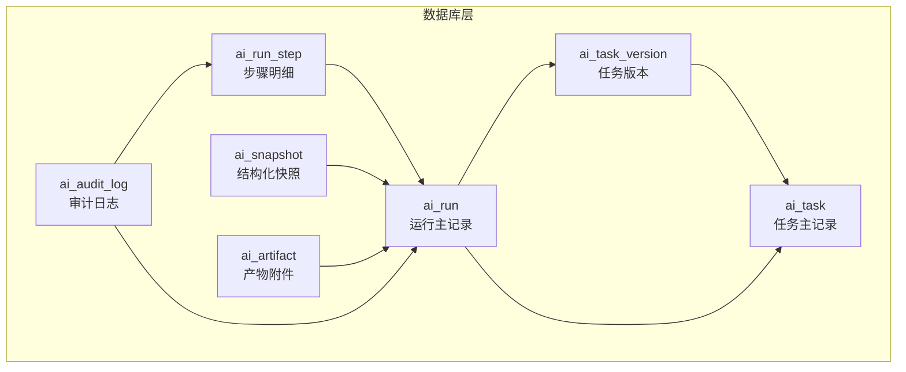
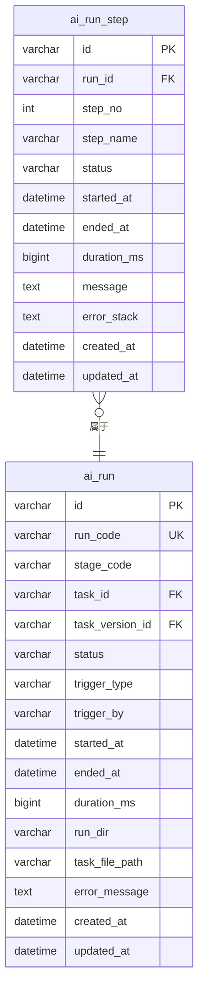
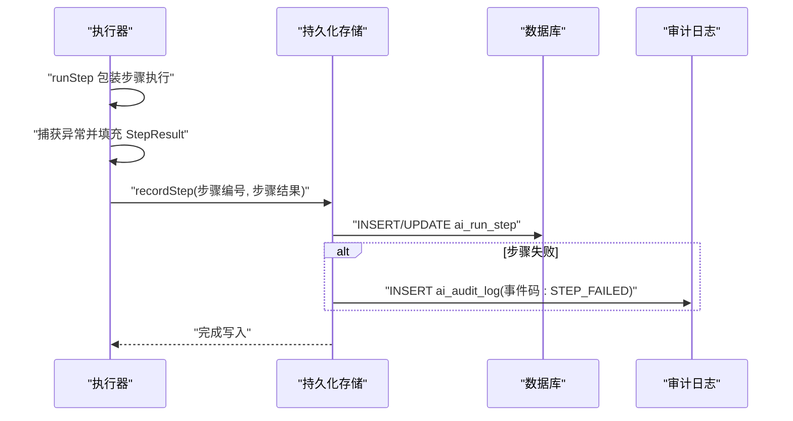
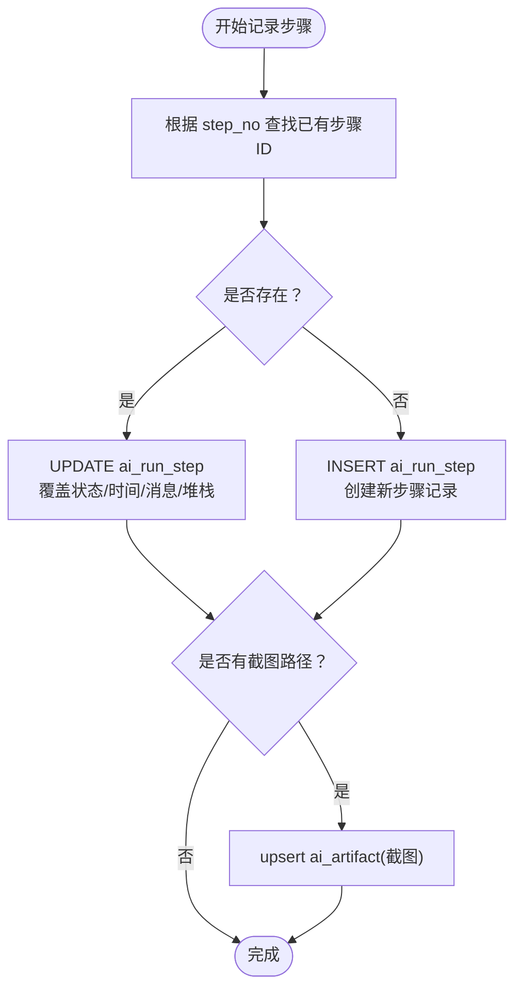
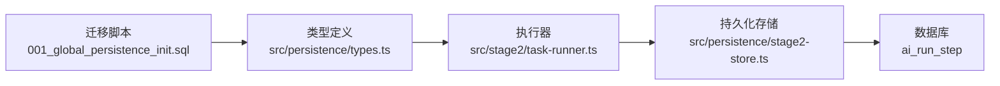

# ai_run_step 表结构设计

<cite>
**本文引用的文件**
- [001_global_persistence_init.sql](file://db/migrations/001_global_persistence_init.sql)
- [types.ts](file://src/persistence/types.ts)
- [stage2-store.ts](file://src/persistence/stage2-store.ts)
- [stage2/types.ts](file://src/stage2/types.ts)
- [task-runner.ts](file://src/stage2/task-runner.ts)
- [stage1-store.ts](file://src/persistence/stage1-store.ts)
- [stage1-runner.ts](file://src/stage1/stage1-runner.ts)
</cite>

## 目录
1. [引言](#引言)
2. [项目结构](#项目结构)
3. [核心组件](#核心组件)
4. [架构概览](#架构概览)
5. [详细组件分析](#详细组件分析)
6. [依赖分析](#依赖分析)
7. [性能考虑](#性能考虑)
8. [故障排查指南](#故障排查指南)
9. [结论](#结论)

## 引言
本文档聚焦于 ai_run_step 表的结构设计与实现细节，系统阐述测试执行步骤记录表如何支撑步骤编号、步骤名称、执行状态、时间统计等核心字段，并深入解析步骤级别的错误处理机制（message 与 error_stack 字段）、步骤执行的原子性与独立性、与父运行记录的关联关系，以及在测试执行过程追踪与故障定位中的关键作用和步骤级别的性能监控能力。

## 项目结构
ai_run_step 表位于数据库迁移脚本中，作为全局持久化体系的一部分，与 ai_run（运行主记录）、ai_task（任务主记录）、ai_task_version（任务版本）等表共同构成测试执行数据的完整生命周期。

图表来源
- [001_global_persistence_init.sql:1-128](file://db/migrations/001_global_persistence_init.sql#L1-L128)

章节来源
- [001_global_persistence_init.sql:1-128](file://db/migrations/001_global_persistence_init.sql#L1-L128)

## 核心组件
ai_run_step 表是测试执行过程中“步骤级别”的事实表，用于记录每个步骤的执行元数据与诊断信息。其核心字段如下：
- id：步骤记录的唯一标识
- run_id：所属运行的外键，建立与 ai_run 的父子关系
- step_no：步骤序号，保证同一运行内步骤顺序唯一
- step_name：步骤名称，便于人类可读的追踪
- status：步骤状态（draft/running/passed/failed/skipped/cancelled）
- started_at/ended_at：步骤开始与结束时间戳
- duration_ms：步骤耗时（毫秒）
- message：步骤执行时的消息（如失败原因）
- error_stack：步骤执行时的错误堆栈
- created_at/updated_at：记录创建与更新时间

这些字段共同构成步骤级别的可观测性与可追溯性基础，支撑故障定位、性能分析与审计。

章节来源
- [001_global_persistence_init.sql:59-77](file://db/migrations/001_global_persistence_init.sql#L59-L77)
- [types.ts:76-89](file://src/persistence/types.ts#L76-L89)

## 架构概览
ai_run_step 与 ai_run 的关联通过外键约束实现，确保当运行被删除或结束时，步骤记录能够被正确维护。同时，步骤记录与运行记录之间是一对多的关系，一个运行可以包含多个步骤。

图表来源
- [001_global_persistence_init.sql:32-77](file://db/migrations/001_global_persistence_init.sql#L32-L77)

## 详细组件分析

### 表结构与索引设计
- 主键与唯一性
  - ai_run_step.id 为主键，确保每条步骤记录唯一
  - ai_run_step(run_id, step_no) 唯一键，保证同一运行内的步骤序号唯一，便于按序检索与去重更新
- 外键约束
  - ai_run_step.run_id -> ai_run.id，删除策略为 CASCADE，确保运行被删除时，其所有步骤记录也被清理
- 索引
  - idx_ai_run_step_run_id_status：加速按运行与状态的查询，便于快速筛选失败步骤或统计状态分布

章节来源
- [001_global_persistence_init.sql:59-77](file://db/migrations/001_global_persistence_init.sql#L59-L77)
- [001_global_persistence_init.sql:123-123](file://db/migrations/001_global_persistence_init.sql#L123-L123)

### 步骤级别的错误处理机制
- message 字段
  - 记录步骤执行时的简要信息或失败原因，便于快速定位问题
  - 在执行器中，当步骤抛出异常时，会将错误消息写入 message
- error_stack 字段
  - 记录完整的错误堆栈，便于深度诊断与回溯
  - 在执行器中，当步骤抛出异常时，会将错误堆栈写入 error_stack
- 审计联动
  - 当步骤状态为 failed 时，持久化层会插入一条 ai_audit_log，事件码为 STEP_FAILED，附带步骤名称与消息，形成可审计的失败轨迹

图表来源
- [task-runner.ts:2382-2435](file://src/stage2/task-runner.ts#L2382-L2435)
- [stage2-store.ts:495-590](file://src/persistence/stage2-store.ts#L495-L590)
- [stage1-store.ts:506-548](file://src/persistence/stage1-store.ts#L506-L548)

章节来源
- [task-runner.ts:2404-2425](file://src/stage2/task-runner.ts#L2404-L2425)
- [stage2-store.ts:581-588](file://src/persistence/stage2-store.ts#L581-L588)
- [stage1-store.ts:537-547](file://src/persistence/stage1-store.ts#L537-L547)

### 步骤执行的原子性与独立性
- 原子性
  - 每个步骤的写入采用单条 INSERT 或 UPDATE，字段覆盖完整，避免部分更新导致的数据不一致
  - 通过 UNIQUE(run_id, step_no) 确保同一步骤编号在同一运行内不会重复写入
- 独立性
  - 步骤记录与运行记录解耦，步骤失败不影响其他步骤的写入
  - 步骤记录与运行记录之间通过 run_id 关联，便于按运行维度进行聚合分析
- 幂等更新
  - 按步骤编号查找已有步骤 ID，若存在则执行 UPDATE，否则执行 INSERT，保证多次写入的幂等性

图表来源
- [stage2-store.ts:495-590](file://src/persistence/stage2-store.ts#L495-L590)
- [stage1-store.ts:506-548](file://src/persistence/stage1-store.ts#L506-L548)

章节来源
- [stage2-store.ts:495-590](file://src/persistence/stage2-store.ts#L495-L590)
- [stage1-store.ts:506-548](file://src/persistence/stage1-store.ts#L506-L548)

### 与父运行记录的关联关系
- 外键约束
  - ai_run_step.run_id -> ai_run.id，删除策略为 CASCADE，确保运行被删除时，其所有步骤记录也被清理
- 关联查询
  - 可通过 run_id 查询某次运行的所有步骤，按 step_no 排序即可还原执行顺序
  - 可按 status 进行过滤，快速定位失败步骤

章节来源
- [001_global_persistence_init.sql:74-76](file://db/migrations/001_global_persistence_init.sql#L74-L76)
- [001_global_persistence_init.sql:123-123](file://db/migrations/001_global_persistence_init.sql#L123-L123)

### 步骤级别的性能监控能力
- 时间统计
  - started_at/ended_at/duration_ms 提供精确的时间戳与耗时，便于计算步骤耗时分布与热点步骤
- 状态聚合
  - status 字段支持按状态统计（通过索引 idx_ai_run_step_run_id_status），便于识别高频失败或耗时长的步骤
- 截图与产物
  - 步骤失败时可生成截图并以 ai_artifact 形式存档，结合 message/error_stack 实现可视化与文本双重诊断
- 运行级汇总
  - 运行结束后，运行记录 ai_run 会汇总失败步骤的消息，便于整体故障定位

章节来源
- [001_global_persistence_init.sql:59-77](file://db/migrations/001_global_persistence_init.sql#L59-L77)
- [stage2-store.ts:581-588](file://src/persistence/stage2-store.ts#L581-L588)

## 依赖分析
ai_run_step 的实现依赖于以下模块：
- 数据库迁移：定义表结构、索引与外键
- 类型定义：统一字段类型与状态枚举
- 执行器：封装步骤执行逻辑，填充 StepResult
- 持久化存储：负责将步骤结果写入数据库，并处理幂等更新与审计

图表来源
- [001_global_persistence_init.sql:59-77](file://db/migrations/001_global_persistence_init.sql#L59-L77)
- [types.ts:76-89](file://src/persistence/types.ts#L76-L89)
- [stage2/types.ts:156-179](file://src/stage2/types.ts#L156-L179)
- [task-runner.ts:2382-2435](file://src/stage2/task-runner.ts#L2382-L2435)
- [stage2-store.ts:495-590](file://src/persistence/stage2-store.ts#L495-L590)

章节来源
- [001_global_persistence_init.sql:59-77](file://db/migrations/001_global_persistence_init.sql#L59-L77)
- [types.ts:76-89](file://src/persistence/types.ts#L76-L89)
- [stage2/types.ts:156-179](file://src/stage2/types.ts#L156-L179)
- [task-runner.ts:2382-2435](file://src/stage2/task-runner.ts#L2382-L2435)
- [stage2-store.ts:495-590](file://src/persistence/stage2-store.ts#L495-L590)

## 性能考虑
- 写入性能
  - 单条 INSERT/UPDATE 写入，字段覆盖完整，避免频繁小事务
  - 幂等更新通过 UNIQUE(run_id, step_no) 保障，减少重复写入成本
- 查询性能
  - idx_ai_run_step_run_id_status 支持按运行与状态快速筛选
  - started_at/ended_at 字段可用于范围查询，支持时间序列分析
- 存储与归档
  - 截图与产物通过 ai_artifact 统一管理，避免步骤记录膨胀
  - 运行结束后，运行记录 ai_run 会汇总失败信息，便于后续离线分析

## 故障排查指南
- 快速定位失败步骤
  - 使用索引 idx_ai_run_step_run_id_status 按状态筛选，查看最近一次运行的失败步骤
  - 结合 ai_audit_log(事件码: STEP_FAILED) 获取失败详情
- 诊断信息核对
  - 检查 ai_run_step.message 与 error_stack，确认错误原因与堆栈
  - 对比 started_at/ended_at 与 duration_ms，识别异常耗时步骤
- 截图与产物
  - 通过 ai_artifact(owner_type='run_step') 获取失败步骤截图，结合 message 进行可视化复盘

章节来源
- [001_global_persistence_init.sql:123-123](file://db/migrations/001_global_persistence_init.sql#L123-L123)
- [stage2-store.ts:581-588](file://src/persistence/stage2-store.ts#L581-L588)

## 结论
ai_run_step 表通过严谨的字段设计与外键约束，实现了步骤级别的可观测性与可追溯性。它不仅承载了步骤编号、名称、状态与时间统计等核心信息，还通过 message 与 error_stack 提供了强大的错误诊断能力。配合幂等更新与审计日志，ai_run_step 在测试执行过程追踪与故障定位中发挥关键作用，并为步骤级别的性能监控提供了坚实的数据基础。