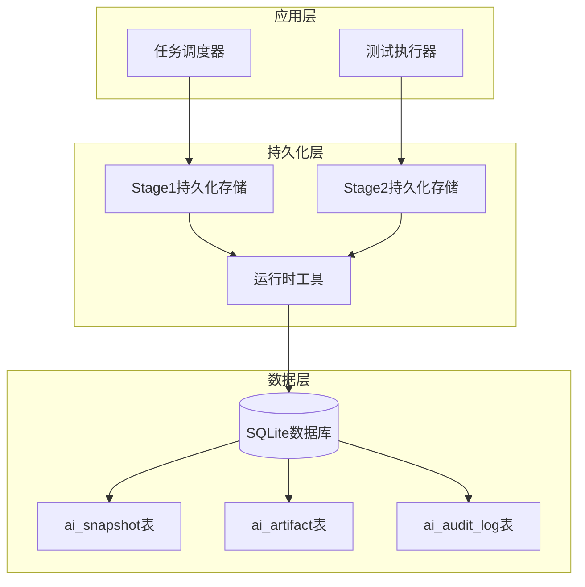
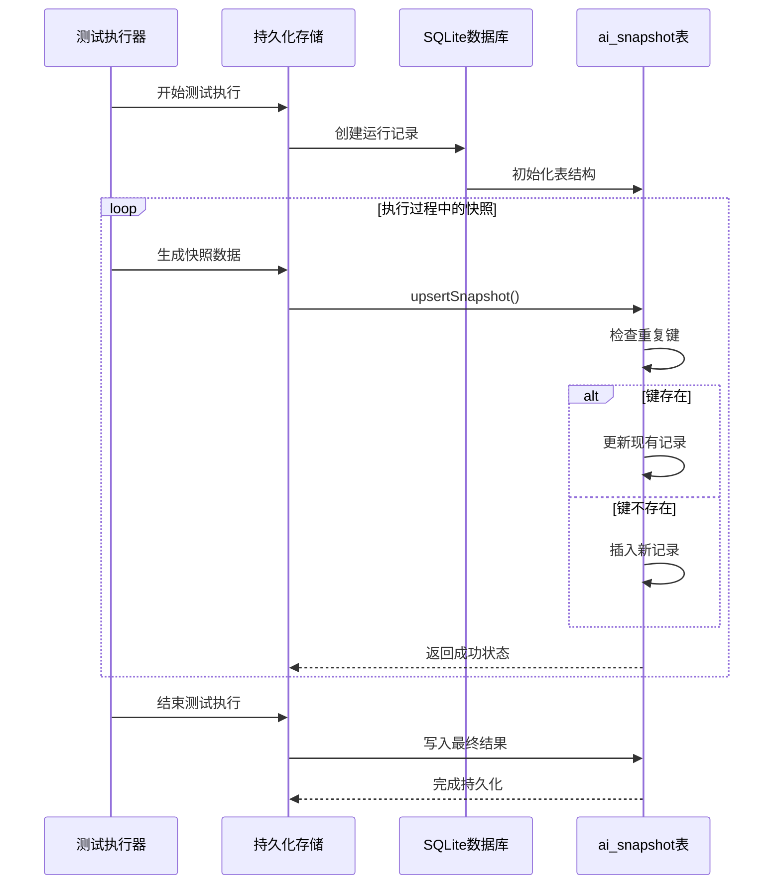
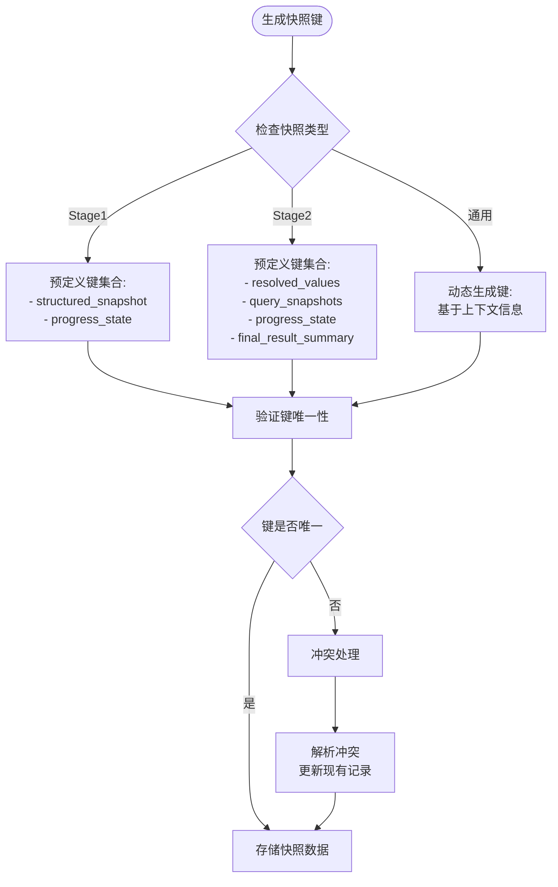
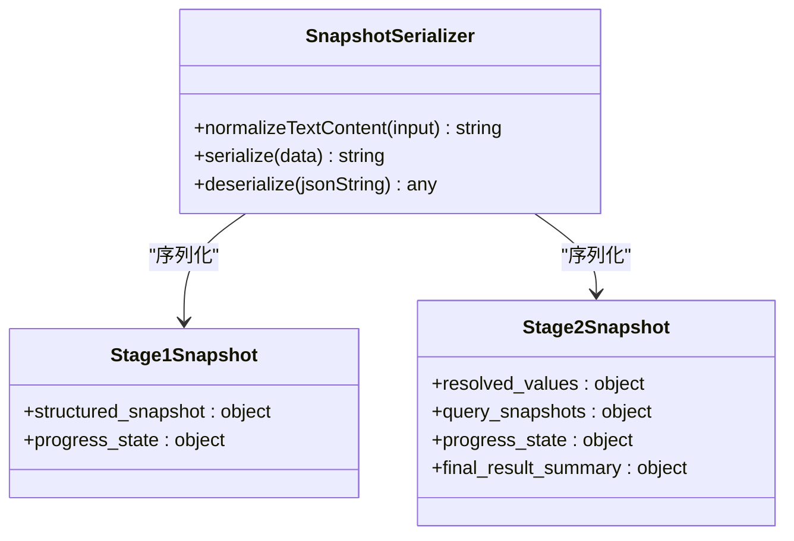
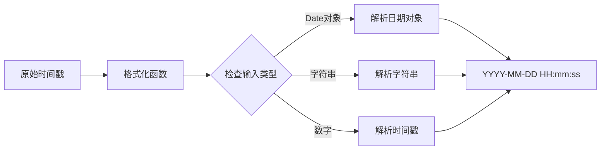
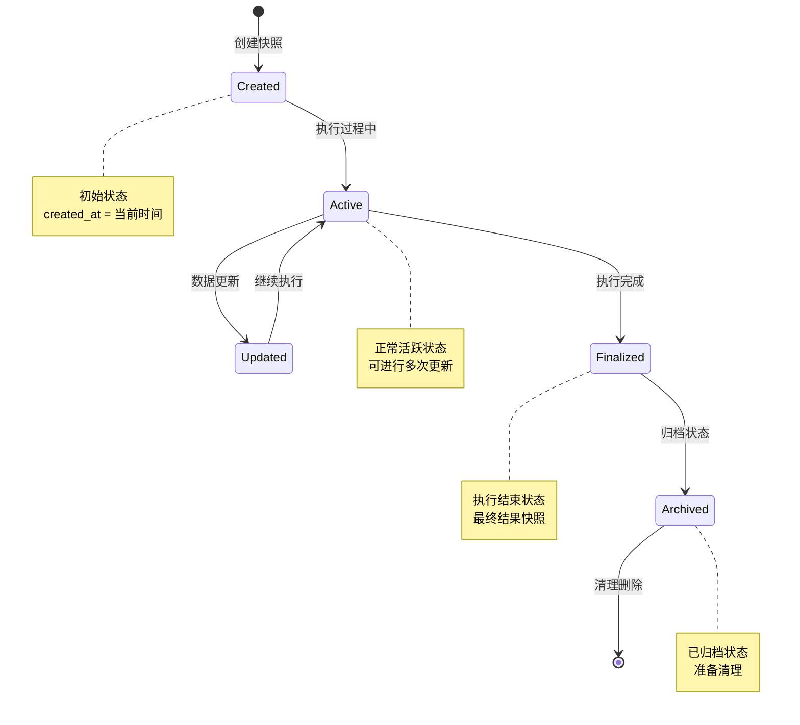
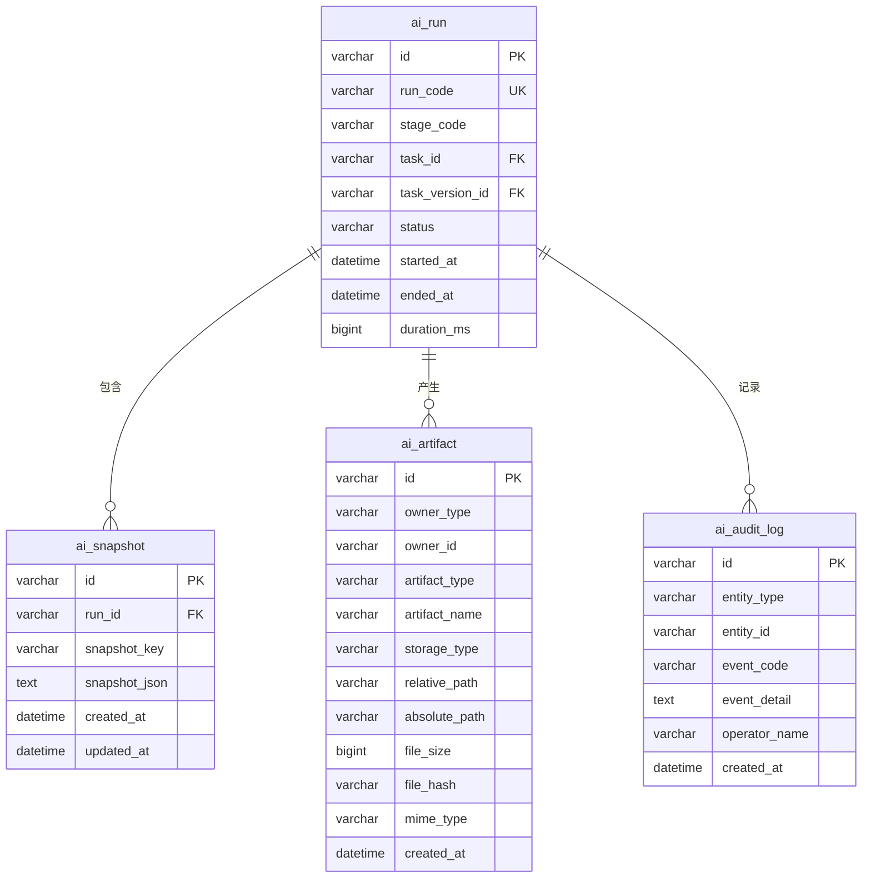
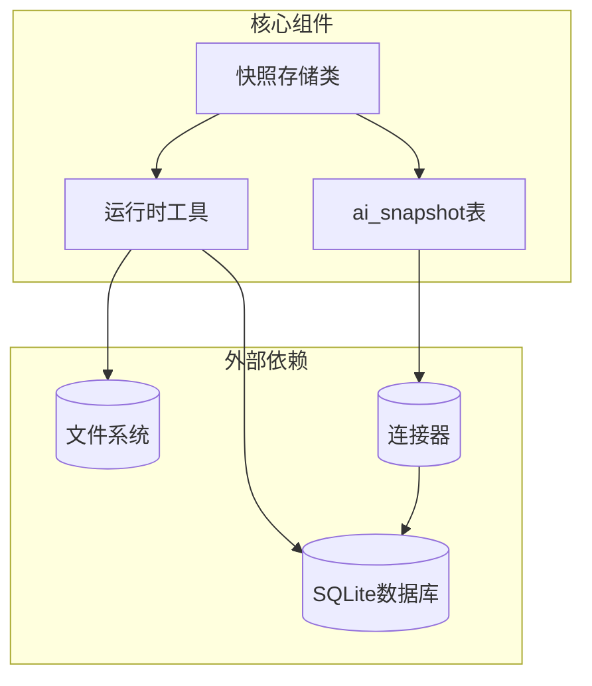

# ai_snapshot 表结构设计

<cite>
**本文档引用的文件**
- [001_global_persistence_init.sql](file://db/migrations/001_global_persistence_init.sql)
- [stage2-store.ts](file://src/persistence/stage2-store.ts)
- [stage1-store.ts](file://src/persistence/stage1-store.ts)
- [types.ts](file://src/persistence/types.ts)
- [sqlite-runtime.ts](file://src/persistence/sqlite-runtime.ts)
- [stage2/types.ts](file://src/stage2/types.ts)
- [task-runner.ts](file://src/stage2/task-runner.ts)
</cite>

## 目录
1. [简介](#简介)
2. [项目结构概览](#项目结构概览)
3. [核心组件分析](#核心组件分析)
4. [架构概览](#架构概览)
5. [详细组件分析](#详细组件分析)
6. [依赖关系分析](#依赖关系分析)
7. [性能考虑](#性能考虑)
8. [故障排除指南](#故障排除指南)
9. [结论](#结论)

## 简介

ai_snapshot 表是 HI-TEST 测试自动化框架中用于存储测试执行过程中关键状态和中间结果的核心数据表。该表设计采用统一的快照机制，为测试执行过程提供了完整的时间线追踪能力，支持调试、问题重现和性能分析等多种场景。

该表通过 snapshot_key 标识符来组织不同类型的快照数据，通过 snapshot_json 字段存储结构化的状态信息，并结合时间戳管理确保数据的完整性和可追溯性。快照机制在测试执行过程中发挥着至关重要的作用，从页面状态保存到中间结果记录，再到调试信息存储，为整个测试生命周期提供了强大的数据支撑。

## 项目结构概览

HI-TEST 项目采用分层架构设计，ai_snapshot 表作为持久化层的重要组成部分，与任务执行层、存储层和工具层紧密协作：

**图表来源**
- [stage2-store.ts:74-123](file://src/persistence/stage2-store.ts#L74-L123)
- [stage1-store.ts:86-135](file://src/persistence/stage1-store.ts#L86-L135)

**章节来源**
- [stage2-store.ts:1-655](file://src/persistence/stage2-store.ts#L1-L655)
- [stage1-store.ts:1-729](file://src/persistence/stage1-store.ts#L1-L729)

## 核心组件分析

### ai_snapshot 表结构定义

ai_snapshot 表采用标准的关系型数据库设计，具有以下核心字段：

| 字段名 | 数据类型 | 长度限制 | 约束条件 | 描述 |
|--------|----------|----------|----------|------|
| id | VARCHAR | 64 | 主键 | 快照记录唯一标识符 |
| run_id | VARCHAR | 64 | 外键约束 | 关联的测试运行记录 |
| snapshot_key | VARCHAR | 128 | 唯一约束 | 快照标识符，用于区分不同类型的数据 |
| snapshot_json | TEXT | 无限制 | 非空 | 存储快照的JSON格式数据 |
| created_at | DATETIME | 无 | 非空 | 记录创建时间 |
| updated_at | DATETIME | 无 | 非空 | 记录最后更新时间 |

### 数据完整性约束

表结构设计包含以下关键约束：
- **主键约束**: id 字段确保每条快照记录的唯一性
- **外键约束**: run_id 字段引用 ai_run 表，实现级联删除
- **唯一约束**: (run_id, snapshot_key) 组合确保同一运行中的快照键唯一性
- **时间戳约束**: created_at 和 updated_at 字段强制非空

**章节来源**
- [001_global_persistence_init.sql:79-91](file://db/migrations/001_global_persistence_init.sql#L79-L91)
- [types.ts:91-98](file://src/persistence/types.ts#L91-L98)

## 架构概览

ai_snapshot 表在整个系统架构中扮演着数据持久化的关键角色，其工作流程如下：

**图表来源**
- [stage2-store.ts:358-395](file://src/persistence/stage2-store.ts#L358-L395)
- [stage1-store.ts:370-407](file://src/persistence/stage1-store.ts#L370-L407)

**章节来源**
- [stage2-store.ts:358-395](file://src/persistence/stage2-store.ts#L358-L395)
- [stage1-store.ts:370-407](file://src/persistence/stage1-store.ts#L370-L407)

## 详细组件分析

### 快照键值管理系统

#### 命名规范

系统实现了标准化的快照键值命名规范，确保数据的可读性和一致性：

**图表来源**
- [stage2-store.ts:470-493](file://src/persistence/stage2-store.ts#L470-L493)
- [stage1-store.ts:482-504](file://src/persistence/stage1-store.ts#L482-L504)

#### 冲突处理机制

当检测到快照键冲突时，系统采用智能的更新策略：

1. **查询现有记录**: 通过 run_id 和 snapshot_key 组合查询
2. **更新策略**: 使用最新的快照数据替换旧数据
3. **时间戳更新**: 自动更新 updated_at 字段
4. **原子操作**: 在单个事务中完成查询和更新

**章节来源**
- [stage2-store.ts:358-395](file://src/persistence/stage2-store.ts#L358-L395)
- [stage1-store.ts:370-407](file://src/persistence/stage1-store.ts#L370-L407)

### 快照数据存储格式

#### JSON 序列化策略

系统采用统一的 JSON 序列化策略来存储快照数据：

**图表来源**
- [stage2-store.ts:50-52](file://src/persistence/stage2-store.ts#L50-L52)
- [stage1-store.ts:62-64](file://src/persistence/stage1-store.ts#L62-L64)

#### 数据压缩与优化

为了优化存储空间和查询性能，系统实现了以下优化策略：

- **JSON 缩进**: 使用标准缩进格式提高可读性
- **空值处理**: 自动过滤 null 和 undefined 值
- **类型转换**: 统一转换为字符串格式存储

**章节来源**
- [stage2-store.ts:50-52](file://src/persistence/stage2-store.ts#L50-L52)
- [stage1-store.ts:62-64](file://src/persistence/stage1-store.ts#L62-L64)

### 时间戳管理机制

#### 实时时间戳更新

系统采用实时时间戳管理机制，确保数据的时效性：

| 时间戳类型 | 更新时机 | 格式要求 | 用途 |
|------------|----------|----------|------|
| created_at | 记录创建时 | ISO 8601 | 标识数据创建时间 |
| updated_at | 每次更新时 | ISO 8601 | 标识数据最后修改时间 |
| started_at | 运行开始时 | ISO 8601 | 标识测试执行开始时间 |
| ended_at | 运行结束时 | ISO 8601 | 标识测试执行结束时间 |

#### 时间戳格式化工具

系统提供了统一的时间戳格式化工具：

**图表来源**
- [sqlite-runtime.ts:13-22](file://src/persistence/sqlite-runtime.ts#L13-L22)

**章节来源**
- [sqlite-runtime.ts:13-22](file://src/persistence/sqlite-runtime.ts#L13-L22)

### 快照生命周期管理

#### 生命周期阶段

快照数据遵循严格的生命周期管理：

#### 自动清理策略

系统实现了自动清理机制，防止快照数据无限增长：

- **按时间清理**: 基于 created_at 字段的过期清理
- **按数量清理**: 基于运行次数的上限控制
- **按内存清理**: 基于可用存储空间的动态调整

**章节来源**
- [stage2-store.ts:592-630](file://src/persistence/stage2-store.ts#L592-L630)
- [stage1-store.ts:603-704](file://src/persistence/stage1-store.ts#L603-L704)

## 依赖关系分析

### 数据库依赖关系

ai_snapshot 表与其他表之间存在复杂的依赖关系：

**图表来源**
- [001_global_persistence_init.sql:1-128](file://db/migrations/001_global_persistence_init.sql#L1-L128)

### 组件耦合分析

系统采用松耦合设计，各组件之间的依赖关系清晰：

**图表来源**
- [stage2-store.ts:1-13](file://src/persistence/stage2-store.ts#L1-L13)
- [stage1-store.ts:1-17](file://src/persistence/stage1-store.ts#L1-L17)

**章节来源**
- [stage2-store.ts:1-13](file://src/persistence/stage2-store.ts#L1-L13)
- [stage1-store.ts:1-17](file://src/persistence/stage1-store.ts#L1-L17)

## 性能考虑

### 查询优化策略

为了确保快照查询的高效性，系统采用了多种优化策略：

1. **索引优化**: 在 run_id 和 snapshot_key 上建立复合索引
2. **缓存机制**: 对常用查询结果进行内存缓存
3. **批量操作**: 支持批量插入和更新操作
4. **异步处理**: 非阻塞的异步快照写入机制

### 存储优化

系统实现了多层次的存储优化：

- **数据压缩**: 对大体积快照数据进行压缩存储
- **分页查询**: 支持大数据量的分页查询
- **增量更新**: 仅更新发生变化的部分数据
- **垃圾回收**: 自动清理无效和过期的快照数据

## 故障排除指南

### 常见问题诊断

#### 快照冲突问题

**症状**: 快照更新失败或数据覆盖异常

**诊断步骤**:
1. 检查 snapshot_key 的唯一性
2. 验证 run_id 的有效性
3. 确认数据库连接状态
4. 查看错误日志信息

**解决方案**:
- 重新生成唯一的 snapshot_key
- 检查外键约束设置
- 重启数据库连接
- 清理损坏的数据记录

#### 性能问题

**症状**: 快照写入缓慢或查询响应延迟

**诊断方法**:
1. 分析数据库索引使用情况
2. 检查磁盘空间和I/O性能
3. 监控数据库连接数
4. 评估快照数据大小

**优化建议**:
- 添加适当的数据库索引
- 清理历史快照数据
- 调整数据库连接池配置
- 实施数据分片策略

**章节来源**
- [stage2-store.ts:125-133](file://src/persistence/stage2-store.ts#L125-L133)
- [stage1-store.ts:137-145](file://src/persistence/stage1-store.ts#L137-L145)

### 调试技巧

#### 快照数据分析

系统提供了多种调试工具来分析快照数据：

1. **数据完整性检查**: 验证快照数据的完整性和一致性
2. **时间线分析**: 追踪快照数据的变化历史
3. **性能监控**: 监控快照操作的性能指标
4. **错误追踪**: 定位快照操作中的错误位置

#### 问题重现

通过快照数据可以有效地重现和分析问题：

1. **状态恢复**: 基于快照数据恢复测试环境状态
2. **执行回放**: 重放测试执行过程以发现问题
3. **对比分析**: 比较不同版本的快照数据差异
4. **根因分析**: 通过时间线分析定位问题根源

## 结论

ai_snapshot 表作为 HI-TEST 测试自动化框架的核心数据结构，展现了优秀的架构设计和实现质量。该表通过精心设计的字段结构、完善的约束机制和高效的存储策略，为测试执行过程提供了强大的数据支撑。

### 设计优势

1. **结构化存储**: 采用 JSON 格式存储，支持复杂数据结构
2. **灵活扩展**: 通过 snapshot_key 实现灵活的数据分类
3. **完整追踪**: 提供测试执行的完整时间线追踪
4. **高效查询**: 优化的索引和查询策略确保高性能
5. **可靠保障**: 完善的约束和事务机制确保数据一致性

### 应用价值

ai_snapshot 表在测试调试和问题重现中发挥着不可替代的作用：

- **调试支持**: 提供详细的执行状态和中间结果
- **问题重现**: 支持精确的问题复现和根因分析
- **性能分析**: 通过时间线数据进行性能优化
- **质量保证**: 完整的测试执行记录为质量评估提供依据

该设计充分体现了现代测试自动化框架对数据持久化和状态管理的需求，为构建可靠的测试基础设施奠定了坚实的基础。