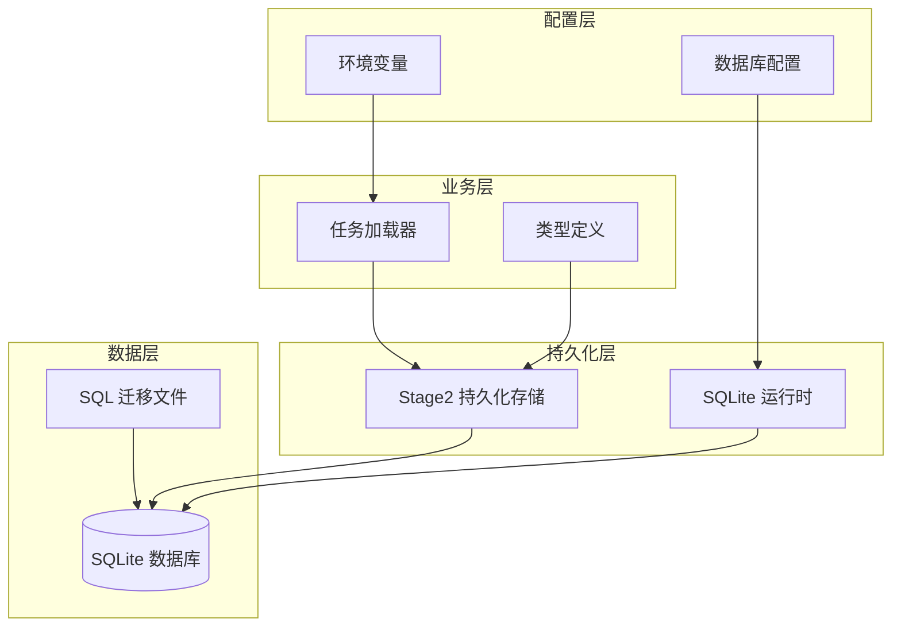
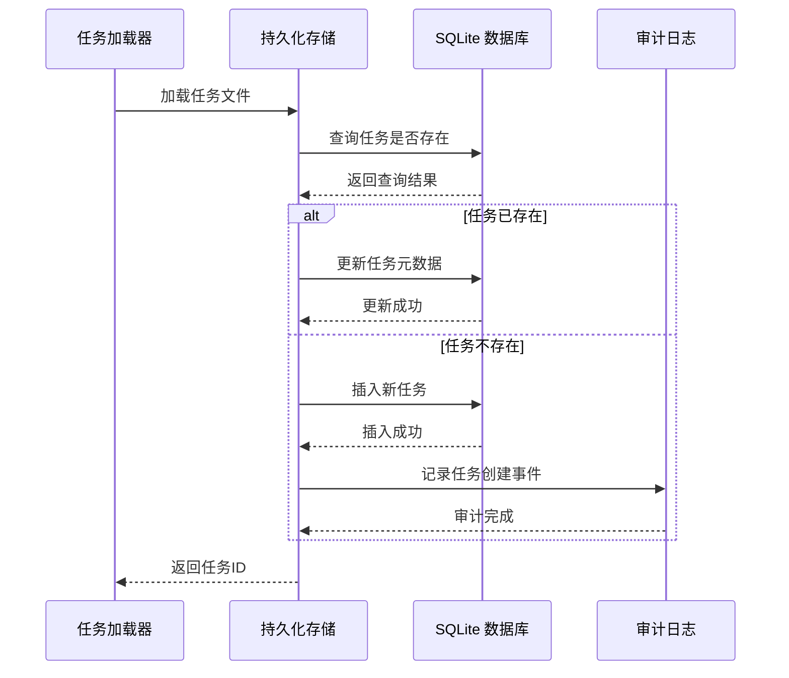
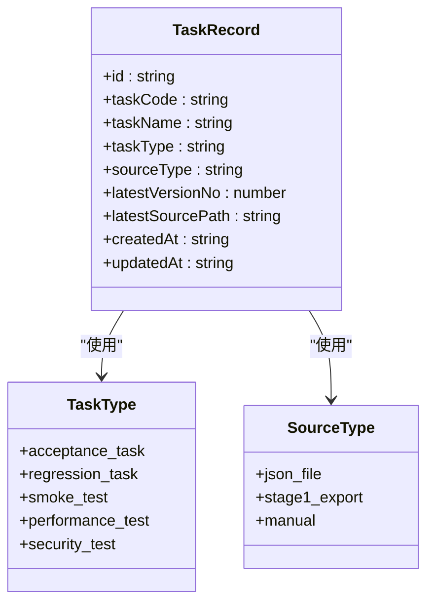
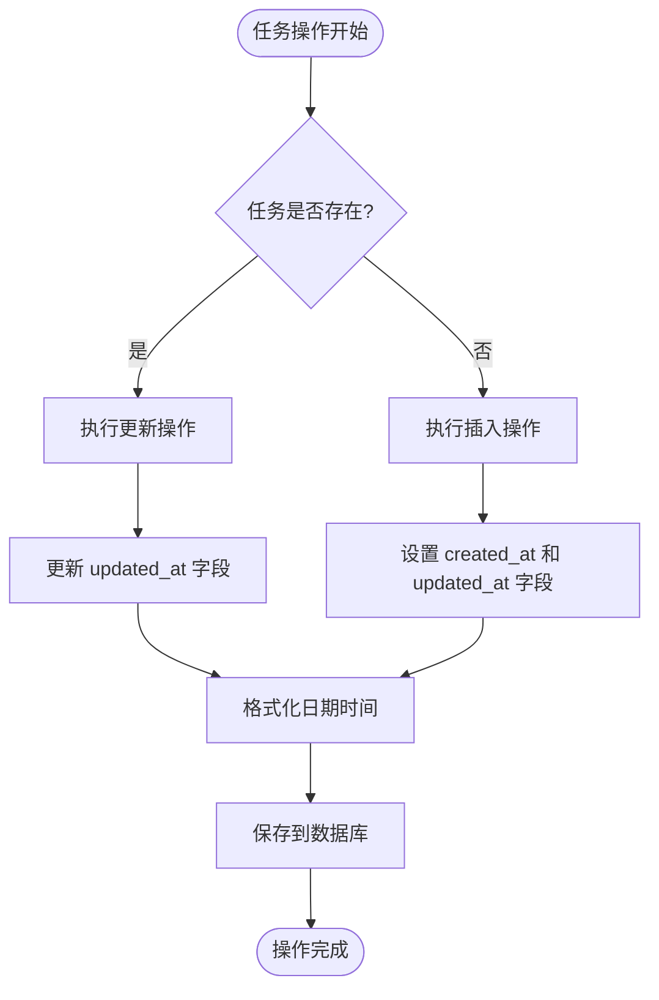
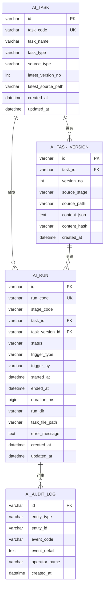
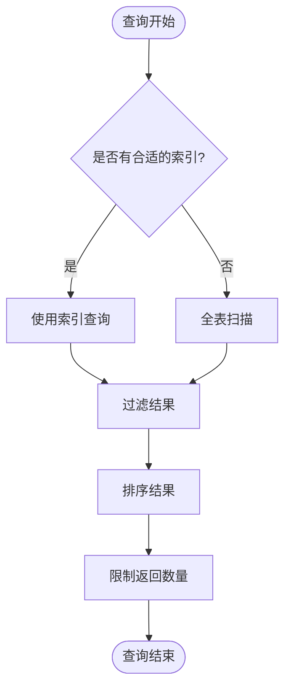

# ai_task 表结构设计

<cite>
**本文档引用的文件**
- [001_global_persistence_init.sql](file://db/migrations/001_global_persistence_init.sql)
- [sqlite-runtime.ts](file://src/persistence/sqlite-runtime.ts)
- [stage2-store.ts](file://src/persistence/stage2-store.ts)
- [types.ts](file://src/persistence/types.ts)
- [task-loader.ts](file://src/stage2/task-loader.ts)
- [acceptance-task.community-create.example.json](file://specs/tasks/acceptance-task.community-create.example.json)
- [acceptance-task.template.json](file://specs/tasks/acceptance-task.template.json)
</cite>

## 目录
1. [简介](#简介)
2. [项目结构](#项目结构)
3. [核心组件](#核心组件)
4. [架构概览](#架构概览)
5. [详细组件分析](#详细组件分析)
6. [依赖关系分析](#依赖关系分析)
7. [性能考虑](#性能考虑)
8. [故障排除指南](#故障排除指南)
9. [结论](#结论)

## 简介

ai_task 表是 HI-TEST 项目中所有测试任务的元数据管理中心，负责存储和管理测试任务的基础信息。该表采用 64 位字符串作为主键标识符，确保了全局唯一性和分布式环境下的稳定性。表结构设计遵循数据库规范化原则，通过唯一约束确保任务代码的唯一性，为整个测试执行系统提供了可靠的任务元数据管理基础。

## 项目结构

HI-TEST 项目采用模块化架构设计，ai_task 表作为核心数据结构存在于迁移文件中，并通过持久化层与业务逻辑紧密集成：

**图表来源**
- [001_global_persistence_init.sql:1-128](file://db/migrations/001_global_persistence_init.sql#L1-L128)
- [sqlite-runtime.ts:73-84](file://src/persistence/sqlite-runtime.ts#L73-L84)

**章节来源**
- [001_global_persistence_init.sql:1-128](file://db/migrations/001_global_persistence_init.sql#L1-L128)
- [sqlite-runtime.ts:1-116](file://src/persistence/sqlite-runtime.ts#L1-L116)

## 核心组件

### ai_task 表结构定义

ai_task 表是整个测试系统的元数据核心，包含以下关键字段：

| 字段名 | 数据类型 | 约束条件 | 描述 |
|--------|----------|----------|------|
| id | VARCHAR(64) | 主键 | 64位字符串标识符，全局唯一 |
| task_code | VARCHAR(128) | 唯一约束 | 任务代码，确保任务唯一性 |
| task_name | VARCHAR(255) | 非空 | 任务名称，人类可读标识 |
| task_type | VARCHAR(64) | 非空 | 任务类型分类，如 acceptance_task |
| source_type | VARCHAR(64) | 非空 | 源类型，如 json_file |
| latest_version_no | INT | 默认 0 | 最新版本号，初始为 0 |
| latest_source_path | VARCHAR(512) | 可空 | 最新源文件路径 |
| created_at | DATETIME | 非空 | 创建时间戳 |
| updated_at | DATETIME | 非空 | 更新时间戳 |

### 主键策略设计

系统采用 64 位字符串作为主键标识符，这种设计具有以下优势：

- **全局唯一性**：通过前缀 + 时间戳 + 随机字节组合，确保跨环境唯一性
- **可读性**：前缀标识不同实体类型，便于调试和维护
- **分布式友好**：无需中央协调器即可生成唯一 ID
- **性能优化**：字符串长度适中，索引效率高

**章节来源**
- [001_global_persistence_init.sql:1-13](file://db/migrations/001_global_persistence_init.sql#L1-L13)
- [sqlite-runtime.ts:24-26](file://src/persistence/sqlite-runtime.ts#L24-L26)

## 架构概览

ai_task 表在整个系统架构中扮演着核心角色，连接着任务定义、执行管理和审计追踪等多个层面：

**图表来源**
- [stage2-store.ts:135-185](file://src/persistence/stage2-store.ts#L135-L185)
- [task-loader.ts:79-89](file://src/stage2/task-loader.ts#L79-L89)

**章节来源**
- [stage2-store.ts:135-185](file://src/persistence/stage2-store.ts#L135-L185)
- [sqlite-runtime.ts:13-22](file://src/persistence/sqlite-runtime.ts#L13-L22)

## 详细组件分析

### 字段详细定义

#### id 字段
- **类型**：VARCHAR(64)
- **约束**：PRIMARY KEY
- **生成策略**：`createPersistentId('task')`
- **格式**：`task_[时间戳]_[随机字节]`
- **用途**：作为 ai_task 表的主键标识符

#### task_code 字段
- **类型**：VARCHAR(128)
- **约束**：UNIQUE
- **来源**：任务文件中的 taskId 字段
- **用途**：确保任务代码的全局唯一性
- **验证**：通过 `WHERE task_code = ?` 查询

#### task_name 字段
- **类型**：VARCHAR(255)
- **约束**：NOT NULL
- **来源**：任务文件中的 taskName 字段
- **用途**：提供人类可读的任务名称

#### task_type 字段
- **类型**：VARCHAR(64)
- **约束**：NOT NULL
- **固定值**：`acceptance_task`
- **用途**：标识任务类型分类

#### source_type 字段
- **类型**：VARCHAR(64)
- **约束**：NOT NULL
- **固定值**：`json_file`
- **用途**：标识任务来源类型

#### latest_version_no 字段
- **类型**：INT
- **约束**：DEFAULT 0
- **用途**：跟踪任务的最新版本号
- **初始值**：0 表示尚未创建任何版本

#### latest_source_path 字段
- **类型**：VARCHAR(512)
- **约束**：NULL
- **用途**：存储最新源文件的相对路径
- **转换**：通过 `toRelativeProjectPath()` 转换为相对路径

#### 时间戳字段
- **created_at**：DATETIME NOT NULL
- **updated_at**：DATETIME NOT NULL
- **格式**：`YYYY-MM-DD HH:MM:SS`
- **生成**：通过 `formatDbDate()` 函数生成

### 任务类型分类

系统支持多种任务类型，通过 `task_type` 字段进行区分：

**图表来源**
- [types.ts:34-44](file://src/persistence/types.ts#L34-L44)
- [types.ts:9](file://src/persistence/types.ts#L9)

**章节来源**
- [types.ts:9](file://src/persistence/types.ts#L9)
- [stage2-store.ts:176](file://src/persistence/stage2-store.ts#L176)

### 源类型定义

系统支持三种任务源类型：

1. **json_file**：来自 JSON 文件的任务定义
2. **stage1_export**：从第一阶段导出的任务
3. **manual**：手动创建的任务

这些源类型通过 `source_type` 字段进行标识，影响任务的加载和处理方式。

### 时间戳更新机制

系统采用自动时间戳更新机制：

**图表来源**
- [stage2-store.ts:142-155](file://src/persistence/stage2-store.ts#L142-L155)
- [sqlite-runtime.ts:13-22](file://src/persistence/sqlite-runtime.ts#L13-L22)

**章节来源**
- [stage2-store.ts:142-155](file://src/persistence/stage2-store.ts#L142-L155)
- [sqlite-runtime.ts:13-22](file://src/persistence/sqlite-runtime.ts#L13-L22)

## 依赖关系分析

### 数据库依赖关系

**图表来源**
- [001_global_persistence_init.sql:15-57](file://db/migrations/001_global_persistence_init.sql#L15-L57)

### 外部依赖关系

系统依赖于以下外部组件：

- **SQLite 数据库**：作为本地持久化存储
- **Node.js Crypto 模块**：用于内容哈希计算
- **Node.js FS 模块**：用于文件系统操作
- **dotenv 库**：用于环境变量管理

**章节来源**
- [001_global_persistence_init.sql:15-57](file://db/migrations/001_global_persistence_init.sql#L15-L57)
- [sqlite-runtime.ts:1-116](file://src/persistence/sqlite-runtime.ts#L1-116)

## 性能考虑

### 索引策略

系统为 ai_task 表建立了以下索引以优化查询性能：

- **主键索引**：自动为 id 字段创建
- **唯一索引**：为 task_code 字段创建唯一索引
- **名称索引**：为 task_name 字段创建普通索引

### 查询优化

### 存储优化

- **VARCHAR 长度优化**：根据实际需求合理设置字段长度
- **NULL 值处理**：合理使用 NULL 值减少存储空间
- **索引维护**：定期分析和优化数据库索引

## 故障排除指南

### 常见问题及解决方案

#### 任务代码冲突
**问题**：插入任务时出现唯一约束冲突
**原因**：task_code 已存在
**解决方案**：修改任务代码或删除现有任务

#### ID 生成冲突
**问题**：ID 生成重复
**原因**：时间戳相同且随机字节冲突
**解决方案**：检查系统时间和随机数生成器

#### 路径解析问题
**问题**：文件路径无法正确解析
**解决方案**：使用 `toRelativeProjectPath()` 函数转换为相对路径

### 调试技巧

1. **启用详细日志**：查看持久化存储的详细操作日志
2. **检查数据库状态**：使用 SQLite 命令行工具检查表结构
3. **验证数据完整性**：定期检查外键约束和唯一约束

**章节来源**
- [stage2-store.ts:125-133](file://src/persistence/stage2-store.ts#L125-L133)
- [sqlite-runtime.ts:32-41](file://src/persistence/sqlite-runtime.ts#L32-L41)

## 结论

ai_task 表作为 HI-TEST 项目的核心数据结构，通过精心设计的字段定义、主键策略和约束机制，为整个测试执行系统提供了稳定可靠的元数据管理基础。其采用的 64 位字符串主键策略确保了全局唯一性和分布式环境下的稳定性，而唯一约束则保证了任务代码的唯一性。

该表结构设计充分考虑了性能优化、可扩展性和维护性，在实际应用中能够有效支撑大规模测试任务的管理需求。通过与其他表的关联关系，ai_task 表形成了完整的测试数据管理体系，为任务执行、结果追踪和审计分析提供了坚实的数据基础。