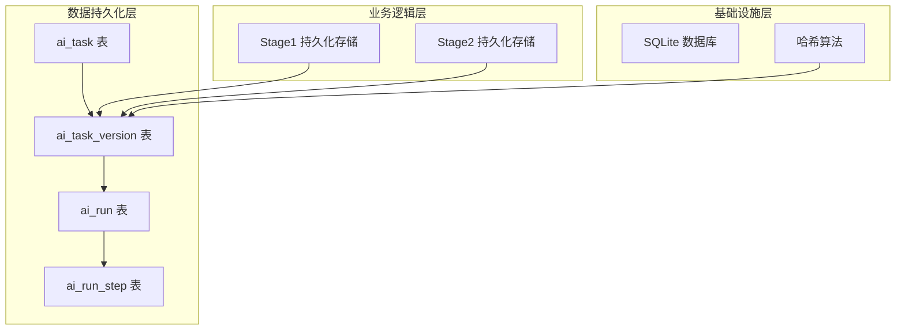
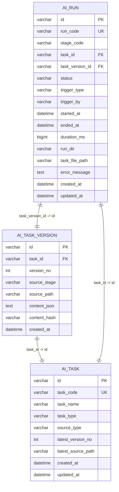
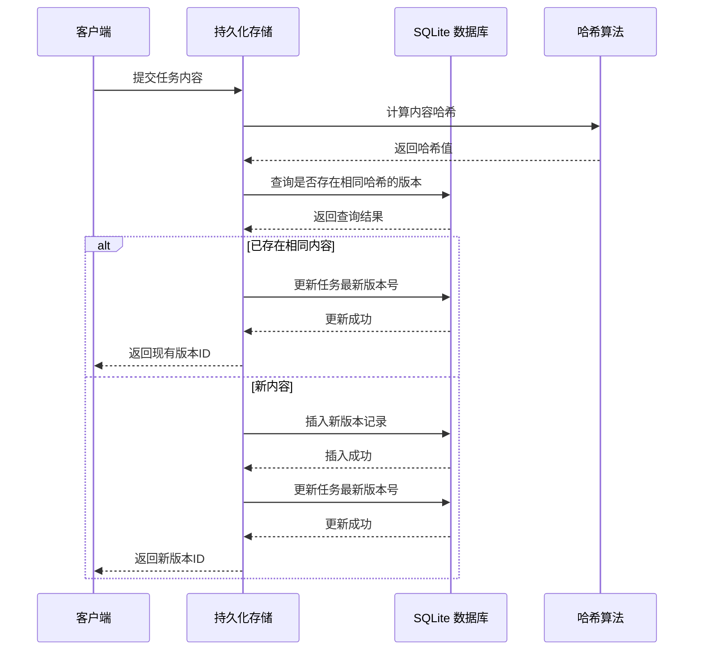
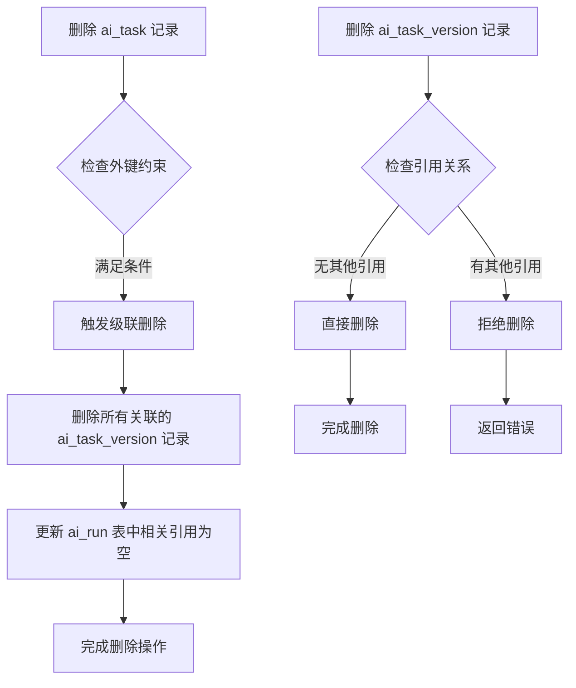
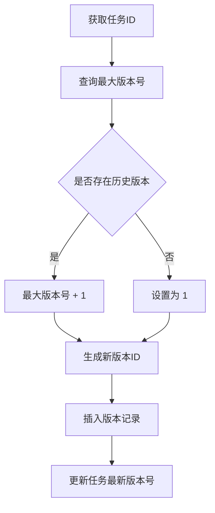
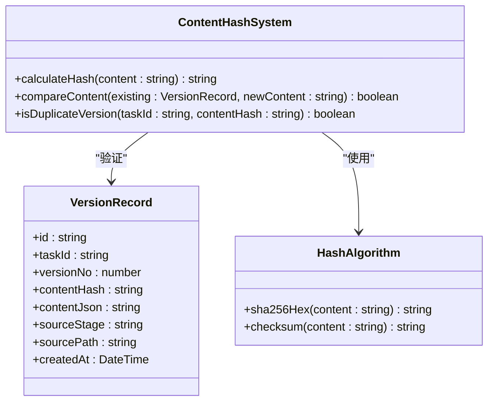
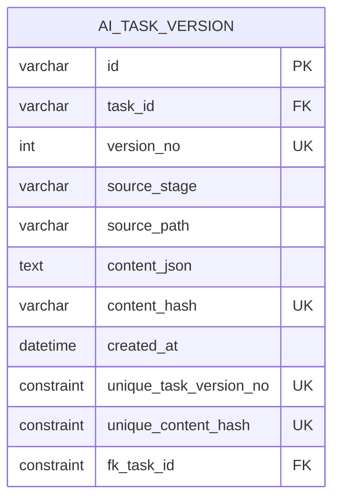
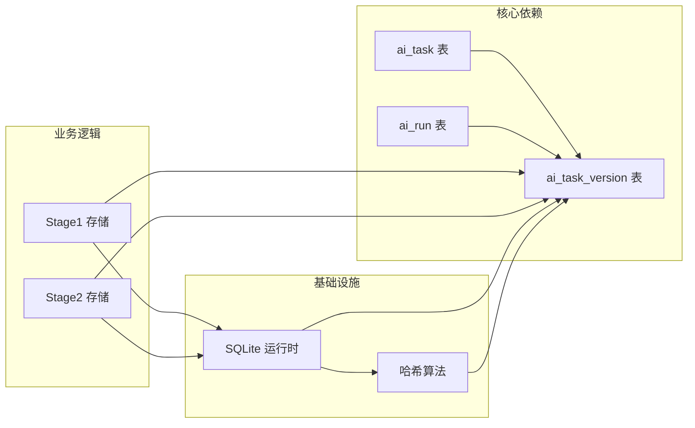

# ai_task_version 表结构设计

<cite>
**本文引用的文件列表**
- [001_global_persistence_init.sql](file://db/migrations/001_global_persistence_init.sql)
- [stage2-store.ts](file://src/persistence/stage2-store.ts)
- [stage1-store.ts](file://src/persistence/stage1-store.ts)
- [sqlite-runtime.ts](file://src/persistence/sqlite-runtime.ts)
- [types.ts](file://src/persistence/types.ts)
</cite>

## 目录
1. [简介](#简介)
2. [项目结构](#项目结构)
3. [核心组件](#核心组件)
4. [架构概览](#架构概览)
5. [详细组件分析](#详细组件分析)
6. [依赖关系分析](#依赖关系分析)
7. [性能考虑](#性能考虑)
8. [故障排除指南](#故障排除指南)
9. [结论](#结论)

## 简介

ai_task_version 表是任务版本管理系统的核心数据结构，负责存储任务的完整内容、版本号管理、内容哈希验证以及版本历史追踪。该表通过外键关联到 ai_task 表，实现了完整的任务版本生命周期管理，支持任务演进过程中的版本控制和回滚操作。

## 项目结构

本项目采用分层架构设计，ai_task_version 表位于数据持久化层，与任务执行层和数据访问层协同工作：

**图表来源**
- [001_global_persistence_init.sql:15-30](file://db/migrations/001_global_persistence_init.sql#L15-L30)
- [stage2-store.ts:74-123](file://src/persistence/stage2-store.ts#L74-L123)
- [stage1-store.ts:199-273](file://src/persistence/stage1-store.ts#L199-L273)

**章节来源**
- [001_global_persistence_init.sql:1-128](file://db/migrations/001_global_persistence_init.sql#L1-L128)
- [stage2-store.ts:1-200](file://src/persistence/stage2-store.ts#L1-L200)

## 核心组件

### ai_task_version 表结构

ai_task_version 表包含以下关键字段：

| 字段名 | 类型 | 约束 | 描述 |
|--------|------|------|------|
| id | VARCHAR(64) | 主键 | 版本记录唯一标识符 |
| task_id | VARCHAR(64) | 外键引用 ai_task(id) | 关联的任务标识符 |
| version_no | INT | 唯一约束(task_id, version_no) | 版本号，按任务递增 |
| source_stage | VARCHAR(32) | 非空 | 版本来源阶段标识 |
| source_path | VARCHAR(512) | 可空 | 版本来源文件路径 |
| content_json | TEXT | 非空 | 完整的任务内容JSON |
| content_hash | VARCHAR(64) | 唯一约束(task_id, content_hash) | 内容哈希值 |
| created_at | DATETIME | 非空 | 创建时间戳 |

### 外键关联策略

表间关系通过外键约束实现：

**图表来源**
- [001_global_persistence_init.sql:15-57](file://db/migrations/001_global_persistence_init.sql#L15-L57)

**章节来源**
- [001_global_persistence_init.sql:15-30](file://db/migrations/001_global_persistence_init.sql#L15-L30)

## 架构概览

### 版本管理架构

ai_task_version 表采用基于哈希的内容去重机制，确保相同内容不会产生重复版本：

**图表来源**
- [stage2-store.ts:187-261](file://src/persistence/stage2-store.ts#L187-L261)
- [stage1-store.ts:199-273](file://src/persistence/stage1-store.ts#L199-L273)

### 级联删除策略

当删除任务时，相关的版本记录会自动删除，确保数据一致性：

**图表来源**
- [001_global_persistence_init.sql:27-29](file://db/migrations/001_global_persistence_init.sql#L27-L29)

**章节来源**
- [001_global_persistence_init.sql:27-29](file://db/migrations/001_global_persistence_init.sql#L27-L29)

## 详细组件分析

### 版本号管理机制

版本号采用按任务递增的策略，确保每个任务的版本序列独立管理：

**图表来源**
- [stage2-store.ts:213-253](file://src/persistence/stage2-store.ts#L213-L253)
- [stage1-store.ts:225-265](file://src/persistence/stage1-store.ts#L225-L265)

### 内容哈希验证系统

系统使用 SHA-256 算法对任务内容进行哈希计算，实现内容去重和变更检测：

**图表来源**
- [sqlite-runtime.ts:28-30](file://src/persistence/sqlite-runtime.ts#L28-L30)
- [stage2-store.ts:187-211](file://src/persistence/stage2-store.ts#L187-L211)

### 版本来源追踪机制

source_stage 和 source_path 字段提供了完整的版本来源信息：

| 字段 | 类型 | 用途 | 示例值 |
|------|------|------|--------|
| source_stage | VARCHAR(32) | 版本来源阶段 | 'stage1', 'stage2' |
| source_path | VARCHAR(512) | 文件系统路径 | '/projects/tasks/task1.json' |

**章节来源**
- [stage2-store.ts:237-238](file://src/persistence/stage2-store.ts#L237-L238)
- [stage1-store.ts:249-250](file://src/persistence/stage1-store.ts#L249-L250)

### 数据完整性约束

表结构包含多重约束确保数据完整性：

**图表来源**
- [001_global_persistence_init.sql:25-29](file://db/migrations/001_global_persistence_init.sql#L25-L29)

**章节来源**
- [001_global_persistence_init.sql:25-29](file://db/migrations/001_global_persistence_init.sql#L25-L29)

## 依赖关系分析

### 组件耦合度

ai_task_version 表与其他组件的依赖关系：

**图表来源**
- [stage2-store.ts:101-123](file://src/persistence/stage2-store.ts#L101-L123)
- [stage1-store.ts:199-273](file://src/persistence/stage1-store.ts#L199-L273)

### 外键约束分析

外键约束确保了数据的一致性和完整性：

| 外键约束 | 目标表 | 删除策略 | 作用 |
|----------|--------|----------|------|
| fk_ai_task_version_task_id | ai_task | CASCADE | 级联删除任务时同步删除版本 |
| fk_ai_run_task_id | ai_task | SET NULL | 删除任务时保留运行记录但置空引用 |
| fk_ai_run_task_version_id | ai_task_version | SET NULL | 删除版本时保留运行记录但置空引用 |

**章节来源**
- [001_global_persistence_init.sql:27-29](file://db/migrations/001_global_persistence_init.sql#L27-L29)
- [001_global_persistence_init.sql:51-56](file://db/migrations/001_global_persistence_init.sql#L51-L56)

## 性能考虑

### 索引优化策略

系统通过以下索引提升查询性能：

1. **主键索引**: 对 id 字段建立主键索引
2. **唯一索引**: 对 (task_id, version_no) 和 (task_id, content_hash) 建立唯一索引
3. **外键索引**: 自动为外键字段建立索引

### 哈希算法性能

SHA-256 算法选择考虑：
- **安全性**: 提供强哈希保证，减少碰撞概率
- **性能**: 在现代硬件上计算速度较快
- **兼容性**: 标准算法，易于维护和升级

### 内存使用优化

- content_json 字段使用 TEXT 类型，支持大文本存储
- content_hash 字段固定长度，便于索引和比较
- 采用延迟加载策略，避免不必要的数据读取

## 故障排除指南

### 常见问题及解决方案

#### 版本冲突问题
**症状**: 插入版本时出现唯一约束冲突
**原因**: 相同内容的版本已存在
**解决**: 系统自动返回现有版本ID，无需手动处理

#### 外键约束错误
**症状**: 删除任务时报外键约束错误
**原因**: 存在关联的版本记录
**解决**: 使用级联删除策略自动清理

#### 哈希计算异常
**症状**: 内容哈希计算失败或结果不一致
**原因**: 编码格式或内容差异
**解决**: 检查输入内容编码和标准化处理

**章节来源**
- [stage2-store.ts:187-211](file://src/persistence/stage2-store.ts#L187-L211)
- [stage1-store.ts:199-223](file://src/persistence/stage1-store.ts#L199-L223)

## 结论

ai_task_version 表通过精心设计的表结构和约束机制，实现了高效的任务版本管理。其核心优势包括：

1. **内容去重**: 基于哈希的重复检测机制
2. **版本追踪**: 完整的版本历史记录
3. **数据一致性**: 强外键约束确保引用完整性
4. **演进支持**: 支持任务的渐进式发展和回滚
5. **性能优化**: 合理的索引策略和数据类型选择

该设计为任务执行系统的稳定运行提供了坚实的数据基础，支持复杂的版本管理和审计需求。