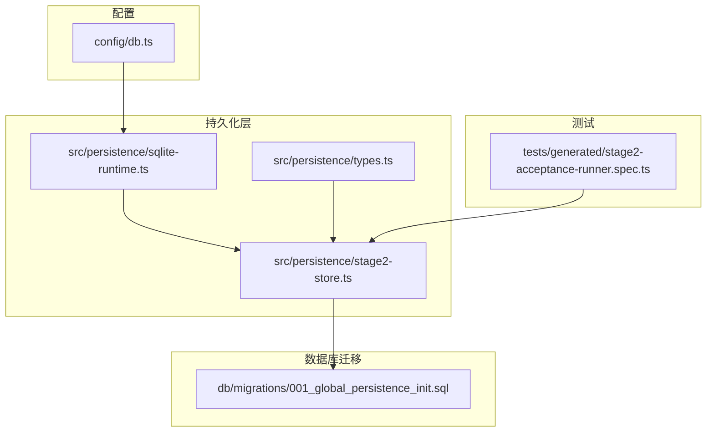
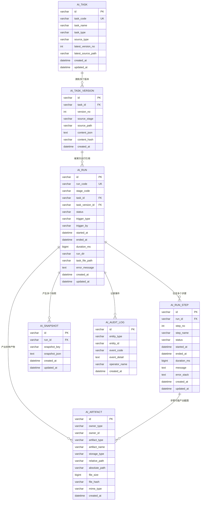
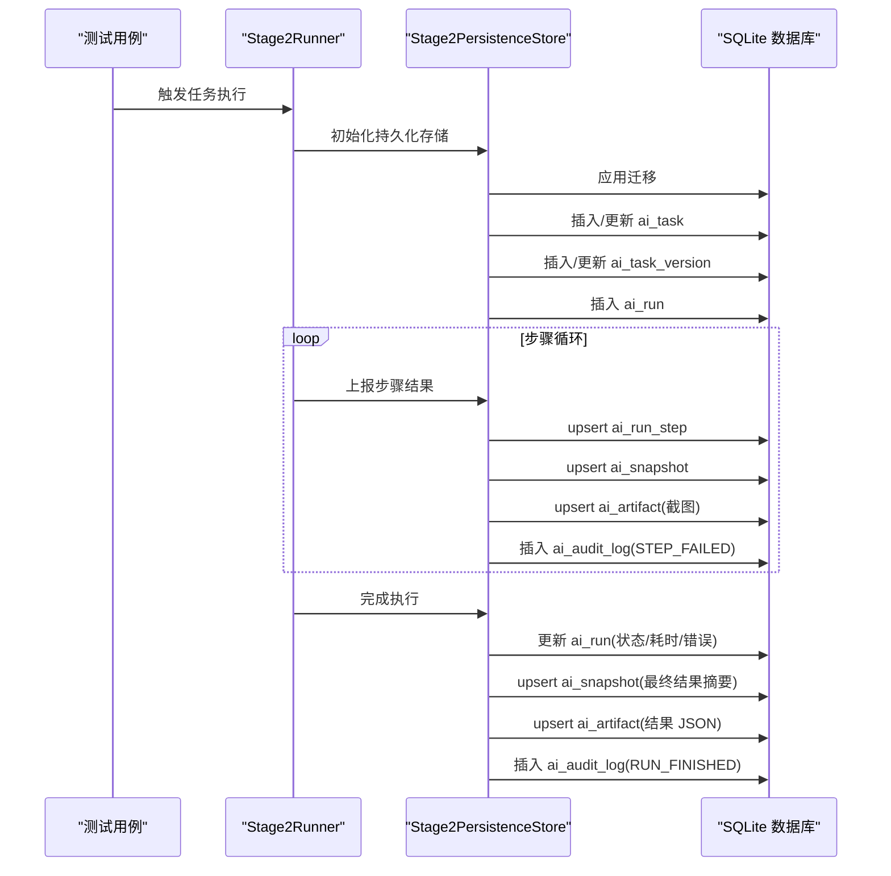

# 核心表结构设计

<cite>
**本文引用的文件**
- [001_global_persistence_init.sql](file://db/migrations/001_global_persistence_init.sql)
- [types.ts](file://src/persistence/types.ts)
- [stage2-store.ts](file://src/persistence/stage2-store.ts)
- [sqlite-runtime.ts](file://src/persistence/sqlite-runtime.ts)
- [db.ts](file://config/db.ts)
- [stage2-acceptance-runner.spec.ts](file://tests/generated/stage2-acceptance-runner.spec.ts)
</cite>

## 目录
1. [简介](#简介)
2. [项目结构](#项目结构)
3. [核心组件](#核心组件)
4. [架构总览](#架构总览)
5. [详细组件分析](#详细组件分析)
6. [依赖分析](#依赖分析)
7. [性能考虑](#性能考虑)
8. [故障排除指南](#故障排除指南)
9. [结论](#结论)

## 简介
本文件系统性梳理并解释核心持久化表结构设计，覆盖 ai_task、ai_task_version、ai_run、ai_run_step、ai_snapshot、ai_artifact、ai_audit_log 等表的字段定义、数据类型、约束条件、主键策略、外键关系与参照完整性约束，并结合实际代码使用场景说明各表的设计目的与业务用途。同时给出字段命名规范与数据类型选择的技术决策依据，以及索引策略与性能考量。

## 项目结构
数据库迁移脚本集中于 db/migrations 目录，核心表结构定义位于首个迁移文件中；持久化层通过 SQLite 运行时与存储服务实现，类型定义位于 src/persistence 下，配置位于 config/db.ts 中。

图表来源
- [001_global_persistence_init.sql:1-128](file://db/migrations/001_global_persistence_init.sql#L1-L128)
- [sqlite-runtime.ts:73-84](file://src/persistence/sqlite-runtime.ts#L73-L84)
- [stage2-store.ts:101-123](file://src/persistence/stage2-store.ts#L101-L123)
- [types.ts:1-125](file://src/persistence/types.ts#L1-L125)
- [db.ts:15-26](file://config/db.ts#L15-L26)
- [stage2-acceptance-runner.spec.ts:1-39](file://tests/generated/stage2-acceptance-runner.spec.ts#L1-L39)

章节来源
- [001_global_persistence_init.sql:1-128](file://db/migrations/001_global_persistence_init.sql#L1-L128)
- [sqlite-runtime.ts:73-84](file://src/persistence/sqlite-runtime.ts#L73-L84)
- [stage2-store.ts:101-123](file://src/persistence/stage2-store.ts#L101-L123)
- [types.ts:1-125](file://src/persistence/types.ts#L1-L125)
- [db.ts:15-26](file://config/db.ts#L15-L26)
- [stage2-acceptance-runner.spec.ts:1-39](file://tests/generated/stage2-acceptance-runner.spec.ts#L1-L39)

## 核心组件
- ai_task：任务元数据与最新版本号管理
- ai_task_version：任务内容版本与哈希索引
- ai_run：一次执行会话（运行记录）
- ai_run_step：运行内的步骤明细
- ai_snapshot：运行过程中的快照数据
- ai_artifact：产物与附件（截图、报告等）
- ai_audit_log：审计事件日志

章节来源
- [001_global_persistence_init.sql:1-128](file://db/migrations/001_global_persistence_init.sql#L1-L128)
- [stage2-store.ts:135-261](file://src/persistence/stage2-store.ts#L135-L261)

## 架构总览
下图展示核心表之间的外键关系与参照完整性约束，包括级联删除与设置为空策略。

图表来源
- [001_global_persistence_init.sql:1-128](file://db/migrations/001_global_persistence_init.sql#L1-L128)

## 详细组件分析

### ai_task（任务元数据）
- 设计目的：保存任务的元信息与最新版本号，便于快速检索与版本追踪。
- 主键策略：VARCHAR(64)，自定义前缀+时间戳+随机串，保证全局唯一且有序性良好。
- 约束与索引：
  - 唯一约束：task_code
  - 索引：task_name
- 关键字段说明：
  - id：主键
  - task_code：业务标识，唯一
  - task_name：显示名称
  - task_type：任务类型
  - source_type：来源类型（如 json_file、stage1_export、manual）
  - latest_version_no：最新版本号
  - latest_source_path：最新来源路径
  - created_at/updated_at：时间戳
- 外键关系：无外键，作为根实体存在。

章节来源
- [001_global_persistence_init.sql:1-13](file://db/migrations/001_global_persistence_init.sql#L1-L13)
- [stage2-store.ts:135-185](file://src/persistence/stage2-store.ts#L135-L185)

### ai_task_version（任务版本）
- 设计目的：保存任务内容的版本化快照，基于内容哈希去重，支持版本回溯与比较。
- 主键策略：VARCHAR(64)，同上
- 约束与索引：
  - 唯一约束：(task_id, version_no)、(task_id, content_hash)
  - 外键：task_id → ai_task(id)，ON DELETE CASCADE
- 关键字段说明：
  - id：主键
  - task_id：所属任务
  - version_no：版本号
  - source_stage：来源阶段（如 stage2）
  - source_path：源文件路径
  - content_json：任务内容（敏感信息已脱敏存储）
  - content_hash：content_json 的 SHA-256 哈希
  - created_at：创建时间
- 业务用途：与 ai_task 协作维护“最新版本号”与“内容去重”。

章节来源
- [001_global_persistence_init.sql:15-30](file://db/migrations/001_global_persistence_init.sql#L15-L30)
- [stage2-store.ts:187-261](file://src/persistence/stage2-store.ts#L187-L261)

### ai_run（运行记录）
- 设计目的：记录一次完整的执行会话，包含触发信息、状态、耗时、错误信息等。
- 主键策略：VARCHAR(64)
- 约束与索引：
  - 唯一约束：run_code
  - 外键：
    - task_id → ai_task(id)，ON DELETE SET NULL
    - task_version_id → ai_task_version(id)，ON DELETE SET NULL
  - 索引：task_id+stage_code+started_at、stage_code+status+started_at
- 关键字段说明：
  - id：主键
  - run_code：运行编号（唯一）
  - stage_code：阶段代码（如 stage2）
  - task_id、task_version_id：可空，表示运行关联的任务与版本
  - status：运行状态（draft/running/passed/failed/skipped/cancelled）
  - trigger_type、trigger_by：触发来源
  - started_at/ended_at/duration_ms：时间线与耗时
  - run_dir、task_file_path：运行目录与任务文件路径
  - error_message：错误信息
  - created_at/updated_at：时间戳
- 设计要点：当父记录被删除时，运行记录保留但将关联字段置空，确保历史可追溯。

章节来源
- [001_global_persistence_init.sql:32-57](file://db/migrations/001_global_persistence_init.sql#L32-L57)
- [stage2-store.ts:263-303](file://src/persistence/stage2-store.ts#L263-L303)

### ai_run_step（运行步骤）
- 设计目的：记录运行内每个步骤的执行详情，支持分步诊断与可视化。
- 主键策略：VARCHAR(64)
- 约束与索引：
  - 唯一约束：(run_id, step_no)
  - 外键：run_id → ai_run(id)，ON DELETE CASCADE
  - 索引：run_id+status
- 关键字段说明：
  - id：主键
  - run_id：所属运行
  - step_no：步骤序号
  - step_name：步骤名称
  - status：步骤状态
  - started_at/ended_at/duration_ms：时间线与耗时
  - message/error_stack：消息与错误栈
  - created_at/updated_at：时间戳
- 设计要点：步骤随运行删除而删除，避免孤儿数据。

章节来源
- [001_global_persistence_init.sql:59-77](file://db/migrations/001_global_persistence_init.sql#L59-L77)
- [stage2-store.ts:495-590](file://src/persistence/stage2-store.ts#L495-L590)

### ai_snapshot（运行快照）
- 设计目的：保存运行过程中的关键状态快照（如解析值、查询快照、进度状态、最终结果摘要）。
- 主键策略：VARCHAR(64)
- 约束与索引：
  - 唯一约束：(run_id, snapshot_key)
  - 外键：run_id → ai_run(id)，ON DELETE CASCADE
- 关键字段说明：
  - id：主键
  - run_id：所属运行
  - snapshot_key：快照键（唯一标识一次快照）
  - snapshot_json：快照内容（TEXT）
  - created_at/updated_at：时间戳
- 设计要点：快照随运行删除而删除，避免冗余。

章节来源
- [001_global_persistence_init.sql:79-91](file://db/migrations/001_global_persistence_init.sql#L79-L91)
- [stage2-store.ts:358-395](file://src/persistence/stage2-store.ts#L358-L395)

### ai_artifact（产物与附件）
- 设计目的：统一管理运行产生的各类产物（任务 JSON、结果 JSON、进度 JSON、截图、报告等）及其存储信息。
- 主键策略：VARCHAR(64)
- 约束与索引：
  - 无显式唯一约束，按业务组合键进行去重（owner_type + owner_id + artifact_type + artifact_name）
  - 索引：owner_type+owner_id、artifact_type+created_at
- 关键字段说明：
  - id：主键
  - owner_type：归属类型（task/task_version/run/run_step）
  - owner_id：归属对象 ID
  - artifact_type：产物类型（task_json/result_json/progress_json/screenshot/playwright_report/midscene_report/other）
  - artifact_name：产物名称
  - storage_type：存储类型（当前固定为 local_file）
  - relative_path/absolute_path：相对/绝对路径
  - file_size：文件大小
  - file_hash：文件哈希
  - mime_type：MIME 类型
  - created_at：创建时间
- 设计要点：通过 owner_type/owner_id 组合实现多态归属，便于按对象维度检索。

章节来源
- [001_global_persistence_init.sql:93-107](file://db/migrations/001_global_persistence_init.sql#L93-L107)
- [stage2-store.ts:397-468](file://src/persistence/stage2-store.ts#L397-L468)

### ai_audit_log（审计日志）
- 设计目的：记录实体层面的关键事件，便于审计与问题追踪。
- 主键策略：VARCHAR(64)
- 约束与索引：
  - 无唯一约束
  - 索引：entity_type+entity_id+created_at
- 关键字段说明：
  - id：主键
  - entity_type：实体类型（如 ai_run、ai_run_step、ai_task、ai_task_version）
  - entity_id：实体 ID
  - event_code：事件编码（如 RUN_STARTED、RUN_FINISHED、STEP_FAILED、TASK_CREATED、TASK_VERSION_CREATED）
  - event_detail：事件详情
  - operator_name：操作者
  - created_at：事件时间
- 设计要点：事件与实体解耦，支持按实体维度检索。

章节来源
- [001_global_persistence_init.sql:109-118](file://db/migrations/001_global_persistence_init.sql#L109-L118)
- [stage2-store.ts:305-331](file://src/persistence/stage2-store.ts#L305-L331)

## 依赖分析
- 数据库驱动与路径：SQLite 本地单文件数据库，路径由配置决定，启用外键约束。
- 迁移机制：通过 schema_migrations 记录已应用迁移，确保幂等性。
- 存储服务：Stage2PersistenceStore 负责创建/更新任务、版本、运行、步骤、快照与产物，并写入审计日志。
- 类型系统：持久化层接口与运行时类型保持一致，确保字段语义清晰。

图表来源
- [stage2-store.ts:101-123](file://src/persistence/stage2-store.ts#L101-L123)
- [stage2-store.ts:263-303](file://src/persistence/stage2-store.ts#L263-L303)
- [stage2-store.ts:495-590](file://src/persistence/stage2-store.ts#L495-L590)
- [stage2-store.ts:592-630](file://src/persistence/stage2-store.ts#L592-L630)
- [sqlite-runtime.ts:86-114](file://src/persistence/sqlite-runtime.ts#L86-L114)

章节来源
- [sqlite-runtime.ts:73-84](file://src/persistence/sqlite-runtime.ts#L73-L84)
- [stage2-store.ts:101-123](file://src/persistence/stage2-store.ts#L101-L123)
- [stage2-store.ts:263-303](file://src/persistence/stage2-store.ts#L263-L303)
- [stage2-store.ts:495-590](file://src/persistence/stage2-store.ts#L495-L590)
- [stage2-store.ts:592-630](file://src/persistence/stage2-store.ts#L592-L630)

## 性能考虑
- 索引策略
  - ai_task：task_name 索引，支持按名称检索
  - ai_run：复合索引 (task_id, stage_code, started_at) 与 (stage_code, status, started_at)，提升筛选与排序效率
  - ai_run_step：(run_id, status) 索引，加速按运行与状态查询
  - ai_artifact：(owner_type, owner_id) 与 (artifact_type, created_at) 索引，支持按归属与类型检索
  - ai_audit_log：(entity_type, entity_id, created_at) 索引，支持按实体维度审计
- 外键与级联策略
  - ai_run 对 ai_task 与 ai_task_version：ON DELETE SET NULL，保留运行记录但解除关联，利于历史审计
  - ai_run_step 与 ai_snapshot：ON DELETE CASCADE，随运行删除，避免孤儿数据
- TEXT 与大字段
  - content_json、snapshot_json、error_message、event_detail 使用 TEXT，满足大文本存储需求
- VARCHAR 长度选择
  - 采用 32~512 的长度范围，兼顾可读性、索引开销与扩展性；路径类字段采用更大上限以适配长路径
- 时间精度
  - 使用 DATETIME 存储时间戳，统一格式化与排序

章节来源
- [001_global_persistence_init.sql:120-126](file://db/migrations/001_global_persistence_init.sql#L120-L126)
- [stage2-store.ts:358-395](file://src/persistence/stage2-store.ts#L358-L395)

## 故障排除指南
- 外键约束失败
  - 现象：插入 ai_run_step 或 ai_snapshot 报外键错误
  - 排查：确认 ai_run.id 是否存在；若 ai_task/ai_task_version 已删除，ai_run 的关联字段会被置空，需检查运行记录是否仍有效
- 迁移未生效
  - 现象：表结构异常或缺失
  - 排查：确认 schema_migrations 是否记录了迁移文件；检查迁移目录与文件名；确保 SQLite 外键已开启
- 路径与相对路径
  - 现象：绝对路径未正确写入
  - 排查：确认 toRelativeProjectPath 返回值；仅当相对路径有效时才写入 relative_path
- 大文本字段
  - 现象：content_json/snapshot_json 过大导致性能问题
  - 建议：按需拆分或压缩；合理使用索引与查询条件

章节来源
- [sqlite-runtime.ts:86-114](file://src/persistence/sqlite-runtime.ts#L86-L114)
- [stage2-store.ts:32-67](file://src/persistence/stage2-store.ts#L32-L67)

## 结论
本设计以 SQLite 为基础，采用 MySQL 兼容子集的表结构，围绕任务-版本-运行-步骤-快照-产物-审计七张核心表构建了完整的执行生命周期数据模型。通过合理的主键策略、唯一约束、外键与索引设计，既保证了数据一致性与可追溯性，又兼顾了查询性能与扩展性。实际运行中，Stage2PersistenceStore 将这些表紧密串联，形成从任务创建、版本管理到运行执行、产物产出与审计记录的闭环。