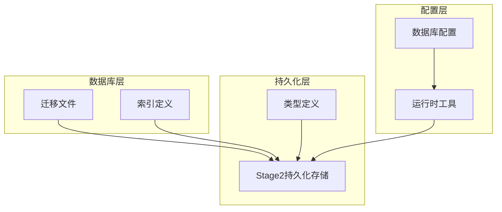
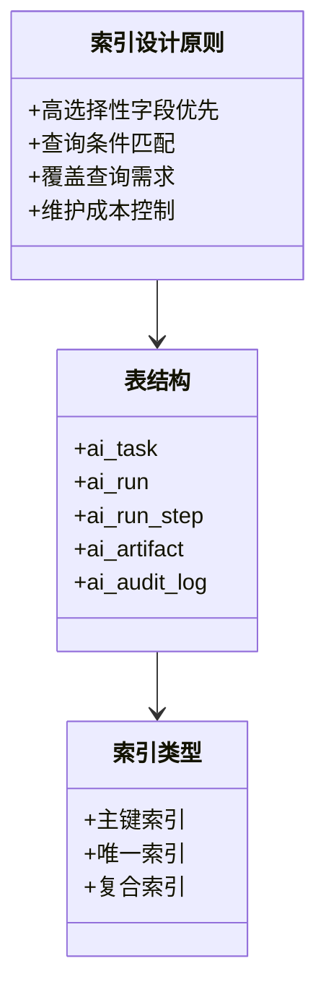
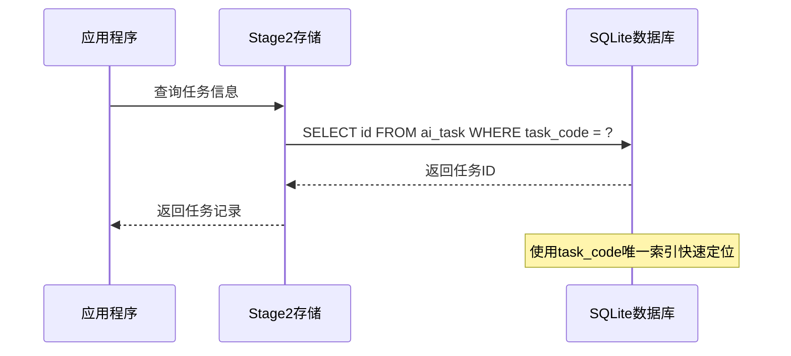
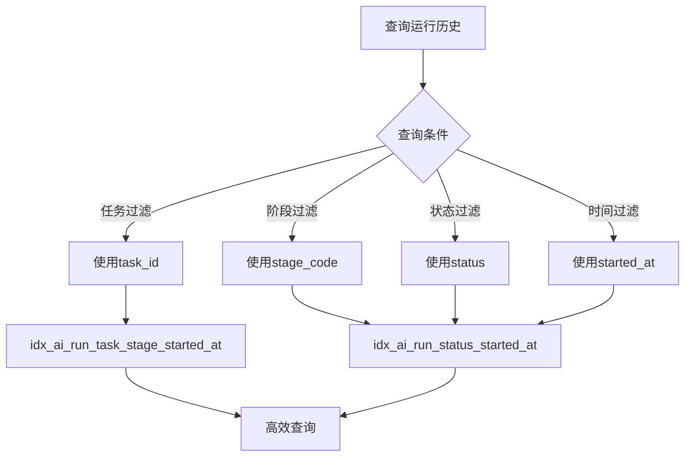
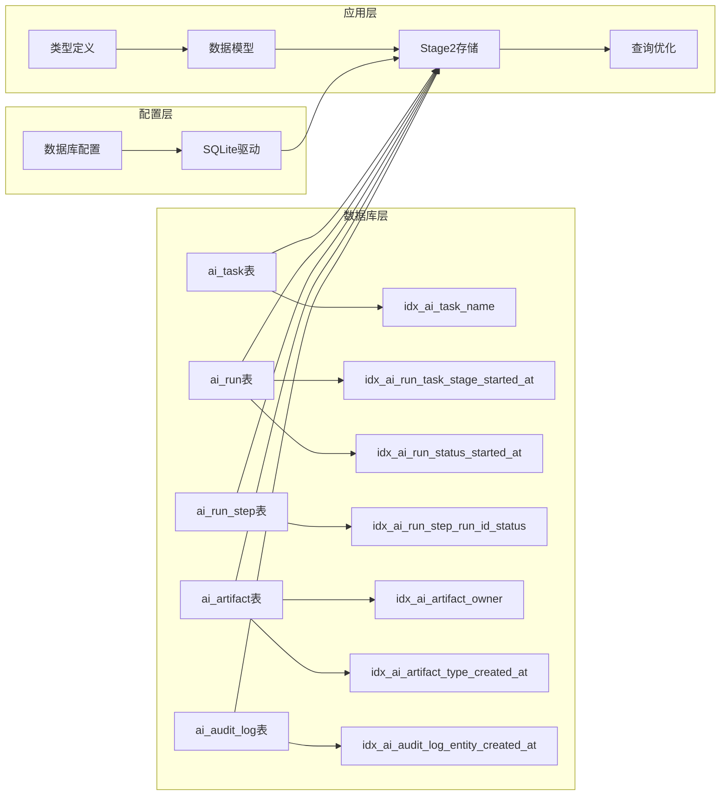
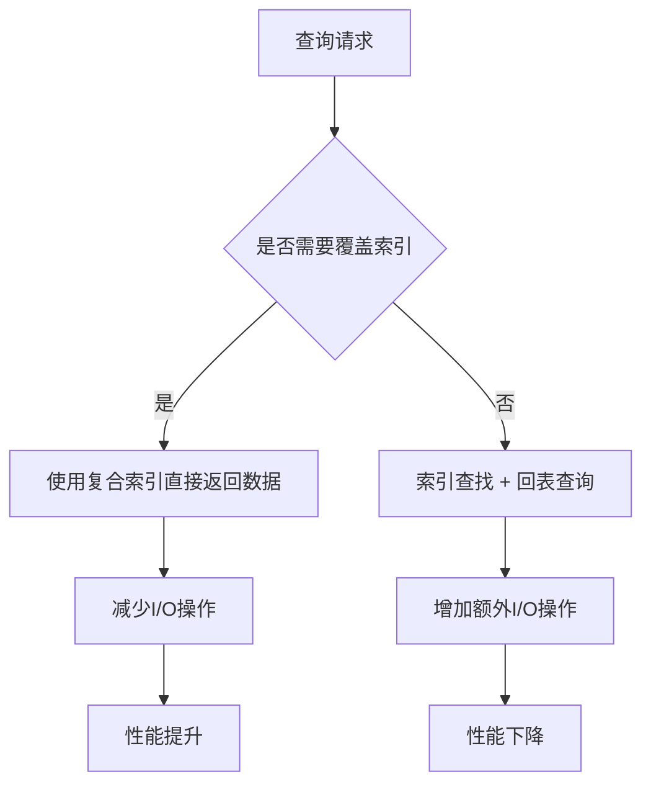
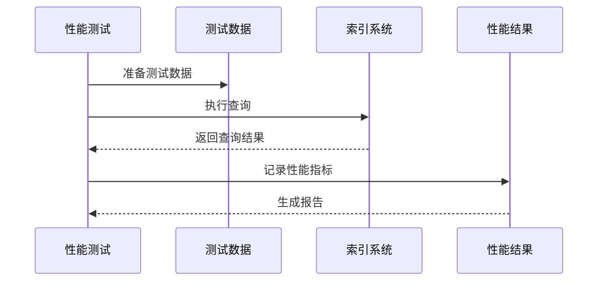

# 索引设计和优化

<cite>
**本文档引用的文件**
- [001_global_persistence_init.sql](file://db/migrations/001_global_persistence_init.sql)
- [stage2-store.ts](file://src/persistence/stage2-store.ts)
- [types.ts](file://src/persistence/types.ts)
- [sqlite-runtime.ts](file://src/persistence/sqlite-runtime.ts)
- [db.ts](file://config/db.ts)
</cite>

## 目录
1. [简介](#简介)
2. [项目结构](#项目结构)
3. [核心组件](#核心组件)
4. [架构概览](#架构概览)
5. [详细组件分析](#详细组件分析)
6. [依赖关系分析](#依赖关系分析)
7. [性能考量](#性能考量)
8. [故障排除指南](#故障排除指南)
9. [结论](#结论)

## 简介
本文件深入分析了数据库中创建的各种索引策略，包括主键索引、唯一索引和复合索引的设计原理。详细说明了每个索引的创建目的和查询优化效果，如 idx_ai_task_name 用于任务名称搜索、idx_ai_run_task_stage_started_at 用于运行历史查询等。解释了索引选择性、覆盖索引和索引维护成本的平衡考虑，并提供了查询性能分析方法和索引使用建议。

## 项目结构
该项目采用分层架构设计，主要包含以下层次：
- 数据库迁移层：负责表结构定义和索引创建
- 持久化存储层：提供数据访问和操作接口
- 配置层：管理数据库连接和路径配置
- 类型定义层：定义数据模型和接口规范



**图表来源**
- [001_global_persistence_init.sql:1-128](file://db/migrations/001_global_persistence_init.sql#L1-L128)
- [stage2-store.ts:1-655](file://src/persistence/stage2-store.ts#L1-L655)

**章节来源**
- [001_global_persistence_init.sql:1-128](file://db/migrations/001_global_persistence_init.sql#L1-L128)
- [stage2-store.ts:1-655](file://src/persistence/stage2-store.ts#L1-L655)

## 核心组件
本项目的核心数据库索引设计围绕以下几个关键表展开：

### 主键索引
所有表都定义了主键约束，确保数据的唯一性和完整性：
- ai_task: 主键为 id 字段
- ai_task_version: 主键为 id 字段  
- ai_run: 主键为 id 字段
- ai_run_step: 主键为 id 字段
- ai_snapshot: 主键为 id 字段
- ai_artifact: 主键为 id 字段
- ai_audit_log: 主键为 id 字段

### 唯一索引
多个表定义了唯一约束，防止重复数据：
- ai_task: 唯一约束于 task_code 字段
- ai_task_version: 唯一约束于 (task_id, version_no) 和 (task_id, content_hash)
- ai_run: 唯一约束于 run_code 字段
- ai_run_step: 唯一约束于 (run_id, step_no)
- ai_snapshot: 唯一约束于 (run_id, snapshot_key)

### 复合索引
项目创建了多个复合索引来优化特定查询场景：

**章节来源**
- [001_global_persistence_init.sql:1-128](file://db/migrations/001_global_persistence_init.sql#L1-L128)

## 架构概览
数据库索引设计遵循以下原则：



**图表来源**
- [001_global_persistence_init.sql:120-126](file://db/migrations/001_global_persistence_init.sql#L120-L126)

## 详细组件分析

### ai_task 表索引分析
ai_task 表是任务管理的核心表，主要包含任务基本信息。

#### 设计要点
- 主键索引：确保每个任务的唯一标识
- 唯一索引：保证任务代码(task_code)的唯一性
- 单列索引：idx_ai_task_name 用于任务名称搜索

#### 查询优化效果


**图表来源**
- [stage2-store.ts:135-185](file://src/persistence/stage2-store.ts#L135-L185)
- [001_global_persistence_init.sql:120](file://db/migrations/001_global_persistence_init.sql#L120)

**章节来源**
- [stage2-store.ts:135-185](file://src/persistence/stage2-store.ts#L135-L185)
- [001_global_persistence_init.sql:1-13](file://db/migrations/001_global_persistence_init.sql#L1-L13)

### ai_run 表复合索引分析
ai_run 表记录任务运行历史，包含大量时间序列数据。

#### 关键索引设计
1. **idx_ai_run_task_stage_started_at**: (task_id, stage_code, started_at)
   - 用途：查询特定任务在特定阶段的运行历史
   - 优化：支持任务过滤、阶段过滤和时间排序

2. **idx_ai_run_status_started_at**: (stage_code, status, started_at)
   - 用途：查询特定阶段的运行状态统计
   - 优化：支持状态聚合和时间范围查询

#### 查询模式分析


**图表来源**
- [001_global_persistence_init.sql:121-122](file://db/migrations/001_global_persistence_init.sql#L121-L122)

**章节来源**
- [001_global_persistence_init.sql:32-57](file://db/migrations/001_global_persistence_init.sql#L32-L57)
- [stage2-store.ts:263-356](file://src/persistence/stage2-store.ts#L263-L356)

### ai_run_step 表索引分析
ai_run_step 表记录任务执行步骤详情。

#### 设计特点
- **idx_ai_run_step_run_id_status**: (run_id, status)
- 用途：快速查找特定运行实例的所有步骤及其状态
- 优化：支持步骤状态查询和运行实例关联查询

**章节来源**
- [001_global_persistence_init.sql:59-77](file://db/migrations/001_global_persistence_init.sql#L59-L77)
- [stage2-store.ts:495-590](file://src/persistence/stage2-store.ts#L495-L590)

### ai_artifact 表复合索引分析
ai_artifact 表存储各种文件和资源信息。

#### 索引设计
1. **idx_ai_artifact_owner**: (owner_type, owner_id)
   - 用途：查询特定所有者拥有的所有资源
   - 优化：支持多类型所有者资源查询

2. **idx_ai_artifact_type_created_at**: (artifact_type, created_at)
   - 用途：查询特定类型的资源及其创建时间
   - 优化：支持类型过滤和时间排序

**章节来源**
- [001_global_persistence_init.sql:93-107](file://db/migrations/001_global_persistence_init.sql#L93-L107)
- [stage2-store.ts:397-468](file://src/persistence/stage2-store.ts#L397-L468)

### ai_audit_log 表复合索引分析
ai_audit_log 表记录系统审计日志。

#### 设计要点
- **idx_ai_audit_log_entity_created_at**: (entity_type, entity_id, created_at)
- 用途：查询特定实体的审计历史
- 优化：支持实体过滤、类型过滤和时间排序

**章节来源**
- [001_global_persistence_init.sql:109-118](file://db/migrations/001_global_persistence_init.sql#L109-L118)
- [stage2-store.ts:305-331](file://src/persistence/stage2-store.ts#L305-L331)

## 依赖关系分析



**图表来源**
- [001_global_persistence_init.sql:1-128](file://db/migrations/001_global_persistence_init.sql#L1-L128)
- [stage2-store.ts:1-655](file://src/persistence/stage2-store.ts#L1-L655)

**章节来源**
- [sqlite-runtime.ts:1-116](file://src/persistence/sqlite-runtime.ts#L1-L116)
- [db.ts:1-28](file://config/db.ts#L1-L28)

## 性能考量

### 索引选择性分析
索引的有效性主要取决于选择性（区分度）：

1. **高选择性字段**：如 task_code、run_code 等唯一标识符
2. **中等选择性字段**：如 stage_code、status 等枚举值
3. **低选择性字段**：如 created_at 等时间戳字段

### 覆盖索引优化
覆盖索引可以避免回表查询，提高查询性能：



### 维护成本平衡
索引维护涉及以下成本：

1. **写入开销**：INSERT/UPDATE/DELETE 操作需要更新索引
2. **存储空间**：索引占用额外磁盘空间
3. **重建成本**：大规模数据变更后的索引重建

**章节来源**
- [001_global_persistence_init.sql:1-128](file://db/migrations/001_global_persistence_init.sql#L1-L128)

## 故障排除指南

### 常见索引失效情况

#### 1. 函数应用导致的索引失效
```sql
-- ❌ 错误示例：函数应用导致索引失效
SELECT * FROM ai_task WHERE UPPER(task_name) = 'EXAMPLE';

-- ✅ 正确示例：直接比较
SELECT * FROM ai_task WHERE task_name = 'EXAMPLE';
```

#### 2. LIKE 模糊查询优化
```sql
-- ❌ 错误示例：以通配符开头的LIKE
SELECT * FROM ai_task WHERE task_name LIKE '%example';

-- ✅ 正确示例：前缀匹配
SELECT * FROM ai_task WHERE task_name LIKE 'example%';
```

#### 3. OR 条件优化
```sql
-- ❌ 错误示例：OR 条件可能导致索引失效
SELECT * FROM ai_run WHERE status = 'running' OR stage_code = 'stage2';

-- ✅ 正确示例：UNION 查询
SELECT * FROM ai_run WHERE status = 'running'
UNION
SELECT * FROM ai_run WHERE stage_code = 'stage2';
```

### 查询性能分析方法

#### 1. EXPLAIN QUERY PLAN
使用 SQLite 的 EXPLAIN QUERY PLAN 分析查询执行计划：

```sql
EXPLAIN QUERY PLAN
SELECT * FROM ai_run 
WHERE task_id = ? 
AND stage_code = ? 
ORDER BY started_at DESC;
```

#### 2. 索引使用监控
监控索引使用频率和查询性能指标：

```sql
-- 查看索引使用统计
PRAGMA index_info(idx_ai_run_task_stage_started_at);
```

#### 3. 性能基准测试
建立基准测试套件，定期评估索引性能：



**章节来源**
- [stage2-store.ts:125-133](file://src/persistence/stage2-store.ts#L125-L133)

## 结论

本项目的索引设计体现了以下最佳实践：

### 设计优势
1. **针对性优化**：每个索引都针对具体的查询模式设计
2. **选择性平衡**：在查询效率和维护成本间取得平衡
3. **复合索引策略**：合理使用复合索引提升查询性能
4. **维护成本控制**：避免过度索引化

### 优化建议
1. **定期性能评估**：建立索引使用情况监控机制
2. **查询模式分析**：持续跟踪实际查询模式变化
3. **数据分布监控**：关注数据分布变化对索引有效性的影响
4. **维护策略**：制定定期的索引维护和优化计划

### 未来改进方向
1. **动态索引调整**：根据查询统计自动调整索引策略
2. **分区表设计**：对于超大数据量考虑分区策略
3. **缓存机制**：结合应用层缓存提升整体性能
4. **监控告警**：建立索引性能异常告警机制

通过合理的索引设计和持续的性能优化，本项目能够有效支撑任务执行和数据分析的性能需求。