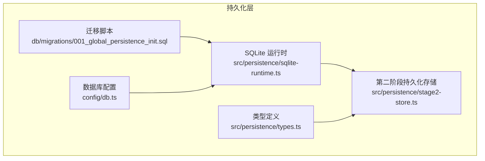
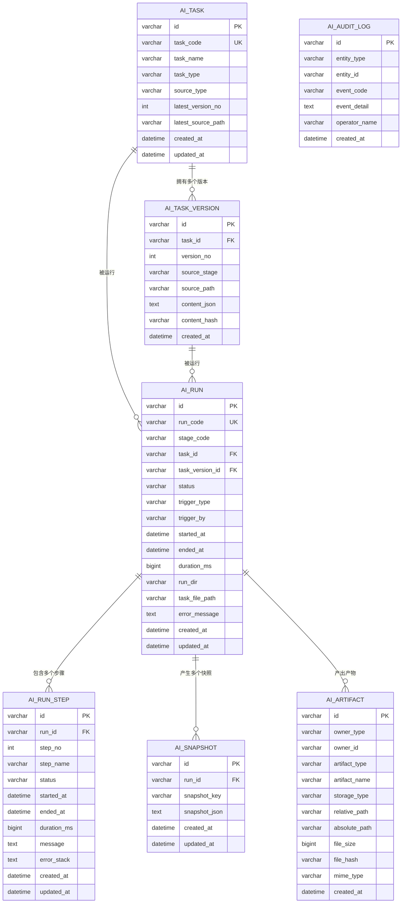
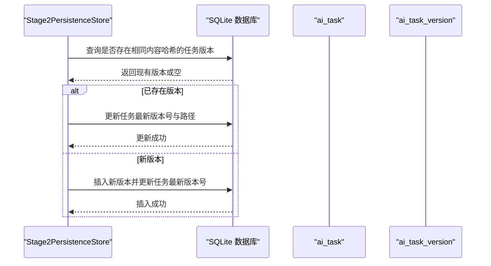
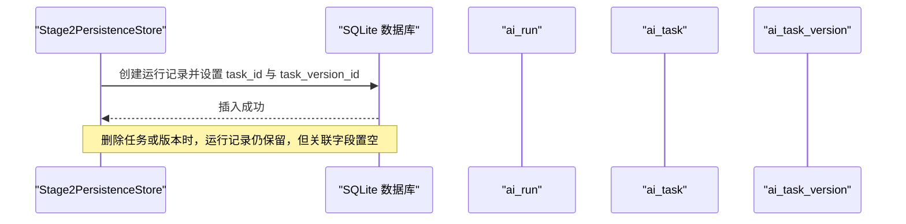
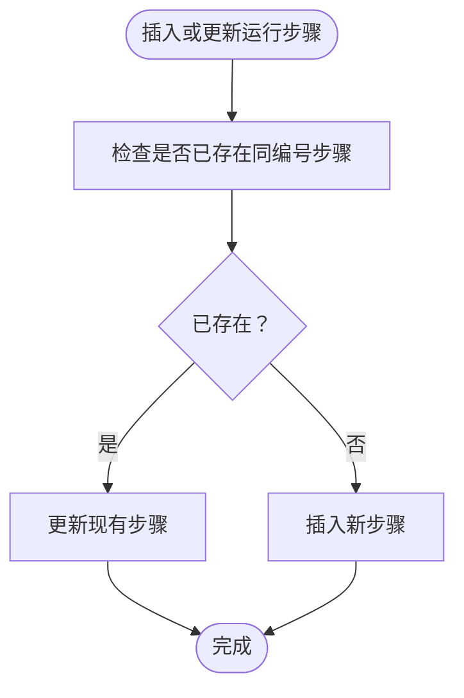
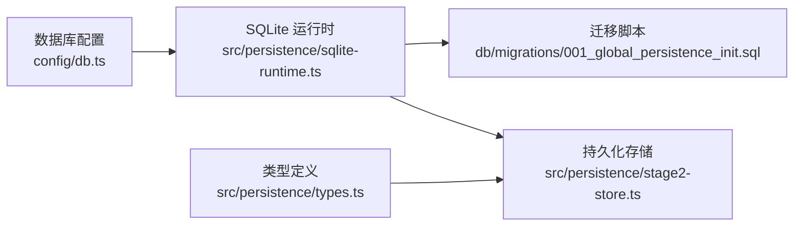

# 表关系和约束

<cite>
**本文引用的文件**
- [001_global_persistence_init.sql](file://db/migrations/001_global_persistence_init.sql)
- [sqlite-runtime.ts](file://src/persistence/sqlite-runtime.ts)
- [stage2-store.ts](file://src/persistence/stage2-store.ts)
- [types.ts](file://src/persistence/types.ts)
- [db.ts](file://config/db.ts)
</cite>

## 目录
1. [简介](#简介)
2. [项目结构](#项目结构)
3. [核心组件](#核心组件)
4. [架构总览](#架构总览)
5. [详细组件分析](#详细组件分析)
6. [依赖分析](#依赖分析)
7. [性能考虑](#性能考虑)
8. [故障排除指南](#故障排除指南)
9. [结论](#结论)

## 简介
本文件聚焦于数据库表之间的关系与约束，系统性阐述以下主题：
- ai_task 与 ai_task_version 的一对多关系及参照完整性
- ai_run 与 ai_task、ai_task_version 的关联关系及其级联策略
- ai_run_step 与 ai_run 的父子关系
- 唯一约束的设计目的与作用范围（任务代码唯一、版本号唯一、运行编号唯一等）
- 完整的 ER 关系图与表间关联说明
- 级联删除与 SET NULL 策略的应用场景与影响

## 项目结构
本项目的持久化层采用 SQLite 作为本地存储，并通过迁移脚本初始化表结构。核心文件如下：
- 数据库迁移脚本：db/migrations/001_global_persistence_init.sql
- SQLite 连接与迁移执行：src/persistence/sqlite-runtime.ts
- 第二阶段持久化写入逻辑：src/persistence/stage2-store.ts
- 类型定义：src/persistence/types.ts
- 数据库配置：config/db.ts

图表来源
- [001_global_persistence_init.sql:1-128](file://db/migrations/001_global_persistence_init.sql#L1-L128)
- [sqlite-runtime.ts:73-84](file://src/persistence/sqlite-runtime.ts#L73-L84)
- [stage2-store.ts:101-123](file://src/persistence/stage2-store.ts#L101-L123)
- [types.ts:1-125](file://src/persistence/types.ts#L1-L125)
- [db.ts:15-26](file://config/db.ts#L15-L26)

章节来源
- [001_global_persistence_init.sql:1-128](file://db/migrations/001_global_persistence_init.sql#L1-L128)
- [sqlite-runtime.ts:73-84](file://src/persistence/sqlite-runtime.ts#L73-L84)
- [stage2-store.ts:101-123](file://src/persistence/stage2-store.ts#L101-L123)
- [types.ts:1-125](file://src/persistence/types.ts#L1-L125)
- [db.ts:15-26](file://config/db.ts#L15-L26)

## 核心组件
- ai_task：任务主表，记录任务元数据与最新版本号
- ai_task_version：任务版本表，记录每次任务内容的版本与哈希
- ai_run：运行记录表，关联到具体任务与版本
- ai_run_step：运行步骤表，记录每个步骤的执行状态
- ai_snapshot：运行快照表，记录运行过程中的关键快照
- ai_artifact：产物表，记录任务、运行、步骤产生的文件
- ai_audit_log：审计日志表，记录实体事件

章节来源
- [001_global_persistence_init.sql:1-128](file://db/migrations/001_global_persistence_init.sql#L1-L128)
- [types.ts:34-123](file://src/persistence/types.ts#L34-L123)

## 架构总览
下图展示各表之间的实体关系与约束，包括主键、唯一约束与外键约束，以及级联策略。

图表来源
- [001_global_persistence_init.sql:1-128](file://db/migrations/001_global_persistence_init.sql#L1-L128)

## 详细组件分析

### ai_task 与 ai_task_version 的一对多关系
- 主键与唯一约束
  - ai_task 主键为 id，唯一约束为 task_code，确保任务代码全局唯一
  - ai_task_version 主键为 id，唯一约束包括 (task_id, version_no) 与 (task_id, content_hash)，确保同一任务下的版本号唯一且内容哈希唯一
- 外键与级联策略
  - ai_task_version.task_id 外键指向 ai_task.id，ON DELETE CASCADE，表示当删除任务时，其所有版本将被级联删除
- 设计目的
  - 版本控制：通过 version_no 与 content_hash 实现内容变更追踪与去重
  - 参照完整性：保证版本归属任务的正确性
  - 数据一致性：避免重复版本与冲突版本号

图表来源
- [stage2-store.ts:187-261](file://src/persistence/stage2-store.ts#L187-L261)
- [001_global_persistence_init.sql:15-30](file://db/migrations/001_global_persistence_init.sql#L15-L30)

章节来源
- [001_global_persistence_init.sql:15-30](file://db/migrations/001_global_persistence_init.sql#L15-L30)
- [stage2-store.ts:187-261](file://src/persistence/stage2-store.ts#L187-L261)

### ai_run 与 ai_task/ai_task_version 的关联关系
- 关联字段
  - ai_run.task_id 指向 ai_task.id
  - ai_run.task_version_id 指向 ai_task_version.id
- 唯一约束
  - ai_run.run_code 唯一，确保运行编号唯一
- 级联策略
  - ai_run.task_id ON DELETE SET NULL：删除任务不会影响运行记录，但会将关联字段置空
  - ai_run.task_version_id ON DELETE SET NULL：删除版本不会影响运行记录，但会将关联字段置空
- 设计目的
  - 保留历史运行记录，便于审计与回溯
  - 支持版本演进与任务迁移，避免强耦合

图表来源
- [stage2-store.ts:263-303](file://src/persistence/stage2-store.ts#L263-L303)
- [001_global_persistence_init.sql:32-57](file://db/migrations/001_global_persistence_init.sql#L32-L57)

章节来源
- [001_global_persistence_init.sql:32-57](file://db/migrations/001_global_persistence_init.sql#L32-L57)
- [stage2-store.ts:263-303](file://src/persistence/stage2-store.ts#L263-L303)

### ai_run_step 与 ai_run 的父子关系
- 关联字段
  - ai_run_step.run_id 指向 ai_run.id
- 唯一约束
  - ai_run_step.(run_id, step_no) 唯一，确保同一运行内的步骤号唯一
- 级联策略
  - ai_run_step.run_id ON DELETE CASCADE：删除运行记录时，其所有步骤将被级联删除
- 设计目的
  - 保证运行与其步骤的生命周期一致
  - 避免孤立步骤数据

图表来源
- [stage2-store.ts:495-590](file://src/persistence/stage2-store.ts#L495-L590)
- [001_global_persistence_init.sql:59-77](file://db/migrations/001_global_persistence_init.sql#L59-L77)

章节来源
- [001_global_persistence_init.sql:59-77](file://db/migrations/001_global_persistence_init.sql#L59-L77)
- [stage2-store.ts:495-590](file://src/persistence/stage2-store.ts#L495-L590)

### ai_snapshot 与 ai_run 的关联
- 关联字段
  - ai_snapshot.run_id 指向 ai_run.id
- 唯一约束
  - ai_snapshot.(run_id, snapshot_key) 唯一，确保同一运行内快照键唯一
- 级联策略
  - ai_snapshot.run_id ON DELETE CASCADE：删除运行记录时，其所有快照将被级联删除
- 设计目的
  - 记录运行过程中的关键状态与中间结果，便于回放与分析

章节来源
- [001_global_persistence_init.sql:79-91](file://db/migrations/001_global_persistence_init.sql#L79-L91)
- [stage2-store.ts:358-395](file://src/persistence/stage2-store.ts#L358-L395)

### ai_artifact 与多实体的关联
- 关联字段
  - ai_artifact.owner_type 与 owner_id 组合标识归属实体（task、task_version、run、run_step）
- 设计目的
  - 统一管理任务、运行、步骤产生的文件与产物
  - 支持跨实体的产物检索与清理

章节来源
- [001_global_persistence_init.sql:93-107](file://db/migrations/001_global_persistence_init.sql#L93-L107)
- [stage2-store.ts:397-468](file://src/persistence/stage2-store.ts#L397-L468)

### ai_audit_log 的审计作用
- 设计目的
  - 记录实体事件，便于审计与问题排查
- 关联字段
  - entity_type 与 entity_id 标识事件主体

章节来源
- [001_global_persistence_init.sql:109-118](file://db/migrations/001_global_persistence_init.sql#L109-L118)
- [stage2-store.ts:305-331](file://src/persistence/stage2-store.ts#L305-L331)

## 依赖分析
- 外键约束启用
  - 在打开数据库连接时启用外键约束与 PRAGMA foreign_keys
- 迁移执行
  - 通过 schema_migrations 表记录已应用的迁移，确保幂等性
- 类型与约束映射
  - 类型定义与数据库约束相互印证，确保上层逻辑与底层约束一致

图表来源
- [db.ts:15-26](file://config/db.ts#L15-L26)
- [sqlite-runtime.ts:73-84](file://src/persistence/sqlite-runtime.ts#L73-L84)
- [001_global_persistence_init.sql:1-128](file://db/migrations/001_global_persistence_init.sql#L1-L128)
- [stage2-store.ts:101-123](file://src/persistence/stage2-store.ts#L101-L123)
- [types.ts:1-125](file://src/persistence/types.ts#L1-L125)

章节来源
- [db.ts:15-26](file://config/db.ts#L15-L26)
- [sqlite-runtime.ts:73-84](file://src/persistence/sqlite-runtime.ts#L73-L84)
- [001_global_persistence_init.sql:1-128](file://db/migrations/001_global_persistence_init.sql#L1-L128)
- [stage2-store.ts:101-123](file://src/persistence/stage2-store.ts#L101-L123)
- [types.ts:1-125](file://src/persistence/types.ts#L1-L125)

## 性能考虑
- 索引设计
  - ai_task(task_name)：加速任务名称查询
  - ai_run(task_id, stage_code, started_at)：加速按任务、阶段与时间的复合查询
  - ai_run(stage_code, status, started_at)：加速按阶段与状态的查询
  - ai_run_step(run_id, status)：加速按运行与状态的查询
  - ai_artifact(owner_type, owner_id)、ai_artifact(artifact_type, created_at)：加速产物检索
  - ai_audit_log(entity_type, entity_id, created_at)：加速审计查询
- 级联策略对性能的影响
  - CASCADE 删除在删除父记录时可能触发大量子记录删除，建议在批量删除前评估影响
  - SET NULL 保留父记录，减少删除开销，但需注意空值查询成本

章节来源
- [001_global_persistence_init.sql:120-126](file://db/migrations/001_global_persistence_init.sql#L120-L126)

## 故障排除指南
- 外键约束错误
  - 现象：插入或更新时因违反外键约束报错
  - 排查：确认父记录是否存在，检查关联字段是否为空或非法
  - 参考：外键定义与级联策略
- 唯一约束冲突
  - 现象：插入重复的 run_code、(task_id, version_no) 或 (run_id, snapshot_key)
  - 排查：核对唯一键组合是否重复，必要时调整生成规则
- 级联行为异常
  - 现象：删除任务或运行后，子记录未按预期删除或置空
  - 排查：确认外键约束与级联策略，检查是否禁用了外键约束
- 迁移未生效
  - 现象：数据库结构未更新
  - 排查：确认 schema_migrations 中是否记录了迁移文件，重新执行迁移

章节来源
- [sqlite-runtime.ts:73-84](file://src/persistence/sqlite-runtime.ts#L73-L84)
- [sqlite-runtime.ts:86-114](file://src/persistence/sqlite-runtime.ts#L86-L114)
- [001_global_persistence_init.sql:32-57](file://db/migrations/001_global_persistence_init.sql#L32-L57)

## 结论
本数据模型通过清晰的主外键关系与唯一约束，构建了从任务到版本、从运行到步骤的完整生命周期数据流。级联策略在不同场景下平衡了数据完整性与灵活性：CASCADE 适用于“随父而生”的子数据，SET NULL 适用于“历史可追溯”的弱关联。配合合理的索引设计，整体具备良好的查询性能与可维护性。