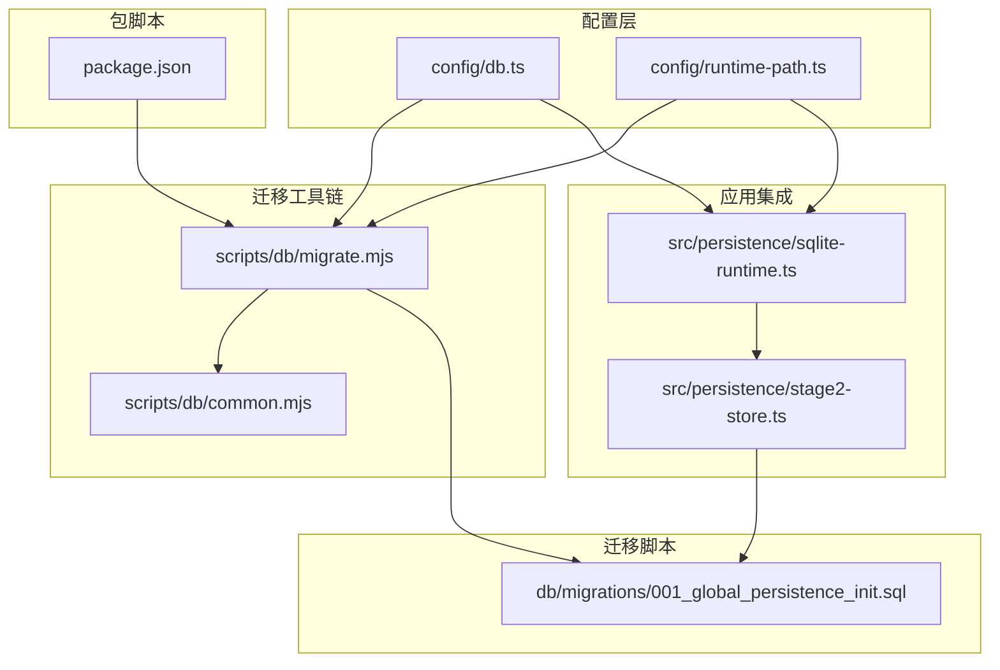
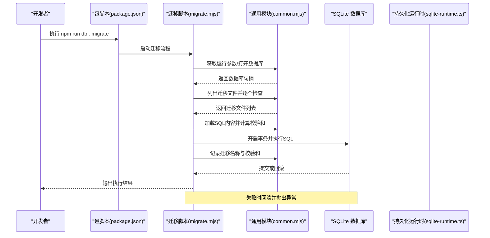
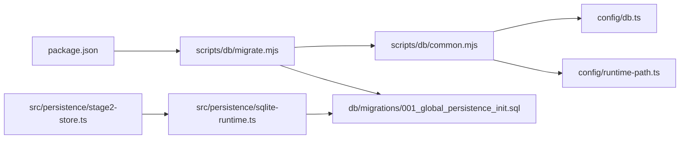

# 数据库迁移管理

<cite>
**本文引用的文件**
- [001_global_persistence_init.sql](file://db/migrations/001_global_persistence_init.sql)
- [migrate.mjs](file://scripts/db/migrate.mjs)
- [common.mjs](file://scripts/db/common.mjs)
- [db.ts](file://config/db.ts)
- [sqlite-runtime.ts](file://src/persistence/sqlite-runtime.ts)
- [stage2-store.ts](file://src/persistence/stage2-store.ts)
- [package.json](file://package.json)
- [README.md](file://README.md)
- [runtime-path.ts](file://config/runtime-path.ts)
</cite>

## 目录
1. [简介](#简介)
2. [项目结构](#项目结构)
3. [核心组件](#核心组件)
4. [架构总览](#架构总览)
5. [详细组件分析](#详细组件分析)
6. [依赖关系分析](#依赖关系分析)
7. [性能考量](#性能考量)
8. [故障排除指南](#故障排除指南)
9. [结论](#结论)
10. [附录](#附录)

## 简介
本文件系统性阐述本项目的数据库迁移管理方案，覆盖从初始迁移脚本到版本演进的全生命周期管理。内容包括：
- 迁移脚本的编写规范与执行顺序
- 迁移工具链的使用方法（运行、回滚、状态检查）
- 版本控制策略与分支合并时的迁移处理
- 数据保护机制与回滚策略
- 生产环境迁移注意事项与最佳实践
- 迁移监控与故障排除方法

## 项目结构
项目采用“脚本驱动 + 配置驱动”的轻量迁移体系，核心文件分布如下：
- 迁移脚本：db/migrations/001_global_persistence_init.sql
- 迁移工具链：scripts/db/migrate.mjs、scripts/db/common.mjs
- 数据库配置：config/db.ts、config/runtime-path.ts
- 应用侧集成：src/persistence/sqlite-runtime.ts、src/persistence/stage2-store.ts
- 包脚本：package.json 中的 db:init、db:migrate
- 文档与使用说明：README.md

图表来源
- [migrate.mjs:1-52](file://scripts/db/migrate.mjs#L1-L52)
- [common.mjs:1-108](file://scripts/db/common.mjs#L1-L108)
- [db.ts:1-28](file://config/db.ts#L1-L28)
- [runtime-path.ts:1-41](file://config/runtime-path.ts#L1-L41)
- [sqlite-runtime.ts:1-116](file://src/persistence/sqlite-runtime.ts#L1-L116)
- [stage2-store.ts:1-200](file://src/persistence/stage2-store.ts#L1-L200)
- [001_global_persistence_init.sql:1-128](file://db/migrations/001_global_persistence_init.sql#L1-L128)
- [package.json:1-26](file://package.json#L1-L26)

章节来源
- [README.md:1-229](file://README.md#L1-L229)
- [package.json:1-26](file://package.json#L1-L26)

## 核心组件
- 迁移脚本：db/migrations/001_global_persistence_init.sql，定义了 ai_task、ai_task_version、ai_run、ai_run_step、ai_snapshot、ai_artifact、ai_audit_log 等核心表及索引。
- 迁移工具链：scripts/db/migrate.mjs 负责扫描、执行、记录迁移；scripts/db/common.mjs 提供通用能力（打开数据库、列出迁移文件、校验与记录执行状态等）。
- 数据库配置：config/db.ts 与 config/runtime-path.ts 提供驱动类型、数据库文件路径解析与运行时目录前缀。
- 应用集成：src/persistence/sqlite-runtime.ts 提供数据库打开、迁移表确保、迁移加载与执行；src/persistence/stage2-store.ts 在业务流程中调用迁移并写入运行数据。
- 包脚本：package.json 中的 db:init 与 db:migrate 通过 Node 实验性 SQLite 支持执行迁移。

章节来源
- [001_global_persistence_init.sql:1-128](file://db/migrations/001_global_persistence_init.sql#L1-L128)
- [migrate.mjs:1-52](file://scripts/db/migrate.mjs#L1-L52)
- [common.mjs:1-108](file://scripts/db/common.mjs#L1-L108)
- [db.ts:1-28](file://config/db.ts#L1-L28)
- [runtime-path.ts:1-41](file://config/runtime-path.ts#L1-L41)
- [sqlite-runtime.ts:1-116](file://src/persistence/sqlite-runtime.ts#L1-L116)
- [stage2-store.ts:1-200](file://src/persistence/stage2-store.ts#L1-L200)
- [package.json:1-26](file://package.json#L1-L26)

## 架构总览
迁移生命周期从“脚本 + 配置”出发，经“迁移工具链”执行，最终在“应用集成层”完成落库与业务写入。

图表来源
- [migrate.mjs:1-52](file://scripts/db/migrate.mjs#L1-L52)
- [common.mjs:1-108](file://scripts/db/common.mjs#L1-L108)

## 详细组件分析

### 迁移脚本规范与执行顺序
- 脚本命名与顺序：迁移脚本位于 db/migrations/，按文件名排序执行。当前仓库包含一个初始脚本 001_global_persistence_init.sql，用于创建核心表与索引。
- 执行顺序：迁移工具链会读取该目录下的 .sql 文件并按字典序依次执行，避免并发冲突。
- 事务与原子性：每次迁移在独立事务中执行，失败即回滚，确保数据库一致性。
- 校验与幂等：通过 schema_migrations 表记录已执行的迁移名称与校验和，重复执行同名迁移会被跳过。

章节来源
- [migrate.mjs:15-51](file://scripts/db/migrate.mjs#L15-L51)
- [common.mjs:71-106](file://scripts/db/common.mjs#L71-L106)
- [001_global_persistence_init.sql:1-128](file://db/migrations/001_global_persistence_init.sql#L1-L128)

### 迁移工具链使用方法
- 运行迁移：npm run db:migrate 或 npm run db:init（二者指向同一脚本），会自动打开数据库、确保迁移表存在、扫描迁移文件并执行未执行的迁移。
- 回滚策略：当前实现未提供回滚脚本，回滚需通过逆向迁移脚本或手动备份恢复。建议在变更前备份数据库文件。
- 状态检查：通过查询 schema_migrations 表可确认哪些迁移已执行、执行时间与校验和。

章节来源
- [package.json:6-11](file://package.json#L6-L11)
- [migrate.mjs:12-51](file://scripts/db/migrate.mjs#L12-L51)
- [common.mjs:60-106](file://scripts/db/common.mjs#L60-L106)

### 数据库配置与环境变量
- 驱动与路径：DB_DRIVER 控制数据库驱动（当前仅支持 sqlite），DB_FILE_PATH 指定 SQLite 文件路径，可通过 RUNTIME_DIR_PREFIX 统一运行时目录前缀。
- 路径解析：config/db.ts 与 config/runtime-path.ts 提供路径解析函数，确保迁移与运行时目录正确创建。

章节来源
- [db.ts:1-28](file://config/db.ts#L1-L28)
- [runtime-path.ts:1-41](file://config/runtime-path.ts#L1-L41)
- [README.md:39-54](file://README.md#L39-L54)

### 应用侧集成与迁移执行时机
- 运行时集成：src/persistence/sqlite-runtime.ts 提供 applyPendingMigrations，在业务初始化时自动应用未执行的迁移。
- 业务写库：src/persistence/stage2-store.ts 在任务执行开始时打开数据库、应用迁移、写入任务、版本、运行、步骤、快照与附件等数据，并记录审计日志。

章节来源
- [sqlite-runtime.ts:86-114](file://src/persistence/sqlite-runtime.ts#L86-L114)
- [stage2-store.ts:101-123](file://src/persistence/stage2-store.ts#L101-L123)

### 迁移脚本编写规范
- SQL 语法要求
  - 使用 SQLite 兼容语法，遵循 README 中“表结构按 MySQL 兼容子集设计”的说明，便于未来迁移到 MySQL。
  - 使用显式约束与索引，如主键、唯一约束、外键与索引，确保数据完整性与查询效率。
- 兼容性考虑
  - 避免使用特定数据库方言特性，优先使用 ANSI SQL 子集。
  - 对于日期时间字段，统一使用 DATETIME 类型与格式化函数，确保跨平台一致性。
- 幂等性与可重复执行
  - 使用 IF NOT EXISTS 创建对象，避免重复执行导致失败。
  - 通过 schema_migrations 记录执行状态，确保重复执行不会产生副作用。
- 可追踪性
  - 为每个迁移脚本命名清晰，便于识别其作用域与版本。
  - 在脚本中添加注释说明目的、影响范围与注意事项。

章节来源
- [001_global_persistence_init.sql:1-128](file://db/migrations/001_global_persistence_init.sql#L1-L128)
- [README.md:97-119](file://README.md#L97-L119)

### 版本控制策略与分支合并
- 迁移脚本命名：采用递增编号（如 001、002…），确保顺序稳定。
- 分支合并：合并前确保目标分支上不存在未执行的迁移；若存在冲突，应通过逆向迁移或重新生成迁移脚本解决。
- 回滚与备份：在执行重大变更前备份数据库文件，必要时回滚到上一个稳定版本。
- 审计与追踪：schema_migrations 记录迁移名称、校验和与执行时间，便于审计与问题定位。

章节来源
- [migrate.mjs:25-45](file://scripts/db/migrate.mjs#L25-L45)
- [common.mjs:88-106](file://scripts/db/common.mjs#L88-L106)

### 数据保护机制与回滚策略
- 事务保护：每次迁移在 BEGIN/COMMIT 之间执行，失败自动 ROLLBACK，避免部分执行造成脏数据。
- 校验和校验：对迁移脚本内容计算 SHA-256 校验和，记录在 schema_migrations，防止脚本被意外修改。
- 备份策略：生产环境执行迁移前务必备份数据库文件；回滚时可使用备份恢复。
- 审计日志：业务侧通过 ai_audit_log 记录关键事件，便于回溯与取证。

章节来源
- [migrate.mjs:35-44](file://scripts/db/migrate.mjs#L35-L44)
- [common.mjs:27-29](file://scripts/db/common.mjs#L27-L29)
- [stage2-store.ts:122-122](file://src/persistence/stage2-store.ts#L122-L122)

### 迁移最佳实践
- 向后兼容性
  - 新增列时提供默认值；避免删除列或修改列类型；如需变更，使用逆向迁移脚本。
  - 对敏感字段进行脱敏处理（如任务 JSON 中的密码），仅存储哈希或摘要。
- 生产环境注意事项
  - 在维护窗口执行迁移；提前通知相关方。
  - 准备回滚预案与演练；准备备份恢复流程。
  - 监控迁移执行日志，关注异常与耗时。
- 可观测性
  - 使用 schema_migrations 与 ai_audit_log 记录执行状态与关键事件。
  - 在 CI/CD 中加入迁移检查步骤，确保新环境能正常应用迁移。

章节来源
- [stage2-store.ts:37-48](file://src/persistence/stage2-store.ts#L37-L48)
- [README.md:97-119](file://README.md#L97-L119)

## 依赖关系分析
迁移工具链与配置、应用层之间的依赖关系如下：

图表来源
- [package.json:6-11](file://package.json#L6-L11)
- [migrate.mjs:1-10](file://scripts/db/migrate.mjs#L1-L10)
- [common.mjs:1-41](file://scripts/db/common.mjs#L1-L41)
- [db.ts:1-28](file://config/db.ts#L1-L28)
- [runtime-path.ts:1-41](file://config/runtime-path.ts#L1-L41)
- [sqlite-runtime.ts:1-116](file://src/persistence/sqlite-runtime.ts#L1-L116)
- [stage2-store.ts:1-200](file://src/persistence/stage2-store.ts#L1-L200)
- [001_global_persistence_init.sql:1-128](file://db/migrations/001_global_persistence_init.sql#L1-L128)

章节来源
- [migrate.mjs:1-10](file://scripts/db/migrate.mjs#L1-L10)
- [common.mjs:1-41](file://scripts/db/common.mjs#L1-L41)
- [sqlite-runtime.ts:1-116](file://src/persistence/sqlite-runtime.ts#L1-L116)
- [stage2-store.ts:1-200](file://src/persistence/stage2-store.ts#L1-L200)

## 性能考量
- 索引设计：初始脚本包含多处索引，有助于提升查询性能；但过多索引会影响写入性能，应结合实际查询模式评估。
- 事务粒度：单次迁移在事务内执行，避免频繁提交带来的开销；对于大型迁移，建议拆分为多个小迁移。
- 文件系统：SQLite 为单文件数据库，I/O 性能受磁盘与文件系统影响；建议在高性能磁盘上部署。

章节来源
- [001_global_persistence_init.sql:120-126](file://db/migrations/001_global_persistence_init.sql#L120-L126)

## 故障排除指南
- 常见问题
  - 迁移失败：检查迁移脚本语法与依赖对象是否存在；查看日志输出的错误堆栈；确认数据库文件权限。
  - 重复执行：确认 schema_migrations 是否已记录该迁移；若未记录，检查脚本是否被修改导致校验和不一致。
  - 驱动不支持：当前仅支持 sqlite，若 DB_DRIVER 非 sqlite 将抛出错误。
- 排查步骤
  - 查看迁移执行日志：npm run db:migrate 的输出。
  - 查询迁移状态：SELECT migration_name, executed_at FROM schema_migrations。
  - 校验脚本内容：核对迁移脚本内容与校验和。
  - 回滚与恢复：备份数据库文件后，可使用逆向迁移或恢复备份。
- 监控与告警
  - 在 CI/CD 中增加迁移检查步骤，确保新环境迁移成功。
  - 关注迁移耗时与失败率，及时预警。

章节来源
- [migrate.mjs:15-51](file://scripts/db/migrate.mjs#L15-L51)
- [common.mjs:47-58](file://scripts/db/common.mjs#L47-L58)
- [stage2-store.ts:125-133](file://src/persistence/stage2-store.ts#L125-L133)

## 结论
本项目采用轻量、可追踪的迁移管理方案：以脚本驱动为核心，配合配置与工具链实现自动化执行与状态记录。通过事务保护、校验和与审计日志，确保迁移过程的可靠性与可追溯性。建议在生产环境中严格遵循备份与回滚策略，并结合 CI/CD 实现迁移的自动化与可观测性。

## 附录

### 迁移脚本结构与字段说明
- ai_task：任务主记录，包含任务编码、名称、类型、来源、最新版本号与时间戳等。
- ai_task_version：任务版本记录，包含版本号、来源阶段与路径、内容 JSON 与哈希、时间戳等。
- ai_run：运行主记录，包含运行编码、阶段、任务与版本关联、状态、触发信息、时间戳与耗时等。
- ai_run_step：运行步骤明细，包含步骤号、名称、状态、时间戳、耗时与错误信息等。
- ai_snapshot：结构化快照，包含运行与快照键、JSON 内容与时间戳等。
- ai_artifact：附件元数据，包含拥有者类型与 ID、类型、名称、存储类型与路径、大小、哈希与 MIME 类型等。
- ai_audit_log：审计日志，包含实体类型与 ID、事件编码、详情与操作者、时间戳等。

章节来源
- [001_global_persistence_init.sql:1-128](file://db/migrations/001_global_persistence_init.sql#L1-L128)