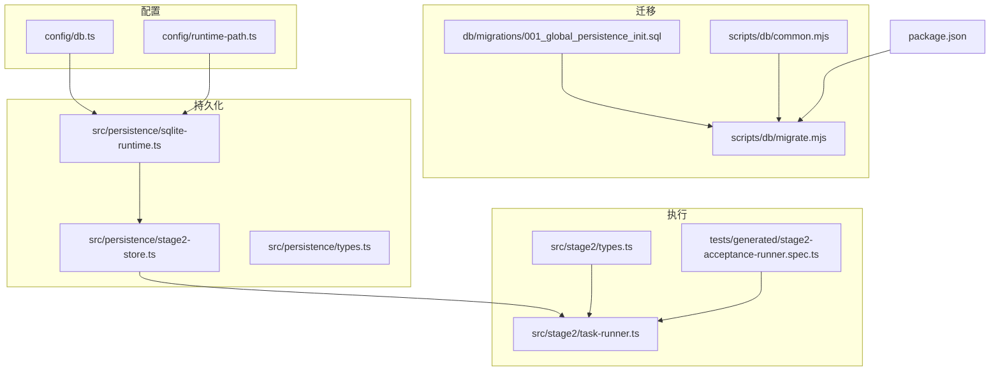
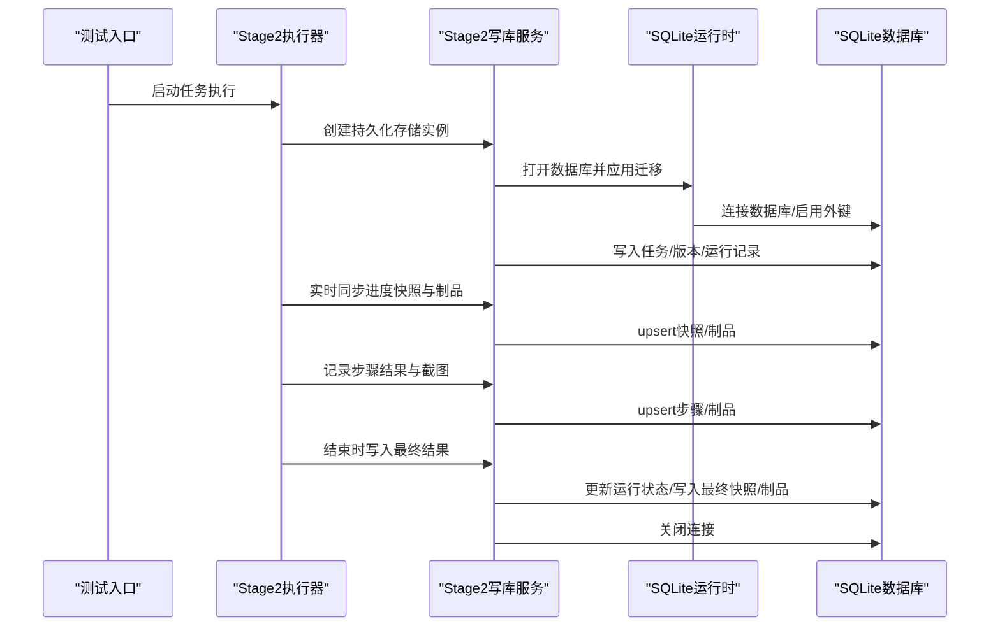
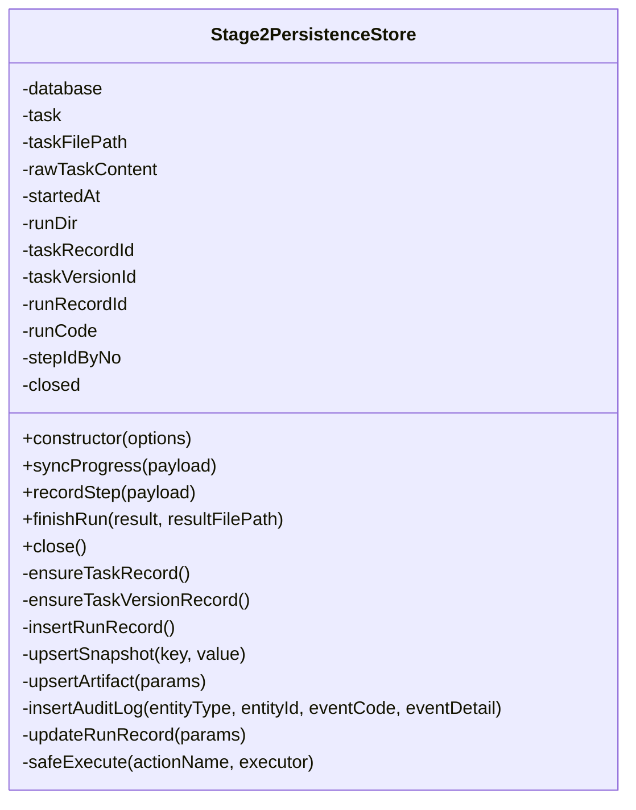
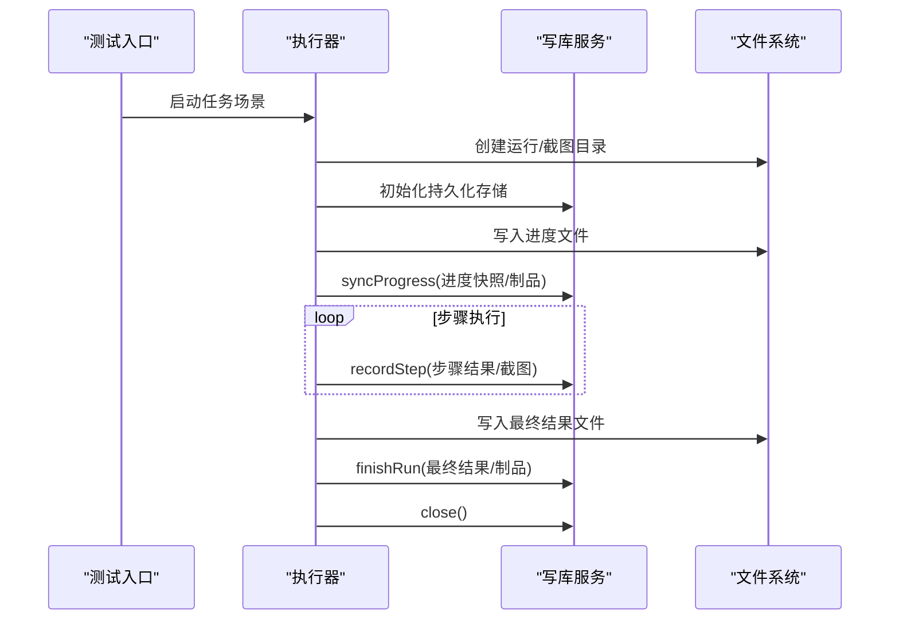
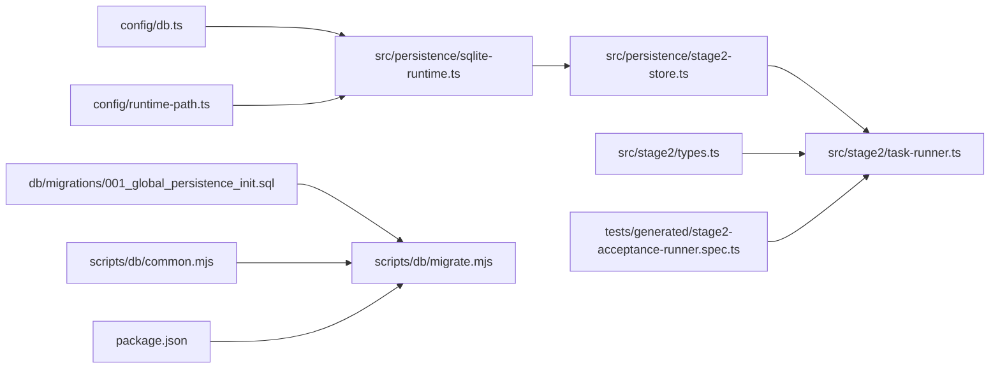

# 数据持久化系统

<cite>
**本文引用的文件列表**
- [config/db.ts](file://config/db.ts)
- [config/runtime-path.ts](file://config/runtime-path.ts)
- [db/migrations/001_global_persistence_init.sql](file://db/migrations/001_global_persistence_init.sql)
- [scripts/db/migrate.mjs](file://scripts/db/migrate.mjs)
- [scripts/db/common.mjs](file://scripts/db/common.mjs)
- [src/persistence/sqlite-runtime.ts](file://src/persistence/sqlite-runtime.ts)
- [src/persistence/stage2-store.ts](file://src/persistence/stage2-store.ts)
- [src/persistence/types.ts](file://src/persistence/types.ts)
- [src/stage2/task-runner.ts](file://src/stage2/task-runner.ts)
- [src/stage2/types.ts](file://src/stage2/types.ts)
- [tests/generated/stage2-acceptance-runner.spec.ts](file://tests/generated/stage2-acceptance-runner.spec.ts)
- [package.json](file://package.json)
</cite>

## 目录
1. [简介](#简介)
2. [项目结构](#项目结构)
3. [核心组件](#核心组件)
4. [架构总览](#架构总览)
5. [详细组件分析](#详细组件分析)
6. [依赖关系分析](#依赖关系分析)
7. [性能考量](#性能考量)
8. [故障排查指南](#故障排查指南)
9. [结论](#结论)
10. [附录](#附录)

## 简介
本文件面向“数据持久化系统”的全面文档，聚焦于 SQLite 数据库的架构设计、表结构定义、数据入库流程、迁移机制与版本管理、索引与查询优化、配置与连接管理、备份与恢复策略以及维护与故障排除。系统以 Stage2 接受性测试为主线，将任务、运行、步骤、快照、制品与审计日志等数据落盘至本地 SQLite 文件，并通过迁移脚本保证表结构演进的一致性与可追溯性。

## 项目结构
围绕数据持久化的关键目录与文件如下：
- 配置层：数据库驱动与路径解析、运行时目录解析
- 迁移层：SQL 初始化脚本与迁移工具
- 存储层：SQLite 运行时与 Stage2 写库服务
- 执行层：Stage2 任务执行器与测试入口，负责触发持久化写入
- 类型层：统一的数据模型定义

图表来源
- [config/db.ts:1-28](file://config/db.ts#L1-L28)
- [config/runtime-path.ts:1-41](file://config/runtime-path.ts#L1-L41)
- [db/migrations/001_global_persistence_init.sql:1-128](file://db/migrations/001_global_persistence_init.sql#L1-L128)
- [scripts/db/migrate.mjs:1-52](file://scripts/db/migrate.mjs#L1-L52)
- [scripts/db/common.mjs:1-108](file://scripts/db/common.mjs#L1-L108)
- [src/persistence/sqlite-runtime.ts:1-116](file://src/persistence/sqlite-runtime.ts#L1-L116)
- [src/persistence/stage2-store.ts:1-655](file://src/persistence/stage2-store.ts#L1-L655)
- [src/persistence/types.ts:1-125](file://src/persistence/types.ts#L1-L125)
- [src/stage2/task-runner.ts:1-800](file://src/stage2/task-runner.ts#L1-L800)
- [src/stage2/types.ts:1-180](file://src/stage2/types.ts#L1-L180)
- [tests/generated/stage2-acceptance-runner.spec.ts:1-38](file://tests/generated/stage2-acceptance-runner.spec.ts#L1-L38)
- [package.json:1-26](file://package.json#L1-L26)

章节来源
- [config/db.ts:1-28](file://config/db.ts#L1-L28)
- [config/runtime-path.ts:1-41](file://config/runtime-path.ts#L1-L41)
- [db/migrations/001_global_persistence_init.sql:1-128](file://db/migrations/001_global_persistence_init.sql#L1-L128)
- [scripts/db/migrate.mjs:1-52](file://scripts/db/migrate.mjs#L1-L52)
- [scripts/db/common.mjs:1-108](file://scripts/db/common.mjs#L1-L108)
- [src/persistence/sqlite-runtime.ts:1-116](file://src/persistence/sqlite-runtime.ts#L1-L116)
- [src/persistence/stage2-store.ts:1-655](file://src/persistence/stage2-store.ts#L1-L655)
- [src/persistence/types.ts:1-125](file://src/persistence/types.ts#L1-L125)
- [src/stage2/task-runner.ts:1-800](file://src/stage2/task-runner.ts#L1-L800)
- [src/stage2/types.ts:1-180](file://src/stage2/types.ts#L1-L180)
- [tests/generated/stage2-acceptance-runner.spec.ts:1-38](file://tests/generated/stage2-acceptance-runner.spec.ts#L1-L38)
- [package.json:1-26](file://package.json#L1-L26)

## 核心组件
- 数据库配置与路径解析：集中管理驱动类型与数据库文件路径，支持环境变量覆盖与路径规范化。
- SQLite 运行时：封装数据库连接、迁移表、迁移应用、ID 生成、日期格式化、相对路径转换与哈希计算。
- 迁移工具：扫描迁移文件、去重执行、校验校验和、事务化执行与回滚。
- Stage2 写库服务：在任务执行过程中，按阶段写入任务、版本、运行、步骤、快照、制品与审计日志。
- 执行器与测试入口：驱动任务执行，实时写入进度与结果，最终落库并关闭连接。
- 统一类型定义：为各表提供强类型接口，便于上层逻辑与数据库交互。

章节来源
- [config/db.ts:1-28](file://config/db.ts#L1-L28)
- [src/persistence/sqlite-runtime.ts:1-116](file://src/persistence/sqlite-runtime.ts#L1-L116)
- [scripts/db/common.mjs:1-108](file://scripts/db/common.mjs#L1-L108)
- [src/persistence/stage2-store.ts:1-655](file://src/persistence/stage2-store.ts#L1-L655)
- [src/stage2/task-runner.ts:1-800](file://src/stage2/task-runner.ts#L1-L800)
- [src/persistence/types.ts:1-125](file://src/persistence/types.ts#L1-L125)

## 架构总览
系统采用“配置-迁移-运行时-存储-执行”的分层架构。执行器在运行时创建持久化存储实例，自动应用未执行的迁移，随后在任务生命周期内持续写入各类数据实体，并在结束时汇总落库与关闭连接。

图表来源
- [src/stage2/task-runner.ts:2332-2656](file://src/stage2/task-runner.ts#L2332-L2656)
- [src/persistence/stage2-store.ts:101-123](file://src/persistence/stage2-store.ts#L101-L123)
- [src/persistence/sqlite-runtime.ts:73-84](file://src/persistence/sqlite-runtime.ts#L73-L84)
- [src/persistence/sqlite-runtime.ts:86-114](file://src/persistence/sqlite-runtime.ts#L86-L114)

## 详细组件分析

### 数据库配置与路径解析
- 驱动与文件路径：支持通过环境变量覆盖默认驱动与数据库文件路径，路径解析统一使用工作目录与运行时前缀。
- 运行时目录：集中管理测试结果、报告、运行目录等输出路径，支持环境变量覆盖。

章节来源
- [config/db.ts:1-28](file://config/db.ts#L1-L28)
- [config/runtime-path.ts:1-41](file://config/runtime-path.ts#L1-L41)

### SQLite 运行时与迁移机制
- 连接与外键：打开数据库连接时启用外键约束，确保参照完整性。
- 迁移表：首次执行时创建迁移记录表，记录迁移文件名与校验和，避免重复执行。
- 迁移应用：扫描迁移目录下的 SQL 文件，按文件名排序依次执行，事务包裹，失败回滚。
- 工具脚本：提供命令行脚本，支持初始化与迁移执行，打印执行状态与错误。

章节来源
- [src/persistence/sqlite-runtime.ts:43-52](file://src/persistence/sqlite-runtime.ts#L43-L52)
- [src/persistence/sqlite-runtime.ts:86-114](file://src/persistence/sqlite-runtime.ts#L86-L114)
- [scripts/db/common.mjs:60-69](file://scripts/db/common.mjs#L60-L69)
- [scripts/db/common.mjs:88-95](file://scripts/db/common.mjs#L88-L95)
- [scripts/db/migrate.mjs:15-51](file://scripts/db/migrate.mjs#L15-L51)

### 表结构与关系
- ai_task：任务元数据，包含任务编码、名称、类型、来源类型、最新版本号与路径等。
- ai_task_version：任务版本，关联任务主表，按内容哈希去重，记录版本号与来源路径。
- ai_run：运行记录，关联任务与版本，记录运行状态、触发方式、时间戳、运行目录与任务文件路径等。
- ai_run_step：运行步骤，按运行记录与步骤序号唯一，记录步骤名称、状态、耗时与错误信息。
- ai_snapshot：运行快照，按运行记录与快照键唯一，存储 JSON 形式的快照数据。
- ai_artifact：制品，按拥有者类型/ID与制品类型/名称唯一，记录文件相对/绝对路径、大小、MIME 类型等。
- ai_audit_log：审计日志，记录实体类型/ID、事件码、详情与操作人等。

索引设计要点：
- ai_task：按任务名建立索引，便于检索。
- ai_run：按任务ID+阶段+开始时间、阶段+状态+开始时间建立复合索引，支撑运行查询与统计。
- ai_run_step：按运行ID+状态建立索引，支撑按运行查询步骤。
- ai_artifact：按拥有者类型/ID与制品类型/创建时间建立索引，支撑按拥有者与类型检索。
- ai_audit_log：按实体类型/ID+创建时间建立索引，支撑审计查询。

章节来源
- [db/migrations/001_global_persistence_init.sql:1-128](file://db/migrations/001_global_persistence_init.sql#L1-L128)

### Stage2 写库服务（数据入库流程）
- 初始化：创建数据库连接与应用迁移，确保任务与版本记录存在，生成运行ID与运行编号，写入运行记录并记录审计日志。
- 进度同步：将解析值、查询快照与进度状态写入快照表，并将进度 JSON 作为制品落盘与登记。
- 步骤记录：按步骤序号写入或更新步骤记录，失败时记录审计日志；若存在截图则登记为制品。
- 结束收尾：更新运行状态与耗时，写入最终快照与结果 JSON 制品，记录运行结束审计日志。
- 关闭连接：在执行器结束时关闭数据库连接，防止资源泄漏。

图表来源
- [src/persistence/stage2-store.ts:74-641](file://src/persistence/stage2-store.ts#L74-L641)

章节来源
- [src/persistence/stage2-store.ts:101-123](file://src/persistence/stage2-store.ts#L101-L123)
- [src/persistence/stage2-store.ts:470-493](file://src/persistence/stage2-store.ts#L470-L493)
- [src/persistence/stage2-store.ts:495-590](file://src/persistence/stage2-store.ts#L495-L590)
- [src/persistence/stage2-store.ts:592-630](file://src/persistence/stage2-store.ts#L592-L630)
- [src/persistence/stage2-store.ts:632-641](file://src/persistence/stage2-store.ts#L632-L641)

### 执行器与测试入口（从测试到入库）
- 测试入口：Playwright 测试文件调用执行器，传入页面与 AI 断言等上下文。
- 执行器：创建运行目录与截图目录，初始化持久化存储，写入初始进度文件与进度快照，循环执行步骤，收集解析值与查询快照，记录步骤结果与截图，最终生成结果文件并写入最终结果，关闭存储。
- 产物：运行目录包含结果 JSON、进度 JSON 与截图目录，持久化系统同时将这些制品登记到制品表。

图表来源
- [tests/generated/stage2-acceptance-runner.spec.ts:12-37](file://tests/generated/stage2-acceptance-runner.spec.ts#L12-L37)
- [src/stage2/task-runner.ts:2332-2656](file://src/stage2/task-runner.ts#L2332-L2656)
- [src/persistence/stage2-store.ts:470-630](file://src/persistence/stage2-store.ts#L470-L630)

章节来源
- [tests/generated/stage2-acceptance-runner.spec.ts:1-38](file://tests/generated/stage2-acceptance-runner.spec.ts#L1-L38)
- [src/stage2/task-runner.ts:2332-2656](file://src/stage2/task-runner.ts#L2332-L2656)

### 数据模型与类型定义
- 统一类型：为任务、版本、运行、步骤、快照、制品与审计日志提供强类型接口，便于静态校验与 IDE 提示。
- 状态枚举：运行状态、拥有者类型、制品类型等均以联合类型定义，减少运行期错误。

章节来源
- [src/persistence/types.ts:1-125](file://src/persistence/types.ts#L1-L125)

## 依赖关系分析
- 配置层依赖 dotenv 与路径模块，提供驱动与路径解析。
- 迁移层依赖 node:sqlite 与文件系统，扫描迁移目录并执行 SQL。
- 运行时层依赖 node:sqlite，提供连接、迁移、ID 生成、日期格式化与哈希计算。
- 存储层依赖运行时能力，封装 CRUD 与审计日志。
- 执行器依赖存储层，驱动任务执行并将结果写入数据库。
- 测试入口依赖执行器，触发端到端执行。

图表来源
- [config/db.ts:1-28](file://config/db.ts#L1-L28)
- [config/runtime-path.ts:1-41](file://config/runtime-path.ts#L1-L41)
- [db/migrations/001_global_persistence_init.sql:1-128](file://db/migrations/001_global_persistence_init.sql#L1-L128)
- [scripts/db/migrate.mjs:1-52](file://scripts/db/migrate.mjs#L1-L52)
- [scripts/db/common.mjs:1-108](file://scripts/db/common.mjs#L1-L108)
- [src/persistence/sqlite-runtime.ts:1-116](file://src/persistence/sqlite-runtime.ts#L1-L116)
- [src/persistence/stage2-store.ts:1-655](file://src/persistence/stage2-store.ts#L1-L655)
- [src/stage2/task-runner.ts:1-800](file://src/stage2/task-runner.ts#L1-L800)
- [src/stage2/types.ts:1-180](file://src/stage2/types.ts#L1-L180)
- [tests/generated/stage2-acceptance-runner.spec.ts:1-38](file://tests/generated/stage2-acceptance-runner.spec.ts#L1-L38)
- [package.json:1-26](file://package.json#L1-L26)

## 性能考量
- 索引设计：针对高频查询字段建立索引，减少全表扫描；复合索引用于多条件过滤。
- 查询优化：使用参数化语句与预编译，避免字符串拼接引发的性能与注入风险。
- 存储空间管理：制品表记录文件大小与哈希，便于后续清理策略；快照表以 JSON 存储中间态，建议控制快照粒度与体积。
- 连接管理：单次执行使用一次性连接，执行结束后及时关闭，避免连接泄漏。
- 迁移事务：迁移执行使用事务，失败回滚，保障结构一致性与原子性。

[本节为通用性能指导，无需特定文件引用]

## 故障排查指南
- 迁移失败：检查迁移文件是否正确、是否已存在迁移记录、校验和是否一致；查看事务回滚原因。
- 外键约束错误：确认被引用记录是否存在，尤其是任务与版本之间的关联。
- 路径问题：确认数据库文件路径解析是否正确，运行时目录是否存在且可写。
- 权限问题：确保数据库文件所在目录具备读写权限。
- 连接异常：确认驱动类型为 sqlite，连接参数与外键约束已启用。
- 进度/结果缺失：检查执行器是否正常写入进度文件与最终结果文件，确认持久化存储实例未提前关闭。

章节来源
- [src/persistence/sqlite-runtime.ts:73-84](file://src/persistence/sqlite-runtime.ts#L73-L84)
- [src/persistence/sqlite-runtime.ts:86-114](file://src/persistence/sqlite-runtime.ts#L86-L114)
- [src/persistence/stage2-store.ts:632-641](file://src/persistence/stage2-store.ts#L632-L641)

## 结论
本数据持久化系统以 SQLite 为核心，结合迁移机制与强类型模型，实现了从任务执行到数据入库的完整闭环。通过合理的索引设计、事务化迁移与严格的连接管理，系统在保证数据一致性的同时兼顾了性能与可维护性。配合测试入口与执行器，能够稳定地记录测试过程与结果，为后续审计与复盘提供可靠依据。

[本节为总结性内容，无需特定文件引用]

## 附录

### 数据库迁移与版本管理
- 初始化脚本：提供完整的表结构与索引定义，确保首次部署即具备所需结构。
- 增量迁移：通过迁移记录表与校验和，确保迁移幂等与可追溯。
- 命令行工具：提供 db:init 与 db:migrate 脚本，支持一键初始化与迁移执行。

章节来源
- [db/migrations/001_global_persistence_init.sql:1-128](file://db/migrations/001_global_persistence_init.sql#L1-L128)
- [scripts/db/migrate.mjs:15-51](file://scripts/db/migrate.mjs#L15-L51)
- [scripts/db/common.mjs:60-69](file://scripts/db/common.mjs#L60-L69)
- [package.json:6-11](file://package.json#L6-L11)

### 数据库配置与连接管理
- 环境变量：DB_DRIVER、DB_FILE_PATH、RUNTIME_DIR_PREFIX 等，支持灵活部署。
- 连接参数：启用外键约束，确保参照完整性。
- 路径解析：统一使用工作目录与运行时前缀，保证路径一致性。

章节来源
- [config/db.ts:10-26](file://config/db.ts#L10-L26)
- [config/runtime-path.ts:13-40](file://config/runtime-path.ts#L13-L40)
- [src/persistence/sqlite-runtime.ts:79-82](file://src/persistence/sqlite-runtime.ts#L79-L82)

### 数据备份与恢复机制
- 备份：定期复制 SQLite 数据库文件，建议在执行器空闲时段进行。
- 恢复：停止服务后替换数据库文件，重新启动服务验证迁移是否成功。
- 注意：由于使用本地单文件数据库，备份应考虑一致性（可关闭服务后复制）。

[本节为通用实践建议，无需特定文件引用]