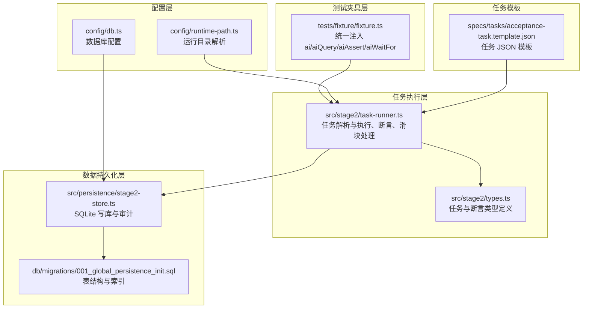
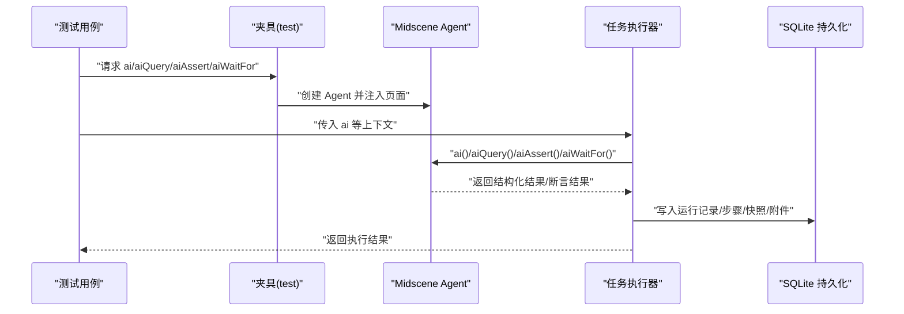
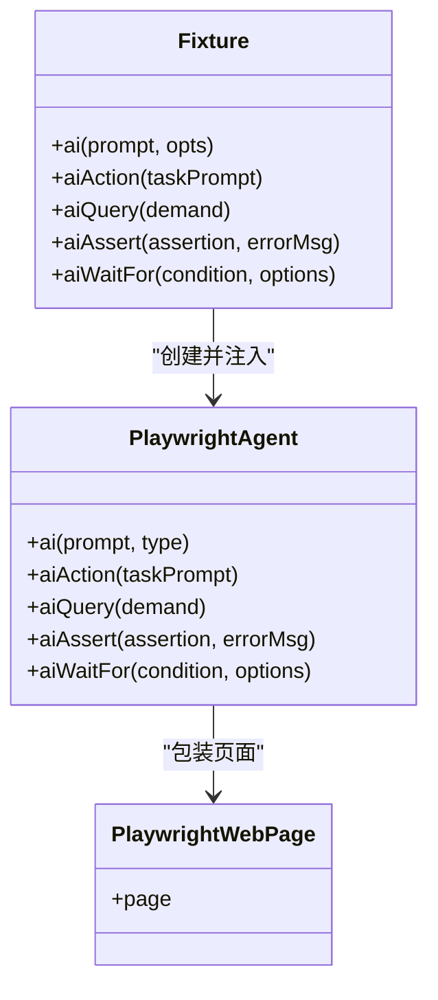
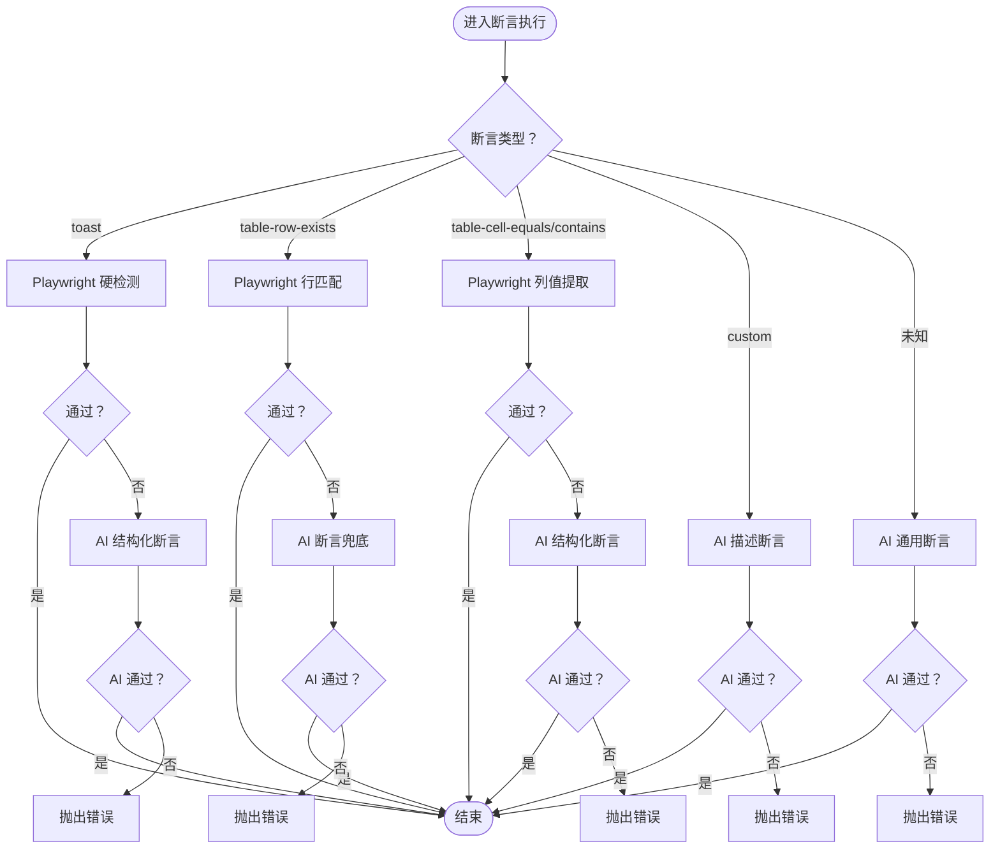
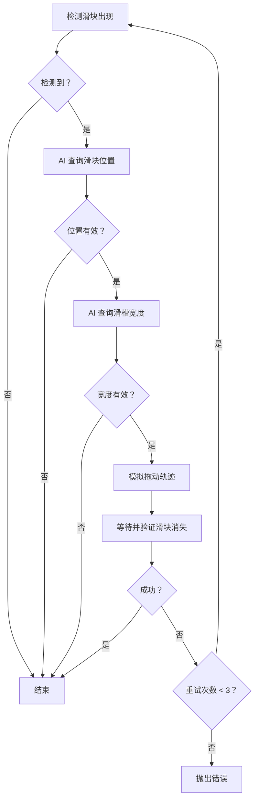
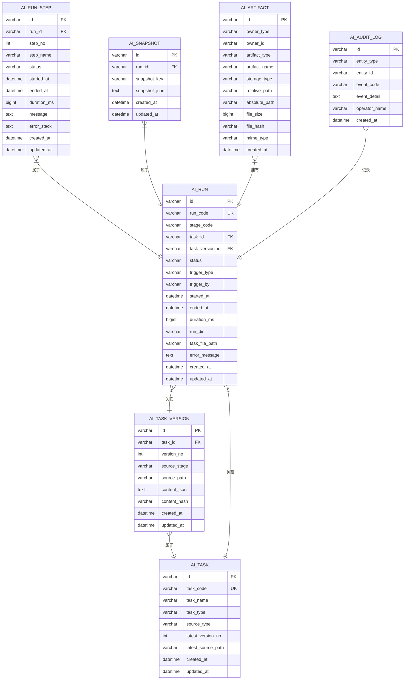
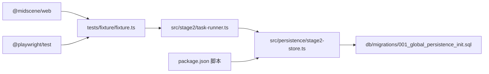

# AI 集成模块

<cite>
**本文引用的文件**
- [README.md](file://README.md)
- [package.json](file://package.json)
- [tests/fixture/fixture.ts](file://tests/fixture/fixture.ts)
- [tests/generated/stage2-acceptance-runner.spec.ts](file://tests/generated/stage2-acceptance-runner.spec.ts)
- [src/stage2/task-runner.ts](file://src/stage2/task-runner.ts)
- [src/stage2/types.ts](file://src/stage2/types.ts)
- [src/persistence/stage2-store.ts](file://src/persistence/stage2-store.ts)
- [config/runtime-path.ts](file://config/runtime-path.ts)
- [config/db.ts](file://config/db.ts)
- [db/migrations/001_global_persistence_init.sql](file://db/migrations/001_global_persistence_init.sql)
- [.tasks/AI自主代理验收系统开发改造方案_2026-03-11.md](file://.tasks/AI自主代理验收系统开发改造方案_2026-03-11.md)
- [specs/tasks/acceptance-task.template.json](file://specs/tasks/acceptance-task.template.json)
</cite>

## 目录
1. [简介](#简介)
2. [项目结构](#项目结构)
3. [核心组件](#核心组件)
4. [架构总览](#架构总览)
5. [详细组件分析](#详细组件分析)
6. [依赖关系分析](#依赖关系分析)
7. [性能考量](#性能考量)
8. [故障排除指南](#故障排除指南)
9. [结论](#结论)
10. [附录](#附录)

## 简介
本文件面向 HI-TEST 项目的 AI 集成模块，系统性阐述基于 Midscene.js 的 AI 能力在自动化测试中的应用，包括 ai、aiQuery、aiAssert、aiWaitFor 的使用方法与最佳实践；页面元素识别、结构化数据提取、智能断言生成的技术实现；以及在动态元素定位、表单字段识别、验证消息提取等场景下的落地方式。文档同时提供运行产物目录、数据库持久化、滑块验证码自动处理等关键机制说明，并给出故障排除与性能优化建议。

## 项目结构
项目采用“测试夹具 + 任务驱动执行 + 数据持久化”的分层组织方式：
- 测试夹具层：封装 Midscene Agent 与 Playwright 页面交互，暴露 ai、aiQuery、aiAssert、aiWaitFor 等能力
- 任务执行层：解析 JSON 任务，按步骤驱动页面交互与断言，内置滑块验证码处理与重试机制
- 数据持久化层：将运行记录、步骤、快照与附件写入 SQLite 数据库，配合迁移脚本与运行目录管理
- 配置层：运行时路径、数据库路径、环境变量统一管理

**图表来源**
- [tests/fixture/fixture.ts:1-100](file://tests/fixture/fixture.ts#L1-L100)
- [src/stage2/task-runner.ts:1-200](file://src/stage2/task-runner.ts#L1-L200)
- [src/stage2/types.ts:1-180](file://src/stage2/types.ts#L1-L180)
- [src/persistence/stage2-store.ts:1-120](file://src/persistence/stage2-store.ts#L1-L120)
- [db/migrations/001_global_persistence_init.sql:1-128](file://db/migrations/001_global_persistence_init.sql#L1-L128)
- [config/runtime-path.ts:1-41](file://config/runtime-path.ts#L1-L41)
- [config/db.ts:1-28](file://config/db.ts#L1-L28)
- [specs/tasks/acceptance-task.template.json:1-141](file://specs/tasks/acceptance-task.template.json#L1-L141)

**章节来源**
- [README.md:132-190](file://README.md#L132-L190)
- [package.json:6-11](file://package.json#L6-L11)

## 核心组件
- 统一夹具注入：在测试夹具中创建 Midscene Agent，将 ai、aiQuery、aiAssert、aiWaitFor 注入到测试上下文，支持缓存、报告与分组管理
- 任务驱动执行：解析 JSON 任务，按步骤执行导航、表单填写、搜索、断言与清理，内置滑块验证码自动处理
- 结构化断言：针对 Toast、表格行/单元格等断言类型，优先使用 Playwright 硬检测，AI 作为兜底与补充
- 数据持久化：将任务、运行、步骤、快照与附件写入 SQLite，支持审计日志与相对路径存储
- 运行产物与目录：统一收敛到 t_runtime/ 下，便于报告与调试

**章节来源**
- [tests/fixture/fixture.ts:23-99](file://tests/fixture/fixture.ts#L23-L99)
- [src/stage2/task-runner.ts:1562-1917](file://src/stage2/task-runner.ts#L1562-L1917)
- [src/persistence/stage2-store.ts:74-123](file://src/persistence/stage2-store.ts#L74-L123)
- [README.md:76-96](file://README.md#L76-L96)

## 架构总览
AI 集成在项目中的工作流如下：
- 测试入口加载夹具，注入 AI 能力
- 任务执行器读取 JSON 任务，逐步骤驱动页面交互
- 对断言进行硬检测优先策略，失败时使用 AI 查询/断言兜底
- 运行期间写入数据库与产物目录，支持回溯与审计

**图表来源**
- [tests/fixture/fixture.ts:23-99](file://tests/fixture/fixture.ts#L23-L99)
- [tests/generated/stage2-acceptance-runner.spec.ts:12-37](file://tests/generated/stage2-acceptance-runner.spec.ts#L12-L37)
- [src/stage2/task-runner.ts:1562-1917](file://src/stage2/task-runner.ts#L1562-L1917)
- [src/persistence/stage2-store.ts:470-630](file://src/persistence/stage2-store.ts#L470-L630)

## 详细组件分析

### 夹具与 AI 能力注入
- 统一创建 Midscene Agent，设置 testId、cacheId、groupName、groupDescription，开启报告生成
- 暴露 ai、aiAction、aiQuery、aiAssert、aiWaitFor 五类能力，支持 action/query 类型区分
- 设置日志目录到运行时路径，保证报告与缓存可追踪

**图表来源**
- [tests/fixture/fixture.ts:23-99](file://tests/fixture/fixture.ts#L23-L99)

**章节来源**
- [tests/fixture/fixture.ts:10-100](file://tests/fixture/fixture.ts#L10-L100)

### 任务执行与断言策略
- 断言优先策略：Toast 与表格断言优先使用 Playwright 硬检测；失败时降级为 AI 结构化断言
- 重试机制：断言执行器支持重试次数与延迟，提升鲁棒性
- 通用断言：未知断言类型时，使用 aiQuery 返回结构化结果进行判断

**图表来源**
- [src/stage2/task-runner.ts:1562-1917](file://src/stage2/task-runner.ts#L1562-L1917)

**章节来源**
- [src/stage2/task-runner.ts:1532-1556](file://src/stage2/task-runner.ts#L1532-L1556)
- [src/stage2/task-runner.ts:1562-1917](file://src/stage2/task-runner.ts#L1562-L1917)

### 滑块验证码自动处理
- 检测策略：通过文本与选择器组合检测滑块出现
- AI 查询：使用 aiQuery 获取滑块位置与滑槽宽度
- 拖动模拟：15 步缓动轨迹 + 随机抖动，模拟真人拖动
- 结果验证：最多重试 3 次，滑块消失则视为成功

**图表来源**
- [src/stage2/task-runner.ts:483-706](file://src/stage2/task-runner.ts#L483-L706)
- [src/stage2/task-runner.ts:510-559](file://src/stage2/task-runner.ts#L510-L559)
- [src/stage2/task-runner.ts:561-648](file://src/stage2/task-runner.ts#L561-L648)

**章节来源**
- [README.md:64-75](file://README.md#L64-L75)
- [src/stage2/task-runner.ts:483-706](file://src/stage2/task-runner.ts#L483-L706)

### 数据持久化与运行产物
- 写库服务：负责任务、版本、运行、步骤、快照、附件与审计日志的写入
- 敏感信息掩码：任务 JSON 中的密码字段在入库前被掩码处理
- 产物目录：运行产物统一收敛到 t_runtime/ 下，便于报告与回溯

**图表来源**
- [db/migrations/001_global_persistence_init.sql:1-128](file://db/migrations/001_global_persistence_init.sql#L1-L128)
- [src/persistence/stage2-store.ts:135-331](file://src/persistence/stage2-store.ts#L135-L331)

**章节来源**
- [README.md:97-131](file://README.md#L97-L131)
- [src/persistence/stage2-store.ts:74-123](file://src/persistence/stage2-store.ts#L74-L123)
- [config/db.ts:15-27](file://config/db.ts#L15-L27)
- [config/runtime-path.ts:38-40](file://config/runtime-path.ts#L38-L40)

### 任务 JSON 模型与断言类型
- 任务模型：目标站点、账户、导航、UI 配置、表单、搜索、断言、清理、运行参数等
- 断言类型：toast、table-row-exists、table-cell-equals、table-cell-contains、custom 等
- 断言参数：超时、重试、软断言、行匹配模式、列值映射等

**章节来源**
- [src/stage2/types.ts:141-180](file://src/stage2/types.ts#L141-L180)
- [specs/tasks/acceptance-task.template.json:75-106](file://specs/tasks/acceptance-task.template.json#L75-L106)

## 依赖关系分析
- 夹具依赖 Midscene Web 与 Playwright，提供 AI 能力与页面包装
- 任务执行器依赖夹具提供的 ai/aiQuery/aiAssert/aiWaitFor，以及运行时路径与持久化服务
- 持久化服务依赖 SQLite 与迁移脚本，提供结构化数据落库
- package 脚本提供数据库初始化与迁移命令，简化部署

**图表来源**
- [package.json:15-24](file://package.json#L15-L24)
- [tests/fixture/fixture.ts:1-10](file://tests/fixture/fixture.ts#L1-L10)
- [src/stage2/task-runner.ts:1-16](file://src/stage2/task-runner.ts#L1-L16)
- [src/persistence/stage2-store.ts:1-13](file://src/persistence/stage2-store.ts#L1-L13)
- [db/migrations/001_global_persistence_init.sql:1-128](file://db/migrations/001_global_persistence_init.sql#L1-L128)
- [package.json:7-10](file://package.json#L7-L10)

**章节来源**
- [package.json:6-24](file://package.json#L6-L24)

## 性能考量
- 步骤拆分：将长流程拆分为多个小步骤，降低单次 Prompt 复杂度，便于重试与定位问题
- 硬检测优先：优先使用 Playwright 的硬检测与定位，AI 仅作为兜底，减少 LLM 调用次数
- 缓存与报告：启用 Midscene 缓存与报告，避免重复计算与截图
- 重试策略：合理设置断言重试次数与延迟，平衡稳定性与执行时长
- 目录收敛：统一运行产物目录，减少 IO 开销与磁盘碎片

**章节来源**
- [.tasks/AI自主代理验收系统开发改造方案_2026-03-11.md:60-84](file://.tasks/AI自主代理验收系统开发改造方案_2026-03-11.md#L60-L84)
- [README.md:146-153](file://README.md#L146-L153)

## 故障排除指南
- 滑块验证码处理失败
  - 现象：自动拖动后滑块仍未消失
  - 排查：检查滑块检测选择器与文本模式、AI 查询结果、拖动轨迹参数
  - 处理：调整为 manual 模式或增大等待时间，必要时切换为 fail 模式快速失败
- AI 断言不稳定
  - 现象：aiAssert 或 aiQuery 结果波动
  - 排查：检查 Prompt 清晰度、结构化返回格式、重试次数与延迟
  - 处理：优先使用 Playwright 硬检测，AI 仅作为兜底与补充
- 数据库写入异常
  - 现象：持久化失败或数据不一致
  - 排查：确认数据库文件路径、权限、迁移脚本执行情况
  - 处理：重新执行初始化与迁移脚本，检查日志输出
- 运行产物缺失
  - 现象：报告或截图未生成
  - 排查：确认运行目录配置、权限与磁盘空间
  - 处理：检查 .env 中目录变量，确保路径存在且可写

**章节来源**
- [src/stage2/task-runner.ts:650-706](file://src/stage2/task-runner.ts#L650-L706)
- [src/persistence/stage2-store.ts:125-133](file://src/persistence/stage2-store.ts#L125-L133)
- [README.md:76-96](file://README.md#L76-L96)

## 结论
HI-TEST 项目通过统一夹具与任务驱动执行，将 Midscene 的 AI 能力深度融入 Playwright 自动化测试流程。在断言策略上坚持“硬检测优先 + AI 兜底”，在滑块验证码场景实现了高可用的自动处理。配合 SQLite 数据持久化与统一运行产物目录，项目具备良好的可观测性与可维护性。建议在实际使用中遵循“步骤拆分、硬检测优先、结构化断言”的最佳实践，持续优化 Prompt 与重试策略，以获得更稳定的执行效果。

## 附录
- 运行命令与入口
  - 第二段执行：npx playwright test tests/generated/stage2-acceptance-runner.spec.ts --project=chromium [--headed]
  - 数据库初始化与迁移：npm run db:init / npm run db:migrate
- 关键环境变量
  - OPENAI_API_KEY、OPENAI_BASE_URL、MIDSCENE_MODEL_NAME、RUNTIME_DIR_PREFIX、PLAYWRIGHT_OUTPUT_DIR、PLAYWRIGHT_HTML_REPORT_DIR、MIDSCENE_RUN_DIR、ACCEPTANCE_RESULT_DIR、DB_DRIVER、DB_FILE_PATH、STAGE2_TASK_FILE、STAGE2_REQUIRE_APPROVAL、STAGE2_CAPTCHA_MODE、STAGE2_CAPTCHA_WAIT_TIMEOUT_MS

**章节来源**
- [README.md:39-54](file://README.md#L39-L54)
- [README.md:154-179](file://README.md#L154-L179)
- [package.json:6-10](file://package.json#L6-L10)