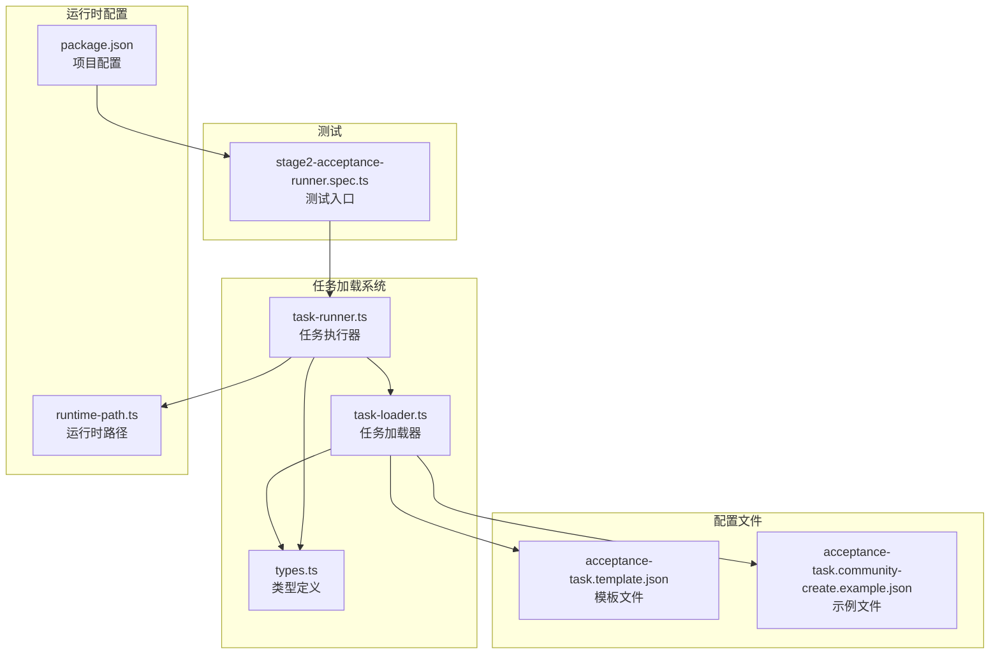
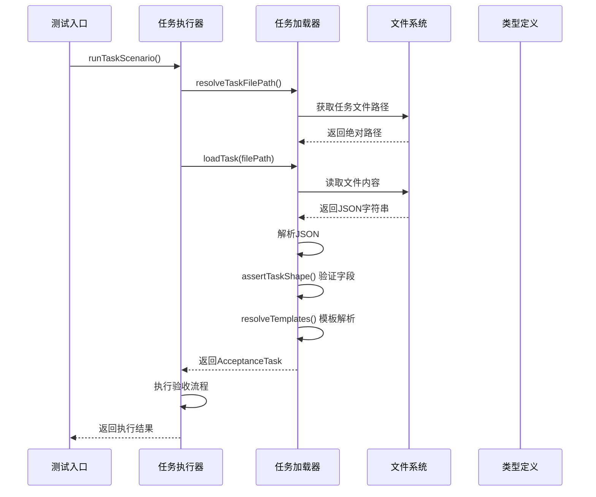
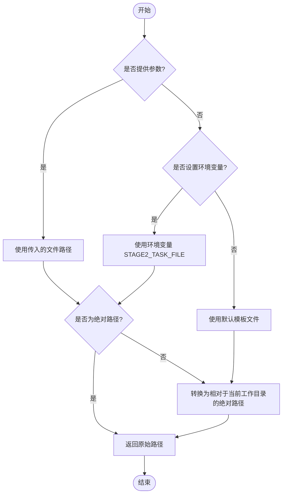
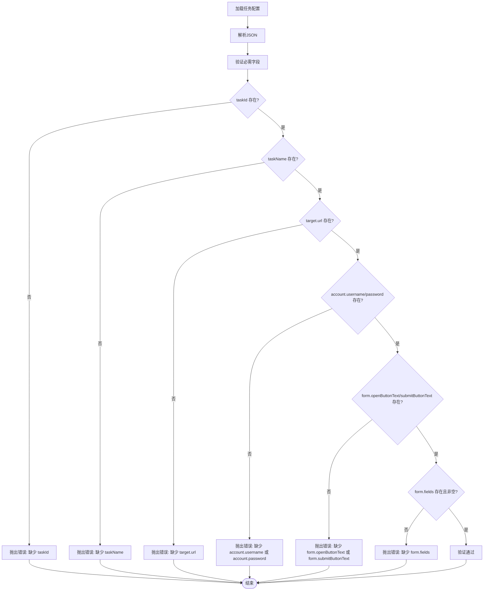
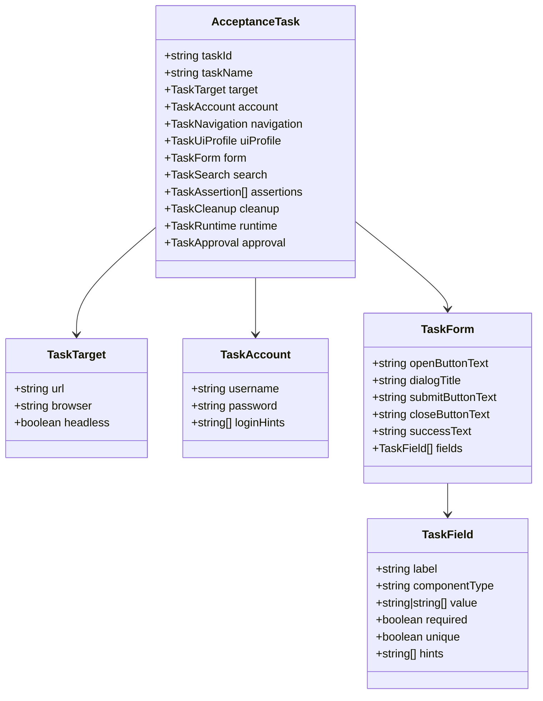
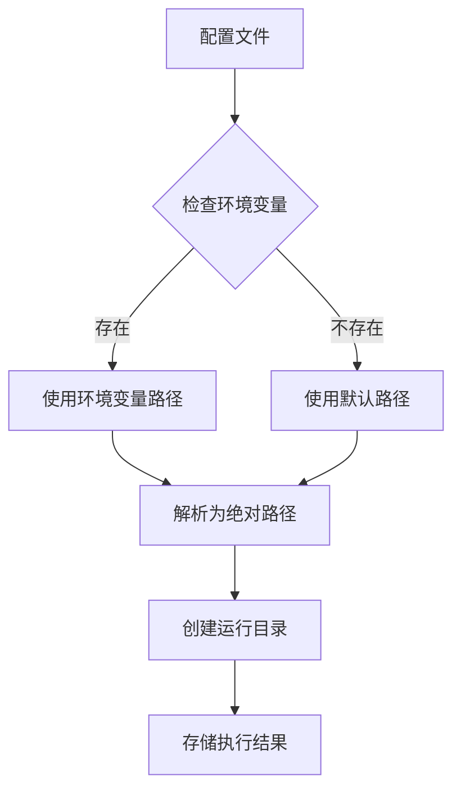
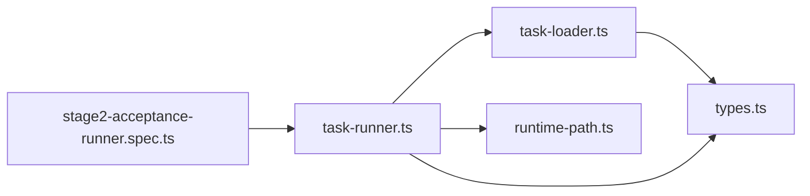

# 任务加载系统

<cite>
**本文引用的文件**
- [task-loader.ts](file://src/stage2/task-loader.ts)
- [types.ts](file://src/stage2/types.ts)
- [task-runner.ts](file://src/stage2/task-runner.ts)
- [acceptance-task.template.json](file://specs/tasks/acceptance-task.template.json)
- [acceptance-task.community-create.example.json](file://specs/tasks/acceptance-task.community-create.example.json)
- [runtime-path.ts](file://config/runtime-path.ts)
- [stage2-acceptance-runner.spec.ts](file://tests/generated/stage2-acceptance-runner.spec.ts)
- [package.json](file://package.json)
</cite>

## 目录
1. [简介](#简介)
2. [项目结构](#项目结构)
3. [核心组件](#核心组件)
4. [架构概览](#架构概览)
5. [详细组件分析](#详细组件分析)
6. [依赖关系分析](#依赖关系分析)
7. [性能考虑](#性能考虑)
8. [故障排除指南](#故障排除指南)
9. [结论](#结论)
10. [附录](#附录)

## 简介
HI-TEST 项目的任务加载系统是第二阶段验收测试的核心基础设施，负责从 JSON 配置文件中加载和解析验收任务，确保任务配置的完整性和有效性。该系统提供了强大的模板解析能力、严格的字段验证机制和灵活的任务路径解析功能。

系统主要包含三个核心模块：
- **TaskLoader**：负责任务配置文件的加载、解析和验证
- **AcceptanceTask 类型系统**：定义了完整的任务配置数据结构
- **任务执行器**：基于加载的任务配置执行自动化验收流程

## 项目结构
任务加载系统位于 `src/stage2/` 目录下，采用清晰的模块化设计：



**图表来源**
- [task-loader.ts:1-91](file://src/stage2/task-loader.ts#L1-L91)
- [task-runner.ts:1-800](file://src/stage2/task-runner.ts#L1-L800)
- [types.ts:1-180](file://src/stage2/types.ts#L1-L180)

**章节来源**
- [task-loader.ts:1-91](file://src/stage2/task-loader.ts#L1-L91)
- [task-runner.ts:1-800](file://src/stage2/task-runner.ts#L1-L800)
- [types.ts:1-180](file://src/stage2/types.ts#L1-L180)

## 核心组件
任务加载系统由以下核心组件构成：

### 1. 任务加载器 (TaskLoader)
负责从文件系统加载和解析任务配置，提供模板解析和字段验证功能。

### 2. AcceptanceTask 类型系统
定义了完整的任务配置数据结构，包括目标环境、账户信息、表单配置、断言规则等。

### 3. 任务执行器
基于加载的任务配置执行完整的验收流程，包括页面导航、表单填写、断言验证和数据清理。

**章节来源**
- [task-loader.ts:79-89](file://src/stage2/task-loader.ts#L79-L89)
- [types.ts:141-154](file://src/stage2/types.ts#L141-L154)
- [task-runner.ts:2318-2399](file://src/stage2/task-runner.ts#L2318-L2399)

## 架构概览
任务加载系统采用分层架构设计，确保职责分离和代码可维护性：



**图表来源**
- [task-runner.ts:2318-2399](file://src/stage2/task-runner.ts#L2318-L2399)
- [task-loader.ts:71-89](file://src/stage2/task-loader.ts#L71-L89)

## 详细组件分析

### 任务加载器 (TaskLoader) 分析

#### 核心功能实现

**1. 任务文件路径解析机制**


**图表来源**
- [task-loader.ts:71-77](file://src/stage2/task-loader.ts#L71-L77)

**2. 模板解析系统**
系统支持两种模板解析机制：

- **NOW_YYYYMMDDHHMMSS 时间戳模板**：用于生成唯一的时间戳
- **环境变量模板**：通过 `${VAR_NAME}` 语法解析环境变量

**3. 字段验证规则**


**图表来源**
- [task-loader.ts:50-69](file://src/stage2/task-loader.ts#L50-L69)

**章节来源**
- [task-loader.ts:19-48](file://src/stage2/task-loader.ts#L19-L48)
- [task-loader.ts:50-69](file://src/stage2/task-loader.ts#L50-L69)
- [task-loader.ts:71-89](file://src/stage2/task-loader.ts#L71-L89)

#### AcceptanceTask 类型定义

**1. 核心接口结构**


**图表来源**
- [types.ts:5-154](file://src/stage2/types.ts#L5-L154)

**2. 字段验证规则详解**

| 字段类别 | 必需字段 | 验证规则 | 默认值 |
|---------|---------|---------|--------|
| 任务基本信息 | taskId, taskName | 非空字符串 | 无 |
| 目标环境 | target.url | 必需，有效URL | 无 |
| 账户信息 | account.username, account.password | 必需，非空 | 无 |
| 表单配置 | form.openButtonText, form.submitButtonText | 必需 | 无 |
| 表单字段 | form.fields | 必需且非空 | 无 |

**章节来源**
- [types.ts:141-154](file://src/stage2/types.ts#L141-L154)
- [task-loader.ts:50-69](file://src/stage2/task-loader.ts#L50-L69)

### 任务配置文件分析

#### 模板文件 (acceptance-task.template.json)
模板文件提供了完整的配置结构示例，包含以下关键特性：

**1. 环境变量模板支持**
```json
{
  "account": {
    "username": "${TEST_USERNAME}",
    "password": "${TEST_PASSWORD}"
  }
}
```

**2. 动态时间戳模板**
```json
{
  "form": {
    "fields": [
      {
        "value": "AI验收小区_${NOW_YYYYMMDDHHMMSS}"
      }
    ]
  }
}
```

**3. 完整配置示例**
模板文件展示了所有可选配置项的完整结构，包括：
- UI配置文件选择器
- 断言规则配置
- 数据清理策略
- 运行时参数

**章节来源**
- [acceptance-task.template.json:1-141](file://specs/tasks/acceptance-task.template.json#L1-L141)

#### 示例文件 (acceptance-task.community-create.example.json)
示例文件提供了具体业务场景的配置实现：

**1. 业务场景配置**
- 物业平台小区管理
- 多种表单组件类型
- 完整的断言验证规则

**2. 高级特性示例**
- 级联选择器配置
- 复杂断言组合
- 自定义清理策略

**章节来源**
- [acceptance-task.community-create.example.json:1-229](file://specs/tasks/acceptance-task.community-create.example.json#L1-L229)

### 任务执行器集成

#### 运行时路径解析


**图表来源**
- [runtime-path.ts:38-40](file://config/runtime-path.ts#L38-L40)

**章节来源**
- [task-runner.ts:2318-2399](file://src/stage2/task-runner.ts#L2318-L2399)
- [runtime-path.ts:1-41](file://config/runtime-path.ts#L1-L41)

## 依赖关系分析

### 外部依赖
任务加载系统依赖以下关键包：

```mermaid
graph TB
subgraph "核心依赖"
FS[fs 模块]
PATH[path 模块]
DOTENV[dotenv]
end
subgraph "测试框架"
PW[@playwright/test]
TESTS[测试套件]
end
subgraph "AI集成"
MIDSCENE[@midscene/web]
MCP[@executeautomation/playwright-mcp-server]
end
TL[task-loader.ts] --> FS
TL --> PATH
TL --> DOTENV
TR[task-runner.ts] --> PW
TR --> MIDSCENE
TR --> MCP
TESTS --> TR
```

**图表来源**
- [package.json:15-24](file://package.json#L15-L24)

### 内部模块依赖


**图表来源**
- [task-runner.ts:1-16](file://src/stage2/task-runner.ts#L1-L16)

**章节来源**
- [package.json:15-24](file://package.json#L15-L24)
- [task-runner.ts:1-16](file://src/stage2/task-runner.ts#L1-L16)

## 性能考虑

### 1. 文件I/O优化
- 使用同步文件读取确保配置加载的原子性
- 缓存解析后的任务对象避免重复解析
- 模板解析结果缓存减少重复计算

### 2. 内存管理
- 任务配置对象生命周期管理
- 运行时结果存储优化
- 截图文件管理策略

### 3. 错误处理优化
- 早期失败检测
- 详细的错误信息提供
- 资源清理机制

## 故障排除指南

### 常见问题及解决方案

**1. 任务文件路径问题**
- **问题**：找不到任务文件
- **原因**：相对路径解析错误
- **解决**：检查 `STAGE2_TASK_FILE` 环境变量或使用绝对路径

**2. 配置验证失败**
- **问题**：字段缺失或格式错误
- **原因**：必需字段未配置
- **解决**：参考模板文件完善配置

**3. 模板解析错误**
- **问题**：环境变量未定义
- **原因**：模板中使用的环境变量未设置
- **解决**：在 `.env` 文件中设置所需环境变量

**4. 执行权限问题**
- **问题**：任务需要人工审批
- **原因**：`STAGE2_REQUIRE_APPROVAL=true`
- **解决**：在任务配置中添加审批信息

**章节来源**
- [task-loader.ts:79-89](file://src/stage2/task-loader.ts#L79-L89)
- [task-runner.ts:2325-2330](file://src/stage2/task-runner.ts#L2325-L2330)

## 结论
HI-TEST 项目的任务加载系统通过精心设计的架构实现了高度可配置的验收测试自动化。系统的主要优势包括：

1. **强类型约束**：通过 TypeScript 接口确保配置的完整性
2. **灵活的模板系统**：支持环境变量和动态时间戳
3. **严格的验证机制**：确保任务配置的有效性
4. **模块化设计**：职责分离，易于维护和扩展
5. **完善的错误处理**：提供详细的错误信息和恢复策略

该系统为后续的 AI 集成和自动化测试提供了坚实的基础，能够支持复杂的业务场景和多样化的测试需求。

## 附录

### 最佳实践指南

**1. 任务配置最佳实践**
- 使用模板文件作为配置起点
- 合理设置断言超时时间和重试次数
- 为关键字段提供详细的提示信息
- 配置适当的清理策略

**2. 环境变量管理**
- 在 `.env` 文件中集中管理敏感信息
- 使用有意义的变量命名
- 定期更新和轮换凭据

**3. 路径配置建议**
- 使用相对路径便于项目移植
- 配置合理的运行时目录结构
- 确保文件权限正确设置

**4. 监控和调试**
- 启用必要的日志记录
- 定期检查执行结果
- 建立问题跟踪机制