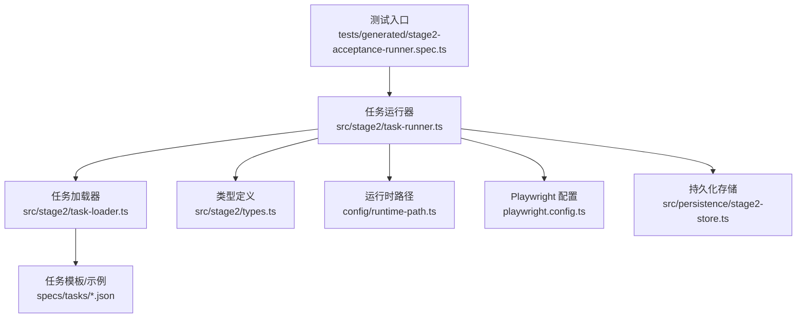
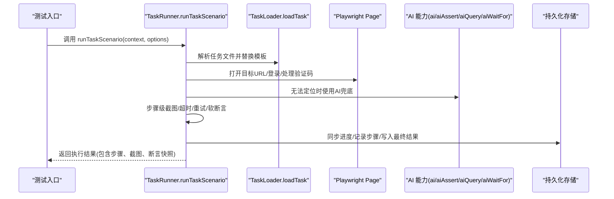
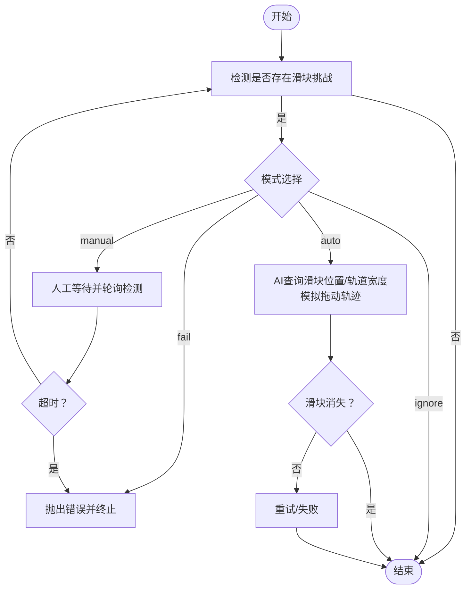
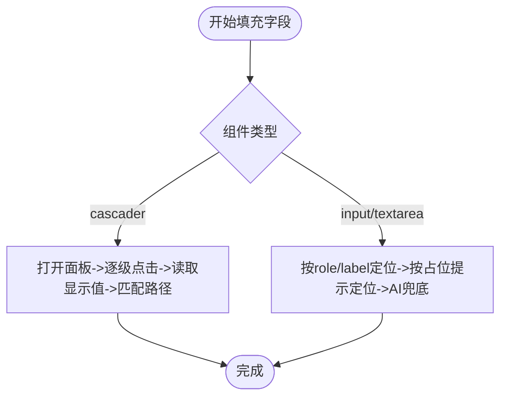
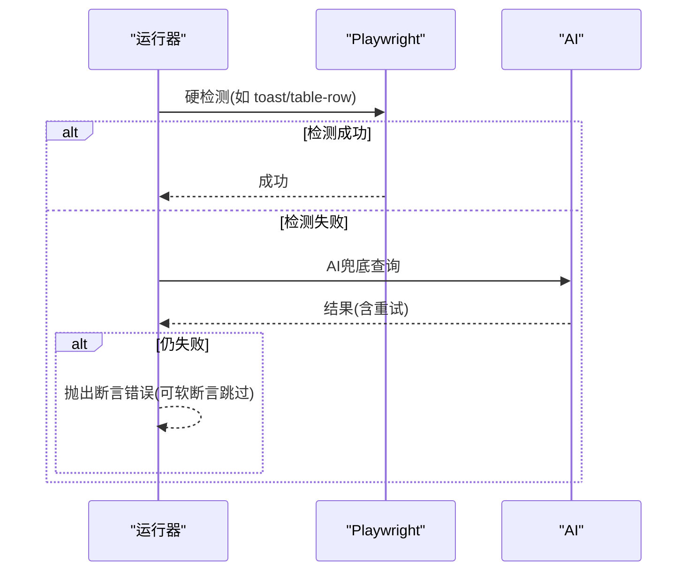
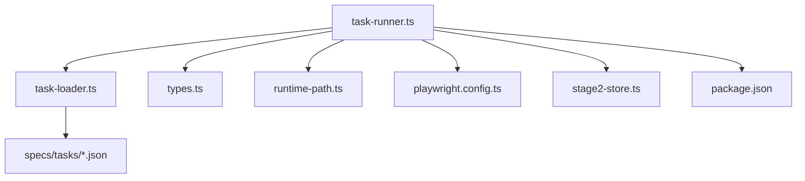

# 任务执行引擎

<cite>
**本文引用的文件**
- [src/stage2/task-runner.ts](file://src/stage2/task-runner.ts)
- [src/stage2/task-loader.ts](file://src/stage2/task-loader.ts)
- [src/stage2/types.ts](file://src/stage2/types.ts)
- [specs/tasks/acceptance-task.template.json](file://specs/tasks/acceptance-task.template.json)
- [specs/tasks/acceptance-task.community-create.example.json](file://specs/tasks/acceptance-task.community-create.example.json)
- [config/runtime-path.ts](file://config/runtime-path.ts)
- [playwright.config.ts](file://playwright.config.ts)
- [tests/generated/stage2-acceptance-runner.spec.ts](file://tests/generated/stage2-acceptance-runner.spec.ts)
- [package.json](file://package.json)
- [src/persistence/stage2-store.ts](file://src/persistence/stage2-store.ts)
</cite>

## 目录
1. [简介](#简介)
2. [项目结构](#项目结构)
3. [核心组件](#核心组件)
4. [架构总览](#架构总览)
5. [详细组件分析](#详细组件分析)
6. [依赖关系分析](#依赖关系分析)
7. [性能考虑](#性能考虑)
8. [故障排查指南](#故障排查指南)
9. [结论](#结论)
10. [附录](#附录)

## 简介
本文件面向 HI-TEST 项目的任务执行引擎，系统性阐述 TaskRunner 的设计与实现，覆盖任务加载、页面自动化执行、步骤处理、结果收集、验证码处理（滑块自动识别与拖动）、动态表单字段解析与填充、多断言机制、执行上下文与超时控制、错误处理与重试策略，并提供 runTaskScenario API 的使用说明、配置项解读与最佳实践。

## 项目结构
- 任务定义与模板：位于 specs/tasks 下，包含社区创建任务示例与通用模板，驱动执行引擎按 JSON 描述进行端到端自动化。
- 执行引擎：src/stage2 下包含任务加载器、运行器与类型定义，负责从 JSON 解析任务、驱动 Playwright 与 AI 能力执行页面动作、断言与清理。
- 运行时路径与报告：config/runtime-path.ts 定义输出目录，playwright.config.ts 配置 Playwright 报告与追踪。
- 测试入口：tests/generated/stage2-acceptance-runner.spec.ts 作为 Playwright 测试入口，调用 runTaskScenario 执行任务。
- 持久化：src/persistence/stage2-store.ts 将执行过程与结果写入本地 SQLite，便于审计与回溯。

图表来源
- [tests/generated/stage2-acceptance-runner.spec.ts:12-37](file://tests/generated/stage2-acceptance-runner.spec.ts#L12-L37)
- [src/stage2/task-runner.ts:2318-2656](file://src/stage2/task-runner.ts#L2318-L2656)
- [src/stage2/task-loader.ts:71-89](file://src/stage2/task-loader.ts#L71-L89)
- [config/runtime-path.ts:33-40](file://config/runtime-path.ts#L33-L40)
- [playwright.config.ts:22-94](file://playwright.config.ts#L22-L94)
- [src/persistence/stage2-store.ts:101-123](file://src/persistence/stage2-store.ts#L101-L123)

章节来源
- [tests/generated/stage2-acceptance-runner.spec.ts:12-37](file://tests/generated/stage2-acceptance-runner.spec.ts#L12-L37)
- [src/stage2/task-runner.ts:2318-2656](file://src/stage2/task-runner.ts#L2318-L2656)
- [src/stage2/task-loader.ts:71-89](file://src/stage2/task-loader.ts#L71-L89)
- [config/runtime-path.ts:33-40](file://config/runtime-path.ts#L33-L40)
- [playwright.config.ts:22-94](file://playwright.config.ts#L22-L94)
- [src/persistence/stage2-store.ts:101-123](file://src/persistence/stage2-store.ts#L101-L123)

## 核心组件
- 任务运行器（TaskRunner）：提供 runTaskScenario API，串联打开首页、登录、处理验证码、导航菜单、打开表单弹窗、填写字段、提交表单、断言、清理等步骤，内置步骤级超时、截图、重试与软断言支持。
- 任务加载器（TaskLoader）：解析任务 JSON，替换模板变量（NOW_YYYYMMDDHHMMSS、环境变量），校验必要字段，输出可执行任务对象。
- 类型系统（Types）：定义 AcceptanceTask、TaskAssertion、TaskCleanup、TaskRuntime 等核心数据模型，约束断言与清理行为。
- 验证码处理：检测滑块验证码，支持自动拖动（AI+Playwright）与人工等待两种模式，具备超时控制与重试。
- 动态表单解析与填充：基于字段标签、占位提示、弹窗上下文与组件类型（含级联选择器）进行高鲁棒性定位与填充。
- 多断言机制：Toast、表格行存在、单元格相等/包含、自定义描述断言，均采用 Playwright 硬检测优先 + AI 兜底 + 可配置重试。
- 执行上下文与持久化：封装 RunnerContext（page、ai、aiAssert、aiQuery、aiWaitFor），将执行进度与结果写入 SQLite 并生成本地产物。

章节来源
- [src/stage2/task-runner.ts:2318-2656](file://src/stage2/task-runner.ts#L2318-L2656)
- [src/stage2/task-loader.ts:71-89](file://src/stage2/task-loader.ts#L71-L89)
- [src/stage2/types.ts:141-179](file://src/stage2/types.ts#L141-L179)

## 架构总览

图表来源
- [tests/generated/stage2-acceptance-runner.spec.ts:12-37](file://tests/generated/stage2-acceptance-runner.spec.ts#L12-L37)
- [src/stage2/task-runner.ts:2318-2656](file://src/stage2/task-runner.ts#L2318-L2656)
- [src/stage2/task-loader.ts:71-89](file://src/stage2/task-loader.ts#L71-L89)
- [src/persistence/stage2-store.ts:470-630](file://src/persistence/stage2-store.ts#L470-L630)

## 详细组件分析

### 任务加载与模板解析
- 任务文件路径解析：支持传参、环境变量、默认模板路径。
- 模板变量替换：NOW_YYYYMMDDHHMMSS、环境变量占位符替换。
- 任务形状校验：校验 taskId、taskName、target.url、账号、表单按钮、字段等关键字段。
- 输出：标准化后的 AcceptanceTask 对象，供运行器直接消费。

章节来源
- [src/stage2/task-loader.ts:71-89](file://src/stage2/task-loader.ts#L71-L89)
- [specs/tasks/acceptance-task.template.json:1-141](file://specs/tasks/acceptance-task.template.json#L1-L141)
- [specs/tasks/acceptance-task.community-create.example.json:1-229](file://specs/tasks/acceptance-task.community-create.example.json#L1-L229)

### 执行上下文与运行器入口
- RunnerContext：封装 page、ai、aiAssert、aiQuery、aiWaitFor。
- runTaskScenario：主流程编排，包含步骤注册、截图、超时、软断言、清理与持久化。
- 步骤注册 runStep：统一处理步骤执行、失败截图、错误信息与持续写盘，支持 required=false 的软断言。

章节来源
- [src/stage2/task-runner.ts:2318-2656](file://src/stage2/task-runner.ts#L2318-L2656)

### 验证码处理机制（滑块自动识别与拖动）
- 检测策略：基于文案与常见选择器组合判断是否存在滑块挑战。
- 模式控制：支持 auto（自动拖动）、fail（直接报错）、ignore（忽略）、manual（人工等待）。
- 自动拖动：通过 AI 查询滑块位置与轨道宽度，模拟拖动轨迹（缓动+抖动），并验证滑块消失。
- 人工等待：在超时时间内轮询检测，超时则抛出错误。
- 超时控制：可通过环境变量配置等待时长。

图表来源
- [src/stage2/task-runner.ts:650-706](file://src/stage2/task-runner.ts#L650-L706)
- [src/stage2/task-runner.ts:561-648](file://src/stage2/task-runner.ts#L561-L648)

章节来源
- [src/stage2/task-runner.ts:55-75](file://src/stage2/task-runner.ts#L55-L75)
- [src/stage2/task-runner.ts:77-87](file://src/stage2/task-runner.ts#L77-L87)
- [src/stage2/task-runner.ts:483-501](file://src/stage2/task-runner.ts#L483-L501)
- [src/stage2/task-runner.ts:561-648](file://src/stage2/task-runner.ts#L561-L648)
- [src/stage2/task-runner.ts:650-706](file://src/stage2/task-runner.ts#L650-L706)

### 动态表单字段解析与填充
- 级联选择器（cascader）：构建候选定位器，打开面板、逐级点击选项、读取显示值并匹配期望路径，支持多次重试与截图记录。
- 文本输入：优先按 role/label 定位，其次按占位提示定位，最后通过 AI 兜底。
- 弹窗上下文：在活动弹窗内优先定位，提升准确性。
- 校验提示收集：收集表单错误提示，反向推导需修复字段并自动补填。

图表来源
- [src/stage2/task-runner.ts:897-974](file://src/stage2/task-runner.ts#L897-L974)
- [src/stage2/task-runner.ts:207-228](file://src/stage2/task-runner.ts#L207-L228)
- [src/stage2/task-runner.ts:312-336](file://src/stage2/task-runner.ts#L312-L336)
- [src/stage2/task-runner.ts:338-407](file://src/stage2/task-runner.ts#L338-L407)

章节来源
- [src/stage2/task-runner.ts:207-228](file://src/stage2/task-runner.ts#L207-L228)
- [src/stage2/task-runner.ts:279-290](file://src/stage2/task-runner.ts#L279-L290)
- [src/stage2/task-runner.ts:338-407](file://src/stage2/task-runner.ts#L338-L407)
- [src/stage2/task-runner.ts:897-974](file://src/stage2/task-runner.ts#L897-L974)

### 提交与自动修复（表单校验提示）
- 点击提交按钮，若弹窗未关闭，则收集校验提示，解析出需修复字段并自动补填，最多重试若干次。
- 若多次重试后仍无法关闭弹窗，抛出错误并附带最终提示集合。

章节来源
- [src/stage2/task-runner.ts:976-1021](file://src/stage2/task-runner.ts#L976-L1021)
- [src/stage2/task-runner.ts:338-407](file://src/stage2/task-runner.ts#L338-L407)

### 多断言机制（Playwright 硬检测 + AI 兜底 + 重试）
- 断言类型：
  - toast：检测 Toast/通知类提示。
  - table-row-exists：检测表格行是否存在（支持精确/包含匹配）。
  - table-cell-equals：提取行并比对多个列值（支持结构化分隔符）。
  - table-cell-contains：检测某列包含期望值。
  - custom：自定义描述断言。
- 执行策略：Playwright 硬检测优先，失败则使用 AI 查询并重试，支持软断言（失败不中断）。
- 重试与轮询：统一的重试器与轮询间隔，保证稳定性。

图表来源
- [src/stage2/task-runner.ts:1027-1058](file://src/stage2/task-runner.ts#L1027-L1058)
- [src/stage2/task-runner.ts:1562-1917](file://src/stage2/task-runner.ts#L1562-L1917)

章节来源
- [src/stage2/task-runner.ts:1027-1058](file://src/stage2/task-runner.ts#L1027-L1058)
- [src/stage2/task-runner.ts:1562-1917](file://src/stage2/task-runner.ts#L1562-L1917)

### 数据清理（删除/自定义清理）
- 支持策略：仅删除本次新增、删除所有匹配、自定义清理。
- 定位方式：表格行匹配（精确/包含），支持搜索前置定位。
- 确认弹窗处理：通过容器与按钮文案定位确认按钮。
- 成功验证：可选校验删除后目标行是否消失或检测成功提示。
- 错误处理：failOnError 控制清理失败是否中断任务。

章节来源
- [src/stage2/task-runner.ts:1920-2316](file://src/stage2/task-runner.ts#L1920-L2316)

### 执行上下文管理、超时控制与错误处理
- 页面超时：withPageTimeout 将 runtime.pageTimeoutMs 注入到页面操作。
- 步骤超时：runStep 内部按 runtime.stepTimeoutMs 控制每个步骤。
- 截图策略：screenshotOnStep=true 时在每步执行前后截图，失败时额外截图。
- 软断言：断言配置 soft=true 时失败不中断，继续后续步骤。
- 持久化：实时写入进度文件与数据库，失败步骤审计日志记录。

章节来源
- [src/stage2/task-runner.ts:122-129](file://src/stage2/task-runner.ts#L122-L129)
- [src/stage2/task-runner.ts:2437-2435](file://src/stage2/task-runner.ts#L2437-L2435)
- [src/persistence/stage2-store.ts:470-630](file://src/persistence/stage2-store.ts#L470-L630)

### runTaskScenario API 使用说明与配置项
- 入口调用：在测试用例中注入 page、ai、aiAssert、aiQuery、aiWaitFor，然后调用 runTaskScenario。
- 关键配置：
  - STAGE2_TASK_FILE：任务文件路径（绝对或相对）。
  - STAGE2_CAPTCHA_MODE：验证码模式（auto/manual/fail/ignore）。
  - STAGE2_CAPTCHA_WAIT_TIMEOUT_MS：验证码等待超时（毫秒）。
  - STAGE2_REQUIRE_APPROVAL：是否要求人工审批（true/false）。
  - RUNTIME_DIR_PREFIX、ACCEPTANCE_RESULT_DIR、PLAYWRIGHT_OUTPUT_DIR、PLAYWRIGHT_HTML_REPORT_DIR：运行时与报告输出目录。
  - PLAYWRIGHT_TRACE：是否开启追踪（由 playwright.config.ts 控制）。
- 返回值：Stage2ExecutionResult，包含任务元信息、执行时间、状态、步骤明细、截图路径、断言快照与持久化结果文件路径。

章节来源
- [tests/generated/stage2-acceptance-runner.spec.ts:12-37](file://tests/generated/stage2-acceptance-runner.spec.ts#L12-L37)
- [src/stage2/task-runner.ts:2318-2656](file://src/stage2/task-runner.ts#L2318-L2656)
- [config/runtime-path.ts:8-40](file://config/runtime-path.ts#L8-L40)
- [playwright.config.ts:22-94](file://playwright.config.ts#L22-L94)

## 依赖关系分析

图表来源
- [src/stage2/task-runner.ts:1-16](file://src/stage2/task-runner.ts#L1-L16)
- [src/stage2/task-loader.ts:1-6](file://src/stage2/task-loader.ts#L1-L6)
- [specs/tasks/acceptance-task.template.json:1-141](file://specs/tasks/acceptance-task.template.json#L1-L141)
- [package.json:6-11](file://package.json#L6-L11)

章节来源
- [src/stage2/task-runner.ts:1-16](file://src/stage2/task-runner.ts#L1-L16)
- [src/stage2/task-loader.ts:1-6](file://src/stage2/task-loader.ts#L1-L6)
- [specs/tasks/acceptance-task.template.json:1-141](file://specs/tasks/acceptance-task.template.json#L1-L141)
- [package.json:6-11](file://package.json#L6-L11)

## 性能考虑
- 重试与轮询：断言与清理均采用有限重试与固定轮询间隔，避免频繁强刷导致资源浪费。
- 截图策略：仅在启用 screenshotOnStep 时截图，且失败时追加截图，减少不必要的 I/O。
- 超时控制：步骤与页面超时可配置，建议结合任务复杂度与网络状况合理设置。
- AI 兜底：仅在定位失败时触发，尽量使用 Playwright 硬检测以降低延迟。
- 数据库写入：进度与结果异步落盘，避免阻塞主线程。

## 故障排查指南
- 验证码问题
  - 现象：滑块挑战长时间不消失。
  - 排查：检查 STAGE2_CAPTCHA_MODE 与 STAGE2_CAPTCHA_WAIT_TIMEOUT_MS；查看自动拖动日志与截图。
  - 处理：切换为 manual 模式或增大等待时间；核对滑块检测选择器。
- 登录/首页加载失败
  - 现象：首页文本未出现或菜单不可见。
  - 排查：确认 target.url、navigation.homeReadyText、menuPath；检查网络与页面稳定性。
- 表单填写失败
  - 现象：字段未填入或级联未选中。
  - 排查：核对字段 label、hints、componentType；检查弹窗上下文；查看 cascader 截图。
- 提交失败
  - 现象：弹窗未关闭或提示未消除。
  - 排查：查看校验提示集合，确认自动修复是否生效；必要时手动干预。
- 断言失败
  - 现象：toast/表格断言失败。
  - 排查：区分 Playwright 与 AI 的差异；检查 matchMode、expectedColumns、expectedColumnFromFields；查看断言详情。
- 清理失败
  - 现象：删除后目标行仍存在或未检测到成功提示。
  - 排查：确认 rowMatchMode、searchBeforeCleanup、verifyAfterCleanup；检查确认弹窗文案。

章节来源
- [src/stage2/task-runner.ts:650-706](file://src/stage2/task-runner.ts#L650-L706)
- [src/stage2/task-runner.ts:976-1021](file://src/stage2/task-runner.ts#L976-L1021)
- [src/stage2/task-runner.ts:1562-1917](file://src/stage2/task-runner.ts#L1562-L1917)
- [src/stage2/task-runner.ts:1920-2316](file://src/stage2/task-runner.ts#L1920-L2316)

## 结论
HI-TEST 任务执行引擎以 JSON 驱动，结合 Playwright 与 AI 能力，实现了从任务加载、页面自动化、表单填充、断言到清理的全链路闭环。其核心优势在于：
- 鲁棒的定位策略与自动修复机制，显著降低页面变更带来的维护成本；
- 多断言与软断言支持，兼顾准确性与可容忍性；
- 完整的执行上下文与持久化能力，便于审计与复盘；
- 可配置的验证码处理与超时控制，适配不同环境与需求。

## 附录

### runTaskScenario 参数与返回
- 参数
  - runner: RunnerContext（page、ai、aiAssert、aiQuery、aiWaitFor）
  - options?: RunnerOptions（rawTaskFilePath 可选）
- 返回
  - Stage2ExecutionResult：包含任务元信息、执行时间、状态、步骤明细、截图路径、断言快照与持久化结果文件路径。

章节来源
- [src/stage2/types.ts:141-179](file://src/stage2/types.ts#L141-L179)
- [src/stage2/task-runner.ts:2318-2656](file://src/stage2/task-runner.ts#L2318-L2656)

### 配置项速查
- 任务与执行
  - STAGE2_TASK_FILE：任务文件路径
  - STAGE2_REQUIRE_APPROVAL：是否要求审批
- 验证码
  - STAGE2_CAPTCHA_MODE：auto/manual/fail/ignore
  - STAGE2_CAPTCHA_WAIT_TIMEOUT_MS：验证码等待超时（毫秒）
- 运行时与报告
  - RUNTIME_DIR_PREFIX：运行时根目录前缀
  - ACCEPTANCE_RESULT_DIR：验收结果目录
  - PLAYWRIGHT_OUTPUT_DIR：Playwright 输出目录
  - PLAYWRIGHT_HTML_REPORT_DIR：HTML 报告目录
  - PLAYWRIGHT_TRACE：追踪策略（由 playwright.config.ts 控制）

章节来源
- [src/stage2/task-runner.ts:2325-2330](file://src/stage2/task-runner.ts#L2325-L2330)
- [config/runtime-path.ts:8-40](file://config/runtime-path.ts#L8-L40)
- [playwright.config.ts:22-94](file://playwright.config.ts#L22-L94)