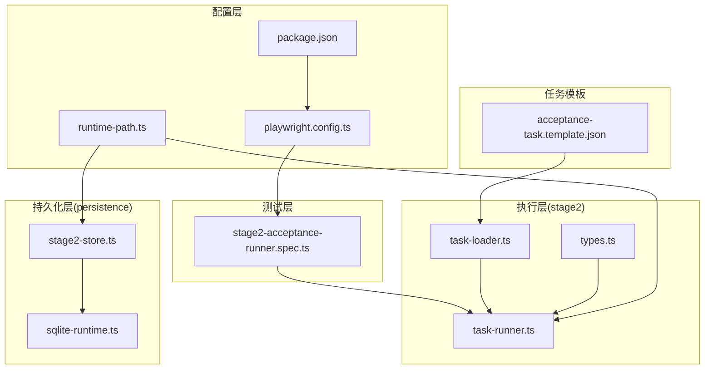
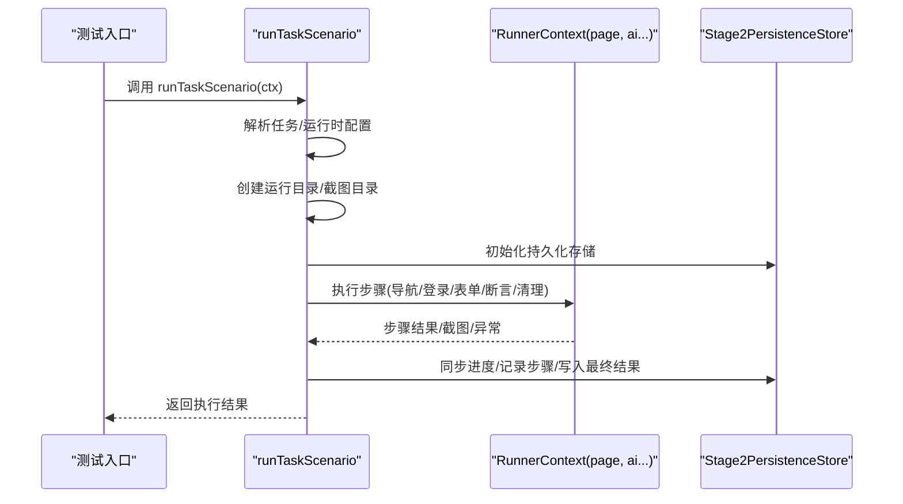
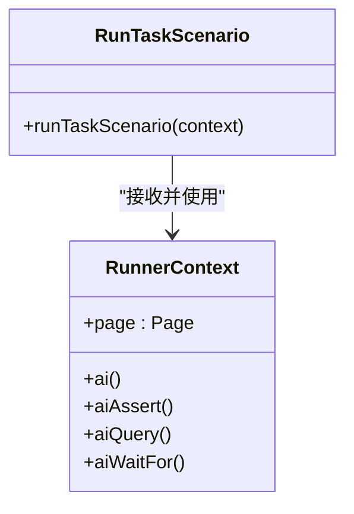
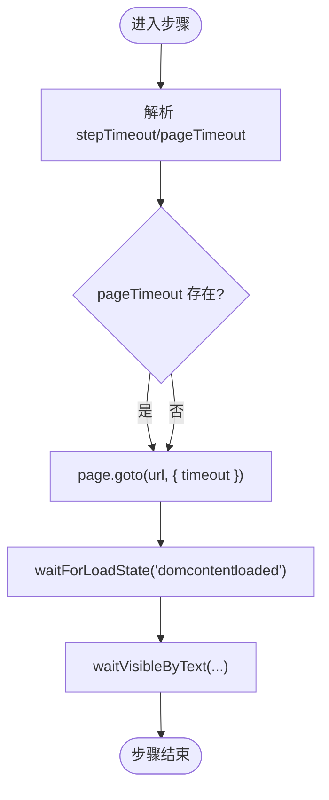
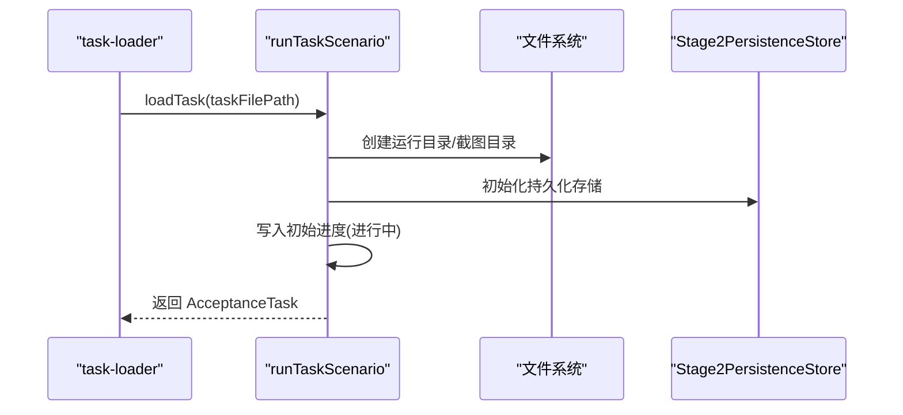
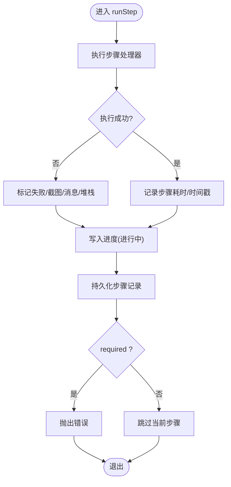
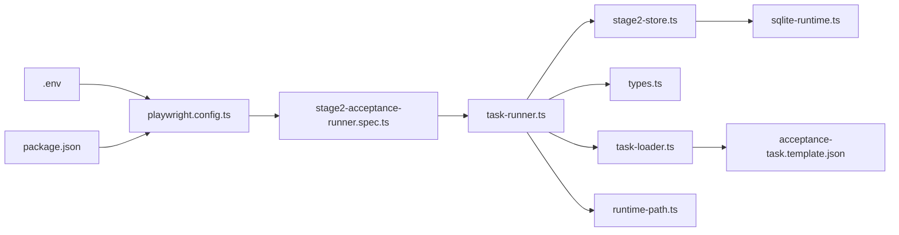

# 执行上下文管理

<cite>
**本文引用的文件**
- [task-runner.ts](file://src/stage2/task-runner.ts)
- [types.ts](file://src/stage2/types.ts)
- [task-loader.ts](file://src/stage2/task-loader.ts)
- [stage2-store.ts](file://src/persistence/stage2-store.ts)
- [sqlite-runtime.ts](file://src/persistence/sqlite-runtime.ts)
- [runtime-path.ts](file://config/runtime-path.ts)
- [playwright.config.ts](file://playwright.config.ts)
- [package.json](file://package.json)
- [stage2-acceptance-runner.spec.ts](file://tests/generated/stage2-acceptance-runner.spec.ts)
- [acceptance-task.template.json](file://specs/tasks/acceptance-task.template.json)
- [README.md](file://README.md)
</cite>

## 目录
1. [简介](#简介)
2. [项目结构](#项目结构)
3. [核心组件](#核心组件)
4. [架构总览](#架构总览)
5. [详细组件分析](#详细组件分析)
6. [依赖关系分析](#依赖关系分析)
7. [性能考量](#性能考量)
8. [故障排查指南](#故障排查指南)
9. [结论](#结论)
10. [附录](#附录)

## 简介
本文件围绕 HI-TEST 项目的执行上下文管理进行系统化文档化，重点聚焦于 RunnerContext 的设计与实现，涵盖页面实例管理、AI 上下文集成、超时控制、资源清理与持久化、执行生命周期与异常恢复策略。文档旨在帮助开发者与测试工程师快速理解并正确使用 RunnerContext，掌握最佳实践与优化建议。

## 项目结构
项目采用分层与功能模块结合的组织方式：
- stage2 层：任务加载、执行器与断言/清理逻辑
- persistence 层：SQLite 持久化与迁移
- config 层：运行时路径与环境变量解析
- tests 层：Playwright 测试入口与夹具
- specs 层：任务模板与示例

图示来源
- [runtime-path.ts:1-41](file://config/runtime-path.ts#L1-L41)
- [playwright.config.ts:1-95](file://playwright.config.ts#L1-L95)
- [package.json:1-26](file://package.json#L1-L26)
- [task-loader.ts:1-91](file://src/stage2/task-loader.ts#L1-L91)
- [task-runner.ts:1-2657](file://src/stage2/task-runner.ts#L1-L2657)
- [types.ts:1-180](file://src/stage2/types.ts#L1-L180)
- [stage2-store.ts:1-655](file://src/persistence/stage2-store.ts#L1-L655)
- [sqlite-runtime.ts:1-116](file://src/persistence/sqlite-runtime.ts#L1-L116)
- [stage2-acceptance-runner.spec.ts:1-39](file://tests/generated/stage2-acceptance-runner.spec.ts#L1-L39)
- [acceptance-task.template.json:1-141](file://specs/tasks/acceptance-task.template.json#L1-L141)

章节来源
- [playwright.config.ts:1-95](file://playwright.config.ts#L1-L95)
- [package.json:1-26](file://package.json#L1-L26)
- [runtime-path.ts:1-41](file://config/runtime-path.ts#L1-L41)

## 核心组件
- RunnerContext：执行期上下文，聚合 Page 与 AI 能力（ai、aiAssert、aiQuery、aiWaitFor），用于贯穿整个执行生命周期。
- 任务模型与运行时参数：通过 AcceptanceTask 与 TaskRuntime 描述页面导航、表单、断言、清理与超时等配置。
- 执行器 runTaskScenario：负责初始化运行目录、截图目录、持久化存储、步骤调度与异常处理。
- 持久化 Store：将运行状态、步骤、快照与产物写入 SQLite，支持迁移与审计日志。

章节来源
- [task-runner.ts:18-34](file://src/stage2/task-runner.ts#L18-L34)
- [types.ts:128-154](file://src/stage2/types.ts#L128-L154)
- [stage2-store.ts:74-123](file://src/persistence/stage2-store.ts#L74-L123)

## 架构总览
RunnerContext 在执行器中被注入，贯穿页面导航、表单填写、提交、断言与清理全流程。执行器负责：
- 解析任务与运行时配置
- 创建运行目录与截图目录
- 初始化持久化存储
- 步骤化执行与异常捕获
- 写入进度与最终结果
- 关闭持久化连接

图示来源
- [stage2-acceptance-runner.spec.ts:12-37](file://tests/generated/stage2-acceptance-runner.spec.ts#L12-L37)
- [task-runner.ts:2318-2656](file://src/stage2/task-runner.ts#L2318-L2656)
- [stage2-store.ts:470-640](file://src/persistence/stage2-store.ts#L470-L640)

## 详细组件分析

### RunnerContext 设计与实现
- 类型定义：RunnerContext 由 Page 与 AI 能力组成，便于在执行器内统一封装。
- 注入方式：测试入口将 page 与 AI 能力注入 RunnerContext，传入 runTaskScenario。
- 使用范围：贯穿导航、登录、表单、断言、清理等步骤。

图示来源
- [task-runner.ts:23-25](file://src/stage2/task-runner.ts#L23-L25)
- [stage2-acceptance-runner.spec.ts:19-25](file://tests/generated/stage2-acceptance-runner.spec.ts#L19-L25)

章节来源
- [task-runner.ts:23-25](file://src/stage2/task-runner.ts#L23-L25)
- [stage2-acceptance-runner.spec.ts:19-25](file://tests/generated/stage2-acceptance-runner.spec.ts#L19-L25)

### 页面实例管理与超时控制
- 页面实例：由测试夹具注入，执行器通过 RunnerContext.page 访问。
- 页面超时：withPageTimeout 将 TaskRuntime.pageTimeoutMs 包装为 Page.goto 的 timeout 参数。
- 步骤超时：runStep 内部使用 stepTimeoutMs（来自 TaskRuntime.stepTimeoutMs）作为步骤级等待阈值。
- 等待策略：waitVisibleByText、waitForLoadState 等配合超时参数，避免无限等待。

图示来源
- [task-runner.ts:122-129](file://src/stage2/task-runner.ts#L122-L129)
- [task-runner.ts:2440](file://src/stage2/task-runner.ts#L2440)
- [task-runner.ts:2460](file://src/stage2/task-runner.ts#L2460)
- [task-runner.ts:2472](file://src/stage2/task-runner.ts#L2472)

章节来源
- [task-runner.ts:122-129](file://src/stage2/task-runner.ts#L122-L129)
- [task-runner.ts:2440-2482](file://src/stage2/task-runner.ts#L2440-L2482)

### AI 上下文集成
- ai：用于描述步骤并执行交互（如登录、点击按钮）。
- aiAssert：用于 AI 断言。
- aiQuery：用于从页面提取结构化数据（如列表快照、滑块信息）。
- aiWaitFor：在常规等待不适用时使用。

章节来源
- [stage2-acceptance-runner.spec.ts:18-25](file://tests/generated/stage2-acceptance-runner.spec.ts#L18-L25)
- [task-runner.ts:514-538](file://src/stage2/task-runner.ts#L514-L538)
- [task-runner.ts:540-559](file://src/stage2/task-runner.ts#L540-L559)

### 执行环境初始化与上下文切换
- 任务加载：loadTask 读取并解析任务 JSON，支持模板占位符替换与必需字段校验。
- 运行目录：createRunDir 基于运行时路径与时间戳创建唯一目录，含 screenshots 子目录。
- 持久化初始化：createStage2PersistenceStore 创建运行记录、任务版本记录，写入审计日志。
- 上下文切换：runTaskScenario 作为单一入口，按步骤顺序推进，必要时切换页面状态（如等待 DOM 加载、弹窗可见）。

图示来源
- [task-loader.ts:79-89](file://src/stage2/task-loader.ts#L79-L89)
- [task-runner.ts:111-120](file://src/stage2/task-runner.ts#L111-L120)
- [stage2-store.ts:101-123](file://src/persistence/stage2-store.ts#L101-L123)

章节来源
- [task-loader.ts:71-89](file://src/stage2/task-loader.ts#L71-L89)
- [task-runner.ts:111-120](file://src/stage2/task-runner.ts#L111-L120)
- [stage2-store.ts:101-123](file://src/persistence/stage2-store.ts#L101-L123)

### 状态管理与异常恢复
- runStep：封装步骤执行、截图、结果记录与异常处理，支持 required 标记决定失败是否中断。
- 步骤进度：writeProgress 持续写入 partial.json 与持久化进度快照。
- 异常恢复：捕获错误后记录失败步骤、截图与堆栈，按 required 决定是否抛出中断流程。

图示来源
- [task-runner.ts:2382-2435](file://src/stage2/task-runner.ts#L2382-L2435)
- [task-runner.ts:2404-2425](file://src/stage2/task-runner.ts#L2404-L2425)

章节来源
- [task-runner.ts:2382-2435](file://src/stage2/task-runner.ts#L2382-L2435)

### 断言执行与降级策略
- 断言类型：toast、table-row-exists、table-cell-equals、table-cell-contains、custom。
- 策略：Playwright 硬检测优先，失败则降级至 AI 结构化查询，支持重试与轮询。
- 轮询间隔：ASSERTION_POLL_INTERVAL_MS 控制检测轮询间隔。
- 软断言：assertion.soft=true 时失败不中断流程。

章节来源
- [task-runner.ts:1027-1048](file://src/stage2/task-runner.ts#L1027-L1048)
- [task-runner.ts:1562-1917](file://src/stage2/task-runner.ts#L1562-L1917)

### 数据清理与资源释放
- 清理策略：delete-created、delete-all-matched、custom、none。
- 行定位：clickRowActionButton 支持多种 UI 框架选择器与 AI 兜底。
- 确认弹窗：handleConfirmDialog 支持标题与按钮文本匹配。
- 成功提示：waitForCleanupSuccess 检测清理成功提示。
- 资源释放：runTaskScenario 结束后写入最终结果并关闭持久化连接。

章节来源
- [task-runner.ts:1927-2054](file://src/stage2/task-runner.ts#L1927-L2054)
- [task-runner.ts:2059-2144](file://src/stage2/task-runner.ts#L2059-L2144)
- [task-runner.ts:2218-2316](file://src/stage2/task-runner.ts#L2218-L2316)
- [stage2-store.ts:632-640](file://src/persistence/stage2-store.ts#L632-L640)

### 页面超时配置与操作超时控制
- 页面超时：TaskRuntime.pageTimeoutMs → withPageTimeout → page.goto(timeout)。
- 步骤超时：TaskRuntime.stepTimeoutMs → runStep 中各步骤等待阈值。
- 文本可见等待：waitVisibleByText 使用 timeoutMs。
- 断言超时：TaskAssertion.timeoutMs 与默认值组合使用。

章节来源
- [types.ts:128-133](file://src/stage2/types.ts#L128-L133)
- [task-runner.ts:122-129](file://src/stage2/task-runner.ts#L122-L129)
- [task-runner.ts:2460](file://src/stage2/task-runner.ts#L2460)
- [task-runner.ts:1027-1028](file://src/stage2/task-runner.ts#L1027-L1028)

### 内存管理与资源释放机制
- 截图与产物：每步可选截图，运行目录统一管理，避免碎片化。
- 数据库连接：Stage2PersistenceStore 提供 close 方法，防止连接泄漏。
- 进度文件：partial.json 持续更新，最终 result.json 落盘，便于恢复与回溯。

章节来源
- [task-runner.ts:2398-2403](file://src/stage2/task-runner.ts#L2398-L2403)
- [stage2-store.ts:632-640](file://src/persistence/stage2-store.ts#L632-L640)

## 依赖关系分析
- 测试框架：Playwright，配置项影响超时、并行与报告输出。
- 环境变量：通过 dotenv 加载，影响运行目录、任务文件、验证码模式等。
- 持久化：SQLite 单文件数据库，支持迁移与审计日志。
- 任务模板：JSON 任务文件，支持占位符与模板解析。

图示来源
- [playwright.config.ts:1-95](file://playwright.config.ts#L1-L95)
- [package.json:1-26](file://package.json#L1-L26)
- [stage2-acceptance-runner.spec.ts:1-39](file://tests/generated/stage2-acceptance-runner.spec.ts#L1-L39)
- [task-runner.ts:1-2657](file://src/stage2/task-runner.ts#L1-L2657)
- [stage2-store.ts:1-655](file://src/persistence/stage2-store.ts#L1-L655)
- [sqlite-runtime.ts:1-116](file://src/persistence/sqlite-runtime.ts#L1-L116)
- [runtime-path.ts:1-41](file://config/runtime-path.ts#L1-L41)
- [task-loader.ts:1-91](file://src/stage2/task-loader.ts#L1-L91)
- [acceptance-task.template.json:1-141](file://specs/tasks/acceptance-task.template.json#L1-L141)

章节来源
- [playwright.config.ts:22-48](file://playwright.config.ts#L22-L48)
- [runtime-path.ts:8-40](file://config/runtime-path.ts#L8-L40)
- [README.md:39-54](file://README.md#L39-L54)

## 性能考量
- 超时设置：合理设置 pageTimeoutMs 与 stepTimeoutMs，避免过短导致误判、过长浪费资源。
- 轮询间隔：ASSERTION_POLL_INTERVAL_MS 控制断言轮询频率，平衡响应速度与 CPU 占用。
- 截图策略：screenshotOnStep 仅在必要步骤开启，减少 IO 压力。
- 并行与重试：Playwright 并行与重试策略在 CI 环境下可提升稳定性，本地调试建议关闭或降低重试次数。
- 持久化写入：阶段性写入 partial.json 与快照，避免一次性落盘造成阻塞。

章节来源
- [task-runner.ts:1029](file://src/stage2/task-runner.ts#L1029)
- [playwright.config.ts:26-34](file://playwright.config.ts#L26-L34)
- [task-runner.ts:2398-2403](file://src/stage2/task-runner.ts#L2398-L2403)

## 故障排查指南
- 验证码处理
  - 模式配置：STAGE2_CAPTCHA_MODE（auto/manual/fail/ignore）与 STAGE2_CAPTCHA_WAIT_TIMEOUT_MS。
  - 自动处理失败：查看滑块检测与拖动轨迹日志，必要时切换为 manual 模式。
- 断言失败
  - 优先检查 Playwright 硬检测结果，再查看 AI 断言降级日志与列值对比详情。
  - 对 table-cell-equals，关注缺失列与不匹配列的详细信息。
- 清理失败
  - 检查确认弹窗标题与按钮文案匹配，必要时启用 searchBeforeCleanup。
  - 若 failOnError=true，清理失败将中断流程；否则记录错误并继续。
- 资源与连接
  - 确保 runTaskScenario 结束后持久化连接被关闭，避免句柄泄漏。
- 运行产物
  - 查看 t_runtime 下的 Playwright 报告、Midscene 报告与 acceptance-results 目录，定位问题步骤与截图。

章节来源
- [README.md:56-74](file://README.md#L56-L74)
- [task-runner.ts:1612-1614](file://src/stage2/task-runner.ts#L1612-L1614)
- [task-runner.ts:2218-2316](file://src/stage2/task-runner.ts#L2218-L2316)
- [stage2-store.ts:632-640](file://src/persistence/stage2-store.ts#L632-L640)

## 结论
RunnerContext 将 Page 与 AI 能力整合，形成统一的执行上下文，配合 runTaskScenario 的步骤化执行、超时控制与异常恢复机制，实现了高鲁棒性的自动化验收流程。通过任务模板与运行时配置，系统具备良好的跨平台适配与可维护性。建议在生产环境中合理设置超时、谨慎使用软断言、启用必要的截图与持久化，以获得更好的可观测性与可追溯性。

## 附录
- 最佳实践清单
  - 使用 TaskRuntime.pageTimeoutMs 与 stepTimeoutMs 明确超时边界。
  - 断言优先使用 Playwright 硬检测，AI 作为兜底。
  - 清理策略优先 exact 匹配，verifyAfterCleanup 建议开启。
  - 仅在必要步骤开启截图，避免 IO 压力。
  - 在 CI 环境启用并行与重试，本地调试关闭或降低重试次数。
  - 定期检查与清理运行产物目录，避免磁盘占用。
- 性能监控建议
  - 关注步骤耗时分布，识别瓶颈步骤。
  - 监控断言重试次数与成功率，评估页面稳定性。
  - 持久化写入频率与大小，避免阻塞主线程。