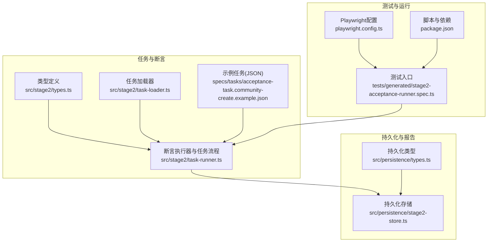
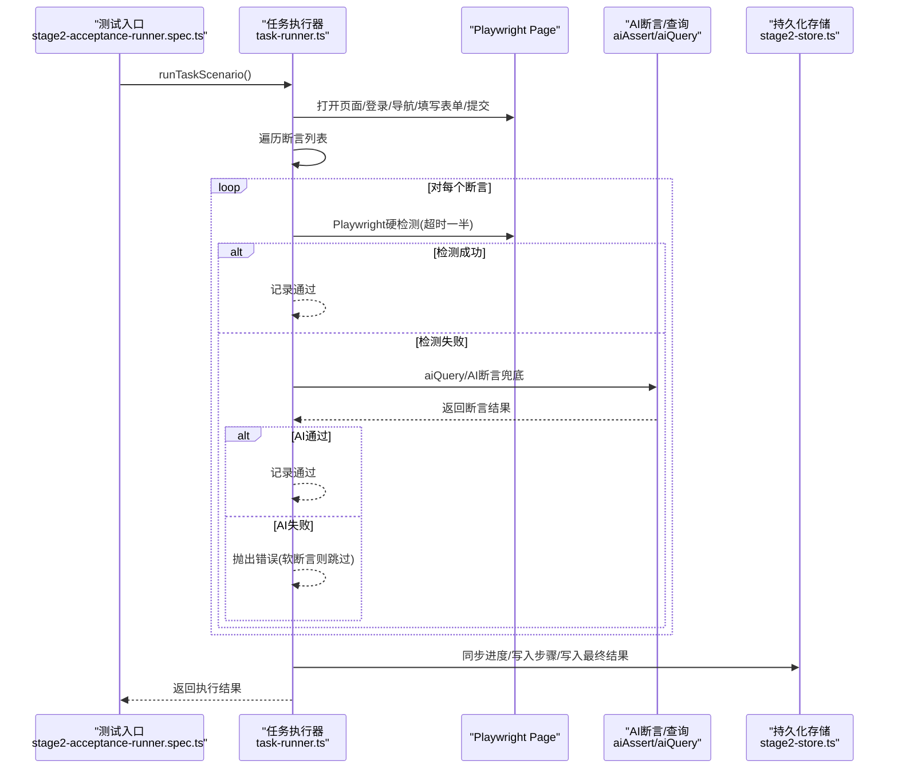
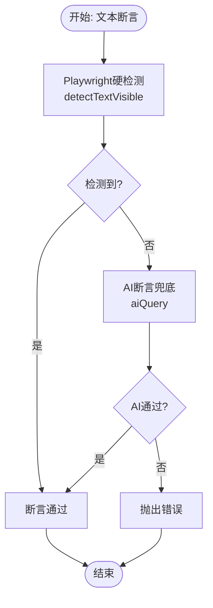
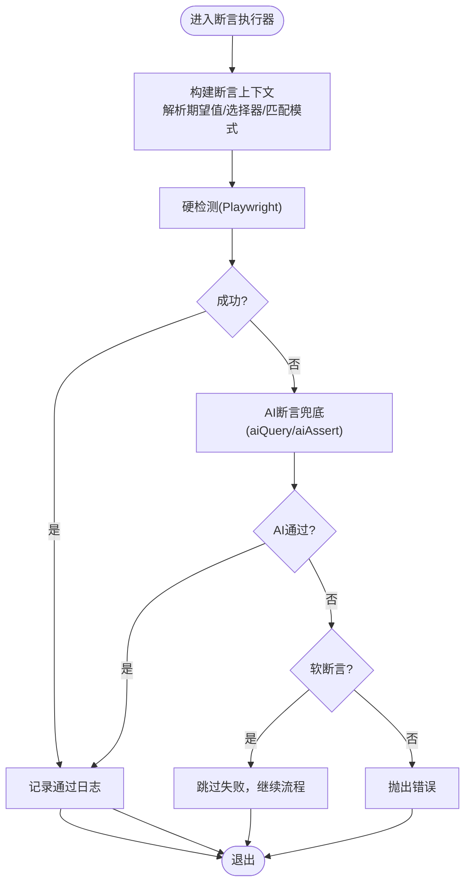
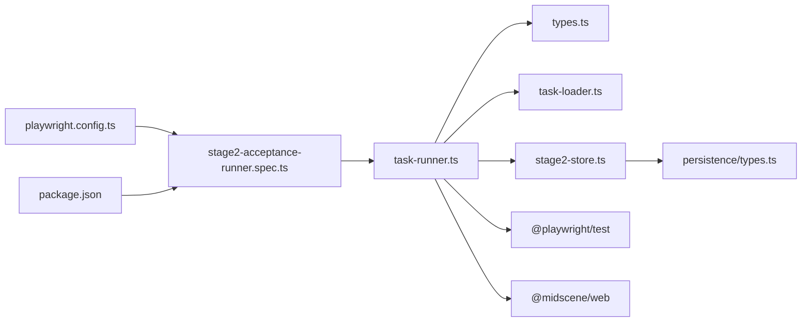

# 断言验证机制

<cite>
**本文引用的文件**
- [src/stage2/types.ts](file://src/stage2/types.ts)
- [src/stage2/task-runner.ts](file://src/stage2/task-runner.ts)
- [src/stage2/task-loader.ts](file://src/stage2/task-loader.ts)
- [src/persistence/types.ts](file://src/persistence/types.ts)
- [src/persistence/stage2-store.ts](file://src/persistence/stage2-store.ts)
- [specs/tasks/acceptance-task.community-create.example.json](file://specs/tasks/acceptance-task.community-create.example.json)
- [tests/generated/stage2-acceptance-runner.spec.ts](file://tests/generated/stage2-acceptance-runner.spec.ts)
- [package.json](file://package.json)
- [playwright.config.ts](file://playwright.config.ts)
</cite>

## 目录
1. [简介](#简介)
2. [项目结构](#项目结构)
3. [核心组件](#核心组件)
4. [架构总览](#架构总览)
5. [详细组件分析](#详细组件分析)
6. [依赖关系分析](#依赖关系分析)
7. [性能考量](#性能考量)
8. [故障排查指南](#故障排查指南)
9. [结论](#结论)
10. [附录](#附录)

## 简介
本文件系统性梳理 HI-TEST 项目的断言验证机制，覆盖多类型断言（文本断言、元素断言、AI 断言、自定义断言）的实现原理、执行流程、结果收集、错误聚合与失败处理策略。文档还阐述断言配置语法、条件判断逻辑、断言组合与链式调用支持，以及断言结果的存储与报告机制，并给出最佳实践与性能优化建议。

## 项目结构
- 断言核心定义与任务模型集中在 stage2 类型定义中，断言执行器与任务编排在 task-runner 中实现。
- 任务加载器负责解析任务模板与环境变量注入。
- 持久化层负责将执行进度、步骤、截图与最终结果写入 SQLite 并生成报告。
- 示例任务文件展示了断言配置的典型用法。

图表来源
- [src/stage2/types.ts:1-180](file://src/stage2/types.ts#L1-L180)
- [src/stage2/task-runner.ts:1-2657](file://src/stage2/task-runner.ts#L1-L2657)
- [src/stage2/task-loader.ts:1-91](file://src/stage2/task-loader.ts#L1-L91)
- [src/persistence/types.ts:1-125](file://src/persistence/types.ts#L1-L125)
- [src/persistence/stage2-store.ts:1-655](file://src/persistence/stage2-store.ts#L1-L655)
- [specs/tasks/acceptance-task.community-create.example.json:1-229](file://specs/tasks/acceptance-task.community-create.example.json#L1-L229)
- [tests/generated/stage2-acceptance-runner.spec.ts:1-39](file://tests/generated/stage2-acceptance-runner.spec.ts#L1-L39)
- [playwright.config.ts:1-95](file://playwright.config.ts#L1-L95)
- [package.json:1-26](file://package.json#L1-L26)

章节来源
- [src/stage2/types.ts:1-180](file://src/stage2/types.ts#L1-L180)
- [src/stage2/task-runner.ts:1-2657](file://src/stage2/task-runner.ts#L1-L2657)
- [src/stage2/task-loader.ts:1-91](file://src/stage2/task-loader.ts#L1-L91)
- [src/persistence/types.ts:1-125](file://src/persistence/types.ts#L1-L125)
- [src/persistence/stage2-store.ts:1-655](file://src/persistence/stage2-store.ts#L1-L655)
- [specs/tasks/acceptance-task.community-create.example.json:1-229](file://specs/tasks/acceptance-task.community-create.example.json#L1-L229)
- [tests/generated/stage2-acceptance-runner.spec.ts:1-39](file://tests/generated/stage2-acceptance-runner.spec.ts#L1-L39)
- [playwright.config.ts:1-95](file://playwright.config.ts#L1-L95)
- [package.json:1-26](file://package.json#L1-L26)

## 核心组件
- 断言配置模型：TaskAssertion 定义了断言类型、期望值来源、匹配模式、超时与重试、软断言等。
- 断言执行器：runAssertion 根据断言类型分派到 Playwright 硬检测或 AI 断言兜底，并支持重试与降级。
- 任务加载器：loadTask 解析任务 JSON，进行形状校验与模板替换（NOW_YYYYMMDDHHMMSS、环境变量）。
- 步骤与结果：runStep 包装每个步骤，记录状态、耗时、截图、错误信息；最终汇总为 Stage2ExecutionResult。
- 持久化：Stage2PersistenceStore 将进度、步骤、截图、最终结果写入 SQLite，并生成审计日志与工件。

章节来源
- [src/stage2/types.ts:67-88](file://src/stage2/types.ts#L67-L88)
- [src/stage2/task-runner.ts:1562-1917](file://src/stage2/task-runner.ts#L1562-L1917)
- [src/stage2/task-loader.ts:79-91](file://src/stage2/task-loader.ts#L79-L91)
- [src/stage2/task-runner.ts:2382-2435](file://src/stage2/task-runner.ts#L2382-L2435)
- [src/persistence/stage2-store.ts:470-630](file://src/persistence/stage2-store.ts#L470-L630)

## 架构总览
断言验证机制采用“Playwright 硬检测优先 + AI 断言兜底 + 重试与降级”的策略，结合软断言控制失败是否中断流程，最终将断言结果与中间态快照持久化。

图表来源
- [tests/generated/stage2-acceptance-runner.spec.ts:12-37](file://tests/generated/stage2-acceptance-runner.spec.ts#L12-L37)
- [src/stage2/task-runner.ts:2318-2656](file://src/stage2/task-runner.ts#L2318-L2656)
- [src/stage2/task-runner.ts:1562-1917](file://src/stage2/task-runner.ts#L1562-L1917)
- [src/persistence/stage2-store.ts:470-630](file://src/persistence/stage2-store.ts#L470-L630)

## 详细组件分析

### 断言配置模型与类型
- TaskAssertion 关键字段：
  - type：断言类型（如 toast、table-row-exists、table-cell-equals、table-cell-contains、custom）。
  - expectedText：文本断言期望文本。
  - matchField：基于已解析值定位行的关键字段名。
  - expectedColumns / expectedColumnFromFields / expectedColumnValues：表格列期望值映射。
  - column / expectedFromField：单元格包含断言的列与期望来源字段。
  - matchMode：exact/contains。
  - timeoutMs/retryCount：超时与重试。
  - soft：软断言，失败不中断流程。
  - description：自定义断言描述（用于 AI 断言）。

章节来源
- [src/stage2/types.ts:67-88](file://src/stage2/types.ts#L67-L88)

### 文本断言（Toast/提示信息）
- 策略：
  - Playwright 硬检测：优先使用 detectTextVisible 在 Toast/Message/通知等容器中检测期望文本。
  - AI 断言兜底：若 Playwright 未检测到，则通过 aiQuery 请求 AI 判断页面是否存在包含期望文本的信息。
- 重试与降级：
  - 硬检测使用较短超时（timeoutMs/2）与少量重试，失败后切换至 AI 断言。
- 错误处理：
  - 若两次均失败，抛出错误并记录详细原因。

图表来源
- [src/stage2/task-runner.ts:1574-1615](file://src/stage2/task-runner.ts#L1574-L1615)

章节来源
- [src/stage2/task-runner.ts:1278-1322](file://src/stage2/task-runner.ts#L1278-L1322)
- [src/stage2/task-runner.ts:1574-1615](file://src/stage2/task-runner.ts#L1574-L1615)

### 表格行存在断言（table-row-exists）
- 策略：
  - 使用 resolveRowMatchMode 决定 exact/contains 匹配。
  - 先用 detectTableRowExists 在表格中定位行；失败则使用 AI 断言。
- 重试与降级：
  - 硬检测短超时重试，失败后 AI 断言重试 retryCount 次。
- 错误处理：
  - 两路均失败时，抛出包含匹配模式说明的错误。

章节来源
- [src/stage2/task-runner.ts:1618-1668](file://src/stage2/task-runner.ts#L1618-L1668)
- [src/stage2/task-runner.ts:1062-1069](file://src/stage2/task-runner.ts#L1062-L1069)
- [src/stage2/task-runner.ts:1327-1367](file://src/stage2/task-runner.ts#L1327-L1367)

### 表格单元格值断言（table-cell-equals）
- 策略：
  - 先通过 detectTableRowColumnValues 获取行内列值，构建期望列映射（expectedColumnValues/expectedColumnFromFields）。
  - 使用 isExactComparableMatch 进行严格比较，支持结构化分隔符的规范化比较。
  - 若硬检测失败，使用 AI 断言进行严格比对。
- 错误聚合：
  - 记录缺失列与不匹配列，格式化输出详细信息。
- 错误处理：
  - 两路均失败时，抛出包含详细差异的错误。

章节来源
- [src/stage2/task-runner.ts:1671-1788](file://src/stage2/task-runner.ts#L1671-L1788)
- [src/stage2/task-runner.ts:1128-1152](file://src/stage2/task-runner.ts#L1128-L1152)
- [src/stage2/task-runner.ts:1158-1182](file://src/stage2/task-runner.ts#L1158-L1182)
- [src/stage2/task-runner.ts:1463-1527](file://src/stage2/task-runner.ts#L1463-L1527)

### 表格单元格包含断言（table-cell-contains）
- 策略：
  - 以 matchField 定位行，从 expectedFromField 解析期望值，检查指定列是否包含期望值。
  - 先硬检测，失败后 AI 断言。
- 错误处理：
  - 两路均失败时，抛出包含实际值的错误。

章节来源
- [src/stage2/task-runner.ts:1791-1871](file://src/stage2/task-runner.ts#L1791-L1871)
- [src/stage2/task-runner.ts:1171-1182](file://src/stage2/task-runner.ts#L1171-L1182)

### 自定义断言（custom）
- 策略：
  - 使用 assertion.description 作为 AI 断言的自然语言描述，通过 aiQuery 返回 { passed, reason }。
- 错误处理：
  - 失败时抛出错误，包含描述信息。

章节来源
- [src/stage2/task-runner.ts:1874-1894](file://src/stage2/task-runner.ts#L1874-L1894)

### 通用断言兜底
- 策略：
  - 当断言类型未知或上述分支未覆盖时，使用 aiQuery 通用断言，返回 { passed, reason }。
- 错误处理：
  - 失败时抛出错误。

章节来源
- [src/stage2/task-runner.ts:1896-1917](file://src/stage2/task-runner.ts#L1896-L1917)

### 断言执行流程与重试机制
- executeAssertionWithRetry 提供统一的重试执行框架：
  - executor 执行断言逻辑；
  - validator 判定成功；
  - retryCount 控制重试次数，delayMs 控制间隔。
- runAssertion 将不同断言类型封装为统一调用，分别设置超时与重试参数。

图表来源
- [src/stage2/task-runner.ts:1532-1556](file://src/stage2/task-runner.ts#L1532-L1556)
- [src/stage2/task-runner.ts:1562-1917](file://src/stage2/task-runner.ts#L1562-L1917)

章节来源
- [src/stage2/task-runner.ts:1532-1556](file://src/stage2/task-runner.ts#L1532-L1556)
- [src/stage2/task-runner.ts:1562-1917](file://src/stage2/task-runner.ts#L1562-L1917)

### 断言结果收集与错误聚合
- runStep 在每个步骤中记录：
  - name/status/startedAt/endedAt/durationMs/screenshotPath/message/errorStack。
- 软断言：
  - assertion.soft=true 时，断言失败不中断流程，步骤状态为 skipped（非必需时）。
- 最终结果：
  - Stage2ExecutionResult 包含 taskId/taskName/startedAt/endedAt/durationMs/status/taskFilePath/runDir/resolvedValues/querySnapshots/steps。

章节来源
- [src/stage2/types.ts:156-179](file://src/stage2/types.ts#L156-L179)
- [src/stage2/task-runner.ts:2382-2435](file://src/stage2/task-runner.ts#L2382-L2435)
- [src/stage2/task-runner.ts:2637-2656](file://src/stage2/task-runner.ts#L2637-L2656)

### 断言配置语法与示例
- 示例任务文件展示了断言配置的典型用法：
  - toast：期望文本为“操作成功”，软断言。
  - table-row-exists：基于 matchField“小区名称”进行精确匹配。
  - table-cell-equals：期望列来自字段映射，软断言。
  - table-cell-contains：期望值来源于“省市区”字段，断言“所在地区”列包含该值。
- 任务加载器：
  - loadTask 会进行形状校验（taskId/taskName/target.url/account.username/password/form.openButtonText/form.submitButtonText/form.fields）。
  - 支持模板替换：NOW_YYYYMMDDHHMMSS 与环境变量注入。

章节来源
- [specs/tasks/acceptance-task.community-create.example.json:157-194](file://specs/tasks/acceptance-task.community-create.example.json#L157-L194)
- [src/stage2/task-loader.ts:50-69](file://src/stage2/task-loader.ts#L50-L69)
- [src/stage2/task-loader.ts:79-91](file://src/stage2/task-loader.ts#L79-L91)

### 断言组合与链式调用支持
- 断言组合：
  - 任务中可配置多个断言，按顺序执行。
  - 通过 soft 字段控制失败是否中断后续步骤。
- 链式调用：
  - runAssertion 内部通过 executeAssertionWithRetry 实现重试链式调用。
  - runTaskScenario 中对每个断言调用 runStep，形成步骤链。

章节来源
- [src/stage2/task-runner.ts:2599-2611](file://src/stage2/task-runner.ts#L2599-L2611)
- [src/stage2/task-runner.ts:1532-1556](file://src/stage2/task-runner.ts#L1532-L1556)
- [src/stage2/task-runner.ts:2382-2435](file://src/stage2/task-runner.ts#L2382-L2435)

### 断言结果存储与报告机制
- 进度快照：
  - syncProgress 写入 resolved_values/query_snapshots/progress_state 至持久化存储。
- 步骤记录：
  - recordStep 写入 ai_run_step，包含截图工件。
- 最终结果：
  - finishRun 写入 ai_run，生成最终结果摘要与 result_json 工件。
- 报告：
  - Playwright HTML 报告与 @midscene/web 报告由配置启用。

章节来源
- [src/persistence/stage2-store.ts:470-630](file://src/persistence/stage2-store.ts#L470-L630)
- [playwright.config.ts:36-40](file://playwright.config.ts#L36-L40)

## 依赖关系分析
- 断言执行器依赖：
  - Playwright Page/Locator 进行硬检测；
  - AI 断言/查询接口（aiAssert/aiQuery/aiWaitFor）进行兜底；
  - 任务模型与 UI Profile 选择器集合。
- 持久化依赖：
  - SQLite 数据库与迁移；
  - 工件（截图、报告、结果 JSON）相对路径与绝对路径记录。
- 测试入口依赖：
  - Playwright 测试框架与 @midscene/web 插件。

图表来源
- [src/stage2/task-runner.ts:1-2657](file://src/stage2/task-runner.ts#L1-L2657)
- [src/stage2/types.ts:1-180](file://src/stage2/types.ts#L1-L180)
- [src/stage2/task-loader.ts:1-91](file://src/stage2/task-loader.ts#L1-L91)
- [src/persistence/stage2-store.ts:1-655](file://src/persistence/stage2-store.ts#L1-L655)
- [src/persistence/types.ts:1-125](file://src/persistence/types.ts#L1-L125)
- [tests/generated/stage2-acceptance-runner.spec.ts:1-39](file://tests/generated/stage2-acceptance-runner.spec.ts#L1-L39)
- [playwright.config.ts:1-95](file://playwright.config.ts#L1-L95)
- [package.json:1-26](file://package.json#L1-L26)

章节来源
- [src/stage2/task-runner.ts:1-2657](file://src/stage2/task-runner.ts#L1-L2657)
- [src/stage2/task-loader.ts:1-91](file://src/stage2/task-loader.ts#L1-L91)
- [src/persistence/stage2-store.ts:1-655](file://src/persistence/stage2-store.ts#L1-L655)
- [tests/generated/stage2-acceptance-runner.spec.ts:1-39](file://tests/generated/stage2-acceptance-runner.spec.ts#L1-L39)
- [playwright.config.ts:1-95](file://playwright.config.ts#L1-L95)
- [package.json:1-26](file://package.json#L1-L26)

## 性能考量
- 硬检测优先：缩短超时时间（断言超时的一半）提升响应速度。
- 重试策略：合理设置 retryCount 与间隔，避免过度重试导致整体耗时增加。
- 选择器优化：通过 UI Profile 提供更精准的选择器，减少 DOM 遍历成本。
- 截图与报告：按需开启 screenshotOnStep 与 trace，避免不必要的 IO 与内存占用。
- AI 断言：仅在硬检测失败时触发，降低 AI 调用频率。

[本节为通用指导，无需特定文件引用]

## 故障排查指南
- 断言失败：
  - 查看步骤日志与截图，定位失败断言类型与期望值。
  - 检查断言配置：matchMode、expectedColumns、expectedColumnFromFields、expectedColumnValues。
- 软断言：
  - 若断言标记为 soft，失败不会中断流程，可在最终状态为 passed 的情况下继续观察。
- 持久化与报告：
  - 检查持久化存储是否正常写入 progress_json/result_json 与截图工件。
  - Playwright HTML 报告与 @midscene/web 报告可用于复盘。
- 环境变量与任务模板：
  - 确认 NOW_YYYYMMDDHHMMSS 与环境变量替换是否正确。
  - 确认任务文件 shape 校验通过。

章节来源
- [src/stage2/task-runner.ts:2404-2425](file://src/stage2/task-runner.ts#L2404-L2425)
- [src/stage2/task-runner.ts:2632-2634](file://src/stage2/task-runner.ts#L2632-L2634)
- [src/persistence/stage2-store.ts:470-630](file://src/persistence/stage2-store.ts#L470-L630)
- [playwright.config.ts:36-40](file://playwright.config.ts#L36-L40)
- [src/stage2/task-loader.ts:79-91](file://src/stage2/task-loader.ts#L79-L91)

## 结论
HI-TEST 的断言验证机制以 Playwright 硬检测为核心，结合 AI 断言兜底与重试降级策略，实现了高鲁棒性的自动化验收流程。通过软断言与步骤化记录，既能保证关键断言的强约束，又能灵活处理非关键场景。配合持久化与报告体系，断言结果可被完整追溯与复盘。建议在复杂 UI 场景下优先提供 UI Profile 选择器，并合理配置断言超时与重试参数，以获得最佳性能与稳定性。

[本节为总结，无需特定文件引用]

## 附录
- 运行方式：
  - 使用 npm 脚本启动第二段执行：stage2:run 或 stage2:run:headed。
- 配置项参考：
  - STAGE2_CAPTCHA_MODE：滑块验证码处理模式（manual/auto/fail/ignore）。
  - STAGE2_CAPTCHA_WAIT_TIMEOUT_MS：滑块等待超时（毫秒）。
  - STAGE2_TASK_FILE：任务文件路径。
  - STAGE2_REQUIRE_APPROVAL：是否要求人工审批。

章节来源
- [package.json:6-11](file://package.json#L6-L11)
- [src/stage2/task-runner.ts:61-87](file://src/stage2/task-runner.ts#L61-L87)
- [src/stage2/task-runner.ts:2325-2330](file://src/stage2/task-runner.ts#L2325-L2330)