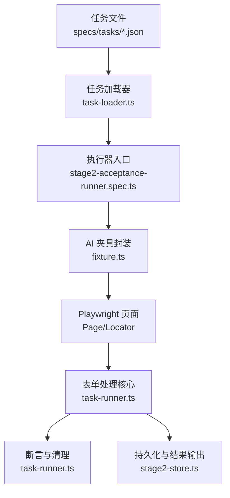
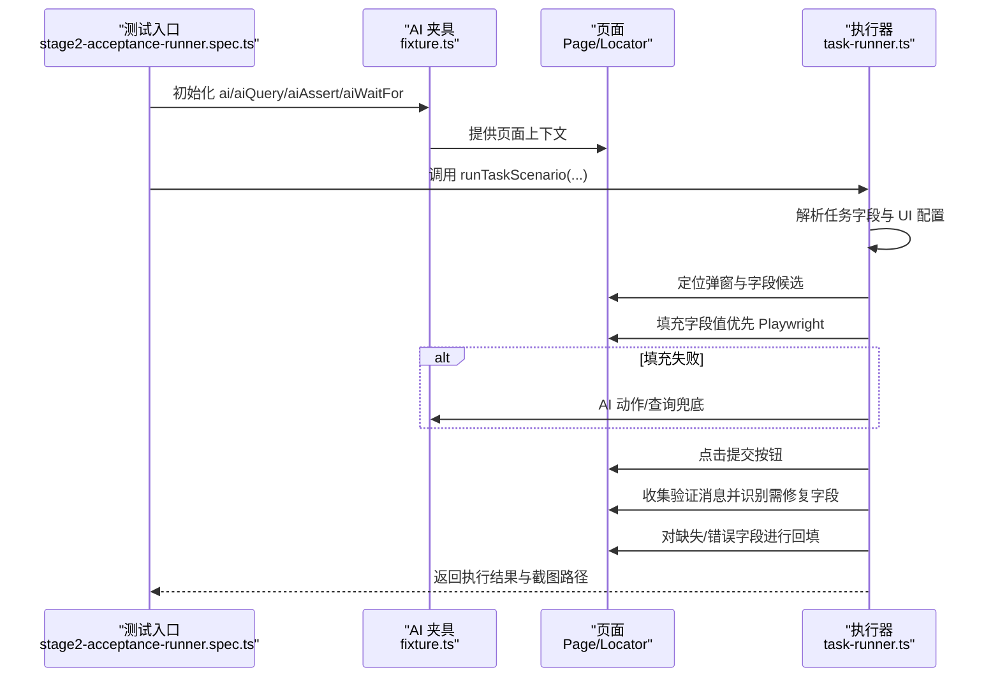
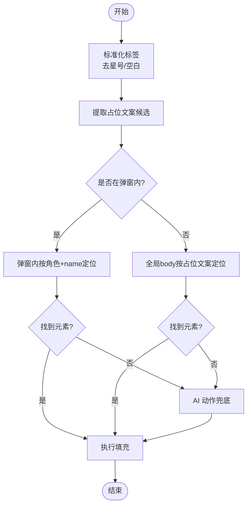
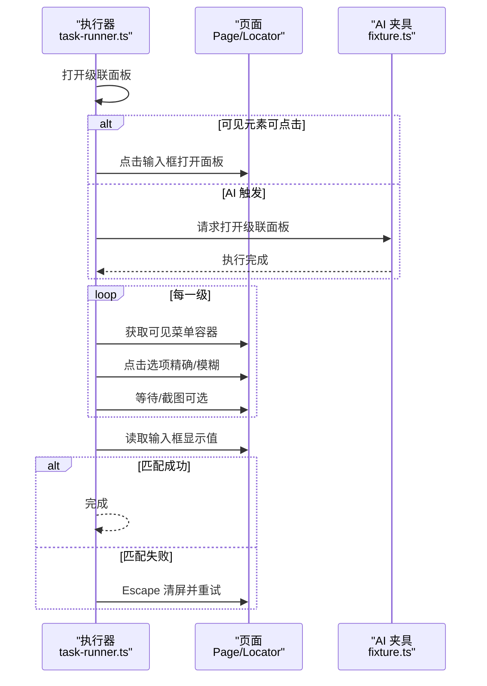
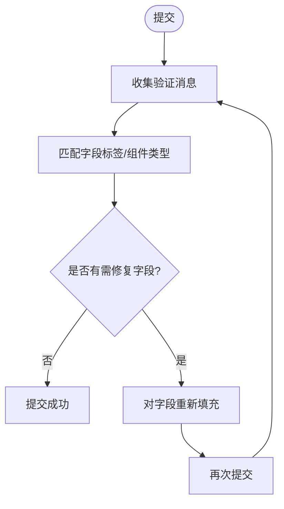
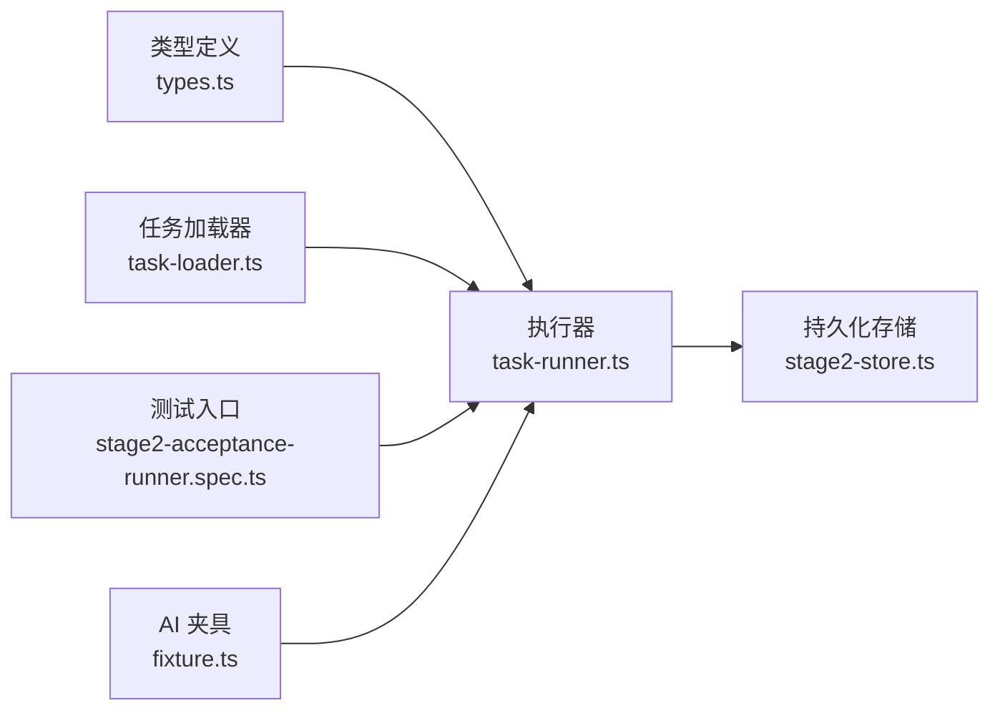

# 表单字段处理

<cite>
**本文引用的文件**
- [README.md](file://README.md)
- [package.json](file://package.json)
- [src/stage2/types.ts](file://src/stage2/types.ts)
- [src/stage2/task-runner.ts](file://src/stage2/task-runner.ts)
- [src/stage2/task-loader.ts](file://src/stage2/task-loader.ts)
- [tests/generated/stage2-acceptance-runner.spec.ts](file://tests/generated/stage2-acceptance-runner.spec.ts)
- [tests/fixture/fixture.ts](file://tests/fixture/fixture.ts)
- [specs/tasks/acceptance-task.community-create.example.json](file://specs/tasks/acceptance-task.community-create.example.json)
- [specs/tasks/acceptance-task.template.json](file://specs/tasks/acceptance-task.template.json)
</cite>

## 目录
1. [简介](#简介)
2. [项目结构](#项目结构)
3. [核心组件](#核心组件)
4. [架构总览](#架构总览)
5. [详细组件分析](#详细组件分析)
6. [依赖关系分析](#依赖关系分析)
7. [性能考量](#性能考量)
8. [故障排查指南](#故障排查指南)
9. [结论](#结论)
10. [附录](#附录)

## 简介
本文件聚焦 HI-TEST 项目中的“表单字段处理”能力，系统性阐述动态表单字段解析与填充逻辑，涵盖字段标签匹配、候选元素选择、级联选择器（cascader）处理、验证消息收集与回填修复、字段值标准化与可见性检测、以及回退策略与 AI 辅助填充。文档同时提供流程图与序列图，帮助读者快速理解端到端执行链路，并给出性能优化建议与常见场景的解决方案。

## 项目结构
- 任务驱动层：通过 JSON 任务文件描述表单字段、断言与清理策略，由加载器解析并注入运行上下文。
- 执行器层：基于 Playwright 与 Midscene 的 AI 能力，实现字段识别、填充、提交、断言与清理。
- 配置与夹具：统一运行产物目录、AI 能力封装与测试生命周期管理。

图表来源
- [tests/generated/stage2-acceptance-runner.spec.ts:12-37](file://tests/generated/stage2-acceptance-runner.spec.ts#L12-L37)
- [tests/fixture/fixture.ts:23-99](file://tests/fixture/fixture.ts#L23-L99)
- [src/stage2/task-runner.ts:1-120](file://src/stage2/task-runner.ts#L1-L120)

章节来源
- [README.md:132-190](file://README.md#L132-L190)
- [package.json:6-11](file://package.json#L6-L11)

## 核心组件
- 任务模型与字段定义：定义表单字段类型、标签、值、提示与必填等元信息。
- 字段解析与标准化：对字段标签去噪、占位文案提取、值规范化。
- 候选元素选择：基于角色、占位文案与弹窗上下文定位输入元素。
- 级联选择器处理：打开面板、逐级点击选项、路径匹配与回退重试。
- 提交与回填修复：收集验证消息、识别缺失/错误字段并自动补填。
- 可见性检测与填充策略：优先 Playwright 硬检测，AI 作为兜底。
- 性能与稳定性：超时控制、重试机制、截图与日志。

章节来源
- [src/stage2/types.ts:23-40](file://src/stage2/types.ts#L23-L40)
- [src/stage2/task-runner.ts:131-163](file://src/stage2/task-runner.ts#L131-L163)
- [src/stage2/task-runner.ts:279-290](file://src/stage2/task-runner.ts#L279-L290)
- [src/stage2/task-runner.ts:897-974](file://src/stage2/task-runner.ts#L897-L974)
- [src/stage2/task-runner.ts:976-1021](file://src/stage2/task-runner.ts#L976-L1021)

## 架构总览
表单处理的整体流程围绕“字段识别 → 候选定位 → 填充 → 提交 → 验证消息收集 → 回填修复 → 成功判定”的闭环展开。AI 在 Playwright 无法精确定位或交互时提供兜底能力，确保在不同 UI 框架（Element Plus、Ant Design、iView）下具备兼容性。

图表来源
- [tests/generated/stage2-acceptance-runner.spec.ts:12-37](file://tests/generated/stage2-acceptance-runner.spec.ts#L12-L37)
- [tests/fixture/fixture.ts:23-99](file://tests/fixture/fixture.ts#L23-L99)
- [src/stage2/task-runner.ts:976-1021](file://src/stage2/task-runner.ts#L976-L1021)

## 详细组件分析

### 字段标签匹配与候选元素选择
- 标签标准化：去除星号、空白字符，统一大小写与空白。
- 占位文案提取：从字段 hints 中抽取“占位文案为...”片段，形成候选标签集合。
- 候选定位策略：
  - 弹窗内优先：在活动弹窗容器内按角色 textbox/name 匹配。
  - 全局回退：在 body 下按 placeholder 精确/模糊匹配。
  - AI 兜底：若均未命中，调用 AI 动作进行交互。

图表来源
- [src/stage2/task-runner.ts:143-145](file://src/stage2/task-runner.ts#L143-L145)
- [src/stage2/task-runner.ts:279-290](file://src/stage2/task-runner.ts#L279-L290)
- [src/stage2/task-runner.ts:259-277](file://src/stage2/task-runner.ts#L259-L277)
- [src/stage2/task-runner.ts:897-974](file://src/stage2/task-runner.ts#L897-L974)

章节来源
- [src/stage2/task-runner.ts:143-163](file://src/stage2/task-runner.ts#L143-L163)
- [src/stage2/task-runner.ts:259-290](file://src/stage2/task-runner.ts#L259-L290)
- [src/stage2/task-runner.ts:897-974](file://src/stage2/task-runner.ts#L897-L974)

### 级联选择器（cascader）处理流程
- 打开面板：优先通过可见元素点击触发；若不可见则通过 AI 动作触发。
- 逐级点击：根据字段值数组依次点击各级菜单项，支持多种菜单容器选择器。
- 路径匹配：读取输入框显示值，进行包含匹配与无分隔符匹配，判断是否成功。
- 回退重试：失败时清屏并重试，最多三次；最终失败抛出错误并附带期望与实际值。

图表来源
- [src/stage2/task-runner.ts:708-724](file://src/stage2/task-runner.ts#L708-L724)
- [src/stage2/task-runner.ts:726-788](file://src/stage2/task-runner.ts#L726-L788)
- [src/stage2/task-runner.ts:312-336](file://src/stage2/task-runner.ts#L312-L336)
- [src/stage2/task-runner.ts:910-944](file://src/stage2/task-runner.ts#L910-L944)

章节来源
- [src/stage2/task-runner.ts:207-228](file://src/stage2/task-runner.ts#L207-L228)
- [src/stage2/task-runner.ts:230-257](file://src/stage2/task-runner.ts#L230-L257)
- [src/stage2/task-runner.ts:312-336](file://src/stage2/task-runner.ts#L312-L336)
- [src/stage2/task-runner.ts:708-788](file://src/stage2/task-runner.ts#L708-L788)
- [src/stage2/task-runner.ts:910-944](file://src/stage2/task-runner.ts#L910-L944)

### 验证消息收集与回填修复机制
- 验证消息收集：遍历常见框架的错误提示类选择器，过滤可见元素，提取文本或占位。
- 字段匹配：将消息与字段标签、组件类型（如 cascader 的“省市区/请选择”）进行模糊匹配，识别需修复字段。
- 回填修复：对缺失或错误字段重新填充，再次提交，最多重试三次；最终失败抛出错误并汇总提示。

图表来源
- [src/stage2/task-runner.ts:338-367](file://src/stage2/task-runner.ts#L338-L367)
- [src/stage2/task-runner.ts:369-407](file://src/stage2/task-runner.ts#L369-L407)
- [src/stage2/task-runner.ts:976-1021](file://src/stage2/task-runner.ts#L976-L1021)

章节来源
- [src/stage2/task-runner.ts:338-407](file://src/stage2/task-runner.ts#L338-L407)
- [src/stage2/task-runner.ts:976-1021](file://src/stage2/task-runner.ts#L976-L1021)

### 字段值标准化与可见性检测
- 值标准化：数组值合并为“/”分隔字符串；去除首尾空白。
- 输入值读取：优先 input 的 inputValue，其次读取 value 属性，最后为空字符串。
- 可见性检测：统一 isVisible 检测策略，支持 nth 选择与可见序号定位。
- 候选填充：tryFillLocator 对可见元素执行 fill，失败则继续下一个候选。

章节来源
- [src/stage2/task-runner.ts:89-94](file://src/stage2/task-runner.ts#L89-L94)
- [src/stage2/task-runner.ts:292-310](file://src/stage2/task-runner.ts#L292-L310)
- [src/stage2/task-runner.ts:469-481](file://src/stage2/task-runner.ts#L469-L481)
- [src/stage2/task-runner.ts:433-451](file://src/stage2/task-runner.ts#L433-L451)

### 组件兼容性处理
- 级联面板适配：针对 Element Plus、Ant Design、iView 的不同菜单容器与节点结构，提供多套选择器与回退策略。
- 弹窗定位：通过 role="dialog" 与各框架的 modal 容器类名，结合标题文本进行定位。
- 文本输入：优先 role="textbox" + name，其次按占位文案定位，最后 AI 动作兜底。

章节来源
- [src/stage2/task-runner.ts:207-228](file://src/stage2/task-runner.ts#L207-L228)
- [src/stage2/task-runner.ts:230-257](file://src/stage2/task-runner.ts#L230-L257)
- [src/stage2/task-runner.ts:726-788](file://src/stage2/task-runner.ts#L726-L788)

### 字段类型识别与填充策略
- 类型识别：componentType 为 input/textarea/cascader 或任意字符串；cascader 限定值为字符串数组。
- 填充策略：
  - input/textarea：优先 role + name，其次占位文案；textarea 特别提示。
  - cascader：严格按数组层级逐级点击，路径匹配校验。
  - 未命中：调用 AI 动作/查询进行交互。

章节来源
- [src/stage2/types.ts:23-30](file://src/stage2/types.ts#L23-L30)
- [src/stage2/task-runner.ts:897-974](file://src/stage2/task-runner.ts#L897-L974)

## 依赖关系分析
- 任务文件依赖：字段定义、UI 配置、断言与清理策略。
- 执行器依赖：Playwright（Page/Locator）、Midscene（ai/aiQuery/aiAssert/aiWaitFor）。
- 运行时依赖：运行产物目录、截图与报告路径、数据库持久化。

图表来源
- [src/stage2/types.ts:1-180](file://src/stage2/types.ts#L1-L180)
- [src/stage2/task-runner.ts:1-120](file://src/stage2/task-runner.ts#L1-L120)
- [src/stage2/task-loader.ts:79-89](file://src/stage2/task-loader.ts#L79-L89)
- [tests/generated/stage2-acceptance-runner.spec.ts:12-37](file://tests/generated/stage2-acceptance-runner.spec.ts#L12-L37)
- [tests/fixture/fixture.ts:23-99](file://tests/fixture/fixture.ts#L23-L99)

章节来源
- [src/stage2/task-loader.ts:79-89](file://src/stage2/task-loader.ts#L79-L89)
- [tests/generated/stage2-acceptance-runner.spec.ts:12-37](file://tests/generated/stage2-acceptance-runner.spec.ts#L12-L37)
- [tests/fixture/fixture.ts:23-99](file://tests/fixture/fixture.ts#L23-L99)

## 性能考量
- 重试与超时：字段填充、提交与断言均设置最大重试次数与超时阈值，避免长时间阻塞。
- 可见性优先：优先使用 Playwright 的 isVisible 与 count，减少无效交互。
- 截图与日志：在关键步骤（如级联每级点击）可选截图，便于问题定位但需权衡性能。
- 选择器优化：针对不同 UI 框架提供多套候选，命中率高则减少 AI 调用成本。
- 滑块验证码：自动模式通过 AI 查询位置与轨迹模拟，失败重试并最终兜底人工处理。

章节来源
- [src/stage2/task-runner.ts:976-1021](file://src/stage2/task-runner.ts#L976-L1021)
- [src/stage2/task-runner.ts:650-706](file://src/stage2/task-runner.ts#L650-L706)

## 故障排查指南
- 级联字段未选中：检查字段值数组层级与 UI 实际层级是否一致；查看最终截图确认显示值；关注“省市区/请选择”等提示词。
- 提交后弹窗未关闭：收集验证消息，确认是否遗漏必填字段；检查“请输入/请选择”提示与字段标签匹配规则。
- 字段无法定位：核对字段 hints 中的占位文案；确认弹窗标题与 openButtonText 是否正确；必要时启用 AI 动作。
- 滑块验证码：自动模式失败时可切换为 manual 模式，延长等待时间；或调整检测选择器与轨迹参数。

章节来源
- [src/stage2/task-runner.ts:938-944](file://src/stage2/task-runner.ts#L938-L944)
- [src/stage2/task-runner.ts:1017-1021](file://src/stage2/task-runner.ts#L1017-L1021)
- [src/stage2/task-runner.ts:650-706](file://src/stage2/task-runner.ts#L650-L706)

## 结论
本项目通过“Playwright 硬检测 + Midscene AI 兜底”的混合策略，实现了跨 UI 框架的表单字段处理能力。级联选择器的路径匹配与回退重试机制有效提升了稳定性；验证消息收集与回填修复闭环确保了提交成功率。配合任务模板与 UI Profile，用户可在不同平台快速复用与扩展。

## 附录
- 示例任务文件：社区小区创建任务与通用模板，包含字段、断言与清理策略。
- 运行命令：安装依赖、安装浏览器、运行第二段任务与生成报告。

章节来源
- [specs/tasks/acceptance-task.community-create.example.json:46-120](file://specs/tasks/acceptance-task.community-create.example.json#L46-L120)
- [specs/tasks/acceptance-task.template.json:46-64](file://specs/tasks/acceptance-task.template.json#L46-L64)
- [README.md:154-179](file://README.md#L154-L179)
- [package.json:6-11](file://package.json#L6-L11)