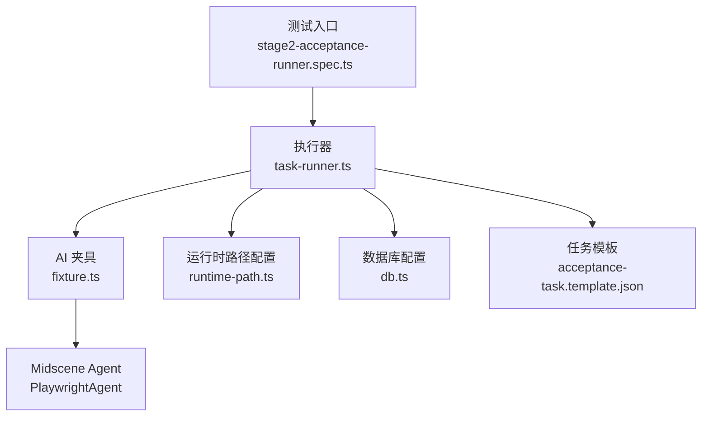
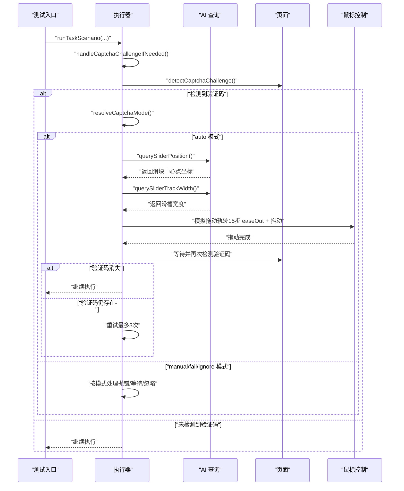
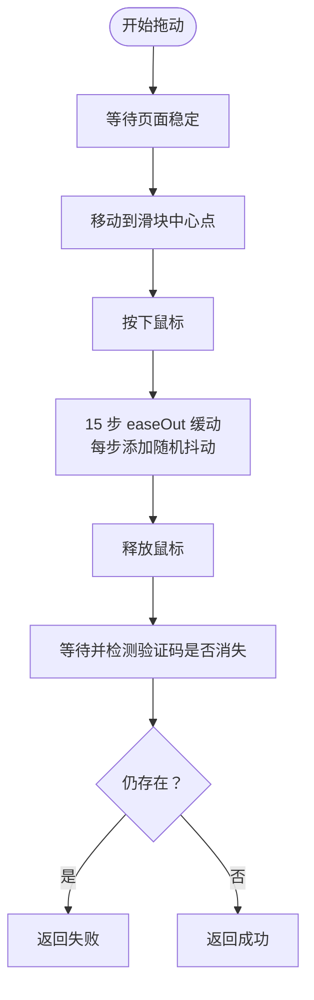
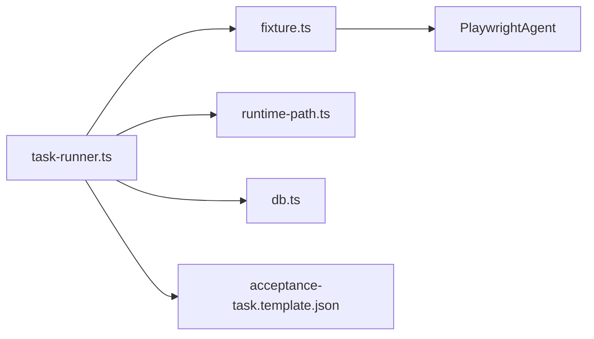

# 验证码处理系统

<cite>
**本文引用的文件**
- [README.md](file://README.md)
- [task-runner.ts](file://src/stage2/task-runner.ts)
- [stage2-acceptance-runner.spec.ts](file://tests/generated/stage2-acceptance-runner.spec.ts)
- [fixture.ts](file://tests/fixture/fixture.ts)
- [runtime-path.ts](file://config/runtime-path.ts)
- [db.ts](file://config/db.ts)
- [acceptance-task.template.json](file://specs/tasks/acceptance-task.template.json)
- [package.json](file://package.json)
</cite>

## 目录
1. [简介](#简介)
2. [项目结构](#项目结构)
3. [核心组件](#核心组件)
4. [架构总览](#架构总览)
5. [详细组件分析](#详细组件分析)
6. [依赖关系分析](#依赖关系分析)
7. [性能考量](#性能考量)
8. [故障排查指南](#故障排查指南)
9. [结论](#结论)
10. [附录](#附录)

## 简介
本文件面向 HI-TEST 项目的验证码处理系统，聚焦滑块验证码的自动识别与处理机制。系统通过 AI 模型（Midscene）对页面截图进行结构化分析，结合 Playwright 的鼠标 API 模拟真实用户拖动轨迹，最终完成滑块验证并通过检测。文档覆盖验证码模式配置（auto/manual/fail/ignore）、超时控制、重试策略、错误处理、AI 查询接口调用、拖动轨迹模拟以及结果判断等关键环节，并提供环境变量配置说明、调试技巧与性能优化建议。

## 项目结构
- 核心执行器位于 src/stage2/task-runner.ts，负责任务执行、验证码检测与处理、AI 查询与断言等。
- 测试入口 tests/generated/stage2-acceptance-runner.spec.ts 将任务 JSON 交由执行器运行。
- Midscene + Playwright 夹具 tests/fixture/fixture.ts 提供 ai/aiQuery/aiAssert/aiWaitFor 等能力。
- 运行时路径与产物目录由 config/runtime-path.ts 统一管理。
- 数据库配置 config/db.ts 与迁移脚本配合持久化运行结果。
- 任务模板 specs/tasks/acceptance-task.template.json 定义了任务结构与断言规则。
- package.json 提供脚本命令与依赖声明。

图表来源
- [stage2-acceptance-runner.spec.ts:12-37](file://tests/generated/stage2-acceptance-runner.spec.ts#L12-L37)
- [task-runner.ts:18-25](file://src/stage2/task-runner.ts#L18-L25)
- [fixture.ts:23-99](file://tests/fixture/fixture.ts#L23-L99)
- [runtime-path.ts:13-40](file://config/runtime-path.ts#L13-L40)
- [db.ts:20-26](file://config/db.ts#L20-L26)
- [acceptance-task.template.json:1-141](file://specs/tasks/acceptance-task.template.json#L1-L141)

章节来源
- [README.md:132-223](file://README.md#L132-L223)
- [package.json:6-25](file://package.json#L6-L25)

## 核心组件
- 验证码模式解析与超时控制：根据环境变量解析验证码模式与等待超时，支持 auto/manual/fail/ignore 四种模式。
- 验证码检测：通过文本关键字与选择器组合检测页面是否存在滑块验证码。
- AI 查询接口：封装 aiQuery，用于获取滑块按钮位置与滑槽宽度。
- 拖动轨迹模拟：使用 Playwright mouse API，实现 15 步 easeOut 缓动与随机抖动，模拟真实人类拖动。
- 结果判断与重试：验证滑块是否消失，最多重试 3 次；人工模式下轮询等待直至超时。
- 错误处理：捕获异常并确保鼠标释放，避免页面状态异常。

章节来源
- [task-runner.ts:55-87](file://src/stage2/task-runner.ts#L55-L87)
- [task-runner.ts:483-501](file://src/stage2/task-runner.ts#L483-L501)
- [task-runner.ts:510-559](file://src/stage2/task-runner.ts#L510-L559)
- [task-runner.ts:561-648](file://src/stage2/task-runner.ts#L561-L648)
- [task-runner.ts:650-706](file://src/stage2/task-runner.ts#L650-L706)

## 架构总览
验证码处理流程在执行器内部被调用，贯穿任务执行的导航与表单填写阶段。系统在每次菜单点击、表单提交等关键节点前调用验证码处理函数，确保在出现滑块验证码时能自动处理或人工等待。

图表来源
- [task-runner.ts:650-706](file://src/stage2/task-runner.ts#L650-L706)
- [task-runner.ts:510-559](file://src/stage2/task-runner.ts#L510-L559)
- [task-runner.ts:561-648](file://src/stage2/task-runner.ts#L561-L648)
- [stage2-acceptance-runner.spec.ts:18-25](file://tests/generated/stage2-acceptance-runner.spec.ts#L18-L25)

## 详细组件分析

### 验证码模式与超时控制
- 模式解析：优先读取环境变量 STAGE2_CAPTCHA_MODE，支持 auto/manual/fail/ignore，默认 auto。
- 超时解析：读取 STAGE2_CAPTCHA_WAIT_TIMEOUT_MS，单位毫秒，默认 120000；非法值回退默认值。
- 检查间隔：人工模式轮询检测验证码的间隔固定为 1000ms。

章节来源
- [task-runner.ts:55-87](file://src/stage2/task-runner.ts#L55-L87)
- [README.md:56-62](file://README.md#L56-L62)

### 验证码检测算法
- 文本关键字：包含“请完成安全验证”“请按住滑块”“拖动到最右边”“向右滑动”等提示文本。
- 选择器模式：针对 nc_wrapper、nc_scale、以 nc_ 开头的 wrapper、包含 captcha 的类等常见滑块容器。
- 可见性判断：通过 isLocatorVisible 对每个候选元素进行可见性检查，任一匹配即判定为存在验证码。

章节来源
- [task-runner.ts:42-53](file://src/stage2/task-runner.ts#L42-L53)
- [task-runner.ts:483-501](file://src/stage2/task-runner.ts#L483-L501)
- [task-runner.ts:469-481](file://src/stage2/task-runner.ts#L469-L481)

### AI 查询接口与响应解析
- querySliderPosition：请求 AI 返回滑块按钮中心点坐标（x, y）及可选尺寸（width, height），若返回 found 且 x/y 存在则视为有效。
- querySliderTrackWidth：请求 AI 返回滑槽总宽度（像素），若返回 found 且 width > 0 则视为有效。
- 响应容错：捕获 AI 查询异常并返回 null，避免影响整体流程。

章节来源
- [task-runner.ts:510-538](file://src/stage2/task-runner.ts#L510-L538)
- [task-runner.ts:540-559](file://src/stage2/task-runner.ts#L540-L559)

### 拖动轨迹模拟与验证
- 起始准备：等待页面稳定，移动至滑块中心点，按下鼠标，稍作延时。
- 轨迹生成：计算目标 x 坐标（优先使用滑槽宽度，否则使用固定偏移），分 15 步进行 easeOut 缓动，每步添加随机抖动（-3~3 像素水平，-2~2 像素垂直），步间延时 30-80ms。
- 结束动作：确保到达目标位置，释放鼠标，等待 500ms 后再次检测验证码是否消失。
- 异常处理：捕获拖动过程中的异常，确保释放鼠标，返回失败。

图表来源
- [task-runner.ts:561-648](file://src/stage2/task-runner.ts#L561-L648)

章节来源
- [task-runner.ts:561-648](file://src/stage2/task-runner.ts#L561-L648)

### 验证结果判断与重试策略
- 成功条件：验证码消失，等待 DOMContentLoaded 并短暂停留。
- 失败条件：验证码仍存在或拖动异常。
- 重试次数：自动模式最多重试 3 次，每次失败后等待 2000ms。
- 人工模式：在超时时间内轮询检测验证码消失，超时则抛错。

章节来源
- [task-runner.ts:625-648](file://src/stage2/task-runner.ts#L625-L648)
- [task-runner.ts:668-706](file://src/stage2/task-runner.ts#L668-L706)

### 环境变量与配置
- 验证码模式：STAGE2_CAPTCHA_MODE（auto/manual/fail/ignore）
- 人工模式等待超时：STAGE2_CAPTCHA_WAIT_TIMEOUT_MS（毫秒）
- Midscene 模型与运行目录：MIDSCENE_MODEL_NAME、MIDSCENE_RUN_DIR 等
- 运行产物目录：RUNTIME_DIR_PREFIX、PLAYWRIGHT_OUTPUT_DIR、PLAYWRIGHT_HTML_REPORT_DIR、ACCEPTANCE_RESULT_DIR
- 数据库驱动与文件路径：DB_DRIVER、DB_FILE_PATH

章节来源
- [README.md:39-54](file://README.md#L39-L54)
- [runtime-path.ts:13-40](file://config/runtime-path.ts#L13-L40)
- [db.ts:20-26](file://config/db.ts#L20-L26)

### 调试技巧
- 在自动模式下观察控制台日志，定位滑块位置与目标位置。
- 若自动处理失败，建议切换为 manual 模式，观察页面截图与 Midscene 报告。
- 调整滑块检测选择器或文本关键字，提升检测准确率。
- 使用 --headed 参数运行，便于观察页面交互细节。

章节来源
- [README.md:64-74](file://README.md#L64-L74)
- [stage2-acceptance-runner.spec.ts:10](file://tests/generated/stage2-acceptance-runner.spec.ts#L10)

## 依赖关系分析
- 执行器依赖 Midscene 的 ai/aiQuery/aiAssert/aiWaitFor 能力，通过夹具注入。
- 运行时路径与产物目录由 runtime-path.ts 解析环境变量统一管理。
- 数据库配置由 db.ts 读取环境变量，支持 SQLite 单文件数据库。
- 任务模板 acceptance-task.template.json 为执行器提供断言与 UI 选择器配置。

图表来源
- [task-runner.ts:18-25](file://src/stage2/task-runner.ts#L18-L25)
- [fixture.ts:23-99](file://tests/fixture/fixture.ts#L23-L99)
- [runtime-path.ts:13-40](file://config/runtime-path.ts#L13-L40)
- [db.ts:20-26](file://config/db.ts#L20-L26)
- [acceptance-task.template.json:1-141](file://specs/tasks/acceptance-task.template.json#L1-L141)

章节来源
- [task-runner.ts:18-25](file://src/stage2/task-runner.ts#L18-L25)
- [runtime-path.ts:13-40](file://config/runtime-path.ts#L13-L40)
- [db.ts:20-26](file://config/db.ts#L20-L26)
- [acceptance-task.template.json:1-141](file://specs/tasks/acceptance-task.template.json#L1-L141)

## 性能考量
- 拖动步数与抖动：15 步 easeOut 缓动与随机抖动已足够模拟真实轨迹，进一步增加步数会线性增加等待时间。
- 步间延时：30-80ms 的随机延时平衡了真实性与性能，可根据网络与设备情况微调。
- 重试策略：最多 3 次重试，每次等待 2000ms，避免长时间阻塞。
- 人工模式轮询：1000ms 间隔，兼顾实时性与资源占用。
- 建议：在高并发场景下，适当降低重试次数或延长步间延时，避免过度消耗资源。

[本节为通用性能建议，无需特定文件引用]

## 故障排查指南
- 自动处理失败
  - 现象：滑块仍存在，返回失败。
  - 排查：检查页面截图与 Midscene 报告，确认滑块样式是否发生变化；调整滑块检测选择器或文本关键字；必要时切换为 manual 模式。
  - 参考：自动处理最多重试 3 次，失败后抛出明确错误信息。
- 人工模式超时
  - 现象：超过 STAGE2_CAPTCHA_WAIT_TIMEOUT_MS 仍未完成验证码。
  - 排查：增大等待超时；确认页面验证码是否正常显示；检查网络与浏览器稳定性。
- AI 查询异常
  - 现象：querySliderPosition 或 querySliderTrackWidth 返回 null。
  - 排查：检查 Midscene 模型配置与网络连接；确认页面截图清晰；适当调整提示词。
- 页面状态异常
  - 现象：拖动过程中鼠标未释放导致页面卡顿。
  - 排查：自动处理已捕获异常并确保释放鼠标；如仍出现异常，重启浏览器或重新加载页面。

章节来源
- [task-runner.ts:668-706](file://src/stage2/task-runner.ts#L668-L706)
- [task-runner.ts:510-559](file://src/stage2/task-runner.ts#L510-L559)
- [task-runner.ts:638-647](file://src/stage2/task-runner.ts#L638-L647)

## 结论
HI-TEST 的验证码处理系统通过 AI 与 Playwright 的协同，实现了滑块验证码的自动化识别与拖动。系统提供了灵活的模式配置、完善的超时与重试策略、健壮的错误处理与可观测的日志输出。通过合理配置环境变量与调试技巧，可在不同页面风格与网络环境下稳定运行。建议在生产环境中结合业务场景对检测关键字、轨迹参数与重试策略进行针对性优化。

[本节为总结性内容，无需特定文件引用]

## 附录
- 运行命令
  - 运行第二段任务：npm run stage2:run 或 npm run stage2:run:headed
  - 初始化数据库：npm run db:init
  - 执行迁移：npm run db:migrate
- 关键文件路径
  - 执行器：src/stage2/task-runner.ts
  - 测试入口：tests/generated/stage2-acceptance-runner.spec.ts
  - Midscene 夹具：tests/fixture/fixture.ts
  - 运行时路径：config/runtime-path.ts
  - 数据库配置：config/db.ts
  - 任务模板：specs/tasks/acceptance-task.template.json

章节来源
- [package.json:6-25](file://package.json#L6-L25)
- [README.md:154-189](file://README.md#L154-L189)