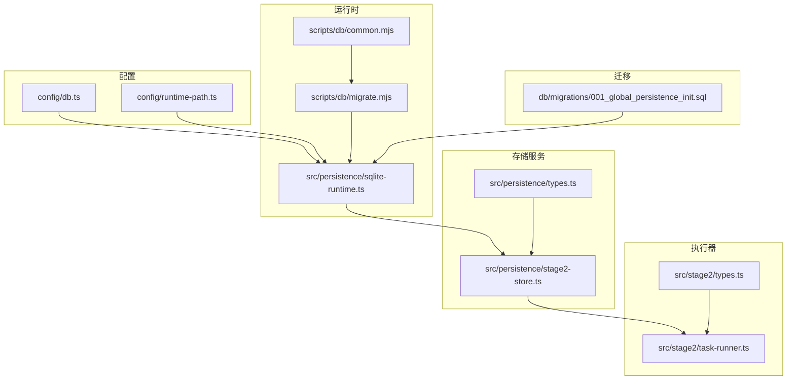
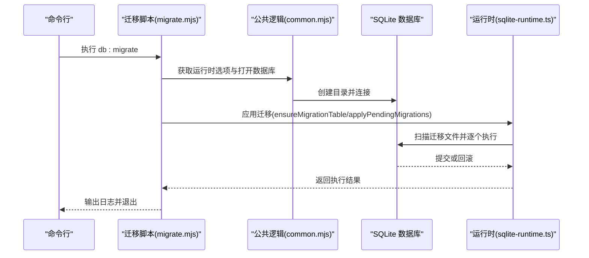
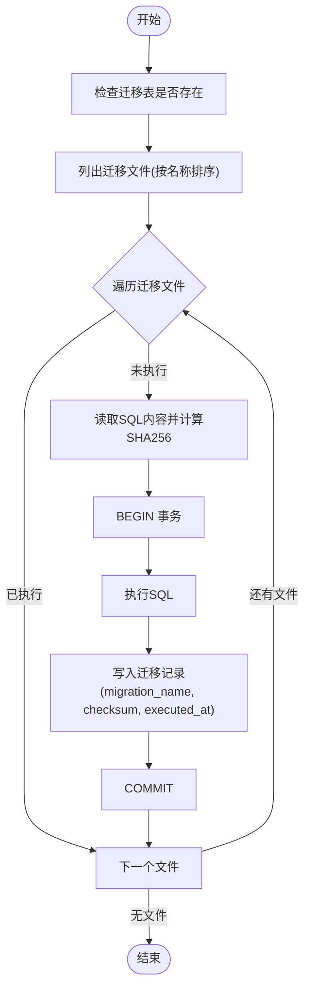
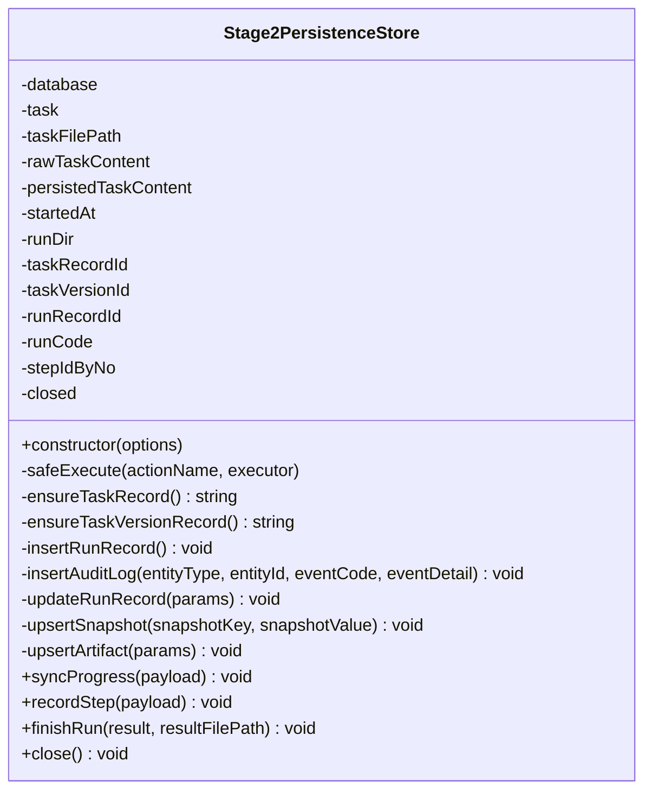
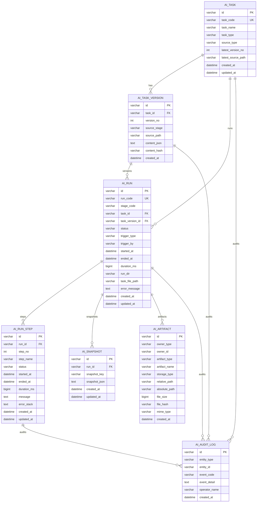
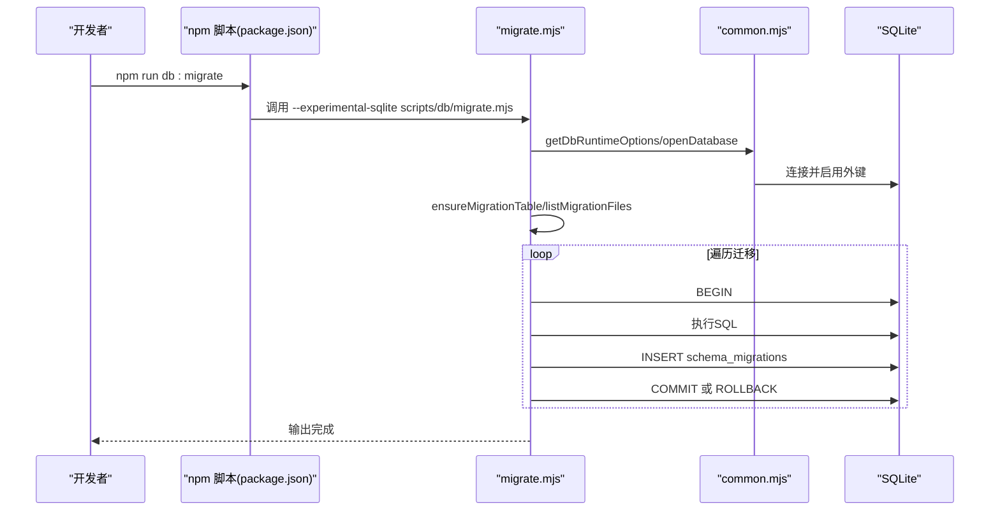
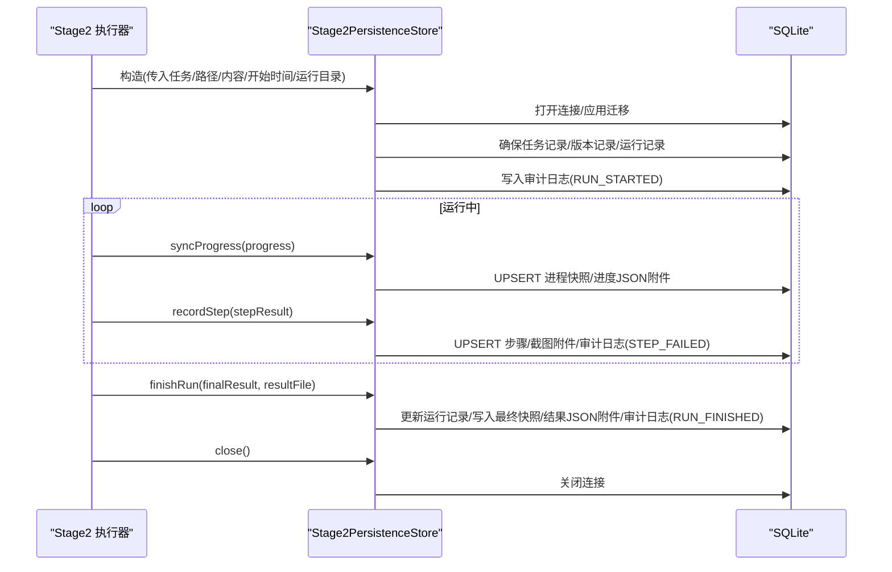
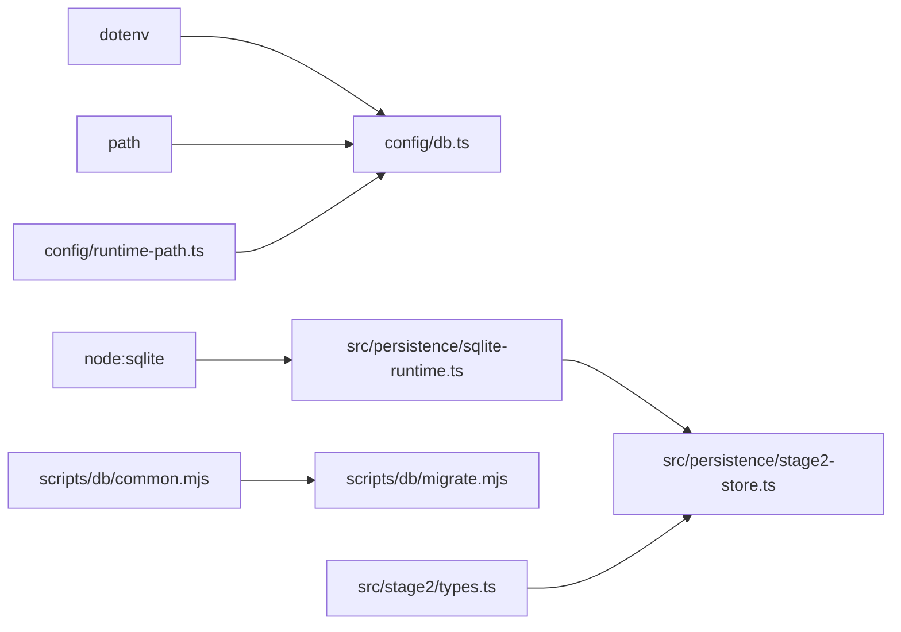

# 数据持久化层

<cite>
**本文引用的文件**
- [sqlite-runtime.ts](file://src/persistence/sqlite-runtime.ts)
- [stage2-store.ts](file://src/persistence/stage2-store.ts)
- [types.ts](file://src/persistence/types.ts)
- [db.ts](file://config/db.ts)
- [runtime-path.ts](file://config/runtime-path.ts)
- [001_global_persistence_init.sql](file://db/migrations/001_global_persistence_init.sql)
- [migrate.mjs](file://scripts/db/migrate.mjs)
- [common.mjs](file://scripts/db/common.mjs)
- [task-runner.ts](file://src/stage2/task-runner.ts)
- [types.ts](file://src/stage2/types.ts)
- [package.json](file://package.json)
- [README.md](file://README.md)
</cite>

## 目录
1. [简介](#简介)
2. [项目结构](#项目结构)
3. [核心组件](#核心组件)
4. [架构总览](#架构总览)
5. [详细组件分析](#详细组件分析)
6. [依赖关系分析](#依赖关系分析)
7. [性能考量](#性能考量)
8. [故障排查指南](#故障排查指南)
9. [结论](#结论)
10. [附录](#附录)

## 简介
本文件面向 HI-TEST 项目的“数据持久化层”，系统性阐述基于 SQLite 的全局数据持久化架构设计与实现，覆盖任务执行结果存储、审计日志记录、数据库迁移与版本控制、并发与一致性保障、以及 API 使用与性能优化建议。文档同时给出数据模型、表结构、索引策略与约束规则，并通过图示展示关键流程与组件关系，帮助读者快速理解与上手。

## 项目结构
持久化相关模块主要分布在以下位置：
- 配置层：数据库驱动与路径解析
- 运行时封装：SQLite 连接、迁移应用、日期与哈希工具
- 存储服务：Stage2 执行器的数据落库逻辑
- 迁移脚本：命令行迁移工具与公共逻辑
- 类型定义：统一的数据模型接口
- 运行入口：Stage2 执行器集成持久化服务

图表来源
- [db.ts:1-28](file://config/db.ts#L1-L28)
- [runtime-path.ts:1-41](file://config/runtime-path.ts#L1-L41)
- [sqlite-runtime.ts:1-116](file://src/persistence/sqlite-runtime.ts#L1-L116)
- [stage2-store.ts:1-655](file://src/persistence/stage2-store.ts#L1-L655)
- [types.ts:1-125](file://src/persistence/types.ts#L1-L125)
- [migrate.mjs:1-52](file://scripts/db/migrate.mjs#L1-L52)
- [common.mjs:1-108](file://scripts/db/common.mjs#L1-L108)
- [001_global_persistence_init.sql:1-128](file://db/migrations/001_global_persistence_init.sql#L1-L128)
- [task-runner.ts:1-800](file://src/stage2/task-runner.ts#L1-L800)
- [types.ts:1-180](file://src/stage2/types.ts#L1-L180)

章节来源
- [db.ts:1-28](file://config/db.ts#L1-L28)
- [runtime-path.ts:1-41](file://config/runtime-path.ts#L1-L41)
- [sqlite-runtime.ts:1-116](file://src/persistence/sqlite-runtime.ts#L1-L116)
- [stage2-store.ts:1-655](file://src/persistence/stage2-store.ts#L1-L655)
- [types.ts:1-125](file://src/persistence/types.ts#L1-L125)
- [migrate.mjs:1-52](file://scripts/db/migrate.mjs#L1-L52)
- [common.mjs:1-108](file://scripts/db/common.mjs#L1-L108)
- [001_global_persistence_init.sql:1-128](file://db/migrations/001_global_persistence_init.sql#L1-L128)
- [task-runner.ts:1-800](file://src/stage2/task-runner.ts#L1-L800)
- [types.ts:1-180](file://src/stage2/types.ts#L1-L180)

## 核心组件
- 数据库配置与路径解析：负责读取环境变量、解析数据库文件路径与运行时目录。
- SQLite 运行时：封装数据库连接、迁移表创建、迁移应用、日期格式化、哈希计算、相对路径转换等。
- Stage2 存储服务：面向第二阶段执行器的写库服务，负责任务/版本/运行/步骤/快照/附件/审计日志的插入与更新。
- 迁移脚本：提供命令行迁移工具，扫描迁移文件、去重、校验校验和、事务执行与回滚。
- 类型定义：统一持久化层的数据模型接口，便于前后端/工具链协作。

章节来源
- [db.ts:1-28](file://config/db.ts#L1-L28)
- [sqlite-runtime.ts:1-116](file://src/persistence/sqlite-runtime.ts#L1-L116)
- [stage2-store.ts:1-655](file://src/persistence/stage2-store.ts#L1-L655)
- [types.ts:1-125](file://src/persistence/types.ts#L1-L125)
- [migrate.mjs:1-52](file://scripts/db/migrate.mjs#L1-L52)
- [common.mjs:1-108](file://scripts/db/common.mjs#L1-L108)

## 架构总览
持久化层采用“配置-运行时-存储服务-迁移”的分层设计，配合统一的类型定义，形成可扩展、可迁移、可审计的数据底座。

图表来源
- [migrate.mjs:1-52](file://scripts/db/migrate.mjs#L1-L52)
- [common.mjs:1-108](file://scripts/db/common.mjs#L1-L108)
- [sqlite-runtime.ts:73-114](file://src/persistence/sqlite-runtime.ts#L73-L114)

章节来源
- [migrate.mjs:1-52](file://scripts/db/migrate.mjs#L1-L52)
- [common.mjs:1-108](file://scripts/db/common.mjs#L1-L108)
- [sqlite-runtime.ts:1-116](file://src/persistence/sqlite-runtime.ts#L1-L116)

## 详细组件分析

### 组件一：SQLite 运行时与迁移管理
- 功能要点
  - 打开数据库连接并启用外键约束。
  - 确保迁移表存在，避免重复执行。
  - 扫描迁移文件并按名称排序，逐个执行 SQL。
  - 计算迁移文件内容的 SHA256 校验和，记录到迁移表。
  - 使用显式事务包裹每个迁移，失败则回滚。
  - 提供日期格式化、随机 ID 生成、相对路径转换、内容哈希等工具函数。

图表来源
- [sqlite-runtime.ts:86-114](file://src/persistence/sqlite-runtime.ts#L86-L114)
- [common.mjs:60-106](file://scripts/db/common.mjs#L60-L106)

章节来源
- [sqlite-runtime.ts:1-116](file://src/persistence/sqlite-runtime.ts#L1-L116)
- [common.mjs:1-108](file://scripts/db/common.mjs#L1-L108)

### 组件二：Stage2 存储服务（写库服务）
- 功能要点
  - 在构造阶段：打开数据库、应用迁移、确保任务与任务版本记录、创建运行记录、写入审计日志。
  - 进度同步：UPSERT 进程快照（resolved_values、query_snapshots、progress_state）、写入进度 JSON 附件。
  - 步骤写入：根据 stepNo 与运行记录关联，UPSERT 步骤记录，必要时写入截图附件与审计日志。
  - 结束收尾：更新运行记录状态、写入最终结果摘要、写入结果 JSON 附件、写入审计日志。
  - 关闭：安全关闭数据库连接，防止重复关闭。

图表来源
- [stage2-store.ts:74-641](file://src/persistence/stage2-store.ts#L74-L641)

章节来源
- [stage2-store.ts:1-655](file://src/persistence/stage2-store.ts#L1-L655)

### 组件三：数据模型与表结构
- 模型与枚举
  - 任务、任务版本、运行、步骤、快照、附件、审计日志等统一接口定义。
  - 运行状态、所有者类型、附件类型等枚举类型。

- 表结构与约束
  - ai_task：唯一 task_code，latest_version_no 默认 0。
  - ai_task_version：唯一 (task_id, version_no)，唯一 (task_id, content_hash)，外键级联删除。
  - ai_run：唯一 run_code，外键指向 ai_task 与 ai_task_version，ON DELETE SET NULL。
  - ai_run_step：唯一 (run_id, step_no)，外键级联删除。
  - ai_snapshot：唯一 (run_id, snapshot_key)，外键级联删除。
  - ai_artifact：无唯一索引，按 owner_type/owner_id 与 artifact_type/created_at 建有索引。
  - ai_audit_log：按 entity_type/entity_id/created_at 建有索引。

- 索引策略
  - ai_task: idx_ai_task_name
  - ai_run: idx_ai_run_task_stage_started_at, idx_ai_run_status_started_at
  - ai_run_step: idx_ai_run_step_run_id_status
  - ai_artifact: idx_ai_artifact_owner, idx_ai_artifact_type_created_at
  - ai_audit_log: idx_ai_audit_log_entity_created_at

图表来源
- [001_global_persistence_init.sql:1-128](file://db/migrations/001_global_persistence_init.sql#L1-L128)
- [types.ts:34-123](file://src/persistence/types.ts#L34-L123)

章节来源
- [001_global_persistence_init.sql:1-128](file://db/migrations/001_global_persistence_init.sql#L1-L128)
- [types.ts:1-125](file://src/persistence/types.ts#L1-L125)

### 组件四：迁移脚本与命令行工具
- 迁移脚本职责
  - 读取运行时配置，打开数据库，确保迁移表存在。
  - 列出迁移文件并逐个执行，记录校验和与执行时间。
  - 失败时回滚，保证幂等与一致性。

图表来源
- [package.json:6-11](file://package.json#L6-L11)
- [migrate.mjs:1-52](file://scripts/db/migrate.mjs#L1-L52)
- [common.mjs:31-58](file://scripts/db/common.mjs#L31-L58)

章节来源
- [package.json:1-26](file://package.json#L1-L26)
- [migrate.mjs:1-52](file://scripts/db/migrate.mjs#L1-L52)
- [common.mjs:1-108](file://scripts/db/common.mjs#L1-L108)

### 组件五：执行器集成与 API 使用
- 集成点
  - Stage2 执行器在启动时创建持久化存储实例，写入任务、版本、运行、快照、附件与审计日志。
  - 运行过程中周期性调用 syncProgress 与 recordStep，结束时调用 finishRun。
  - 执行器还负责生成运行目录、截图与报告文件，存储服务仅记录文件路径与元数据。

图表来源
- [stage2-store.ts:101-123](file://src/persistence/stage2-store.ts#L101-L123)
- [stage2-store.ts:470-630](file://src/persistence/stage2-store.ts#L470-L630)
- [task-runner.ts:1-800](file://src/stage2/task-runner.ts#L1-L800)

章节来源
- [stage2-store.ts:1-655](file://src/persistence/stage2-store.ts#L1-L655)
- [task-runner.ts:1-800](file://src/stage2/task-runner.ts#L1-L800)

## 依赖关系分析
- 配置依赖
  - config/db.ts 依赖 dotenv 读取环境变量，提供 dbDriver 与 dbFilePath，并解析绝对路径。
  - config/runtime-path.ts 读取运行时目录前缀，统一输出目录、报告目录、结果目录等。

- 运行时依赖
  - sqlite-runtime.ts 依赖 node:sqlite，提供 DatabaseSync、foreign_keys、事务与迁移表。
  - common.mjs 同样依赖 node:sqlite，提供迁移公共逻辑。

- 存储服务依赖
  - stage2-store.ts 依赖 sqlite-runtime.ts 的工具函数与数据库连接，依赖 stage2/types 的执行结果与步骤类型。

- 迁移脚本依赖
  - migrate.mjs 依赖 common.mjs 的公共逻辑，间接依赖 sqlite-runtime.ts 的迁移应用流程。

图表来源
- [db.ts:1-28](file://config/db.ts#L1-L28)
- [runtime-path.ts:1-41](file://config/runtime-path.ts#L1-L41)
- [sqlite-runtime.ts:1-116](file://src/persistence/sqlite-runtime.ts#L1-L116)
- [common.mjs:1-108](file://scripts/db/common.mjs#L1-L108)
- [migrate.mjs:1-52](file://scripts/db/migrate.mjs#L1-L52)
- [stage2-store.ts:1-655](file://src/persistence/stage2-store.ts#L1-L655)
- [types.ts:1-180](file://src/stage2/types.ts#L1-L180)

章节来源
- [db.ts:1-28](file://config/db.ts#L1-L28)
- [runtime-path.ts:1-41](file://config/runtime-path.ts#L1-L41)
- [sqlite-runtime.ts:1-116](file://src/persistence/sqlite-runtime.ts#L1-L116)
- [common.mjs:1-108](file://scripts/db/common.mjs#L1-L108)
- [migrate.mjs:1-52](file://scripts/db/migrate.mjs#L1-L52)
- [stage2-store.ts:1-655](file://src/persistence/stage2-store.ts#L1-L655)
- [types.ts:1-180](file://src/stage2/types.ts#L1-L180)

## 性能考量
- 索引与查询优化
  - ai_run 上针对 (task_id, stage_code, started_at)、(stage_code, status, started_at) 的复合索引，有利于按任务/阶段/状态检索。
  - ai_run_step 上按 (run_id, status) 索引，便于按运行与状态聚合统计。
  - ai_artifact 上按 (owner_type, owner_id) 与 (artifact_type, created_at) 索引，支持附件按归属与类型快速查询。
  - ai_audit_log 上按 (entity_type, entity_id, created_at) 索引，便于审计追踪。

- 写入性能
  - 使用显式事务包裹每个迁移，避免频繁提交带来的开销。
  - UPSERT 模式减少重复查询，提高写入吞吐。
  - 将大文件以路径形式存储，数据库仅存元数据，降低 IO 压力。

- 并发与一致性
  - SQLite 默认单文件锁，适合本地单进程写入场景。
  - 通过事务与外键约束保证参照完整性。
  - 迁移表记录校验和，避免重复执行与内容漂移。

- 建议
  - 对高频查询的维度增加复合索引，如 ai_run 上增加 (status, started_at)。
  - 对 ai_snapshot 与 ai_artifact 的键值进行分区或分表（未来演进）。
  - 控制快照 JSON 的大小，避免单条记录过大影响写入与查询。

## 故障排查指南
- 迁移失败
  - 现象：执行 db:migrate 报错并回滚。
  - 排查：检查迁移 SQL 是否语法正确；确认 schema_migrations 是否存在；查看具体错误堆栈。
  - 处理：修复 SQL 后重新执行；若需跳过已执行项，清理对应迁移记录后重试。

- 数据库连接问题
  - 现象：无法打开数据库或外键约束不生效。
  - 排查：确认 DB_DRIVER 为 sqlite；检查 DB_FILE_PATH 是否可写；确认已启用 foreign_keys。
  - 处理：修正环境变量；确保目录存在；重启进程。

- 写入异常
  - 现象：写入快照/附件/步骤失败但不抛出异常。
  - 排查：Stage2PersistenceStore 内部使用安全执行包装，错误会被捕获并记录到控制台。
  - 处理：查看控制台日志；检查文件路径与权限；确认数据库连接未提前关闭。

- 数据不一致
  - 现象：运行记录状态与步骤状态不一致。
  - 排查：检查 finishRun 是否被调用；确认步骤写入顺序；核对错误栈是否为空。
  - 处理：确保执行器在异常时也能调用 finishRun；必要时手动修复。

章节来源
- [sqlite-runtime.ts:104-113](file://src/persistence/sqlite-runtime.ts#L104-L113)
- [stage2-store.ts:125-133](file://src/persistence/stage2-store.ts#L125-L133)
- [stage2-store.ts:632-640](file://src/persistence/stage2-store.ts#L632-L640)

## 结论
HI-TEST 的数据持久化层以 SQLite 为基础，结合统一的迁移管理与严格的外键约束，构建了可扩展、可审计、可迁移的数据底座。通过 Stage2 存储服务，系统实现了任务、版本、运行、步骤、快照、附件与审计日志的全生命周期管理。配合合理的索引策略与事务控制，能够在本地单文件数据库环境下高效支撑验收测试与自动化执行的落地需求。未来可平滑迁移到 MySQL，并进一步扩展索引与分区策略以提升大规模场景下的性能表现。

## 附录
- 常用命令
  - 初始化/迁移数据库：npm run db:init 或 npm run db:migrate
  - 运行第二段：npm run stage2:run 或 npm run stage2:run:headed

- 环境变量
  - DB_DRIVER、DB_FILE_PATH、RUNTIME_DIR_PREFIX、ACCEPTANCE_RESULT_DIR 等，详见 README 与 .env 示例。

章节来源
- [package.json:6-11](file://package.json#L6-L11)
- [README.md:39-54](file://README.md#L39-L54)