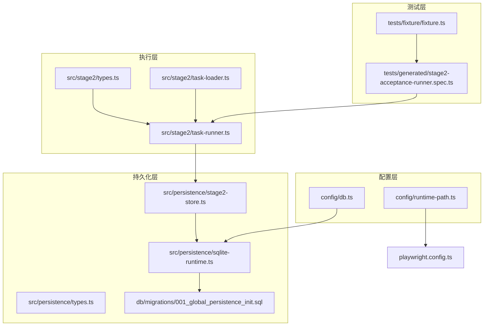
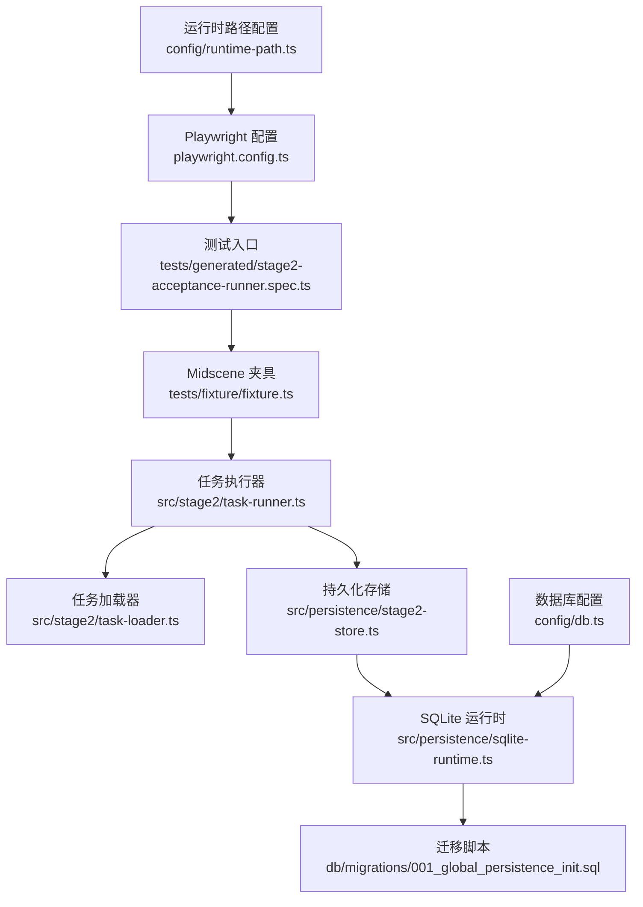
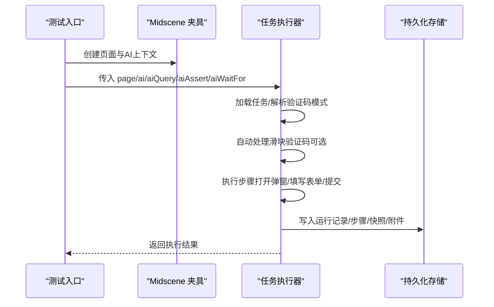
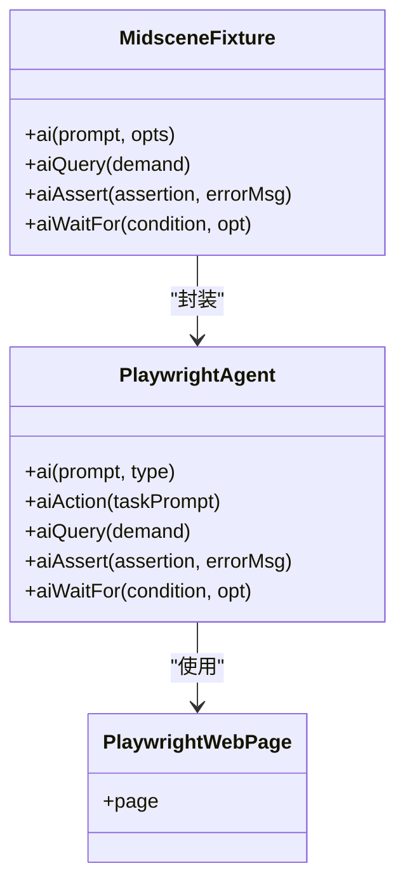
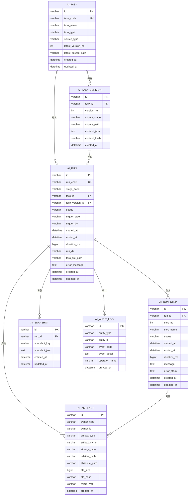
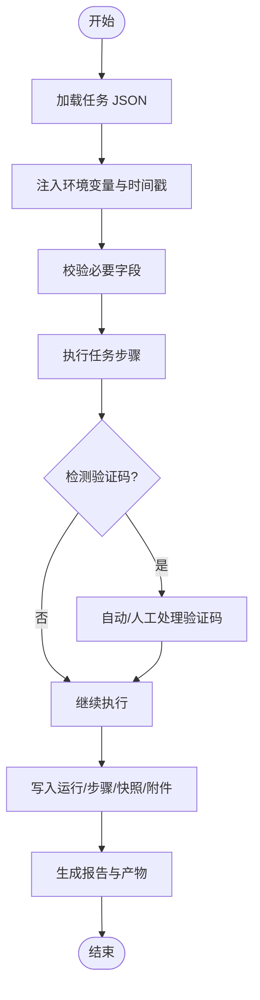
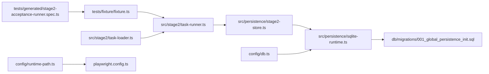

# 核心架构

<cite>
**本文引用的文件**
- [README.md](file://README.md)
- [package.json](file://package.json)
- [playwright.config.ts](file://playwright.config.ts)
- [config/runtime-path.ts](file://config/runtime-path.ts)
- [config/db.ts](file://config/db.ts)
- [src/stage2/task-runner.ts](file://src/stage2/task-runner.ts)
- [src/stage2/task-loader.ts](file://src/stage2/task-loader.ts)
- [src/stage2/types.ts](file://src/stage2/types.ts)
- [src/persistence/stage2-store.ts](file://src/persistence/stage2-store.ts)
- [src/persistence/sqlite-runtime.ts](file://src/persistence/sqlite-runtime.ts)
- [src/persistence/types.ts](file://src/persistence/types.ts)
- [db/migrations/001_global_persistence_init.sql](file://db/migrations/001_global_persistence_init.sql)
- [tests/generated/stage2-acceptance-runner.spec.ts](file://tests/generated/stage2-acceptance-runner.spec.ts)
- [tests/fixture/fixture.ts](file://tests/fixture/fixture.ts)
- [specs/tasks/acceptance-task.template.json](file://specs/tasks/acceptance-task.template.json)
- [specs/tasks/acceptance-task.community-create.example.json](file://specs/tasks/acceptance-task.community-create.example.json)
</cite>

## 目录
1. [引言](#引言)
2. [项目结构](#项目结构)
3. [核心组件](#核心组件)
4. [架构总览](#架构总览)
5. [详细组件分析](#详细组件分析)
6. [依赖分析](#依赖分析)
7. [性能考量](#性能考量)
8. [故障排查指南](#故障排查指南)
9. [结论](#结论)
10. [附录](#附录)

## 引言
本文件面向 HI-TEST 项目，系统性阐述基于 Playwright 与 Midscene AI 的测试执行引擎的整体架构设计。重点覆盖模块划分、组件交互、数据流向、分层架构理念与技术决策，并给出系统边界、集成模式与扩展点。文档同时提供架构图与组件分解说明，帮助读者快速理解并高效扩展。

## 项目结构
HI-TEST 采用“测试用例 JSON 驱动 + Midscene AI + Playwright”的执行链路，核心目录与职责如下：
- config：集中式运行时路径与数据库配置
- src/stage2：第二阶段执行器（任务加载、执行、AI/Playwright 协作、结果落库）
- src/persistence：全局数据持久化底座（SQLite，兼容 MySQL 子集）
- specs/tasks：任务输入 JSON 模板与示例
- tests：Playwright 测试入口与 Midscene 夹具
- db/migrations：数据库迁移脚本
- scripts/db：数据库初始化与迁移脚本（Node SQLite）

**图表来源**
- [playwright.config.ts:1-95](file://playwright.config.ts#L1-L95)
- [config/runtime-path.ts:1-41](file://config/runtime-path.ts#L1-L41)
- [config/db.ts:1-28](file://config/db.ts#L1-L28)
- [src/stage2/task-runner.ts:1-800](file://src/stage2/task-runner.ts#L1-L800)
- [src/stage2/task-loader.ts:1-91](file://src/stage2/task-loader.ts#L1-L91)
- [src/stage2/types.ts:1-180](file://src/stage2/types.ts#L1-L180)
- [src/persistence/stage2-store.ts:1-655](file://src/persistence/stage2-store.ts#L1-L655)
- [src/persistence/sqlite-runtime.ts:1-116](file://src/persistence/sqlite-runtime.ts#L1-L116)
- [src/persistence/types.ts:1-125](file://src/persistence/types.ts#L1-L125)
- [db/migrations/001_global_persistence_init.sql:1-128](file://db/migrations/001_global_persistence_init.sql#L1-L128)
- [tests/generated/stage2-acceptance-runner.spec.ts:1-39](file://tests/generated/stage2-acceptance-runner.spec.ts#L1-L39)
- [tests/fixture/fixture.ts:1-100](file://tests/fixture/fixture.ts#L1-L100)

**章节来源**
- [README.md:1-223](file://README.md#L1-L223)
- [package.json:1-26](file://package.json#L1-L26)
- [playwright.config.ts:1-95](file://playwright.config.ts#L1-L95)
- [config/runtime-path.ts:1-41](file://config/runtime-path.ts#L1-L41)
- [config/db.ts:1-28](file://config/db.ts#L1-L28)

## 核心组件
- 任务加载器：解析任务 JSON，注入环境变量与时间戳模板，校验必要字段
- 任务执行器：驱动 Playwright 与 Midscene AI 协作，执行步骤、断言、清理与验证码处理
- 数据持久化：将任务、运行、步骤、快照、附件等结构化信息写入 SQLite
- 测试夹具：封装 Midscene Agent，暴露 ai/aiQuery/aiAssert/aiWaitFor 等能力
- 运行时路径与数据库配置：集中管理 t_runtime/ 输出目录与 DB 文件路径

**章节来源**
- [src/stage2/task-loader.ts:1-91](file://src/stage2/task-loader.ts#L1-L91)
- [src/stage2/task-runner.ts:1-800](file://src/stage2/task-runner.ts#L1-L800)
- [src/persistence/stage2-store.ts:1-655](file://src/persistence/stage2-store.ts#L1-L655)
- [tests/fixture/fixture.ts:1-100](file://tests/fixture/fixture.ts#L1-L100)
- [config/runtime-path.ts:1-41](file://config/runtime-path.ts#L1-L41)
- [config/db.ts:1-28](file://config/db.ts#L1-L28)

## 架构总览
系统采用三层分层设计：
- 表现层（测试入口）：Playwright 测试用例 + Midscene 夹具
- 执行层（任务编排）：任务加载、步骤执行、AI/Playwright 协作、验证码处理
- 基础设施层（数据持久化）：SQLite 数据库 + 迁移脚本 + 运行产物目录

**图表来源**
- [tests/generated/stage2-acceptance-runner.spec.ts:1-39](file://tests/generated/stage2-acceptance-runner.spec.ts#L1-L39)
- [tests/fixture/fixture.ts:1-100](file://tests/fixture/fixture.ts#L1-L100)
- [src/stage2/task-runner.ts:1-800](file://src/stage2/task-runner.ts#L1-L800)
- [src/stage2/task-loader.ts:1-91](file://src/stage2/task-loader.ts#L1-L91)
- [src/persistence/stage2-store.ts:1-655](file://src/persistence/stage2-store.ts#L1-L655)
- [src/persistence/sqlite-runtime.ts:1-116](file://src/persistence/sqlite-runtime.ts#L1-L116)
- [db/migrations/001_global_persistence_init.sql:1-128](file://db/migrations/001_global_persistence_init.sql#L1-L128)
- [playwright.config.ts:1-95](file://playwright.config.ts#L1-L95)
- [config/runtime-path.ts:1-41](file://config/runtime-path.ts#L1-L41)
- [config/db.ts:1-28](file://config/db.ts#L1-L28)

## 详细组件分析

### 组件A：任务执行引擎（task-runner）
职责与特性：
- 解析验证码模式与超时参数，自动/人工/失败/忽略四种策略
- 自动滑块验证码处理：AI 查询滑块位置与轨道宽度，Playwright 模拟真人拖动轨迹
- 任务步骤执行：打开弹窗、填写表单（含级联）、触发提交、等待结果
- 断言与清理：支持多种断言类型与清理策略
- 进度与结果写库：实时写入运行、步骤、快照、附件与审计日志

**图表来源**
- [tests/generated/stage2-acceptance-runner.spec.ts:1-39](file://tests/generated/stage2-acceptance-runner.spec.ts#L1-L39)
- [tests/fixture/fixture.ts:1-100](file://tests/fixture/fixture.ts#L1-L100)
- [src/stage2/task-runner.ts:1-800](file://src/stage2/task-runner.ts#L1-L800)
- [src/persistence/stage2-store.ts:1-655](file://src/persistence/stage2-store.ts#L1-L655)

**章节来源**
- [src/stage2/task-runner.ts:1-800](file://src/stage2/task-runner.ts#L1-L800)

### 组件B：AI 集成模块（Midscene 夹具）
职责与特性：
- 封装 Midscene Agent，提供 ai/aiQuery/aiAssert/aiWaitFor 四类能力
- 通过 PlaywrightWebPage 与 PlaywrightAgent 实现页面交互与 AI 推理
- 生成 Midscene 报告与缓存，统一输出到 t_runtime/midscene_run

**图表来源**
- [tests/fixture/fixture.ts:1-100](file://tests/fixture/fixture.ts#L1-L100)

**章节来源**
- [tests/fixture/fixture.ts:1-100](file://tests/fixture/fixture.ts#L1-L100)

### 组件C：数据持久化模块（SQLite）
职责与特性：
- 提供运行时数据库连接、迁移应用、ID 生成、相对路径转换、内容哈希
- Stage2 持久化存储负责任务、版本、运行、步骤、快照、附件、审计日志的写入与更新
- 迁移脚本定义 ai_task、ai_task_version、ai_run、ai_run_step、ai_snapshot、ai_artifact、ai_audit_log 等表及索引

**图表来源**
- [db/migrations/001_global_persistence_init.sql:1-128](file://db/migrations/001_global_persistence_init.sql#L1-L128)
- [src/persistence/stage2-store.ts:1-655](file://src/persistence/stage2-store.ts#L1-L655)
- [src/persistence/sqlite-runtime.ts:1-116](file://src/persistence/sqlite-runtime.ts#L1-L116)
- [src/persistence/types.ts:1-125](file://src/persistence/types.ts#L1-L125)

**章节来源**
- [src/persistence/stage2-store.ts:1-655](file://src/persistence/stage2-store.ts#L1-L655)
- [src/persistence/sqlite-runtime.ts:1-116](file://src/persistence/sqlite-runtime.ts#L1-L116)
- [db/migrations/001_global_persistence_init.sql:1-128](file://db/migrations/001_global_persistence_init.sql#L1-L128)

### 组件D：任务输入与运行产物
- 任务输入：JSON 模板与示例，支持环境变量与时间戳模板注入
- 运行产物：Playwright 报告、Midscene 报告、第二段结果与截图、SQLite 数据库文件

**图表来源**
- [src/stage2/task-loader.ts:1-91](file://src/stage2/task-loader.ts#L1-L91)
- [src/stage2/task-runner.ts:1-800](file://src/stage2/task-runner.ts#L1-L800)
- [src/persistence/stage2-store.ts:1-655](file://src/persistence/stage2-store.ts#L1-L655)

**章节来源**
- [specs/tasks/acceptance-task.template.json:1-141](file://specs/tasks/acceptance-task.template.json#L1-L141)
- [specs/tasks/acceptance-task.community-create.example.json:1-229](file://specs/tasks/acceptance-task.community-create.example.json#L1-L229)
- [README.md:76-190](file://README.md#L76-L190)

## 依赖分析
- 测试入口依赖夹具提供的 AI 能力，夹具依赖 Midscene Agent 与 Playwright 页面对象
- 执行器依赖任务加载器与持久化存储，持久化存储依赖 SQLite 运行时与迁移脚本
- 配置层为运行时路径与数据库提供统一入口，Playwright 配置消费运行时路径

**图表来源**
- [tests/generated/stage2-acceptance-runner.spec.ts:1-39](file://tests/generated/stage2-acceptance-runner.spec.ts#L1-L39)
- [tests/fixture/fixture.ts:1-100](file://tests/fixture/fixture.ts#L1-L100)
- [src/stage2/task-runner.ts:1-800](file://src/stage2/task-runner.ts#L1-L800)
- [src/stage2/task-loader.ts:1-91](file://src/stage2/task-loader.ts#L1-L91)
- [src/persistence/stage2-store.ts:1-655](file://src/persistence/stage2-store.ts#L1-L655)
- [src/persistence/sqlite-runtime.ts:1-116](file://src/persistence/sqlite-runtime.ts#L1-L116)
- [db/migrations/001_global_persistence_init.sql:1-128](file://db/migrations/001_global_persistence_init.sql#L1-L128)
- [config/runtime-path.ts:1-41](file://config/runtime-path.ts#L1-L41)
- [config/db.ts:1-28](file://config/db.ts#L1-L28)
- [playwright.config.ts:1-95](file://playwright.config.ts#L1-L95)

**章节来源**
- [package.json:1-26](file://package.json#L1-L26)
- [playwright.config.ts:1-95](file://playwright.config.ts#L1-L95)
- [config/runtime-path.ts:1-41](file://config/runtime-path.ts#L1-L41)
- [config/db.ts:1-28](file://config/db.ts#L1-L28)

## 性能考量
- 并行与重试：Playwright 配置启用并行与 CI 环境下的重试，提升稳定性
- 超时与重试：任务步骤与断言支持可配置超时与重试，平衡鲁棒性与耗时
- 数据库事务：迁移应用使用显式事务，保证一致性与回滚能力
- 运行产物收敛：统一输出目录，便于清理与归档

[本节为通用指导，无需特定文件来源]

## 故障排查指南
- 验证码处理失败：检查验证码模式与等待超时；必要时切换为人工模式
- Midscene 报告缺失：确认夹具日志目录设置与运行时路径
- 数据库写入异常：检查 SQLite 驱动与迁移脚本执行情况
- 任务 JSON 校验失败：核对必要字段与模板注入后的值

**章节来源**
- [src/stage2/task-runner.ts:650-706](file://src/stage2/task-runner.ts#L650-L706)
- [tests/fixture/fixture.ts:10-10](file://tests/fixture/fixture.ts#L10-L10)
- [src/persistence/stage2-store.ts:125-133](file://src/persistence/stage2-store.ts#L125-L133)
- [src/stage2/task-loader.ts:50-69](file://src/stage2/task-loader.ts#L50-L69)

## 结论
HI-TEST 以“任务 JSON 驱动 + Midscene AI + Playwright”为核心，构建了清晰的三层架构：表现层、执行层与基础设施层。通过统一的运行时路径与数据库配置，结合可扩展的任务模型与稳健的数据持久化，系统实现了高可维护性与可扩展性。未来可在第一阶段执行器与数据库驱动扩展方面继续演进。

[本节为总结，无需特定文件来源]

## 附录
- 系统边界：测试入口与夹具对外暴露；执行器与持久化对内协作；配置层贯穿全局
- 集成模式：Midscene 通过夹具集成至 Playwright；SQLite 作为本地持久化介质
- 扩展点：任务模型可扩展断言与清理策略；数据库可平滑迁移到 MySQL；运行产物目录可按需扩展

[本节为概览，无需特定文件来源]