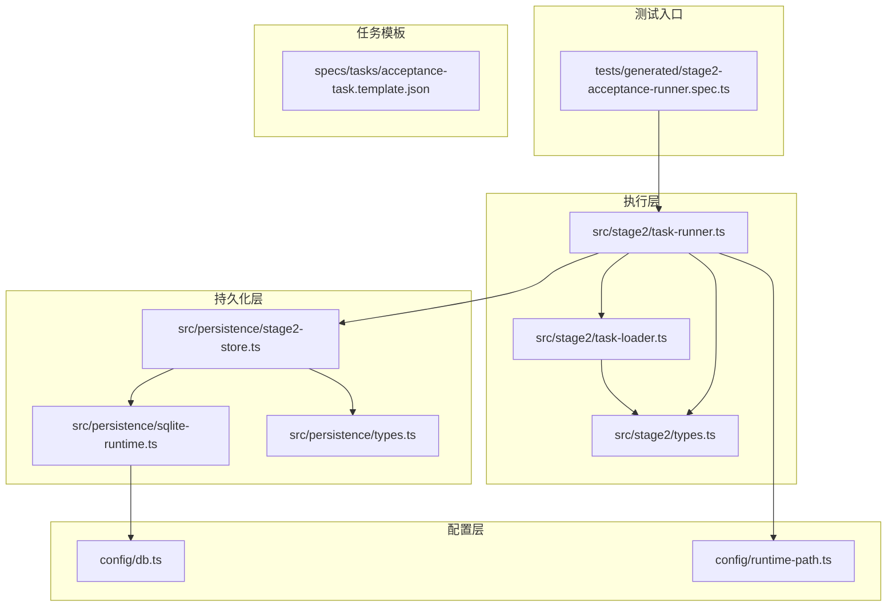
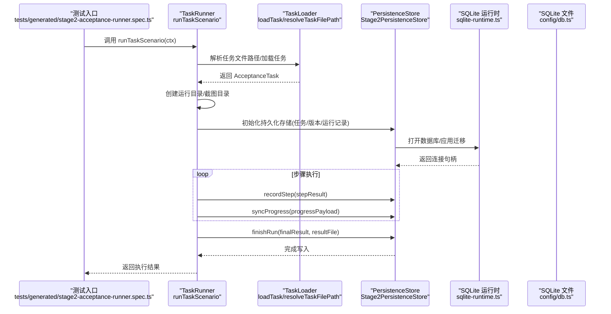
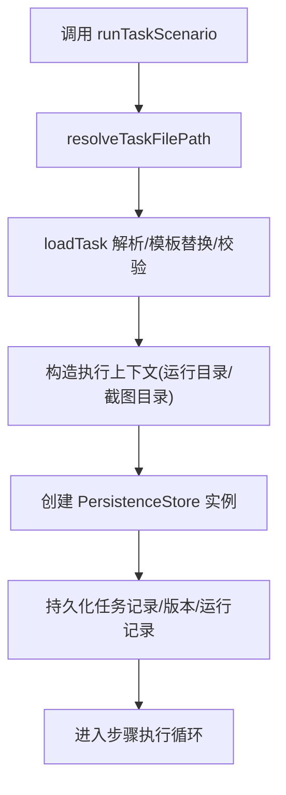
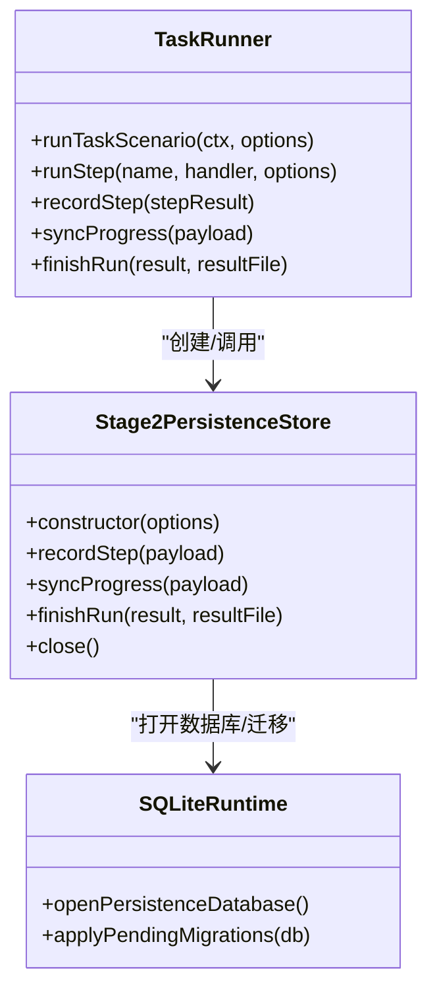
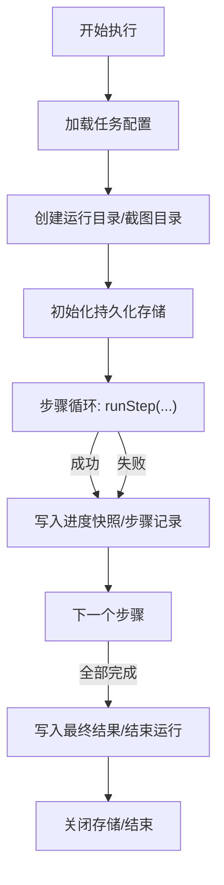
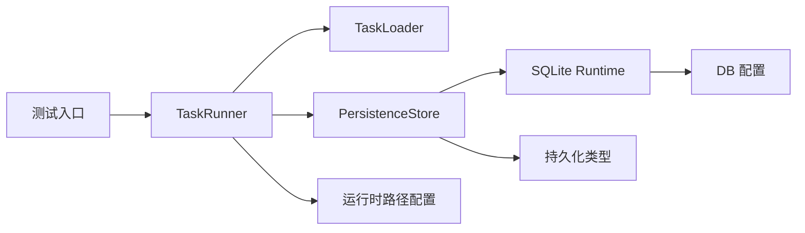

# 组件交互关系

<cite>
**本文引用的文件**
- [src/stage2/task-runner.ts](file://src/stage2/task-runner.ts)
- [src/stage2/task-loader.ts](file://src/stage2/task-loader.ts)
- [src/stage2/types.ts](file://src/stage2/types.ts)
- [src/persistence/stage2-store.ts](file://src/persistence/stage2-store.ts)
- [src/persistence/sqlite-runtime.ts](file://src/persistence/sqlite-runtime.ts)
- [src/persistence/types.ts](file://src/persistence/types.ts)
- [config/db.ts](file://config/db.ts)
- [config/runtime-path.ts](file://config/runtime-path.ts)
- [tests/generated/stage2-acceptance-runner.spec.ts](file://tests/generated/stage2-acceptance-runner.spec.ts)
- [specs/tasks/acceptance-task.template.json](file://specs/tasks/acceptance-task.template.json)
- [package.json](file://package.json)
</cite>

## 目录
1. [简介](#简介)
2. [项目结构](#项目结构)
3. [核心组件](#核心组件)
4. [架构总览](#架构总览)
5. [详细组件分析](#详细组件分析)
6. [依赖关系分析](#依赖关系分析)
7. [性能考量](#性能考量)
8. [故障排查指南](#故障排查指南)
9. [结论](#结论)
10. [附录](#附录)

## 简介
本文件聚焦 HI-TEST 项目中第二阶段（Stage2）的组件交互关系，围绕 TaskRunner、TaskLoader 与 PersistenceStore 三大核心模块，系统阐述：
- 从任务配置加载、执行流程、断言与清理，到结果落库与收尾的完整生命周期
- 模块间的数据流与控制流，接口契约、参数传递与返回值处理
- 异步处理、错误传播与状态同步机制
- 解耦设计原则与扩展性考虑

## 项目结构
项目采用分层与功能域结合的组织方式：
- src/stage2：第二阶段执行逻辑与类型定义
- src/persistence：持久化与 SQLite 运行时、迁移与实体模型
- config：数据库与运行时路径配置
- specs：任务模板与说明
- tests：端到端测试入口，驱动 TaskRunner 执行

图表来源
- [src/stage2/task-runner.ts:1-120](file://src/stage2/task-runner.ts#L1-L120)
- [src/stage2/task-loader.ts:1-91](file://src/stage2/task-loader.ts#L1-L91)
- [src/persistence/stage2-store.ts:1-120](file://src/persistence/stage2-store.ts#L1-L120)
- [src/persistence/sqlite-runtime.ts:1-116](file://src/persistence/sqlite-runtime.ts#L1-L116)
- [config/db.ts:1-28](file://config/db.ts#L1-L28)
- [config/runtime-path.ts:1-41](file://config/runtime-path.ts#L1-L41)
- [tests/generated/stage2-acceptance-runner.spec.ts:1-39](file://tests/generated/stage2-acceptance-runner.spec.ts#L1-L39)
- [specs/tasks/acceptance-task.template.json:1-141](file://specs/tasks/acceptance-task.template.json#L1-L141)

章节来源
- [src/stage2/task-runner.ts:1-120](file://src/stage2/task-runner.ts#L1-L120)
- [src/stage2/task-loader.ts:1-91](file://src/stage2/task-loader.ts#L1-L91)
- [src/persistence/stage2-store.ts:1-120](file://src/persistence/stage2-store.ts#L1-L120)
- [src/persistence/sqlite-runtime.ts:1-116](file://src/persistence/sqlite-runtime.ts#L1-L116)
- [config/db.ts:1-28](file://config/db.ts#L1-L28)
- [config/runtime-path.ts:1-41](file://config/runtime-path.ts#L1-L41)
- [tests/generated/stage2-acceptance-runner.spec.ts:1-39](file://tests/generated/stage2-acceptance-runner.spec.ts#L1-L39)
- [specs/tasks/acceptance-task.template.json:1-141](file://specs/tasks/acceptance-task.template.json#L1-L141)

## 核心组件
- TaskRunner：负责任务场景的编排与执行，包含页面导航、表单填写、提交、断言、清理、截图与状态上报等能力
- TaskLoader：负责任务配置文件的解析、模板变量替换与结构校验
- PersistenceStore：负责执行结果的持久化，包括任务记录、版本、运行记录、步骤、快照、制品与审计日志

章节来源
- [src/stage2/task-runner.ts:2318-2657](file://src/stage2/task-runner.ts#L2318-L2657)
- [src/stage2/task-loader.ts:71-91](file://src/stage2/task-loader.ts#L71-L91)
- [src/persistence/stage2-store.ts:74-123](file://src/persistence/stage2-store.ts#L74-L123)

## 架构总览
整体架构遵循“配置驱动 + 执行编排 + 持久化存储”的模式：
- 测试入口通过 Playwright Fixture 注入上下文，调用 TaskRunner 的 runTaskScenario
- TaskRunner 加载任务配置（TaskLoader），初始化运行目录与截图目录
- 在执行过程中，TaskRunner 通过 PersistenceStore 同步进度快照、步骤记录与最终结果
- SQLite 运行时负责数据库连接、迁移与表结构一致性

图表来源
- [tests/generated/stage2-acceptance-runner.spec.ts:12-37](file://tests/generated/stage2-acceptance-runner.spec.ts#L12-L37)
- [src/stage2/task-runner.ts:2318-2657](file://src/stage2/task-runner.ts#L2318-L2657)
- [src/stage2/task-loader.ts:71-91](file://src/stage2/task-loader.ts#L71-L91)
- [src/persistence/stage2-store.ts:101-123](file://src/persistence/stage2-store.ts#L101-L123)
- [src/persistence/sqlite-runtime.ts:73-114](file://src/persistence/sqlite-runtime.ts#L73-L114)
- [config/db.ts:20-26](file://config/db.ts#L20-L26)

## 详细组件分析

### TaskRunner 与 TaskLoader 的交互
- TaskRunner 通过 resolveTaskFilePath 获取任务文件绝对路径，再调用 loadTask 完成解析与模板替换
- loadTask 校验任务关键字段，确保必要字段存在
- TaskRunner 在执行前将原始任务内容与解析后的任务对象传给 PersistenceStore，用于任务记录与版本管理

图表来源
- [src/stage2/task-runner.ts:2318-2380](file://src/stage2/task-runner.ts#L2318-L2380)
- [src/stage2/task-loader.ts:71-91](file://src/stage2/task-loader.ts#L71-L91)

章节来源
- [src/stage2/task-runner.ts:2318-2380](file://src/stage2/task-runner.ts#L2318-L2380)
- [src/stage2/task-loader.ts:71-91](file://src/stage2/task-loader.ts#L71-L91)

### TaskRunner 与 PersistenceStore 的交互
- 初始化阶段：TaskRunner 将任务、任务文件路径、原始任务内容、启动时间与运行目录传入 createStage2PersistenceStore
- 执行阶段：每一步骤结束后，TaskRunner 调用 recordStep 写入步骤记录；同时将进度快照写入本地文件并通过 syncProgress 同步到数据库
- 结束阶段：TaskRunner 调用 finishRun 写入最终结果与汇总快照，并插入审计日志

图表来源
- [src/stage2/task-runner.ts:2382-2657](file://src/stage2/task-runner.ts#L2382-L2657)
- [src/persistence/stage2-store.ts:74-123](file://src/persistence/stage2-store.ts#L74-L123)
- [src/persistence/sqlite-runtime.ts:73-114](file://src/persistence/sqlite-runtime.ts#L73-L114)

章节来源
- [src/stage2/task-runner.ts:2382-2657](file://src/stage2/task-runner.ts#L2382-L2657)
- [src/persistence/stage2-store.ts:470-630](file://src/persistence/stage2-store.ts#L470-L630)
- [src/persistence/sqlite-runtime.ts:73-114](file://src/persistence/sqlite-runtime.ts#L73-L114)

### 执行生命周期与数据流
- 任务配置加载：TaskLoader 读取 JSON，进行模板变量替换（NOW_YYYYMMDDHHMMSS、环境变量），并校验关键字段
- 执行编排：TaskRunner 按步骤顺序执行，每个步骤封装为 runStep，内部捕获异常并生成 StepResult
- 截图与状态：当开启截图时，每个步骤生成 PNG 截图并记录到 StepResult
- 持久化：每步执行后写入本地 progress.json 并同步到数据库；最终写入 result.json 并更新运行记录

图表来源
- [src/stage2/task-runner.ts:2318-2657](file://src/stage2/task-runner.ts#L2318-L2657)
- [src/persistence/stage2-store.ts:470-630](file://src/persistence/stage2-store.ts#L470-L630)

章节来源
- [src/stage2/task-runner.ts:2318-2657](file://src/stage2/task-runner.ts#L2318-L2657)
- [src/persistence/stage2-store.ts:470-630](file://src/persistence/stage2-store.ts#L470-L630)

### 接口定义、参数与返回值
- runTaskScenario
  - 输入：RunnerContext（page、ai、aiAssert、aiQuery、aiWaitFor）、RunnerOptions（rawTaskFilePath）
  - 输出：Stage2ExecutionResult（包含任务标识、时间戳、状态、运行目录、解析值、查询快照、步骤列表）
- loadTask
  - 输入：任务文件路径
  - 输出：AcceptanceTask（含 target、account、form、search、assertions、cleanup、runtime、approval 等）
- Stage2PersistenceStore.recordStep
  - 输入：{ stepNo, stepResult }
  - 作用：写入步骤记录，必要时关联截图制品
- Stage2PersistenceStore.syncProgress
  - 输入：{ status, inProgress, resolvedValues, querySnapshots, steps, progressFilePath }
  - 作用：写入进度快照与进度 JSON 制品
- Stage2PersistenceStore.finishRun
  - 输入：最终执行结果、结果文件路径
  - 作用：更新运行记录状态、写入最终快照与结果 JSON 制品

章节来源
- [src/stage2/task-runner.ts:2318-2657](file://src/stage2/task-runner.ts#L2318-L2657)
- [src/stage2/task-loader.ts:79-91](file://src/stage2/task-loader.ts#L79-L91)
- [src/persistence/stage2-store.ts:495-630](file://src/persistence/stage2-store.ts#L495-L630)
- [src/stage2/types.ts:141-179](file://src/stage2/types.ts#L141-L179)

### 异步处理、错误传播与状态同步
- 异步处理：TaskRunner 使用 Promise 包装步骤执行；断言与清理均采用重试策略
- 错误传播：runStep 捕获异常，设置 StepResult.status 为 failed/skipped，记录 message/errorStack，并在 required=false 时继续执行
- 状态同步：每步执行后写入本地 progress.json 并通过 syncProgress 同步到数据库，保证中间态可观测

章节来源
- [src/stage2/task-runner.ts:2382-2435](file://src/stage2/task-runner.ts#L2382-L2435)
- [src/stage2/task-runner.ts:2404-2425](file://src/stage2/task-runner.ts#L2404-L2425)
- [src/persistence/stage2-store.ts:470-493](file://src/persistence/stage2-store.ts#L470-L493)

### 模块解耦与扩展性
- 解耦设计
  - TaskRunner 仅依赖 TaskLoader 的加载接口与 PersistenceStore 的持久化接口，不直接关心文件系统细节
  - PersistenceStore 通过 sqlite-runtime 抽象数据库访问，便于未来替换驱动
- 扩展性
  - 新增断言类型：在 TaskRunner 中扩展 runAssertion 分支即可
  - 新增清理策略：在 TaskRunner 中扩展 runCleanup 分支即可
  - 新增持久化字段：在 Stage2PersistenceStore 中扩展 upsertArtifact/upsertSnapshot 即可

章节来源
- [src/stage2/task-runner.ts:1562-1917](file://src/stage2/task-runner.ts#L1562-L1917)
- [src/stage2/task-runner.ts:2218-2316](file://src/stage2/task-runner.ts#L2218-L2316)
- [src/persistence/stage2-store.ts:358-468](file://src/persistence/stage2-store.ts#L358-L468)

## 依赖关系分析
- TaskRunner 依赖
  - TaskLoader：任务配置加载与校验
  - PersistenceStore：执行结果持久化
  - config/runtime-path：运行时目录解析
- PersistenceStore 依赖
  - sqlite-runtime：数据库连接与迁移
  - config/db：数据库驱动与路径
  - persistence/types：持久化实体模型
- 测试入口
  - tests/generated/stage2-acceptance-runner.spec.ts：驱动 TaskRunner 执行并断言结果

图表来源
- [src/stage2/task-runner.ts:1-16](file://src/stage2/task-runner.ts#L1-L16)
- [src/stage2/task-loader.ts:1-3](file://src/stage2/task-loader.ts#L1-L3)
- [src/persistence/stage2-store.ts:1-13](file://src/persistence/stage2-store.ts#L1-L13)
- [src/persistence/sqlite-runtime.ts:1-5](file://src/persistence/sqlite-runtime.ts#L1-L5)
- [config/db.ts:1-5](file://config/db.ts#L1-L5)
- [config/runtime-path.ts:1-4](file://config/runtime-path.ts#L1-L4)
- [src/persistence/types.ts:1-125](file://src/persistence/types.ts#L1-L125)
- [tests/generated/stage2-acceptance-runner.spec.ts:1-3](file://tests/generated/stage2-acceptance-runner.spec.ts#L1-L3)

章节来源
- [src/stage2/task-runner.ts:1-16](file://src/stage2/task-runner.ts#L1-L16)
- [src/stage2/task-loader.ts:1-3](file://src/stage2/task-loader.ts#L1-L3)
- [src/persistence/stage2-store.ts:1-13](file://src/persistence/stage2-store.ts#L1-L13)
- [src/persistence/sqlite-runtime.ts:1-5](file://src/persistence/sqlite-runtime.ts#L1-L5)
- [config/db.ts:1-5](file://config/db.ts#L1-L5)
- [config/runtime-path.ts:1-4](file://config/runtime-path.ts#L1-L4)
- [src/persistence/types.ts:1-125](file://src/persistence/types.ts#L1-L125)
- [tests/generated/stage2-acceptance-runner.spec.ts:1-3](file://tests/generated/stage2-acceptance-runner.spec.ts#L1-L3)

## 性能考量
- I/O 与磁盘
  - 进度与结果 JSON 文件写入频繁，建议在高并发场景下关注磁盘吞吐与文件锁
  - 截图文件数量随步骤增多而增长，建议合理控制截图开关与保留策略
- 数据库
  - SQLite 适合本地单机场景；若需更高并发，可评估替换为其他数据库并保持迁移接口一致
  - 迁移执行在初始化阶段完成，避免运行期阻塞
- 断言与清理
  - 断言与清理均采用重试策略，建议根据业务场景调整超时与重试次数，平衡稳定性与耗时

## 故障排查指南
- 任务文件缺失或格式错误
  - 现象：加载阶段抛出字段缺失错误
  - 处理：检查任务模板字段完整性，确认环境变量与 NOW_YYYYMMDDHHMMSS 模板替换
- 页面元素定位失败
  - 现象：步骤执行失败，截图中可见定位失败
  - 处理：检查 UI 选择器、提示信息与断言配置；必要时启用 AI 兜底
- 安全验证阻塞
  - 现象：滑块/安全验证弹窗导致执行停滞
  - 处理：配置 STAGE2_CAPTCHA_MODE 与 STAGE2_CAPTCHA_WAIT_TIMEOUT_MS；或人工处理
- 持久化失败
  - 现象：数据库连接失败或迁移异常
  - 处理：检查 DB_DRIVER 与 DB_FILE_PATH；确认运行时目录可写；查看迁移日志

章节来源
- [src/stage2/task-loader.ts:50-69](file://src/stage2/task-loader.ts#L50-L69)
- [src/stage2/task-runner.ts:650-706](file://src/stage2/task-runner.ts#L650-L706)
- [src/persistence/stage2-store.ts:632-640](file://src/persistence/stage2-store.ts#L632-L640)
- [config/db.ts:20-26](file://config/db.ts#L20-L26)

## 结论
本项目通过清晰的职责划分与接口抽象，实现了从任务配置到执行结果的完整闭环：
- TaskRunner 负责执行编排与状态管理
- TaskLoader 负责配置加载与校验
- PersistenceStore 负责结果持久化与可观测性
- SQLite 运行时提供可移植的本地存储能力
在保证可维护性的前提下，系统具备良好的扩展性，便于后续引入新的断言类型、清理策略与存储后端。

## 附录
- 任务模板参考：[specs/tasks/acceptance-task.template.json:1-141](file://specs/tasks/acceptance-task.template.json#L1-L141)
- 执行入口参考：[tests/generated/stage2-acceptance-runner.spec.ts:1-39](file://tests/generated/stage2-acceptance-runner.spec.ts#L1-L39)
- 依赖脚本参考：[package.json:6-11](file://package.json#L6-L11)