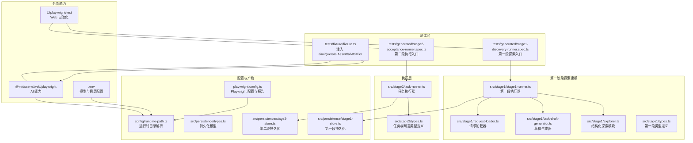
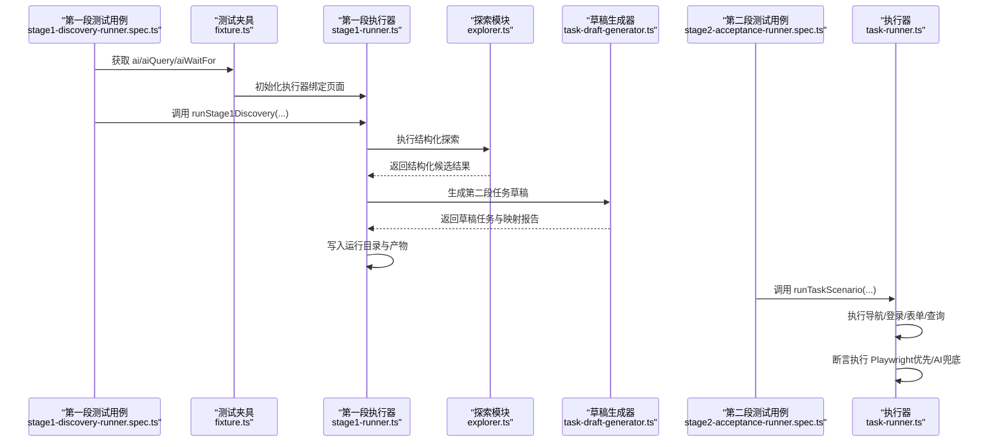
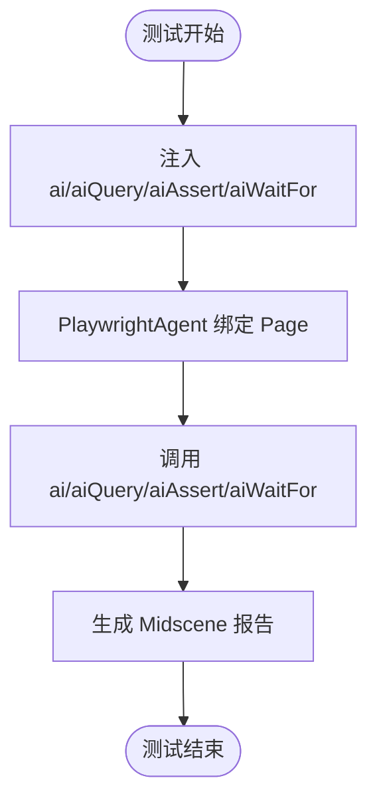
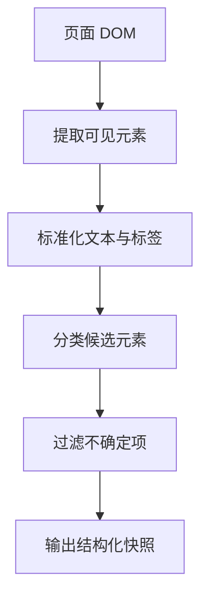
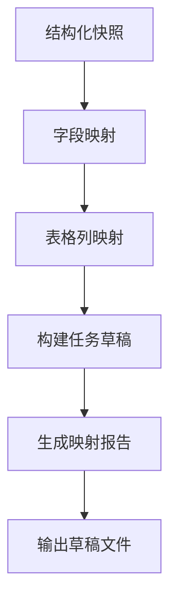
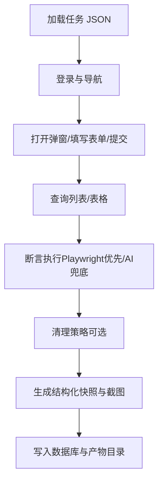
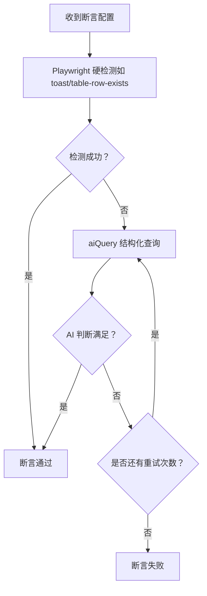
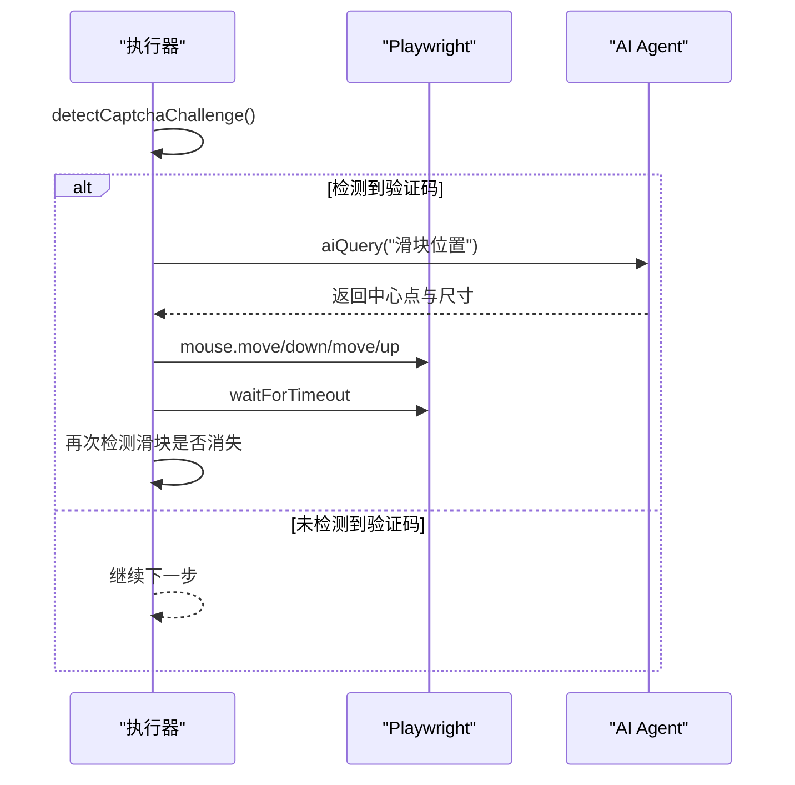
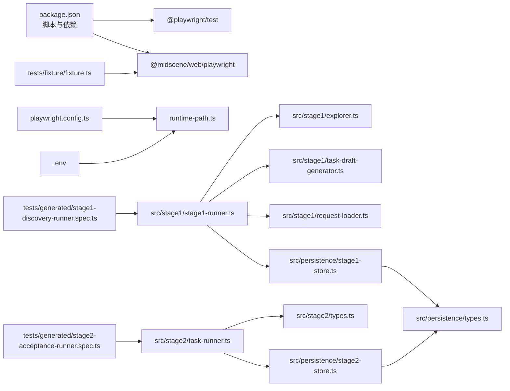

# AI 自动化测试基础

<cite>
**本文引用的文件**
- [README.md](file://README.md)
- [package.json](file://package.json)
- [playwright.config.ts](file://playwright.config.ts)
- [config/runtime-path.ts](file://config/runtime-path.ts)
- [tests/fixture/fixture.ts](file://tests/fixture/fixture.ts)
- [tests/generated/stage2-acceptance-runner.spec.ts](file://tests/generated/stage2-acceptance-runner.spec.ts)
- [tests/generated/stage1-discovery-runner.spec.ts](file://tests/generated/stage1-discovery-runner.spec.ts)
- [src/stage2/types.ts](file://src/stage2/types.ts)
- [src/stage2/task-runner.ts](file://src/stage2/task-runner.ts)
- [src/stage1/types.ts](file://src/stage1/types.ts)
- [src/stage1/explorer.ts](file://src/stage1/explorer.ts)
- [src/stage1/task-draft-generator.ts](file://src/stage1/task-draft-generator.ts)
- [src/stage1/stage1-runner.ts](file://src/stage1/stage1-runner.ts)
- [src/stage1/request-loader.ts](file://src/stage1/request-loader.ts)
- [src/persistence/stage1-store.ts](file://src/persistence/stage1-store.ts)
- [src/persistence/types.ts](file://src/persistence/types.ts)
- [specs/tasks/acceptance-task.template.json](file://specs/tasks/acceptance-task.template.json)
- [specs/stage1/stage1-request.template.json](file://specs/stage1/stage1-request.template.json)
</cite>

## 更新摘要
**变更内容**
- 新增第一阶段探索建模系统架构分析
- 更新项目结构图以包含 stage1 组件
- 新增结构化探索与草稿生成功能说明
- 更新持久化系统以支持第一阶段数据存储
- 新增第一阶段到第二阶段的交接流程

## 目录
1. [引言](#引言)
2. [项目结构](#项目结构)
3. [核心组件](#核心组件)
4. [架构总览](#架构总览)
5. [详细组件分析](#详细组件分析)
6. [依赖分析](#依赖分析)
7. [性能考虑](#性能考虑)
8. [故障排查指南](#故障排查指南)
9. [结论](#结论)
10. [附录](#附录)

## 引言
本文件面向希望掌握 AI 自动化测试基础的读者，围绕基于 Playwright 与 Midscene.js 的测试体系，系统讲解如何利用 AI 能力进行页面元素定位、数据提取与断言验证。文档重点覆盖：
- AI 在 Web 自动化测试中的应用场景与优势
- 传统测试方法与 AI 辅助测试的区别与互补关系
- AI 能力在测试执行中的作用机制（视觉理解、自然语言处理、决策推理）
- 实际代码示例的使用方式：ai、aiQuery、aiAssert、aiWaitFor 等核心 API 的基本用法
- 借助任务 JSON 驱动的第二段执行器（Stage2）的整体执行链路与最佳实践
- **新增**：第一阶段探索建模系统的工作原理与集成机制

## 项目结构
该项目采用"测试夹具 + 任务驱动 + 执行器 + 报告与持久化"的分层组织方式，现已扩展为包含第一阶段探索建模系统：
- 测试夹具注入 AI 能力（ai、aiQuery、aiAssert、aiWaitFor），并与 Playwright 页面对象集成
- **第一阶段**：通过结构化探索与草稿生成，自动提取页面元素并生成第二段任务草稿
- 任务驱动：通过 JSON 描述业务场景与断言，交由执行器按步骤编排
- 执行器负责登录、导航、表单填写、列表查询、断言与清理等通用能力
- 报告与产物：Playwright HTML 报告、Midscene 报告、截图、结构化结果与数据库持久化

**图表来源**
- [tests/generated/stage1-discovery-runner.spec.ts:1-37](file://tests/generated/stage1-discovery-runner.spec.ts#L1-L37)
- [tests/generated/stage2-acceptance-runner.spec.ts:1-39](file://tests/generated/stage2-acceptance-runner.spec.ts#L1-L39)
- [src/stage1/stage1-runner.ts:1-376](file://src/stage1/stage1-runner.ts#L1-L376)
- [src/stage1/explorer.ts:1-310](file://src/stage1/explorer.ts#L1-L310)
- [src/stage1/task-draft-generator.ts:1-348](file://src/stage1/task-draft-generator.ts#L1-L348)
- [src/stage1/request-loader.ts:1-89](file://src/stage1/request-loader.ts#L1-L89)
- [src/stage1/types.ts:1-109](file://src/stage1/types.ts#L1-L109)
- [src/stage2/task-runner.ts:1-200](file://src/stage2/task-runner.ts#L1-L200)
- [src/stage2/types.ts:1-180](file://src/stage2/types.ts#L1-L180)
- [playwright.config.ts:1-95](file://playwright.config.ts#L1-L95)
- [config/runtime-path.ts:1-41](file://config/runtime-path.ts#L1-L41)
- [src/persistence/stage1-store.ts:1-729](file://src/persistence/stage1-store.ts#L1-L729)
- [src/persistence/types.ts:1-125](file://src/persistence/types.ts#L1-L125)

**章节来源**
- [README.md:274-307](file://README.md#L274-L307)
- [playwright.config.ts:1-95](file://playwright.config.ts#L1-L95)
- [config/runtime-path.ts:1-41](file://config/runtime-path.ts#L1-L41)

## 核心组件
- 测试夹具（fixtures）
  - 通过注入 ai、aiAction、aiQuery、aiAssert、aiWaitFor，将 Midscene 的 AI 能力与 Playwright 页面对象绑定，便于在测试中直接调用
- **第一阶段探索建模**
  - **结构化探索**：基于可见 DOM 提取菜单、按钮、字段、表格列、成功提示等候选元素
  - **草稿生成**：将结构化结果映射为第二段任务草稿，自动填充导航、表单、搜索、断言等基础配置
  - **请求加载**：支持模板字符串替换，动态生成请求参数
- 任务驱动（Stage2）
  - 以 JSON 描述目标 URL、账户、导航、表单、搜索、断言与清理策略，执行器按步骤编排并产出结构化结果
- 执行器（task-runner）
  - 提供断言执行策略（Playwright 硬检测优先、AI 断言兜底）、滑块验证码自动处理、重试与超时控制
- 报告与持久化
  - 统一运行目录、HTML 报告、Midscene 报告、截图、结构化结果与 SQLite 数据库落盘

**章节来源**
- [tests/fixture/fixture.ts:23-99](file://tests/fixture/fixture.ts#L23-L99)
- [tests/generated/stage2-acceptance-runner.spec.ts:12-38](file://tests/generated/stage2-acceptance-runner.spec.ts#L12-L38)
- [src/stage2/task-runner.ts:1560-1917](file://src/stage2/task-runner.ts#L1560-L1917)
- [README.md:132-190](file://README.md#L132-L190)
- [src/stage1/explorer.ts:37-310](file://src/stage1/explorer.ts#L37-L310)
- [src/stage1/task-draft-generator.ts:150-348](file://src/stage1/task-draft-generator.ts#L150-L348)

## 架构总览
下图展示了从测试入口到执行器、再到 AI 能力与报告输出的整体流程，包含第一阶段探索建模系统的完整闭环。

**图表来源**
- [tests/generated/stage1-discovery-runner.spec.ts:12-38](file://tests/generated/stage1-discovery-runner.spec.ts#L12-L38)
- [tests/generated/stage2-acceptance-runner.spec.ts:12-38](file://tests/generated/stage2-acceptance-runner.spec.ts#L12-L38)
- [tests/fixture/fixture.ts:23-99](file://tests/fixture/fixture.ts#L23-L99)
- [src/stage1/stage1-runner.ts:115-376](file://src/stage1/stage1-runner.ts#L115-L376)
- [src/stage1/explorer.ts:37-310](file://src/stage1/explorer.ts#L37-L310)
- [src/stage1/task-draft-generator.ts:150-348](file://src/stage1/task-draft-generator.ts#L150-L348)
- [src/stage2/task-runner.ts:1560-1917](file://src/stage2/task-runner.ts#L1560-L1917)

## 详细组件分析

### 测试夹具与 AI 能力注入
- 夹具在每个测试用例中注入 ai、aiAction、aiQuery、aiAssert、aiWaitFor 五个方法，均基于 PlaywrightAgent 与 PlaywrightWebPage 绑定
- ai 方法支持传入 type 参数区分"动作型"与"查询型"，aiQuery 返回结构化数据，aiAssert 执行 AI 断言，aiWaitFor 在常规等待不适用时使用
- 日志目录通过 setLogDir 与运行时目录解析统一收敛

**图表来源**
- [tests/fixture/fixture.ts:23-99](file://tests/fixture/fixture.ts#L23-L99)
- [config/runtime-path.ts:8-10](file://config/runtime-path.ts#L8-L10)

**章节来源**
- [tests/fixture/fixture.ts:1-100](file://tests/fixture/fixture.ts#L1-L100)
- [config/runtime-path.ts:1-41](file://config/runtime-path.ts#L1-L41)

### 第一阶段探索建模系统

#### 结构化探索模块
- 基于可见 DOM 结构提取页面元素候选，包括菜单、按钮、字段、表格列、对话框标题等
- 支持多种 UI 框架的选择器适配（Element Plus、Ant Design、iView 等）
- 自动过滤不可见元素，标准化文本内容，去重处理
- 识别不确定项并生成人工复核清单

**图表来源**
- [src/stage1/explorer.ts:37-310](file://src/stage1/explorer.ts#L37-L310)

**章节来源**
- [src/stage1/explorer.ts:37-310](file://src/stage1/explorer.ts#L37-L310)

#### 草稿生成器
- 将结构化探索结果映射为第二段任务草稿，自动填充导航、表单、搜索、断言等配置
- 基于语义相似度算法进行字段与表格列的智能匹配
- 生成字段映射报告，标注不确定项和人工复核建议
- 支持多种组件类型的自动推断（输入框、文本域、级联选择器等）

**图表来源**
- [src/stage1/task-draft-generator.ts:150-348](file://src/stage1/task-draft-generator.ts#L150-L348)

**章节来源**
- [src/stage1/task-draft-generator.ts:150-348](file://src/stage1/task-draft-generator.ts#L150-L348)

#### 请求加载器与模板系统
- 支持模板字符串替换，动态生成请求参数
- 自动处理环境变量和时间戳占位符
- 验证请求文件的完整性与正确性

**章节来源**
- [src/stage1/request-loader.ts:79-89](file://src/stage1/request-loader.ts#L79-L89)

### 任务驱动与执行器（Stage2）
- 任务 JSON 定义了目标 URL、账户、导航、表单、搜索、断言与清理策略，执行器按步骤编排
- 执行器内置断言策略：Playwright 硬检测优先，AI 断言兜底，配合重试与超时控制
- 执行器还包含滑块验证码自动处理逻辑：AI 查询滑块位置 + Playwright 模拟真人拖动轨迹 + 验证结果

**图表来源**
- [specs/tasks/acceptance-task.template.json:1-141](file://specs/tasks/acceptance-task.template.json#L1-L141)
- [src/stage2/task-runner.ts:1560-1917](file://src/stage2/task-runner.ts#L1560-L1917)
- [src/stage2/task-runner.ts:510-648](file://src/stage2/task-runner.ts#L510-L648)

**章节来源**
- [specs/tasks/acceptance-task.template.json:1-141](file://specs/tasks/acceptance-task.template.json#L1-L141)
- [src/stage2/task-runner.ts:1-200](file://src/stage2/task-runner.ts#L1-L200)
- [src/stage2/task-runner.ts:1560-1917](file://src/stage2/task-runner.ts#L1560-L1917)

### 断言执行策略与 AI 能力
- 策略：Playwright 硬检测优先（如 toast、表格行/列断言），失败则降级到 AI 结构化断言
- 重试机制：统一的带重试断言执行器，支持自定义重试次数与延迟
- AI 查询断言：通过 aiQuery 返回结构化结果，再由执行器判断是否满足断言条件

**图表来源**
- [src/stage2/task-runner.ts:1532-1556](file://src/stage2/task-runner.ts#L1532-L1556)
- [src/stage2/task-runner.ts:1562-1917](file://src/stage2/task-runner.ts#L1562-L1917)

**章节来源**
- [src/stage2/task-runner.ts:1532-1556](file://src/stage2/task-runner.ts#L1532-L1556)
- [src/stage2/task-runner.ts:1562-1917](file://src/stage2/task-runner.ts#L1562-L1917)

### 滑块验证码自动处理（AI + Playwright）
- 检测：通过文本与选择器模式识别滑块验证码
- AI 查询：使用 aiQuery 获取滑块按钮中心点坐标与尺寸
- 模拟拖动：使用 Playwright mouse API，按 easeOut 缓动与随机抖动模拟真人轨迹
- 验证：等待滑块消失并检查是否验证成功

**图表来源**
- [src/stage2/task-runner.ts:483-501](file://src/stage2/task-runner.ts#L483-L501)
- [src/stage2/task-runner.ts:510-538](file://src/stage2/task-runner.ts#L510-L538)
- [src/stage2/task-runner.ts:584-648](file://src/stage2/task-runner.ts#L584-L648)

**章节来源**
- [src/stage2/task-runner.ts:483-501](file://src/stage2/task-runner.ts#L483-L501)
- [src/stage2/task-runner.ts:510-538](file://src/stage2/task-runner.ts#L510-L538)
- [src/stage2/task-runner.ts:584-648](file://src/stage2/task-runner.ts#L584-L648)

### 运行产物与持久化
- 运行产物统一收敛到 t_runtime/ 下的多个子目录：Playwright 报告、Midscene 报告、截图、结构化结果等
- SQLite 数据库存储任务、运行、步骤、快照、附件与审计日志等结构化信息
- **新增**：第一阶段持久化支持结构化快照、映射报告、草稿任务等产物的完整追踪

**章节来源**
- [README.md:76-131](file://README.md#L76-L131)
- [src/persistence/types.ts:1-125](file://src/persistence/types.ts#L1-L125)
- [src/persistence/stage1-store.ts:482-704](file://src/persistence/stage1-store.ts#L482-L704)

## 依赖分析
- 测试与执行
  - @playwright/test 提供页面自动化与报告
  - @midscene/web/playwright 提供 AI 能力（ai、aiQuery、aiAssert、aiWaitFor）
- **第一阶段探索建模**
  - 结构化探索依赖 DOM 操作与 UI 框架选择器
  - 草稿生成器依赖字段映射与表格列匹配算法
  - 请求加载器支持模板字符串与环境变量处理
- 配置与运行
  - dotenv 读取 .env 中的模型与目录配置
  - playwright.config.ts 配置报告输出与项目设备
  - runtime-path.ts 统一解析运行时目录
- 任务与类型
  - acceptance-task.template.json 定义任务输入结构
  - stage1-request.template.json 定义第一阶段请求结构
  - types.ts 定义任务、断言与执行结果的 TypeScript 类型

**图表来源**
- [package.json:6-11](file://package.json#L6-L11)
- [playwright.config.ts:1-95](file://playwright.config.ts#L1-L95)
- [config/runtime-path.ts:1-41](file://config/runtime-path.ts#L1-L41)
- [tests/fixture/fixture.ts:1-100](file://tests/fixture/fixture.ts#L1-L100)
- [tests/generated/stage1-discovery-runner.spec.ts:1-37](file://tests/generated/stage1-discovery-runner.spec.ts#L1-L37)
- [tests/generated/stage2-acceptance-runner.spec.ts:1-39](file://tests/generated/stage2-acceptance-runner.spec.ts#L1-L39)
- [src/stage1/stage1-runner.ts:1-376](file://src/stage1/stage1-runner.ts#L1-L376)
- [src/stage2/task-runner.ts:1-200](file://src/stage2/task-runner.ts#L1-L200)
- [src/stage1/types.ts:1-109](file://src/stage1/types.ts#L1-L109)
- [src/stage2/types.ts:1-180](file://src/stage2/types.ts#L1-L180)
- [src/persistence/types.ts:1-125](file://src/persistence/types.ts#L1-L125)

**章节来源**
- [package.json:1-26](file://package.json#L1-L26)
- [playwright.config.ts:1-95](file://playwright.config.ts#L1-L95)
- [config/runtime-path.ts:1-41](file://config/runtime-path.ts#L1-L41)

## 性能考虑
- 断言策略优先使用 Playwright 硬检测，减少不必要的 AI 查询，提高稳定性与速度
- 对复杂表格断言，先尝试 Playwright 表格列值提取与代码比对，失败再降级到 AI 结构化断言
- 合理设置断言重试次数与延迟，避免过度重试导致执行时间过长
- 滑块验证码自动处理采用缓动与抖动模拟真人轨迹，兼顾成功率与稳定性
- **新增**：第一阶段探索建模采用分步执行与增量持久化，支持长时间运行的稳定性

## 故障排查指南
- 滑块验证码处理失败
  - 现象：自动处理多次失败后抛错
  - 排查：检查页面截图确认滑块样式、调整检测选择器、切换为 manual 模式人工处理
  - 参考：README 中关于滑块验证码自动处理的说明与回滚建议
- 断言失败
  - 现象：toast/table-row-exists/table-cell-equals/custom 等断言失败
  - 排查：确认任务 JSON 中的期望值与匹配模式、检查 Playwright 硬检测是否可用、查看 Midscene 报告与截图
- **新增**：第一阶段探索建模问题
  - 现象：结构化探索结果为空或不完整
  - 排查：检查页面加载状态、确认 UI 框架选择器适配、验证请求文件配置
  - 现象：草稿生成失败或映射不准确
  - 排查：检查结构化快照内容、确认字段与表格列的语义匹配、查看映射报告中的不确定项
- 运行产物与报告
  - 现象：找不到报告或截图
  - 排查：确认 .env 中目录配置与 runtime-path.ts 解析结果，检查 playwright.config.ts 报告输出配置

**章节来源**
- [README.md:64-96](file://README.md#L64-L96)
- [README.md:132-190](file://README.md#L132-L190)
- [playwright.config.ts:36-40](file://playwright.config.ts#L36-L40)

## 结论
本项目以"任务 JSON + 执行器 + AI 能力"为核心，构建了可复用、可观测、可持久化的 AI 自动化测试体系。**最新版本**引入了第一阶段探索建模系统，实现了从页面探索到任务草稿的完整自动化闭环，进一步提升了测试效率与质量。通过 Playwright 硬检测优先与 AI 断言兜底的策略，既保证了稳定性，又提升了复杂场景的适配能力。结合统一的运行目录与数据库持久化，能够支撑验收与回归场景的长期演进。

## 附录

### 核心 API 使用要点（基于源码行为总结）
- ai
  - 用途：描述步骤并执行交互（动作型为主）
  - 关键点：支持 type='action'/'query' 区分；与 Playwright 页面对象绑定
- aiQuery
  - 用途：从页面中提取结构化数据（如滑块位置、表格行/列值）
  - 关键点：返回结构化结果，供执行器判断断言条件
- aiAssert
  - 用途：执行 AI 断言（适用于 Playwright 难以覆盖的复杂语义场景）
  - 关键点：失败不中断流程时建议 soft=true；复杂场景优先使用 aiQuery + 代码断言
- aiWaitFor
  - 用途：在 Playwright 常规等待不适用时使用（如复杂 UI 条件）
  - 关键点：谨慎使用，优先确保页面状态可被 Playwright 明确检测

**章节来源**
- [tests/fixture/fixture.ts:23-99](file://tests/fixture/fixture.ts#L23-L99)
- [README.md:139-152](file://README.md#L139-L152)

### 第一阶段探索建模 API 使用要点
- **结构化探索**
  - 用途：自动提取页面元素候选，生成结构化快照
  - 关键点：支持多种 UI 框架，自动过滤不可见元素，识别不确定项
- **草稿生成**
  - 用途：将结构化结果映射为第二段任务草稿
  - 关键点：智能字段与表格列匹配，生成映射报告，标注人工复核项
- **请求加载**
  - 用途：加载并处理第一阶段请求文件
  - 关键点：支持模板字符串替换，动态生成参数

**章节来源**
- [src/stage1/explorer.ts:37-310](file://src/stage1/explorer.ts#L37-L310)
- [src/stage1/task-draft-generator.ts:150-348](file://src/stage1/task-draft-generator.ts#L150-L348)
- [src/stage1/request-loader.ts:79-89](file://src/stage1/request-loader.ts#L79-L89)