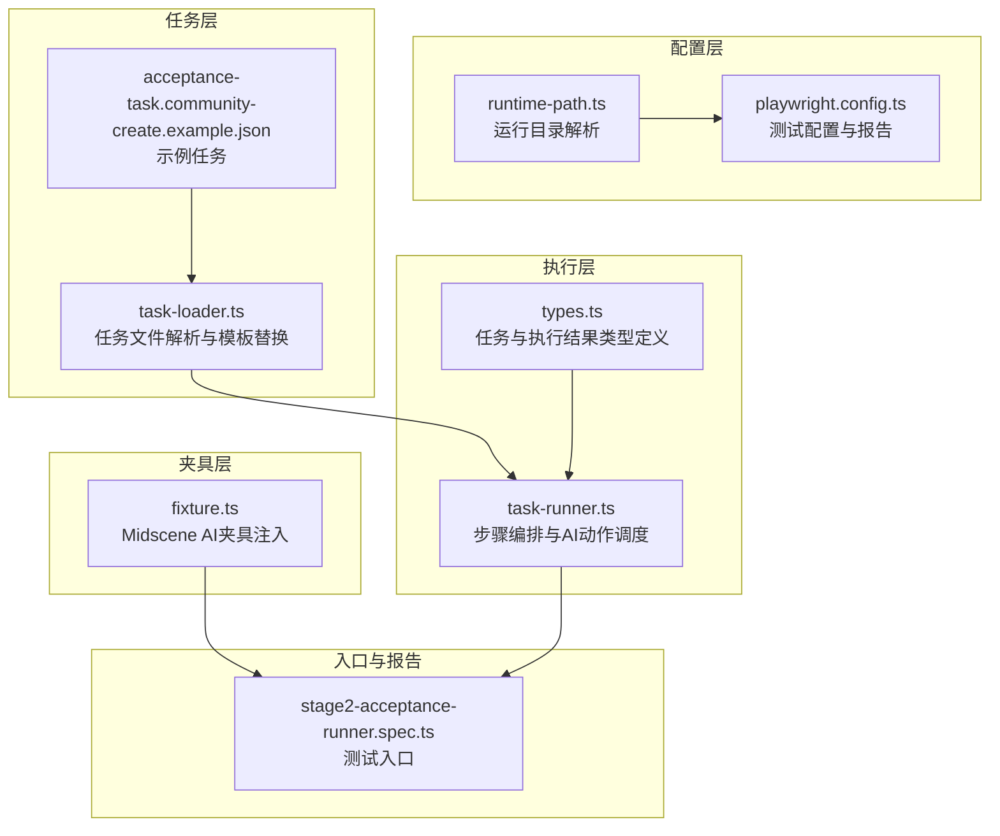
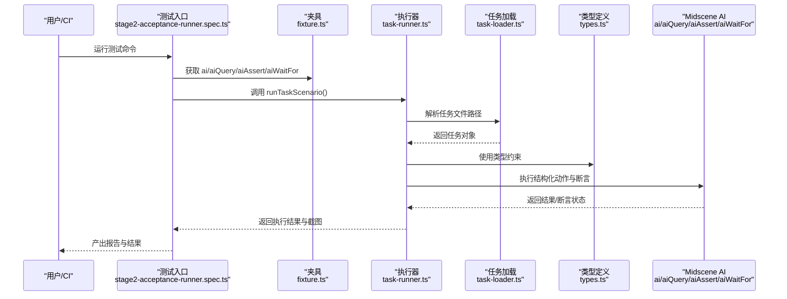
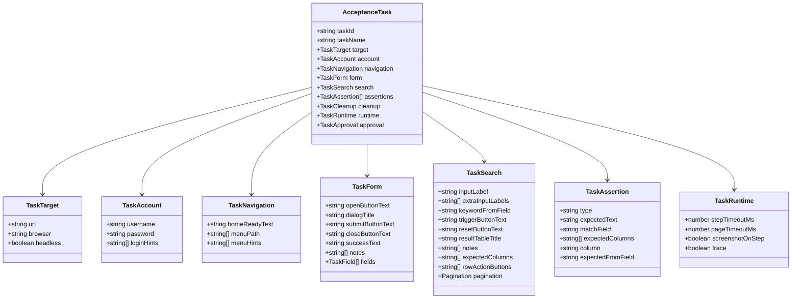
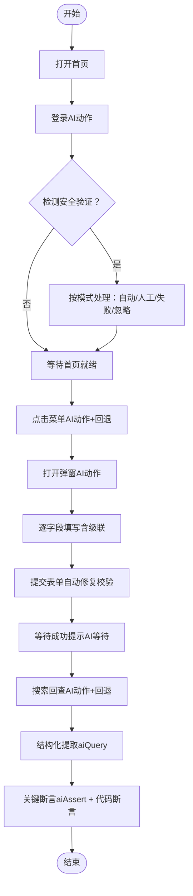
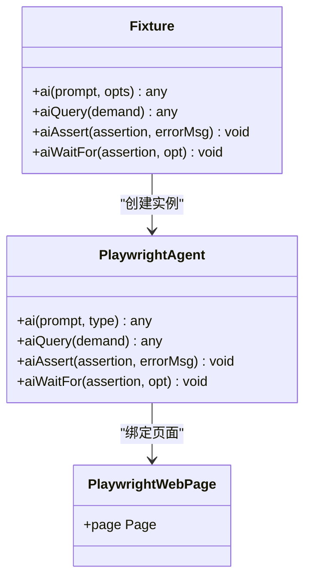
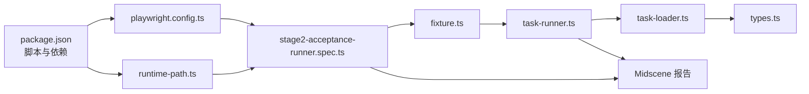

# AI 辅助自动化概念

<cite>
**本文引用的文件**
- [README.md](file://README.md)
- [package.json](file://package.json)
- [playwright.config.ts](file://playwright.config.ts)
- [config/runtime-path.ts](file://config/runtime-path.ts)
- [src/stage2/types.ts](file://src/stage2/types.ts)
- [src/stage2/task-runner.ts](file://src/stage2/task-runner.ts)
- [src/stage2/task-loader.ts](file://src/stage2/task-loader.ts)
- [tests/fixture/fixture.ts](file://tests/fixture/fixture.ts)
- [tests/generated/stage2-acceptance-runner.spec.ts](file://tests/generated/stage2-acceptance-runner.spec.ts)
- [specs/tasks/acceptance-task.community-create.example.json](file://specs/tasks/acceptance-task.community-create.example.json)
- [.tasks/AI自主代理验收系统开发改造方案_2026-03-11.md](file://.tasks/AI自主代理验收系统开发改造方案_2026-03-11.md)
</cite>

## 目录
1. [引言](#引言)
2. [项目结构](#项目结构)
3. [核心组件](#核心组件)
4. [架构总览](#架构总览)
5. [详细组件分析](#详细组件分析)
6. [依赖关系分析](#依赖关系分析)
7. [性能考量](#性能考量)
8. [故障排查指南](#故障排查指南)
9. [结论](#结论)
10. [附录](#附录)

## 引言
本文件面向 HI-TEST 项目，系统性阐述如何基于 Midscene.js 与 Playwright 实现“AI 辅助自动化”。重点解释页面元素识别、结构化数据提取与智能断言能力，并围绕 AI 动作类型（aiTap、aiInput、aiKeyboardPress、aiScroll、aiWaitFor、aiQuery、aiAssert）给出使用场景、最佳实践与风险控制策略。文档还强调动态页面稳定性、结构化动作、等待策略与兜底机制的组合使用，以提升测试的鲁棒性与可维护性。

## 项目结构
项目采用“任务驱动 + Midscene 能力”的分层组织方式：
- 配置层：环境变量与运行目录解析
- 任务层：JSON 任务定义与加载
- 执行层：按步骤编排的自动化执行器
- 夹具层：Midscene AI 能力注入到 Playwright 测试上下文
- 报告层：Playwright HTML 报告与 Midscene 运行报告

图表来源
- [config/runtime-path.ts](file://config/runtime-path.ts#L1-L41)
- [playwright.config.ts](file://playwright.config.ts#L1-L95)
- [src/stage2/task-loader.ts](file://src/stage2/task-loader.ts#L1-L91)
- [src/stage2/task-runner.ts](file://src/stage2/task-runner.ts#L1-L1344)
- [src/stage2/types.ts](file://src/stage2/types.ts#L1-L125)
- [tests/fixture/fixture.ts](file://tests/fixture/fixture.ts#L1-L100)
- [tests/generated/stage2-acceptance-runner.spec.ts](file://tests/generated/stage2-acceptance-runner.spec.ts#L1-L39)

章节来源
- [README.md](file://README.md#L1-L144)
- [package.json](file://package.json#L1-L24)

## 核心组件
- 运行目录与报告
  - 运行产物统一收敛至 t_runtime/，包含 Playwright 输出、HTML 报告、Midscene 运行日志与缓存、验收结果等。
  - 目录由环境变量与 runtime-path.ts 统一解析，便于跨环境一致性。
- 任务定义与加载
  - 通过 JSON 任务文件描述目标系统、账户、导航、表单、搜索、断言与运行时参数。
  - 支持模板字符串替换（如 NOW_YYYYMMDDHHMMSS），实现唯一化数据与动态注入。
- 执行器与步骤编排
  - 将复杂业务流程拆分为多个可重试、可截图、可追踪的步骤，每个步骤独立记录状态与耗时。
  - 对关键节点（登录、菜单、表单、搜索、断言）采用结构化动作与等待策略。
- Midscene AI 能力注入
  - 通过夹具将 ai、aiQuery、aiAssert、aiWaitFor 注入测试上下文，统一缓存与报告生成。
  - 支持按步骤缓存 ID，避免重复推理与提升稳定性。

章节来源
- [README.md](file://README.md#L74-L144)
- [config/runtime-path.ts](file://config/runtime-path.ts#L1-L41)
- [src/stage2/task-loader.ts](file://src/stage2/task-loader.ts#L1-L91)
- [src/stage2/types.ts](file://src/stage2/types.ts#L1-L125)
- [src/stage2/task-runner.ts](file://src/stage2/task-runner.ts#L1062-L1344)
- [tests/fixture/fixture.ts](file://tests/fixture/fixture.ts#L1-L100)

## 架构总览
下图展示了从任务文件到执行器再到 Midscene AI 能力的整体流程，以及关键断言与结构化提取的协同关系。

图表来源
- [tests/generated/stage2-acceptance-runner.spec.ts](file://tests/generated/stage2-acceptance-runner.spec.ts#L1-L39)
- [tests/fixture/fixture.ts](file://tests/fixture/fixture.ts#L1-L100)
- [src/stage2/task-runner.ts](file://src/stage2/task-runner.ts#L1062-L1344)
- [src/stage2/task-loader.ts](file://src/stage2/task-loader.ts#L71-L91)
- [src/stage2/types.ts](file://src/stage2/types.ts#L86-L125)

## 详细组件分析

### 任务模型与运行时参数
- 任务模型涵盖目标系统、账户信息、导航路径、表单字段、搜索条件、断言策略与清理策略等。
- 运行时参数支持每步超时、页面超时、截图开关与 Trace 开关，便于调试与稳定性控制。

图表来源
- [src/stage2/types.ts](file://src/stage2/types.ts#L5-L98)

章节来源
- [src/stage2/types.ts](file://src/stage2/types.ts#L1-L125)
- [specs/tasks/acceptance-task.community-create.example.json](file://specs/tasks/acceptance-task.community-create.example.json#L1-L184)

### 执行器：步骤编排与稳定性策略
- 步骤封装：runStep 将每个子流程包装为可重试、可截图、可记录状态的单元。
- 等待策略：针对首页加载、菜单可见、弹窗显示、搜索结果等场景设置显式等待与兜底重试。
- 动态页面适配：对滑块验证码、级联选择器、表单校验提示等动态元素采用 AI 查询与结构化解析，再配合 Playwright 原生交互。
- 结果持久化：实时写入 partial.json 与最终 result.json，包含步骤截图、查询快照与解析值。

图表来源
- [src/stage2/task-runner.ts](file://src/stage2/task-runner.ts#L1062-L1344)

章节来源
- [src/stage2/task-runner.ts](file://src/stage2/task-runner.ts#L1110-L1155)
- [src/stage2/task-runner.ts](file://src/stage2/task-runner.ts#L1157-L1343)

### Midscene 夹具：AI 能力注入与缓存
- 夹具将 ai、aiQuery、aiAssert、aiWaitFor 注入测试上下文，统一设置缓存 ID、分组信息与报告生成。
- 通过 PlaywrightAgent + PlaywrightWebPage 组合，实现页面截图、结构化查询与断言的 AI 推理能力。
- 日志目录由 runtime-path.ts 解析，确保报告与缓存路径一致。

图表来源
- [tests/fixture/fixture.ts](file://tests/fixture/fixture.ts#L23-L99)

章节来源
- [tests/fixture/fixture.ts](file://tests/fixture/fixture.ts#L1-L100)
- [config/runtime-path.ts](file://config/runtime-path.ts#L1-L41)

### AI 动作类型与使用场景

- aiTap（点击）
  - 使用场景：菜单项、按钮、选项等交互元素。
  - 最佳实践：优先使用 Playwright 原生定位（role、text、placeholder），失败时再降级到 AI 动作。
  - 示例参考：菜单点击、搜索按钮触发、关闭弹窗等。

- aiInput（输入）
  - 使用场景：文本框、多行输入框、级联选择器等。
  - 最佳实践：先尝试 role/text/placeholder 定位，再使用 AI 动作；级联选择器需逐级打开与校验。
  - 示例参考：表单字段填写、搜索关键字输入。

- aiKeyboardPress（键盘）
  - 使用场景：回车、Esc、Tab 等快捷键。
  - 最佳实践：仅在必要时使用，避免过度依赖；与 aiInput 配合时注意顺序与时机。
  - 示例参考：表单提交后的 Esc 清理、级联选择器中的方向键导航。

- aiScroll（滚动）
  - 使用场景：长列表、下拉面板、可视区域外元素。
  - 最佳实践：先尝试定位可见元素，再使用 AI 动作；滚动后配合等待与截图。
  - 示例参考：列表滚动到底部以触发分页加载。

- aiWaitFor（等待）
  - 使用场景：提示出现、弹窗关闭、元素可见、异步加载完成。
  - 最佳实践：优先使用 Playwright 显式等待，AI 等待作为兜底；避免无限等待。
  - 示例参考：成功提示出现、滑块验证码消失。

- aiQuery（结构化查询）
  - 使用场景：提取列表、统计、状态、金额等结构化数据。
  - 最佳实践：关键断言前必须使用 aiQuery 获取结构化结果，再用代码断言；避免仅依赖文本匹配。
  - 示例参考：列表快照提取、搜索结果校验。

- aiAssert（智能断言）
  - 使用场景：通用断言、可读性断言、兜底断言。
  - 最佳实践：不要把关键断言完全交给 aiAssert；应与 aiQuery + 代码断言组合使用。
  - 示例参考：Toast 提示断言、表格行存在性断言、单元格内容断言。

章节来源
- [src/stage2/task-runner.ts](file://src/stage2/task-runner.ts#L846-L892)
- [src/stage2/task-runner.ts](file://src/stage2/task-runner.ts#L894-L971)
- [src/stage2/task-runner.ts](file://src/stage2/task-runner.ts#L1020-L1060)
- [src/stage2/task-runner.ts](file://src/stage2/task-runner.ts#L1305-L1311)
- [.tasks/AI自主代理验收系统开发改造方案_2026-03-11.md](file://.tasks/AI自主代理验收系统开发改造方案_2026-03-11.md#L58-L84)

### AI 幻觉风险防范策略
- 关键断言优先使用 aiQuery 提取结构化信息，再用 Playwright/TypeScript 做硬断言，aiAssert 作为补充性可读断言。
- 将整条业务流程拆分为多个小步骤，降低单次 Prompt 的复杂度与出错概率。
- 对动态页面（菜单、弹窗、分页、异步刷新）采用“结构化动作 + 等待策略 + 兜底机制”的组合，提升稳定性。

章节来源
- [.tasks/AI自主代理验收系统开发改造方案_2026-03-11.md](file://.tasks/AI自主代理验收系统开发改造方案_2026-03-11.md#L58-L84)
- [src/stage2/task-runner.ts](file://src/stage2/task-runner.ts#L1020-L1060)

### 动态页面稳定性与等待策略
- 首页加载：先等待 domcontentloaded，再按 homeReadyText 或首层菜单可见判断。
- 菜单点击：优先 role/link/menuitem/text 定位，失败时使用 AI 动作并附带 hints。
- 表单提交：自动收集校验提示并回填修复，最多重试若干次。
- 搜索回查：先尝试直接可见，失败则重新输入并再次查询，最后使用 aiAssert 作为兜底。
- 滑块验证码：支持自动识别与模拟拖动轨迹，失败时可切换人工模式或失败模式。

章节来源
- [src/stage2/task-runner.ts](file://src/stage2/task-runner.ts#L1174-L1203)
- [src/stage2/task-runner.ts](file://src/stage2/task-runner.ts#L1205-L1213)
- [src/stage2/task-runner.ts](file://src/stage2/task-runner.ts#L973-L1018)
- [src/stage2/task-runner.ts](file://src/stage2/task-runner.ts#L1273-L1304)
- [README.md](file://README.md#L62-L72)

### 实战示例：在业务场景中合理运用 AI 能力
- 新增小区并回查
  - 步骤：打开首页 → 登录（AI 动作）→ 处理安全验证（自动/人工）→ 点击菜单 → 打开弹窗 → 填写字段（含级联）→ 提交表单（自动修复）→ 等待成功提示 → 输入搜索条件 → 查询回查 → 结构化提取 → 关键断言 → 关闭弹窗。
  - 关键点：aiQuery 提取列表快照，aiAssert 与代码断言共同保证准确性；滑块验证码自动处理失败时切换人工模式。

章节来源
- [specs/tasks/acceptance-task.community-create.example.json](file://specs/tasks/acceptance-task.community-create.example.json#L1-L184)
- [src/stage2/task-runner.ts](file://src/stage2/task-runner.ts#L1157-L1343)

## 依赖关系分析
- 运行时依赖
  - @playwright/test：测试框架与浏览器驱动
  - @midscene/web：AI 能力与报告集成
  - dotenv：环境变量加载
- 配置依赖
  - playwright.config.ts：测试配置、报告输出、Trace 设置
  - runtime-path.ts：运行目录解析与统一收敛
- 任务依赖
  - task-loader.ts：任务文件解析、模板替换、形状校验
  - types.ts：强类型约束与结果结构
- 执行依赖
  - task-runner.ts：步骤编排、AI 动作调度、等待与兜底
- 夹具依赖
  - fixture.ts：AI 能力注入、缓存与报告

图表来源
- [package.json](file://package.json#L1-L24)
- [playwright.config.ts](file://playwright.config.ts#L1-L95)
- [config/runtime-path.ts](file://config/runtime-path.ts#L1-L41)
- [tests/generated/stage2-acceptance-runner.spec.ts](file://tests/generated/stage2-acceptance-runner.spec.ts#L1-L39)
- [tests/fixture/fixture.ts](file://tests/fixture/fixture.ts#L1-L100)
- [src/stage2/task-runner.ts](file://src/stage2/task-runner.ts#L1-L1344)
- [src/stage2/task-loader.ts](file://src/stage2/task-loader.ts#L1-L91)
- [src/stage2/types.ts](file://src/stage2/types.ts#L1-L125)

章节来源
- [package.json](file://package.json#L1-L24)
- [playwright.config.ts](file://playwright.config.ts#L1-L95)

## 性能考量
- 步骤拆分与缓存：将长流程拆分为多个步骤，利用 Midscene 缓存减少重复推理成本。
- 截图与 Trace：按需开启截图与 Trace，平衡可观测性与性能。
- 等待策略：优先使用 Playwright 显式等待，避免无谓轮询；AI 等待作为兜底。
- 重试与回退：对易失败环节（表单校验、搜索回查）设计重试与回退逻辑，提高成功率。

## 故障排查指南
- 滑块验证码
  - 自动模式：AI 识别滑块位置与滑槽宽度，模拟拖动轨迹；失败时重试若干次。
  - 人工模式：在设定超时内等待人工完成，超时则失败。
  - 失败模式：检测到即刻失败；忽略模式：跳过检测但不建议。
- 表单校验
  - 自动收集校验提示并回填修复，超过最大重试次数后抛出错误。
- 步骤失败
  - 每个步骤失败时会截图并记录错误信息，最终 result.json 与 partial.json 记录完整轨迹。
- 报告与日志
  - Playwright HTML 报告与 Midscene 报告分别位于运行目录，便于定位问题。

章节来源
- [README.md](file://README.md#L54-L72)
- [src/stage2/task-runner.ts](file://src/stage2/task-runner.ts#L647-L703)
- [src/stage2/task-runner.ts](file://src/stage2/task-runner.ts#L973-L1018)
- [src/stage2/task-runner.ts](file://src/stage2/task-runner.ts#L1110-L1155)

## 结论
通过将 Midscene 的 AI 能力与 Playwright 的原生稳定性相结合，HI-TEST 实现了高鲁棒性的 AI 辅助自动化。关键在于：
- 将复杂流程拆分为可重试、可观测的小步骤；
- 在关键断言前使用 aiQuery 提取结构化数据，再用代码断言；
- 合理运用等待策略与兜底机制，应对动态页面的不确定性；
- 统一运行目录与报告，确保可追溯与可复现。

## 附录
- 运行命令与产物
  - 运行第二段：npm run stage2:run 或 npm run stage2:run:headed
  - 产物目录：t_runtime/ 下的 test-results、playwright-report、midscene_run、acceptance-results
- 任务文件模板
  - 示例任务：specs/tasks/acceptance-task.community-create.example.json
  - 通用模板：specs/tasks/acceptance-task.template.json

章节来源
- [README.md](file://README.md#L106-L132)
- [specs/tasks/acceptance-task.community-create.example.json](file://specs/tasks/acceptance-task.community-create.example.json#L1-L184)
- [specs/tasks/acceptance-task.template.json](file://specs/tasks/acceptance-task.template.json#L1-L85)