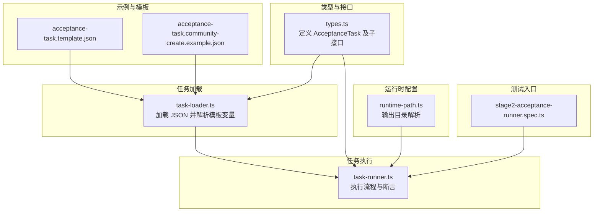
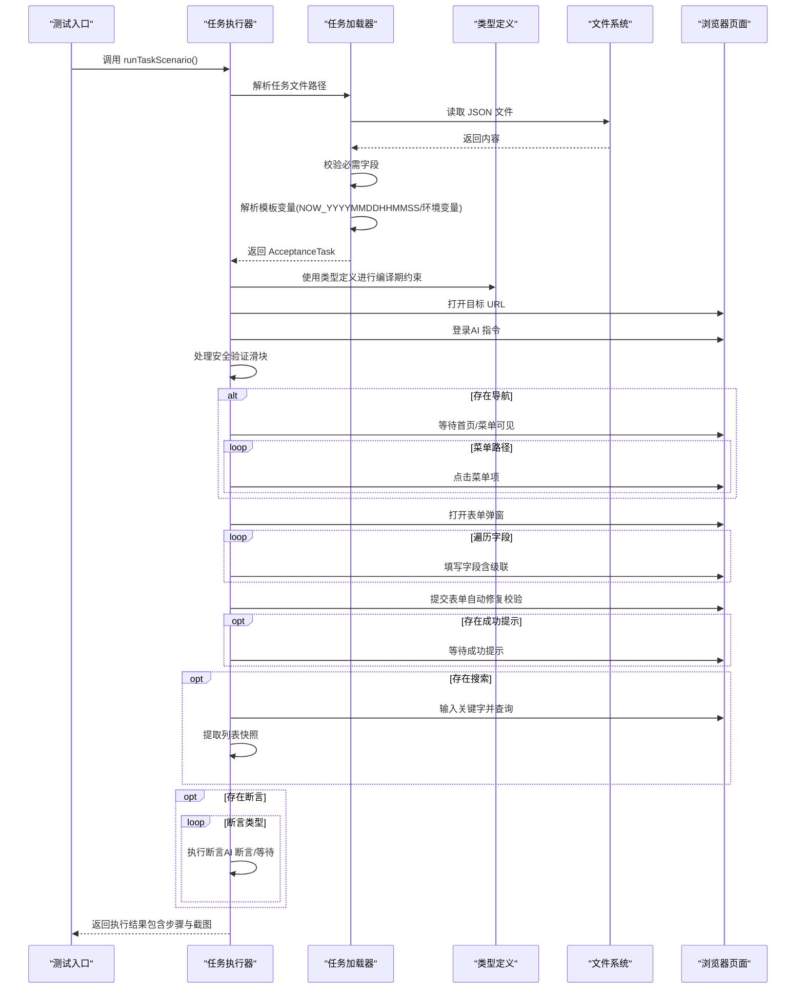
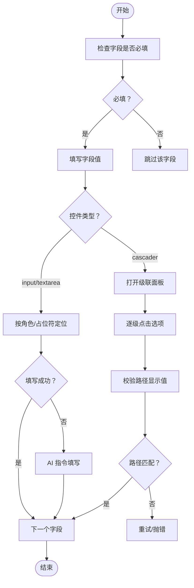
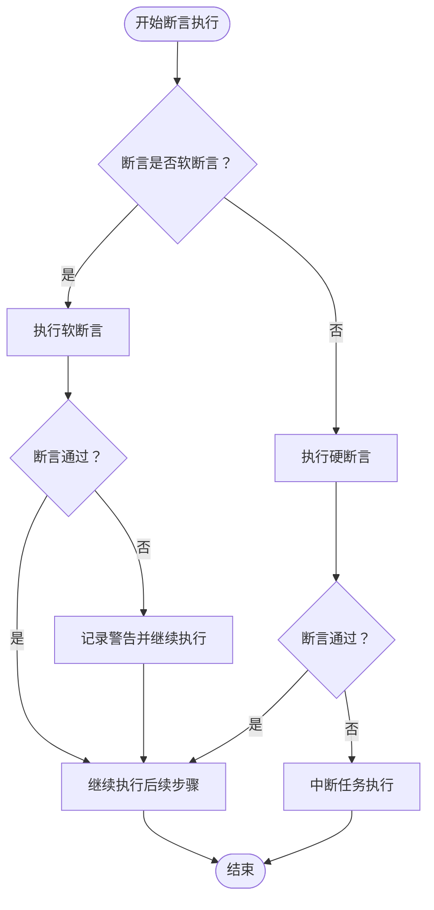
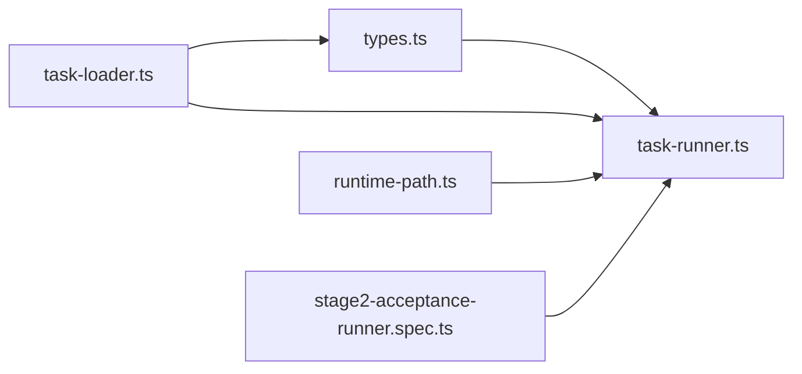

# AcceptanceTask 任务模型

<cite>
**本文引用的文件**
- [src/stage2/types.ts](file://src/stage2/types.ts)
- [src/stage2/task-runner.ts](file://src/stage2/task-runner.ts)
- [src/stage2/task-loader.ts](file://src/stage2/task-loader.ts)
- [specs/tasks/acceptance-task.template.json](file://specs/tasks/acceptance-task.template.json)
- [specs/tasks/acceptance-task.community-create.example.json](file://specs/tasks/acceptance-task.community-create.example.json)
- [config/runtime-path.ts](file://config/runtime-path.ts)
- [tests/generated/stage2-acceptance-runner.spec.ts](file://tests/generated/stage2-acceptance-runner.spec.ts)
- [package.json](file://package.json)
</cite>

## 更新摘要
**变更内容**
- 新增软断言机制说明，支持 `soft` 字段控制断言失败是否中断流程
- 更新断言策略优化：从全面验证转向关键字段软断言模式
- 强调 `table-row-exists` 作为硬门槛，`table-cell-equals`/`table-cell-contains` 作为关键列软验证
- 新增断言执行器中的软断言处理逻辑说明

## 目录
1. [简介](#简介)
2. [项目结构](#项目结构)
3. [核心组件](#核心组件)
4. [架构总览](#架构总览)
5. [详细组件分析](#详细组件分析)
6. [断言策略优化](#断言策略优化)
7. [依赖关系分析](#依赖关系分析)
8. [性能考量](#性能考量)
9. [故障排查指南](#故障排查指南)
10. [结论](#结论)
11. [附录](#附录)

## 简介
本文件面向 HI-TEST 项目的 AcceptanceTask 任务模型，系统性阐述任务模型的结构、字段语义、数据类型、验证规则与最佳实践。重点覆盖：
- AcceptanceTask 接口的完整字段定义与用途
- TaskField 字段的类型、值来源与验证策略
- TaskForm 表单字段组织方式
- StepResult 步骤执行结果记录
- **软断言机制与关键字段验证策略**
- JSON 任务模板与示例
- 运行时配置与环境变量
- 实际执行流程与断言机制

## 项目结构
本项目采用分层设计：
- 类型定义层：集中于 src/stage2/types.ts，定义 AcceptanceTask 及其子接口
- 任务加载与解析：src/stage2/task-loader.ts 负责从 JSON 加载并解析模板变量
- 任务执行：src/stage2/task-runner.ts 实现端到端执行流程，含导航、表单填写、断言、截图等
- 示例与模板：specs/tasks 下提供模板与示例任务 JSON
- 运行时路径：config/runtime-path.ts 统一管理输出目录
- 测试入口：tests/generated/stage2-acceptance-runner.spec.ts 驱动执行



**图表来源**
- [src/stage2/types.ts](file://src/stage2/types.ts#L1-L180)
- [src/stage2/task-loader.ts](file://src/stage2/task-loader.ts#L1-L91)
- [src/stage2/task-runner.ts](file://src/stage2/task-runner.ts#L1-L2657)
- [specs/tasks/acceptance-task.template.json](file://specs/tasks/acceptance-task.template.json#L1-L141)
- [specs/tasks/acceptance-task.community-create.example.json](file://specs/tasks/acceptance-task.community-create.example.json#L1-L229)
- [config/runtime-path.ts](file://config/runtime-path.ts#L1-L41)
- [tests/generated/stage2-acceptance-runner.spec.ts](file://tests/generated/stage2-acceptance-runner.spec.ts#L1-L39)

**章节来源**
- [src/stage2/types.ts](file://src/stage2/types.ts#L1-L180)
- [src/stage2/task-loader.ts](file://src/stage2/task-loader.ts#L1-L91)
- [src/stage2/task-runner.ts](file://src/stage2/task-runner.ts#L1-L2657)
- [specs/tasks/acceptance-task.template.json](file://specs/tasks/acceptance-task.template.json#L1-L141)
- [specs/tasks/acceptance-task.community-create.example.json](file://specs/tasks/acceptance-task.community-create.example.json#L1-L229)
- [config/runtime-path.ts](file://config/runtime-path.ts#L1-L41)
- [tests/generated/stage2-acceptance-runner.spec.ts](file://tests/generated/stage2-acceptance-runner.spec.ts#L1-L39)

## 核心组件
本节对 AcceptanceTask 及其关键子接口进行逐项说明，结合 JSON 示例与实现代码中的使用场景，给出字段含义、类型、可选性与典型用法。

- AcceptanceTask
  - taskId: string
    - 任务标识，用于生成运行目录与结果文件命名
    - 必填；由加载器断言保证
  - taskName: string
    - 任务名称，便于日志与报告识别
    - 必填；由加载器断言保证
  - target: TaskTarget
    - 目标应用信息：url、浏览器类型、是否无头模式
    - 必填；由加载器断言保证
  - account: TaskAccount
    - 登录凭据：用户名、密码，以及登录提示
    - 必填；由加载器断言保证
  - navigation?: TaskNavigation
    - 导航配置：首页就绪文本、菜单路径、菜单提示
    - 可选
  - form: TaskForm
    - 表单配置：打开按钮、弹窗标题、提交按钮、关闭按钮、成功提示、字段集合等
    - 必填；由加载器断言保证
  - search?: TaskSearch
    - 搜索配置：搜索输入标签、关键词来源字段、触发按钮、重置按钮、结果表头、期望列、行操作按钮、分页信息等
    - 可选
  - assertions?: TaskAssertion[]
    - 断言集合：支持 toast、table-row-exists、table-cell-equals、table-cell-contains 等
    - 可选
  - cleanup?: TaskCleanup
    - 清理策略：启用、策略字符串、备注
    - 可选
  - runtime?: TaskRuntime
    - 运行时参数：步骤超时、页面超时、每步截图、开启 trace
    - 可选
  - approval?: TaskApproval
    - 审批信息：是否已审批、审批人、审批时间
    - 可选

- TaskField
  - label: string
    - 字段标签，用于 UI 匹配与日志输出
  - componentType: 'input' | 'textarea' | 'cascader' | string
    - 控件类型，支持标准类型与自定义扩展
  - value: string | string[]
    - 字段值；级联字段使用数组表示层级路径
  - required?: boolean
    - 是否必填；影响自动修复与断言策略
  - unique?: boolean
    - 是否使用唯一值策略（如时间戳拼接），避免重复数据
  - hints?: string[]
    - 辅助提示，用于定位控件或增强 AI 填写能力

- TaskForm
  - openButtonText: string
    - 打开表单弹窗的按钮文本
  - dialogTitle?: string
    - 弹窗标题，用于定位弹窗容器
  - submitButtonText: string
    - 提交按钮文本
  - closeButtonText?: string
    - 关闭按钮文本
  - successText?: string
    - 成功提示文本，用于断言
  - notes?: string[]
    - 表单说明，增强可读性
  - fields: TaskField[]
    - 字段集合，按顺序依次填写

- StepResult
  - name: string
    - 步骤名称
  - status: 'passed' | 'failed' | 'skipped'
    - 步骤状态
  - startedAt/endedAt: string
    - ISO 时间戳
  - durationMs: number
    - 步骤耗时（毫秒）
  - screenshotPath?: string
    - 失败时截图路径
  - message?: string
    - 错误消息
  - errorStack?: string
    - 错误堆栈

**章节来源**
- [src/stage2/types.ts](file://src/stage2/types.ts#L23-L109)
- [specs/tasks/acceptance-task.template.json](file://specs/tasks/acceptance-task.template.json#L35-L46)
- [specs/tasks/acceptance-task.community-create.example.json](file://specs/tasks/acceptance-task.community-create.example.json#L29-L102)

## 架构总览
下面以序列图展示从 JSON 任务到最终执行结果的端到端流程。



**图表来源**
- [src/stage2/task-runner.ts](file://src/stage2/task-runner.ts#L2599-L2631)
- [src/stage2/task-loader.ts](file://src/stage2/task-loader.ts#L79-L89)
- [src/stage2/types.ts](file://src/stage2/types.ts#L86-L123)
- [tests/generated/stage2-acceptance-runner.spec.ts](file://tests/generated/stage2-acceptance-runner.spec.ts#L12-L37)

## 详细组件分析

### AcceptanceTask 接口与字段详解
- taskId
  - 用途：唯一标识任务，用于生成运行目录与结果文件命名
  - 必填性：必须；加载器断言保证
  - 最佳实践：使用语义化命名，避免特殊字符
- taskName
  - 用途：任务名称，便于日志与报告识别
  - 必填性：必须；加载器断言保证
- target
  - url: 必填；应用入口地址
  - browser/headless: 可选；控制浏览器类型与无头模式
- account
  - username/password: 必填；登录凭据
  - loginHints: 可选；登录页 UI 提示，帮助 AI 准确识别控件
- navigation
  - homeReadyText/menuPath/menuHints: 可选；首页就绪文本、菜单路径、菜单提示
- form
  - openButtonText/submitButtonText: 必填；打开与提交按钮文本
  - dialogTitle/closeButtonText/successText: 可选；弹窗标题、关闭按钮、成功提示
  - notes: 可选；表单说明
  - fields: 必填；字段集合
- search
  - inputLabel/keywordFromField/triggerButtonText/resetButtonText
  - resultTableTitle/expectedColumns/rowActionButtons/pagination
  - notes: 可选；搜索区说明
- assertions
  - 支持多种断言类型：toast、table-row-exists、table-cell-equals、table-cell-contains
- cleanup
  - enabled/strategy/notes: 可选；清理策略与说明
- runtime
  - stepTimeoutMs/pageTimeoutMs/screenshotOnStep/trace: 可选；运行时参数
- approval
  - approved/approvedBy/approvedAt: 可选；审批信息

**章节来源**
- [src/stage2/types.ts](file://src/stage2/types.ts#L86-L98)
- [src/stage2/task-loader.ts](file://src/stage2/task-loader.ts#L50-L69)
- [specs/tasks/acceptance-task.template.json](file://specs/tasks/acceptance-task.template.json#L1-L141)
- [specs/tasks/acceptance-task.community-create.example.json](file://specs/tasks/acceptance-task.community-create.example.json#L1-L229)

### TaskField 字段类型、值来源与验证规则
- 字段类型与值来源
  - label：字段标签，用于 UI 匹配与日志输出
  - componentType：控件类型，支持 'input' | 'textarea' | 'cascader' | string
  - value：字符串或字符串数组；级联字段使用数组表示层级路径
  - required/unique：布尔标志，决定是否必填与是否使用唯一值策略
  - hints：辅助提示，用于定位控件或增强 AI 填写能力
- 值来源与模板解析
  - 支持模板变量：NOW_YYYYMMDDHHMMSS 会替换为当前时间戳
  - 支持环境变量：${ENV_VAR_NAME} 将被进程环境变量替换
  - 解析逻辑见加载器的模板解析函数
- 验证规则与实现要点
  - 级联字段：通过打开面板、逐级点击选项、校验显示值匹配路径
  - 单行/多行输入：优先按角色与占位符定位，否则回退至 AI 指令
  - 表单提交：点击提交按钮后，收集弹窗内校验提示，自动修复必填字段
  - 唯一值策略：unique 为 true 时，建议在 value 中拼接时间戳，避免重复数据



**图表来源**
- [src/stage2/task-runner.ts](file://src/stage2/task-runner.ts#L894-L971)
- [src/stage2/task-runner.ts](file://src/stage2/task-runner.ts#L907-L941)
- [src/stage2/task-runner.ts](file://src/stage2/task-runner.ts#L204-L225)

**章节来源**
- [src/stage2/task-runner.ts](file://src/stage2/task-runner.ts#L894-L971)
- [src/stage2/task-runner.ts](file://src/stage2/task-runner.ts#L907-L941)
- [src/stage2/task-runner.ts](file://src/stage2/task-runner.ts#L204-L225)

### TaskForm 组织与字段顺序
- 表单字段按顺序依次填写，顺序即执行顺序
- dialogTitle 用于定位弹窗容器，提高定位准确性
- openButtonText/submitButtonText/closeButtonText/successText 作为 UI 文案线索，提升自动化稳定性
- notes 提供额外说明，便于维护与理解

**章节来源**
- [src/stage2/types.ts](file://src/stage2/types.ts#L32-L40)
- [specs/tasks/acceptance-task.community-create.example.json](file://specs/tasks/acceptance-task.community-create.example.json#L29-L41)

### StepResult 记录步骤执行结果
- name/status/startedAt/endedAt/durationMs：标准化步骤元数据
- screenshotPath/message/errorStack：失败时的诊断信息
- 执行器在每个步骤结束后写入进度文件，最终汇总为执行结果

**章节来源**
- [src/stage2/types.ts](file://src/stage2/types.ts#L100-L109)
- [src/stage2/task-runner.ts](file://src/stage2/task-runner.ts#L1110-L1155)

## 断言策略优化

### 软断言机制与关键字段验证
**更新** 本节介绍最新的断言策略优化，从全面验证转向关键字段软断言模式。

- 软断言机制
  - `soft` 字段：当设置为 `true` 时，断言失败不会中断整个任务流程
  - 默认值：`false`，即断言失败会中断流程
  - 适用场景：非关键业务验证、容错性要求较高的场景
- 硬门槛策略
  - `table-row-exists`：作为硬门槛断言，必须通过才能继续后续步骤
  - 作用：确保目标数据行确实存在，防止后续关键字段断言因数据不存在而失败
  - 失败处理：硬门槛失败会直接中断任务执行
- 关键字段软验证
  - `table-cell-equals`：严格比较关键列值，失败不影响整体流程
  - `table-cell-contains`：检查关键列包含关系，失败不影响整体流程
  - 作用：验证业务关键字段的正确性，同时保持流程的容错性

### 断言执行器中的软断言处理
在 `runAssertion` 函数中实现了软断言的执行逻辑：



**图表来源**
- [src/stage2/task-runner.ts](file://src/stage2/task-runner.ts#L2600-L2611)

### 断言类型与行为
- toast：等待页面出现指定提示文本
- table-row-exists：断言列表中存在某条数据行（硬门槛）
- table-cell-equals：断言某行的多个列值与预期一致（关键字段软验证）
- table-cell-contains：断言某行某列包含期望值（关键字段软验证）
- custom：自定义描述断言，通过 AI 进行验证
- 保底策略：未知断言类型时，直接将断言 JSON 序列化为自然语言指令交由 AI 执行

### 业务规则最佳实践
- 使用 matchField 对应 TaskForm.fields 中的 label，确保断言基于已解析的值
- 对 table-cell-contains，明确 column 与 expectedFromField 的映射关系
- 合理使用 soft 字段：将非关键业务验证设为软断言，关键业务验证保持硬断言
- table-row-exists 应作为第一个断言，确保后续关键字段断言有数据基础

**章节来源**
- [src/stage2/types.ts](file://src/stage2/types.ts#L67-L88)
- [src/stage2/task-runner.ts](file://src/stage2/task-runner.ts#L1562-L1895)
- [src/stage2/task-runner.ts](file://src/stage2/task-runner.ts#L2600-L2611)

## 依赖关系分析
- 类型依赖
  - AcceptanceTask 依赖 TaskTarget、TaskAccount、TaskNavigation、TaskForm、TaskSearch、TaskAssertion、TaskCleanup、TaskRuntime、TaskApproval
  - TaskForm 依赖 TaskField
- 执行依赖
  - task-runner.ts 依赖 task-loader.ts 与 types.ts
  - 测试入口依赖 task-runner.ts
- 配置依赖
  - runtime-path.ts 提供运行时目录解析，被 task-runner.ts 使用



**图表来源**
- [src/stage2/types.ts](file://src/stage2/types.ts#L1-L180)
- [src/stage2/task-runner.ts](file://src/stage2/task-runner.ts#L1-L2657)
- [src/stage2/task-loader.ts](file://src/stage2/task-loader.ts#L1-L91)
- [config/runtime-path.ts](file://config/runtime-path.ts#L1-L41)
- [tests/generated/stage2-acceptance-runner.spec.ts](file://tests/generated/stage2-acceptance-runner.spec.ts#L1-L39)

**章节来源**
- [src/stage2/types.ts](file://src/stage2/types.ts#L1-L180)
- [src/stage2/task-runner.ts](file://src/stage2/task-runner.ts#L1-L2657)
- [src/stage2/task-loader.ts](file://src/stage2/task-loader.ts#L1-L91)
- [config/runtime-path.ts](file://config/runtime-path.ts#L1-L41)
- [tests/generated/stage2-acceptance-runner.spec.ts](file://tests/generated/stage2-acceptance-runner.spec.ts#L1-L39)

## 性能考量
- 截图与 trace
  - screenshotOnStep 与 trace 会增加 IO 与内存开销，建议仅在调试阶段开启
- 超时设置
  - 合理设置 stepTimeoutMs 与 pageTimeoutMs，避免过长导致长时间阻塞
- 自动修复
  - 提交失败时的自动修复会多次尝试，注意网络与页面稳定性
- 级联字段
  - 级联选择涉及多次点击与等待，建议提供明确的 hints 与 dialogTitle，减少定位成本
- **软断言性能**
  - 软断言不会中断流程，适合大量非关键验证，提升整体执行效率
  - 硬断言失败会立即中断，确保关键业务验证的可靠性

## 故障排查指南
- 任务文件缺失字段
  - 加载器会在缺少 taskId、taskName、target.url、account.username/password、form.openButtonText/form.submitButtonText、form.fields 等关键字段时报错
- 滑块/安全验证
  - 支持 manual/auto/fail/ignore 四种模式；auto 模式会尝试 AI+Playwright 自动拖动滑块；fail 模式直接报错；ignore 模式跳过
  - 若 auto 失败，建议切换为 manual 并增大等待时间
- 表单填写失败
  - 检查 componentType、label、hints 是否准确；必要时提供 dialogTitle 以缩小定位范围
  - 级联字段需确保层级数组与 UI 展示一致
- 断言失败
  - 确认 matchField 与 resolvedValues 中的键一致；table-cell-contains 需要明确 column 与 expectedFromField
  - **软断言失败**：检查 soft 字段设置，确认断言类型是否应该软断言
  - **硬门槛失败**：优先检查 table-row-exists 断言，确保数据确实存在
- 结果文件与截图
  - 执行结果包含 result.json 与 screenshots 目录，失败步骤会附带截图路径，便于定位问题

**章节来源**
- [src/stage2/task-loader.ts](file://src/stage2/task-loader.ts#L50-L69)
- [src/stage2/task-runner.ts](file://src/stage2/task-runner.ts#L647-L703)
- [src/stage2/task-runner.ts](file://src/stage2/task-runner.ts#L973-L1018)
- [src/stage2/task-runner.ts](file://src/stage2/task-runner.ts#L1020-L1060)
- [tests/generated/stage2-acceptance-runner.spec.ts](file://tests/generated/stage2-acceptance-runner.spec.ts#L27-L36)

## 结论
AcceptanceTask 任务模型通过清晰的接口定义与严格的加载校验，提供了可维护、可扩展的验收测试框架。配合模板解析、AI 驱动的 UI 操作与断言，能够高效地覆盖复杂业务流程。

**最新优化**：断言策略从全面验证转向关键字段软断言模式，通过 `soft` 字段实现灵活的断言控制，`table-row-exists` 作为硬门槛确保数据存在性，`table-cell-equals`/`table-cell-contains` 作为关键列软验证保障业务关键字段正确性。

建议在实际使用中：
- 明确字段语义与必填性，合理使用 unique 策略
- 提供充分的 hints 与 dialogTitle，提升定位稳定性
- 合理配置运行时参数，平衡性能与可观测性
- 在断言中明确字段映射关系，确保可读性与可维护性
- **合理使用软断言**：将非关键业务验证设为软断言，关键业务验证保持硬断言

## 附录

### TypeScript 类型定义示例（路径引用）
以下为关键类型的定义位置，便于查阅与对比：
- AcceptanceTask 定义：[src/stage2/types.ts](file://src/stage2/types.ts#L141-L154)
- TaskField 定义：[src/stage2/types.ts](file://src/stage2/types.ts#L23-L30)
- TaskForm 定义：[src/stage2/types.ts](file://src/stage2/types.ts#L32-L40)
- StepResult 定义：[src/stage2/types.ts](file://src/stage2/types.ts#L156-L165)
- **TaskAssertion 定义**：[src/stage2/types.ts](file://src/stage2/types.ts#L67-L88)

### JSON 任务模板与示例（路径引用）
- 任务模板：[specs/tasks/acceptance-task.template.json](file://specs/tasks/acceptance-task.template.json#L1-L141)
- 社区创建示例：[specs/tasks/acceptance-task.community-create.example.json](file://specs/tasks/acceptance-task.community-create.example.json#L1-L229)

### 运行与脚本（路径引用）
- 运行脚本：[package.json](file://package.json#L6-L9)
- 测试入口：[tests/generated/stage2-acceptance-runner.spec.ts](file://tests/generated/stage2-acceptance-runner.spec.ts#L1-L39)

### 断言策略配置示例
**软断言配置**：
```json
{
  "type": "toast",
  "expectedText": "操作成功",
  "soft": true
}
```

**硬门槛配置**：
```json
{
  "type": "table-row-exists",
  "matchField": "小区名称",
  "timeoutMs": 10000
}
```

**关键字段软验证配置**：
```json
{
  "type": "table-cell-equals",
  "matchField": "小区名称",
  "expectedColumns": ["小区名称", "负责人"],
  "expectedColumnFromFields": {
    "小区名称": "小区名称",
    "负责人": "负责人"
  },
  "soft": true
}
```