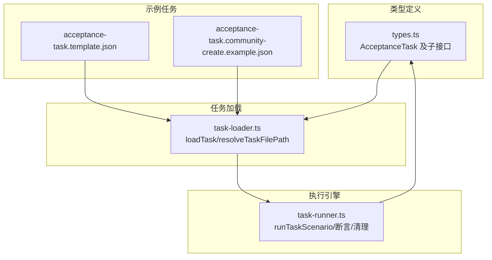
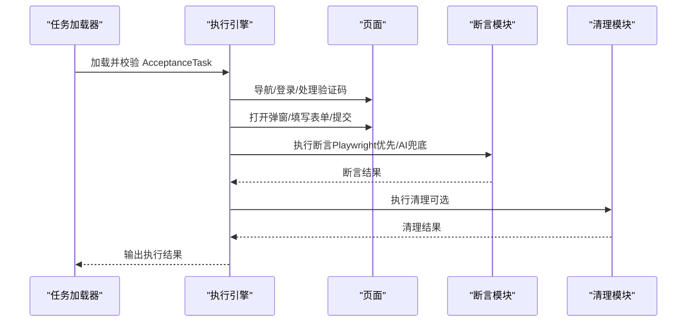
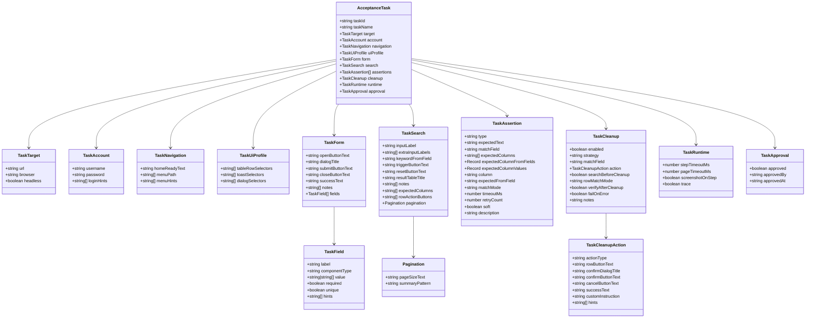

# AcceptanceTask 接口详解

<cite>
**本文引用的文件**
- [src/stage2/types.ts](file://src/stage2/types.ts)
- [src/stage2/task-runner.ts](file://src/stage2/task-runner.ts)
- [src/stage2/task-loader.ts](file://src/stage2/task-loader.ts)
- [specs/tasks/acceptance-task.template.json](file://specs/tasks/acceptance-task.template.json)
- [specs/tasks/acceptance-task.community-create.example.json](file://specs/tasks/acceptance-task.community-create.example.json)
- [README.md](file://README.md)
</cite>

## 目录
1. [简介](#简介)
2. [项目结构](#项目结构)
3. [核心组件](#核心组件)
4. [架构概览](#架构概览)
5. [详细组件分析](#详细组件分析)
6. [依赖分析](#依赖分析)
7. [性能考量](#性能考量)
8. [故障排查指南](#故障排查指南)
9. [结论](#结论)
10. [附录](#附录)

## 简介
本文件面向开发者，系统性阐述 AcceptanceTask 接口的设计理念、结构组成与使用方法。该接口是第二阶段验收任务的统一数据契约，驱动 Playwright + Midscene 的自动化执行引擎，覆盖目标配置、账户信息、导航设置、UI 配置、表单定义、搜索配置、断言规则、清理策略、运行时配置与审批信息等核心模块。文档提供字段含义、数据类型、必填性、使用场景、配置示例、最佳实践、依赖关系与约束条件，并解释扩展性与向后兼容性保障。

## 项目结构
- 类型定义集中在 src/stage2/types.ts，统一声明 AcceptanceTask 及其子接口。
- 任务加载与校验逻辑在 src/stage2/task-loader.ts，负责模板解析、环境变量注入与形状校验。
- 任务执行引擎在 src/stage2/task-runner.ts，实现导航、登录、表单填写、断言、清理等全流程。
- 示例任务模板位于 specs/tasks，包含通用模板与社区小区创建示例，便于快速上手。

图表来源
- [src/stage2/types.ts:141-154](file://src/stage2/types.ts#L141-L154)
- [src/stage2/task-loader.ts:79-89](file://src/stage2/task-loader.ts#L79-L89)
- [src/stage2/task-runner.ts:2318-2657](file://src/stage2/task-runner.ts#L2318-L2657)

章节来源
- [src/stage2/types.ts:1-180](file://src/stage2/types.ts#L1-L180)
- [src/stage2/task-loader.ts:1-91](file://src/stage2/task-loader.ts#L1-L91)
- [src/stage2/task-runner.ts:1-2657](file://src/stage2/task-runner.ts#L1-L2657)
- [specs/tasks/acceptance-task.template.json:1-141](file://specs/tasks/acceptance-task.template.json#L1-L141)
- [specs/tasks/acceptance-task.community-create.example.json:1-229](file://specs/tasks/acceptance-task.community-create.example.json#L1-L229)

## 核心组件
- AcceptanceTask：任务主接口，聚合所有子模块。
- TaskTarget：目标系统访问参数（URL、浏览器、无头模式）。
- TaskAccount：登录凭据与提示信息。
- TaskNavigation：首页就绪文本、菜单路径与提示。
- TaskUiProfile：跨平台 UI 选择器优先级（表格行、Toast、弹窗）。
- TaskForm：弹窗按钮文案、对话框标题、提交/关闭/成功提示、字段集合。
- TaskSearch：搜索输入标签、额外输入、关键字来源字段、触发/重置按钮、结果表标题、列期望、行操作按钮、分页配置。
- TaskAssertion：断言类型、期望文本、匹配字段、期望列、列名到字段映射、列名到期望值映射、列匹配、匹配模式、超时/重试、软断言、自定义描述。
- TaskCleanupAction：清理动作类型（删除/自定义）、行按钮文案、确认弹窗标题/按钮、成功提示、自定义 AI 指令、提示。
- TaskCleanup：清理开关、策略（删除本次新增/删除全部匹配/自定义/无）、匹配字段、动作配置、清理前搜索、行匹配模式、删除后校验、失败是否中断、备注。
- TaskRuntime：步骤超时、页面超时、每步截图、Trace。
- TaskApproval：审批状态、审批人、审批时间。

章节来源
- [src/stage2/types.ts:5-154](file://src/stage2/types.ts#L5-L154)

## 架构概览
AcceptanceTask 作为统一契约，贯穿“加载-校验-执行-断言-清理”的生命周期。加载器负责解析模板与环境变量，执行器按步骤顺序驱动页面交互，断言模块提供 Playwright 硬检测与 AI 兜底的双轨策略，清理模块确保测试数据可回收。

图表来源
- [src/stage2/task-runner.ts:2318-2657](file://src/stage2/task-runner.ts#L2318-L2657)
- [src/stage2/task-loader.ts:79-89](file://src/stage2/task-loader.ts#L79-L89)

## 详细组件分析

### AcceptanceTask 主接口
- 字段与类型
  - taskId: string（必填）
  - taskName: string（必填）
  - target: TaskTarget（必填）
  - account: TaskAccount（必填）
  - navigation?: TaskNavigation（可选）
  - uiProfile?: TaskUiProfile（可选）
  - form: TaskForm（必填）
  - search?: TaskSearch（可选）
  - assertions?: TaskAssertion[]（可选）
  - cleanup?: TaskCleanup（可选）
  - runtime?: TaskRuntime（可选）
  - approval?: TaskApproval（可选）

- 设计理念
  - 以“可配置的验收场景”为核心，通过 JSON 描述端到端业务流程。
  - 通过 uiProfile 支持跨平台 UI 差异，通过断言与清理保障结果一致性与数据隔离。
  - 通过 approval 控制执行准入，通过 runtime 控制执行行为与可观测性。

- 使用场景
  - 业务验收：从登录到提交再到断言与清理的完整闭环。
  - 数据回查：通过搜索与断言验证新增数据是否正确落库。
  - 多平台适配：通过 uiProfile 适配不同 UI 框架的选择器差异。

- 配置示例与最佳实践
  - 使用示例模板与社区示例任务作为起点，逐步替换 URL、账号、字段与断言。
  - 在 assertions 中采用“硬门槛查行 + 软断言关键列”的组合策略，确保最终验收的稳健性。
  - 在 cleanup 中优先使用 delete-created 策略，结合 verifyAfterCleanup 与 failOnError 保障数据回收质量。

章节来源
- [src/stage2/types.ts:141-154](file://src/stage2/types.ts#L141-L154)
- [specs/tasks/acceptance-task.template.json:1-141](file://specs/tasks/acceptance-task.template.json#L1-L141)
- [specs/tasks/acceptance-task.community-create.example.json:1-229](file://specs/tasks/acceptance-task.community-create.example.json#L1-L229)

### TaskTarget：目标配置
- 字段
  - url: string（必填）
  - browser?: string（可选）
  - headless?: boolean（可选）

- 依赖与约束
  - url 必须指向可访问的系统入口。
  - browser/headless 由执行器读取并传入 Playwright 启动参数。

- 最佳实践
  - 在 CI 环境固定 headless 模式，提高稳定性。
  - 不同浏览器的兼容性差异可通过 uiProfile 进行补偿。

章节来源
- [src/stage2/types.ts:5-9](file://src/stage2/types.ts#L5-L9)

### TaskAccount：账户信息
- 字段
  - username: string（必填）
  - password: string（必填）
  - loginHints?: string[]（可选）

- 依赖与约束
  - username/password 必须存在于目标系统。
  - loginHints 用于指导 AI 在登录页进行精准定位。

- 最佳实践
  - 使用环境变量注入敏感信息，避免硬编码。
  - 在 loginHints 中描述占位文案、按钮文案等 UI 特征。

章节来源
- [src/stage2/types.ts:11-15](file://src/stage2/types.ts#L11-L15)

### TaskNavigation：导航设置
- 字段
  - homeReadyText?: string（可选）
  - menuPath?: string[]（可选）
  - menuHints?: string[]（可选）

- 依赖与约束
  - 若配置了 menuPath，则按序点击菜单项。
  - homeReadyText 用于等待首页元素可见，作为导航就绪信号。

- 最佳实践
  - menuPath 应与实际菜单层级一致，避免重复点击。
  - menuHints 描述菜单形态（树形/折叠）与已展开状态，提升定位成功率。

章节来源
- [src/stage2/types.ts:17-21](file://src/stage2/types.ts#L17-L21)

### TaskUiProfile：UI 配置
- 字段
  - tableRowSelectors?: string[]（可选）
  - toastSelectors?: string[]（可选）
  - dialogSelectors?: string[]（可选）

- 依赖与约束
  - 三类选择器均支持多平台优先级列表，执行器会按优先级尝试定位。
  - 未配置时，执行器使用内置默认选择器。

- 最佳实践
  - 为不同 UI 框架（Element Plus、Ant Design、iView）分别提供选择器。
  - 保持选择器的稳定性和唯一性，避免误匹配。

章节来源
- [src/stage2/types.ts:58-65](file://src/stage2/types.ts#L58-L65)

### TaskForm：表单定义
- 字段
  - openButtonText: string（必填）
  - dialogTitle?: string（可选）
  - submitButtonText: string（必填）
  - closeButtonText?: string（可选）
  - successText?: string（可选）
  - notes?: string[]（可选）
  - fields: TaskField[]（必填）

- 关键子接口 TaskField
  - label: string（必填）
  - componentType: 'input' | 'textarea' | 'cascader' | string（必填）
  - value: string | string[]（必填）
  - required?: boolean（可选）
  - unique?: boolean（可选）
  - hints?: string[]（可选）

- 依赖与约束
  - fields 至少包含一个字段。
  - cascader 的 value 为层级数组，需与 UI 级联结构一致。
  - unique 字段常用于 cleanup 的匹配字段。

- 最佳实践
  - 为每个字段提供 hints，描述占位文案与 UI 特征。
  - 对必填字段设置 required，确保断言与清理的准确性。

章节来源
- [src/stage2/types.ts:23-40](file://src/stage2/types.ts#L23-L40)
- [src/stage2/types.ts:58-65](file://src/stage2/types.ts#L58-L65)

### TaskSearch：搜索配置
- 字段
  - inputLabel: string（必填）
  - extraInputLabels?: string[]（可选）
  - keywordFromField?: string（可选）
  - triggerButtonText?: string（可选）
  - resetButtonText?: string（可选）
  - resultTableTitle?: string（可选）
  - notes?: string[]（可选）
  - expectedColumns?: string[]（可选）
  - rowActionButtons?: string[]（可选）
  - pagination?: { pageSizeText?: string; summaryPattern?: string }（可选）

- 依赖与约束
  - keywordFromField 与 form.fields 中的 label 对应，用于回查新增数据。
  - expectedColumns 与断言中的列期望对应。

- 最佳实践
  - 在 notes 中描述搜索区布局与按钮位置，提升定位稳定性。
  - 使用 pagination 配置页码与摘要模式，辅助分页场景的断言。

章节来源
- [src/stage2/types.ts:42-56](file://src/stage2/types.ts#L42-L56)

### TaskAssertion：断言规则
- 字段
  - type: string（必填）
  - expectedText?: string（可选）
  - matchField?: string（可选）
  - expectedColumns?: string[]（可选）
  - expectedColumnFromFields?: Record<string, string>（可选）
  - expectedColumnValues?: Record<string, string>（可选）
  - column?: string（可选）
  - expectedFromField?: string（可选）
  - matchMode?: 'exact' | 'contains'（可选）
  - timeoutMs?: number（可选）
  - retryCount?: number（可选）
  - soft?: boolean（可选）
  - description?: string（可选）

- 断言类型与策略
  - toast：基于文本可见性检测，支持 Toast/消息组件。
  - table-row-exists：基于行存在检测，支持 exact/contains 匹配。
  - table-cell-equals：基于列值精确比较，支持结构化列值提取与代码比对。
  - table-cell-contains：基于列值包含判断。
  - custom：基于 AI 描述的自定义断言。

- 依赖与约束
  - matchField 必须能解析到 resolvedValues 中的有效值。
  - table-cell-equals 需要 expectedColumns 与映射配置。
  - soft 为 true 时，断言失败不会中断流程。

- 最佳实践
  - 采用“硬门槛查行 + 软断言关键列”的组合，确保最终验收稳健。
  - 在断言中合理设置 timeoutMs 与 retryCount，平衡稳定性与耗时。

章节来源
- [src/stage2/types.ts:67-88](file://src/stage2/types.ts#L67-L88)
- [src/stage2/task-runner.ts:1562-1917](file://src/stage2/task-runner.ts#L1562-L1917)

### TaskCleanupAction：清理动作
- 字段
  - actionType: 'delete' | 'custom'（必填）
  - rowButtonText?: string（可选）
  - confirmDialogTitle?: string（可选）
  - confirmButtonText?: string（可选）
  - cancelButtonText?: string（可选）
  - successText?: string（可选）
  - customInstruction?: string（可选）
  - hints?: string[]（可选）

- 依赖与约束
  - actionType='delete' 时，需提供 rowButtonText 与 confirm 配置。
  - actionType='custom' 时，customInstruction 必填。

- 最佳实践
  - 在 hints 中描述操作按钮位置与确认弹窗特征，提升定位成功率。
  - 使用占位符 {targetValue} 在自定义指令中动态替换目标值。

章节来源
- [src/stage2/types.ts:90-107](file://src/stage2/types.ts#L90-L107)

### TaskCleanup：清理策略
- 字段
  - enabled?: boolean（可选）
  - strategy?: 'delete-created' | 'delete-all-matched' | 'custom' | 'none'（可选）
  - matchField?: string（可选）
  - action?: TaskCleanupAction（可选）
  - searchBeforeCleanup?: boolean（可选）
  - rowMatchMode?: 'exact' | 'contains'（可选）
  - verifyAfterCleanup?: boolean（可选）
  - failOnError?: boolean（可选）
  - notes?: string（可选）

- 策略说明
  - delete-created：仅删除本次新增数据。
  - delete-all-matched：删除所有匹配数据（通过 AI 查询）。
  - custom：执行自定义清理指令。
  - none：禁用清理。

- 依赖与约束
  - strategy 为 none 时，清理被完全跳过。
  - verifyAfterCleanup 为 true 时，删除后会再次检测目标行是否消失。
  - failOnError 为 true 时，清理失败会中断任务。

- 最佳实践
  - 优先使用 delete-created 策略，确保测试数据可回收。
  - 在 failOnError 为 true 时，配合 soft 断言，避免清理失败影响验收结果。

章节来源
- [src/stage2/types.ts:109-126](file://src/stage2/types.ts#L109-L126)

### TaskRuntime：运行时配置
- 字段
  - stepTimeoutMs?: number（可选）
  - pageTimeoutMs?: number（可选）
  - screenshotOnStep?: boolean（可选）
  - trace?: boolean（可选）

- 依赖与约束
  - stepTimeoutMs/pageTimeoutMs 用于控制 Playwright 等待超时。
  - screenshotOnStep 为 true 时，每步执行后生成截图。

- 最佳实践
  - 在 CI 环境开启 screenshotOnStep 与 trace，便于问题定位。
  - 根据页面复杂度调整超时时间，避免过短导致误判。

章节来源
- [src/stage2/types.ts:128-133](file://src/stage2/types.ts#L128-L133)

### TaskApproval：审批信息
- 字段
  - approved?: boolean（可选）
  - approvedBy?: string（可选）
  - approvedAt?: string（可选）

- 依赖与约束
  - 当 STAGE2_REQUIRE_APPROVAL=true 时，任务必须通过审批才能执行。

- 最佳实践
  - 在 PR 或发布前完成审批，确保任务执行的安全性。
  - 使用 approvedAt 记录审批时间，便于审计。

章节来源
- [src/stage2/types.ts:135-139](file://src/stage2/types.ts#L135-L139)

## 依赖分析
- 组件耦合
  - AcceptanceTask 与各子接口强耦合，形成“契约-实现”关系。
  - 执行器依赖类型定义与加载器提供的任务对象。
  - 断言与清理模块依赖 uiProfile 与断言配置，实现跨平台适配。

- 外部依赖
  - Playwright：页面交互与等待。
  - Midscene：AI 定位、提取、断言与等待。

图表来源
- [src/stage2/types.ts:5-154](file://src/stage2/types.ts#L5-L154)

章节来源
- [src/stage2/types.ts:1-180](file://src/stage2/types.ts#L1-L180)

## 性能考量
- 断言策略
  - Playwright 硬检测优先，AI 兜底，减少幻觉风险。
  - 重试机制与轮询间隔平衡稳定性与耗时。
- 清理策略
  - 删除后校验与失败中断选项，避免残留数据影响后续执行。
- 截图与 Trace
  - 每步截图与 Trace 便于问题定位，但会增加 IO 与存储开销，建议在 CI 环境按需开启。

## 故障排查指南
- 常见问题与定位
  - 登录失败：检查 account.username/password 与 loginHints；必要时开启 trace 查看页面状态。
  - 导航超时：确认 homeReadyText 与 menuPath；在 README 中查看等待策略。
  - 断言失败：核对 assertions 的 matchField 与 expectedColumns；区分 exact/contains 匹配模式。
  - 清理失败：检查 cleanup.strategy 与 action 配置；开启 verifyAfterCleanup 与 failOnError。
- 环境变量
  - STAGE2_CAPTCHA_MODE：auto/manual/fail/ignore，控制验证码处理策略。
  - STAGE2_REQUIRE_APPROVAL：true/false，控制任务执行准入。

章节来源
- [src/stage2/task-runner.ts:650-706](file://src/stage2/task-runner.ts#L650-L706)
- [README.md:39-62](file://README.md#L39-L62)

## 结论
AcceptanceTask 接口以“可配置的验收场景”为核心，通过清晰的类型定义与丰富的配置项，支撑跨平台、可扩展的自动化验收流程。执行器在加载、导航、表单、断言、清理等环节提供了稳健的实现与兜底策略，配合运行时配置与审批控制，确保任务在不同环境下的稳定性与可审计性。建议在实际项目中遵循“硬门槛查行 + 软断言关键列”的断言策略，以及“删除本次新增 + 删除后校验”的清理策略，以获得最佳的验收效果。

## 附录
- 示例任务模板
  - 通用模板：specs/tasks/acceptance-task.template.json
  - 社区小区创建示例：specs/tasks/acceptance-task.community-create.example.json
- 运行入口
  - tests/generated/stage2-acceptance-runner.spec.ts
- 数据持久化
  - README.md 中有关全局数据持久化底座的说明与迁移脚本。