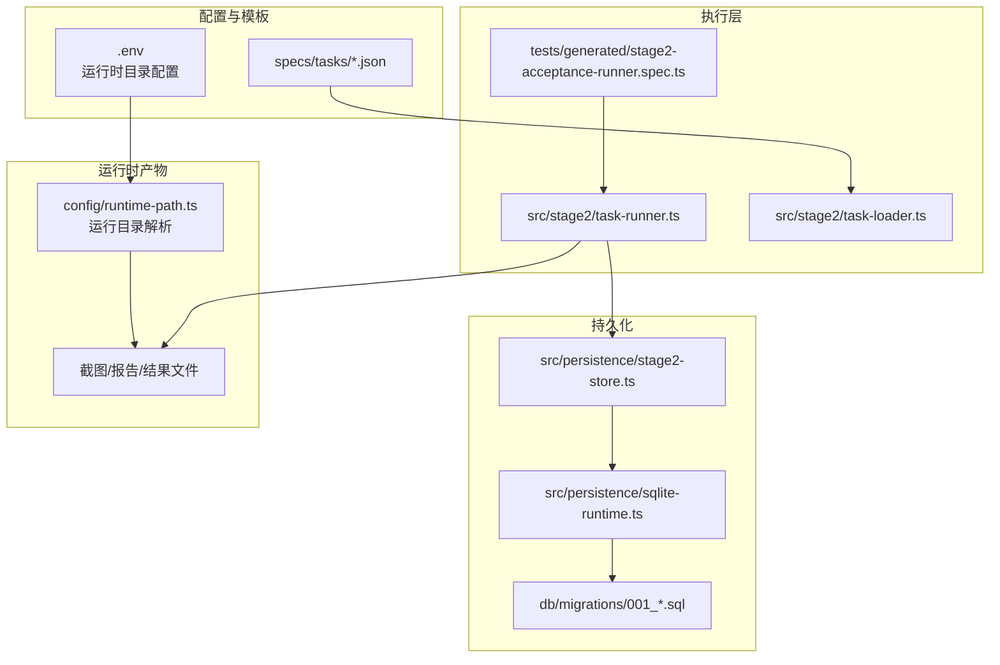
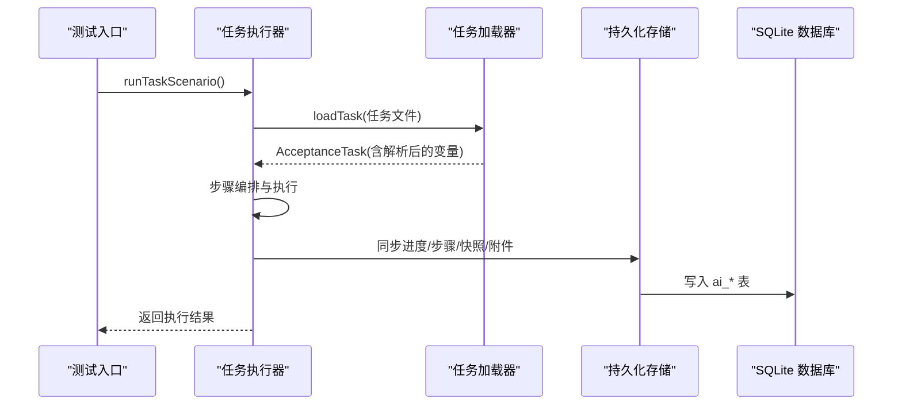
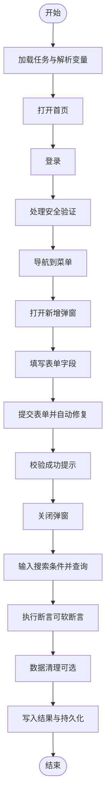
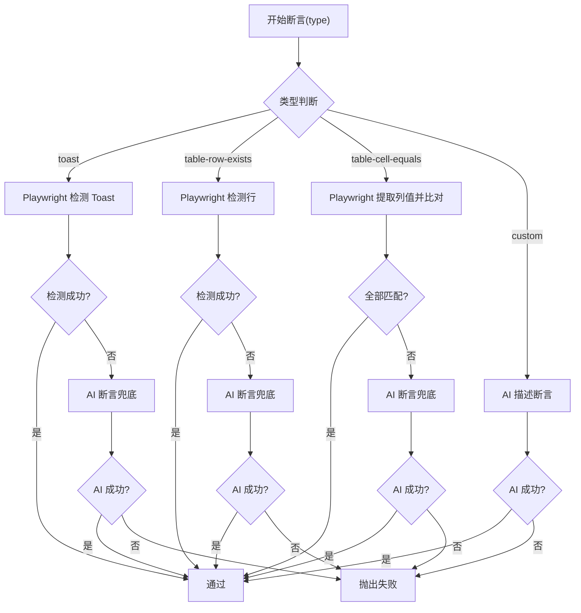
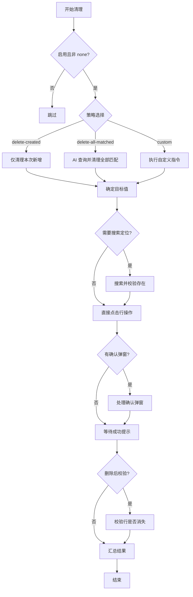
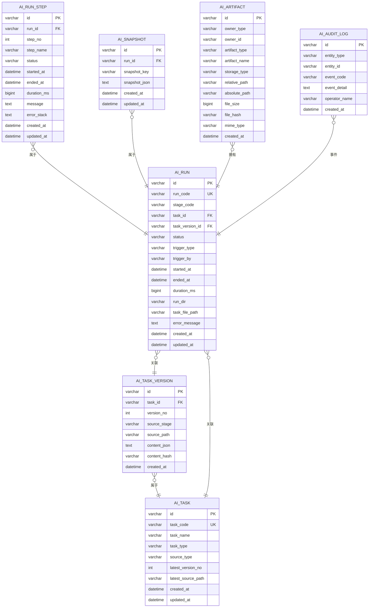
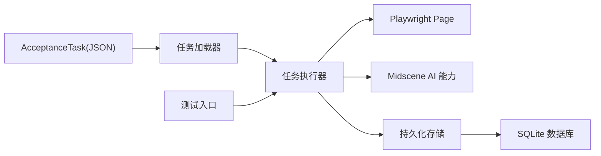

# JSON 任务模型

<cite>
**本文引用的文件**
- [acceptance-task.template.json](file://specs/tasks/acceptance-task.template.json)
- [acceptance-task.community-create.example.json](file://specs/tasks/acceptance-task.community-create.example.json)
- [types.ts](file://src/stage2/types.ts)
- [task-runner.ts](file://src/stage2/task-runner.ts)
- [task-loader.ts](file://src/stage2/task-loader.ts)
- [stage2-acceptance-runner.spec.ts](file://tests/generated/stage2-acceptance-runner.spec.ts)
- [runtime-path.ts](file://config/runtime-path.ts)
- [stage2-store.ts](file://src/persistence/stage2-store.ts)
- [sqlite-runtime.ts](file://src/persistence/sqlite-runtime.ts)
- [001_global_persistence_init.sql](file://db/migrations/001_global_persistence_init.sql)
- [README.md](file://README.md)
- [package.json](file://package.json)
</cite>

## 目录
1. [简介](#简介)
2. [项目结构](#项目结构)
3. [核心组件](#核心组件)
4. [架构总览](#架构总览)
5. [详细组件分析](#详细组件分析)
6. [依赖关系分析](#依赖关系分析)
7. [性能考量](#性能考量)
8. [故障排查指南](#故障排查指南)
9. [结论](#结论)
10. [附录](#附录)

## 简介
本文件系统性阐述基于 JSON 的验收测试任务模型（AcceptanceTask），涵盖设计思想、架构原理、字段语义、断言与清理策略、模板变量与动态参数、执行生命周期与状态管理，以及最佳实践与真实案例。该模型通过结构化配置定义复杂的端到端业务流程，结合 Playwright 与 Midscene 的 AI 能力，实现跨平台、可复用、可观测的自动化验收。

## 项目结构
该项目围绕“JSON 任务驱动 + 第二阶段执行器”的架构组织，关键目录与文件如下：
- specs/tasks：存放任务模板与示例 JSON
- src/stage2：任务加载、运行与断言的核心实现
- tests/generated：测试入口，触发第二阶段执行
- config/runtime-path.ts：运行时目录与环境变量解析
- src/persistence：SQLite 数据持久化与迁移
- db/migrations：数据库迁移脚本
- README.md/package.json：运行与依赖说明

图表来源
- [stage2-acceptance-runner.spec.ts:1-39](file://tests/generated/stage2-acceptance-runner.spec.ts#L1-L39)
- [task-runner.ts:2318-2657](file://src/stage2/task-runner.ts#L2318-L2657)
- [task-loader.ts:79-91](file://src/stage2/task-loader.ts#L79-L91)
- [stage2-store.ts:74-123](file://src/persistence/stage2-store.ts#L74-L123)
- [sqlite-runtime.ts:73-114](file://src/persistence/sqlite-runtime.ts#L73-L114)
- [runtime-path.ts:38-40](file://config/runtime-path.ts#L38-L40)

章节来源
- [README.md:1-223](file://README.md#L1-L223)
- [package.json:1-26](file://package.json#L1-L26)

## 核心组件
- AcceptanceTask 接口：定义任务的完整结构，包括目标、账户、导航、UI 兼容、表单、搜索、断言、清理、运行时与审批等字段
- 任务加载器：解析任务 JSON，注入模板变量（NOW_YYYYMMDDHHMMSS、环境变量），并进行基本校验
- 任务执行器：按步骤编排执行，内置断言与清理流程，支持软断言、重试与截图
- 持久化存储：将任务、运行、步骤、快照与附件落库，支持 SQLite 与迁移

章节来源
- [types.ts:141-154](file://src/stage2/types.ts#L141-L154)
- [task-loader.ts:79-91](file://src/stage2/task-loader.ts#L79-L91)
- [task-runner.ts:2318-2657](file://src/stage2/task-runner.ts#L2318-L2657)
- [stage2-store.ts:74-123](file://src/persistence/stage2-store.ts#L74-L123)

## 架构总览
JSON 任务模型采用“声明式配置 + 执行器编排”的架构。执行器在 Playwright 页面上下文中，结合 Midscene 的 AI 能力，实现高鲁棒性的 UI 操作与断言。

图表来源
- [stage2-acceptance-runner.spec.ts:12-37](file://tests/generated/stage2-acceptance-runner.spec.ts#L12-L37)
- [task-runner.ts:2318-2657](file://src/stage2/task-runner.ts#L2318-L2657)
- [stage2-store.ts:470-493](file://src/persistence/stage2-store.ts#L470-L493)

## 详细组件分析

### AcceptanceTask 接口与字段详解
- taskId/taskName：任务标识与名称
- target：目标站点 URL、浏览器与 headless 设置
- account：用户名、密码与登录提示
- navigation：首页就绪文本、菜单路径与菜单提示
- uiProfile：跨平台 UI 选择器优先级（表格行、Toast、对话框）
- form：打开按钮、弹窗标题、提交/关闭按钮、成功提示、字段集合（含必填/唯一/提示）
- search：搜索输入标签、额外输入标签、关键字来源字段、触发/重置按钮、结果表头、期望列、分页信息、行操作按钮
- assertions：断言数组，支持 toast、table-row-exists、table-cell-equals、table-cell-contains、custom 等
- cleanup：清理开关、策略（删除新增/全部匹配/自定义）、匹配字段、前置搜索、行匹配模式、删除后校验、失败是否中断、动作配置（按钮文案、确认弹窗、成功提示、自定义指令）
- runtime：步骤超时、页面超时、每步截图、开启 trace
- approval：审批状态、审批人、审批时间

章节来源
- [types.ts:5-154](file://src/stage2/types.ts#L5-L154)

### 任务模板与变量系统
- 模板文件：提供通用模板与示例，覆盖常见业务流程
- 变量解析：
  - NOW_YYYYMMDDHHMMSS：注入当前时间戳，用于去重
  - 环境变量：${ENV_VAR_NAME} 注入进程环境变量
  - 递归解析：对字符串、数组、对象进行深度替换
- 加载校验：确保必要字段存在（如 taskId、taskName、target.url、account.username/password、form.openButtonText/submitButtonText、form.fields）

章节来源
- [acceptance-task.template.json:1-141](file://specs/tasks/acceptance-task.template.json#L1-L141)
- [acceptance-task.community-create.example.json:1-229](file://specs/tasks/acceptance-task.community-create.example.json#L1-L229)
- [task-loader.ts:19-48](file://src/stage2/task-loader.ts#L19-L48)
- [task-loader.ts:50-69](file://src/stage2/task-loader.ts#L50-L69)

### 执行生命周期与步骤编排
- 生命周期：加载任务 → 打开首页 → 登录 → 安全验证处理 → 导航到目标菜单 → 打开弹窗 → 填写字段 → 提交表单 → 校验成功提示 → 关闭弹窗 → 搜索与断言 → 数据清理 → 写入结果与持久化
- 步骤管理：每个步骤封装为 runStep，支持 required/skipped/failure 状态、截图、错误栈记录、持久化写入
- 软断言：断言可标记 soft=true，失败不中断流程，便于收集多处问题

图表来源
- [task-runner.ts:2438-2657](file://src/stage2/task-runner.ts#L2438-L2657)

章节来源
- [task-runner.ts:2382-2435](file://src/stage2/task-runner.ts#L2382-L2435)
- [task-runner.ts:2438-2657](file://src/stage2/task-runner.ts#L2438-L2657)

### 断言引擎与重试机制
- 断言类型：
  - toast：检测 Toast/通知类提示
  - table-row-exists：检测表格行是否存在（支持 exact/contains 匹配）
  - table-cell-equals：提取行并比对指定列值（支持字段映射与字面值映射）
  - table-cell-contains：检测某列包含期望值
  - custom：基于自然语言描述的 AI 断言
- 执行策略：Playwright 硬检测优先，失败则降级到 AI 断言；支持重试与轮询
- 行匹配模式：exact（精确）/ contains（包含），默认 exact
- 轮询间隔：固定轮询间隔，超时后抛出错误

图表来源
- [task-runner.ts:1562-1917](file://src/stage2/task-runner.ts#L1562-L1917)

章节来源
- [task-runner.ts:1027-1058](file://src/stage2/task-runner.ts#L1027-L1058)
- [task-runner.ts:1562-1917](file://src/stage2/task-runner.ts#L1562-L1917)

### 数据清理流程
- 策略：
  - delete-created：仅删除本次新增数据
  - delete-all-matched：通过 AI 查询当前列表并删除所有匹配项
  - custom：自定义清理指令
- 动作：
  - 行操作按钮点击（支持多种 UI 框架）
  - 确认弹窗处理（标题/按钮文案）
  - 成功提示检测与删除后校验
- 失败控制：failOnError=true 时清理失败即中断

图表来源
- [task-runner.ts:2218-2316](file://src/stage2/task-runner.ts#L2218-L2316)

章节来源
- [task-runner.ts:1922-2316](file://src/stage2/task-runner.ts#L1922-L2316)

### 运行时与产物管理
- 运行目录：由 runtime-path.ts 解析，统一收敛到 t_runtime/ 下
- 产物：Playwright 报告、Midscene 报告、第二阶段结果 JSON、步骤截图、持久化写库
- 截图：每步可选截图，失败自动截图并附加错误信息
- Trace：可开启 trace 以便调试

章节来源
- [runtime-path.ts:38-40](file://config/runtime-path.ts#L38-L40)
- [task-runner.ts:2334-2341](file://src/stage2/task-runner.ts#L2334-L2341)
- [README.md:76-180](file://README.md#L76-L180)

### 数据持久化与审计
- 存储对象：ai_task、ai_task_version、ai_run、ai_run_step、ai_snapshot、ai_artifact、ai_audit_log
- 写入时机：进度快照、步骤写入、最终结果、附件上传
- 敏感信息处理：任务内容入库时对密码字段掩码
- 迁移：按文件名顺序执行 SQL，记录 checksum 与执行时间

图表来源
- [001_global_persistence_init.sql:1-128](file://db/migrations/001_global_persistence_init.sql#L1-L128)
- [stage2-store.ts:135-261](file://src/persistence/stage2-store.ts#L135-L261)
- [stage2-store.ts:263-303](file://src/persistence/stage2-store.ts#L263-L303)

章节来源
- [stage2-store.ts:74-123](file://src/persistence/stage2-store.ts#L74-L123)
- [sqlite-runtime.ts:86-114](file://src/persistence/sqlite-runtime.ts#L86-L114)
- [001_global_persistence_init.sql:1-128](file://db/migrations/001_global_persistence_init.sql#L1-L128)

## 依赖关系分析
- 任务模板依赖：JSON Schema 语义与字段约束
- 执行器依赖：Playwright Page、Midscene AI 能力、运行时目录与持久化
- 持久化依赖：SQLite 驱动、迁移脚本、索引与外键约束
- 测试入口：Playwright 测试框架集成

图表来源
- [task-runner.ts:2318-2657](file://src/stage2/task-runner.ts#L2318-L2657)
- [stage2-store.ts:74-123](file://src/persistence/stage2-store.ts#L74-L123)

章节来源
- [task-runner.ts:1-26](file://src/stage2/task-runner.ts#L1-L26)
- [stage2-acceptance-runner.spec.ts:1-39](file://tests/generated/stage2-acceptance-runner.spec.ts#L1-L39)

## 性能考量
- 重试与轮询：断言与定位采用固定轮询与有限重试，平衡稳定性与耗时
- 截图策略：按需截图，避免过多 I/O；失败自动截图便于定位
- 超时配置：步骤超时与页面超时可调，建议结合业务页面响应时间设定
- UI 适配：uiProfile 提供跨平台选择器优先级，减少定位失败导致的重试

## 故障排查指南
- 滑块验证码处理：支持 auto/manual/fail/ignore 四种模式，自动模式通过 AI 识别与 Playwright 模拟拖动
- 登录失败：检查 account.username/password 与 loginHints；必要时开启 trace 查看页面状态
- 断言失败：区分 Playwright 硬检测与 AI 兜底，查看重试次数与最终失败原因
- 清理失败：确认策略、匹配字段、前置搜索与确认弹窗文案；failOnError=true 时会中断
- 持久化异常：检查 SQLite 驱动与迁移是否成功，核对权限与路径

章节来源
- [task-runner.ts:650-706](file://src/stage2/task-runner.ts#L650-L706)
- [README.md:56-75](file://README.md#L56-L75)

## 结论
JSON 任务模型通过清晰的结构化配置与强大的执行器编排，实现了跨平台、可扩展、可观测的验收测试体系。借助断言重试、AI 兜底与数据清理策略，显著提升了自动化测试的稳定性与可维护性。配合持久化与运行产物管理，形成从任务到结果的闭环。

## 附录

### 任务模板示例与最佳实践
- 通用模板：提供字段齐全的骨架，适合快速复制与定制
- 示例任务：社区小区创建与回查，演示表单填写、搜索断言、清理策略与多 UI 框架适配
- 最佳实践：
  - 使用 NOW_YYYYMMDDHHMMSS 避免数据冲突
  - 为关键字段提供 hints，提升定位成功率
  - 断言尽量使用 table-row-exists 作为硬门槛，table-cell-* 仅校验关键列
  - 清理策略优先 delete-created，确保可追溯与幂等

章节来源
- [acceptance-task.template.json:1-141](file://specs/tasks/acceptance-task.template.json#L1-L141)
- [acceptance-task.community-create.example.json:1-229](file://specs/tasks/acceptance-task.community-create.example.json#L1-L229)
- [README.md:146-153](file://README.md#L146-L153)

### 执行入口与命令
- 运行第二阶段：npm run stage2:run 或 npm run stage2:run:headed
- 测试入口：tests/generated/stage2-acceptance-runner.spec.ts

章节来源
- [package.json:6-11](file://package.json#L6-L11)
- [stage2-acceptance-runner.spec.ts:1-39](file://tests/generated/stage2-acceptance-runner.spec.ts#L1-L39)