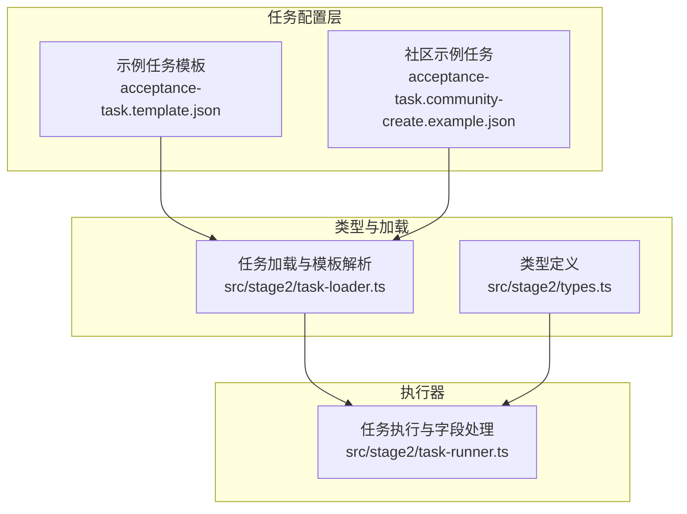
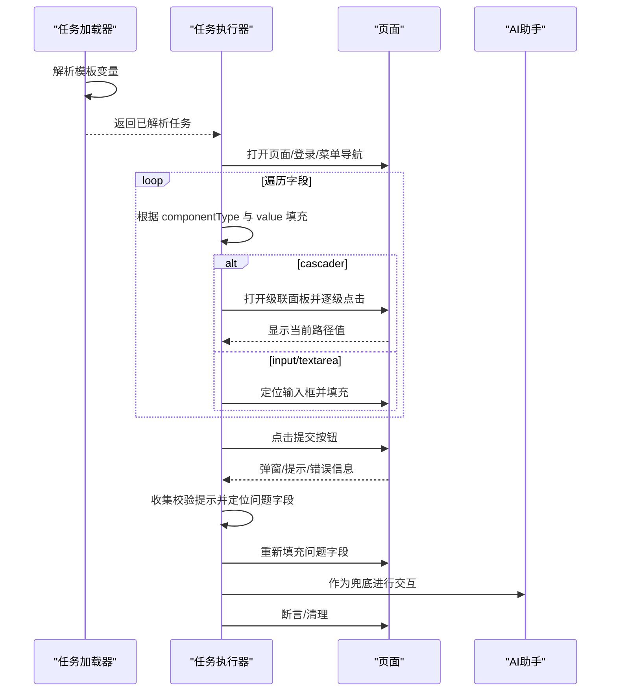
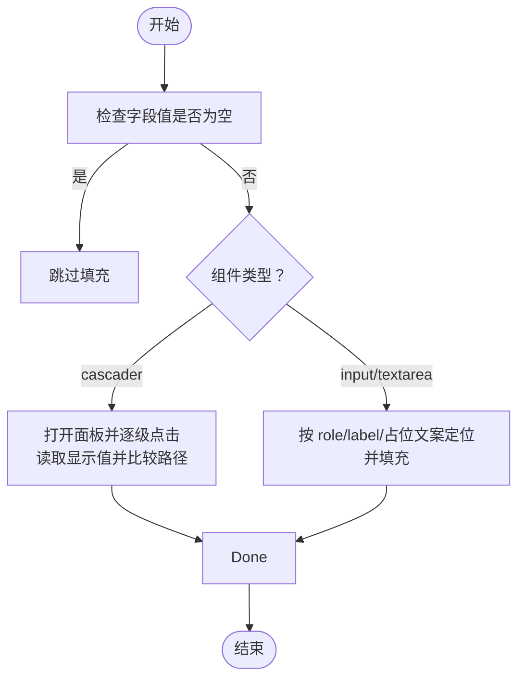
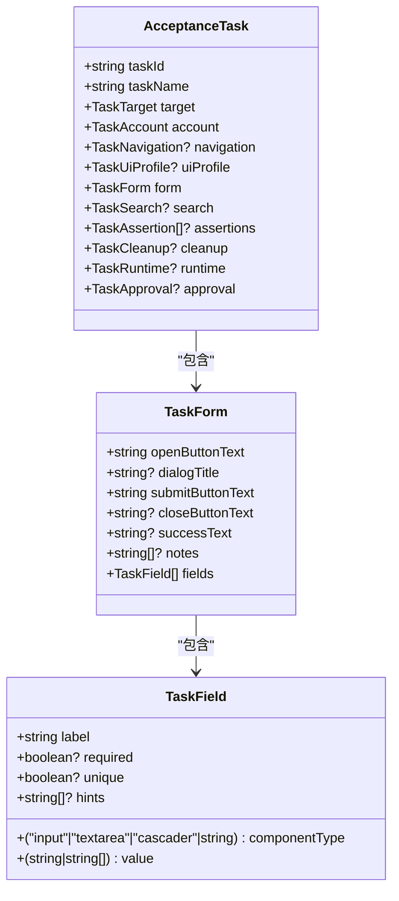

# 任务字段配置

<cite>
**本文引用的文件**
- [src/stage2/types.ts](file://src/stage2/types.ts)
- [src/stage2/task-runner.ts](file://src/stage2/task-runner.ts)
- [src/stage2/task-loader.ts](file://src/stage2/task-loader.ts)
- [specs/tasks/acceptance-task.template.json](file://specs/tasks/acceptance-task.template.json)
- [specs/tasks/acceptance-task.community-create.example.json](file://specs/tasks/acceptance-task.community-create.example.json)
- [README.md](file://README.md)
</cite>

## 目录
1. [简介](#简介)
2. [项目结构](#项目结构)
3. [核心组件](#核心组件)
4. [架构总览](#架构总览)
5. [详细组件分析](#详细组件分析)
6. [依赖关系分析](#依赖关系分析)
7. [性能考量](#性能考量)
8. [故障排查指南](#故障排查指南)
9. [结论](#结论)
10. [附录](#附录)

## 简介
本指南围绕任务字段配置进行系统化说明，重点聚焦 TaskField 接口及其在第二段执行器中的使用方式。内容涵盖字段标签、组件类型、值配置、必填性、唯一性等核心属性的含义与配置规则；不同组件类型（input、textarea、cascader 等）的差异与使用场景；字段值的动态绑定与模板变量；字段验证与业务约束（必填、唯一性）；结合真实 JSON 任务示例展示配置实践；并总结最佳实践与常见陷阱，帮助开发者编写高质量的任务配置。

## 项目结构
本项目采用分层与功能模块化组织，与任务字段配置直接相关的核心文件如下：
- 类型定义：src/stage2/types.ts
- 任务加载与模板解析：src/stage2/task-loader.ts
- 任务执行与字段填充、断言、清理：src/stage2/task-runner.ts
- 示例任务模板与社区示例：specs/tasks/*.json
- 项目说明与运行指引：README.md

图表来源
- [src/stage2/types.ts:23-40](file://src/stage2/types.ts#L23-L40)
- [src/stage2/task-loader.ts:79-89](file://src/stage2/task-loader.ts#L79-L89)
- [src/stage2/task-runner.ts:897-974](file://src/stage2/task-runner.ts#L897-L974)

章节来源
- [README.md:132-190](file://README.md#L132-L190)

## 核心组件
本节聚焦 TaskField 接口及与其密切相关的 TaskForm、AcceptanceTask 等类型，说明字段配置的结构与职责边界。

- TaskField 字段
  - label：字段标签，用于 UI 匹配与断言映射
  - componentType：组件类型，支持 'input'、'textarea'、'cascader' 等
  - value：字段值，支持字符串或字符串数组（cascader 层级路径）
  - required：是否必填
  - unique：是否唯一（用于断言与清理匹配）
  - hints：辅助提示，用于构建候选匹配项与 AI 操作提示

- TaskForm 字段
  - fields：TaskField 数组，承载所有表单字段配置

- AcceptanceTask 字段
  - form：TaskForm，包含 openButtonText、dialogTitle、submitButtonText 等 UI 控件文案，以及 fields

章节来源
- [src/stage2/types.ts:23-40](file://src/stage2/types.ts#L23-L40)
- [src/stage2/types.ts:141-154](file://src/stage2/types.ts#L141-L154)

## 架构总览
任务字段配置在执行器中的流转路径如下：
- 任务加载：从 JSON 文件读取并解析模板变量，得到最终任务对象
- 字段解析：遍历 form.fields，按 componentType 与 value 执行填充
- 验证与修复：提交后收集校验提示，定位必填/必选字段并自动修复
- 断言与清理：基于字段值进行断言与清理

图表来源
- [src/stage2/task-runner.ts:897-1021](file://src/stage2/task-runner.ts#L897-L1021)
- [src/stage2/task-runner.ts:1562-1917](file://src/stage2/task-runner.ts#L1562-L1917)
- [src/stage2/task-runner.ts:2218-2316](file://src/stage2/task-runner.ts#L2218-L2316)

## 详细组件分析

### TaskField 接口详解
- 字段标签 label
  - 作用：作为 UI 匹配的关键键，用于定位输入框、按钮、提示等元素
  - 建议：保持唯一性，避免歧义；可配合 hints 提升定位准确度
- 组件类型 componentType
  - input：单行文本输入
  - textarea：多行文本输入
  - cascader：三级级联选择，value 为字符串数组（省/市/区）
  - 其他：字符串类型，表示自定义组件类型，执行器会以通用方式处理
- 值配置 value
  - input/textarea：字符串
  - cascader：字符串数组，表示层级路径
  - 支持模板变量：在加载阶段会被解析为最终值
- 必填 required
  - true：若为空或未填写，会在提交后被识别并自动修复
- 唯一性 unique
  - true：用于断言与清理匹配，确保唯一标识
- 辅助提示 hints
  - 用于构建候选匹配项（如占位文案等），提升定位成功率

章节来源
- [src/stage2/types.ts:23-30](file://src/stage2/types.ts#L23-L30)
- [src/stage2/task-loader.ts:19-48](file://src/stage2/task-loader.ts#L19-L48)

### 组件类型差异与使用场景
- input
  - 场景：短文本、单行输入，如名称、编号、电话等
  - 填充策略：优先按 role='textbox' + label 匹配，其次按占位文案匹配
- textarea
  - 场景：较长文本或多行输入，如地址、描述等
  - 填充策略：与 input 类似，但明确为多行输入
- cascader
  - 场景：省市区等三级联动选择
  - 填充策略：打开面板，逐级点击选项，读取显示值并与期望路径比较
  - 注意：value 为字符串数组，层级过多时会截断至 10 层

章节来源
- [src/stage2/task-runner.ts:897-974](file://src/stage2/task-runner.ts#L897-L974)
- [src/stage2/task-runner.ts:207-228](file://src/stage2/task-runner.ts#L207-L228)
- [src/stage2/task-runner.ts:312-336](file://src/stage2/task-runner.ts#L312-L336)

### 动态绑定与模板变量
- 模板变量解析
  - 在加载阶段，所有字符串值都会经过模板解析，支持环境变量与时间戳占位
  - 时间戳占位：NOW_YYYYMMDDHHMMSS 会被替换为当前时间
  - 环境变量占位：${ENV_VAR_NAME} 会被替换为 process.env 中的值
- 字段值解析
  - 执行器会将 form.fields 的每个字段 label 映射到最终显示值，供断言与清理使用

章节来源
- [src/stage2/task-loader.ts:19-48](file://src/stage2/task-loader.ts#L19-L48)
- [src/stage2/task-runner.ts:131-137](file://src/stage2/task-runner.ts#L131-L137)

### 字段验证与业务约束
- 必填检查
  - 空值判断：字符串 trim 后为空或数组长度为 0 视为空
  - 提交后收集表单校验提示，识别缺失/未选择字段并自动修复
- 唯一性验证
  - 用于断言与清理匹配，确保唯一标识
  - cascader 路径比较时，支持包含匹配与去除分隔符后的匹配
- UI 适配
  - 不同 UI 框架（Element Plus、Ant Design、View UI）的表单项错误提示选择器会被统一收集与处理

章节来源
- [src/stage2/task-runner.ts:158-163](file://src/stage2/task-runner.ts#L158-L163)
- [src/stage2/task-runner.ts:338-407](file://src/stage2/task-runner.ts#L338-L407)
- [src/stage2/task-runner.ts:342-366](file://src/stage2/task-runner.ts#L342-L366)

### 字段填充流程（算法）

图表来源
- [src/stage2/task-runner.ts:897-974](file://src/stage2/task-runner.ts#L897-L974)
- [src/stage2/task-runner.ts:207-228](file://src/stage2/task-runner.ts#L207-L228)
- [src/stage2/task-runner.ts:312-336](file://src/stage2/task-runner.ts#L312-L336)

### 字段值解析与显示
- 字段值解析
  - 将 form.fields 的每个字段 label 映射到最终显示值（数组会用斜杠拼接）
- 显示值用途
  - 用于断言与清理匹配，确保断言与清理能正确引用字段值

章节来源
- [src/stage2/task-runner.ts:131-137](file://src/stage2/task-runner.ts#L131-L137)

### 实际配置示例与应用
- 示例一：基础模板
  - 展示了单个 input 字段的配置，包含 label、componentType、value、required、unique、hints
- 示例二：社区示例
  - input：小区名称（唯一）、负责人
  - textarea：小区地址
  - cascader：省市区（三级）
  - 其他字段：联系电话（非必填）

章节来源
- [specs/tasks/acceptance-task.template.json:52-63](file://specs/tasks/acceptance-task.template.json#L52-L63)
- [specs/tasks/acceptance-task.community-create.example.json:58-119](file://specs/tasks/acceptance-task.community-create.example.json#L58-L119)

## 依赖关系分析
- 类型依赖
  - AcceptanceTask 依赖 TaskForm，TaskForm 依赖 TaskField
- 执行器依赖
  - task-runner 依赖 types.ts 中的接口定义
  - 填充逻辑依赖 task-runner 的字段处理函数
  - 断言与清理依赖 resolvedValues（字段值解析结果）

图表来源
- [src/stage2/types.ts:23-40](file://src/stage2/types.ts#L23-L40)
- [src/stage2/types.ts:141-154](file://src/stage2/types.ts#L141-L154)

章节来源
- [src/stage2/types.ts:23-40](file://src/stage2/types.ts#L23-L40)
- [src/stage2/types.ts:141-154](file://src/stage2/types.ts#L141-L154)

## 性能考量
- 填充策略
  - 优先使用 Playwright 硬检测定位元素，失败再降级到 AI，减少不必要的 AI 调用
- 重试与轮询
  - 断言与清理采用重试与轮询策略，避免瞬时状态导致的误判
- 截图与日志
  - 在关键步骤可开启截图，便于定位问题，但应控制数量以免影响性能

## 故障排查指南
- 提交后弹窗未关闭
  - 现象：多次点击提交后弹窗仍存在
  - 排查：收集表单校验提示，定位缺失/未选择字段并自动修复
- 级联字段未成功选中
  - 现象：级联路径与期望不一致
  - 排查：检查 cascader 的 value 数组层级，确认面板打开与选项点击顺序
- 字段值为空或未生效
  - 现象：断言或清理找不到目标值
  - 排查：确认模板变量解析是否正确，检查 resolvedValues 中的映射

章节来源
- [src/stage2/task-runner.ts:976-1021](file://src/stage2/task-runner.ts#L976-L1021)
- [src/stage2/task-runner.ts:910-944](file://src/stage2/task-runner.ts#L910-L944)
- [src/stage2/task-runner.ts:131-137](file://src/stage2/task-runner.ts#L131-L137)

## 结论
TaskField 接口提供了清晰、可扩展的字段配置模型，结合模板变量解析与执行器的智能填充、验证与清理机制，能够覆盖大多数业务场景。合理设置 componentType、value、required、unique 与 hints，配合断言与清理策略，可以显著提升任务的稳定性与可维护性。

## 附录

### 字段配置最佳实践
- 字段标签
  - 唯一且语义明确，避免与 UI 文案冲突
- 组件类型
  - input/textarea/cascader 三类常用类型优先使用，避免过度自定义
- 值配置
  - 使用模板变量保证可复用性；对唯一字段使用唯一值或时间戳
- 必填与唯一
  - 对关键字段设置 required 与 unique，便于断言与清理
- 辅助提示
  - 提供占位文案等 hints，提升定位成功率

### 常见陷阱
- cascader 层级过多：超过 10 层会被截断，需确保层级合理
- 空值判断：字符串 trim 后为空或数组为空均视为未填写
- UI 框架差异：不同框架的错误提示选择器不同，需确保 hints 与 UI 匹配
- 断言软硬结合：关键断言使用硬检测，次要断言可使用软断言