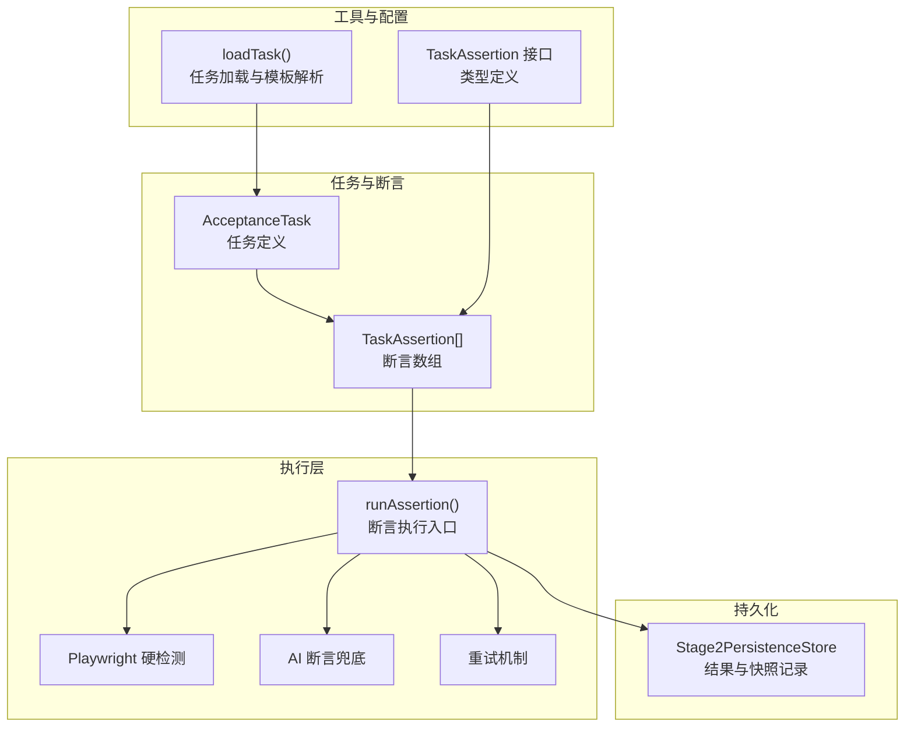
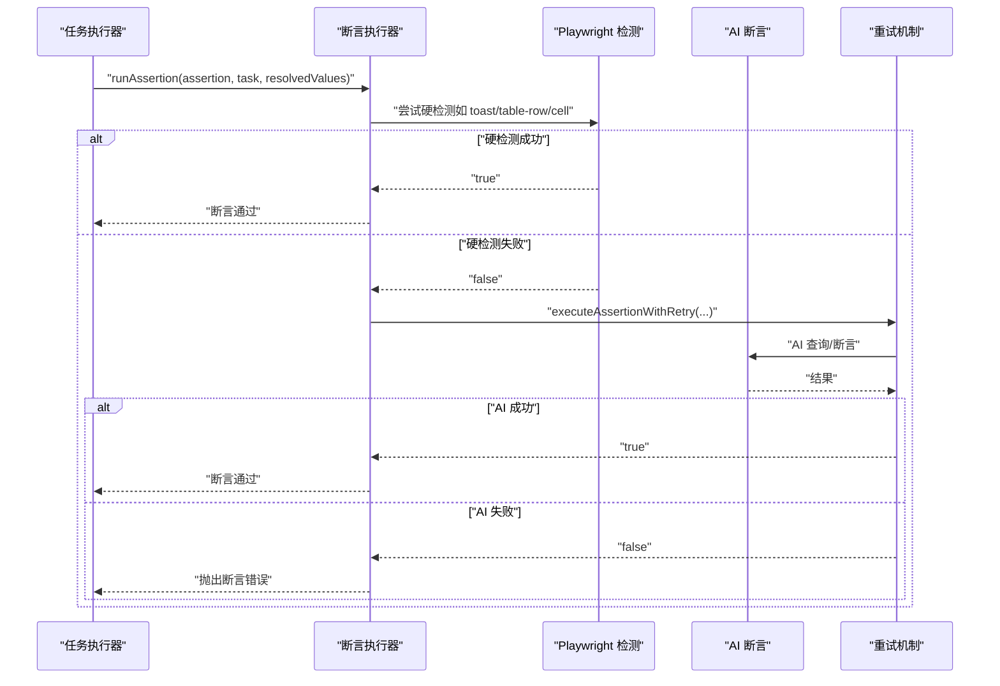
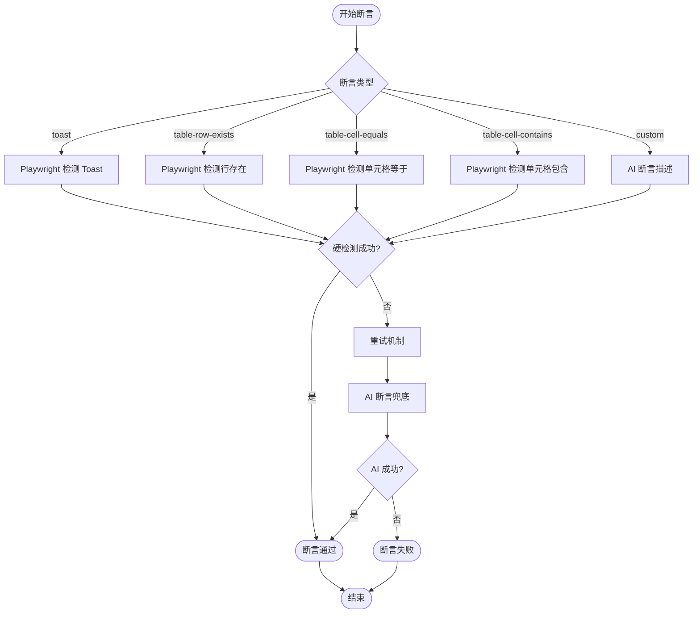
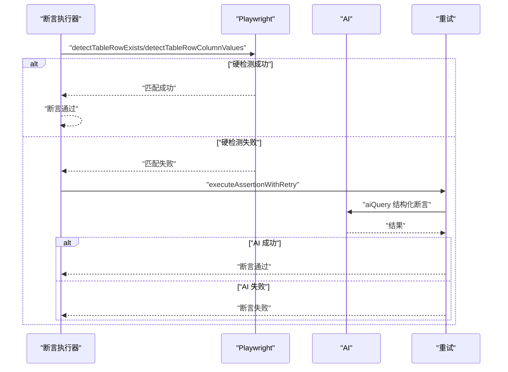
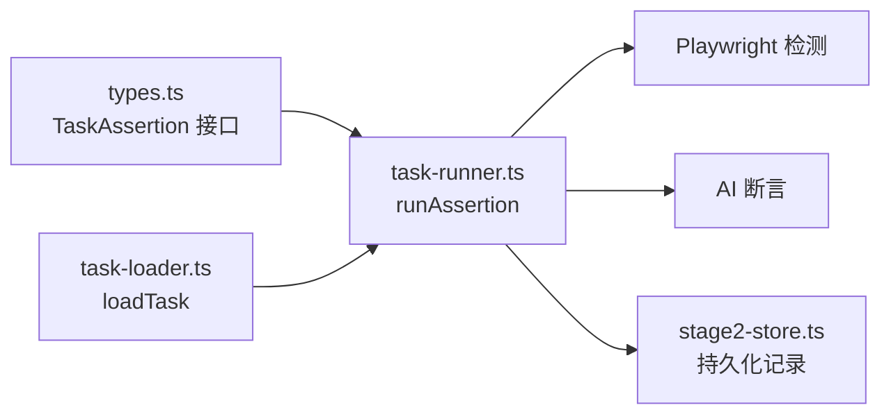

# 任务断言系统

<cite>
**本文引用的文件**
- [src/stage2/types.ts](file://src/stage2/types.ts)
- [src/stage2/task-runner.ts](file://src/stage2/task-runner.ts)
- [src/stage2/task-loader.ts](file://src/stage2/task-loader.ts)
- [specs/tasks/acceptance-task.template.json](file://specs/tasks/acceptance-task.template.json)
- [specs/tasks/acceptance-task.community-create.example.json](file://specs/tasks/acceptance-task.community-create.example.json)
- [src/persistence/stage2-store.ts](file://src/persistence/stage2-store.ts)
- [tests/generated/stage2-acceptance-runner.spec.ts](file://tests/generated/stage2-acceptance-runner.spec.ts)
</cite>

## 目录
1. [简介](#简介)
2. [项目结构](#项目结构)
3. [核心组件](#核心组件)
4. [架构概览](#架构概览)
5. [详细组件分析](#详细组件分析)
6. [依赖关系分析](#依赖关系分析)
7. [性能考量](#性能考量)
8. [故障排查指南](#故障排查指南)
9. [结论](#结论)
10. [附录](#附录)

## 简介
本文件面向“任务断言系统”的使用者与维护者，系统性梳理 TaskAssertion 接口的配置与使用方法，覆盖断言类型、期望文本、字段映射、列配置、匹配模式、超时与重试、软断言等特性，并给出表格断言、文本断言、列断言等不同类型的配置范式与最佳实践。文档还包含断言描述与 AI 断言的使用指南、实际任务示例的配置方法与调试技巧，以及断言系统的扩展性与自定义断言的实现思路。

## 项目结构
断言系统主要由以下模块构成：
- 类型定义：TaskAssertion、AcceptanceTask 等接口定义于类型文件中，明确断言字段、匹配模式、超时与重试等配置项。
- 执行器：task-runner 中实现断言执行入口与具体断言类型的 Playwright/AI 检测逻辑，支持重试与软断言控制。
- 任务加载：task-loader 负责从 JSON 任务文件加载并解析模板变量，保证断言配置在运行时可用。
- 示例任务：提供模板与社区创建示例，展示断言在真实业务场景中的配置方式。
- 持久化：stage2-store 记录断言执行结果与中间快照，便于问题复盘与审计。

**图表来源**
- [src/stage2/types.ts:67-88](file://src/stage2/types.ts#L67-L88)
- [src/stage2/task-runner.ts:1562-1917](file://src/stage2/task-runner.ts#L1562-L1917)
- [src/stage2/task-loader.ts:79-89](file://src/stage2/task-loader.ts#L79-L89)
- [src/persistence/stage2-store.ts:470-630](file://src/persistence/stage2-store.ts#L470-L630)

**章节来源**
- [src/stage2/types.ts:67-88](file://src/stage2/types.ts#L67-L88)
- [src/stage2/task-runner.ts:1562-1917](file://src/stage2/task-runner.ts#L1562-L1917)
- [src/stage2/task-loader.ts:79-89](file://src/stage2/task-loader.ts#L79-L89)
- [specs/tasks/acceptance-task.template.json:75-106](file://specs/tasks/acceptance-task.template.json#L75-L106)
- [specs/tasks/acceptance-task.community-create.example.json:157-194](file://specs/tasks/acceptance-task.community-create.example.json#L157-L194)

## 核心组件
- TaskAssertion 接口
  - type：断言类型，如 toast、table-row-exists、table-cell-equals、table-cell-contains、custom 等。
  - expectedText：期望文本（适用于 toast 断言）。
  - matchField：用于定位表格行的字段标签名，需与任务中表单字段的 label 对应。
  - expectedColumns：期望校验的列集合（适用于表格单元格断言）。
  - expectedColumnFromFields：列名到字段标签的映射，用于将表格列与表单字段对齐。
  - expectedColumnValues：列名到期望值的直接映射，优先级高于 expectedColumnFromFields。
  - column：表格单元格断言的目标列名。
  - expectedFromField：与 column 配合使用的期望值来源字段标签。
  - matchMode：行匹配模式，'exact'（精确）或 'contains'（包含）。
  - timeoutMs：断言超时时间（毫秒），默认 15000。
  - retryCount：断言重试次数，默认 2。
  - soft：软断言标记，失败不中断流程。
  - description：自定义断言描述（用于 AI 断言）。
- 断言执行入口 runAssertion
  - 支持多种断言类型，优先使用 Playwright 硬检测，失败时降级为 AI 断言。
  - 支持带重试的断言执行器 executeAssertionWithRetry。
  - 支持软断言控制，通过 required 参数决定是否中断任务。

**章节来源**
- [src/stage2/types.ts:67-88](file://src/stage2/types.ts#L67-L88)
- [src/stage2/task-runner.ts:1562-1917](file://src/stage2/task-runner.ts#L1562-L1917)
- [src/stage2/task-runner.ts:1532-1556](file://src/stage2/task-runner.ts#L1532-L1556)

## 架构概览
断言系统采用“Playwright 硬检测优先 + AI 断言兜底 + 重试机制”的策略，确保在复杂 UI 场景下的稳定性与可维护性。

**图表来源**
- [src/stage2/task-runner.ts:1562-1917](file://src/stage2/task-runner.ts#L1562-L1917)
- [src/stage2/task-runner.ts:1532-1556](file://src/stage2/task-runner.ts#L1532-L1556)

## 详细组件分析

### TaskAssertion 接口详解
- 类型与用途
  - toast：校验页面提示信息（如 Toast、消息等）是否出现。
  - table-row-exists：校验表格中是否存在某行（基于 matchField 的值）。
  - table-cell-equals：校验某行指定列的值与期望值相等。
  - table-cell-contains：校验某行指定列的值包含期望值。
  - custom：通过 description 描述页面状态，交由 AI 断言验证。
- 关键字段说明
  - matchField：必须与任务表单字段的 label 对应，且在运行时会被解析为实际值。
  - expectedColumns：用于 table-cell-equals，必须提供列名集合。
  - expectedColumnFromFields / expectedColumnValues：用于将列与字段对齐或直接指定期望值，后者优先级更高。
  - column / expectedFromField：用于 table-cell-contains，前者为目标列，后者为期望值来源字段。
  - matchMode：'exact' 或 'contains'，默认 'exact'。
  - timeoutMs / retryCount：控制断言等待与重试行为。
  - soft：软断言，失败不影响整体流程。
  - description：用于 custom 类型，描述页面状态，供 AI 验证。

**章节来源**
- [src/stage2/types.ts:67-88](file://src/stage2/types.ts#L67-L88)
- [specs/tasks/acceptance-task.template.json:75-106](file://specs/tasks/acceptance-task.template.json#L75-L106)
- [specs/tasks/acceptance-task.community-create.example.json:157-194](file://specs/tasks/acceptance-task.community-create.example.json#L157-L194)

### 断言执行器 runAssertion
- 执行策略
  - Playwright 硬检测优先：针对特定断言类型（如 toast、table-*）进行快速检测。
  - AI 断言兜底：硬检测失败时，使用 aiQuery 结构化查询进行断言。
  - 重试机制：executeAssertionWithRetry 提供统一的重试封装，支持自定义延迟。
- 软断言控制
  - 在任务执行阶段，根据 assertion.soft 决定该断言是否作为必需步骤（required）。
- 默认配置
  - 默认超时：15000ms
  - 默认重试：2 次

**图表来源**
- [src/stage2/task-runner.ts:1562-1917](file://src/stage2/task-runner.ts#L1562-L1917)
- [src/stage2/task-runner.ts:1532-1556](file://src/stage2/task-runner.ts#L1532-L1556)

**章节来源**
- [src/stage2/task-runner.ts:1562-1917](file://src/stage2/task-runner.ts#L1562-L1917)
- [src/stage2/task-runner.ts:1532-1556](file://src/stage2/task-runner.ts#L1532-L1556)

### 表格断言（行存在、单元格等于、单元格包含）
- 行存在断言（table-row-exists）
  - 通过 matchField 解析到的值在表格中进行匹配，支持 exact/contains。
  - 若硬检测失败，使用 AI 查询兜底。
- 单元格等于断言（table-cell-equals）
  - 通过 expectedColumns 指定列集合，expectedColumnFromFields 或 expectedColumnValues 提供期望值。
  - 若硬检测失败，使用 AI 查询兜底。
- 单元格包含断言（table-cell-contains）
  - 通过 column 和 expectedFromField 指定目标列与期望值来源字段。
  - 若硬检测失败，使用 AI 查询兜底。

**图表来源**
- [src/stage2/task-runner.ts:1327-1367](file://src/stage2/task-runner.ts#L1327-L1367)
- [src/stage2/task-runner.ts:1463-1527](file://src/stage2/task-runner.ts#L1463-L1527)
- [src/stage2/task-runner.ts:1532-1556](file://src/stage2/task-runner.ts#L1532-L1556)

**章节来源**
- [src/stage2/task-runner.ts:1327-1367](file://src/stage2/task-runner.ts#L1327-L1367)
- [src/stage2/task-runner.ts:1463-1527](file://src/stage2/task-runner.ts#L1463-L1527)
- [src/stage2/task-runner.ts:1532-1556](file://src/stage2/task-runner.ts#L1532-L1556)

### 文本断言（Toast）
- 通过 expectedText 指定期望文本，优先使用 Playwright 的文本可见性检测。
- 若未检测到，使用 AI 查询兜底，返回包含目标文本的提示信息。
- 支持 exact/contains 的文本匹配策略。

**章节来源**
- [src/stage2/task-runner.ts:1278-1322](file://src/stage2/task-runner.ts#L1278-L1322)
- [src/stage2/task-runner.ts:1574-1615](file://src/stage2/task-runner.ts#L1574-L1615)

### 列断言与字段映射
- expectedColumns：指定需要校验的列集合。
- expectedColumnFromFields：将列名映射到任务表单字段标签，运行时解析为实际值。
- expectedColumnValues：直接指定列的期望值，优先级高于字段映射。
- resolveColumnValue：在表格行中解析目标列的实际值，支持模糊匹配与键规范化。

**章节来源**
- [src/stage2/task-runner.ts:1128-1152](file://src/stage2/task-runner.ts#L1128-L1152)
- [src/stage2/task-runner.ts:1184-1210](file://src/stage2/task-runner.ts#L1184-L1210)
- [src/stage2/task-runner.ts:1212-1233](file://src/stage2/task-runner.ts#L1212-L1233)

### 匹配模式与超时重试
- 匹配模式
  - exact：精确匹配，适合 ID、编码等唯一标识。
  - contains：包含匹配，适合名称、地址等可变文本。
- 超时与重试
  - timeoutMs：断言等待时间，默认 15000ms。
  - retryCount：断言重试次数，默认 2 次。
  - pollInterval：断言轮询间隔（内部常量），用于表格与文本检测的轮询等待。

**章节来源**
- [src/stage2/task-runner.ts:1026-1027](file://src/stage2/task-runner.ts#L1026-L1027)
- [src/stage2/task-runner.ts:1235-1272](file://src/stage2/task-runner.ts#L1235-L1272)

### 软断言与任务执行控制
- soft：当断言标记为软断言时，即使失败也不会中断任务流程。
- 在任务执行阶段，断言步骤会根据 soft 标记决定是否作为必需步骤（required）。

**章节来源**
- [src/stage2/task-runner.ts:2599-2611](file://src/stage2/task-runner.ts#L2599-L2611)

### 断言描述与 AI 断言
- custom 类型断言通过 description 描述页面状态，交由 AI 进行结构化断言。
- AI 返回结构化结果（passed/reason），断言系统据此判定通过与否。

**章节来源**
- [src/stage2/task-runner.ts:1873-1894](file://src/stage2/task-runner.ts#L1873-L1894)

### 实际任务示例与配置方法
- 模板任务示例
  - 展示了 toast、table-row-exists、table-cell-equals、custom 等断言类型的配置方式。
- 社区创建示例
  - 展示了更复杂的表格断言场景，包括 table-cell-equals 与 table-cell-contains 的组合使用。

**章节来源**
- [specs/tasks/acceptance-task.template.json:75-106](file://specs/tasks/acceptance-task.template.json#L75-L106)
- [specs/tasks/acceptance-task.community-create.example.json:157-194](file://specs/tasks/acceptance-task.community-create.example.json#L157-L194)

### 调试技巧
- 启用截图与追踪
  - runtime 配置中开启截图与追踪，有助于定位断言失败原因。
- 观察断言日志
  - 系统会在断言降级时输出提示，便于判断是硬检测失败还是 AI 兜底。
- 使用软断言隔离问题
  - 对于不稳定断言，可先标记为 soft，观察失败模式后再调整策略。

**章节来源**
- [specs/tasks/acceptance-task.template.json:134-139](file://specs/tasks/acceptance-task.template.json#L134-L139)
- [src/stage2/task-runner.ts:1595-1614](file://src/stage2/task-runner.ts#L1595-L1614)

## 依赖关系分析
断言系统的关键依赖关系如下：
- TaskAssertion 接口定义了断言的配置项，被 runAssertion 执行器消费。
- 任务加载器负责解析任务文件与模板变量，确保断言所需的 resolvedValues 可用。
- 执行器依赖 Playwright 与 AI 能力，实现硬检测与 AI 兜底。
- 持久化层记录断言执行结果与中间快照，便于问题复盘。

**图表来源**
- [src/stage2/types.ts:67-88](file://src/stage2/types.ts#L67-L88)
- [src/stage2/task-runner.ts:1562-1917](file://src/stage2/task-runner.ts#L1562-L1917)
- [src/stage2/task-loader.ts:79-89](file://src/stage2/task-loader.ts#L79-L89)
- [src/persistence/stage2-store.ts:470-630](file://src/persistence/stage2-store.ts#L470-L630)

**章节来源**
- [src/stage2/types.ts:67-88](file://src/stage2/types.ts#L67-L88)
- [src/stage2/task-runner.ts:1562-1917](file://src/stage2/task-runner.ts#L1562-L1917)
- [src/stage2/task-loader.ts:79-89](file://src/stage2/task-loader.ts#L79-L89)
- [src/persistence/stage2-store.ts:470-630](file://src/persistence/stage2-store.ts#L470-L630)

## 性能考量
- 轮询与超时
  - 断言检测采用轮询策略，合理设置 timeoutMs 与 pollInterval，避免过长等待。
- 重试策略
  - 默认重试 2 次，可根据断言稳定性调整 retryCount，平衡可靠性与执行时长。
- 硬检测优先
  - 优先使用 Playwright 硬检测，减少 AI 查询开销，提升断言执行效率。

## 故障排查指南
- 断言失败但页面可见
  - 检查 matchMode 是否正确（exact vs contains）。
  - 确认 resolvedValues 中 matchField 的值是否解析正确。
- 表格断言缺失列或列值不匹配
  - 检查 expectedColumns 与 expectedColumnFromFields/expectedColumnValues 的配置。
  - 使用 formatColumnAssertionDetail 输出的详细信息定位问题。
- Toast 断言失败
  - 确认 expectedText 是否与页面提示一致，必要时调整为包含匹配。
- 软断言导致问题被掩盖
  - 对不稳定断言先设为 soft，观察日志后再调整为必需断言。

**章节来源**
- [src/stage2/task-runner.ts:1212-1233](file://src/stage2/task-runner.ts#L1212-L1233)
- [src/stage2/task-runner.ts:1595-1614](file://src/stage2/task-runner.ts#L1595-L1614)

## 结论
任务断言系统通过明确的接口定义、可靠的 Playwright 硬检测与 AI 兜底策略、以及完善的重试与软断言机制，实现了在复杂前端 UI 场景下的高可靠断言能力。配合模板任务与持久化记录，用户可以快速构建、调试与维护高质量的验收任务。

## 附录

### 断言类型与配置速查
- toast
  - 关键字段：expectedText
  - 适用场景：提示信息、成功/失败消息
- table-row-exists
  - 关键字段：matchField、matchMode
  - 适用场景：列表/表格行存在性校验
- table-cell-equals
  - 关键字段：matchField、expectedColumns、expectedColumnFromFields/expectedColumnValues、matchMode
  - 适用场景：单元格严格相等校验
- table-cell-contains
  - 关键字段：matchField、column、expectedFromField、matchMode
  - 适用场景：单元格包含关系校验
- custom
  - 关键字段：description
  - 适用场景：复杂页面状态描述与 AI 断言

**章节来源**
- [specs/tasks/acceptance-task.template.json:75-106](file://specs/tasks/acceptance-task.template.json#L75-L106)
- [specs/tasks/acceptance-task.community-create.example.json:157-194](file://specs/tasks/acceptance-task.community-create.example.json#L157-L194)

### 最佳实践
- 明确断言粒度：尽量使用精确匹配（exact）以减少误判。
- 合理设置超时与重试：根据页面加载与渲染情况调整 timeoutMs 与 retryCount。
- 使用软断言隔离不稳定因素：对偶发性断言先标记为 soft，逐步收敛。
- 丰富 UI Profile：为不同 UI 框架提供选择器，提升断言稳定性。
- 记录断言细节：利用持久化记录与截图，便于问题复盘。

**章节来源**
- [specs/tasks/acceptance-task.template.json:29-45](file://specs/tasks/acceptance-task.template.json#L29-L45)
- [src/persistence/stage2-store.ts:470-630](file://src/persistence/stage2-store.ts#L470-L630)