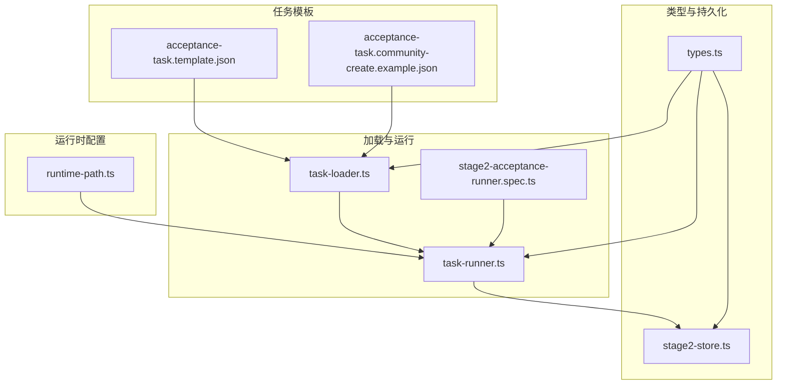
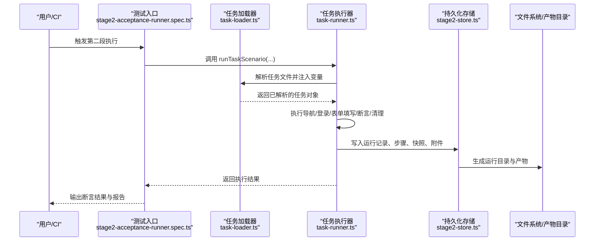
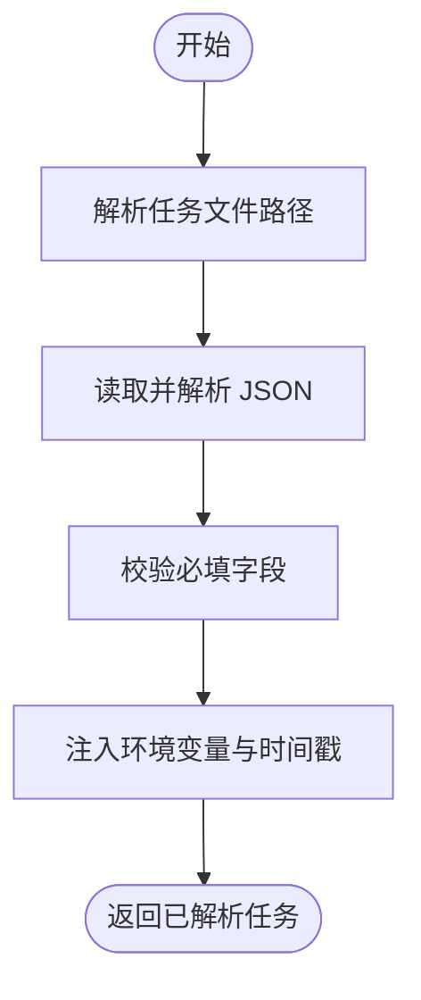
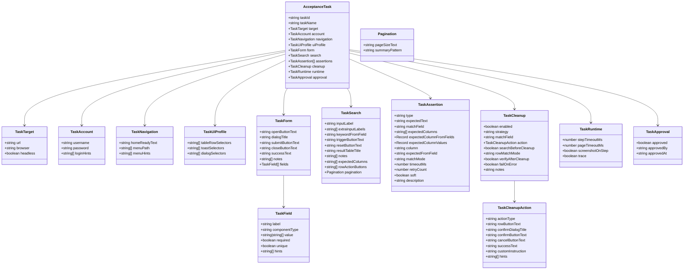
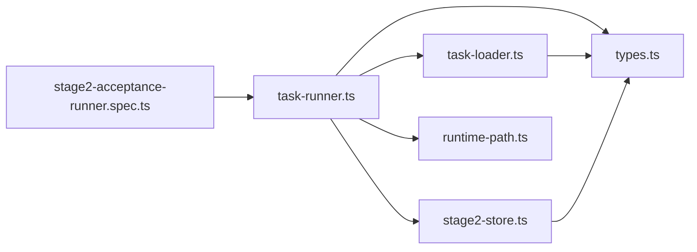

# 任务模板示例

<cite>
**本文引用的文件**
- [acceptance-task.template.json](file://specs/tasks/acceptance-task.template.json)
- [acceptance-task.community-create.example.json](file://specs/tasks/acceptance-task.community-create.example.json)
- [task-loader.ts](file://src/stage2/task-loader.ts)
- [task-runner.ts](file://src/stage2/task-runner.ts)
- [types.ts](file://src/stage2/types.ts)
- [stage2-store.ts](file://src/persistence/stage2-store.ts)
- [stage2-acceptance-runner.spec.ts](file://tests/generated/stage2-acceptance-runner.spec.ts)
- [runtime-path.ts](file://config/runtime-path.ts)
- [README.md](file://README.md)
- [package.json](file://package.json)
</cite>

## 目录
1. [简介](#简介)
2. [项目结构](#项目结构)
3. [核心组件](#核心组件)
4. [架构总览](#架构总览)
5. [详细组件分析](#详细组件分析)
6. [依赖关系分析](#依赖关系分析)
7. [性能考量](#性能考量)
8. [故障排查指南](#故障排查指南)
9. [结论](#结论)
10. [附录](#附录)

## 简介
本指南围绕“任务模板示例”主题，提供一套可复用、可扩展的 JSON 任务模板与社区真实案例，帮助开发者快速上手并高效构建自动化验收任务。内容涵盖模板结构、字段配置、变量与动态参数传递、断言与清理策略、跨平台 UI 适配、以及调试与优化建议。读者无需深厚的前端背景，也能通过本指南理解并应用模板化任务驱动的自动化验收流程。

## 项目结构
该项目采用分层架构，围绕“模板 JSON + 加载器 + 执行器 + 持久化 + 运行时配置”的主线组织文件。关键目录与文件如下：
- specs/tasks：存放任务模板与社区示例
- src/stage2：任务加载、运行与断言的核心逻辑
- src/persistence：运行结果与中间快照的本地持久化
- tests/generated：测试入口，驱动第二段执行
- config/runtime-path.ts：运行产物目录的环境变量解析
- README.md/package.json：安装、运行与脚本说明

图表来源
- [acceptance-task.template.json:1-141](file://specs/tasks/acceptance-task.template.json#L1-L141)
- [acceptance-task.community-create.example.json:1-229](file://specs/tasks/acceptance-task.community-create.example.json#L1-L229)
- [task-loader.ts:1-91](file://src/stage2/task-loader.ts#L1-L91)
- [task-runner.ts:1-1200](file://src/stage2/task-runner.ts#L1-L1200)
- [stage2-store.ts:1-655](file://src/persistence/stage2-store.ts#L1-L655)
- [stage2-acceptance-runner.spec.ts:1-39](file://tests/generated/stage2-acceptance-runner.spec.ts#L1-L39)
- [runtime-path.ts:1-46](file://config/runtime-path.ts#L1-L46)

章节来源
- [README.md:1-255](file://README.md#L1-L255)
- [package.json:1-28](file://package.json#L1-L28)

## 核心组件
- 任务模板：定义目标站点、账户、导航、表单、搜索、断言、清理、审批与运行时参数等
- 任务加载器：解析模板、注入环境变量与时间戳、校验必要字段
- 任务执行器：按模板步骤执行页面交互、断言与清理，并产出运行结果与截图
- 类型定义：强类型约束模板字段与运行结果结构
- 持久化存储：将任务、版本、运行、步骤、快照与附件落库
- 运行时配置：统一收敛运行产物目录，便于调试与归档

章节来源
- [task-loader.ts:1-91](file://src/stage2/task-loader.ts#L1-L91)
- [task-runner.ts:1-1200](file://src/stage2/task-runner.ts#L1-L1200)
- [types.ts:1-180](file://src/stage2/types.ts#L1-L180)
- [stage2-store.ts:1-655](file://src/persistence/stage2-store.ts#L1-L655)
- [runtime-path.ts:1-46](file://config/runtime-path.ts#L1-L46)

## 架构总览
下面的序列图展示了从模板到执行再到持久化的端到端流程。

图表来源
- [stage2-acceptance-runner.spec.ts:1-39](file://tests/generated/stage2-acceptance-runner.spec.ts#L1-L39)
- [task-loader.ts:79-89](file://src/stage2/task-loader.ts#L79-L89)
- [task-runner.ts:1-1200](file://src/stage2/task-runner.ts#L1-L1200)
- [stage2-store.ts:1-655](file://src/persistence/stage2-store.ts#L1-L655)

## 详细组件分析

### 任务模板结构与字段详解
- 基本信息
  - taskId、taskName：唯一标识与任务名称
  - target：url、browser、headless
  - account：username、password、loginHints
- 导航与菜单
  - navigation：homeReadyText、menuPath、menuHints
- UI 适配
  - uiProfile：tableRowSelectors、toastSelectors、dialogSelectors（跨平台优先级列表）
- 表单
  - form：openButtonText、dialogTitle、submitButtonText、closeButtonText、successText、notes、fields[]
    - fields[]：label、componentType、value、required、unique、hints
- 搜索
  - search：inputLabel、extraInputLabels、keywordFromField、triggerButtonText、resetButtonText、resultTableTitle、notes、expectedColumns、rowActionButtons、pagination
- 断言
  - assertions[]：type、expectedText、matchField、expectedColumns、expectedColumnFromFields、expectedColumnValues、column、expectedFromField、matchMode、timeoutMs、retryCount、soft、description
- 清理
  - cleanup：enabled、strategy(delete-created/delete-all-matched/custom/none)、matchField、action、searchBeforeCleanup、rowMatchMode、verifyAfterCleanup、failOnError、notes
  - action：actionType(delete/custom)、rowButtonText、confirmDialogTitle、confirmButtonText、cancelButtonText、successText、customInstruction、hints
- 审批与运行时
  - approval：approved、approvedBy、approvedAt
  - runtime：stepTimeoutMs、pageTimeoutMs、screenshotOnStep、trace

章节来源
- [acceptance-task.template.json:1-141](file://specs/tasks/acceptance-task.template.json#L1-L141)
- [acceptance-task.community-create.example.json:1-229](file://specs/tasks/acceptance-task.community-create.example.json#L1-L229)
- [types.ts:1-180](file://src/stage2/types.ts#L1-L180)

### 模板变量与动态参数传递
- 时间戳变量
  - NOW_YYYYMMDDHHMMSS：在加载时注入当前时间戳，常用于去重与唯一性
- 环境变量注入
  - ${ENV_VAR_NAME}：从进程环境变量注入，若未设置则为空字符串
- 示例路径
  - [resolveTemplateString 实现:19-31](file://src/stage2/task-loader.ts#L19-L31)
  - [resolveTemplates 递归解析:33-48](file://src/stage2/task-loader.ts#L33-L48)
  - [formatNow 生成时间戳:8-17](file://src/stage2/task-loader.ts#L8-L17)

章节来源
- [task-loader.ts:1-91](file://src/stage2/task-loader.ts#L1-L91)

### 断言与清理策略
- 断言类型与行为
  - toast：基于消息提示断言，支持超时与重试
  - table-row-exists：基于行存在断言，支持 exact/contains 匹配
  - table-cell-equals / table-cell-contains：基于单元格值断言，支持从字段映射或字面量映射
  - custom：自定义描述，交由 AI 断言
- 清理策略
  - delete-created：删除本次新增数据
  - delete-all-matched：删除所有匹配数据
  - custom：自定义 AI 指令
  - 支持二次确认弹窗、删除后校验、失败是否中断等控制项

章节来源
- [acceptance-task.template.json:75-128](file://specs/tasks/acceptance-task.template.json#L75-L128)
- [acceptance-task.community-create.example.json:157-216](file://specs/tasks/acceptance-task.community-create.example.json#L157-L216)
- [task-runner.ts:1024-1200](file://src/stage2/task-runner.ts#L1024-L1200)
- [types.ts:67-126](file://src/stage2/types.ts#L67-L126)

### 跨平台 UI 适配与通用配置
- 通过 uiProfile 提供多套选择器优先级，提升在不同 UI 框架下的稳定性
- assertions 与 cleanup 的 matchMode 统一为 exact/contains
- 建议清理时使用 exact，避免误删

章节来源
- [README.md:214-224](file://README.md#L214-L224)
- [acceptance-task.template.json:29-45](file://specs/tasks/acceptance-task.template.json#L29-L45)
- [task-runner.ts:1060-1090](file://src/stage2/task-runner.ts#L1060-L1090)

### 模板加载与校验流程
- 文件解析与路径解析
  - 默认读取 specs/tasks/acceptance-task.community-create.example.json
  - 支持通过环境变量覆盖
- 字段校验
  - 必填字段：taskId、taskName、target.url、account.username/password、form.openButtonText/form.submitButtonText、form.fields
- 变量注入与模板解析
  - 递归遍历模板，替换 ${ENV_VAR_NAME} 与 NOW_YYYYMMDDHHMMSS

图表来源
- [task-loader.ts:71-89](file://src/stage2/task-loader.ts#L71-L89)

章节来源
- [task-loader.ts:1-91](file://src/stage2/task-loader.ts#L1-L91)

### 任务执行器工作流
- 页面生命周期与超时控制
  - 通过 runtime.pageTimeoutMs 控制页面加载超时
  - 步骤级超时通过 runtime.stepTimeoutMs 控制
- 滑块验证码处理
  - 支持 auto/manual/fail/ignore 四种模式
  - auto 模式下使用 AI + Playwright 模拟拖动轨迹
- 表单填写与级联选择
  - 支持 input/textarea/cascader
  - 级联选择失败时自动重试并截图辅助定位
- 断言与清理
  - 断言优先使用 Playwright 硬检测，AI 断言作为兜底
  - 清理策略可配置，支持二次确认与删除后校验

章节来源
- [task-runner.ts:1-1200](file://src/stage2/task-runner.ts#L1-L1200)
- [README.md:58-77](file://README.md#L58-L77)

### 持久化与运行产物
- 数据库落盘
  - ai_task、ai_task_version、ai_run、ai_run_step、ai_snapshot、ai_artifact、ai_audit_log
- 产物目录
  - 接受测试结果、Playwright 报告、Midscene 报告、截图等
- 运行目录统一收敛
  - 通过 RUNTIME_DIR_PREFIX 与各目录环境变量统一管理

章节来源
- [stage2-store.ts:1-655](file://src/persistence/stage2-store.ts#L1-L655)
- [runtime-path.ts:1-46](file://config/runtime-path.ts#L1-L46)
- [README.md:78-123](file://README.md#L78-L123)

### 类型定义与接口关系

图表来源
- [types.ts:1-180](file://src/stage2/types.ts#L1-L180)

章节来源
- [types.ts:1-180](file://src/stage2/types.ts#L1-L180)

### 复杂任务场景模板示例与最佳实践

- 物业平台-新增小区并回查（社区示例）
  - 场景要点：登录、菜单导航、弹窗表单、级联选择、搜索回查、断言与清理
  - 关键字段：account.loginHints、navigation.menuPath/menuHints、form.fields（含 cascader）、search.rowActionButtons、assertions（toast/table-row-exists/table-cell-equals/table-cell-contains）、cleanup.action.hints
  - 示例路径：[社区示例模板:1-229](file://specs/tasks/acceptance-task.community-create.example.json#L1-L229)

- 通用模板（基础示例）
  - 场景要点：最小可用结构，演示字段与断言配置
  - 示例路径：[通用模板:1-141](file://specs/tasks/acceptance-task.template.json#L1-L141)

- 最佳实践
  - 使用 NOW_YYYYMMDDHHMMSS 保证唯一性
  - 在 form.fields 中标注 required/unique，便于断言与清理
  - assertions 优先使用硬检测（Playwright），AI 断言作为兜底
  - cleanup.strategy 建议使用 delete-created，verifyAfterCleanup 设为 true
  - uiProfile 为不同 UI 框架提供多套选择器，提升稳定性

章节来源
- [acceptance-task.community-create.example.json:1-229](file://specs/tasks/acceptance-task.community-create.example.json#L1-L229)
- [acceptance-task.template.json:1-141](file://specs/tasks/acceptance-task.template.json#L1-L141)
- [README.md:151-157](file://README.md#L151-L157)

### 模板调试与优化建议
- 调试
  - 启用 runtime.screenshotOnStep 与 runtime.trace，收集步骤截图与 trace
  - 使用 cleanup.searchBeforeCleanup 与 cleanup.verifyAfterCleanup 精准定位问题
  - 在 assertions 中合理配置 soft 与 retryCount，避免偶发失败影响整体流程
- 优化
  - 将高频配置放入环境变量（如 TEST_USERNAME/TEST_PASSWORD），减少模板硬编码
  - 使用 uiProfile 的多套选择器，降低 UI 变更带来的脆弱性
  - 对 cascader 等复杂控件增加 hints 辅助定位，提升 AI 定位成功率

章节来源
- [task-runner.ts:1-1200](file://src/stage2/task-runner.ts#L1-L1200)
- [README.md:151-157](file://README.md#L151-L157)

## 依赖关系分析
- 模块耦合
  - task-runner.ts 依赖 task-loader.ts 与 types.ts，负责执行流程
  - stage2-store.ts 依赖 types.ts，负责持久化
  - tests/generated/stage2-acceptance-runner.spec.ts 作为入口，依赖 task-runner.ts
  - runtime-path.ts 为运行时产物目录提供统一解析
- 外部依赖
  - Playwright、Midscene.js、dotenv、SQLite（实验特性）

图表来源
- [stage2-acceptance-runner.spec.ts:1-39](file://tests/generated/stage2-acceptance-runner.spec.ts#L1-L39)
- [task-runner.ts:1-1200](file://src/stage2/task-runner.ts#L1-L1200)
- [task-loader.ts:1-91](file://src/stage2/task-loader.ts#L1-L91)
- [stage2-store.ts:1-655](file://src/persistence/stage2-store.ts#L1-L655)
- [runtime-path.ts:1-46](file://config/runtime-path.ts#L1-L46)

章节来源
- [package.json:1-28](file://package.json#L1-L28)

## 性能考量
- 重试与超时
  - assertions.retryCount 与 timeoutMs 控制断言稳定性与耗时
  - runtime.stepTimeoutMs/pageTimeoutMs 控制页面交互与加载耗时
- 截图与 Trace
  - screenshotOnStep 与 trace 有助于定位问题，但会增加 IO 与存储开销
- 级联选择与滑块处理
  - cascader 多次重试与滑块自动处理会增加执行时间，建议在 CI 中按需开启

章节来源
- [task-runner.ts:1024-1200](file://src/stage2/task-runner.ts#L1024-L1200)
- [README.md:58-77](file://README.md#L58-L77)

## 故障排查指南
- 常见问题
  - 任务文件缺失必填字段：加载器会在 assertTaskShape 中抛出明确错误
  - 滑块验证码：根据 STAGE2_CAPTCHA_MODE 配置决定行为
  - 级联选择失败：检查 cascader 的 hints 与期望路径，必要时增加截图辅助定位
  - 断言失败：优先检查 exact/contains 匹配模式与 expectedColumnFromFields 映射
- 定位手段
  - 查看 t_runtime/acceptance-results 下的 result.json 与 screenshots
  - 检查数据库中 ai_run、ai_run_step、ai_snapshot、ai_artifact 的记录
- 相关实现
  - [assertTaskShape 校验:50-69](file://src/stage2/task-loader.ts#L50-L69)
  - [handleCaptchaChallengeIfNeeded 滑块处理:650-706](file://src/stage2/task-runner.ts#L650-L706)
  - [recordStep/finishRun 持久化写入:495-630](file://src/persistence/stage2-store.ts#L495-L630)

章节来源
- [task-loader.ts:50-69](file://src/stage2/task-loader.ts#L50-L69)
- [task-runner.ts:650-706](file://src/stage2/task-runner.ts#L650-L706)
- [stage2-store.ts:495-630](file://src/persistence/stage2-store.ts#L495-L630)

## 结论
通过模板化任务，可以将复杂的验收流程标准化、可复用化与可维护化。结合环境变量与时间戳变量注入、跨平台 UI 适配、硬检测与 AI 断言的混合策略、以及完善的持久化与产物目录管理，开发者能够快速构建高质量的自动化验收任务，并在 CI 中稳定运行。建议在团队内沉淀模板库，形成“模板 + 注释 + 社区示例”的知识资产，持续提升交付效率与质量。

## 附录
- 快速开始
  - 安装依赖与浏览器：参见 [README 安装与配置:10-30](file://README.md#L10-L30)
  - 初始化数据库：参见 [README 数据库初始化:124-134](file://README.md#L124-L134)
  - 运行第二段：参见 [README 运行第二段:188-203](file://README.md#L188-L203)
- 关键脚本
  - [package.json 脚本:6-12](file://package.json#L6-L12)