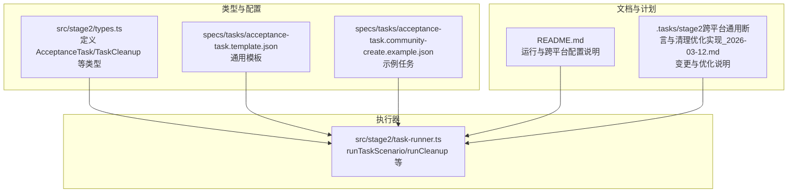
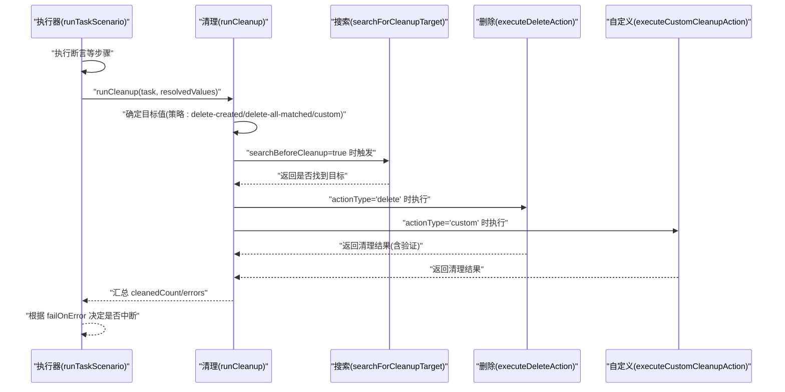
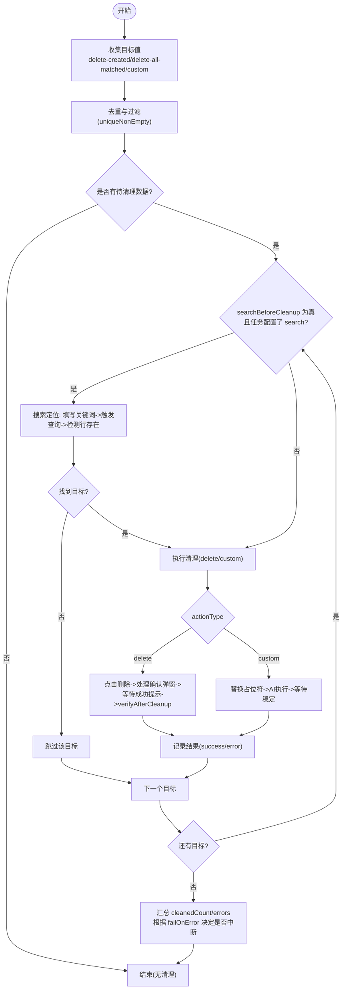
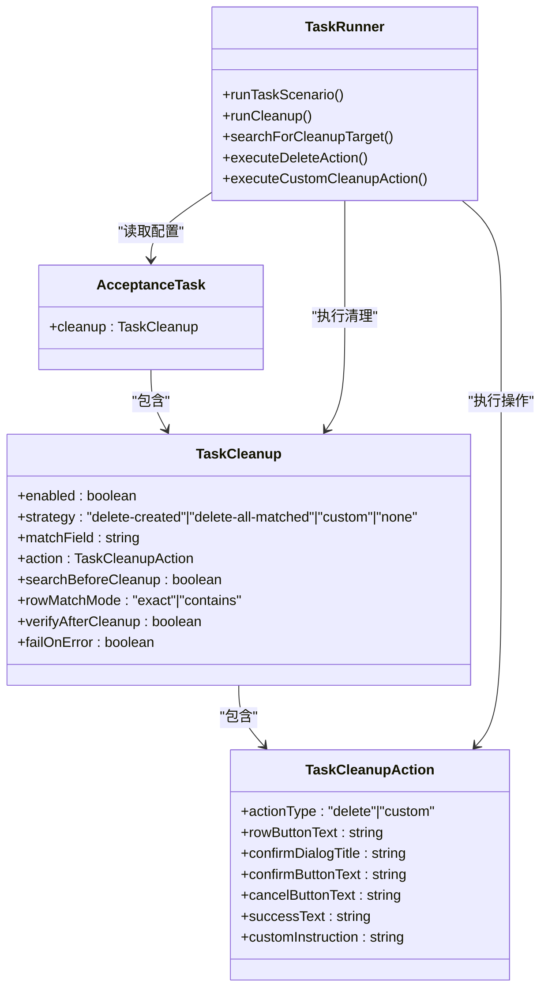

# 任务清理策略

<cite>
**本文引用的文件**
- [src/stage2/types.ts](file://src/stage2/types.ts)
- [src/stage2/task-runner.ts](file://src/stage2/task-runner.ts)
- [specs/tasks/acceptance-task.template.json](file://specs/tasks/acceptance-task.template.json)
- [specs/tasks/acceptance-task.community-create.example.json](file://specs/tasks/acceptance-task.community-create.example.json)
- [README.md](file://README.md)
- [.tasks/stage2跨平台通用断言与清理优化实现_2026-03-12.md](file://.tasks/stage2跨平台通用断言与清理优化实现_2026-03-12.md)
</cite>

## 目录
1. [简介](#简介)
2. [项目结构](#项目结构)
3. [核心组件](#核心组件)
4. [架构总览](#架构总览)
5. [详细组件分析](#详细组件分析)
6. [依赖关系分析](#依赖关系分析)
7. [性能考量](#性能考量)
8. [故障排除指南](#故障排除指南)
9. [结论](#结论)
10. [附录](#附录)

## 简介
本指南围绕任务清理策略进行系统化配置与实操说明，重点覆盖 TaskCleanup 接口的设计理念、清理策略类型（delete-created、delete-all-matched、custom、none）的适用场景与配置方法，以及清理操作的执行流程（数据定位、搜索匹配、确认操作、验证结果等关键环节）。同时提供清理前搜索、行匹配模式、清理后验证等高级特性配置技巧，给出自定义清理指令的编写指南与最佳实践，并结合实际业务场景展示不同清理需求的配置方法与故障排除技巧。最后总结清理策略的安全性考虑与风险控制措施，确保测试数据的正确管理与隔离。

## 项目结构
本项目采用分层与职责分离的组织方式：
- 类型定义集中在 stage2/types.ts，统一描述任务、断言、清理等核心模型。
- 执行器集中在 stage2/task-runner.ts，负责任务生命周期、断言、清理等流程编排。
- 任务模板与示例位于 specs/tasks，提供可直接使用的 JSON 配置范式。
- README.md 提供运行环境、目录约定与跨平台通用配置说明。

图表来源
- [src/stage2/types.ts:141-154](file://src/stage2/types.ts#L141-L154)
- [src/stage2/task-runner.ts:2318-2657](file://src/stage2/task-runner.ts#L2318-L2657)
- [specs/tasks/acceptance-task.template.json:107-128](file://specs/tasks/acceptance-task.template.json#L107-L128)
- [specs/tasks/acceptance-task.community-create.example.json:195-216](file://specs/tasks/acceptance-task.community-create.example.json#L195-L216)
- [README.md:213-223](file://README.md#L213-L223)
- [.tasks/stage2跨平台通用断言与清理优化实现_2026-03-12.md:13-27](file://.tasks/stage2跨平台通用断言与清理优化实现_2026-03-12.md#L13-L27)

章节来源
- [src/stage2/types.ts:141-154](file://src/stage2/types.ts#L141-L154)
- [src/stage2/task-runner.ts:2318-2657](file://src/stage2/task-runner.ts#L2318-L2657)
- [specs/tasks/acceptance-task.template.json:107-128](file://specs/tasks/acceptance-task.template.json#L107-L128)
- [specs/tasks/acceptance-task.community-create.example.json:195-216](file://specs/tasks/acceptance-task.community-create.example.json#L195-L216)
- [README.md:213-223](file://README.md#L213-L223)
- [.tasks/stage2跨平台通用断言与清理优化实现_2026-03-12.md:13-27](file://.tasks/stage2跨平台通用断言与清理优化实现_2026-03-12.md#L13-L27)

## 核心组件
- TaskCleanup 类型：定义清理开关、策略、匹配字段、操作配置、前置搜索、行匹配模式、清理后验证、失败处理等。
- TaskCleanupAction 类型：定义删除或自定义清理的操作细节（按钮文案、确认弹窗、成功提示、自定义指令等）。
- runCleanup：清理流程主函数，负责目标值收集、搜索定位、逐条清理、结果汇总与错误处理。
- executeDeleteAction：执行删除动作，含行按钮点击、确认弹窗处理、成功提示等待、清理后验证。
- searchForCleanupTarget：清理前搜索定位，支持多种 UI 选择器与行匹配模式。
- executeCustomCleanupAction：执行自定义清理指令，支持占位符替换与 AI 执行。
- runTaskScenario：在断言之后执行清理步骤，支持 failOnError 控制清理失败是否中断任务。

章节来源
- [src/stage2/types.ts:90-126](file://src/stage2/types.ts#L90-L126)
- [src/stage2/types.ts:109-126](file://src/stage2/types.ts#L109-L126)
- [src/stage2/task-runner.ts:2218-2316](file://src/stage2/task-runner.ts#L2218-L2316)
- [src/stage2/task-runner.ts:2077-2144](file://src/stage2/task-runner.ts#L2077-L2144)
- [src/stage2/task-runner.ts:2179-2213](file://src/stage2/task-runner.ts#L2179-L2213)
- [src/stage2/task-runner.ts:2149-2174](file://src/stage2/task-runner.ts#L2149-L2174)
- [src/stage2/task-runner.ts:2613-2631](file://src/stage2/task-runner.ts#L2613-L2631)

## 架构总览
清理策略在任务执行流程中的位置与交互如下：

图表来源
- [src/stage2/task-runner.ts:2613-2631](file://src/stage2/task-runner.ts#L2613-L2631)
- [src/stage2/task-runner.ts:2218-2316](file://src/stage2/task-runner.ts#L2218-L2316)
- [src/stage2/task-runner.ts:2179-2213](file://src/stage2/task-runner.ts#L2179-L2213)
- [src/stage2/task-runner.ts:2077-2144](file://src/stage2/task-runner.ts#L2077-L2144)
- [src/stage2/task-runner.ts:2149-2174](file://src/stage2/task-runner.ts#L2149-L2174)

## 详细组件分析

### TaskCleanup 设计理念与字段说明
- enabled：是否启用清理。
- strategy：清理策略类型
  - delete-created：仅删除本次新增数据（基于 matchField 对应的 resolvedValues）。
  - delete-all-matched：删除当前列表中所有匹配的数据（通过 AI 查询列表）。
  - custom：使用本次新增数据执行自定义清理指令。
  - none：禁用清理。
- matchField：用于定位待删除数据的字段名（通常与表单 unique 字段一致）。
- action：清理操作配置，支持 delete 或 custom。
- searchBeforeCleanup：清理前是否先搜索定位数据。
- rowMatchMode：行匹配模式（exact/contains），建议默认 exact。
- verifyAfterCleanup：删除后是否强制校验目标行消失（建议 true）。
- failOnError：清理失败是否中断任务。
- notes：清理说明。

章节来源
- [src/stage2/types.ts:109-126](file://src/stage2/types.ts#L109-L126)
- [README.md:221-222](file://README.md#L221-L222)

### 清理策略类型与适用场景
- delete-created
  - 适用场景：仅清理本次任务产生的新增数据，避免影响历史数据。
  - 配置要点：设置 strategy 为 delete-created，matchField 指向唯一标识字段（如小区名称）。
  - 示例参考：模板与示例任务均使用该策略。
- delete-all-matched
  - 适用场景：需要清理当前列表中所有匹配项，常用于批量清理或回归测试。
  - 配置要点：strategy 为 delete-all-matched，依赖 AI 提取列表值；谨慎使用 contains 模式。
- custom
  - 适用场景：需要复杂清理逻辑或跨页面操作，通过自定义指令实现。
  - 配置要点：action.actionType='custom'，提供 customInstruction，支持 {targetValue}/{value} 占位符。
- none
  - 适用场景：临时禁用清理，或清理逻辑由外部流程接管。
  - 配置要点：strategy='none' 或不启用清理。

章节来源
- [src/stage2/types.ts:109-126](file://src/stage2/types.ts#L109-L126)
- [specs/tasks/acceptance-task.template.json:107-128](file://specs/tasks/acceptance-task.template.json#L107-L128)
- [specs/tasks/acceptance-task.community-create.example.json:195-216](file://specs/tasks/acceptance-task.community-create.example.json#L195-L216)

### 清理执行流程详解
- 目标值收集
  - delete-created：从 resolvedValues 中取 matchField 对应值。
  - delete-all-matched：通过 runner.aiQuery 提取当前列表中 matchField 的值集合。
  - custom：与 delete-created 相同，使用本次新增值。
- 去重与过滤
  - 统一使用 uniqueNonEmpty 进行去重与空值过滤。
- 搜索定位（可选）
  - 若 searchBeforeCleanup 为 true 且任务配置了 search，则先按 matchField 填写搜索条件并触发查询，再通过 detectTableRowExists 检测目标行是否存在。
- 执行清理
  - delete：点击行操作按钮（默认“删除”），处理确认弹窗，等待成功提示，必要时进行 verifyAfterCleanup。
  - custom：替换指令中的 {targetValue}/{value} 后交由 runner.ai 执行。
- 结果汇总与错误处理
  - 记录 cleanedCount 与 errors；若 failOnError 为 true 且存在错误则中断任务。

图表来源
- [src/stage2/task-runner.ts:2218-2316](file://src/stage2/task-runner.ts#L2218-L2316)
- [src/stage2/task-runner.ts:2179-2213](file://src/stage2/task-runner.ts#L2179-L2213)
- [src/stage2/task-runner.ts:2077-2144](file://src/stage2/task-runner.ts#L2077-L2144)
- [src/stage2/task-runner.ts:2149-2174](file://src/stage2/task-runner.ts#L2149-L2174)

章节来源
- [src/stage2/task-runner.ts:2218-2316](file://src/stage2/task-runner.ts#L2218-L2316)
- [src/stage2/task-runner.ts:2179-2213](file://src/stage2/task-runner.ts#L2179-L2213)
- [src/stage2/task-runner.ts:2077-2144](file://src/stage2/task-runner.ts#L2077-L2144)
- [src/stage2/task-runner.ts:2149-2174](file://src/stage2/task-runner.ts#L2149-L2174)

### 高级特性配置与使用技巧
- 清理前搜索（searchBeforeCleanup）
  - 建议开启，确保删除前目标行可见，避免误删或找不到目标。
  - 依赖任务的 search 配置（inputLabel、triggerButtonText 等）。
- 行匹配模式（rowMatchMode）
  - 建议使用 exact，避免误匹配。
  - 仅在业务明确允许时使用 contains。
- 清理后验证（verifyAfterCleanup）
  - 建议开启，删除后再次检测目标行是否消失，提高清理可靠性。
- 成功提示与确认弹窗
  - 配置 action.successText 与 action.confirm* 文案，有助于清理后快速验证与兜底。
- 失败处理（failOnError）
  - 在关键任务中建议开启，保证清理失败能及时暴露问题。

章节来源
- [src/stage2/types.ts:117-126](file://src/stage2/types.ts#L117-L126)
- [README.md:221-222](file://README.md#L221-L222)
- [src/stage2/task-runner.ts:2120-2136](file://src/stage2/task-runner.ts#L2120-L2136)

### 自定义清理指令编写指南与最佳实践
- 指令结构
  - 使用 action.actionType='custom'，提供 action.customInstruction。
  - 支持占位符 {targetValue} 与 {value}，在执行时会被替换为实际目标值。
- 编写建议
  - 明确目标对象与操作意图，尽量短小精悍。
  - 避免过于复杂的多步骤链路，必要时拆分为多个步骤。
  - 在指令中加入必要的等待与稳定时间，确保页面状态稳定。
- 典型场景
  - 批量删除：先搜索再循环删除。
  - 跨页面清理：先跳转到目标页面，再执行删除。
  - 条件清理：根据目标值特征决定删除策略。

章节来源
- [src/stage2/types.ts:90-107](file://src/stage2/types.ts#L90-L107)
- [src/stage2/task-runner.ts:2149-2174](file://src/stage2/task-runner.ts#L2149-L2174)

### 实际业务场景配置示例
- 新增小区并清理
  - 使用 delete-created 策略，matchField 指向“小区名称”，开启 searchBeforeCleanup 与 verifyAfterCleanup。
  - 参考示例任务的 cleanup 配置。
- 批量清理历史数据
  - 使用 delete-all-matched 策略，依赖 AI 提取列表值，谨慎使用 contains。
- 自定义清理流程
  - 使用 custom 策略，编写复杂清理指令，如先筛选再删除、跨页面联动等。

章节来源
- [specs/tasks/acceptance-task.community-create.example.json:195-216](file://specs/tasks/acceptance-task.community-create.example.json#L195-L216)
- [specs/tasks/acceptance-task.template.json:107-128](file://specs/tasks/acceptance-task.template.json#L107-L128)

## 依赖关系分析
- 类型依赖
  - AcceptanceTask.cleanup 引用 TaskCleanup。
  - TaskCleanup.action 引用 TaskCleanupAction。
- 执行器依赖
  - runTaskScenario 在断言之后调用 runCleanup。
  - runCleanup 依赖 searchForCleanupTarget、executeDeleteAction、executeCustomCleanupAction。
  - executeDeleteAction 依赖 handleConfirmDialog、waitForCleanupSuccess、detectTableRowExists。
- 配置依赖
  - cleanup.rowMatchMode 与 cleanup.verifyAfterCleanup 影响清理行为。
  - cleanup.searchBeforeCleanup 依赖任务的 search 配置。

图表来源
- [src/stage2/types.ts:141-154](file://src/stage2/types.ts#L141-L154)
- [src/stage2/types.ts:109-126](file://src/stage2/types.ts#L109-L126)
- [src/stage2/types.ts:90-107](file://src/stage2/types.ts#L90-L107)
- [src/stage2/task-runner.ts:2318-2657](file://src/stage2/task-runner.ts#L2318-L2657)
- [src/stage2/task-runner.ts:2218-2316](file://src/stage2/task-runner.ts#L2218-L2316)

章节来源
- [src/stage2/types.ts:141-154](file://src/stage2/types.ts#L141-L154)
- [src/stage2/types.ts:109-126](file://src/stage2/types.ts#L109-L126)
- [src/stage2/types.ts:90-107](file://src/stage2/types.ts#L90-L107)
- [src/stage2/task-runner.ts:2318-2657](file://src/stage2/task-runner.ts#L2318-L2657)
- [src/stage2/task-runner.ts:2218-2316](file://src/stage2/task-runner.ts#L2218-L2316)

## 性能考量
- 目标值去重：使用 uniqueNonEmpty 减少重复清理，降低无效交互。
- 搜索定位：仅在必要时开启 searchBeforeCleanup，避免额外的页面交互与等待。
- 行匹配模式：优先 exact，避免 contains 导致的多次扫描与误匹配。
- 清理后验证：verifyAfterCleanup 建议开启，但会增加一次检测耗时；可根据任务重要性权衡。
- AI 查询：delete-all-matched 依赖 runner.aiQuery，注意其响应时间与稳定性。

[本节为通用指导，无需特定文件引用]

## 故障排除指南
- 未找到目标行
  - 检查 searchBeforeCleanup 与 search 配置是否正确。
  - 确认 rowMatchMode 是否合适（建议 exact）。
  - 参考 searchForCleanupTarget 的实现与日志。
- 删除后目标行仍存在
  - 开启 verifyAfterCleanup 并检查 detectTableRowExists 的检测逻辑。
  - 确认 successText 是否被正确识别，或改为 verifyAfterCleanup。
- 自定义清理失败
  - 检查 customInstruction 是否包含占位符且已正确替换。
  - 确认指令是否包含必要的等待与稳定时间。
- 清理失败是否中断
  - 若 failOnError 为 true，清理错误将导致任务中断；否则仅记录错误并继续。

章节来源
- [src/stage2/task-runner.ts:2179-2213](file://src/stage2/task-runner.ts#L2179-L2213)
- [src/stage2/task-runner.ts:2120-2136](file://src/stage2/task-runner.ts#L2120-L2136)
- [src/stage2/task-runner.ts:2149-2174](file://src/stage2/task-runner.ts#L2149-L2174)
- [src/stage2/task-runner.ts:2620-2624](file://src/stage2/task-runner.ts#L2620-L2624)

## 结论
TaskCleanup 通过清晰的策略类型与可配置项，实现了对测试数据的可控清理。delete-created 适合单次新增数据清理，delete-all-matched 适合批量清理，custom 则提供了灵活的扩展能力。配合 searchBeforeCleanup、rowMatchMode、verifyAfterCleanup 与 failOnError 等高级特性，可在保证清理准确性的同时兼顾性能与稳定性。建议在关键任务中开启 verifyAfterCleanup 与 failOnError，并合理使用 exact 匹配模式，确保测试数据的正确管理与隔离。

[本节为总结，无需特定文件引用]

## 附录
- 跨平台通用配置
  - README 提供 uiProfile 与断言/清理相关的通用字段说明，便于多平台适配。
- 变更与优化
  - .tasks 文件记录了清理与断言优化的变更内容，包括新增 rowMatchMode、verifyAfterCleanup 等。

章节来源
- [README.md:213-223](file://README.md#L213-L223)
- [.tasks/stage2跨平台通用断言与清理优化实现_2026-03-12.md:13-27](file://.tasks/stage2跨平台通用断言与清理优化实现_2026-03-12.md#L13-L27)