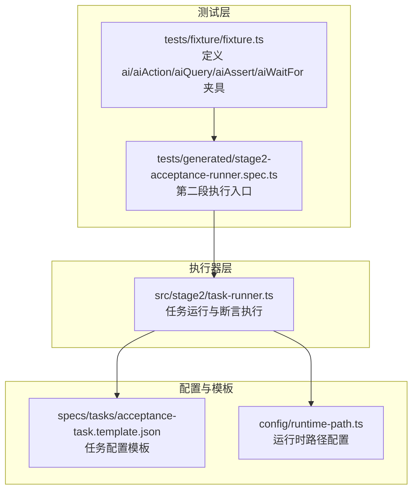
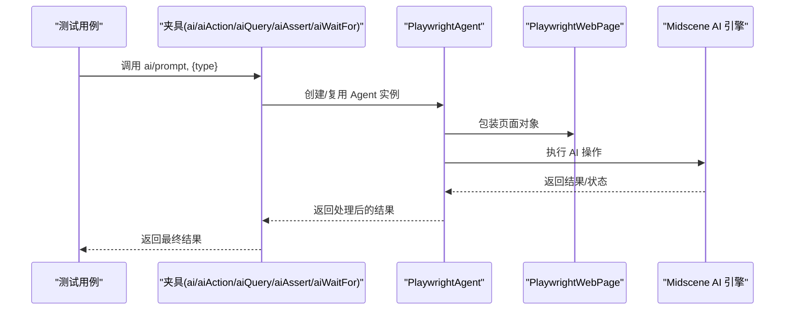
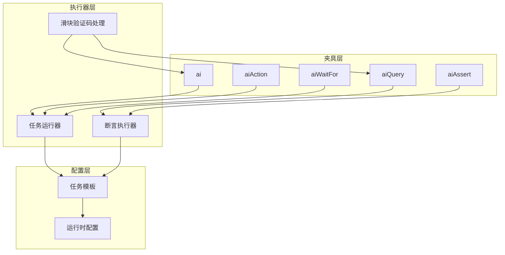

# AI API 方法详解

<cite>
**本文引用的文件**
- [README.md](file://README.md)
- [fixture.ts](file://tests/fixture/fixture.ts)
- [stage2-acceptance-runner.spec.ts](file://tests/generated/stage2-acceptance-runner.spec.ts)
- [task-runner.ts](file://src/stage2/task-runner.ts)
- [acceptance-task.template.json](file://specs/tasks/acceptance-task.template.json)
</cite>

## 目录
1. [简介](#简介)
2. [项目结构](#项目结构)
3. [核心组件](#核心组件)
4. [架构概览](#架构概览)
5. [详细组件分析](#详细组件分析)
6. [依赖关系分析](#依赖关系分析)
7. [性能考虑](#性能考虑)
8. [故障排除指南](#故障排除指南)
9. [结论](#结论)

## 简介
本文件为 Midscene AI API 方法的全面技术参考文档，重点解释以下核心方法的功能特性、参数配置与使用场景：
- ai：通用 AI 操作方法，支持通过 type 参数控制行为模式（'action' | 'query'）
- aiAction：专门用于复杂操作指令的 AI 方法
- aiQuery：用于从页面提取结构化数据的方法
- aiAssert：用于执行 AI 断言验证的方法
- aiWaitFor：用于等待特定条件满足的 AI 方法

文档还深入阐述了各方法的类型参数影响、最佳实践、错误处理与超时配置，并提供完整的使用示例与实际应用场景说明。

## 项目结构
该项目基于 Playwright 与 Midscene.js 构建，采用分层架构组织代码：
- tests/fixture：定义 Playwright 测试夹具，封装 AI 方法的统一入口
- src/stage2：第二阶段执行器，包含任务加载、运行与断言逻辑
- specs/tasks：任务 JSON 模板，定义断言、清理策略等配置
- config：运行时路径与数据库配置
- scripts/db：数据库迁移与初始化脚本

**图表来源**
- [fixture.ts:23-99](file://tests/fixture/fixture.ts#L23-L99)
- [stage2-acceptance-runner.spec.ts:1-39](file://tests/generated/stage2-acceptance-runner.spec.ts#L1-L39)
- [task-runner.ts:1-120](file://src/stage2/task-runner.ts#L1-L120)
- [acceptance-task.template.json:1-141](file://specs/tasks/acceptance-task.template.json#L1-L141)

**章节来源**
- [README.md:1-229](file://README.md#L1-L229)
- [fixture.ts:1-100](file://tests/fixture/fixture.ts#L1-L100)
- [stage2-acceptance-runner.spec.ts:1-39](file://tests/generated/stage2-acceptance-runner.spec.ts#L1-L39)
- [task-runner.ts:1-120](file://src/stage2/task-runner.ts#L1-L120)
- [acceptance-task.template.json:1-141](file://specs/tasks/acceptance-task.template.json#L1-L141)

## 核心组件
本项目围绕五个核心 AI 方法构建：
- ai：通用 AI 操作入口，支持通过 type 参数选择行为模式
- aiAction：专用于复杂操作指令的 AI 方法
- aiQuery：用于从页面提取结构化数据
- aiAssert：用于执行 AI 断言验证
- aiWaitFor：用于等待特定条件满足

这些方法通过统一的夹具注入到测试用例中，便于在不同场景下灵活组合使用。

**章节来源**
- [README.md:139-152](file://README.md#L139-L152)
- [fixture.ts:23-99](file://tests/fixture/fixture.ts#L23-L99)

## 架构概览
AI 方法的调用链路如下：
- 测试用例通过夹具获取 ai/aiAction/aiQuery/aiAssert/aiWaitFor
- ai 方法内部根据 type 参数选择不同的执行模式
- aiQuery 用于结构化数据提取，常与代码断言配合使用
- aiAssert 用于 AI 断言验证，通常作为补充性断言
- aiWaitFor 用于等待特定条件满足，适用于 Playwright 常规等待不适用的场景

**图表来源**
- [fixture.ts:24-41](file://tests/fixture/fixture.ts#L24-L41)
- [task-runner.ts:561-648](file://src/stage2/task-runner.ts#L561-L648)

**章节来源**
- [fixture.ts:23-99](file://tests/fixture/fixture.ts#L23-L99)
- [task-runner.ts:561-648](file://src/stage2/task-runner.ts#L561-L648)

## 详细组件分析

### ai 方法详解
ai 方法是通用的 AI 操作入口，支持通过 type 参数控制行为模式：
- type: 'action' | 'query'
  - 'action'：执行操作指令，适合复杂交互场景
  - 'query'：提取结构化数据，适合信息抽取场景

实现要点：
- 通过夹具包装 PlaywrightAgent，支持缓存、报告生成等功能
- 支持自定义测试标识、分组描述与缓存 ID
- 返回类型为 Promise<T>，允许泛型约束

最佳实践：
- 将长流程拆分为多个短步骤，避免单一超长 Prompt
- 对于动态页面，建议拆分为多个步骤以便重试与失败补偿
- 结合 aiQuery 与代码断言，降低 AI 幻觉风险

**章节来源**
- [fixture.ts:16-41](file://tests/fixture/fixture.ts#L16-L41)
- [README.md:60-77](file://README.md#L60-L77)

### aiAction 方法详解
aiAction 专门用于复杂操作指令，适用于：
- 复杂的页面交互流程
- 需要多步骤协调的操作
- 需要 AI 智能决策的场景

实现要点：
- 直接调用 agent.aiAction(taskPrompt)
- 无需 type 参数，专注于操作指令
- 适合处理 Playwright 原生 API 难以覆盖的复杂场景

使用场景：
- 表单填写中的级联选择
- 动态弹窗的智能处理
- 多步骤业务流程的自动化

**章节来源**
- [fixture.ts:43-56](file://tests/fixture/fixture.ts#L43-L56)
- [README.md:78-84](file://README.md#L78-L84)

### aiQuery 方法详解
aiQuery 用于从页面提取结构化数据，具备以下能力：
- 提取表格行、列值
- 提取 Toast/消息提示
- 提取对话框状态
- 执行自定义描述断言

实现机制：
- 通过结构化 Prompt 获取 JSON 格式结果
- 支持重试机制，提高稳定性
- 与 Playwright 硬检测优先策略配合使用

返回值处理：
- 返回 Promise<T>，T 为结构化数据类型
- 常见返回格式包括 { passed: boolean, reason?: string }
- 支持自定义数据结构的提取

**章节来源**
- [task-runner.ts:1532-1556](file://src/stage2/task-runner.ts#L1532-L1556)
- [task-runner.ts:1873-1917](file://src/stage2/task-runner.ts#L1873-L1917)
- [acceptance-task.template.json:75-106](file://specs/tasks/acceptance-task.template.json#L75-L106)

### aiAssert 方法详解
aiAssert 用于执行 AI 断言验证，具有以下特性：
- 支持自定义错误信息
- 作为补充性断言使用
- 与 Playwright 硬检测形成互补

实现策略：
- Playwright 硬检测优先：精确元素定位与可见性检测
- AI 断言兜底：复杂语义场景的 AI 验证
- 重试机制：提高断言的稳定性

错误处理：
- 失败时抛出明确错误信息
- 支持软断言（soft）与硬断言（failOnError）策略
- 可配置重试次数与延迟间隔

**章节来源**
- [task-runner.ts:1027-1029](file://src/stage2/task-runner.ts#L1027-L1029)
- [task-runner.ts:1562-1567](file://src/stage2/task-runner.ts#L1562-L1567)
- [acceptance-task.template.json:75-106](file://specs/tasks/acceptance-task.template.json#L75-L106)

### aiWaitFor 方法详解
aiWaitFor 用于等待特定条件满足，适用于：
- Playwright 常规等待不适用的复杂条件
- 需要 AI 智能判断的等待场景
- 动态内容加载的不确定性等待

实现机制：
- 接受 assertion 参数与可选配置
- 支持自定义超时与轮询间隔
- 与任务配置中的超时设置协同工作

超时配置：
- 支持任务级别的 stepTimeoutMs 与 pageTimeoutMs
- 可在断言配置中指定 timeoutMs
- 默认轮询间隔为 500ms

**章节来源**
- [task-runner.ts:1278-1322](file://src/stage2/task-runner.ts#L1278-L1322)
- [task-runner.ts:1327-1367](file://src/stage2/task-runner.ts#L1327-L1367)
- [acceptance-task.template.json:134-139](file://specs/tasks/acceptance-task.template.json#L134-L139)

## 依赖关系分析
AI 方法之间的依赖关系如下：

**图表来源**
- [fixture.ts:23-99](file://tests/fixture/fixture.ts#L23-L99)
- [task-runner.ts:1-120](file://src/stage2/task-runner.ts#L1-L120)
- [acceptance-task.template.json:1-141](file://specs/tasks/acceptance-task.template.json#L1-L141)

**章节来源**
- [fixture.ts:23-99](file://tests/fixture/fixture.ts#L23-L99)
- [task-runner.ts:1-120](file://src/stage2/task-runner.ts#L1-L120)
- [acceptance-task.template.json:1-141](file://specs/tasks/acceptance-task.template.json#L1-L141)

## 性能考虑
- 缓存机制：夹具层通过 cacheId 与 testId 实现 AI 调用缓存，减少重复计算
- 重试策略：断言执行器内置重试机制，提高稳定性
- 轮询优化：aiWaitFor 与断言检测使用合理的轮询间隔（500ms）
- 资源管理：统一的日志目录与运行时路径配置，便于资源回收与清理

## 故障排除指南
常见问题与解决方案：
- AI 幻觉风险：优先使用 Playwright 硬检测 + aiQuery + 代码断言
- 超时问题：合理配置 stepTimeoutMs 与 pageTimeoutMs
- 滑块验证码：根据环境变量配置自动处理模式
- 断言失败：检查断言配置中的 retryCount 与 soft 设置

**章节来源**
- [README.md:146-152](file://README.md#L146-L152)
- [task-runner.ts:650-706](file://src/stage2/task-runner.ts#L650-L706)

## 结论
本项目通过统一的 AI 方法夹具，实现了 Playwright 与 Midscene AI 的深度集成。各方法各有侧重：
- ai：通用操作入口，支持类型参数控制
- aiAction：复杂操作指令专用
- aiQuery：结构化数据提取
- aiAssert：AI 断言验证
- aiWaitFor：条件等待机制

建议遵循项目推荐的最佳实践，将长流程拆分为多个步骤，优先使用 Playwright 硬检测，结合 aiQuery 与代码断言，降低 AI 幻觉风险，提高测试稳定性与可维护性。