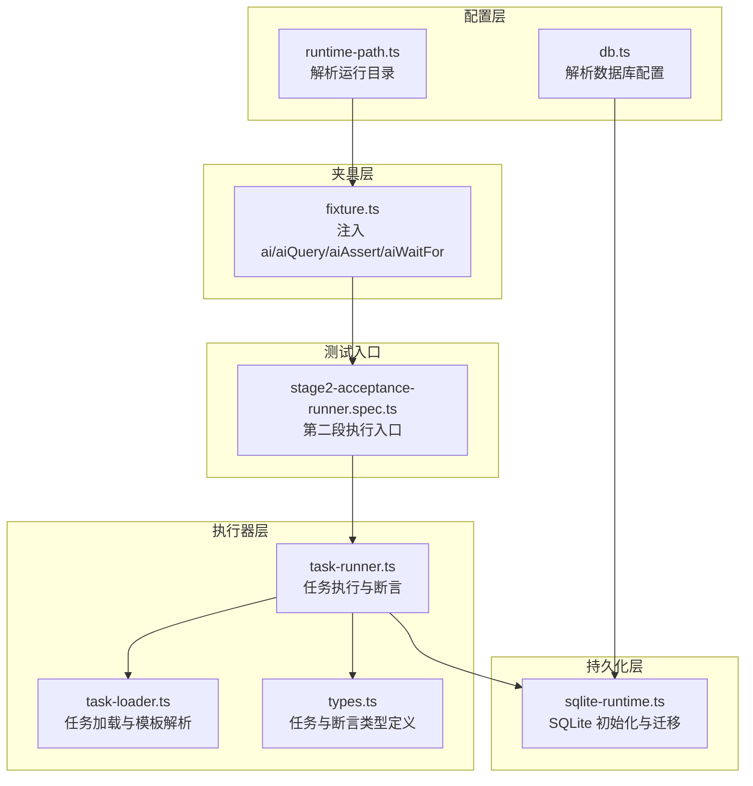
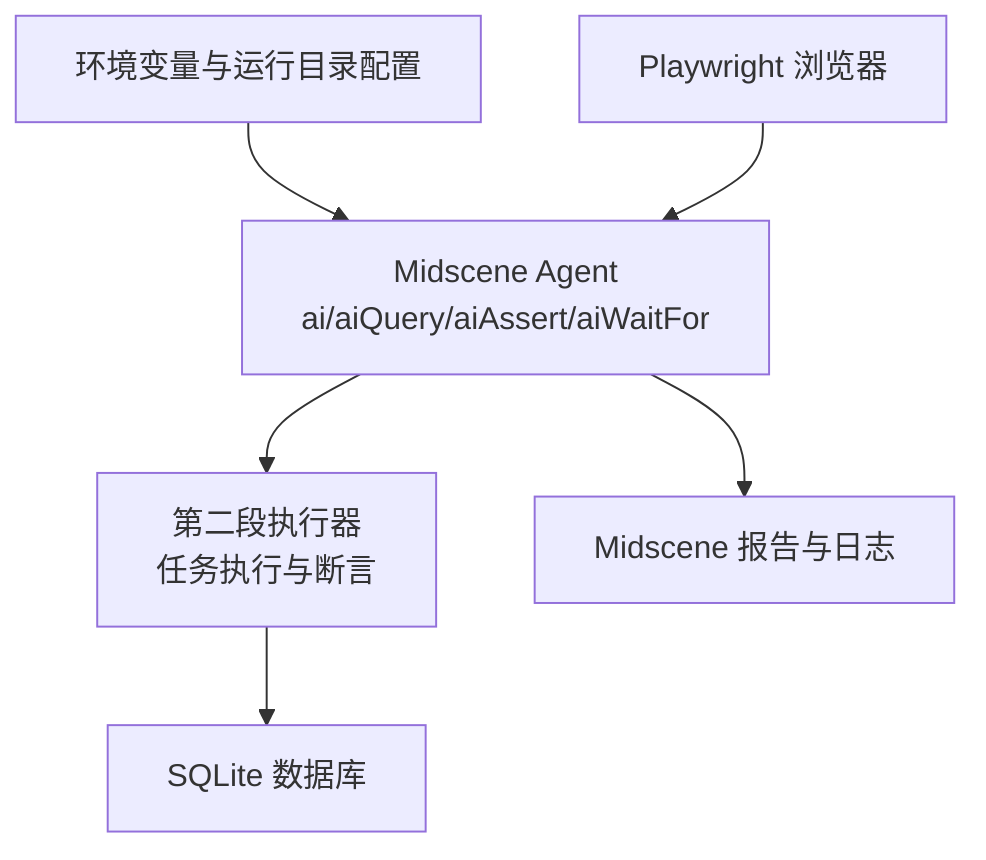
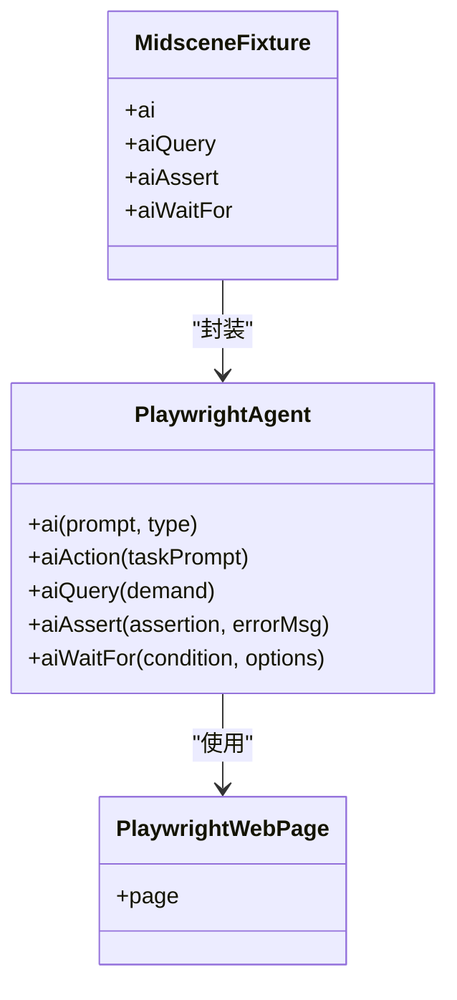
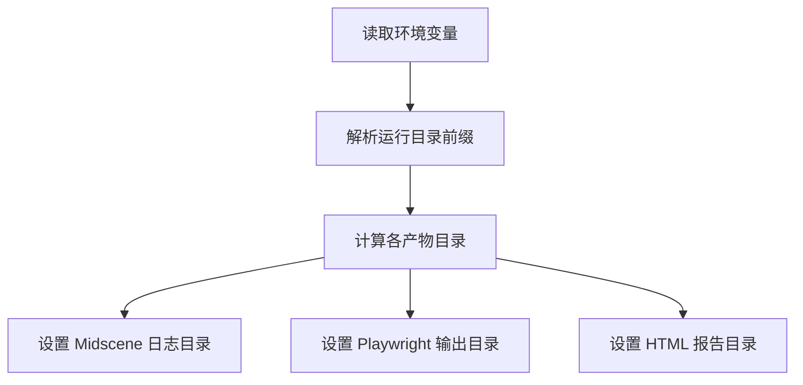
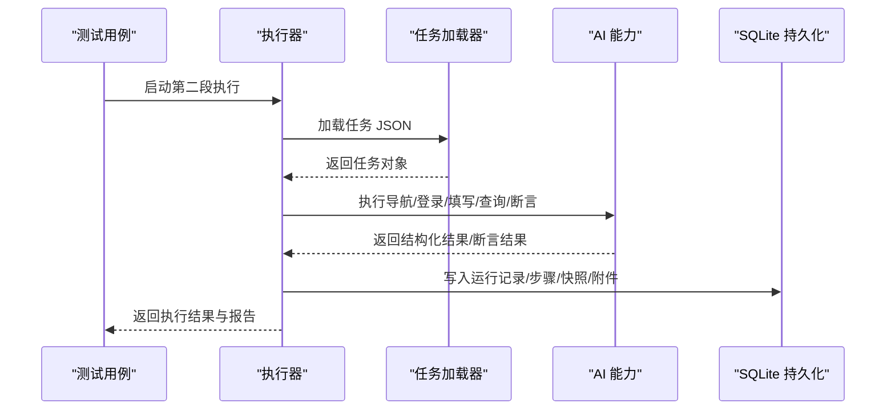
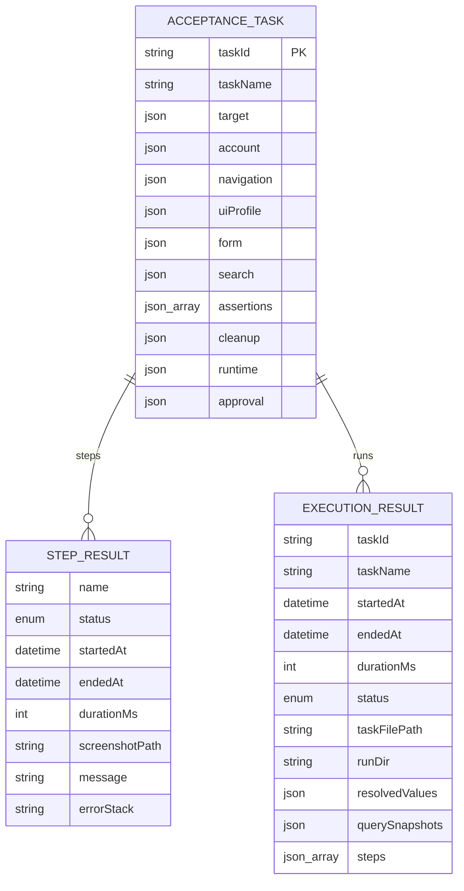
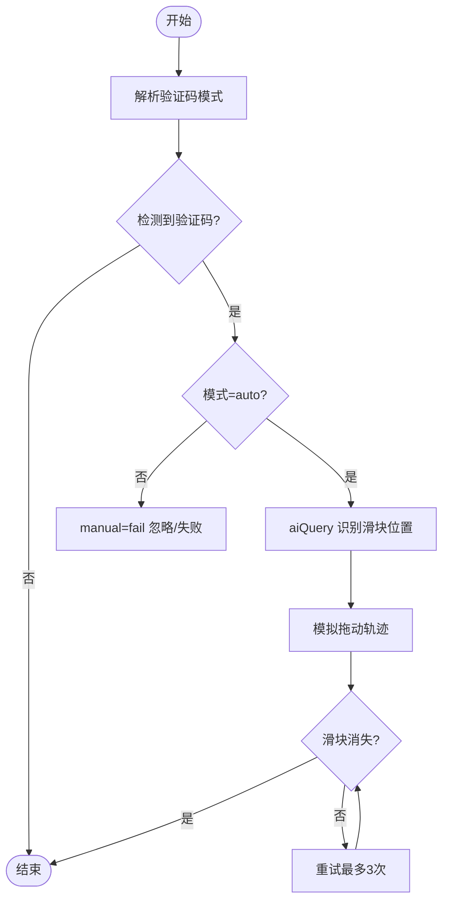
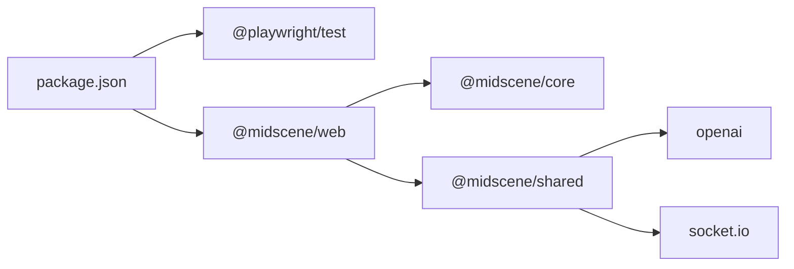

# Midscene AI 能力集成

<cite>
**本文引用的文件**
- [README.md](file://README.md)
- [package.json](file://package.json)
- [playwright.config.ts](file://playwright.config.ts)
- [tests/fixture/fixture.ts](file://tests/fixture/fixture.ts)
- [config/runtime-path.ts](file://config/runtime-path.ts)
- [config/db.ts](file://config/db.ts)
- [src/stage2/task-runner.ts](file://src/stage2/task-runner.ts)
- [src/stage2/types.ts](file://src/stage2/types.ts)
- [src/stage2/task-loader.ts](file://src/stage2/task-loader.ts)
- [src/persistence/sqlite-runtime.ts](file://src/persistence/sqlite-runtime.ts)
- [tests/generated/stage2-acceptance-runner.spec.ts](file://tests/generated/stage2-acceptance-runner.spec.ts)
</cite>

## 目录
1. [简介](#简介)
2. [项目结构](#项目结构)
3. [核心组件](#核心组件)
4. [架构总览](#架构总览)
5. [详细组件分析](#详细组件分析)
6. [依赖关系分析](#依赖关系分析)
7. [性能考量](#性能考量)
8. [故障排查指南](#故障排查指南)
9. [结论](#结论)
10. [附录](#附录)

## 简介
本项目基于 Playwright 与 Midscene.js 构建，提供 AI 驱动的网页自动化测试能力。通过统一的夹具注入 ai、aiQuery、aiAssert、aiWaitFor 等方法，结合 Playwright 的强检测能力，形成“硬检测优先 + AI 断言兜底”的混合策略，覆盖页面元素定位、数据提取、断言验证与条件等待等关键场景，并支持滑块验证码的 AI 自动处理。

## 项目结构
项目采用“配置 + 夹具 + 执行器 + 持久化”的分层组织方式：
- 配置层：环境变量与运行目录解析，集中管理输出目录、Midscene 日志目录、数据库路径等
- 夹具层：在 Playwright 测试中注入 Midscene Agent，暴露 ai、aiQuery、aiAssert、aiWaitFor 等方法
- 执行器层：第二段任务执行器，负责读取任务 JSON、执行步骤、断言与清理、生成结果与截图
- 持久化层：SQLite 数据库存储结构化运行记录、步骤、快照与附件元数据

图表来源
- [config/runtime-path.ts:1-41](file://config/runtime-path.ts#L1-L41)
- [config/db.ts:1-28](file://config/db.ts#L1-L28)
- [tests/fixture/fixture.ts:1-100](file://tests/fixture/fixture.ts#L1-L100)
- [src/stage2/task-runner.ts:1-200](file://src/stage2/task-runner.ts#L1-L200)
- [src/stage2/task-loader.ts:1-91](file://src/stage2/task-loader.ts#L1-L91)
- [src/stage2/types.ts:1-180](file://src/stage2/types.ts#L1-L180)
- [src/persistence/sqlite-runtime.ts:1-116](file://src/persistence/sqlite-runtime.ts#L1-L116)
- [tests/generated/stage2-acceptance-runner.spec.ts:1-39](file://tests/generated/stage2-acceptance-runner.spec.ts#L1-L39)

章节来源
- [README.md:10-96](file://README.md#L10-L96)
- [config/runtime-path.ts:1-41](file://config/runtime-path.ts#L1-L41)
- [config/db.ts:1-28](file://config/db.ts#L1-L28)
- [tests/fixture/fixture.ts:1-100](file://tests/fixture/fixture.ts#L1-L100)
- [src/stage2/task-runner.ts:1-200](file://src/stage2/task-runner.ts#L1-L200)
- [src/stage2/task-loader.ts:1-91](file://src/stage2/task-loader.ts#L1-L91)
- [src/stage2/types.ts:1-180](file://src/stage2/types.ts#L1-L180)
- [src/persistence/sqlite-runtime.ts:1-116](file://src/persistence/sqlite-runtime.ts#L1-L116)
- [tests/generated/stage2-acceptance-runner.spec.ts:1-39](file://tests/generated/stage2-acceptance-runner.spec.ts#L1-L39)

## 核心组件
- Midscene 夹具注入：在 Playwright 测试中注入 ai、aiQuery、aiAssert、aiWaitFor，统一缓存与报告生成
- 运行时配置：通过环境变量集中管理输出目录、Midscene 日志目录、数据库路径
- 第二段执行器：读取任务 JSON，执行导航、表单填写、查询、断言与清理，生成结构化结果与截图
- SQLite 持久化：初始化数据库、应用迁移、写入运行记录与附件元数据

章节来源
- [tests/fixture/fixture.ts:23-99](file://tests/fixture/fixture.ts#L23-L99)
- [config/runtime-path.ts:8-40](file://config/runtime-path.ts#L8-L40)
- [src/stage2/task-runner.ts:18-34](file://src/stage2/task-runner.ts#L18-L34)
- [src/persistence/sqlite-runtime.ts:73-114](file://src/persistence/sqlite-runtime.ts#L73-L114)

## 架构总览
系统通过 Playwright 驱动浏览器，Midscene Agent 负责 AI 能力的调用与缓存，执行器负责编排业务流程，持久化层负责结构化数据落库。

图表来源
- [playwright.config.ts:36-40](file://playwright.config.ts#L36-L40)
- [tests/fixture/fixture.ts:23-99](file://tests/fixture/fixture.ts#L23-L99)
- [src/stage2/task-runner.ts:18-34](file://src/stage2/task-runner.ts#L18-L34)
- [src/persistence/sqlite-runtime.ts:73-114](file://src/persistence/sqlite-runtime.ts#L73-L114)

## 详细组件分析

### 夹具与 AI 方法注入
- ai：封装动作型 AI 指令，支持 action/query 类型切换
- aiQuery：结构化数据提取，返回可断言的数据对象
- aiAssert：AI 断言，适合可读性断言与兜底
- aiWaitFor：在 Playwright 常规等待不适用时进行条件等待

图表来源
- [tests/fixture/fixture.ts:23-99](file://tests/fixture/fixture.ts#L23-L99)

章节来源
- [tests/fixture/fixture.ts:23-99](file://tests/fixture/fixture.ts#L23-L99)
- [README.md:139-152](file://README.md#L139-L152)

### 运行时配置与目录管理
- 运行目录前缀与各产物目录通过环境变量统一管理
- Midscene 日志目录设置为运行目录下的 midscene_run
- Playwright 输出目录与 HTML 报告目录同样由环境变量控制

图表来源
- [config/runtime-path.ts:8-40](file://config/runtime-path.ts#L8-L40)
- [playwright.config.ts:24-40](file://playwright.config.ts#L24-L40)

章节来源
- [config/runtime-path.ts:8-40](file://config/runtime-path.ts#L8-L40)
- [playwright.config.ts:22-40](file://playwright.config.ts#L22-L40)
- [README.md:76-96](file://README.md#L76-L96)

### 第二段执行器与任务编排
- 任务加载：从环境变量或默认路径读取任务 JSON，支持模板变量替换
- 执行流程：导航 → 登录 → 表单填写 → 查询/断言 → 清理
- 断言策略：优先 Playwright 硬检测，AI 断言作为兜底，带重试与软断言支持
- 滑块验证码：支持 auto/manual/fail/ignore 四种模式，auto 模式下使用 AI 识别 + Playwright 模拟拖动

图表来源
- [tests/generated/stage2-acceptance-runner.spec.ts:12-37](file://tests/generated/stage2-acceptance-runner.spec.ts#L12-L37)
- [src/stage2/task-runner.ts:18-34](file://src/stage2/task-runner.ts#L18-L34)
- [src/stage2/task-loader.ts:79-89](file://src/stage2/task-loader.ts#L79-L89)
- [src/persistence/sqlite-runtime.ts:73-114](file://src/persistence/sqlite-runtime.ts#L73-L114)

章节来源
- [src/stage2/task-runner.ts:18-34](file://src/stage2/task-runner.ts#L18-L34)
- [src/stage2/task-runner.ts:1529-1917](file://src/stage2/task-runner.ts#L1529-L1917)
- [src/stage2/task-loader.ts:71-89](file://src/stage2/task-loader.ts#L71-L89)
- [README.md:64-74](file://README.md#L64-L74)

### 数据模型与断言类型
- AcceptanceTask：任务主体，包含目标地址、账号、导航、表单、搜索、断言、清理、运行时配置等
- TaskAssertion：断言类型与参数，支持多种断言策略与重试
- 运行结果：包含步骤、截图路径、持续时间、状态等

图表来源
- [src/stage2/types.ts:141-180](file://src/stage2/types.ts#L141-L180)

章节来源
- [src/stage2/types.ts:141-180](file://src/stage2/types.ts#L141-L180)

### 滑块验证码自动处理流程
- 模式解析：从环境变量读取模式与等待超时
- 检测：通过选择器与文本模式识别验证码
- AI 识别：使用 aiQuery 获取滑块位置与滑槽宽度
- 模拟拖动：使用 Playwright mouse API，15 步渐进 + easeOut 缓动 + 随机抖动
- 验证：最多重试 3 次，确认滑块消失

图表来源
- [src/stage2/task-runner.ts:35-87](file://src/stage2/task-runner.ts#L35-L87)
- [src/stage2/task-runner.ts:1529-1917](file://src/stage2/task-runner.ts#L1529-L1917)

章节来源
- [src/stage2/task-runner.ts:35-87](file://src/stage2/task-runner.ts#L35-L87)
- [README.md:64-74](file://README.md#L64-L74)

## 依赖关系分析
- 运行时依赖：@playwright/test、@midscene/web、dotenv
- Midscene 依赖链：@midscene/web 依赖 @midscene/core 与 @midscene/shared，后者包含 OpenAI SDK、Socket.IO 等
- Playwright 配置：启用 Midscene 报告器，设置输出目录与 HTML 报告目录

图表来源
- [package.json:15-24](file://package.json#L15-L24)
- [package.json:1061-1094](file://package.json#L1061-L1094)

章节来源
- [package.json:15-24](file://package.json#L15-L24)
- [playwright.config.ts:36-40](file://playwright.config.ts#L36-L40)

## 性能考量
- 缓存与报告：夹具注入时设置 generateReport 与缓存 ID，有助于减少重复计算与提升可追溯性
- 重试与超时：断言与等待支持重试次数与超时配置，避免瞬时波动导致失败
- 截图与日志：在关键节点生成截图与日志，便于定位问题
- 模型与网络：合理设置模型名称与基础地址，避免频繁切换模型造成延迟

章节来源
- [tests/fixture/fixture.ts:26-33](file://tests/fixture/fixture.ts#L26-L33)
- [src/stage2/task-runner.ts:1529-1556](file://src/stage2/task-runner.ts#L1529-L1556)
- [README.md:146-152](file://README.md#L146-L152)

## 故障排查指南
- 环境变量缺失：确保 OPENAI_API_KEY、OPENAI_BASE_URL、MIDSCENE_MODEL_NAME、运行目录等环境变量正确配置
- Midscene 日志目录：确认 setLogDir 设置为 resolveRuntimePath(midsceneRunDir) 且目录可写
- 数据库初始化：执行数据库初始化与迁移脚本，确保 SQLite 文件存在且迁移成功
- 任务文件：检查 STAGE2_TASK_FILE 指向的任务 JSON 是否存在且结构完整
- 报告与产物：执行完成后查看 Playwright HTML 报告与 Midscene 报告目录，定位失败步骤

章节来源
- [README.md:39-54](file://README.md#L39-L54)
- [tests/fixture/fixture.ts:10](file://tests/fixture/fixture.ts#L10)
- [src/persistence/sqlite-runtime.ts:73-114](file://src/persistence/sqlite-runtime.ts#L73-L114)
- [src/stage2/task-loader.ts:79-89](file://src/stage2/task-loader.ts#L79-L89)
- [README.md:160-164](file://README.md#L160-L164)

## 结论
本项目通过统一夹具与执行器，将 Midscene 的 AI 能力与 Playwright 的强检测能力有机结合，形成稳定高效的自动化测试体系。借助结构化的任务 JSON、完善的断言策略与 SQLite 持久化，能够有效提升测试的准确性与可维护性。建议在复杂场景中优先使用 Playwright 硬检测，AI 能力作为兜底与增强，同时合理配置缓存与重试策略以获得更佳的性能与稳定性。

## 附录
- 运行命令与入口：通过 npm scripts 启动第二段执行器，或直接使用 Playwright CLI
- 产物目录：统一收敛至 t_runtime/ 下，包含 test-results、playwright-report、midscene_run、acceptance-results、db 等

章节来源
- [package.json:6-11](file://package.json#L6-L11)
- [README.md:154-180](file://README.md#L154-L180)