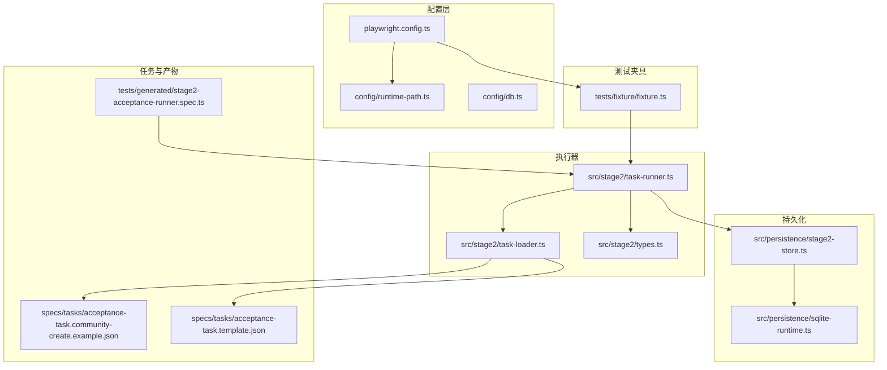
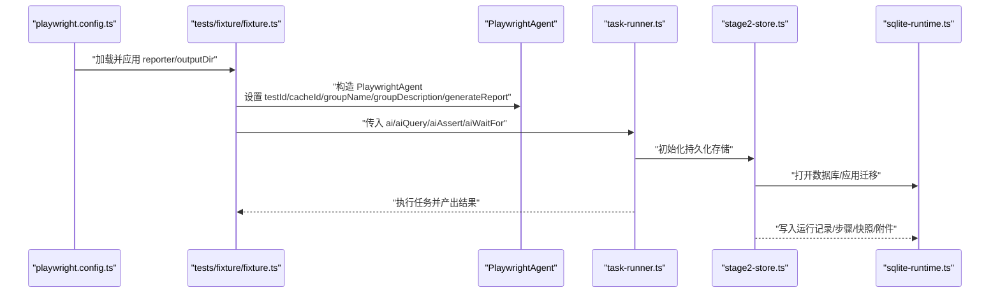
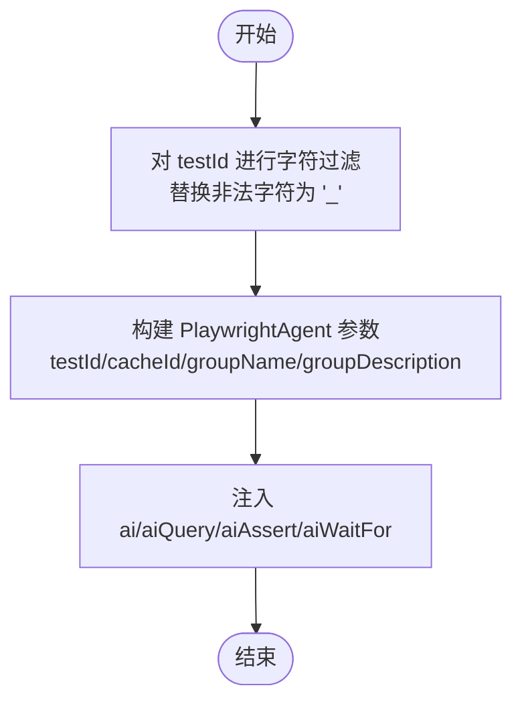
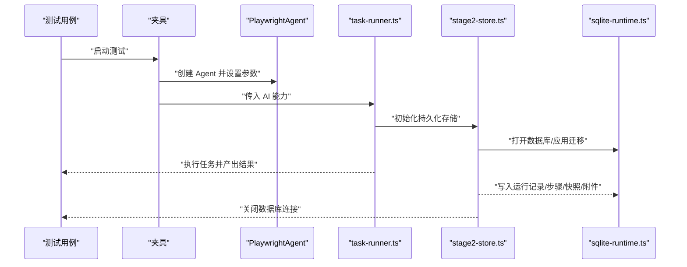
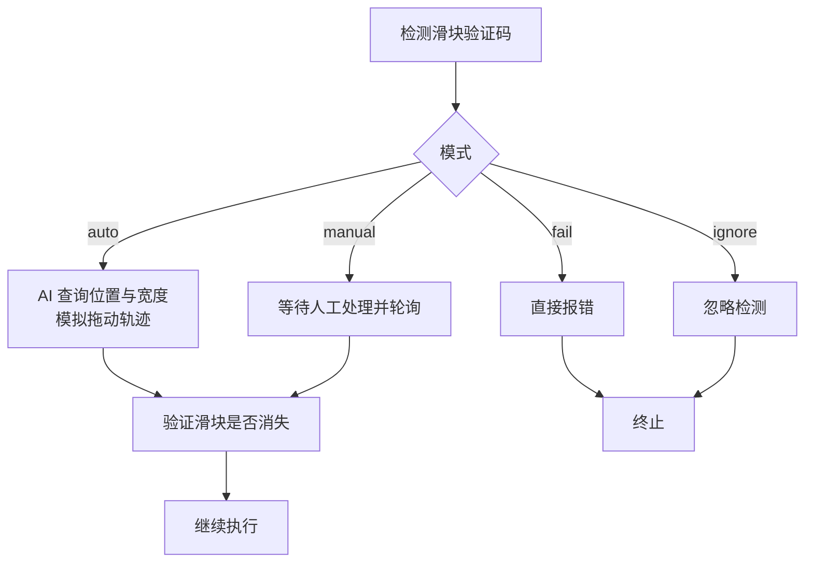
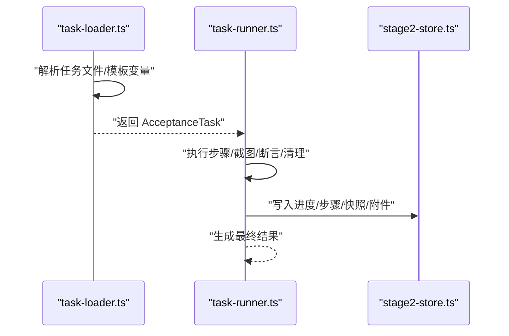
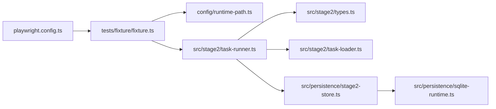

# Midscene 配置与初始化

<cite>
**本文引用的文件**
- [playwright.config.ts](file://playwright.config.ts)
- [package.json](file://package.json)
- [README.md](file://README.md)
- [config/runtime-path.ts](file://config/runtime-path.ts)
- [config/db.ts](file://config/db.ts)
- [src/persistence/sqlite-runtime.ts](file://src/persistence/sqlite-runtime.ts)
- [src/persistence/stage2-store.ts](file://src/persistence/stage2-store.ts)
- [src/stage2/task-runner.ts](file://src/stage2/task-runner.ts)
- [src/stage2/task-loader.ts](file://src/stage2/task-loader.ts)
- [src/stage2/types.ts](file://src/stage2/types.ts)
- [tests/fixture/fixture.ts](file://tests/fixture/fixture.ts)
- [tests/generated/stage2-acceptance-runner.spec.ts](file://tests/generated/stage2-acceptance-runner.spec.ts)
- [specs/tasks/acceptance-task.community-create.example.json](file://specs/tasks/acceptance-task.community-create.example.json)
- [specs/tasks/acceptance-task.template.json](file://specs/tasks/acceptance-task.template.json)
</cite>

## 目录
1. [简介](#简介)
2. [项目结构](#项目结构)
3. [核心组件](#核心组件)
4. [架构总览](#架构总览)
5. [详细组件分析](#详细组件分析)
6. [依赖关系分析](#依赖关系分析)
7. [性能考虑](#性能考虑)
8. [故障排除指南](#故障排除指南)
9. [结论](#结论)
10. [附录](#附录)

## 简介
本文件面向 Midscene 在本项目中的配置与初始化，重点覆盖以下方面：
- PlaywrightAgent 的创建参数与初始化流程
- 缓存机制与缓存 ID 的安全处理策略
- 报告生成与 Midscene 日志目录设置
- 运行时路径配置对 AI 能力的影响（日志目录、资源管理）
- 配置项详解：testId、cacheId、groupName、groupDescription 等
- AI 能力生命周期管理：测试前后资源清理与状态重置
- 故障排除与常见问题解决

## 项目结构
项目采用分层组织：配置层（环境变量与路径）、测试夹具（Midscene Agent 注入）、执行器（Stage2 任务执行）、持久化（SQLite 数据库与文件产物）。

图表来源
- [playwright.config.ts:1-95](file://playwright.config.ts#L1-L95)
- [config/runtime-path.ts:1-41](file://config/runtime-path.ts#L1-L41)
- [config/db.ts:1-28](file://config/db.ts#L1-L28)
- [tests/fixture/fixture.ts:1-100](file://tests/fixture/fixture.ts#L1-L100)
- [src/stage2/task-runner.ts:1-800](file://src/stage2/task-runner.ts#L1-L800)
- [src/stage2/task-loader.ts:1-91](file://src/stage2/task-loader.ts#L1-L91)
- [src/stage2/types.ts:1-180](file://src/stage2/types.ts#L1-L180)
- [src/persistence/sqlite-runtime.ts:1-116](file://src/persistence/sqlite-runtime.ts#L1-L116)
- [src/persistence/stage2-store.ts:1-655](file://src/persistence/stage2-store.ts#L1-L655)
- [tests/generated/stage2-acceptance-runner.spec.ts:1-39](file://tests/generated/stage2-acceptance-runner.spec.ts#L1-L39)
- [specs/tasks/acceptance-task.community-create.example.json:1-229](file://specs/tasks/acceptance-task.community-create.example.json#L1-L229)
- [specs/tasks/acceptance-task.template.json:1-141](file://specs/tasks/acceptance-task.template.json#L1-L141)

章节来源
- [playwright.config.ts:1-95](file://playwright.config.ts#L1-L95)
- [README.md:1-229](file://README.md#L1-L229)

## 核心组件
- 运行时路径配置：集中通过环境变量与 runtime-path.ts 解析输出目录、报告目录、Midscene 运行目录等，保证所有产物收敛到 t_runtime/ 下。
- 测试夹具注入：在 tests/fixture/fixture.ts 中创建 PlaywrightAgent，注入 ai、aiQuery、aiAssert、aiWaitFor 等 AI 能力，并设置日志目录。
- 任务加载与执行：src/stage2/task-loader.ts 加载 JSON 任务，src/stage2/task-runner.ts 执行任务并进行滑块验证码处理、截图、断言与清理。
- 数据持久化：src/persistence/stage2-store.ts 将运行结果、步骤、快照、附件写入 SQLite，sqlite-runtime.ts 提供数据库初始化与迁移能力。
- Playwright 配置：playwright.config.ts 统一配置输出目录、HTML 报告、并行度、重试策略等。

章节来源
- [config/runtime-path.ts:1-41](file://config/runtime-path.ts#L1-L41)
- [tests/fixture/fixture.ts:1-100](file://tests/fixture/fixture.ts#L1-L100)
- [src/stage2/task-loader.ts:1-91](file://src/stage2/task-loader.ts#L1-L91)
- [src/stage2/task-runner.ts:1-800](file://src/stage2/task-runner.ts#L1-L800)
- [src/persistence/stage2-store.ts:1-655](file://src/persistence/stage2-store.ts#L1-L655)
- [src/persistence/sqlite-runtime.ts:1-116](file://src/persistence/sqlite-runtime.ts#L1-L116)
- [playwright.config.ts:1-95](file://playwright.config.ts#L1-L95)

## 架构总览
Midscene 在本项目中的初始化与配置链路如下：

图表来源
- [playwright.config.ts:22-40](file://playwright.config.ts#L22-L40)
- [tests/fixture/fixture.ts:23-98](file://tests/fixture/fixture.ts#L23-L98)
- [src/stage2/task-runner.ts:1-800](file://src/stage2/task-runner.ts#L1-L800)
- [src/persistence/stage2-store.ts:101-123](file://src/persistence/stage2-store.ts#L101-L123)
- [src/persistence/sqlite-runtime.ts:73-84](file://src/persistence/sqlite-runtime.ts#L73-L84)

## 详细组件分析

### PlaywrightAgent 创建与初始化
- 夹具在 tests/fixture/fixture.ts 中为每个测试用例创建 PlaywrightAgent 实例，注入 ai、aiQuery、aiAssert、aiWaitFor。
- 关键参数：
  - testId：使用安全化的 testId，避免非法字符
  - cacheId：使用安全化的 cacheId，避免非法字符
  - groupName：使用测试标题
  - groupDescription：使用测试文件路径
  - generateReport：启用报告生成
  - autoPrintReportMsg：关闭自动打印报告消息
- 日志目录通过 setLogDir 设置为 Midscene 运行目录，该目录由 runtime-path.ts 解析。

章节来源
- [tests/fixture/fixture.ts:12-14](file://tests/fixture/fixture.ts#L12-L14)
- [tests/fixture/fixture.ts:23-98](file://tests/fixture/fixture.ts#L23-L98)
- [config/runtime-path.ts:28-36](file://config/runtime-path.ts#L28-L36)

### 缓存 ID 安全处理与测试 ID 规范化
- 字符过滤：使用正则将非法字符替换为下划线，确保文件系统安全
- 测试 ID 规范化：在夹具中对 testId 进行安全化处理，避免路径与文件系统冲突
- 影响范围：cacheId 与 testId 同步规范化，保障 Midscene 缓存、报告与截图的命名一致性

图表来源
- [tests/fixture/fixture.ts:12-14](file://tests/fixture/fixture.ts#L12-L14)
- [tests/fixture/fixture.ts:23-98](file://tests/fixture/fixture.ts#L23-L98)

章节来源
- [tests/fixture/fixture.ts:12-14](file://tests/fixture/fixture.ts#L12-L14)
- [tests/fixture/fixture.ts:23-98](file://tests/fixture/fixture.ts#L23-L98)

### 报告生成与日志目录设置
- Midscene 报告与日志目录：由 runtime-path.ts 读取环境变量并解析为绝对路径
- Playwright HTML 报告：在 playwright.config.ts 中配置 reporter，输出到 PLAYWRIGHT_HTML_REPORT_DIR
- Midscene 日志目录：在夹具中通过 setLogDir 设置为 MIDSCENE_RUN_DIR

章节来源
- [config/runtime-path.ts:28-36](file://config/runtime-path.ts#L28-L36)
- [playwright.config.ts:36-40](file://playwright.config.ts#L36-L40)
- [tests/fixture/fixture.ts:10](file://tests/fixture/fixture.ts#L10)

### 运行时路径配置对 AI 能力的影响
- 日志目录：Midscene 日志、缓存、报告均落盘到 MIDSCENE_RUN_DIR，便于统一管理与排查
- 资源管理：截图、报告、结果文件均收敛到 t_runtime/ 下，避免污染工作区
- 产物路径：通过 resolveRuntimePath 统一解析，确保跨平台兼容

章节来源
- [config/runtime-path.ts:38-40](file://config/runtime-path.ts#L38-L40)
- [README.md:76-96](file://README.md#L76-L96)

### 配置项详解与最佳实践
- testId：唯一标识一次测试执行，建议包含测试用例标识与安全化处理
- cacheId：缓存键，建议与 testId 保持一致或与测试用例强关联
- groupName：测试标题，用于报告分组
- groupDescription：测试文件路径，便于溯源
- generateReport：开启后 Midscene 生成结构化报告
- autoPrintReportMsg：关闭自动打印，避免噪声
- 运行时路径相关：
  - RUNTIME_DIR_PREFIX：运行产物根目录前缀
  - PLAYWRIGHT_OUTPUT_DIR：Playwright 执行产物目录
  - PLAYWRIGHT_HTML_REPORT_DIR：Playwright HTML 报告目录
  - MIDSCENE_RUN_DIR：Midscene 运行日志、缓存、报告根目录
  - ACCEPTANCE_RESULT_DIR：第二段结构化结果目录
  - DB_FILE_PATH：SQLite 文件路径
- 最佳实践：
  - 所有路径统一收敛到 t_runtime/
  - 对敏感信息（如密码）在持久化时做掩码处理
  - 使用安全化的 cacheId/testId，避免非法字符

章节来源
- [tests/fixture/fixture.ts:23-98](file://tests/fixture/fixture.ts#L23-L98)
- [config/runtime-path.ts:8-36](file://config/runtime-path.ts#L8-L36)
- [README.md:39-54](file://README.md#L39-L54)
- [src/persistence/stage2-store.ts:37-48](file://src/persistence/stage2-store.ts#L37-L48)

### AI 能力生命周期管理
- 初始化：夹具在每个测试用例开始时创建 PlaywrightAgent
- 执行：通过 ai/aiQuery/aiAssert/aiWaitFor 执行 AI 操作与断言
- 清理：任务结束后写入最终结果、步骤、快照与附件
- 关闭：持久化存储在 finishRun 后关闭数据库连接，避免资源泄漏

图表来源
- [tests/fixture/fixture.ts:23-98](file://tests/fixture/fixture.ts#L23-L98)
- [src/stage2/task-runner.ts:1-800](file://src/stage2/task-runner.ts#L1-L800)
- [src/persistence/stage2-store.ts:101-123](file://src/persistence/stage2-store.ts#L101-L123)
- [src/persistence/sqlite-runtime.ts:73-84](file://src/persistence/sqlite-runtime.ts#L73-L84)

章节来源
- [tests/fixture/fixture.ts:23-98](file://tests/fixture/fixture.ts#L23-L98)
- [src/stage2/task-runner.ts:1-800](file://src/stage2/task-runner.ts#L1-L800)
- [src/persistence/stage2-store.ts:632-640](file://src/persistence/stage2-store.ts#L632-L640)

### 滑块验证码处理与 AI 能力集成
- 检测：通过文本与选择器模式检测滑块验证码
- 自动处理：AI 查询滑块位置与滑槽宽度，Playwright 模拟真人拖动轨迹
- 模式控制：支持 auto/manual/fail/ignore 四种模式，可通过环境变量配置
- 超时控制：人工模式下可配置等待超时时间

图表来源
- [src/stage2/task-runner.ts:483-501](file://src/stage2/task-runner.ts#L483-L501)
- [src/stage2/task-runner.ts:650-706](file://src/stage2/task-runner.ts#L650-L706)
- [README.md:56-62](file://README.md#L56-L62)

章节来源
- [src/stage2/task-runner.ts:483-501](file://src/stage2/task-runner.ts#L483-L501)
- [src/stage2/task-runner.ts:650-706](file://src/stage2/task-runner.ts#L650-L706)
- [README.md:56-62](file://README.md#L56-L62)

### 任务加载与执行流程
- 任务文件解析：从环境变量或默认路径加载 JSON 任务，进行模板变量替换与字段校验
- 执行器：按步骤执行，支持截图、断言、清理与持久化
- 产物：生成结构化结果、截图、报告与数据库记录

图表来源
- [src/stage2/task-loader.ts:71-91](file://src/stage2/task-loader.ts#L71-L91)
- [src/stage2/task-runner.ts:1-800](file://src/stage2/task-runner.ts#L1-L800)
- [src/persistence/stage2-store.ts:470-630](file://src/persistence/stage2-store.ts#L470-L630)

章节来源
- [src/stage2/task-loader.ts:71-91](file://src/stage2/task-loader.ts#L71-L91)
- [src/stage2/task-runner.ts:1-800](file://src/stage2/task-runner.ts#L1-L800)
- [src/persistence/stage2-store.ts:470-630](file://src/persistence/stage2-store.ts#L470-L630)

## 依赖关系分析
- 夹具依赖 runtime-path.ts 解析 Midscene 日志目录
- 执行器依赖任务模型 types.ts 与任务加载器 task-loader.ts
- 持久化依赖 sqlite-runtime.ts 提供数据库初始化与迁移
- Playwright 配置影响输出目录与报告生成

图表来源
- [tests/fixture/fixture.ts:10](file://tests/fixture/fixture.ts#L10)
- [config/runtime-path.ts:1-41](file://config/runtime-path.ts#L1-L41)
- [src/stage2/task-runner.ts:1-800](file://src/stage2/task-runner.ts#L1-L800)
- [src/stage2/types.ts:1-180](file://src/stage2/types.ts#L1-L180)
- [src/stage2/task-loader.ts:1-91](file://src/stage2/task-loader.ts#L1-L91)
- [src/persistence/stage2-store.ts:1-655](file://src/persistence/stage2-store.ts#L1-L655)
- [src/persistence/sqlite-runtime.ts:1-116](file://src/persistence/sqlite-runtime.ts#L1-L116)
- [playwright.config.ts:1-95](file://playwright.config.ts#L1-L95)

章节来源
- [tests/fixture/fixture.ts:10](file://tests/fixture/fixture.ts#L10)
- [config/runtime-path.ts:1-41](file://config/runtime-path.ts#L1-L41)
- [src/stage2/task-runner.ts:1-800](file://src/stage2/task-runner.ts#L1-L800)
- [src/stage2/types.ts:1-180](file://src/stage2/types.ts#L1-L180)
- [src/stage2/task-loader.ts:1-91](file://src/stage2/task-loader.ts#L1-L91)
- [src/persistence/stage2-store.ts:1-655](file://src/persistence/stage2-store.ts#L1-L655)
- [src/persistence/sqlite-runtime.ts:1-116](file://src/persistence/sqlite-runtime.ts#L1-L116)
- [playwright.config.ts:1-95](file://playwright.config.ts#L1-L95)

## 性能考虑
- 并行与重试：Playwright 配置了并行执行与 CI 环境下的重试策略，有助于提升稳定性
- 截图与报告：合理控制截图频率与报告生成，避免 IO 压力过大
- 数据库写入：批量写入与事务控制（迁移应用时使用事务）降低写入开销
- 超时设置：为滑块处理、页面等待与断言设置合理的超时，避免长时间阻塞

章节来源
- [playwright.config.ts:26-34](file://playwright.config.ts#L26-L34)
- [src/stage2/task-runner.ts:77-87](file://src/stage2/task-runner.ts#L77-L87)
- [src/persistence/sqlite-runtime.ts:104-113](file://src/persistence/sqlite-runtime.ts#L104-L113)

## 故障排除指南
- Midscene 日志目录不可写
  - 检查 MIDSCENE_RUN_DIR 是否正确解析为绝对路径
  - 确认目录存在且具备写权限
- 报告无法生成或路径异常
  - 检查 PLAYWRIGHT_HTML_REPORT_DIR 与 PLAYWRIGHT_OUTPUT_DIR
  - 确认 reporter 配置包含 HTML 与 Midscene 报告器
- 缓存 ID 包含非法字符导致文件系统异常
  - 使用夹具中的字符过滤逻辑，确保 cacheId/testId 安全化
- 滑块验证码自动处理失败
  - 切换为 manual 模式并增加等待超时
  - 检查页面截图确认滑块样式与检测选择器
- 数据库初始化失败
  - 确认 DB_DRIVER 为 sqlite，DB_FILE_PATH 存在且可写
  - 执行数据库初始化与迁移脚本

章节来源
- [config/runtime-path.ts:38-40](file://config/runtime-path.ts#L38-L40)
- [playwright.config.ts:36-40](file://playwright.config.ts#L36-L40)
- [tests/fixture/fixture.ts:12-14](file://tests/fixture/fixture.ts#L12-L14)
- [src/stage2/task-runner.ts:650-706](file://src/stage2/task-runner.ts#L650-L706)
- [config/db.ts:20-26](file://config/db.ts#L20-L26)
- [README.md:120-130](file://README.md#L120-L130)

## 结论
本项目通过统一的运行时路径配置、安全化的缓存 ID 处理、完善的报告与日志目录设置，以及清晰的 AI 能力生命周期管理，实现了 Midscene 在 Playwright 环境中的稳定与可维护性。配合 SQLite 数据持久化与任务 JSON 驱动，能够高效地完成端到端验收测试与结果归档。

## 附录
- 环境变量参考
  - OPENAI_API_KEY、OPENAI_BASE_URL、MIDSCENE_MODEL_NAME：AI 模型接入
  - RUNTIME_DIR_PREFIX、PLAYWRIGHT_OUTPUT_DIR、PLAYWRIGHT_HTML_REPORT_DIR、MIDSCENE_RUN_DIR、ACCEPTANCE_RESULT_DIR：运行产物目录
  - DB_DRIVER、DB_FILE_PATH：数据库配置
  - STAGE2_TASK_FILE、STAGE2_REQUIRE_APPROVAL、STAGE2_CAPTCHA_MODE、STAGE2_CAPTCHA_WAIT_TIMEOUT_MS：第二段执行配置
- 任务 JSON 字段参考
  - taskId、taskName、target、account、navigation、uiProfile、form、search、assertions、cleanup、runtime、approval

章节来源
- [README.md:39-54](file://README.md#L39-L54)
- [specs/tasks/acceptance-task.community-create.example.json:1-229](file://specs/tasks/acceptance-task.community-create.example.json#L1-L229)
- [specs/tasks/acceptance-task.template.json:1-141](file://specs/tasks/acceptance-task.template.json#L1-L141)