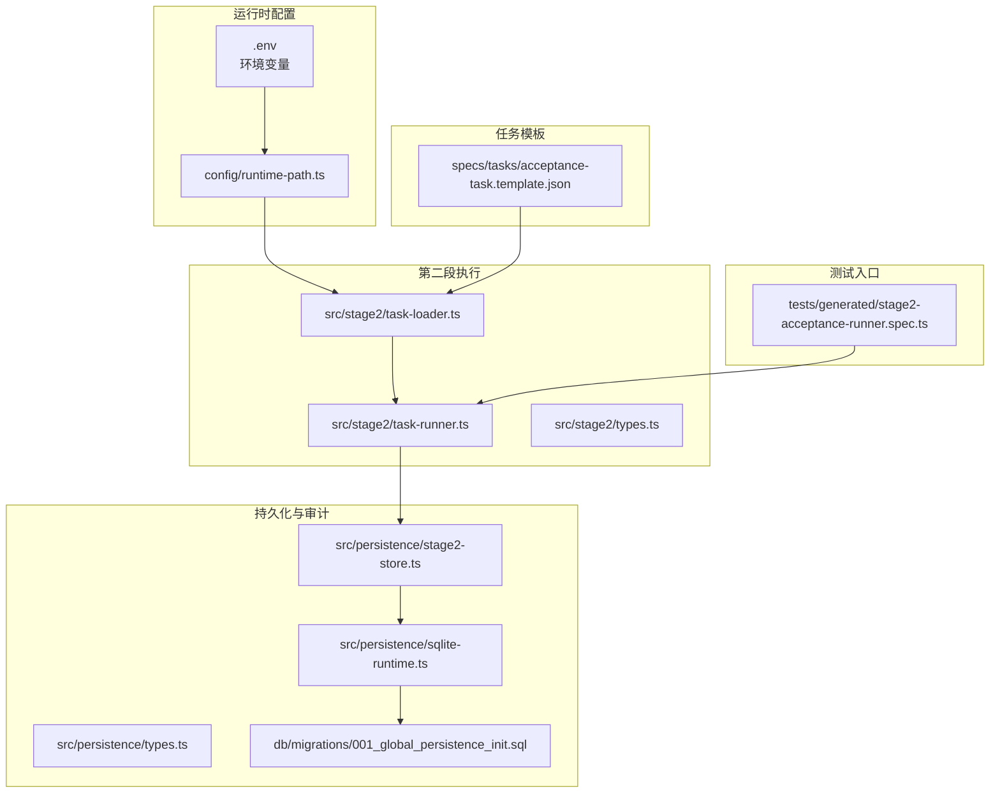
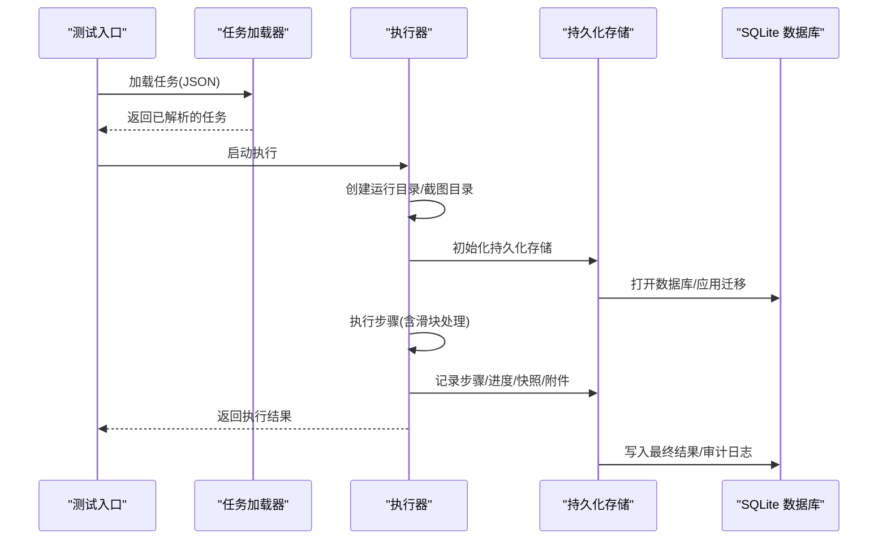
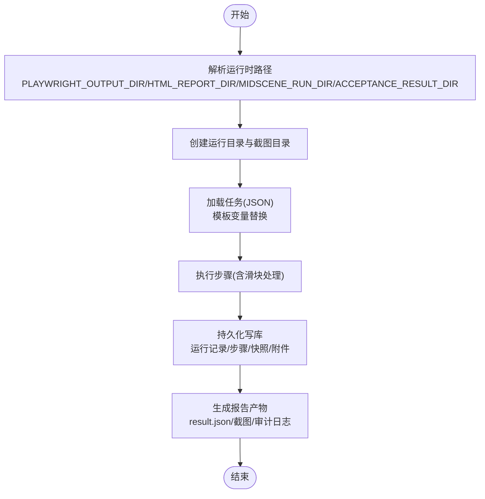
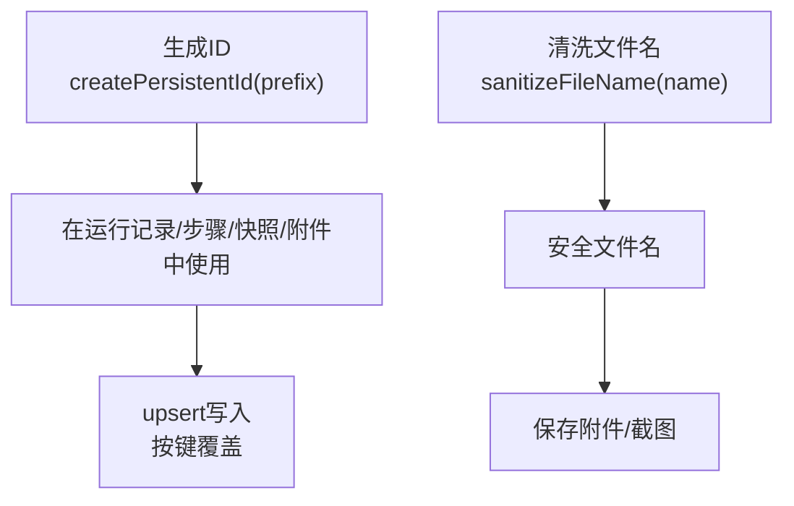
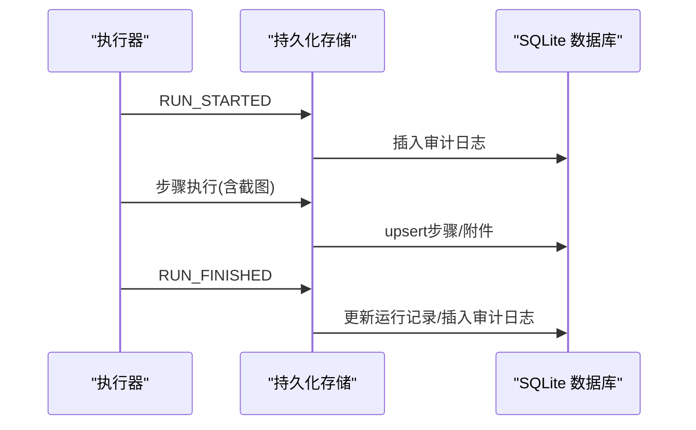
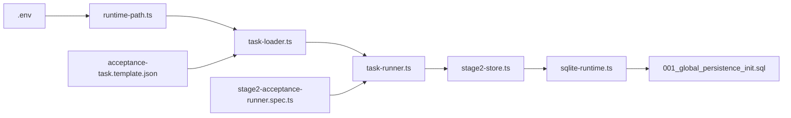

# 报告生成与缓存机制

<cite>
**本文引用的文件**
- [README.md](file://README.md)
- [package.json](file://package.json)
- [config/runtime-path.ts](file://config/runtime-path.ts)
- [src/persistence/sqlite-runtime.ts](file://src/persistence/sqlite-runtime.ts)
- [src/persistence/stage2-store.ts](file://src/persistence/stage2-store.ts)
- [src/persistence/types.ts](file://src/persistence/types.ts)
- [src/stage2/task-runner.ts](file://src/stage2/task-runner.ts)
- [src/stage2/task-loader.ts](file://src/stage2/task-loader.ts)
- [src/stage2/types.ts](file://src/stage2/types.ts)
- [tests/generated/stage2-acceptance-runner.spec.ts](file://tests/generated/stage2-acceptance-runner.spec.ts)
- [specs/tasks/acceptance-task.template.json](file://specs/tasks/acceptance-task.template.json)
- [db/migrations/001_global_persistence_init.sql](file://db/migrations/001_global_persistence_init.sql)
- [scripts/db/common.mjs](file://scripts/db/common.mjs)
</cite>

## 目录
1. [简介](#简介)
2. [项目结构](#项目结构)
3. [核心组件](#核心组件)
4. [架构总览](#架构总览)
5. [详细组件分析](#详细组件分析)
6. [依赖关系分析](#依赖关系分析)
7. [性能考量](#性能考量)
8. [故障排查指南](#故障排查指南)
9. [结论](#结论)
10. [附录](#附录)

## 简介
本文件聚焦于 Midscene 报告生成与缓存机制，结合仓库中的第二段执行器与持久化层，系统性阐述以下主题：
- AI 操作报告的生成流程与配置项（含 generateReport 与 autoPrintReportMsg 的作用边界说明）
- 缓存机制的工作原理（缓存 ID 生成规则、安全字符处理、缓存失效策略）
- 测试组管理机制（groupName 与 groupDescription 的作用与组织方式）
- AI 操作的审计跟踪（操作记录、时间戳与结果追踪）
- 缓存优化策略与性能调优（缓存大小控制与内存管理）
- 报告格式与输出位置配置（HTML 报告生成与日志文件管理）
- 缓存问题排查与性能监控方法

## 项目结构
本项目围绕 Playwright 与 Midscene 的自动化测试执行，形成“任务加载 → 执行器 → 持久化写库 → 报告与审计”的闭环。运行产物统一收敛至 t_runtime/ 目录，便于集中管理与检索。

**图表来源**
- [config/runtime-path.ts:1-46](file://config/runtime-path.ts#L1-L46)
- [src/stage2/task-loader.ts:1-91](file://src/stage2/task-loader.ts#L1-L91)
- [src/stage2/task-runner.ts:1-800](file://src/stage2/task-runner.ts#L1-L800)
- [src/persistence/stage2-store.ts:1-655](file://src/persistence/stage2-store.ts#L1-L655)
- [src/persistence/sqlite-runtime.ts:1-116](file://src/persistence/sqlite-runtime.ts#L1-L116)
- [db/migrations/001_global_persistence_init.sql:1-128](file://db/migrations/001_global_persistence_init.sql#L1-L128)
- [tests/generated/stage2-acceptance-runner.spec.ts:1-39](file://tests/generated/stage2-acceptance-runner.spec.ts#L1-L39)
- [specs/tasks/acceptance-task.template.json:1-141](file://specs/tasks/acceptance-task.template.json#L1-L141)

**章节来源**
- [README.md:78-211](file://README.md#L78-L211)
- [config/runtime-path.ts:1-46](file://config/runtime-path.ts#L1-L46)
- [src/stage2/task-runner.ts:111-120](file://src/stage2/task-runner.ts#L111-L120)

## 核心组件
- 运行时路径解析：统一管理 t_runtime/ 下各产物目录（Playwright 输出、HTML 报告、Midscene 运行目录、结果目录等）。
- 任务加载与模板解析：从 JSON 任务文件加载并进行模板变量替换，保证每次执行的唯一性与可追溯性。
- 执行器与滑块验证码处理：封装 AI 交互、页面等待、断言与滑块自动处理流程。
- 持久化存储与审计：将运行主记录、步骤明细、快照与附件写入 SQLite，并记录审计事件。
- 测试入口：通过 Playwright 测试入口触发第二段执行，失败时汇总失败步骤信息。

**章节来源**
- [config/runtime-path.ts:13-45](file://config/runtime-path.ts#L13-L45)
- [src/stage2/task-loader.ts:71-91](file://src/stage2/task-loader.ts#L71-L91)
- [src/stage2/task-runner.ts:35-87](file://src/stage2/task-runner.ts#L35-L87)
- [src/persistence/stage2-store.ts:74-123](file://src/persistence/stage2-store.ts#L74-L123)
- [tests/generated/stage2-acceptance-runner.spec.ts:12-37](file://tests/generated/stage2-acceptance-runner.spec.ts#L12-L37)

## 架构总览
下图展示从任务加载到执行、持久化与报告输出的关键交互：

**图表来源**
- [tests/generated/stage2-acceptance-runner.spec.ts:12-37](file://tests/generated/stage2-acceptance-runner.spec.ts#L12-L37)
- [src/stage2/task-loader.ts:79-91](file://src/stage2/task-loader.ts#L79-L91)
- [src/stage2/task-runner.ts:111-120](file://src/stage2/task-runner.ts#L111-L120)
- [src/persistence/stage2-store.ts:101-123](file://src/persistence/stage2-store.ts#L101-L123)
- [src/persistence/sqlite-runtime.ts:73-114](file://src/persistence/sqlite-runtime.ts#L73-L114)

## 详细组件分析

### 报告生成与输出位置
- 运行产物统一收敛至 t_runtime/ 下，包含：
  - Playwright 执行产物与 HTML 报告目录
  - Midscene 运行日志、缓存、报告根目录
  - 第二段结果目录（包含 result.json、部分结果与步骤截图）
- 任务模板中提供运行时配置项（如 stepTimeoutMs、pageTimeoutMs、screenshotOnStep、trace），影响执行细节与产物规模。
- 测试入口通过 Playwright 脚本触发执行，并在失败时输出失败步骤与截图路径，便于定位问题。

**图表来源**
- [config/runtime-path.ts:18-41](file://config/runtime-path.ts#L18-L41)
- [src/stage2/task-runner.ts:111-120](file://src/stage2/task-runner.ts#L111-L120)
- [src/stage2/task-loader.ts:79-91](file://src/stage2/task-loader.ts#L79-L91)
- [README.md:165-211](file://README.md#L165-L211)

**章节来源**
- [README.md:78-211](file://README.md#L78-L211)
- [specs/tasks/acceptance-task.template.json:134-139](file://specs/tasks/acceptance-task.template.json#L134-L139)
- [tests/generated/stage2-acceptance-runner.spec.ts:27-36](file://tests/generated/stage2-acceptance-runner.spec.ts#L27-L36)

### 缓存机制与 ID 生成
- 缓存 ID 生成：持久化层使用统一的 ID 生成器，结合时间戳与随机字节，确保全局唯一性。
- 安全字符处理：文件名清洗函数将非法字符替换为安全字符，避免路径与文件名异常。
- 缓存失效策略：当前实现未显式暴露“缓存失效”接口；持久化写库采用“存在即更新”的 upsert 策略，结合内容哈希与唯一键约束，间接实现“按键覆盖”。

**图表来源**
- [src/persistence/sqlite-runtime.ts:24-26](file://src/persistence/sqlite-runtime.ts#L24-L26)
- [src/stage2/task-runner.ts:96-98](file://src/stage2/task-runner.ts#L96-L98)
- [src/persistence/stage2-store.ts:358-395](file://src/persistence/stage2-store.ts#L358-L395)

**章节来源**
- [src/persistence/sqlite-runtime.ts:24-26](file://src/persistence/sqlite-runtime.ts#L24-L26)
- [src/stage2/task-runner.ts:96-98](file://src/stage2/task-runner.ts#L96-L98)
- [src/persistence/stage2-store.ts:358-395](file://src/persistence/stage2-store.ts#L358-L395)

### 测试组管理机制（groupName 与 groupDescription）
- 任务模板中未出现 groupName 与 groupDescription 字段；当前测试组织方式为：
  - 通过测试入口文件集中编排执行
  - 任务文件通过 taskId/taskName 维度进行区分与管理
- 若需扩展分组能力，可在任务模板中增加相应字段并在执行器侧进行适配。

**章节来源**
- [specs/tasks/acceptance-task.template.json:1-141](file://specs/tasks/acceptance-task.template.json#L1-L141)
- [tests/generated/stage2-acceptance-runner.spec.ts:9-37](file://tests/generated/stage2-acceptance-runner.spec.ts#L9-L37)

### 审计跟踪（操作记录、时间戳与结果追踪）
- 审计事件类型：运行开始、运行结束、步骤失败等。
- 时间戳：统一使用数据库日期格式化函数，保证跨平台一致性。
- 结果追踪：持久化层在运行结束时写入最终摘要与错误信息，便于快速定位失败原因。

**图表来源**
- [src/persistence/stage2-store.ts:122](file://src/persistence/stage2-store.ts#L122)
- [src/persistence/stage2-store.ts:305-331](file://src/persistence/stage2-store.ts#L305-L331)
- [src/persistence/stage2-store.ts:592-630](file://src/persistence/stage2-store.ts#L592-L630)
- [src/persistence/sqlite-runtime.ts:13-22](file://src/persistence/sqlite-runtime.ts#L13-L22)

**章节来源**
- [src/persistence/stage2-store.ts:305-331](file://src/persistence/stage2-store.ts#L305-L331)
- [src/persistence/stage2-store.ts:592-630](file://src/persistence/stage2-store.ts#L592-L630)
- [src/persistence/sqlite-runtime.ts:13-22](file://src/persistence/sqlite-runtime.ts#L13-L22)

### AI 操作报告生成流程与配置项
- generateReport 与 autoPrintReportMsg：在当前代码库中未发现这两个参数的直接使用或配置项。第二段执行器通过任务模板与持久化层生成结构化结果与截图，未见显式的“生成报告”开关。
- 建议：若需扩展报告生成，可在执行器侧增加相关配置项，并在持久化层扩展附件类型与产物写入逻辑。

**章节来源**
- [src/stage2/task-runner.ts:111-120](file://src/stage2/task-runner.ts#L111-L120)
- [src/persistence/stage2-store.ts:397-468](file://src/persistence/stage2-store.ts#L397-L468)

## 依赖关系分析
- 运行时路径依赖 dotenv 解析环境变量，统一收敛产物目录。
- 执行器依赖任务加载器解析任务与模板变量，依赖持久化存储写入运行数据。
- 持久化存储依赖 SQLite 运行时工具类进行数据库打开、迁移与 ID 生成。
- 数据库迁移脚本定义了核心表结构与索引，支撑审计与查询。

**图表来源**
- [config/runtime-path.ts:1-46](file://config/runtime-path.ts#L1-L46)
- [src/stage2/task-loader.ts:1-91](file://src/stage2/task-loader.ts#L1-L91)
- [src/stage2/task-runner.ts:1-800](file://src/stage2/task-runner.ts#L1-L800)
- [src/persistence/stage2-store.ts:1-655](file://src/persistence/stage2-store.ts#L1-L655)
- [src/persistence/sqlite-runtime.ts:1-116](file://src/persistence/sqlite-runtime.ts#L1-L116)
- [db/migrations/001_global_persistence_init.sql:1-128](file://db/migrations/001_global_persistence_init.sql#L1-L128)
- [tests/generated/stage2-acceptance-runner.spec.ts:1-39](file://tests/generated/stage2-acceptance-runner.spec.ts#L1-L39)
- [specs/tasks/acceptance-task.template.json:1-141](file://specs/tasks/acceptance-task.template.json#L1-L141)

**章节来源**
- [scripts/db/common.mjs:31-41](file://scripts/db/common.mjs#L31-L41)
- [src/persistence/sqlite-runtime.ts:73-84](file://src/persistence/sqlite-runtime.ts#L73-L84)

## 性能考量
- 缓存大小控制与内存管理
  - 文件名清洗与路径规范化可降低 I/O 异常风险，建议在批量写入时合并事务以提升吞吐。
  - 截图与附件数量直接影响磁盘占用，建议按需开启 screenshotOnStep 并限制最大截图数。
- 迁移与数据库性能
  - 迁移采用逐文件应用并记录校验和，建议在 CI 环境预热数据库以避免首次执行的迁移开销。
- 执行超时与稳定性
  - 通过任务模板中的 stepTimeoutMs/pageTimeoutMs 控制等待与超时，避免长时间阻塞导致资源占用过高。

**章节来源**
- [src/stage2/task-runner.ts:122-129](file://src/stage2/task-runner.ts#L122-L129)
- [specs/tasks/acceptance-task.template.json:134-139](file://specs/tasks/acceptance-task.template.json#L134-L139)
- [src/persistence/sqlite-runtime.ts:86-114](file://src/persistence/sqlite-runtime.ts#L86-L114)

## 故障排查指南
- 滑块验证码处理失败
  - 检查 STAGE2_CAPTCHA_MODE 与 STAGE2_CAPTCHA_WAIT_TIMEOUT_MS 配置，必要时切换为 manual 模式并延长等待时间。
  - 查看 Midscene 运行日志与截图，确认滑块样式与检测选择器是否匹配。
- 执行失败定位
  - 测试入口会在失败时输出失败步骤名称、消息与截图路径，结合持久化层的审计日志与最终摘要快速定位。
- 数据库写入异常
  - 若持久化初始化失败，执行器会记录错误但不阻断执行；建议检查 DB_FILE_PATH 与权限，确保迁移脚本可正常执行。

**章节来源**
- [src/stage2/task-runner.ts:650-706](file://src/stage2/task-runner.ts#L650-L706)
- [tests/generated/stage2-acceptance-runner.spec.ts:27-36](file://tests/generated/stage2-acceptance-runner.spec.ts#L27-L36)
- [src/persistence/stage2-store.ts:643-654](file://src/persistence/stage2-store.ts#L643-L654)

## 结论
本项目通过统一的运行时路径、完善的任务模板与执行器、以及 SQLite 持久化与审计体系，实现了可追溯、可扩展的 AI 自动化测试执行闭环。当前未发现 generateReport 与 autoPrintReportMsg 的直接配置项，但可通过扩展持久化层与执行器来增强报告生成能力。建议在 CI 环境中预热数据库、合理配置截图与超时参数，并利用审计日志与最终摘要进行高效故障排查。

## 附录
- 关键配置项与用途
  - PLAYWRIGHT_OUTPUT_DIR / PLAYWRIGHT_HTML_REPORT_DIR：Playwright 执行产物与 HTML 报告目录
  - MIDSCENE_RUN_DIR：Midscene 运行日志、缓存、报告根目录
  - ACCEPTANCE_RESULT_DIR / STAGE1_RESULT_DIR：第二段/第一段结果目录
  - DB_FILE_PATH：SQLite 数据库文件路径
  - STAGE2_CAPTCHA_MODE / STAGE2_CAPTCHA_WAIT_TIMEOUT_MS：滑块验证码处理模式与等待时长
- 运行命令
  - npm run stage2:run / npm run stage2:run:headed：执行第二段测试
  - npm run db:init / npm run db:migrate：初始化与迁移数据库

**章节来源**
- [README.md:39-56](file://README.md#L39-L56)
- [README.md:159-168](file://README.md#L159-L168)
- [README.md:124-134](file://README.md#L124-L134)
- [package.json:6-12](file://package.json#L6-L12)